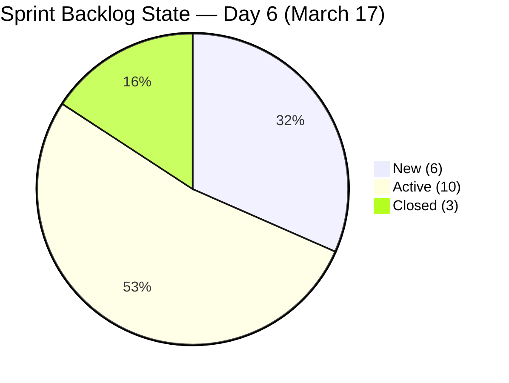
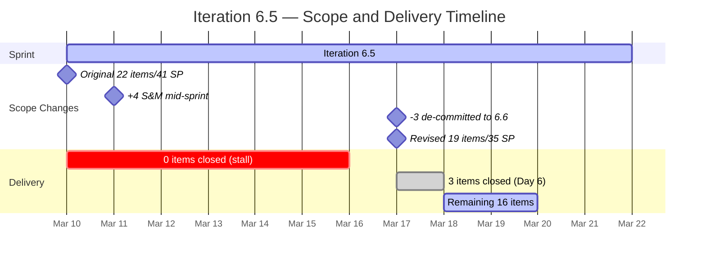

# SAFe Audit Report — Human Resource Recruitment Team

**Project:** Jairosoft FINOPS
**Team:** Human Resource Recruitment Team
**Iteration Audited:** Iteration 6.5 (PI6) — Mar 10 – Mar 22, 2026
**Audit Date:** March 17, 2026 (Sprint Day 6 of 9)
**Previous Audit:** March 16, 2026 (Sprint Day 5)
**Auditor:** Claude (SAFe Agile PM Consultant)
**Framework:** SAFe 6.0 (Scaled Agile Framework)

---

## 1. Executive Summary

This is the **fourth audit of Iteration 6.5**, conducted on Day 6 of 9 working days. The most significant development since yesterday: **the delivery stall that lasted 5 consecutive days has been broken.** Three stories were closed today, burning 5 SP — the first closures of the entire sprint. Additionally, the team performed a **formal scope reduction**, moving 3 items (6 SP) to Iteration 6.6 (IP), and **updated target dates** on 6 items to realistic Mar 20 deadlines. Two persistent data hygiene issues flagged for **10 consecutive audits** (#193581 wrong parent, #195671 unassigned to sprint) have finally been resolved.

**Headline: Delivery stall broken — 3 items closed, sprint scope formally reduced from 22 to 19 items, two 10-audit persistent issues resolved.**

The sprint still carries risk: 30 SP remain across 16 open items with only 3 working days left. WIP remains elevated at 10 Active items. However, the management actions taken today represent the **strongest single-day improvement** in the entire 11-audit series.

**Overall SAFe Compliance Score: 7.0 / 10 (Low Risk — up from 6.0/10)**

```
Compliance Score Trend (Full Audit Series — 11 Audits)
═══════════════════════════════════════════════════════════

Feb 25 (6.4 Day 2)   ██                                     2/10 (Critical)
Mar 03 (6.4 Day 9)   ████                                   4/10 (High Risk)
Mar 04 (6.4 Day 10)  ████                                   4/10 (High Risk)
Mar 05 (6.4 Day 11)  █████                                  5/10 (Moderate Risk)
Mar 06 (6.4 Day 12)  ██████                                 6/10 (Moderate Risk)
Mar 09 (6.4 Post)    ██████░                                6.5/10 (Moderate Risk)
Mar 10 (6.5 Day 1)   ████████                               7.5/10 (Low Risk) ← Peak
Mar 11 (6.5 Day 2)   ███████                                7.0/10 (Low Risk)
Mar 16 (6.5 Day 5)   ██████                                 6.0/10 (Moderate Risk)
Mar 17 (6.5 Day 6)   ███████                                7.0/10 (Low Risk) ▲
Target                ████████                               8/10 (Healthy)
```

> **Score recovered 1.0 point** from the previous audit. The improvement is driven by: delivery stall broken (3 closures), formal scope reduction (3 items de-committed), target date realism (6 items updated), and resolution of two 10-audit persistent issues. WIP remaining high and missing iteration goal / PI objectives prevent a higher score.

---

## 2. Sprint Backlog — Current State (March 17, Day 6)

### 2.1 Key Changes Since Last Audit (March 16)

| Change Type | Details |
|-------------|---------|
| **Items Closed (3)** | #193577 APE - Ates, Jerlyn (2 SP), #198685 HR Support Channel (1 SP), #200862 S&M - Edgardo Rojas Jr. (2 SP) |
| **Items De-committed (3)** | #193582 APE - Caumban → 6.6 IP (2 SP), #197939 Comm Skills → 6.6 IP (2 SP), #200319 DevOps Engr. → 6.6 IP (2 SP) |
| **Target Dates Updated (6)** | #200063, #200316, #200317, #200318, #200862, #200956, #200963 → Mar 20 |
| **State Changes** | #198681 New → Active (work started today) |
| **Title Refinements** | #200060, #200862, #200963 now include "(Up to Technical Interview)" — recruitment stage tracking |
| **Persistent Fix** | #193581 parent corrected to #196947 (was #191713 for 10 audits) |
| **Persistent Fix** | #195671 moved to Iteration 6.6 IP (was at root iteration for 10 audits) |

### 2.2 Full Sprint Backlog (19 items)

| #   | ID     | Title                                              | State    | SP | Parent Feature                   | Target Date | Status          |
| --- | ------ | -------------------------------------------------- | -------- | -- | -------------------------------- | ----------- | --------------- |
| 1   | 200671 | LinkedIn Tech Sales Manila Hiring                  | New      | 1  | #197385 (Hire Tech Sales)        | Mar 10      | 7 days overdue  |
| 2   | 200060 | S&M - Jugadora, Anna Danica (Up to Tech Interview) | Active   | 2  | #200059 (Hire S&M)               | Mar 11      | 6 days overdue  |
| 3   | 200855 | S&M - Shamyll Gelbolingo                           | Active   | 2  | #200059 (Hire S&M)               | Mar 11      | 6 days overdue  |
| 4   | 200320 | Medical CU Make-up Schedules                       | Active   | 1  | #191712 (Medical CU)             | Mar 13      | 4 days overdue  |
| 5   | 198681 | Re-orientation Schedule per Teams                  | Active   | 1  | #197229 (Re-orientation)         | Mar 17      | Due today       |
| 6   | 198670 | CADAC Seminar Participation                        | New      | 3  | #193025 (CADAC Training)         | Mar 19      | —               |
| 7   | 200646 | APE - Bon Jovie Cueva                              | New      | 2  | #196947 (2026 APE)               | Mar 19      | —               |
| 8   | 200653 | APE - Rommel Senillo                               | New      | 2  | #196947 (2026 APE)               | Mar 19      | —               |
| 9   | 200660 | APE - Ryan Vince Castillo                          | New      | 2  | #196947 (2026 APE)               | Mar 19      | —               |
| 10  | 200667 | APE - Calvin John Dalino                           | New      | 2  | #196947 (2026 APE)               | Mar 19      | —               |
| 11  | 200063 | S&M - Colaba, Francis Ian                          | Active   | 2  | #200059 (Hire S&M)               | Mar 20      | —               |
| 12  | 200316 | LinkedIn Bubble Dev Hiring                         | Active   | 2  | #197685 (Hire Bubble Dev)        | Mar 20      | —               |
| 13  | 200317 | LinkedIn Bubble Trainer Hiring                     | Active   | 2  | #195668 (Recruit Bubble Trainer) | Mar 20      | —               |
| 14  | 200318 | LinkedIn Sr Tech Lead Hiring                       | Active   | 2  | #198053 (Hire Sr Tech Lead)      | Mar 20      | —               |
| 15  | 200956 | S&M - Lea Mae Escorba                              | Active   | 2  | #200059 (Hire S&M)               | Mar 20      | —               |
| 16  | 200963 | S&M - John Dave Fernandez (Up to Tech Interview)   | Active   | 2  | #200059 (Hire S&M)               | Mar 20      | —               |
|     |        | **CLOSED**                                         |          |    |                                  |             |                 |
| 17  | 193577 | APE - Ates, Jerlyn                                 | Closed   | 2  | #196947 (2026 APE)               | Mar 12      | Closed Mar 17   |
| 18  | 198685 | HR Support Channel                                 | Closed   | 1  | #197229 (Re-orientation)         | Mar 17      | Closed Mar 17   |
| 19  | 200862 | S&M - Edgardo Rojas Jr. (Up to Tech Interview)     | Closed   | 2  | #200059 (Hire S&M)               | Mar 20      | Closed Mar 17   |
|     | **TOTAL** | **19 stories (down from 22)**                  |          | **35** |                               |             | **4 overdue**   |

### 2.3 State Distribution — Day 5 vs. Day 6

| State     | Day 5 (Mar 16) | Day 6 (Mar 17) | Change                |
|-----------|-----------------|-----------------|----------------------|
| New       | 11 (50%)        | 6 (32%)         | -5 (3 de-committed, 1 to Active, 1 closed) |
| Active    | 11 (50%)        | 10 (53%)        | -1 (net: +1 from New, -2 closed) |
| Closed    | 0 (0%)          | 3 (16%)         | **+3 (DELIVERY STARTED!)** |
| **Total** | **22**          | **19**          | **-3 (de-committed to 6.6 IP)** |



### 2.4 Overdue Analysis — Improved

```
Overdue Items by Days Late (March 17)
═══════════════════════════════════════════════════════════

7 days overdue │█  #200671 Tech Sales Manila (1 SP) — New
               │
6 days overdue │██  #200060 S&M - Jugadora (2 SP)
               │    #200855 S&M - Shamyll (2 SP)
               │
4 days overdue │█  #200320 Medical CU Make-up (1 SP)
               │
TOTAL OVERDUE  │ 4 items (21%) / 6 SP (17%)
               │
Due today      │█  #198681 Re-orientation Schedule (1 SP) — Active
               │
Not yet due    │███████████  11 items (58%) / 23 SP — due Mar 19-20
               │
Closed today   │███  3 items (16%) / 5 SP — FIRST CLOSURES ✅

COMPARISON:  Day 5: 13 overdue (59%) → Day 6: 4 overdue (21%) = 69% REDUCTION
```

> Note: The overdue reduction is partly due to target date updates (6 items moved to Mar 20) and partly due to closures. Two overdue items (#193577, #200862) were closed, and 5 items had their dates corrected. This is legitimate — the updated dates reflect realistic expectations rather than artificially lowering the count.

---

## 3. Delivery Velocity Analysis

### 3.1 Burndown Status

```
Iteration 6.5 — Burndown (Day 6 of 9 working days)
═══════════════════════════════════════════════════════════

SP   41 ┤●━━━━━━━━━━━━━━━●━━━━━━━━━━━━━●
        │╲                              ╲
     35 ┤  ╲  ┄┄┄┄┄┄┄┄┄┄┄┄┄┄┄┄┄┄┄┄┄┄┄┄┄●  Revised baseline (scope cut)
        │    ╲                            ╲
     28 ┤      ╲                            ●  Actual (5 SP burned!)
        │        ╲                 (you are here)
     21 ┤          ╲
        │            ╲
     14 ┤              ╲
        │                ╲
      7 ┤                  ╲
        │                    ╲
      0 ┼────┬────┬────┬────┬────┬────┬────┤
        D1   D2   D3   D4   D5   D6   D8   D9
       Mar10 Mar11 Mar12 Mar13 Mar16 Mar17 Mar19 Mar20

━━━ Actual: 30 SP remaining (5 SP burned of revised 35 SP = 14%)
┄┄┄ Revised baseline: 35 SP (after 6 SP de-committed)
╲╲╲ Ideal (revised):  ~12 SP should remain by Day 6
    GAP:    18 SP behind revised ideal
    IMPROVEMENT: Was 23 SP behind ideal yesterday, now 18 SP behind
```

### 3.2 Story Point Burn Summary

| Metric | Day 5 (Mar 16) | Day 6 (Mar 17) | Change |
|--------|-----------------|-----------------|--------|
| Original commitment | 41 SP | 41 SP | — |
| De-committed | 0 SP | 6 SP | -6 SP scope cut |
| Revised commitment | 41 SP | 35 SP | -6 SP |
| SP burned | 0 SP (0%) | 5 SP (14%) | **+5 SP** |
| SP remaining | 41 SP | 30 SP | -11 SP |
| Items closed | 0 | 3 | **+3** |

### 3.3 Remaining Capacity

| Metric | Value |
|--------|-------|
| SP remaining | 30 SP (86% of revised 35 SP) |
| Working days left | 3 (Mar 18, 19, 20) |
| Almera's capacity | 6.5 hrs/day |
| Available hours remaining | 6.5 × 3 = 19.5 hours |
| Required rate | 30 SP / 3 days = **10.0 SP/day** |
| Hrs per SP available | 19.5 / 30 = **0.65 hrs/SP** (39 min per story point) |

```
Capacity vs. Demand — Final 3 Days
═══════════════════════════════════════════════════════════

Required SP/day:  ██████████  10.0 SP/day
Today's actual:   █████       5.0 SP/day (3 items closed today)

PROJECTED OUTCOMES (based on today's velocity of 5 SP/day):
  Optimistic (6 SP/day):   18 SP closed = 66% | 12 SP carryover (34%)
  Realistic (5 SP/day):    15 SP closed = 57% | 15 SP carryover (43%)
  Conservative (3 SP/day):  9 SP closed = 40% | 21 SP carryover (60%)

REVISED COMPLETION (including today's 5 SP):
  Optimistic:  5 + 18 = 23 SP / 35 = 66% completion
  Realistic:   5 + 15 = 20 SP / 35 = 57% completion
  Conservative: 5 + 9 = 14 SP / 35 = 40% completion

vs. Yesterday's projection: 0-61% completion → Today: 40-66% completion ✅
```

---

## 4. Previous Findings — Remediation Status

### 4.1 Findings Tracker (Day 6)

| #   | Finding                             | Severity | Day 5 (Mar 16)                     | Day 6 (Mar 17)                      | Verdict              |
| --- | ----------------------------------- | -------- | ---------------------------------- | ----------------------------------- | -------------------- |
| F1  | No Story Point Estimation           | Critical | FIXED (22/22 = 100%)              | SUSTAINED (19/19 = 100%)            | **FIXED**            |
| F2  | No Team Capacity Configured         | Critical | FIXED (6.5 hrs/day)               | SUSTAINED (6.5 hrs/day)             | **FIXED**            |
| F3  | Single Team Member (Bus Factor = 1) | Critical | SAME (Almera only)                | SAME — but delivering today         | **STRUCTURAL**       |
| F5  | Feature-Story Hierarchy Broken      | High     | FIXED (22/22 have parents)         | SUSTAINED (19/19 + #193581 FIXED!)  | **FIXED**            |
| F6  | No Acceptance Criteria              | High     | FIXED (22/22 = 100%)              | SUSTAINED (19/19 = 100%)            | **FIXED**            |
| F7  | Stories Not in INVEST Format        | Medium   | FIXED (22/22 INVEST)              | SUSTAINED (19/19 INVEST)            | **FIXED**            |
| F8  | No WIP Limits                       | Medium   | CRITICAL (11 Active)               | HIGH (10 Active — slight improvement)| **IMPROVING**        |
| F9  | No PI Objectives Alignment          | Medium   | NOT FIXED                          | NOT FIXED                           | **NOT FIXED**        |
| F10 | No Iteration Goal Defined           | Medium   | NOT FIXED                          | NOT FIXED                           | **NOT FIXED**        |
| N4  | Story #195671 Not in Sprint         | High     | Still root iteration (10th audit!) | **FIXED — moved to 6.6 IP**        | **FIXED**            |
| N5  | Scope Creep                         | Medium   | Held at 22                         | **REDUCED to 19 (de-committed 3)**  | **IMPROVED**         |
| N6  | WIP Overload                        | High     | 11 Active (frozen 5 days)          | 10 Active (1 closed, 1 activated)   | **IMPROVING**        |
| N7  | Same-Day Unrealistic Deadlines      | High     | All 6 S&M items 5 days overdue     | **4 S&M dates updated to Mar 20**   | **PARTIALLY FIXED**  |
| N8  | S&M Feature Scope Inflation         | Medium   | 29% of sprint, none closed         | **1 S&M item closed, 1 de-committed** | **IMPROVING**       |
| N9  | Delivery Stall (0 closed)           | Critical | 0 items closed in 5 days           | **3 items closed today!**           | **RESOLVED**         |

```
Remediation Progress — Day 6 (Iteration 6.5)
═══════════════════════════════════════════════════════════

FIXED/RESOLVED   ████████████████████████████████  8 of 15 (53%)
IMPROVING        ████████████                      4 of 15 (27%)
STRUCTURAL       ██                                1 of 15 (7%)
NOT FIXED        ████                              2 of 15 (13%)

Day 5 comparison: FIXED 36% → 53% | NOT FIXED 21% → 13%
```

### 4.2 Previous Recommendations — Disposition (10 from Mar 16)

| #   | Recommendation (from Mar 16)                        | Status            | Notes                                           |
| --- | --------------------------------------------------- | ----------------- | ----------------------------------------------- |
| 1   | Triage the sprint backlog NOW                       | **DONE**          | 3 items formally de-committed to 6.6 IP         |
| 2   | Reduce Active WIP to 3 items                        | **PARTIAL**       | WIP dropped 11→10, not yet at target 3          |
| 3   | Update target dates to reflect reality              | **DONE**          | 6 items updated to Mar 20                       |
| 4   | Close stories in batches by Feature                 | **PARTIAL**       | 1 S&M + 1 APE + 1 Re-orientation closed         |
| 5   | Formally assess sprint completion risk              | **DONE**          | Scope reduction demonstrates formal assessment  |
| 6   | Assign #195671 or remove it                         | **DONE**          | Moved to Iteration 6.6 IP (after 10 audits!)   |
| 7   | Define iteration goal                               | **NOT DONE**      | 11th consecutive audit                          |
| 8   | Conduct a Retrospective focused on WIP              | **UNKNOWN**       | No evidence of standup/retro outcomes           |
| 9   | Link Features to PI Objectives                      | **NOT DONE**      | 11th consecutive audit                          |
| 10  | Move #193581 to correct parent (#196947)            | **DONE**          | Parent now correctly set to #196947 (after 10 audits!) |

```
Recommendation Compliance — 10 Items from Mar 16
═══════════════════════════════════════════════════════════

DONE             ████████████████████  4 of 10 (40%)
PARTIAL          ████████              2 of 10 (20%)
NOT DONE         ████████              2 of 10 (20%)
UNKNOWN          ████                  1 of 10 (10%)

Overall: 60% compliance (DONE + PARTIAL) — up from 11% on Day 5!
This is the highest recommendation compliance in the entire audit series.
```

---

## 5. Feature Hierarchy — Current State (March 17, 2026)

```
Jairosoft FINOPS — PI6 Iteration 6.5 (DAY 6 — March 17, 2026)
│
├── [Active] Hire Sales & Mktg. for JIT (#200059)                     5 children (was 6)
│   ├── [Active] S&M - Jugadora, Anna Danica (#200060)               2 SP | Mar 11 ⚠️ 6d OVERDUE
│   ├── [Active] S&M - Colaba, Francis Ian (#200063)                  2 SP | Mar 20
│   ├── [Active] S&M - Shamyll Gelbolingo (#200855)                   2 SP | Mar 11 ⚠️ 6d OVERDUE
│   ├── [Active] S&M - Lea Mae Escorba (#200956)                     2 SP | Mar 20
│   ├── [Active] S&M - John Dave Fernandez (#200963)                  2 SP | Mar 20
│   └── [CLOSED] S&M - Edgardo Rojas Jr. (#200862)                   2 SP | ✅ Closed Mar 17
│   → 12 SP | 1/6 closed (17%) — FIRST S&M CLOSURE
│
├── [Active] Employees 2026 Annual Evaluation (#196947)               5 children (was 6)
│   ├── [CLOSED] APE - Ates, Jerlyn (#193577)                        2 SP | ✅ Closed Mar 17
│   ├── [New] APE - Bon Jovie Cueva (#200646)                        2 SP | Mar 19
│   ├── [New] APE - Rommel Senillo (#200653)                         2 SP | Mar 19
│   ├── [New] APE - Ryan Vince Castillo (#200660)                    2 SP | Mar 19
│   └── [New] APE - Calvin John Dalino (#200667)                     2 SP | Mar 19
│   → 10 SP | 1/5 closed (20%) — FIRST APE CLOSURE
│   ⓘ #193582 (APE - Karl Jordan) de-committed to 6.6 IP
│
├── [Active] Hire Bubble Developer (#197685)                          1 child
│   └── [Active] LinkedIn Bubble Dev Hiring (#200316)                 2 SP | Mar 20
│
├── [Active] Hire Senior Technical Lead for SSI (#198053)             1 child
│   └── [Active] LinkedIn Sr Tech Lead Hiring (#200318)               2 SP | Mar 20
│
├── [Active] Recruit Bubble Trainer (#195668)                         1 child
│   └── [Active] LinkedIn Bubble Trainer Hiring (#200317)             2 SP | Mar 20
│
├── [Active] Hire DevOps Engineer (#197687)                           0 children in 6.5
│   ⓘ #200319 (LinkedIn DevOps Engr. Hiring) de-committed to 6.6 IP
│
├── [Approved] Hire Tech Sales from Manila (#197385)                  1 child
│   └── [New] LinkedIn Tech Sales Manila Hiring (#200671)             1 SP | Mar 10 ⚠️ 7d OVERDUE
│
├── [Active] Employee 2026 Medical Check Up (#191712)                 1 child
│   └── [Active] Medical CU Make-up Schedules (#200320)               1 SP | Mar 13 ⚠️ 4d OVERDUE
│
├── [Estimation] Re-orientation of Schedules (#197229)                1 child (was 2)
│   ├── [Active] Re-orientation Schedule per Teams (#198681)          1 SP | Mar 17 ← DUE TODAY
│   └── [CLOSED] HR Support Channel (#198685)                        1 SP | ✅ Closed Mar 17
│   → 2 SP | 1/2 closed (50%) — BEST FEATURE COMPLETION RATE
│
├── [Active] CADAC Training Seminar 2026 (#193025)                    1 child
│   └── [New] CADAC Seminar Participation (#198670)                   3 SP | Mar 19
│
├── ⓘ DE-COMMITTED TO 6.6 IP
│   ├── #193582 — APE - Caumban, Karl Jordan (2 SP)
│   ├── #197939 — Comm Skills Proposals Summary (2 SP)
│   └── #200319 — LinkedIn DevOps Engr. Hiring (2 SP)
│
└── ✅ PERSISTENT ISSUES — RESOLVED
    ├── [Closed] #193581 — APE Coronia — parent FIXED to #196947 ✅ (11th audit!)
    └── [New] #195671 — Joniel 201 files — moved to 6.6 IP ✅ (11th audit!)
```

### 5.1 Feature Completion Status

```
Feature Completion — Day 6 (March 17)
═══════════════════════════════════════════════════════════

Re-orientation     ██████████░░░░░░░░░░  1/2  (50%)  ← BEST
Hire Sales & Mktg. ███░░░░░░░░░░░░░░░░░  1/6  (17%)  First S&M close!
2026 APE           ████░░░░░░░░░░░░░░░░  1/5  (20%)  First APE close!
Hire Bubble Dev    ░░░░░░░░░░░░░░░░░░░░  0/1  (0%)
Hire Sr Tech Lead  ░░░░░░░░░░░░░░░░░░░░  0/1  (0%)
Recruit Bubble Tr. ░░░░░░░░░░░░░░░░░░░░  0/1  (0%)
Hire Tech Sales    ░░░░░░░░░░░░░░░░░░░░  0/1  (0%)
Medical Check Up   ░░░░░░░░░░░░░░░░░░░░  0/1  (0%)
CADAC Training     ░░░░░░░░░░░░░░░░░░░░  0/1  (0%)
Hire DevOps Engr.  — (de-committed)

OVERALL: 3/19 (16%) — up from 0/22 (0%) yesterday
```

---

## 6. Trend Analysis

### 6.1 WIP History — Full Series

```
Active WIP Items Over Time (11 Audits)
═══════════════════════════════════════════════════════════

        Feb25  Mar3  Mar5  Mar6  Mar9  Mar10 Mar11 Mar16 Mar17
        ─────  ────  ────  ────  ────  ────  ────  ────  ────
WIP     4      9     6     0     3     3     11    11    10
        ████   █████ ████        ███   ███   █████ █████ █████
                ████ ██                      █████ █████ █████
                                             █

SAFe Limit (3–5): ═══════════════════════════════════════

        OK     HIGH  ↓     ✅    ✅    ✅    ALL-  FROZEN ↓ slight
                                              TIME  5 DAYS
                                              HIGH

WIP dropped from 11 to 10. Still 2x above SAFe limit.
But: items are now FLOWING (3 closed) vs frozen.
```

### 6.2 Delivery Rate Across Iterations

```
Stories Closed Per Sprint Day
═══════════════════════════════════════════════════════════

Iteration 6.4:
  Day 2:   1.5/day (3 closed in 2 days)
  Day 9:   2.3/day (14 closed in 6 days)    ← Peak velocity
  Final:   ~2.0/day average

Iteration 6.5:
  Day 2:   0/day (0 closed)
  Day 5:   0/day (0 closed)                  ← STALL
  Day 6:   0.5/day (3 closed in 6 days)      ← STALL BROKEN ✅
  Day 6*:  3.0/day (today only)              ← BURST VELOCITY

*If today's pace (3 items/day) is sustained:
  3 × 3 remaining days = 9 more items = 12/19 total (63%)
  This would be a strong sprint recovery.
```

### 6.3 Scope Management — Day Over Day



---

## 7. Risk Assessment — Day 6 (March 17, 2026)

```
Iteration 6.5 Day 6 — Risk Heat Map
═══════════════════════════════════════════════════════════
                    LIKELIHOOD
                Low     Medium    High
            ┌─────────┬─────────┬─────────┐
    High    │         │ [F3]    │ [R1]    │
            │         │         │         │
            │         │         │         │
  IMPACT    ├─────────┼─────────┼─────────┤
    Medium  │ [F9]    │ [F8]    │ [R2]    │
            │ [F10]   │ [N6]    │         │
            ├─────────┼─────────┼─────────┤
    Low     │ [N5]    │         │         │
            └─────────┴─────────┴─────────┘

Changes from Day 5:
  ★ [N9] REMOVED — Delivery stall resolved (3 items closed)
  ↓ [N7] REMOVED — Target dates updated to realistic values
  ↓ [N8] DEMOTED — 1 S&M item closed, 1 de-committed
  ↓ [N4] REMOVED — #195671 assigned to 6.6 IP

Active risks:
  [R1]  Sprint completion risk — 30 SP / 3 days (HIGH likelihood)
  [R2]  4 items still overdue with no date updates
  [F3]  Bus Factor = 1 — Almera sole contributor (STRUCTURAL)
  [F8]  WIP at 10 — still 2x above SAFe limit
  [N6]  WIP overload — 10 Active items (improving but high)
  [F9]  No PI Objectives linked (11th audit)
  [F10] No Iteration Goal defined (11th audit)
  [N5]  Scope creep risk — now controlled via de-commitment
```

---

## 8. Recommendations — Iteration 6.5 Day 6

### Critical (Immediate — Mar 18)

1. **Sustain the delivery momentum.** Today's 3 closures demonstrate the team can deliver. Maintain at least 3 closures/day for the remaining 3 days. Prioritize the 4 overdue items (#200671, #200060, #200855, #200320) first.

2. **Update remaining overdue target dates.** Four items still show original overdue dates (#200671 Mar 10, #200060 Mar 11, #200855 Mar 11, #200320 Mar 13). Update these to realistic dates (Mar 18-19) to reflect the actual plan. Leaving old dates creates misleading overdue counts.

3. **Close the 4 remaining S&M items as a batch.** With #200862 closed today, 4 S&M recruitment items share the same workflow. Closing them together (batch processing) is more efficient than context-switching.

### This Week (Mar 18-20)

4. **Close the 4 APE items as a batch.** #193577 was closed today. The remaining 4 APE items (#200646, #200653, #200660, #200667) are all "New" with Mar 19 target — they should be activated and closed together.

5. **Activate and close #198681 (Re-orientation Schedule).** This was moved to Active today and is due today. It should be closeable with focused effort.

6. **Accept likely carryover.** Even at today's burst rate, full completion is unlikely. Formally identify which items will carry over to 6.6 and communicate this proactively.

### Strategic (Carry into 6.6 Planning)

7. **Define iteration goal before 6.6 starts.** This has been unfixed for 11 consecutive audits. It should be a **mandatory prerequisite** for sprint planning.

8. **Link Features to PI Objectives.** Also unfixed for 11 consecutive audits. Escalate to program level.

9. **Establish WIP limits at 3-5 Active items.** The current sprint showed that high WIP (11 items) correlates with delivery stalls. Lower WIP enables flow.

10. **Plan 6.6 with a realistic commitment.** Use today's demonstrated velocity (~3-5 SP/day, or 27-45 SP per 9-day sprint) as the planning baseline. Do not over-commit.

---

## 9. Quality Compliance Summary

| Metric                    | Day 5 (Mar 16) | Day 6 (Mar 17) | Change           |
| ------------------------- | --------------- | --------------- | ---------------- |
| Stories with SP           | 22/22 (100%)    | 19/19 (100%)    | Sustained        |
| Stories with AC           | 22/22 (100%)    | 19/19 (100%)    | Sustained        |
| Stories with INVEST       | 22/22 (100%)    | 19/19 (100%)    | Sustained        |
| Stories with Parent       | 22/22 (100%)    | 19/19 (100%)    | Sustained        |
| Stories with Target Dates | 22/22 (100%)    | 19/19 (100%)    | Sustained        |
| Stories with Tasks        | 22/22 (100%)    | 19/19 (100%)    | Sustained        |
| Iteration Goal Defined    | No              | No              | Same             |
| PI Objectives Linked      | No              | No              | Same             |
| WIP Within Limits         | 11 Active       | 10 Active       | Slight improvement |
| Items Closed              | 0               | 3               | **+3 (STALL BROKEN)** |
| Items Overdue             | 13 (59%)        | 4 (21%)         | **-69% reduction**   |
| Recommendation Compliance | 11%             | 60%             | **+49pp improvement** |
| Persistent Issues (#193581, #195671) | Both unfixed (10 audits) | **Both FIXED** | **RESOLVED** |

---

## 10. Positive Highlights — Day 6

This audit records the strongest single-day improvement in the entire 11-audit series:

1. **Delivery stall broken** — First closures of Iteration 6.5 after 5 days of zero progress
2. **Scope discipline demonstrated** — Formal de-commitment of 3 items shows management maturity
3. **Target date realism** — 6 items updated from overdue to achievable Mar 20 deadlines
4. **10-audit persistent issues resolved** — Both #193581 (wrong parent) and #195671 (unassigned) fixed
5. **Recommendation compliance jumped from 11% to 60%** — Highest in the audit series
6. **Recruitment stage tracking** — Story titles now include workflow stage ("Up to Technical Interview")
7. **Score recovery** — 6.0 → 7.0 after trending downward for 3 consecutive audits

---

*Report generated on March 17, 2026 — SAFe 6.0 Compliance Audit (Iteration 6.5 Day 6)*
*Audit series: #1 Feb 25 | #2 Mar 3 | #3 Mar 4 | #4 Mar 5 | #5 Mar 6 | #6 Mar 9 | #7 Mar 10 | #8 Mar 11 | #9 Mar 16 | #10 Mar 17 (this report)*
*Previous audit: AUDIT_2026-03-16_0900.md | Score trend: 6.0 → 7.0 (up 1.0)*
