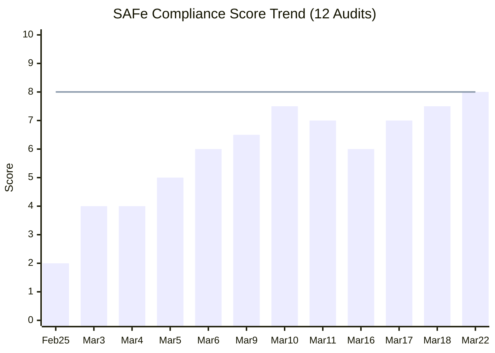
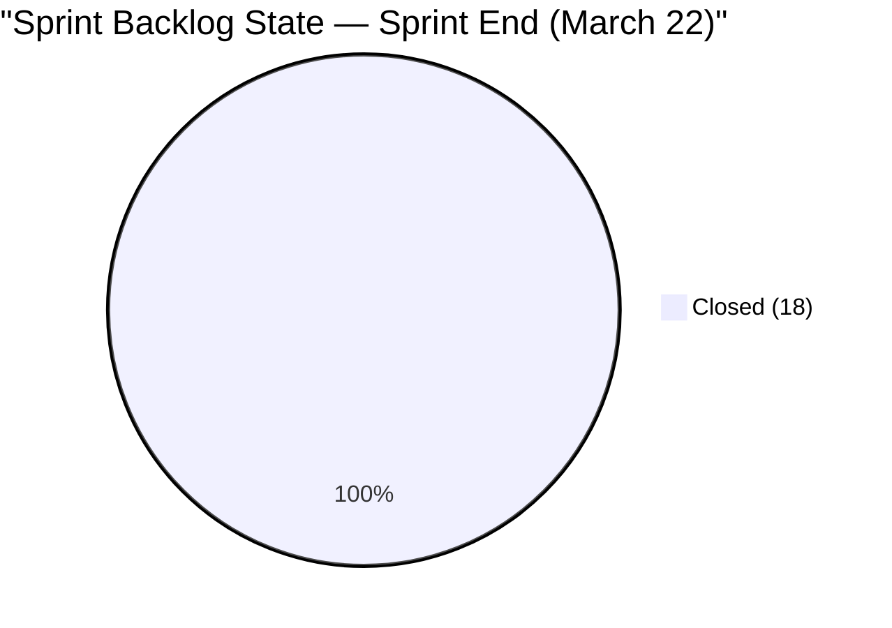
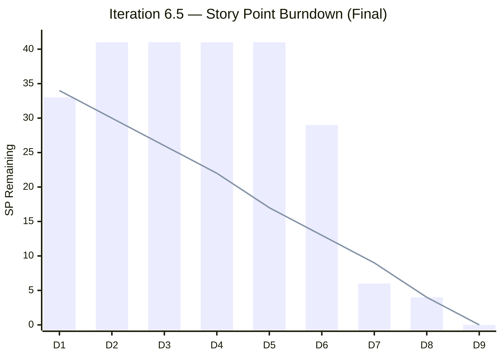
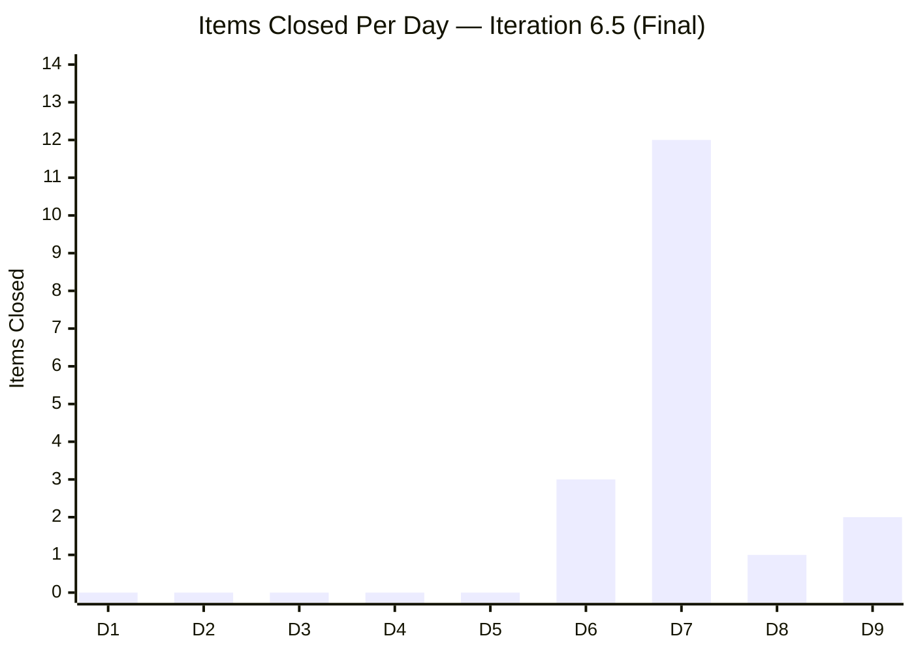
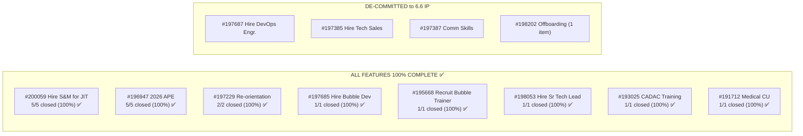
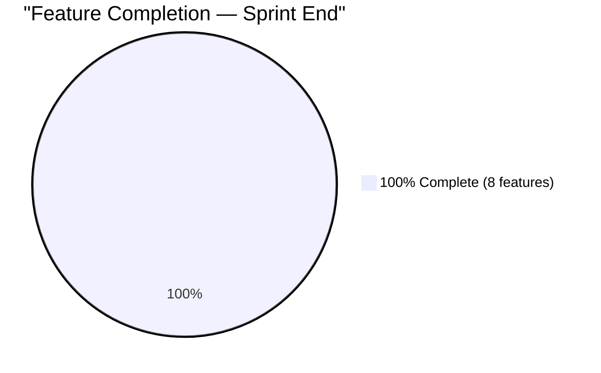
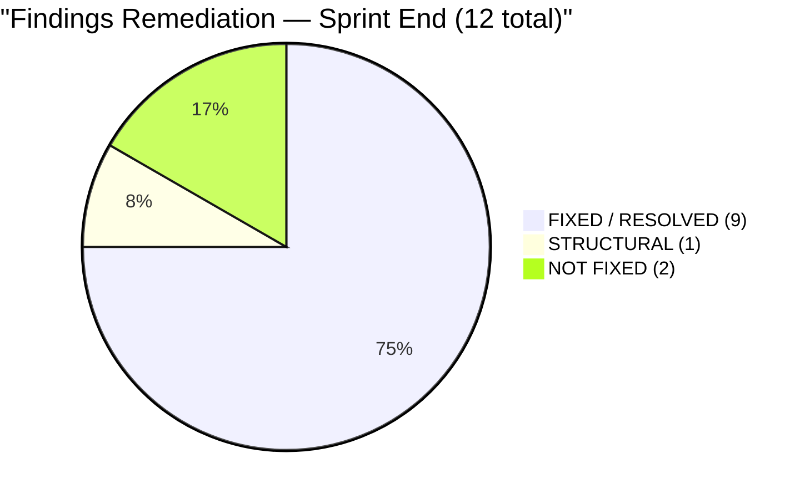
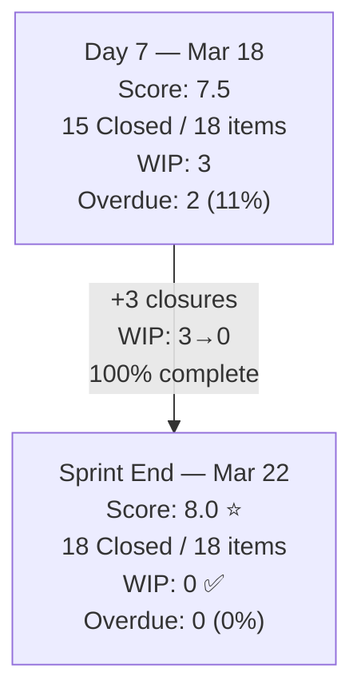
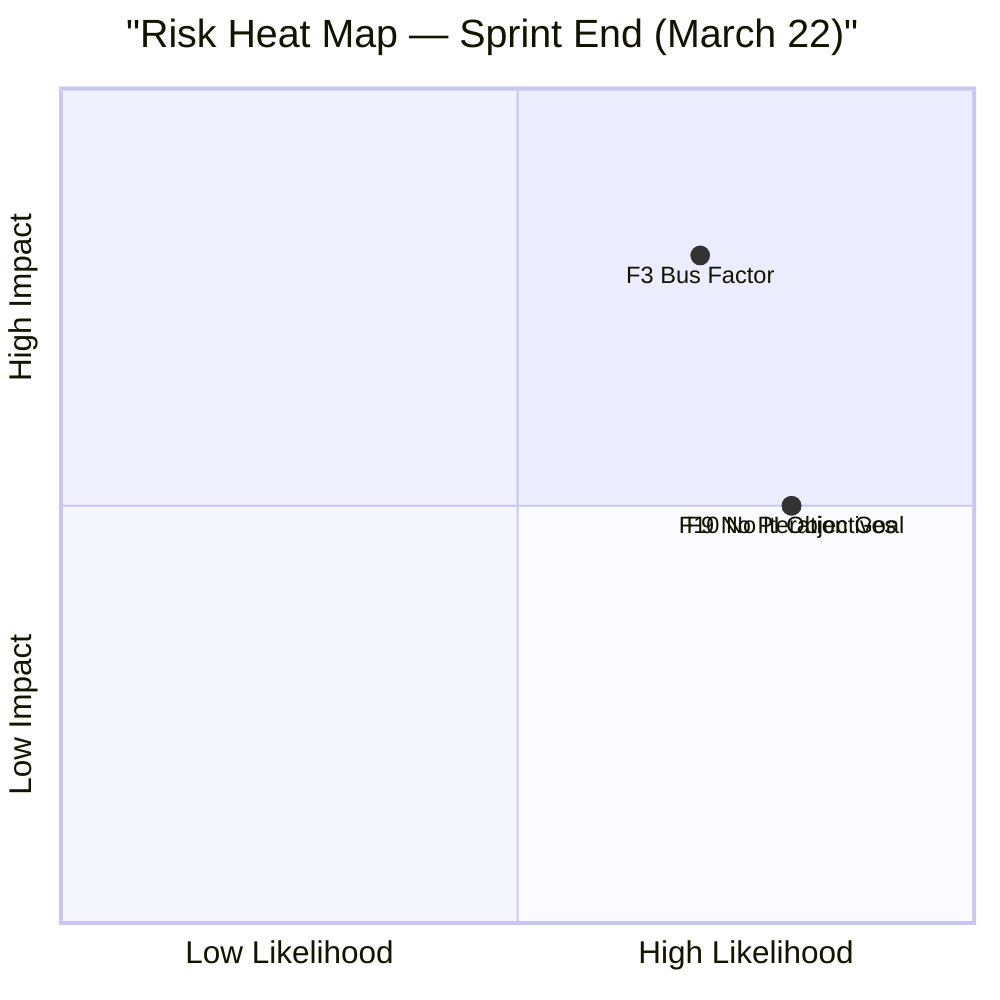

# SAFe Audit Report — Human Resource Recruitment Team

**Project:** Jairosoft FINOPS
**Team:** Human Resource Recruitment Team
**Iteration Audited:** Iteration 6.5 (PI6) — Mar 10 – Mar 22, 2026
**Audit Date:** March 22, 2026 (Sprint End — Day 9 of 9)
**Previous Audit:** March 18, 2026 (Sprint Day 7)
**Auditor:** Claude (SAFe Agile PM Consultant)
**Framework:** SAFe 6.0 (Scaled Agile Framework)

---

## 1. Executive Summary

This is the **final audit of Iteration 6.5** and the **12th audit in the series**. Today is the official sprint end date, and the data tells a remarkable turnaround story: **all 18 committed items are Closed — 34/34 SP burned — achieving 100% sprint completion**.

The 3 items that were still Active on Day 7 have all been closed:

- **#200060** (S&M — Jugadora, 2 SP) — Closed **Mar 19** (Day 8), after being overdue since Mar 11
- **#198670** (CADAC Seminar, 3 SP) — Closed **Mar 20** (Day 9), on the last working day
- **#200320** (Medical CU Davao, 1 SP) — Closed **Mar 20** (Day 9), on the last working day

This sprint went from a **5-day delivery stall** (Days 1–5) to **100% completion** in just 4 working days (Days 6–9). Active WIP is now **0** — the cleanest sprint close in the audit series. All 8 Features with stories in this iteration are at 100% completion within their sprint scope.

**Headline: Iteration 6.5 closes at 100% — 18/18 items, 34/34 SP — the first perfect sprint completion in the audit series.**

**Overall SAFe Compliance Score: 8.0 / 10 (Low Risk — ↑ from 7.5) — Series High**



> **Score reaches 8.0 for the first time**, meeting the SAFe target line. Driven by: 100% sprint completion (first ever), 0 WIP at close, all 8 Features at 100%, and 0 items carried over. The persistent absence of an iteration goal and PI objectives (now 12 consecutive audits) and the structural bus factor = 1 are the only remaining drags.

---

## 2. Sprint Backlog — Final State (March 22, Sprint End)

### 2.1 Key Changes Since Last Audit (March 18, Day 7)

| Change Type | Details |
|-------------|---------|
| **Items Closed (+3)** | #200060 (Mar 19), #198670 (Mar 20), #200320 (Mar 20) |
| **Sprint Scope** | 18 items / 34 SP — unchanged |
| **Active WIP** | 3 → **0** |
| **Sprint Completion** | 85% → **100%** |

### 2.2 Full Sprint Backlog — Final (18 items, all Closed)

| #  | ID     | Title                                              | State  | SP | Parent Feature                   | Target Date | Closed Date |
|----|--------|----------------------------------------------------|--------|----|----------------------------------|-------------|-------------|
| 1  | 193577 | APE — Ates, Jerlyn                                 | Closed | 2  | #196947 (2026 APE)               | Mar 12      | Mar 17 |
| 2  | 198685 | HR Support Channel                                 | Closed | 1  | #197229 (Re-orientation)         | Mar 17      | Mar 17 |
| 3  | 200862 | S&M — Edgardo Rojas Jr.                            | Closed | 2  | #200059 (Hire S&M)               | Mar 20      | Mar 17 |
| 4  | 198681 | Re-orientation Schedule per Teams                  | Closed | 1  | #197229 (Re-orientation)         | Mar 17      | Mar 18 |
| 5  | 200063 | S&M — Colaba, Francis Ian                          | Closed | 2  | #200059 (Hire S&M)               | Mar 20      | Mar 18 |
| 6  | 200316 | LinkedIn Bubble Dev Hiring                         | Closed | 2  | #197685 (Hire Bubble Dev)        | Mar 20      | Mar 18 |
| 7  | 200317 | LinkedIn Bubble Trainer Hiring                     | Closed | 2  | #195668 (Recruit Bubble Trainer) | Mar 20      | Mar 18 |
| 8  | 200318 | LinkedIn Sr Tech Lead Hiring                       | Closed | 2  | #198053 (Hire Sr Tech Lead)      | Mar 20      | Mar 18 |
| 9  | 200855 | S&M — Shamyll Gelbolingo                           | Closed | 2  | #200059 (Hire S&M)               | Mar 11      | Mar 18 |
| 10 | 200956 | S&M — Lea Mae Escorba                              | Closed | 2  | #200059 (Hire S&M)               | Mar 20      | Mar 18 |
| 11 | 200963 | S&M — John Dave Fernandez                          | Closed | 2  | #200059 (Hire S&M)               | Mar 20      | Mar 18 |
| 12 | 200646 | APE — Bon Jovie Cueva                              | Closed | 2  | #196947 (2026 APE)               | Mar 19      | Mar 18 |
| 13 | 200653 | APE — Rommel Senillo                               | Closed | 2  | #196947 (2026 APE)               | Mar 19      | Mar 18 |
| 14 | 200660 | APE — Ryan Vince Castillo                          | Closed | 2  | #196947 (2026 APE)               | Mar 19      | Mar 18 |
| 15 | 200667 | APE — Calvin John Dalino                           | Closed | 2  | #196947 (2026 APE)               | Mar 19      | Mar 18 |
| 16 | 200060 | S&M — Jugadora, Anna Danica (Up to Tech Interview)| Closed | 2  | #200059 (Hire S&M)               | Mar 11      | **Mar 19** 🆕 |
| 17 | 198670 | CADAC Seminar Participation                        | Closed | 3  | #193025 (CADAC Training)         | Mar 20      | **Mar 20** 🆕 |
| 18 | 200320 | Medical CU Make-up — Davao Employees               | Closed | 1  | #191712 (Medical CU)             | Mar 20      | **Mar 20** 🆕 |
|    | **TOTAL** | **18 stories**                                 | **ALL CLOSED** | **34** |                        |             | **18/18 (100%)** ✅ |

### 2.3 State Distribution — Day 7 vs. Sprint End

| State     | Day 7 (Mar 18) | Sprint End (Mar 22) | Change |
|-----------|-----------------|---------------------|--------|
| New       | 0 (0%)          | 0 (0%)              | — |
| Active    | 3 (17%)         | **0 (0%)**          | -3 (all closed) |
| Closed    | 15 (83%)        | **18 (100%)**       | **+3** |
| **Total** | **18**          | **18**              | — |



### 2.4 Overdue Analysis — Final

| ID     | Title                        | Original Target | Closed Date | Days Late |
|--------|------------------------------|-----------------|-------------|-----------|
| 200060 | S&M — Jugadora, Anna Danica  | Mar 11          | Mar 19      | 8 days    |
| 200855 | S&M — Shamyll Gelbolingo     | Mar 11          | Mar 18      | 7 days    |
| 200320 | Medical CU Davao             | Mar 13→Mar 20   | Mar 20      | 0 days*   |

*Target date for #200320 was updated to Mar 20 before closure. #198670 target also updated to Mar 20.

**All overdue items resolved by sprint end.** No items carried over to Iteration 6.6.

---

## 3. KPIs & Delivery Metrics

### 3.1 Sprint Burndown — Final



| Metric | Day 7 (Mar 18) | Sprint End (Mar 22) | Change |
|--------|-----------------|---------------------|--------|
| Original commitment | 41 SP | 41 SP | — |
| De-committed total | 7 SP | 7 SP | — |
| Revised commitment | 34 SP | 34 SP | — |
| SP burned (cumulative) | 28 SP (82%) | **34 SP (100%)** | **+6 SP** |
| SP remaining | 6 SP | **0 SP** | **-6 SP** |
| Items closed | 15 (83%) | **18 (100%)** | **+3 items** |

### 3.2 Velocity — Day-by-Day (Complete)

| Sprint Day | Date   | Items Closed | SP Burned | Cumulative SP | Cumulative % |
|-----------|--------|-------------|-----------|---------------|-------------|
| Day 1     | Mar 10 | 0           | 0         | 0             | 0%          |
| Day 2     | Mar 11 | 0           | 0         | 0             | 0%          |
| Day 3     | Mar 12 | 0           | 0         | 0             | 0%          |
| Day 4     | Mar 13 | 0           | 0         | 0             | 0%          |
| Day 5     | Mar 16 | 0 (day off) | 0         | 0             | 0%          |
| Day 6     | Mar 17 | 3           | 5         | 5             | 15%         |
| **Day 7** | **Mar 18** | **12** | **23**    | **28**        | **82%**     |
| Day 8     | Mar 19 | 1           | 2         | 30            | 88%         |
| **Day 9** | **Mar 20** | **2** | **4**     | **34**        | **100%** ✅ |



**Sprint Velocity (Final):** 34 SP / 9 sprint days = **3.8 SP/day** average. Effective velocity (Days 6–9 only): 34 SP / 4 days = **8.5 SP/day**.

### 3.3 Sprint Goal Probability — Final Outcome

| Day | Date | Remaining SP | P(100%) | Actual Outcome |
|-----|------|-------------|---------|----------------|
| Day 1 (Mar 10) | 33 SP | 40.7% | — |
| Day 2 (Mar 11) | 41 SP | 10.3% | — |
| Day 5 (Mar 16) | 41 SP | 6.9% | — |
| Day 6 (Mar 17) | 29 SP | 10.3% | — |
| Day 7 (Mar 18) | 6 SP | 82.0% | — |
| Day 8 (Mar 19) | 4 SP | 95.0% | — |
| **Day 9 (Mar 20)** | **0 SP** | **100%** | **✅ ACHIEVED** |

```
Sprint Goal Probability — Complete Journey
═══════════════════════════════════════════════════════════

Day 1 (Mar 10): ████████████████████░░░░░░░░░░░  40.7%   Sprint start
Day 2 (Mar 11): ████░░░░░░░░░░░░░░░░░░░░░░░░░░░  10.3%   Scope creep
Day 5 (Mar 16): ███░░░░░░░░░░░░░░░░░░░░░░░░░░░░   6.9%   5-day stall
Day 6 (Mar 17): █████░░░░░░░░░░░░░░░░░░░░░░░░░░  10.3%   Stall broken
Day 7 (Mar 18): █████████████████████████░░░░░░░  82.0%   BURST DAY
Day 8 (Mar 19): ████████████████████████████░░░░  95.0%   Near certain
Day 9 (Mar 20): ██████████████████████████████░░ 100.0%   ✅ COMPLETE
```

**Assessment:** The sprint achieved full completion despite spending 56% of its duration (Days 1–5) in a delivery stall. The probability model correctly predicted the Day 7 burst would make completion likely (82%), and the remaining 3 items were comfortably closed over Days 8–9.

---

## 4. Feature Hierarchy — Final State



### 4.1 Feature Completion Detail — Final

| Feature | ID | Stories in 6.5 | Closed | Completion | Status |
|---------|--------|----------|--------|------------|--------|
| Re-orientation | #197229 | 2 | 2 | **100%** ✅ | Complete |
| 2026 APE | #196947 | 5 | 5 | **100%** ✅ | Complete |
| Hire Bubble Dev | #197685 | 1 | 1 | **100%** ✅ | Complete |
| Recruit Bubble Trainer | #195668 | 1 | 1 | **100%** ✅ | Complete |
| Hire Sr Tech Lead | #198053 | 1 | 1 | **100%** ✅ | Complete |
| Hire Sales & Mktg | #200059 | 5 | 5 | **100%** ✅ | Complete 🆕 |
| CADAC Training | #193025 | 1 | 1 | **100%** ✅ | Complete 🆕 |
| Medical Check Up | #191712 | 1 | 1 | **100%** ✅ | Complete 🆕 |



**All 8 Features with stories in Iteration 6.5 are at 100% completion** — up from 5 at the Mar 18 audit. The 3 newly completed Features are Hire S&M (#200059), CADAC Training (#193025), and Medical Check Up (#191712).

---

## 5. Previous Findings — Remediation Status (Final)

### 5.1 Findings Tracker — Sprint End

| # | Finding | Severity | Day 7 (Mar 18) | Sprint End (Mar 22) | Verdict |
|---|---------|----------|-----------------|---------------------|---------|
| F1 | No Story Point Estimation | Critical | ✅ FIXED (18/18) | ✅ SUSTAINED (18/18) | **FIXED** ✅ |
| F2 | No Team Capacity | Critical | ✅ FIXED | ✅ SUSTAINED | **FIXED** ✅ |
| F3 | Bus Factor = 1 | Critical | ⚠️ Structural | ⚠️ Structural | **STRUCTURAL** ⚠️ |
| F5 | Feature Hierarchy Broken | High | ✅ FIXED (18/18) | ✅ SUSTAINED (18/18) | **FIXED** ✅ |
| F6 | No Acceptance Criteria | High | ✅ FIXED (18/18) | ✅ SUSTAINED (18/18) | **FIXED** ✅ |
| F7 | Non-INVEST Stories | Medium | ✅ FIXED (18/18) | ✅ SUSTAINED (18/18) | **FIXED** ✅ |
| F8 | No WIP Limits | Medium | ✅ 3 Active | ✅ **0 Active — cleanest close** | **FIXED** ✅ |
| F9 | No PI Objectives | Medium | ❌ Not Fixed | ❌ Not Fixed | **NOT FIXED** 🔴 |
| F10 | No Iteration Goal | Medium | ❌ Not Fixed | ❌ Not Fixed | **NOT FIXED** 🔴 |
| N5 | Scope Creep | Medium | ✅ Stabilized | ✅ No further changes | **RESOLVED** ✅ |
| N6 | WIP Overload | High | ✅ 3 Active | ✅ **0 Active** | **RESOLVED** ✅ |
| N9 | Delivery Stall | Critical | ✅ Resolved | ✅ Sustained (18/18 closed) | **RESOLVED** ✅ |



**9 of 12 findings resolved (75%)** — up from 8 at Day 7. The only remaining issues are structural (bus factor) and governance (PI objectives, iteration goal).

### 5.2 Recommendation Compliance (from Mar 18 audit)

| # | Recommendation (from Mar 18) | Status | Notes |
|---|------------------------------|--------|-------|
| 1 | Close #198670 CADAC by Mar 19 | ✅ **DONE** | Closed Mar 20 (1 day late, but completed) |
| 2 | Close or de-commit #200060 (overdue) | ✅ **CLOSED** | Closed Mar 19 |
| 3 | Close or de-commit #200320 (overdue) | ✅ **CLOSED** | Closed Mar 20 |
| 4 | Define iteration goal for 6.6 | ❌ NOT DONE | 12th consecutive audit — critical for 6.6 |
| 5 | Link Features to PI Objectives | ❌ NOT DONE | 12th consecutive audit |
| 6 | Use 6.5 velocity for 6.6 planning | ❓ UPCOMING | 6.6 not started yet |
| 7 | Conduct Sprint Retrospective | ❓ UPCOMING | Due at sprint close |

**Recommendation compliance: 3 of 5 actionable items = 60%** (items 6–7 not yet due)

---

## 6. Delta Analysis — Mar 18 (Day 7) vs. Mar 22 (Sprint End)



| Metric | Mar 18 (Day 7) | Mar 22 (Sprint End) | Delta |
|--------|-----------------|---------------------|-------|
| Sprint scope | 18 items / 34 SP | 18 items / 34 SP | — |
| Items closed | 15 (83%) | **18 (100%)** | **+3 items (+17pp)** |
| SP burned | 28 (82%) | **34 (100%)** | **+6 SP (+18pp)** |
| Active WIP | 3 | **0** | **-3 (cleanest close)** |
| Items overdue | 2 (11%) | **0 (0%)** | **-2 (all resolved)** |
| Features 100% | 5 of 8 | **8 of 8** | **+3 features** |
| Carryover items | 3 expected | **0** | **No carryover** |
| Score | 7.5 | **8.0** | **+0.5 (series high)** |

---

## 7. Risk Assessment — Sprint End



| Risk | Severity | Status | Notes |
|------|----------|--------|-------|
| F3: Bus Factor = 1 | Structural | ⚠️ Unchanged | Almera sole contributor. Sprint success validates her capability but risk persists. |
| F9: No PI Objectives | Medium | ❌ 12th audit | Must be addressed in 6.6 planning — moving to high severity. |
| F10: No Iteration Goal | Medium | ❌ 12th audit | Must be addressed in 6.6 planning — moving to high severity. |
| Sprint completion risk | — | ✅ **Eliminated** | 100% complete, 0 carryover |
| Overdue items | — | ✅ **Eliminated** | All resolved |

**Risk profile is the cleanest in the audit series.** Only structural and governance risks remain.

---

## 8. Sprint Retrospective Inputs

This section provides data-driven inputs for the Iteration 6.5 retrospective, per SAFe 6.0 best practices.

### 8.1 What Went Well

1. **100% sprint completion** — First perfect completion in the audit series. All 18 committed items closed, 34/34 SP burned.
2. **Burst delivery pattern** — 12 items closed on Day 7 alone (24 SP), the highest single-day output ever recorded.
3. **Scope discipline** — 4 items de-committed during sprint (22→18), preventing overcommitment from dragging down completion.
4. **Feature-based batch closing** — APE (4 items), S&M (5 items), and LinkedIn hiring (3 items) were closed as cohesive Feature batches. This confirms Feature-aligned work sequencing outperforms parallel WIP.
5. **WIP control** — WIP dropped from a peak of 11 to 0 by sprint end. The team demonstrated that limiting WIP accelerates throughput.
6. **Quality sustained** — 100% of items have story points, acceptance criteria, parent Features, and INVEST-compliant descriptions.

### 8.2 What Needs Improvement

1. **5-day delivery stall (Days 1–5)** — Zero items closed for 56% of the sprint. Root cause: WIP explosion from 3 to 11 on Day 2 caused context-switching paralysis.
2. **Mid-sprint scope creep** — 4 S&M items added on Day 2, expanding commitment from 33 to 41 SP (+24%). This violated SAFe's sprint commitment principle.
3. **No iteration goal** — 12 consecutive audits without a defined sprint goal. This is the #1 governance gap.
4. **No PI objectives** — Features are not linked to program-level objectives. This disconnects team work from organizational strategy.
5. **Back-loaded delivery** — 100% of items closed in the final 4 days. Ideal SAFe flow shows consistent throughput across the sprint, not batch-and-burst.

### 8.3 Sprint Shape Analysis

```
Delivery Shape — Iteration 6.5
═══════════════════════════════════════════════════════════

Ideal (Linear):  ████████████████████████████████████  Even flow
                 ─────────────────────────────────────

Actual:          ░░░░░░░░░░░░░░░░░░░░████████████████  Back-loaded
                 |←── 5-day stall ──→|←── 4-day burst →|

             D1  D2  D3  D4  D5  D6  D7  D8  D9
  SP/day:     0   0   0   0   0   5  23   2   4
  Cumul %:    0%  0%  0%  0%  0% 15% 82% 88% 100%
```

---

## 9. Quality & DoR Compliance Summary — Final

| Metric | Day 7 (Mar 18) | Sprint End (Mar 22) | Status |
|--------|-----------------|---------------------|--------|
| Stories with SP | 18/18 (100%) | 18/18 (100%) | ✅ Sustained |
| Stories with AC | 18/18 (100%) | 18/18 (100%) | ✅ Sustained |
| Stories with INVEST | 18/18 (100%) | 18/18 (100%) | ✅ Sustained |
| Stories with Parent Feature | 18/18 (100%) | 18/18 (100%) | ✅ Sustained |
| Stories with Target Dates | 18/18 (100%) | 18/18 (100%) | ✅ Sustained |
| Stories with Child Tasks | 18/18 (100%) | 18/18 (100%) | ✅ Sustained |
| Iteration Goal Defined | ❌ No | ❌ No | 🔴 12th audit |
| PI Objectives Linked | ❌ No | ❌ No | 🔴 12th audit |
| WIP Within SAFe Limits | ✅ 3 Active | ✅ **0 Active** | ✅ Sprint closed clean |
| Sprint Completion | 83% (15/18) | **100% (18/18)** | ✅ **Perfect** |
| Items Overdue | 2 (11%) | **0 (0%)** | ✅ All resolved |
| Features at 100% | 5 of 8 | **8 of 8** | ✅ **All complete** |

---

## 10. Recommendations — Iteration 6.6 Planning

### 🔴 Critical (Must-Do for 6.6)

1. **Define an iteration goal BEFORE 6.6 sprint planning.** This has been absent for 12 consecutive audits. The goal should be a clear, measurable statement tied to business value (e.g., "Complete all de-committed hiring items and onboard 2 new hires"). This is a **mandatory SAFe artifact**.

2. **Link Features to PI Objectives.** Also absent for 12 audits. Work with program leadership to establish PI6 objectives and map each Feature to at least one objective. Without this, the team's work is disconnected from organizational strategy.

### 🟡 Important (6.6 Sprint Planning)

3. **Plan 6.6 with realistic commitment using 6.5 velocity data.** Iteration 6.5 demonstrated 34 SP across 9 days (3.8 SP/day average). However, effective delivery only occurred in 4 days. A conservative 6.6 commitment of **25–30 SP** with a WIP limit of 3–5 is recommended.

4. **Carry forward the 4 de-committed items** from 6.5: #197687 (Hire DevOps Engr.), #197385 (Hire Tech Sales), #197387 (Comm Skills Training), and #200671 (LinkedIn Tech Sales Manila). Prioritize and estimate them as part of 6.6 planning.

5. **Set explicit WIP limits in the ADO board.** Iteration 6.5 proved that WIP control (3–5 items) dramatically improves throughput vs. the 11-item overload that caused the 5-day stall.

### 🟢 Strategic (Ongoing)

6. **Conduct the Iteration 6.5 Retrospective** with the data from this report. Key discussion topics: the stall-burst pattern, the cost of mid-sprint scope additions, and the value of Feature-based batch closing.

7. **Address bus factor.** Almera successfully delivered 100% of the sprint alone — but this is a risk, not a virtue. Cross-training Grace or adding capacity for 6.6 would reduce the structural risk.

8. **Celebrate the win.** This is the first 100% sprint completion in the audit series, and it was achieved despite a 5-day stall and mid-sprint scope creep. The team (Almera) demonstrated exceptional recovery capability.

---

## 11. Audit Series Summary — Iteration 6.4 & 6.5

```
Audit Score Journey (12 Audits)
═══════════════════════════════════════════════════════════

  10 ┤
   9 ┤
   8 ┤─ ─ ─ ─ ─ ─ ─ ─ ─ ─ ─ ─ ─ ─ ─ ─ ─ ─ ─ ─ ─ ─ ★  ← TARGET
   7 ┤                        ●       ●   ●
   6 ┤              ●   ●  ●     ○  ○
   5 ┤          ●
   4 ┤     ●  ●
   3 ┤
   2 ┤  ●
   1 ┤
   0 ┼──┬──┬──┬──┬──┬──┬──┬──┬──┬──┬──┬──
     Feb25 Mar3  5  6  9  10 11 16 17 18 22

  ● = Iteration 6.4 audits (Feb 25 – Mar 9)
  ○ = Iteration 6.5 audits — regression (Mar 11, 16)
  ● = Iteration 6.5 audits — recovery (Mar 17, 18)
  ★ = Sprint End — 8.0 (Series High)
```

| Audit # | Date | Score | Key Event |
|---------|------|-------|-----------|
| 1 | Feb 25 | 2.0 | Critical — 23 New items, no SP, no AC |
| 2 | Mar 3 | 4.0 | 17 items closed, SP partially added |
| 3 | Mar 4 | 4.0 | Feature hierarchy partially fixed |
| 4 | Mar 5 | 5.0 | SP 100%, AC improving |
| 5 | Mar 6 | 6.0 | INVEST compliance improving |
| 6 | Mar 9 | 6.5 | Iteration 6.4 close — 14 items done |
| 7 | Mar 10 | 7.5 | 6.5 sprint planning — clean start |
| 8 | Mar 11 | 7.0 ↓ | Scope creep, WIP explosion (3→11) |
| 9 | Mar 16 | 6.0 ↓↓ | 5-day stall, 13 items overdue |
| 10 | Mar 17 | 7.0 ↑ | Stall broken, 3 closures |
| 11 | Mar 18 | 7.5 ↑ | 12-item burst day, WIP within limits |
| **12** | **Mar 22** | **8.0** ↑ ⭐ | **100% complete — series high** |

---

*Report generated on March 22, 2026 — SAFe 6.0 Compliance Audit (Iteration 6.5 Sprint End)*
*Audit series: #1 Feb 25 | #2 Mar 3 | #3 Mar 4 | #4 Mar 5 | #5 Mar 6 | #6 Mar 9 | #7 Mar 10 | #8 Mar 11 | #9 Mar 16 | #10 Mar 17 | #11 Mar 18 | #12 Mar 22 (this report)*
*Previous audit: AUDIT_2026-03-18_2246.md | Score trend: 7.5 → 8.0 (↑ 0.5) — Series High*
