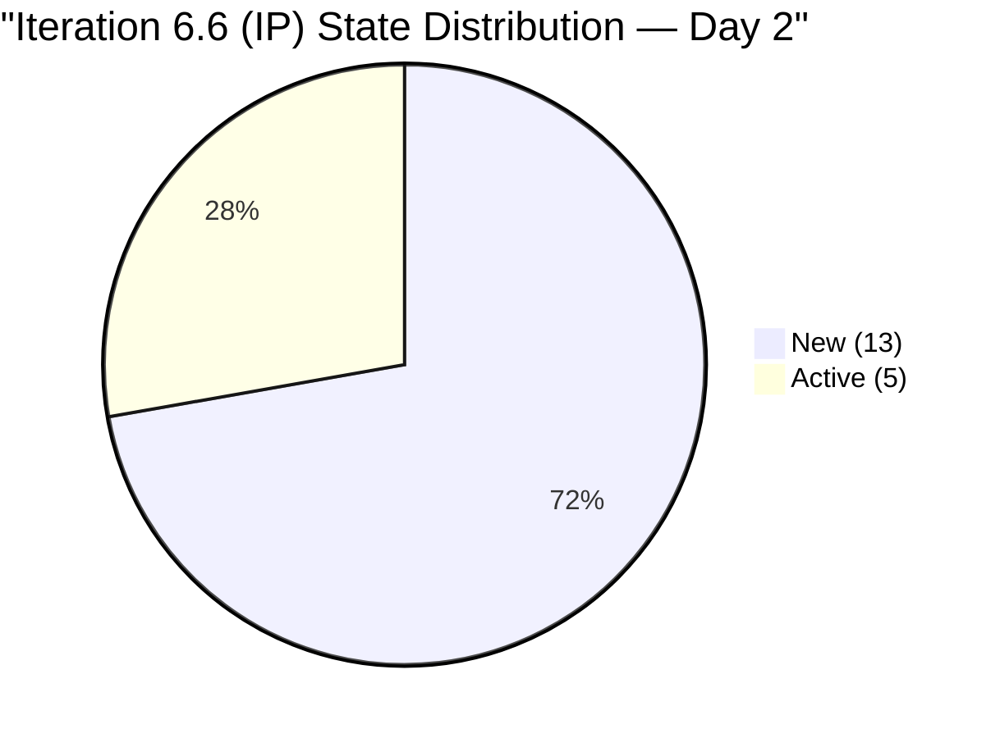
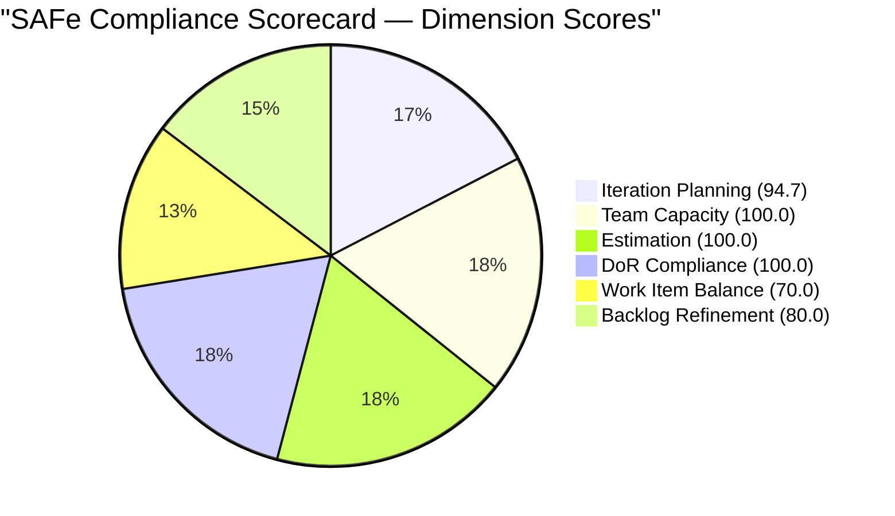

# SAFe Audit Report — Human Resource Recruitment Team

## 1. Audit Metadata

| Field | Value |
|-------|-------|
| **Project** | Jairosoft FINOPS |
| **Team** | Human Resource Recruitment Team |
| **Workspace Folder** | `ado_hr` |
| **Current Iteration** | Iteration 6.6 (IP) — Mar 23 – Apr 5, 2026 |
| **Iteration Start** | 2026-03-23 |
| **Iteration Finish** | 2026-04-05 |
| **Audit Date** | March 25, 2026 (UTC) — Sprint Day 2 of 10 |
| **Previous Audit** | AUDIT_2026-03-22_2329.md (Iteration 6.5 Sprint End, Score 8.0/10) |
| **Overall Score** | **90.8 / 100 (Low Risk)** |
| **Scoring Rubric** | ADO SAFe v1 (six-dimension, 0–100 per dimension) |
| **Auditor** | Claude (SAFe Agile PM Consultant) |
| **Framework** | SAFe 6.0 (Scaled Agile Framework) |

---

## 2. Executive Summary

This is the **first audit of Iteration 6.6 (IP)** and the **13th audit in the series**. The team transitions from a historic 100% sprint completion in 6.5 into the Innovation and Planning (IP) iteration with a strong, well-structured backlog.

**Key observations:**

- **18 items committed** to Iteration 6.6 (IP) totaling **34 story points** — identical volume to 6.5
- **5 items already Active**, 13 still New — work has begun on Day 2
- **100% estimation coverage** — all 18 items have story points assigned
- **100% DoR compliance** — all items have descriptions and acceptance criteria
- **Team capacity configured** — Almera at 5 hrs/day (4 Documentation + 1 Requirements), 1 day off (Apr 1)
- **Bus factor remains 1** — Almera is the sole contributor (structural, unchanged)
- **No iteration goal defined** — 13th consecutive audit without a sprint goal
- **12 of 18 items untouched** since before the iteration started (66.7%) — a backlog refinement drag

**Overall SAFe Compliance Score: 90.8 / 100 (Low Risk)** — a significant jump from the prior audit's 8.0/10 legacy scale, driven by strong planning fundamentals at sprint start. The main drags are work item type homogeneity (100% User Stories, -30 on Work Item Balance) and the high proportion of untouched items (-20 on Backlog Refinement).

---

## 3. Previous Audit Delta

| Metric | 6.5 Sprint End (Mar 22) | 6.6 Day 2 (Mar 25) | Delta |
|--------|-------------------------|---------------------|-------|
| Iteration | 6.5 (completed) | 6.6 (IP) — new sprint | New iteration |
| Items committed | 18 | 18 | Same volume |
| Story points | 34 SP | 34 SP | Same capacity |
| Estimation coverage | 100% (18/18) | 100% (18/18) | Sustained |
| DoR compliance | 100% (18/18) | 100% (18/18) | Sustained |
| Items closed | 18 (100%) | 0 (0%) | Sprint just started |
| Active WIP | 0 | 5 | Work has begun |
| Team capacity configured | Yes | Yes | Sustained |
| Iteration goal | Not defined | Not defined | 13th audit without |
| PI objectives | Not linked | Not linked | 13th audit without |
| Scoring rubric | Legacy 0–10 scale | ADO SAFe v1 (0–100) | New rubric |

> **Note:** This audit uses the standardized ADO SAFe v1 six-dimension scoring rubric (0–100 per dimension), replacing the prior legacy 0–10 scale. Scores are not directly comparable across rubric versions.

---

## 4. Current Iteration Snapshot

### 4.1 Iteration Overview

| Metric | Value |
|--------|-------|
| Iteration name | Iteration 6.6 (IP) |
| Date range | Mar 23 – Apr 5, 2026 (10 working days) |
| Sprint day | Day 2 of 10 |
| Total items committed | 18 |
| Total story points | 34 SP |
| Items closed | 0 (0%) |
| Items active | 5 (27.8%) |
| Items new | 13 (72.2%) |
| Team capacity | 5 hrs/day (Almera only) |
| Days off | 1 (Apr 1 — Almera) |

### 4.2 Capacity Configuration

| Team Member | Activities | Capacity/Day | Days Off |
|-------------|------------|--------------|----------|
| Almera Kleer Tayao | Documentation (4 hrs), Requirements (1 hr) | 5 hrs/day | Apr 1 |
| **Total** | | **5 hrs/day** | **1 day** |

### 4.3 State Distribution

---

## 5. Work Item Analysis

### 5.1 Full Sprint Backlog (18 items, 34 SP)

| # | ID | Title | State | SP | Type | Changed Date |
|---|------|-------|-------|----|------|-------------|
| 1 | 201474 | Annual Medical Exam Budget - Cebu | Active | 2 | User Story | Mar 24 |
| 2 | 201483 | Result Reading with Doc Karl for Davao/Cebu | Active | 2 | User Story | Mar 24 |
| 3 | 201264 | LinkedIn Senior Technical Lead Hiring - Interview | Active | 2 | User Story | Mar 24 |
| 4 | 200319 | LinkedIn DevOps Engr. Hiring | Active | 2 | User Story | Mar 24 |
| 5 | 201256 | Annual Medical Check-up Make-up - Cebu | Active | 1 | User Story | Mar 24 |
| 6 | 200671 | LinkedIn Tech Sales from Manila Hiring | New | 1 | User Story | Mar 24 |
| 7 | 201209 | S&M - John Dave Fernandez (Final Interview/Decision) | New | 1 | User Story | Mar 17 |
| 8 | 201207 | S&M - Edgardo Rojas Jr. (Final Interview/Decision) | New | 1 | User Story | Mar 17 |
| 9 | 201208 | S&M - Jugadora, Anna Danica (Final Interview/Decision) | New | 1 | User Story | Mar 17 |
| 10 | 197939 | Communication Skills Proposals Summary | New | 2 | User Story | Mar 17 |
| 11 | 201274 | APE - Bon Jovie Cueva - Summary | New | 2 | User Story | Mar 18 |
| 12 | 201275 | APE - Rommel Senillo - Summary | New | 2 | User Story | Mar 18 |
| 13 | 201276 | APE - Ryan Vince Castillo - Summary | New | 2 | User Story | Mar 18 |
| 14 | 201277 | APE - Calvin John Dalino - Summary | New | 2 | User Story | Mar 18 |
| 15 | 193582 | APE - Caumban, Karl Jordan | New | 2 | User Story | Mar 17 |
| 16 | 195671 | Joniel to upload digital 201 files to Employee Portal | New | 5 | User Story | Mar 12 |
| 17 | 201272 | LinkedIn Bubble Developer Hiring - Interview | New | 2 | User Story | Mar 18 |
| 18 | 201273 | LinkedIn Bubble Trainer Hiring - Interview | New | 2 | User Story | Mar 18 |
| | **TOTAL** | | **5 Active / 13 New** | **34** | | |

### 5.2 Backlog Item Not in Current Iteration

| ID | Title | State | SP | Iteration Path | Changed Date |
|----|-------|-------|----|----------------|-------------|
| 200677 | Technical Interviews of qualified applicants | New | 2 | 2026-PI6 (unassigned) | Mar 9 |

> Item #200677 appears on the Stories and Deliverables backlog but is assigned to the parent PI level, not to Iteration 6.6 (IP). It is counted in `visible_root_backlog_items` but not in `current_iteration_root_items`.

### 5.3 Work Item Type Distribution

| Type | Count | Share |
|------|-------|-------|
| User Story | 18 | 100% |
| Spike | 0 | 0% |
| Defect | 0 | 0% |
| Issue | 0 | 0% |

> **100% User Story homogeneity.** While this maintains consistency, it triggers a -30 penalty on Work Item Balance (dominant_type_share > 60%). For an IP iteration, the absence of Spikes or exploration items is notable — IP iterations in SAFe are intended for innovation, infrastructure, and exploration work alongside completing carried-over stories.

### 5.4 Work Categories

| Category | Items | SP | IDs |
|----------|-------|----|-----|
| **Hiring / Recruitment** | 8 | 13 | 201207, 201208, 201209, 200671, 201264, 201272, 201273, 200319 |
| **APE (Performance Evaluation)** | 5 | 10 | 201274, 201275, 201276, 201277, 193582 |
| **Medical / Health** | 3 | 5 | 201256, 201474, 201483 |
| **Training** | 1 | 2 | 197939 |
| **Records / Administration** | 1 | 5 | 195671 |

### 5.5 Untouched Items (Changed Before Iteration Start)

12 of 18 items (66.7%) have not been modified since the iteration began on Mar 23. This is expected on Day 2, but should improve significantly as the sprint progresses.

---

## 6. SAFe Compliance Scorecard

| # | Dimension | Score | Evidence | Notes |
|---|-----------|-------|----------|-------|
| 1 | **Iteration Planning** | **94.7** | 18 of 19 backlog items assigned to current iteration | 1 item (#200677) sits at PI level unassigned. Strong planning. |
| 2 | **Team Capacity** | **100.0** | 1/1 contributors with capacity configured | Almera: 5 hrs/day, 1 day off. Capacity is set. Bus factor = 1 remains structural. |
| 3 | **Estimation** | **100.0** | 18/18 point-eligible items have Story Points > 0 | All items estimated. Total: 34 SP. Sustained from 6.5. |
| 4 | **DoR Compliance** | **100.0** | 18/18 items meet Description (>=30 chars) and AC (>=20 chars) thresholds | Full DoR compliance sustained. All items have rich descriptions and acceptance criteria. |
| 5 | **Work Item Balance** | **70.0** | 100% User Story (dominant_type_share penalty: -30) | No Spikes, Defects, or Issues. Expected some exploration items in an IP iteration. |
| 6 | **Backlog Refinement** | **80.0** | 19/19 fresh (<45 days), 0 stale-90, 0 stale-180. Untouched penalty: -20 (12/18 = 66.7%) | All backlog items are fresh. The untouched ratio is high but expected on Day 2. |
| | **Overall** | **90.8** | **Low Risk** | Weighted average of six dimensions. |

---

## 7. Dimension Findings

### 7.1 Iteration Planning (94.7/100)

- **Strong.** 18 of 19 visible backlog items are assigned to the current iteration.
- One item (#200677 — Technical Interviews of qualified applicants) is assigned to the PI level rather than a specific iteration. This should be either assigned to 6.6 or groomed for a future iteration.
- Sprint commitment of 34 SP matches the successfully completed 6.5 velocity — good use of historical data for planning.

### 7.2 Team Capacity (100.0/100)

- **Full marks.** Almera is the sole contributor with current work and has capacity configured (5 hrs/day across Documentation and Requirements activities).
- One day off scheduled (Apr 1).
- **Structural risk:** Bus factor = 1 persists. Grace has no capacity allocated and no work assigned. This is unchanged for 13 audits.

### 7.3 Estimation (100.0/100)

- **Full marks.** All 18 items have story points assigned.
- Total: 34 SP across 18 items (average 1.9 SP/item).
- Point distribution: 1 SP (4 items), 2 SP (13 items), 5 SP (1 item).
- The single 5 SP item (#195671 — Joniel 201 file upload) is the largest item and may warrant decomposition if it proves complex.

### 7.4 DoR Compliance (100.0/100)

- **Full marks.** All 18 items have both Description and Acceptance Criteria that exceed the minimum thresholds.
- This is a sustained improvement from the 6.5 series where DoR compliance reached 100% by mid-sprint.

### 7.5 Work Item Balance (70.0/100)

- **Penalty applied:** dominant_type_share = 100% (all User Stories) exceeds 60% threshold (-30 points).
- No Spikes or exploration items exist in this IP iteration. Per SAFe, IP iterations are designated for innovation, infrastructure improvements, and technical debt — the absence of Spikes is a missed opportunity.
- No Defects or Issues indicates either a clean operational state or under-reporting of defects.

### 7.6 Backlog Refinement (80.0/100)

- **Base score: 100.0** — All 19 backlog items have been changed within the last 45 days (100% fresh).
- **No stale items:** 0 items older than 90 days, 0 items older than 180 days. This is excellent backlog hygiene.
- **Penalty applied:** 12 of 18 current iteration items (66.7%) have not been modified since the iteration started on Mar 23 (-20 points for untouched > 30%).
- This penalty is contextually expected on Day 2 of the sprint. As work begins on these items, the untouched ratio will naturally decrease.

---

## 8. Risks and Bottlenecks

| Risk | Severity | Status | Mitigation |
|------|----------|--------|------------|
| **Bus factor = 1** | Critical (Structural) | Unchanged — 13th audit | Cross-train Grace or add capacity. Single point of failure. |
| **No iteration goal** | High | Unchanged — 13th audit | Define a measurable sprint goal tied to business value before next sprint planning. |
| **No PI objectives** | High | Unchanged — 13th audit | Link Features to program-level PI6 objectives. |
| **IP iteration without Spikes** | Medium | New finding | Add at least 1 Spike or exploration item to leverage the IP iteration purpose. |
| **High untouched ratio (66.7%)** | Low | Day 2 context | Monitor — expected to resolve as sprint progresses. Flag if still >30% by Day 5. |
| **Overdue target dates** | Medium | Carried from 6.5 | Items #200319, #200671, #201256, #201264, #201272, #201273 have target dates in the past (Mar 10–20). Update target dates to reflect 6.6 timelines. |

---

## 9. Prioritized Recommendations

### P1 — Critical (Immediate)

1. **Update stale target dates.** Six items carry target dates from Iteration 6.5 (Mar 10–20) that have already passed. Update these to realistic 6.6 dates to maintain accurate tracking:
   - #200319 (LinkedIn DevOps Engr.) — target Mar 13
   - #200671 (LinkedIn Tech Sales) — target Mar 10
   - #201256 (Medical CU Cebu) — target Mar 13
   - #201264 (LinkedIn Sr Tech Lead) — target Mar 20
   - #201272 (LinkedIn Bubble Dev) — target Mar 20
   - #201273 (LinkedIn Bubble Trainer) — target Mar 20

2. **Define an iteration goal for 6.6 (IP).** This has been absent for 13 consecutive audits. Example: "Complete all carried-over hiring decisions and APE summaries; finalize Cebu medical exam budget and result readings." This is a mandatory SAFe artifact.

### P2 — Important (This Sprint)

3. **Link Features to PI6 Objectives.** Also absent for 13 audits. Establish PI6 objectives and map each Feature. Without this, the team's work is disconnected from organizational strategy.

4. **Add at least one Spike or exploration item.** Iteration 6.6 is the IP iteration — SAFe designates this time for innovation, infrastructure, and technical debt. Consider a Spike for process improvement (e.g., automating the hiring pipeline, creating an APE template, or exploring new HR tools).

5. **Assign or groom item #200677** (Technical Interviews of qualified applicants, 2 SP). It sits at the PI level without an iteration assignment. Either pull it into 6.6 or explicitly defer it.

### P3 — Strategic (Ongoing)

6. **Address bus factor.** Almera continues to be the sole active team member. Cross-training Grace or allocating work to her would reduce structural risk and improve team resilience.

7. **Leverage the IP iteration for retrospective action items.** The 6.5 retrospective identified the stall-burst delivery pattern and mid-sprint scope creep as key improvement areas. Use 6.6 (IP) to implement process changes that prevent these patterns in the next PI.

---

## 10. Evidence Gaps and Limitations

| Gap | Impact | Notes |
|-----|--------|-------|
| **No iteration goal artifact in ADO** | Cannot verify sprint goal existence via API | Confirmed absent based on 13-audit history. No ADO field for iteration goal was found in team settings. |
| **PI Objectives not verifiable via backlog** | Cannot confirm Feature-to-PI linkage | No PI Objective work items found linked to current Features. |
| **Scoring rubric transition** | Prior audit used legacy 0–10 scale | This audit uses ADO SAFe v1 (0–100 per dimension). Scores are not directly comparable to the 8.0/10 from the prior audit. |
| **Day 2 timing** | Untouched ratio inflated | The 66.7% untouched ratio is expected this early in the sprint and will naturally decrease. The -20 penalty is a formula-driven artifact of early-sprint auditing. |

---

*Report generated on March 25, 2026 (UTC) — ADO SAFe v1 Compliance Audit (Iteration 6.6 IP, Sprint Day 2)*
*Audit series: #1 Feb 25 | #2 Mar 3 | #3 Mar 4 | #4 Mar 5 | #5 Mar 6 | #6 Mar 9 | #7 Mar 10 | #8 Mar 11 | #9 Mar 16 | #10 Mar 17 | #11 Mar 18 | #12 Mar 22 | #13 Mar 25 (this report)*
*Previous audit: AUDIT_2026-03-22_2329.md | Rubric change: legacy 0–10 to ADO SAFe v1 0–100*
