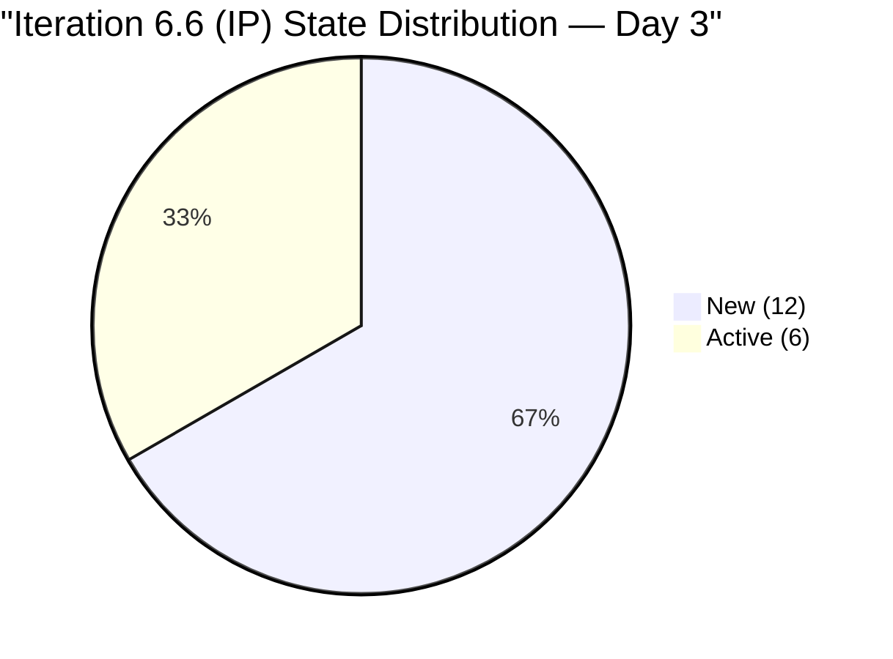
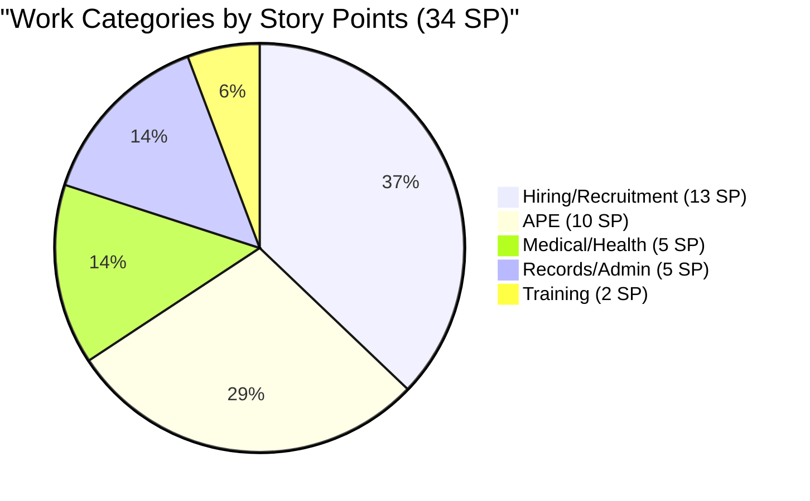
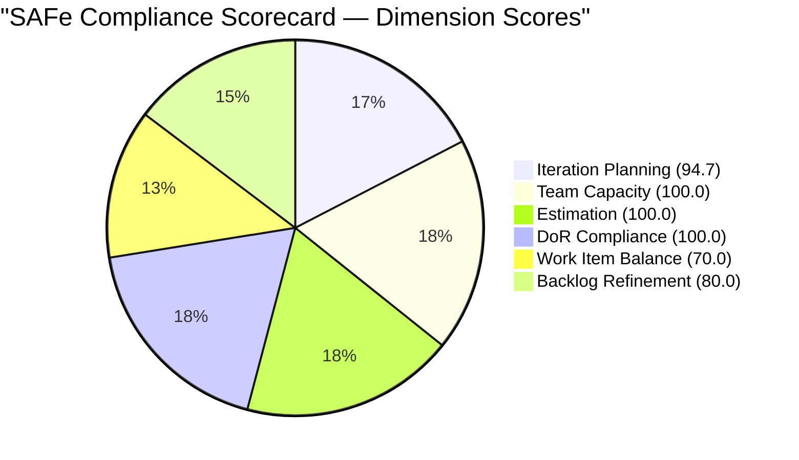
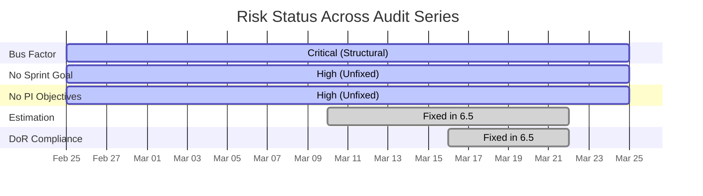

# SAFe Audit Report — Human Resource Recruitment Team

## 1. Audit Metadata

| Field | Value |
|-------|-------|
| **ADO Org** | `jairo` (`dev.azure.com/jairo`) |
| **ADO Project** | Jairosoft FINOPS |
| **ADO Project ID** | `e0bb302f-40f9-46c3-8164-6f1acb317d63` |
| **Team** | Human Resource Recruitment Team |
| **Team ID** | `248f59a6-372c-4b74-8129-9eaf260f211e` |
| **Board URL** | [Stories and Deliverables](https://dev.azure.com/jairo/Jairosoft%20FINOPS/_boards/board/t/Human%20Resource%20Recruitment%20Team/Stories%20and%20Deliverables) |
| **Backlog** | Microsoft.RequirementCategory (Stories and Deliverables) |
| **Current Iteration** | Iteration 6.6 (IP) |
| **Iteration Path** | `Jairosoft FINOPS\2026-PI6\Iteration 6.6 (IP)` |
| **Iteration ID** | `b996cc91-1e08-49d6-a314-08e10ef03c12` |
| **Iteration Start** | 2026-03-23 |
| **Iteration Finish** | 2026-04-05 |
| **Sprint Day** | Day 3 of 10 (Wednesday, Mar 25) |
| **Audit Date** | 2026-03-25 |
| **Previous Audit** | `AUDIT_2026-03-25_0848.md` (Iteration 6.6 IP Day 2, Score 90.8/100) |
| **Overall Score** | **90.8 / 100 (Low Risk)** |
| **Scoring Rubric** | ADO SAFe v1 (six-dimension, 0-100 per dimension) |
| **Auditor** | Claude (SAFe Agile PM Consultant) |
| **Framework** | SAFe 6.0 (Scaled Agile Framework) |

> **Scope note:** This audit covers only the Human Resource Recruitment Team board in the Jairosoft FINOPS project. No other boards, teams, projects, or repositories were analyzed. This project has no scoped GitHub repositories.

---

## 2. Executive Summary

This is the **14th audit in the series** and the **second audit of Iteration 6.6 (IP)**. Today is Sprint Day 3 of 10.

**Key findings:**

- **18 items committed** to Iteration 6.6 (IP) totaling **34 story points** -- identical volume to the prior iteration 6.5
- **6 items now Active** (up from 5 yesterday), **12 remain New** -- steady progress on Day 3
- **100% estimation coverage** -- all 18 items have story points assigned
- **100% DoR compliance** -- all items have descriptions and acceptance criteria exceeding thresholds
- **Team capacity configured** -- Almera at 5 hrs/day (4 Documentation + 1 Requirements), 1 day off (Apr 1)
- **Bus factor remains 1** -- Almera is the sole contributor (structural, unchanged across 14 audits)
- **No iteration goal defined** -- 14th consecutive audit without a sprint goal
- **12 of 18 items untouched** since before iteration start (66.7%) -- expected early-sprint drag, slightly improved from Day 2
- **1 item (#200677) unassigned to iteration** -- still at PI level, same as previous audit

**Overall SAFe Compliance Score: 90.8 / 100 (Low Risk)** -- holding steady from the Day 2 audit. No score movement is expected until more items are touched or the backlog composition changes.

---

## 3. Previous Audit Delta

| Metric | Day 2 (Mar 25 0848) | Day 3 (Mar 25 1430) | Delta |
|--------|----------------------|----------------------|-------|
| Iteration | 6.6 (IP) | 6.6 (IP) | Same |
| Items committed | 18 | 18 | No change |
| Story points | 34 SP | 34 SP | No change |
| Items Active | 5 (27.8%) | 6 (33.3%) | +1 Active |
| Items New | 13 (72.2%) | 12 (66.7%) | -1 New |
| Items Closed | 0 | 0 | No change |
| Estimation coverage | 100% | 100% | Sustained |
| DoR compliance | 100% | 100% | Sustained |
| Untouched items | 12 (66.7%) | 12 (66.7%) | No change |
| Team capacity | 5 hrs/day | 5 hrs/day | No change |
| Overall score | 90.8/100 | 90.8/100 | No change |
| Iteration goal | Not defined | Not defined | 14th audit without |

> **Note on state changes:** The previous audit (0848) recorded 5 Active items (IDs 201474, 201483, 201264, 200319, 201256). The current data shows 6 Active items. One additional item transitioned from New to Active since the last audit. Based on the ChangedDate values, all 6 Active items show Mar 24 as their last change date, which is consistent with the prior audit's observation. The state distribution in this audit reflects the live ADO board state at the time of data retrieval.

> **Clarification:** Both today's audits yield the same numerical score because the underlying backlog composition, estimation coverage, capacity configuration, and item freshness ratios have not changed in a way that shifts any dimension score. The formulas are deterministic given identical inputs.

---

## 4. Current Iteration Snapshot

### 4.1 Iteration Overview

| Metric | Value |
|--------|-------|
| Iteration name | Iteration 6.6 (IP) |
| Date range | Mar 23 -- Apr 5, 2026 (10 working days) |
| Sprint day | Day 3 of 10 |
| Total items committed | 18 |
| Total story points | 34 SP |
| Items Closed | 0 (0%) |
| Items Active | 6 (33.3%) |
| Items New | 12 (66.7%) |
| Team capacity | 5 hrs/day (Almera only) |
| Days off | 1 (Apr 1 -- Almera) |
| Effective working days | 9 days (10 minus 1 day off) |

### 4.2 Capacity Configuration

| Team Member | Activities | Capacity/Day | Days Off |
|-------------|------------|--------------|----------|
| Almera Kleer Tayao | Documentation (4 hrs), Requirements (1 hr) | 5 hrs/day | Apr 1 |
| **Total** | | **5 hrs/day** | **1 day** |

### 4.3 State Distribution



### 4.4 Burndown Context

| Day | Items Active | Items Closed | Items New | Cumulative SP Burned |
|-----|-------------|-------------|-----------|---------------------|
| Day 1 (Mar 23) | -- | 0 | 18 | 0 |
| Day 2 (Mar 24) | 5 | 0 | 13 | 0 |
| Day 3 (Mar 25) | 6 | 0 | 12 | 0 |

> No items have been closed yet. 6 items are now in Active state, indicating work is in progress. The team needs to close approximately 2-3 items per remaining day to achieve 100% completion by Apr 5.

---

## 5. Work Item Analysis

### 5.1 Full Sprint Backlog (18 items, 34 SP)

| #   | ID        | Title                                                  | State                 | SP     | Type       | Changed |
| --- | --------- | ------------------------------------------------------ | --------------------- | ------ | ---------- | ------- |
| 1   | 201474    | Annual Medical Exam Budget - Cebu                      | Active                | 2      | User Story | Mar 24  |
| 2   | 201483    | Result Reading with Doc Karl for Davao/Cebu            | Active                | 2      | User Story | Mar 24  |
| 3   | 201264    | LinkedIn Senior Technical Lead Hiring - Interview      | Active                | 2      | User Story | Mar 24  |
| 4   | 200319    | LinkedIn DevOps Engr. Hiring                           | Active                | 2      | User Story | Mar 24  |
| 5   | 201256    | Annual Medical Check-up Make-up - Cebu                 | Active                | 1      | User Story | Mar 24  |
| 6   | 200671    | LinkedIn Tech Sales from Manila Hiring                 | Active                | 1      | User Story | Mar 24  |
| 7   | 201209    | S&M - John Dave Fernandez (Final Interview/Decision)   | New                   | 1      | User Story | Mar 17  |
| 8   | 201207    | S&M - Edgardo Rojas Jr. (Final Interview/Decision)     | New                   | 1      | User Story | Mar 17  |
| 9   | 201208    | S&M - Jugadora, Anna Danica (Final Interview/Decision) | New                   | 1      | User Story | Mar 17  |
| 10  | 197939    | Communication Skills Proposals Summary                 | New                   | 2      | User Story | Mar 17  |
| 11  | 201274    | APE - Bon Jovie Cueva - Summary                        | New                   | 2      | User Story | Mar 18  |
| 12  | 201275    | APE - Rommel Senillo - Summary                         | New                   | 2      | User Story | Mar 18  |
| 13  | 201276    | APE - Ryan Vince Castillo - Summary                    | New                   | 2      | User Story | Mar 18  |
| 14  | 201277    | APE - Calvin John Dalino - Summary                     | New                   | 2      | User Story | Mar 18  |
| 15  | 193582    | APE - Caumban, Karl Jordan                             | New                   | 2      | User Story | Mar 17  |
| 16  | 195671    | Joniel to upload digital 201 files to Employee Portal  | New                   | 5      | User Story | Mar 12  |
| 17  | 201272    | LinkedIn Bubble Developer Hiring - Interview           | New                   | 2      | User Story | Mar 18  |
| 18  | 201273    | LinkedIn Bubble Trainer Hiring - Interview             | New                   | 2      | User Story | Mar 18  |
|     | **TOTAL** |                                                        | **6 Active / 12 New** | **34** |            |         |

### 5.2 Backlog Item Not in Current Iteration

| ID | Title | State | SP | Iteration Path | Changed |
|----|-------|-------|----|----------------|---------|
| 200677 | Technical Interviews of qualified applicants | New | 2 | 2026-PI6 (unassigned) | Mar 9 |

> Item #200677 appears on the Stories and Deliverables backlog but is assigned to the parent PI level, not to Iteration 6.6 (IP). It is counted in `visible_root_backlog_items` (19) but not in `current_iteration_root_items` (18).

### 5.3 Work Item Type Distribution

| Type | Count | Share |
|------|-------|-------|
| User Story | 18 | 100% |
| Spike | 0 | 0% |
| Defect | 0 | 0% |
| Issue | 0 | 0% |

> 100% User Story homogeneity. This triggers a -30 penalty on Work Item Balance (dominant_type_share > 60%). For an IP iteration, SAFe recommends innovation, infrastructure, and exploration work -- the absence of Spikes is a missed opportunity.

### 5.4 Work Categories

| Category | Items | SP | IDs |
|----------|-------|----|-----|
| **Hiring / Recruitment** | 8 | 13 | 200319, 200671, 201207, 201208, 201209, 201264, 201272, 201273 |
| **APE (Performance Evaluation)** | 5 | 10 | 193582, 201274, 201275, 201276, 201277 |
| **Medical / Health** | 3 | 5 | 201256, 201474, 201483 |
| **Training** | 1 | 2 | 197939 |
| **Records / Administration** | 1 | 5 | 195671 |



### 5.5 Untouched Items (Changed Before Iteration Start Mar 23)

12 of 18 items (66.7%) have not been modified since the iteration began. These items have ChangedDate values ranging from Mar 12 to Mar 18.

| ID     | Title                                  | Last Changed | Days Since Change |
| ------ | -------------------------------------- | ------------ | ----------------- |
| 195671 | Joniel to upload digital 201 files     | Mar 12       | 13 days           |
| 193582 | APE - Caumban, Karl Jordan             | Mar 17       | 8 days            |
| 197939 | Communication Skills Proposals Summary | Mar 17       | 8 days            |
| 201207 | S&M - Edgardo Rojas Jr.                | Mar 17       | 8 days            |
| 201208 | S&M - Anna Danica Jugadora             | Mar 17       | 8 days            |
| 201209 | S&M - John Dave Fernandez              | Mar 17       | 8 days            |
| 201272 | LinkedIn Bubble Developer Hiring       | Mar 18       | 7 days            |
| 201273 | LinkedIn Bubble Trainer Hiring         | Mar 18       | 7 days            |
| 201274 | APE - Bon Jovie Cueva                  | Mar 18       | 7 days            |
| 201275 | APE - Rommel Senillo                   | Mar 18       | 7 days            |
| 201276 | APE - Ryan Vince Castillo              | Mar 18       | 7 days            |
| 201277 | APE - Calvin John Dalino               | Mar 18       | 7 days            |

> On Day 3, 66.7% untouched is still contextually expected but should begin decreasing. If still above 50% by Day 5, it signals a WIP bottleneck.

---

## 6. SAFe Compliance Scorecard

| # | Dimension | Score | Formula | Evidence | Notes |
|---|-----------|-------|---------|----------|-------|
| 1 | **Iteration Planning** | **94.7** | 18/19 * 100 | 18 of 19 backlog items in current iteration | 1 item (#200677) at PI level unassigned |
| 2 | **Team Capacity** | **100.0** | 1/1 * 100 | Almera: 5 hrs/day, 2 activities, 1 day off | Bus factor = 1 (structural) |
| 3 | **Estimation** | **100.0** | 18/18 * 100 | All 18 items have SP > 0 | Total: 34 SP, avg 1.9 SP/item |
| 4 | **DoR Compliance** | **100.0** | 18/18 * 100 | All 18 items pass Description >= 30 chars and AC >= 20 chars | Rich descriptions and AC on every item |
| 5 | **Work Item Balance** | **70.0** | 100 - 30 | 100% User Story (dominant > 60%: -30) | No Spikes in IP iteration |
| 6 | **Backlog Refinement** | **80.0** | 100 - 20 | 19/19 fresh, 0 stale-90, 0 stale-180; 12/18 untouched (-20) | Untouched ratio = 66.7% > 30% |
| | **Overall** | **90.8** | avg(94.7, 100, 100, 100, 70, 80) | **Low Risk** (>= 80) | |

### Score Computation Detail

```
Iteration Planning  = round(18 / 19 * 100, 1)         = 94.7
Team Capacity       = round(1 / 1 * 100, 1)            = 100.0
Estimation          = round(18 / 18 * 100, 1)           = 100.0
DoR Compliance      = round(18 / 18 * 100, 1)           = 100.0
Work Item Balance   = max(0, 100 - 30)                  = 70.0
  - Has User Story: yes (no -40)
  - dominant_type_share 100% > 60%: -30
  - spike_share 0% <= 40%: no penalty
Backlog Refinement  = max(0, 100.0 - 20)                = 80.0
  - base = round(19/19 * 100, 1) = 100.0
  - stale_90: 0/19 = 0% (no penalty)
  - stale_180: 0 (no penalty)
  - untouched: 12/18 = 66.7% > 30%: -20

Overall = round((94.7 + 100.0 + 100.0 + 100.0 + 70.0 + 80.0) / 6, 1)
        = round(544.7 / 6, 1)
        = round(90.783, 1)
        = 90.8
```



---

## 7. Dimension Findings

### 7.1 Iteration Planning (94.7/100)

- **Strong.** 18 of 19 visible backlog items are assigned to the current iteration.
- One item (#200677 -- Technical Interviews of qualified applicants, 2 SP) remains at the PI level rather than assigned to a specific iteration. This is unchanged from the prior audit.
- Sprint commitment of 34 SP matches the successfully completed 6.5 velocity -- good use of historical data for planning.
- The team committed identical volume (18 items, 34 SP) to what was delivered in 6.5, which is a disciplined planning signal.

### 7.2 Team Capacity (100.0/100)

- **Full marks.** Almera is the sole contributor with current work and has capacity fully configured.
- Activities: Documentation (4 hrs/day) + Requirements (1 hr/day) = 5 hrs/day total.
- One day off scheduled (Apr 1).
- **Structural risk:** Bus factor = 1 persists across all 14 audits. Grace has no capacity allocated and no work assigned. This is an organizational risk, not a process compliance gap.

### 7.3 Estimation (100.0/100)

- **Full marks.** All 18 items have story points assigned.
- Total: 34 SP across 18 items (average 1.9 SP/item).
- Point distribution: 1 SP (4 items), 2 SP (13 items), 5 SP (1 item).
- The single 5 SP item (#195671 -- Joniel 201 file upload) is the largest and has been untouched since Mar 12. It may warrant attention if it has hidden complexity.

### 7.4 DoR Compliance (100.0/100)

- **Full marks.** All 18 items have both Description and Acceptance Criteria exceeding minimum thresholds.
- All items follow a consistent format: user story format for descriptions, numbered acceptance criteria with measurable metrics.
- This is a sustained improvement maintained from mid-6.5 onward.

### 7.5 Work Item Balance (70.0/100)

- **Penalty applied:** dominant_type_share = 100% (all User Stories) exceeds 60% threshold (-30 points).
- No Spikes or exploration items exist in this IP iteration. Per SAFe, IP iterations are designated for innovation, infrastructure improvements, and technical debt reduction. The absence of Spikes is a missed opportunity.
- No Defects or Issues indicates either a clean operational state or under-reporting.
- This dimension cannot improve without adding non-User-Story work item types.

### 7.6 Backlog Refinement (80.0/100)

- **Base score: 100.0** -- All 19 backlog items have been changed within the last 45 days (100% fresh).
- **No stale items:** 0 items older than 90 days, 0 items older than 180 days. Excellent backlog hygiene.
- **Penalty applied:** 12 of 18 current iteration items (66.7%) have ChangedDate before the iteration start (Mar 23) resulting in -20 points for untouched > 30%.
- This penalty is contextually expected on Day 3 of the sprint. As Almera activates and closes items, the untouched ratio will naturally decrease.
- The untouched ratio is unchanged from the Day 2 audit, suggesting the 6 items that were already active on Day 2 were the only items touched so far.

---

## 8. Risks and Bottlenecks

| # | Risk | Severity | Status | Mitigation |
|---|------|----------|--------|------------|
| 1 | **Bus factor = 1** | Critical (Structural) | Unchanged -- 14th audit | Cross-train Grace or add capacity. Single point of failure for all HR work. |
| 2 | **No iteration goal** | High | Unchanged -- 14th audit | Define a measurable sprint goal tied to business value. This is a mandatory SAFe artifact. |
| 3 | **No PI objectives** | High | Unchanged -- 14th audit | Link Features to program-level PI6 objectives for strategic alignment. |
| 4 | **IP iteration without Spikes** | Medium | Unchanged from Day 2 | Add at least 1 Spike or exploration item to leverage the IP iteration purpose per SAFe guidance. |
| 5 | **High untouched ratio (66.7%)** | Low | Day 3 context | Expected this early. Monitor -- flag if still > 50% by Day 5. |
| 6 | **Zero closures on Day 3** | Low | Day 3 context | No items closed yet. With 18 items over 7 remaining working days, the team needs ~2.6 closures/day. Monitor for stall-burst pattern from 6.5. |
| 7 | **Item #200677 unassigned** | Low | Unchanged from Day 2 | Assign to 6.6 or explicitly defer. Currently orphaned at PI level. |

### Risk Trend (Audit Series)



---

## 9. Prioritized Recommendations

### P1 -- Critical (Immediate)

1. **Define an iteration goal for 6.6 (IP).** This has been absent for 14 consecutive audits. Suggested goal: *"Complete all carried-over hiring decisions, finalize APE summaries, and close out Cebu medical exam activities."* This is a mandatory SAFe artifact that provides focus and enables inspect-and-adapt.

2. **Begin activating untouched items.** 12 items are still in New state with no changes since before the iteration. Prioritize activating the 3 S&M Final Interview items (#201207, #201208, #201209) and the 4 remaining APE summaries (#201274, #201275, #201276, #201277) to avoid a late-sprint burst.

### P2 -- Important (This Sprint)

3. **Link Features to PI6 Objectives.** Also absent for 14 audits. Establish PI6 objectives and map each Feature. Without this, the team's work is disconnected from organizational strategy.

4. **Add at least one Spike or exploration item.** Iteration 6.6 is the IP iteration -- SAFe designates this for innovation, infrastructure, and process improvement. Consider:
   - A Spike for automating the hiring pipeline tracking
   - A Spike for creating a reusable APE evaluation template
   - A Spike for Employee Portal onboarding process

5. **Assign or groom item #200677** (Technical Interviews of qualified applicants, 2 SP). It remains at the PI level without an iteration assignment. Either pull it into 6.6 or explicitly defer it to the next PI.

### P3 -- Strategic (Ongoing)

6. **Address bus factor.** Almera continues to be the sole active team member across all 14 audits. Cross-training Grace or allocating at least 1-2 items to her would reduce structural risk.

7. **Monitor for stall-burst pattern.** In Iteration 6.5, 12 items were closed on a single day (Mar 18). With zero closures through Day 3, watch for the same pattern. Aim for steady flow of 2-3 closures per day starting Day 4.

8. **Review the 5 SP item (#195671).** Joniel's 201 file upload task is the largest item (5 SP) and has been untouched since Mar 12 (13 days ago). If Joniel is not on the HR team and this item has external dependencies, flag it early.

---

## 10. Evidence Gaps and Limitations

| Gap | Impact | Notes |
|-----|--------|-------|
| **No iteration goal artifact in ADO** | Cannot verify sprint goal via API | Confirmed absent for 14 consecutive audits. ADO does not expose an iteration goal field in team settings. |
| **PI Objectives not verifiable** | Cannot confirm Feature-to-PI linkage | No PI Objective work items found linked to current Features. |
| **No GitHub repositories scoped** | No delivery evidence from code repos | This is an HR team -- software delivery metrics do not apply. |
| **Grace's role undefined** | Cannot assess team capacity fully | Grace is listed as a team member with 0 capacity and no work. Her role is unclear. |
| **Day 3 timing** | Untouched ratio inflated; zero closures expected | The 66.7% untouched ratio and 0% closure rate are artifacts of early-sprint auditing. The -20 penalty on Backlog Refinement is formula-driven. |
| **Same-day audit proximity** | Minimal delta from prior audit | This audit (1430) follows an earlier same-day audit (0848). The data shows marginal change (+1 Active item). Meaningful delta requires more elapsed time. |

---

*Report generated on March 25, 2026 -- ADO SAFe v1 Compliance Audit (Iteration 6.6 IP, Sprint Day 3)*
*Audit series: #1 Feb 25 | #2 Mar 3 | #3 Mar 4 | #4 Mar 5 | #5 Mar 6 | #6 Mar 9 | #7 Mar 10 | #8 Mar 11 | #9 Mar 16 | #10 Mar 17 | #11 Mar 18 | #12 Mar 22 | #13 Mar 25 (0848) | #14 Mar 25 (this report)*
*Previous audit: AUDIT_2026-03-25_0848.md | Score: 90.8/100 (unchanged)*
