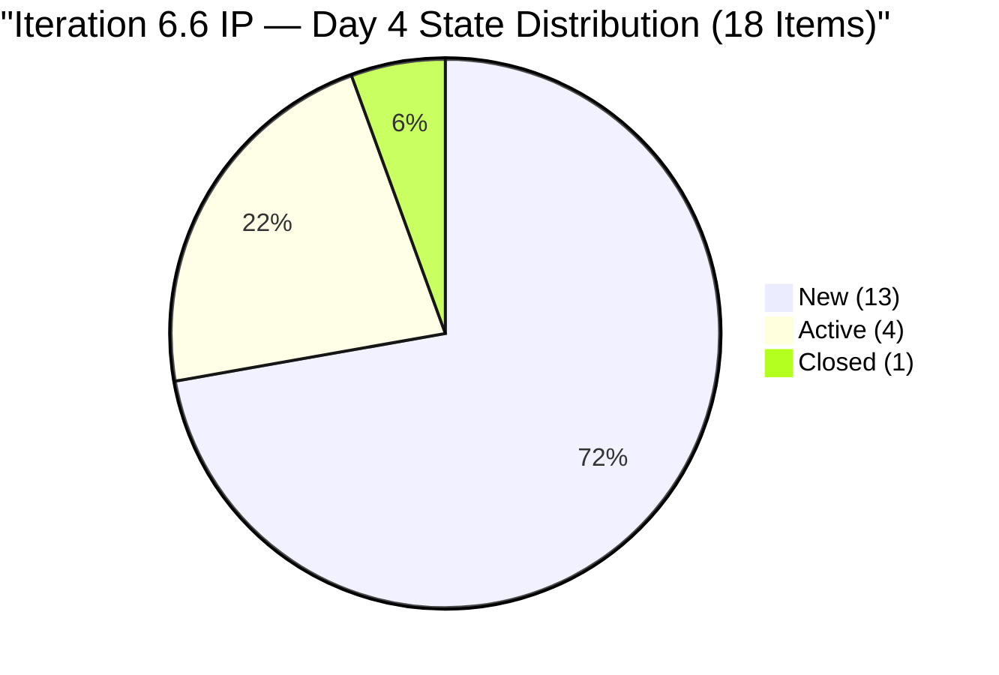
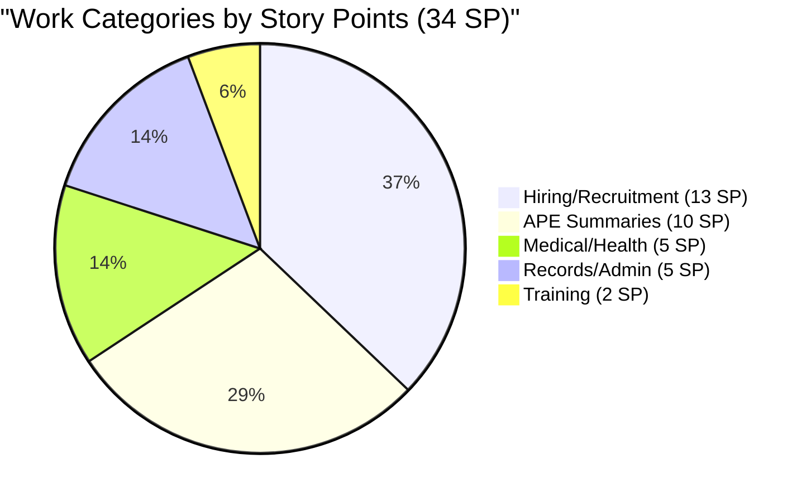
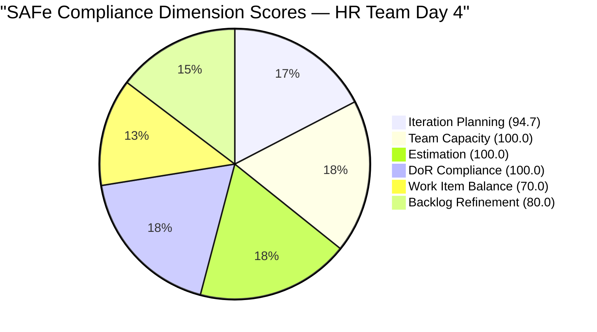

# SAFe Audit Report — Human Resource Recruitment Team

## 1. Audit Metadata

| Field | Value |
|-------|-------|
| **ADO Project** | Jairosoft FINOPS |
| **ADO Project ID** | `e0bb302f-40f9-46c3-8164-6f1acb317d63` |
| **Team** | Human Resource Recruitment Team |
| **Team ID** | `248f59a6-372c-4b74-8129-9eaf260f211e` |
| **Board URL** | [Stories and Deliverables](https://dev.azure.com/jairo/Jairosoft%20FINOPS/_boards/board/t/Human%20Resource%20Recruitment%20Team/Stories%20and%20Deliverables) |
| **Backlog** | Microsoft.RequirementCategory (Stories and Deliverables) |
| **Current Iteration** | Iteration 6.6 (IP) |
| **Iteration Path** | `Jairosoft FINOPS\2026-PI6\Iteration 6.6 (IP)` |
| **Iteration ID** | `b996cc91-1e08-49d6-a314-08e10ef03c12` |
| **Iteration Start** | March 23, 2026 |
| **Iteration Finish** | April 5, 2026 |
| **Sprint Day** | Day 4 of 14 (Thursday, Mar 26) |
| **Audit Date** | March 26, 2026 — 16:14 UTC |
| **Previous Audit** | `AUDIT_2026-03-25_1430.md` (Iteration 6.6 IP Day 3, Score 90.8/100) |
| **Overall Score** | **90.8 / 100 (Low Risk)** |
| **Scoring Rubric** | ADO SAFe v1 (six-dimension deterministic scoring) |
| **Auditor** | AI EngProd Consultant |
| **Framework** | SAFe 6.0 |
| **Audit Series** | #15 |

> **Scope note:** This audit covers only the HR Recruitment Team board in Jairosoft FINOPS. No other boards, teams, projects, or repositories were analyzed.

---

## 2. Executive Summary

This is the **15th audit in the series** and the **third audit of Iteration 6.6 (IP)**. Today is Sprint Day 4 of 14 (29% elapsed). This is the first audit of this iteration run from March 26.

**Key development since last audit (Day 3, Mar 25):**

- **First closure recorded: #201208** (S&M — Anna Danica Jugadora, Final Interview/Decision, 1 SP) was closed on March 26 at 07:19 UTC — the first item closed in Iteration 6.6 (IP).
- **Item #201483** (Result Reading with Doc Karl) was modified on March 26 at 07:16 UTC — changed from Active to New state. This represents a state regression for this item.
- **Active items now: 4** (down from 6 on Day 3) — net decrease due to #201208 closing and #201483 reverting to New.
- **Closed items: 1** (1 SP, 2.9% of committed SP burned).
- **Untouched items reduced from 12 to 11** (61.1%) — improved from Day 3 due to #201208 activity.

**Overall SAFe Compliance Score: 90.8 / 100 (Low Risk)** — unchanged from prior audit. The formula inputs have shifted marginally (untouched: 12 → 11) but the dimension scores remain identical due to rounding.

The first closure is a positive signal. The team needs to maintain a pace of approximately 2.4 closures per remaining working day (33 SP / ~9 remaining days) to reach 100% by April 5.

---

## 3. Previous Audit Delta

**Previous:** AUDIT_2026-03-25_1430 — Iteration 6.6 (IP) Day 3, 14:30 UTC

| Metric | Day 3 (Mar 25, 14:30) | **Day 4 (Mar 26, 16:14)** | Delta |
|--------|-----------------------|---------------------------|-------|
| Items Closed | 0 | **1** | **+1 (first closure)** |
| SP Burned | 0 | **1 SP** | **+1 SP** |
| Items Active | 6 | **4** | −2 (#201208 Closed; #201483 reverted to New) |
| Items New | 12 | **13** | +1 (#201483 reverted from Active) |
| Untouched items | 12 (66.7%) | **11 (61.1%)** | −1 item |
| Backlog Refinement Penalty | −20 | **−20** | No change (still > 30%) |
| Overall Score | 90.8 | **90.8** | No change |
| Iteration Goal | Not defined | **Not defined** | 15th audit without |

**Key changes:**
- #201208 (Anna Danica Jugadora S&M) closed at 07:19 UTC — confirms active delivery beginning Day 4
- #201483 (Result Reading with Doc Karl) reverted from Active to New — may indicate a rescheduling or dependency issue; changed Mar 26 07:16 UTC
- #200677 (Technical Interviews, PI level) remains unassigned — unchanged



---

## 4. Current Iteration Snapshot

### 4.1 Iteration Overview

| Metric | Value |
|--------|-------|
| Iteration | Iteration 6.6 (IP) |
| Date Range | March 23 – April 5, 2026 (14 days) |
| Sprint Day | Day 4 of 14 (29% elapsed) |
| Items Committed | 18 |
| Story Points | 34 SP |
| Items Closed | 1 (5.6%) |
| SP Burned | 1 SP (2.9%) |
| Items Active | 4 (22.2%) |
| Items New | 13 (72.2%) |

### 4.2 Team Capacity

| Member | Activities | Capacity/Day | Days Off |
|--------|-----------|-------------|----------|
| Almera Kleer Tayao | Documentation (4h), Requirements (1h) | **5 h/day** | Apr 1 |
| Grace | (no activities configured) | 0 h/day | — |
| **Total** | | **5 h/day** | **1 day** |

Effective working days remaining: 9 (including today; Apr 1 off; sprint ends Apr 5).

### 4.3 Burndown Progress

| Day | Closed Items | SP Burned | Cumulative SP | Completion % |
|-----|-------------|-----------|--------------|-------------|
| Day 1 (Mar 23) | 0 | 0 | 0 | 0% |
| Day 2 (Mar 24) | 0 | 0 | 0 | 0% |
| Day 3 (Mar 25) | 0 | 0 | 0 | 0% |
| **Day 4 (Mar 26)** | **1** | **1** | **1** | **2.9%** |

**Required pace from Day 5:** 33 SP remaining / 9 remaining days = 3.7 SP/day needed. Achievable if delivery accelerates. The 6.5 sprint demonstrated the team can close 23 SP in a single day (burst delivery pattern).

### 4.4 Full Sprint Backlog — Day 4 State

| # | ID | Title | State | SP | Changed | Untouched? |
|---|---|---|---|---|---|---|
| 1 | 201474 | Annual Medical Exam Budget - Cebu | Active | 2 | Mar 24 | No |
| 2 | 201483 | Result Reading with Doc Karl (Davao/Cebu) | **New** | 2 | **Mar 26** | No |
| 3 | 201264 | LinkedIn Senior Technical Lead - Interview | Active | 2 | Mar 24 | No |
| 4 | 200319 | LinkedIn DevOps Engr. Hiring | Active | 2 | Mar 24 | No |
| 5 | 201256 | Annual Medical Check-up Make-up - Cebu | Active | 1 | Mar 24 | No |
| 6 | 200671 | LinkedIn Tech Sales from Manila Hiring | New | 1 | Mar 24 | No |
| 7 | 201209 | S&M — John Dave Fernandez (Final Interview) | New | 1 | Mar 17 | **Yes** |
| 8 | 201207 | S&M — Edgardo Rojas Jr. (Final Interview) | New | 1 | Mar 17 | **Yes** |
| 9 | **201208** | S&M — Anna Danica Jugadora (Final Interview) | **Closed** | 1 | **Mar 26** | No |
| 10 | 197939 | Communication Skills Proposals Summary | New | 2 | Mar 17 | **Yes** |
| 11 | 201274 | APE — Bon Jovie Cueva Summary | New | 2 | Mar 18 | **Yes** |
| 12 | 201275 | APE — Rommel Senillo Summary | New | 2 | Mar 18 | **Yes** |
| 13 | 201276 | APE — Ryan Vince Castillo Summary | New | 2 | Mar 18 | **Yes** |
| 14 | 201277 | APE — Calvin John Dalino Summary | New | 2 | Mar 18 | **Yes** |
| 15 | 193582 | APE — Caumban, Karl Jordan | New | 2 | Mar 17 | **Yes** |
| 16 | 195671 | Joniel — Upload digital 201 files to Portal | New | 5 | Mar 12 | **Yes** |
| 17 | 201272 | LinkedIn Bubble Developer Hiring — Interview | New | 2 | Mar 18 | **Yes** |
| 18 | 201273 | LinkedIn Bubble Trainer Hiring — Interview | New | 2 | Mar 18 | **Yes** |
| | **TOTAL** | | **4 Active / 13 New / 1 Closed** | **34** | | |

**Untouched (11 items):** #201207, #201209, #197939, #201274, #201275, #201276, #201277, #193582, #195671, #201272, #201273 — all with ChangedDate before iteration start (Mar 23).

### 4.5 Non-Current Backlog Item

| ID | Title | State | SP | Iteration Path | Changed |
|----|-------|-------|----|----------------|---------|
| 200677 | Technical Interviews of qualified applicants | New | 2 | 2026-PI6 (unassigned) | Mar 9 |

---

## 5. Work Item Analysis

### 5.1 Work Item Type Distribution

| Type | Count (Current) | Share |
|------|---------|-------|
| User Story | 18 | 100% |
| Spike | 0 | 0% |
| Defect | 0 | 0% |

All 18 items are User Stories. This triggers the dominant-type penalty (−30) on Work Item Balance. IP iterations should include innovation/exploration items.

### 5.2 Work Category Distribution

| Category | Items | SP | Status |
|----------|-------|----|--------|
| Hiring / Recruitment | 8 | 13 | 1 Closed (#201208), 3 Active, 4 New |
| APE (Performance Evaluation) | 5 | 10 | All New (untouched) |
| Medical / Health | 3 | 5 | 1 Active, 1 New (reverted), 1 Active |
| Training | 1 | 2 | New (untouched) |
| Records / Administration | 1 | 5 | New (untouched, largest item) |



### 5.3 DoR Compliance Assessment

All 18 items pass DoR:
- Descriptions: structured "As a... I want... So that..." format with targets, all well above 30 non-ws chars
- Acceptance criteria: numbered lists with measurable metrics, all above 20 non-ws chars
- No DoR failures — sustained improvement from mid-Iteration 6.5 onward

### 5.4 Freshness Assessment

| Metric | Value | Status |
|--------|-------|--------|
| Fresh (< 45 days, after Feb 9) | 19/19 (100%) | Base = 100.0 |
| Stale-90 (before Dec 27, 2025) | 0 | No penalty |
| Stale-180 (before Sep 29, 2025) | 0 | No penalty |
| Untouched current items | 11/18 (61.1%) | −20 (> 30%) |

---

## 6. SAFe Compliance Scorecard

| # | Dimension | Score | Formula | Evidence | Notes |
|---|-----------|-------|---------|----------|-------|
| 1 | **Iteration Planning** | **94.7** | 18/19 × 100 | 18 of 19 backlog items in current iteration | #200677 at PI level unassigned |
| 2 | **Team Capacity** | **100.0** | 1/1 × 100 | Almera: 5 h/day, 2 activities, Apr 1 day off | Bus factor = 1 (structural) |
| 3 | **Estimation** | **100.0** | 18/18 × 100 | All 18 items have SP > 0 | Total 34 SP; avg 1.9 SP/item |
| 4 | **DoR Compliance** | **100.0** | 18/18 × 100 | All 18 pass Description ≥ 30 nws AND AC ≥ 20 nws | Sustained from mid-6.5 |
| 5 | **Work Item Balance** | **70.0** | 100 − 30 | 100% User Story share > 60%: −30 | No Spikes in IP sprint |
| 6 | **Backlog Refinement** | **80.0** | 100 − 20 | 19/19 fresh; 0 stale; 11/18 untouched (61.1%) | −20 for untouched > 30% |
| | **Overall** | **90.8** | (94.7+100+100+100+70+80)/6 | **Low Risk (≥ 80)** | |

### Score Computation Detail

```
Iteration Planning:  round(18/19 × 100, 1) = 94.7
Team Capacity:       round(1/1 × 100, 1)   = 100.0
Estimation:          round(18/18 × 100, 1)  = 100.0
DoR Compliance:      round(18/18 × 100, 1)  = 100.0
Work Item Balance:   100 − 30 (dominant 100% > 60%) = 70.0
Backlog Refinement:  base = round(19/19 × 100, 1) = 100.0
  stale_90:          0/19 = 0% → no penalty
  stale_180:         0 → no penalty
  untouched:         11/18 = 61.1% > 30% → −20
  Result:            80.0

Overall: (94.7 + 100.0 + 100.0 + 100.0 + 70.0 + 80.0) / 6
       = 544.7 / 6
       = 90.8 (Low Risk)
```

**Note on untouched improvement:** Down from 12 (66.7%) on Day 3 to 11 (61.1%) on Day 4. Both ratios exceed 30%, so the −20 penalty applies in both cases. The score will improve on this dimension when untouched drops to ≤ 30% (i.e., ≤ 5 untouched items, which requires 6+ additional items to be touched or closed).

### Score History — Iteration 6.6 (IP)

| Audit # | Date | Day | Score | Band | Key Change |
|---------|------|-----|-------|------|------------|
| 13 | Mar 25 (0848) | Day 2 | 90.8 | Low Risk | First 6.6 audit; 5 Active, 0 Closed |
| 14 | Mar 25 (1430) | Day 3 | 90.8 | Low Risk | 6 Active, 0 Closed; 12 untouched |
| **15** | **Mar 26 (1614)** | **Day 4** | **90.8** | **Low Risk** | **1 Closed (#201208); 4 Active; 11 untouched** |



---

## 7. Dimension Findings

### 7.1 Iteration Planning (94.7/100) — STRONG

18 of 19 visible backlog items are assigned to the current iteration. Sprint commitment of 34 SP matches Iteration 6.5 final velocity exactly — disciplined planning signal. Item #200677 (Technical Interviews, 2 SP) remains at the PI level. Assigning it to 6.6 would bring this dimension to 100.0.

### 7.2 Team Capacity (100.0/100) — FULL

Almera remains the sole active contributor at 5 h/day (Documentation 4h, Requirements 1h). One day off on April 1 is recorded. Effective capacity: 5 h × 13 working days (excluding Apr 1) = 65 hours for the sprint.

### 7.3 Estimation (100.0/100) — FULL

All 18 items have story points. Distribution: 1 SP (3 items), 2 SP (13 items), 5 SP (1 item). The 5 SP item (#195671 — Joniel 201 file upload) is the largest and remains untouched since Mar 12. If Joniel is external, this item carries dependency risk.

### 7.4 DoR Compliance (100.0/100) — FULL

All 18 items pass both Description and Acceptance Criteria thresholds. Rich, structured content on every item. This has been sustained since the DoR improvements made during Iteration 6.5.

### 7.5 Work Item Balance (70.0/100) — MODERATE

100% User Story composition in an IP sprint is a missed opportunity. SAFe designates IP sprints for innovation, infrastructure improvements, and technical exploration. No Spikes have been added. The hiring, APE, and medical items are operational in nature. Adding at least one Spike (e.g., for automating the hiring tracking pipeline or creating an APE template) would reduce this penalty.

### 7.6 Backlog Refinement (80.0/100) — GOOD WITH PENALTY

Base score 100.0 (all 19 items fresh). Penalty: −20 for untouched ratio 61.1% (exceeds 30% threshold). This is an early-sprint artifact — the high untouched ratio is contextually expected on Day 4. As Almera continues closing items, the ratio will decrease. Based on the 6.5 pattern, a burst delivery day (similar to Day 7 of 6.5, when 12 items closed) could dramatically reduce this ratio.

**Score improvement path:** Touching or closing 6 more items would bring untouched to ≤ 30%, moving Backlog Refinement from 80.0 to 100.0, and lifting Overall from 90.8 to 94.1.

---

## 8. Risks and Bottlenecks

| # | Risk | Severity | Status | Mitigation |
|---|------|----------|--------|------------|
| 1 | **Bus factor = 1** | Critical (Structural) | Unchanged — 15 audits | Cross-train Grace or add capacity. Almera is single point of failure. |
| 2 | **No iteration goal** | High | Unchanged — 15 consecutive audits | Define a measurable sprint goal. Mandatory SAFe artifact. |
| 3 | **No PI objectives** | High | Unchanged — 15 consecutive audits | Link Features to PI6 objectives for strategic alignment. |
| 4 | **IP iteration without Spikes** | Medium | Unchanged from prior audits | Add at least 1 Spike or Enabler to leverage IP iteration purpose. |
| 5 | **High untouched ratio (61.1%)** | Low | Improving (was 66.7% Day 3) | Normal Day 4 context. Monitor — flag if > 50% by Day 6. |
| 6 | **#201483 state regression** | Low | New this audit | Item reverted from Active to New. May indicate rescheduling or dependency issue. Almera should clarify. |
| 7 | **#200677 unassigned to iteration** | Low | Unchanged from Day 2 | Assign to 6.6 (IP) or explicitly defer. |
| 8 | **#195671 (5 SP, 14 days untouched)** | Low | Growing concern | Largest item, external dependency (Joniel). Flag if still untouched by Day 6. |

### Delivery Pattern Alert

In Iteration 6.5, the sprint experienced a 5-day delivery stall followed by a burst on Day 7 (12 items / 23 SP in one day). The current pattern shows:
- Days 1–3: 0 closures
- Day 4: 1 closure

This is slightly better than 6.5 Days 1–5 (0 closures). If the team replicates the 6.5 burst pattern, a high-velocity day between Day 6–8 would bring the sprint to completion. However, SAFe recommends steady flow over burst delivery to avoid back-loading risk.

---

## 9. Prioritized Recommendations

### P1 — Critical (Immediate)

1. **Define an iteration goal for 6.6 (IP).** Absent across 15 consecutive audits. Suggested: *"Complete all hiring decisions for S&M candidates, finalize APE summaries for all employees, and close Cebu medical activities."* Mandatory SAFe artifact.

2. **Investigate #201483 state regression** (Result Reading with Doc Karl — reverted from Active to New on Mar 26). Understand if this is a rescheduling, a dependency on the medical exam budget approval (#201474), or a data entry issue. Document the reason in the work item.

### P2 — Important (This Sprint, by Day 7)

3. **Link Features to PI6 Objectives.** Absent for 15 audits. Required for strategic alignment.

4. **Activate and close S&M items (#201207, #201209)** — both Final Interview/Decision items are New with Mar 17 ChangedDate. Given #201208 (same category) was closed today, these should follow quickly.

5. **Activate APE Summary items (#201274, #201275, #201276, #201277)** — all unchanged since Mar 18. These are process items that could be batched and closed together.

6. **Assign or groom #200677** — 2 SP item orphaned at PI level. Either pull into 6.6 or defer explicitly.

### P3 — Strategic

7. **Add at least one Spike** for the IP iteration — e.g., "Spike: Automate HR hiring pipeline tracking in ADO" or "Spike: Create reusable APE evaluation template."

8. **Monitor #195671 (Joniel 201 files, 5 SP)** — largest item, untouched 14 days. Ensure Joniel has the required access and materials. If this item is blocked, de-commit early rather than carry it over.

9. **Aim for steady-flow delivery** rather than a single burst day. With 33 SP remaining over ~9 working days, closing 3–4 SP per day is the optimal pattern.

---

## 10. Evidence Gaps and Limitations

| Gap | Impact | Notes |
|-----|--------|-------|
| **No iteration goal in ADO** | Cannot verify sprint goal via API | Absent across 15 consecutive audits |
| **PI Objectives not verifiable** | Cannot confirm Feature-to-PI linkage | No PI Objective work items found |
| **HR team has no iteration assigned via API** | `work_list_team_iterations` returns no results | Iteration context derived from work item IterationPath fields directly |
| **#201483 state change reason unknown** | Active → New reversion may indicate external dependency | Item shows Mar 26 ChangedDate; context requires Almera input |
| **Grace's role undefined** | Cannot assess team capacity fully | 0 capacity, no assigned work; structural role unclear |
| **Day 4 untouched ratio** | Formula-driven penalty; contextually expected | Will naturally decrease as items are activated and closed |
| **No GitHub repositories scoped** | No delivery evidence | HR work is non-code; not applicable |

---

## Appendix: Score History — HR Recruitment Team (All 15 Audits)

| # | Date | Iteration | Score | Key Event |
|---|------|-----------|-------|-----------|
| 1 | Feb 25 | 6.4 | 20/100 | Critical — no SP, no AC |
| 2 | Mar 3 | 6.4 | 40/100 | 17 items closed, SP partial |
| 3 | Mar 4 | 6.4 | 40/100 | Feature hierarchy partial |
| 4 | Mar 5 | 6.4 | 50/100 | SP 100%, AC improving |
| 5 | Mar 6 | 6.4 | 60/100 | INVEST compliance improving |
| 6 | Mar 9 | 6.4 | 65/100 | 6.4 close — 14 items done |
| 7 | Mar 10 | 6.5 | 75/100 | 6.5 sprint planning — clean start |
| 8 | Mar 11 | 6.5 | 70/100 | Scope creep, WIP explosion |
| 9 | Mar 16 | 6.5 | 60/100 | 5-day stall, overdue items |
| 10 | Mar 17 | 6.5 | 70/100 | Stall broken, 3 closures |
| 11 | Mar 18 | 6.5 | 75/100 | 12-item burst day |
| 12 | Mar 22 | 6.5 | 80/100 | 100% complete — series high |
| 13 | Mar 25 (0848) | 6.6 | 90.8/100 | First 6.6 audit — strong planning |
| 14 | Mar 25 (1430) | 6.6 | 90.8/100 | Day 3; 6 Active, 0 Closed |
| **15** | **Mar 26 (1614)** | **6.6** | **90.8/100** | **Day 4; 1st Closed (#201208)** |

---

*Report generated: March 26, 2026 16:14 UTC | SAFe 6.0 Framework | Jairosoft FINOPS — HR Recruitment Team*
*Iteration 6.6 (IP): Mar 23 – Apr 5, 2026 | Day 4 of 14 | Audit #15 in series*
*Score: 90.8/100 (Low Risk) | Previous: AUDIT_2026-03-25_1430 (90.8/100)*
*First closure this iteration: #201208 (S&M Jugadora, 1 SP) — Mar 26*
