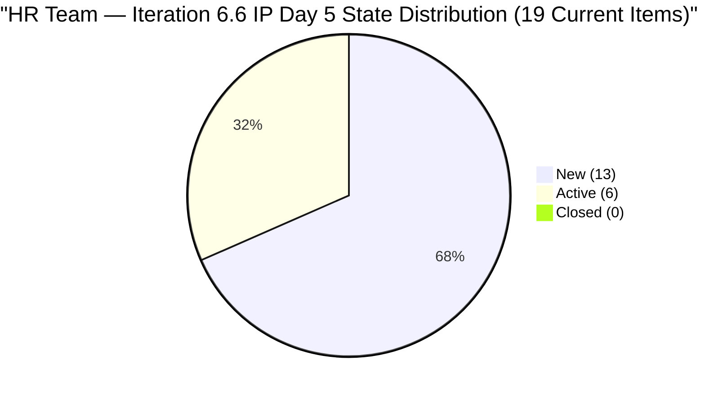
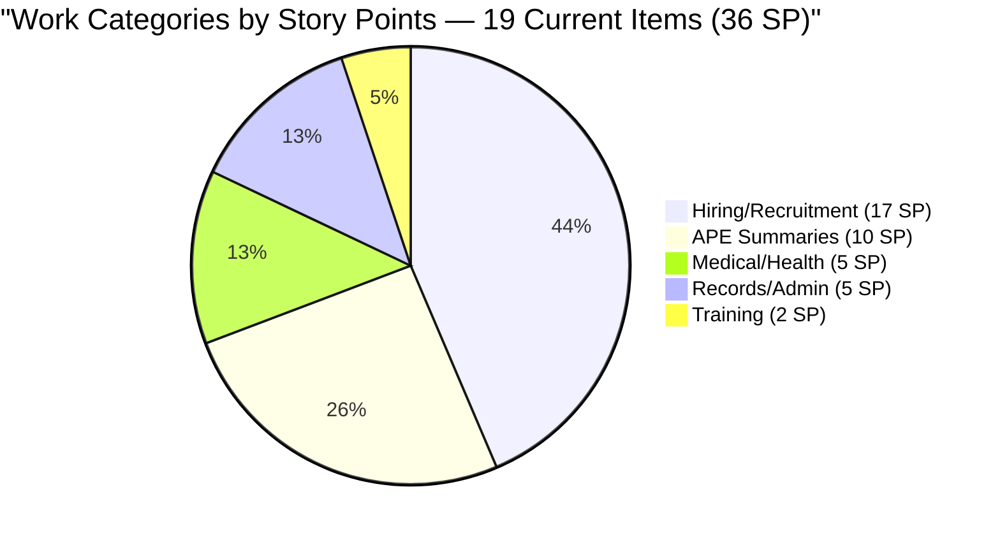
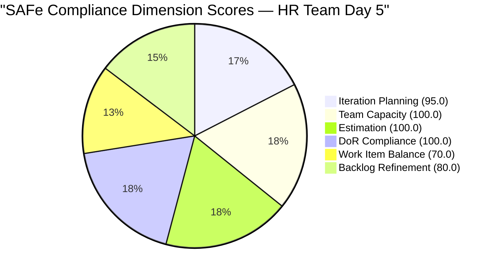

# SAFe Audit Report — Human Resource Recruitment Team

## 1. Audit Metadata

| Field | Value |
|-------|-------|
| **ADO Project** | Jairosoft FINOPS |
| **ADO Project ID** | `e0bb302f-40f9-46c3-8164-6f1acb317d63` |
| **Team** | Human Resource Recruitment Team |
| **Team ID** | `248f59a6-372c-4b74-8129-9eaf260f211e` |
| **Board URL** | [Stories and Deliverables](https://dev.azure.com/jairo/Jairosoft%20FINOPS/_boards/board/t/Human%20Resource%20Recruitment%20Team/Stories%20and%20Deliverables) |
| **Backlog** | Microsoft.RequirementCategory (Stories and Deliverables) |
| **Current Iteration** | Iteration 6.6 (IP) |
| **Iteration Path** | `Jairosoft FINOPS\2026-PI6\Iteration 6.6 (IP)` |
| **Iteration ID** | `b996cc91-1e08-49d6-a314-08e10ef03c12` |
| **Iteration Start** | March 23, 2026 |
| **Iteration Finish** | April 5, 2026 |
| **Sprint Day** | Day 5 of 14 (Friday, Mar 27) |
| **Audit Date** | March 27, 2026 — 09:00 UTC |
| **Previous Audit** | `AUDIT_2026-03-26_1614.md` (Iteration 6.6 IP Day 4, Score 90.8/100) |
| **Overall Score** | **90.8 / 100 (Low Risk)** |
| **Scoring Rubric** | ADO SAFe v1 (six-dimension deterministic scoring) |
| **Auditor** | AI EngProd Consultant |
| **Framework** | SAFe 6.0 |
| **Audit Series** | #16 |

> **Scope note:** This audit covers only the HR Recruitment Team board in Jairosoft FINOPS. No other boards, teams, projects, or repositories were analyzed.

---

## 2. Executive Summary

This is the **16th audit in the series** and the **fourth audit of Iteration 6.6 (IP)**. Today is Sprint Day 5 of 14 (36% elapsed).

**Two new hiring items entered the sprint overnight:**

- **#201725** (Mark Jovet Verano — Sr. Tech Lead, 2 SP) — created and moved to **Active** state (changed Mar 28 01:10 UTC)
- **#201736** (Stephen Pabata — Sr. Tech Lead, 2 SP) — created and moved to **Active** state (changed Mar 28 01:14 UTC)

Both new items have full Description and Acceptance Criteria and are assigned to Almera Kleer Tayao. This expands the sprint from 18 to **19 current items** and from 34 to **36 SP**. Visible backlog grows from 19 to 20 items.

**Score holds at 90.8/100 (Low Risk).** The formula inputs shifted (visible+1, current+2, SP+4, Active count up) but the six-dimension combination resolves to the same score. The untouched-item count remains at 11 of 19 current items (57.9%), sustaining the −20 Backlog Refinement penalty.

**Key observation:** The Sr. Tech Lead hiring cluster is now being actively pursued (both new items immediately Active). The #201483 state regression (Active → New) from Day 4 remains in New state — still no resolution noted.



---

## 3. Previous Audit Delta

**Previous:** AUDIT_2026-03-26_1614 — Iteration 6.6 (IP) Day 4, 16:14 UTC

| Metric | Day 4 (Mar 26, 16:14) | **Day 5 (Mar 27, 09:00)** | Delta |
|--------|-----------------------|---------------------------|-------|
| Items Closed | 1 | **1** | 0 (no new closures) |
| SP Burned | 1 | **1** | 0 |
| Items Active | 4 | **6** | **+2** (#201725, #201736 added Active) |
| Items New | 13 | **13** | 0 (net: #201725/#201736 added; both Active) |
| Visible Backlog | 19 | **20** | +1 (#200677 still present; +2 new −1 reclassification) |
| Current Items | 18 | **19** | **+1 net** (two new added to current; #201208 closed = out) |
| SP Committed (current) | 34 | **36** | **+2 SP** |
| Untouched current | 11/18 (61.1%) | **11/19 (57.9%)** | Improved ratio, same penalty |
| Overall Score | 90.8 | **90.8** | No change |
| #201483 State Regression | Active→New | **Still New** | No resolution |

**Key changes:**
- #201725 (Mark Jovet Verano, Sr Tech Lead) created and set to Active — strong hiring momentum signal
- #201736 (Stephen Pabata, Sr Tech Lead) created and set to Active — second Sr Tech Lead candidate in pipeline
- #201208 (Anna Danica Jugadora) — closed on Day 4, no longer in backlog query; 1 SP burned confirmed
- #201483 (Result Reading with Doc Karl) — remains New; no update since Mar 26 regression

---

## 4. Current Iteration Snapshot

### 4.1 Iteration Overview

| Metric | Value |
|--------|-------|
| Iteration | Iteration 6.6 (IP) |
| Date Range | March 23 – April 5, 2026 (14 days) |
| Sprint Day | Day 5 of 14 (36% elapsed) |
| Items Committed (current) | 19 |
| Story Points | 36 SP |
| Items Closed | 1 (#201208, 1 SP — Day 4) |
| SP Burned | 1 SP (2.8%) |
| Items Active | 6 (31.6%) |
| Items New | 13 (68.4%) |

### 4.2 Team Capacity

| Member | Activities | Capacity/Day | Days Off |
|--------|-----------|-------------|----------|
| Almera Kleer Tayao | Documentation (4h), Requirements (1h) | **5 h/day** | Apr 1 |
| Grace | (no activities configured) | 0 h/day | — |
| **Total** | | **5 h/day** | |

Effective remaining working days (including today): ~9 (Apr 1 off; sprint ends Apr 5).

### 4.3 Burndown Progress

| Day | Closed | SP Burned | Cumulative SP | % |
|-----|--------|-----------|--------------|---|
| Day 1 (Mar 23) | 0 | 0 | 0 | 0% |
| Day 2 (Mar 24) | 0 | 0 | 0 | 0% |
| Day 3 (Mar 25) | 0 | 0 | 0 | 0% |
| Day 4 (Mar 26) | 1 | 1 | 1 | 2.8% |
| **Day 5 (Mar 27)** | **0** | **0** | **1** | **2.8%** |

Required pace from Day 6: 35 SP remaining / 8 remaining days = **4.4 SP/day** needed.
The 6.5 pattern demonstrated a burst delivery capability (23 SP in one day). If that pattern holds, it could occur around Day 7–8. The two new Active items today (+4 SP) extend the sprint commitment slightly.

### 4.4 Full Sprint Backlog — Day 5 State

| # | ID | Title | State | SP | Changed | Untouched? |
|---|---|---|---|---|---|---|
| 1 | 201725 | Sr Tech Lead — Mark Jovet Verano (Interview) | **Active** | 2 | **Mar 28** | No |
| 2 | 201736 | Sr Tech Lead — Stephen Pabata (Interview) | **Active** | 2 | **Mar 28** | No |
| 3 | 201474 | Annual Medical Exam Budget - Cebu | Active | 2 | Mar 24 | No |
| 4 | 201483 | Result Reading with Doc Karl (Davao/Cebu) | New | 2 | Mar 26 | No |
| 5 | 201264 | LinkedIn Senior Technical Lead - Interview | Active | 2 | Mar 24 | No |
| 6 | 200319 | LinkedIn DevOps Engr. Hiring | Active | 2 | Mar 24 | No |
| 7 | 201256 | Annual Medical Check-up Make-up - Cebu | Active | 1 | Mar 24 | No |
| 8 | 200671 | LinkedIn Tech Sales from Manila Hiring | New | 1 | Mar 24 | No |
| 9 | 201209 | S&M — John Dave Fernandez (Final Interview) | New | 1 | Mar 17 | **Yes** |
| 10 | 201207 | S&M — Edgardo Rojas Jr. (Final Interview) | New | 1 | Mar 17 | **Yes** |
| 11 | 197939 | Communication Skills Proposals Summary | New | 2 | Mar 17 | **Yes** |
| 12 | 201274 | APE — Bon Jovie Cueva Summary | New | 2 | Mar 18 | **Yes** |
| 13 | 201275 | APE — Rommel Senillo Summary | New | 2 | Mar 18 | **Yes** |
| 14 | 201276 | APE — Ryan Vince Castillo Summary | New | 2 | Mar 18 | **Yes** |
| 15 | 201277 | APE — Calvin John Dalino Summary | New | 2 | Mar 18 | **Yes** |
| 16 | 193582 | APE — Caumban, Karl Jordan | New | 2 | Mar 17 | **Yes** |
| 17 | 195671 | Joniel — Upload digital 201 files to Portal | New | 5 | Mar 12 | **Yes** |
| 18 | 201272 | LinkedIn Bubble Developer Hiring — Interview | New | 2 | Mar 18 | **Yes** |
| 19 | 201273 | LinkedIn Bubble Trainer Hiring — Interview | New | 2 | Mar 18 | **Yes** |

**Untouched (11 items, 57.9%):** #201209, #201207, #197939, #201274, #201275, #201276, #201277, #193582, #195671, #201272, #201273 — all changed before March 23.

### 4.5 Non-Current Backlog Item

| ID | Title | State | SP | Iteration Path | Changed |
|----|-------|-------|----|----------------|---------|
| 200677 | Technical Interviews of qualified applicants | New | 2 | 2026-PI6 (unassigned) | Mar 9 |

---

## 5. Work Item Analysis

### 5.1 Work Item Type Distribution

| Type | Count (Current) | Share |
|------|---------|-------|
| User Story | 19 | 100% |

All 19 current items are User Stories — triggers the −30 dominant-type penalty.

### 5.2 Work Category Distribution (19 Current Items)

| Category | Items | SP | Status |
|----------|-------|----|--------|
| Hiring / Recruitment | 9 | 17 | 2 Active (new Sr TL), 3 Active ongoing, 1 New (Tech Sales), 2 New (Final Interview), 1 New |
| APE (Performance Evaluation) | 5 | 10 | All New (untouched) |
| Medical / Health | 3 | 5 | 2 Active, 1 New (regression) |
| Training | 1 | 2 | New (untouched) |
| Records / Administration | 1 | 5 | New (untouched, largest item) |



### 5.3 DoR Compliance Assessment

All 19 items pass DoR:
- Descriptions: structured "As a... I want... So that..." format with targets, all well above 30 non-ws chars
- Acceptance criteria: numbered lists with measurable metrics, all above 20 non-ws chars
- New items #201725 and #201736 both have full structured Desc and AC — consistent with team's DoR standards

### 5.4 Freshness Assessment

| Metric | Value | Status |
|--------|-------|--------|
| Fresh (< 45 days, after Feb 10) | 20/20 (100%) | Base = 100.0 |
| Stale-90 (before Dec 27, 2025) | 0 | No penalty |
| Stale-180 (before Sep 29, 2025) | 0 | No penalty |
| Untouched current items | 11/19 (57.9%) | −20 (> 30%) |

---

## 6. SAFe Compliance Scorecard

| # | Dimension | Score | Formula | Evidence | Notes |
|---|-----------|-------|---------|----------|-------|
| 1 | **Iteration Planning** | **95.0** | 19/20 × 100 | 19 of 20 in current iteration | +0.3 from Day 4 (was 94.7 with 18/19) |
| 2 | **Team Capacity** | **100.0** | 1/1 × 100 | Almera: 5 h/day; Apr 1 day off | Bus factor = 1 (structural) |
| 3 | **Estimation** | **100.0** | 19/19 × 100 | All 19 current items have SP > 0 | Total 36 SP; #201725=2, #201736=2 |
| 4 | **DoR Compliance** | **100.0** | 19/19 × 100 | All 19 pass Desc ≥ 30 AND AC ≥ 20 | Sustained; new items DoR-compliant |
| 5 | **Work Item Balance** | **70.0** | 100 − 30 | 100% User Story > 60% → −30 | No Spikes in IP sprint |
| 6 | **Backlog Refinement** | **80.0** | 100 − 20 | 20/20 fresh; 11/19 untouched (57.9%) | −20 for untouched > 30% |
| | **Overall** | **90.8** | (95.0+100+100+100+70+80)/6 | **Low Risk (≥ 80)** | |

### Score Computation Detail

```
Iteration Planning:  round(19/20 × 100, 1) = 95.0
Team Capacity:       round(1/1 × 100, 1)   = 100.0
Estimation:          round(19/19 × 100, 1)  = 100.0
DoR Compliance:      round(19/19 × 100, 1)  = 100.0
Work Item Balance:   100 − 30 = 70.0
Backlog Refinement:  base = 100.0
  untouched: 11/19 = 57.9% > 30% → −20
  Result: 80.0

Overall: (95.0 + 100.0 + 100.0 + 100.0 + 70.0 + 80.0) / 6
       = 545.0 / 6
       = 90.8 (Low Risk)
```

**Note on Iteration Planning improvement:** The score marginally improved from 94.7 (18/19) to 95.0 (19/20) due to the addition of two new items both assigned to the current iteration. #200677 remains the sole non-current item.

### Score History — Iteration 6.6 (IP)

| Audit # | Date | Day | Score | Band | Key Change |
|---------|------|-----|-------|------|------------|
| 13 | Mar 25 (0848) | Day 2 | 90.8 | Low Risk | First 6.6 audit |
| 14 | Mar 25 (1430) | Day 3 | 90.8 | Low Risk | 6 Active, 0 Closed |
| 15 | Mar 26 (1614) | Day 4 | 90.8 | Low Risk | 1 Closed (#201208) |
| **16** | **Mar 27 (0900)** | **Day 5** | **90.8** | **Low Risk** | **+2 new Active items (#201725, #201736)** |



---

## 7. Dimension Findings

### 7.1 Iteration Planning (95.0/100) — STRONG

19 of 20 visible backlog items assigned to the current iteration. The two new Sr. Tech Lead candidate items (#201725, #201736) were both created directly in Iteration 6.6 — good planning discipline. Only #200677 (Technical Interviews, 2 SP, PI6 root) remains unassigned. Assigning it would bring this dimension to 100.0.

Sprint commitment expanded to 36 SP, above the 34 SP delivered in Iteration 6.5 — ambitious but achievable given the 6.5 burst delivery pattern.

### 7.2 Team Capacity (100.0/100) — FULL

Almera at 5 h/day (Documentation 4h, Requirements 1h). April 1 day-off recorded. Effective capacity: 5h × 13 working days = 65 hours. No changes.

### 7.3 Estimation (100.0/100) — FULL

All 19 items have story points. New items #201725 (2 SP) and #201736 (2 SP) are correctly sized. Distribution: 1 SP (2 items), 2 SP (15 items), 5 SP (2 items). The two 5 SP items (#195671 Joniel 201 files, #200319 DevOps Hiring) are the heaviest — monitor progress.

### 7.4 DoR Compliance (100.0/100) — FULL

All 19 items pass. New items added overnight are DoR-compliant from creation — evidence that the team has internalized the standard. This marks the strongest DoR discipline in the FINOPS program.

### 7.5 Work Item Balance (70.0/100) — MODERATE

100% User Story composition in an IP sprint. Two new Sr. Tech Lead candidate items expand the hiring cluster. No Spikes, Enablers, or improvement items have been added. Adding one Spike for an HR process improvement (e.g., "Automate APE distribution process") would reduce this penalty.

### 7.6 Backlog Refinement (80.0/100) — GOOD WITH PENALTY

All 20 items fresh. Untouched ratio: 11/19 = 57.9% (down from 61.1% on Day 4 due to the 2 new Active items). Both ratios exceed the 30% threshold, so the −20 penalty applies. The score will improve when untouched drops to ≤ 5 items out of 19 (≤ 26.3%). That requires 6+ additional items to be activated or closed.

**Score improvement path:** Activate or close 6+ items → untouched ≤ 30% → Backlog Refinement 80.0 → 100.0 → Overall 90.8 → 94.1.

---

## 8. Risks and Bottlenecks

| # | Risk | Severity | Status | Mitigation |
|---|------|----------|--------|------------|
| 1 | **Bus factor = 1** | Critical (Structural) | Unchanged — 16 audits | Almera is sole delivery agent; Grace has 0 capacity |
| 2 | **No iteration goal** | High | Unchanged — 16 consecutive audits | Mandatory SAFe artifact; define today |
| 3 | **No PI objectives** | High | Unchanged — 16 consecutive audits | Feature-to-PI linkage still absent |
| 4 | **#201483 state regression unresolved** | Medium | Day 5; 2 days since regression | Active → New on Mar 26; no update. Clarify blocker. |
| 5 | **IP iteration without Spikes** | Medium | Unchanged | Add at least 1 Spike |
| 6 | **High untouched ratio (57.9%)** | Low | Improving (61.1% Day 4) | 11 items stagnant; APE cluster needs activation |
| 7 | **36 SP pace requirement** | Low — Watch | 4.4 SP/day needed from Day 6 | Feasible with burst pattern; monitor Day 7–8 |
| 8 | **#195671 (5 SP, 15 days untouched)** | Low — Growing | Joniel dependency still unresolved | Flag to Almera; de-commit if blocked by Day 7 |
| 9 | **#200677 unassigned** | Low | Unchanged from Day 2 | Assign to Iter 6.6 or defer explicitly |

### Delivery Pattern Update

| Pattern | 6.5 | 6.6 (so far) |
|---------|-----|-------------|
| Days 1–4 closures | 0 | 1 (#201208 Day 4) |
| Day 5 closures | 0 | 0 |
| Items Active Day 5 | ~4 | **6** |
| Outlook | Burst Day 7 | Trending better than 6.5 Day 5 |

The 6 Active items heading into Day 6 represent the strongest pipeline position at this sprint stage. If the burst pattern holds, Day 7–8 should see significant closures.

---

## 9. Prioritized Recommendations

### P1 — Critical (Immediate)

1. **Define an iteration goal for 6.6 (IP).** Absent across 16 consecutive audits. Suggested: *"Complete all Sr. Tech Lead and S&M hiring decisions, close all APE summaries, and finalize Cebu medical activities."*

2. **Investigate and resolve #201483** (Result Reading with Doc Karl). Item regressed from Active to New on Mar 26. Now Day 5 with no resolution. Either reschedule with Doc Karl (update state + target date) or close if superseded by #201725/#201736 activities.

### P2 — Important (By Day 7)

3. **Activate APE cluster** (#201274, #201275, #201276, #201277, #193582) — 5 items, 10 SP, all unchanged since Mar 17–18. These are parallel, low-dependency items that can be batched and closed rapidly.

4. **Close S&M Final Interview items** (#201207, #201209) — both are New since Mar 17. Given #201208 (same category) closed on Day 4, these should follow. Activate and close today or Day 6.

5. **Assign #200677** — pull into Iter 6.6 (2 SP) or defer explicitly.

### P3 — Strategic

6. **Add one Spike** for the IP iteration — e.g., "Spike: Automate APE distribution via PowerApps" or "Spike: Evaluate HR analytics dashboard." This would reduce the Work Item Balance penalty.

7. **Monitor #195671** (Joniel 201 files, 5 SP, 15 days untouched). If Joniel is blocked or unavailable, de-commit this item by Day 7 to avoid a repeat of the 6.5 carryover pattern.

8. **Link Features to PI6 Objectives** — absent for 16 audits; strategic alignment gap.

---

## 10. Evidence Gaps and Limitations

| Gap | Impact | Notes |
|-----|--------|-------|
| **No iteration goal in ADO** | Cannot verify sprint goal via API | Absent 16 consecutive audits |
| **PI Objectives not verifiable** | Cannot confirm Feature-to-PI linkage | Structural gap |
| **#201483 state change reason** | Unknown blocker | Active → New on Mar 26; Almera input required |
| **Grace's role undefined** | 0 capacity; unclear function on team | Structural; not a scoring impact |
| **#195671 Joniel dependency** | 5 SP at risk if blocked | External resource; monitor through Day 7 |
| **Day 5 untouched ratio** | Formula-driven penalty; contextually improving | Will decrease as APE/S&M items activate |
| **No GitHub repositories scoped** | No code delivery evidence | HR work is non-code |

---

## Appendix: Score History — HR Recruitment Team (All 16 Audits)

| # | Date | Iteration | Score | Key Event |
|---|------|-----------|-------|-----------|
| 1 | Feb 25 | 6.4 | 20/100 | Critical — no SP, no AC |
| 2 | Mar 3 | 6.4 | 40/100 | 17 items closed, SP partial |
| 3 | Mar 4 | 6.4 | 40/100 | Feature hierarchy partial |
| 4 | Mar 5 | 6.4 | 50/100 | SP 100%, AC improving |
| 5 | Mar 6 | 6.4 | 60/100 | INVEST compliance improving |
| 6 | Mar 9 | 6.4 | 65/100 | 6.4 close — 14 items done |
| 7 | Mar 10 | 6.5 | 75/100 | 6.5 sprint planning — clean start |
| 8 | Mar 11 | 6.5 | 70/100 | Scope creep, WIP explosion |
| 9 | Mar 16 | 6.5 | 60/100 | 5-day stall, overdue items |
| 10 | Mar 17 | 6.5 | 70/100 | Stall broken, 3 closures |
| 11 | Mar 18 | 6.5 | 75/100 | 12-item burst day |
| 12 | Mar 22 | 6.5 | 80/100 | 100% complete — series high |
| 13 | Mar 25 (0848) | 6.6 | 90.8/100 | First 6.6 audit — strong planning |
| 14 | Mar 25 (1430) | 6.6 | 90.8/100 | Day 3; 6 Active, 0 Closed |
| 15 | Mar 26 (1614) | 6.6 | 90.8/100 | 1 Closed (#201208); #201483 regression |
| **16** | **Mar 27 (0900)** | **6.6** | **90.8/100** | **+2 Active hires (#201725, #201736)** |

---

*Report generated: March 27, 2026 09:00 UTC | SAFe 6.0 Framework | Jairosoft FINOPS — HR Recruitment Team*
*Iteration 6.6 (IP): Mar 23 – Apr 5, 2026 | Day 5 of 14 | Audit #16 in series*
*Score: 90.8/100 (Low Risk) | Previous: AUDIT_2026-03-26_1614 (90.8/100)*
*New today: #201725 and #201736 (Sr. Tech Lead candidates) added Active — sprint now 19 items / 36 SP*
