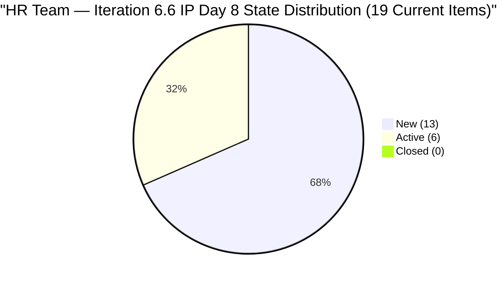
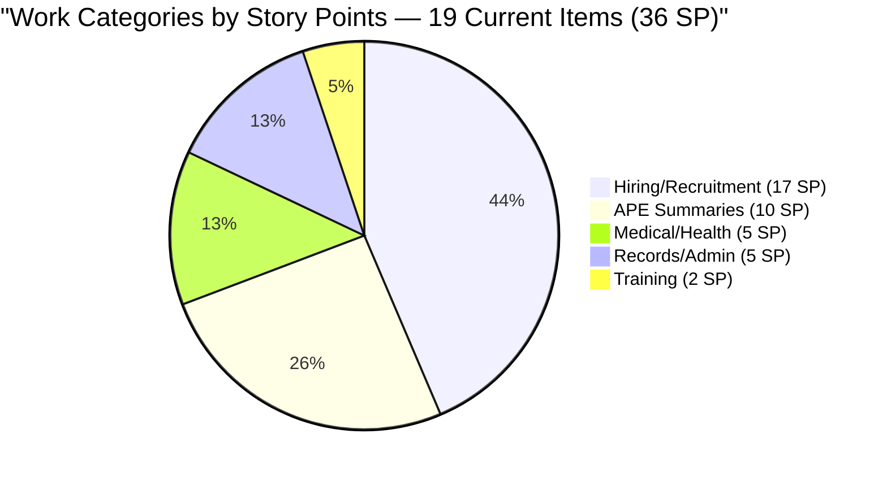
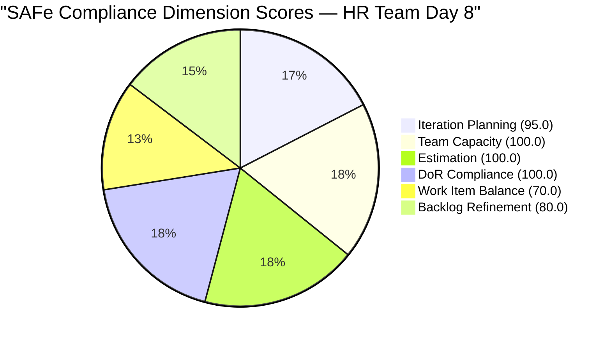

# SAFe Audit Report — Human Resource Recruitment Team

## 1. Audit Metadata

| Field | Value |
|-------|-------|
| **ADO Project** | Jairosoft FINOPS |
| **ADO Project ID** | `e0bb302f-40f9-46c3-8164-6f1acb317d63` |
| **Team** | Human Resource Recruitment Team |
| **Team ID** | `248f59a6-372c-4b74-8129-9eaf260f211e` |
| **Board URL** | [Stories and Deliverables](https://dev.azure.com/jairo/Jairosoft%20FINOPS/_boards/board/t/Human%20Resource%20Recruitment%20Team/Stories%20and%20Deliverables) |
| **Backlog** | Microsoft.RequirementCategory (Stories and Deliverables) |
| **Current Iteration** | Iteration 6.6 (IP) |
| **Iteration Path** | `Jairosoft FINOPS\2026-PI6\Iteration 6.6 (IP)` |
| **Iteration ID** | `b996cc91-1e08-49d6-a314-08e10ef03c12` |
| **Iteration Start** | March 23, 2026 |
| **Iteration Finish** | April 5, 2026 |
| **Sprint Day** | Day 8 of 14 (Monday, Mar 30) |
| **Audit Date** | March 30, 2026 — 09:00 UTC |
| **Previous Audit** | `AUDIT_20260327_0900.md` (Iteration 6.6 IP Day 5, Score 90.8/100) |
| **Overall Score** | **90.8 / 100 (Low Risk)** |
| **Scoring Rubric** | ADO SAFe v1 (six-dimension deterministic scoring) |
| **Auditor** | AI EngProd Consultant |
| **Framework** | SAFe 6.0 |
| **Audit Series** | #17 |

> **Scope note:** This audit covers only the HR Recruitment Team board in Jairosoft FINOPS. No other boards, teams, projects, or repositories were analyzed.

---

## 2. Executive Summary

This is the **17th audit in the series** and the **fifth audit of Iteration 6.6 (IP)**. Today is Sprint Day 8 of 14 (57% elapsed).

**No changes detected since the Day 5 audit (March 27).** The backlog composition, item states, story points, and capacity are identical to the prior audit. The sprint has been static for 3 days (Day 5 through Day 8), covering a weekend plus Monday morning.

**Score holds at 90.8/100 (Low Risk).** All six dimension inputs are unchanged. The 19 current items remain at 6 Active / 13 New with 36 SP committed and only 1 SP burned (from #201208 closure on Day 4).

**Critical observation:** With 57% of the sprint elapsed and only 2.8% of story points burned, the team is now deeply reliant on the burst delivery pattern observed in Iteration 6.5 (23 SP closed in one day). If the burst does not materialize by Day 10, the sprint is at risk of significant carryover.



---

## 3. Previous Audit Delta

**Previous:** AUDIT_20260327_0900 — Iteration 6.6 (IP) Day 5, 09:00 UTC

| Metric | Day 5 (Mar 27, 09:00) | **Day 8 (Mar 30, 09:00)** | Delta |
|--------|-----------------------|---------------------------|-------|
| Items Closed | 1 | **1** | 0 (no new closures) |
| SP Burned | 1 | **1** | 0 |
| Items Active | 6 | **6** | 0 |
| Items New | 13 | **13** | 0 |
| Visible Backlog | 20 | **20** | 0 |
| Current Items | 19 | **19** | 0 |
| SP Committed (current) | 36 | **36** | 0 |
| Untouched current | 11/19 (57.9%) | **11/19 (57.9%)** | 0 |
| Overall Score | 90.8 | **90.8** | No change |
| #201483 State Regression | Still New | **Still New** | No resolution (Day 8, 4 days since regression) |

**Key observation:** Zero board activity across three calendar days (Mar 27-30). This is the longest period of inactivity within Iteration 6.6. While the weekend accounts for two of those days, the sprint is now past the midpoint with no new closures since Day 4.

---

## 4. Current Iteration Snapshot

### 4.1 Iteration Overview

| Metric | Value |
|--------|-------|
| Iteration | Iteration 6.6 (IP) |
| Date Range | March 23 - April 5, 2026 (14 days) |
| Sprint Day | Day 8 of 14 (57% elapsed) |
| Items Committed (current) | 19 |
| Story Points | 36 SP |
| Items Closed | 1 (#201208, 1 SP — Day 4) |
| SP Burned | 1 SP (2.8%) |
| Items Active | 6 (31.6%) |
| Items New | 13 (68.4%) |

### 4.2 Team Capacity

| Member | Activities | Capacity/Day | Days Off |
|--------|-----------|-------------|----------|
| Almera Kleer Tayao | Documentation (4h), Requirements (1h) | **5 h/day** | Apr 1 |
| Grace | (no activities configured) | 0 h/day | — |
| **Total** | | **5 h/day** | |

Effective remaining working days (including today): ~6 (Apr 1 off; sprint ends Apr 5).

### 4.3 Burndown Progress

| Day | Closed | SP Burned | Cumulative SP | % |
|-----|--------|-----------|--------------|---|
| Day 1 (Mar 23) | 0 | 0 | 0 | 0% |
| Day 2 (Mar 24) | 0 | 0 | 0 | 0% |
| Day 3 (Mar 25) | 0 | 0 | 0 | 0% |
| Day 4 (Mar 26) | 1 | 1 | 1 | 2.8% |
| Day 5 (Mar 27) | 0 | 0 | 1 | 2.8% |
| Day 6 (Mar 28) | 0 | 0 | 1 | 2.8% |
| Day 7 (Mar 29) | 0 | 0 | 1 | 2.8% |
| **Day 8 (Mar 30)** | **0** | **0** | **1** | **2.8%** |

Required pace from Day 8: 35 SP remaining / 6 remaining working days = **5.8 SP/day** needed. This exceeds the Day 5 projection of 4.4 SP/day and is approaching the theoretical maximum for a single contributor at 5 h/day capacity.

### 4.4 Full Sprint Backlog — Day 8 State

| # | ID | Title | State | SP | Changed | Untouched? |
|---|---|---|---|---|---|---|
| 1 | 201725 | Sr Tech Lead — Mark Jovet Verano (Interview) | **Active** | 2 | Mar 28 | No |
| 2 | 201736 | Sr Tech Lead — Stephen Pabatao (Interview) | **Active** | 2 | Mar 28 | No |
| 3 | 201474 | Annual Medical Exam Budget - Cebu | Active | 2 | Mar 24 | No |
| 4 | 201483 | Result Reading with Doc Karl (Davao/Cebu) | New | 2 | Mar 26 | No |
| 5 | 201264 | LinkedIn Senior Technical Lead - Interview | Active | 2 | Mar 24 | No |
| 6 | 200319 | LinkedIn DevOps Engr. Hiring | Active | 2 | Mar 24 | No |
| 7 | 201256 | Annual Medical Check-up Make-up - Cebu | Active | 1 | Mar 24 | No |
| 8 | 200671 | LinkedIn Tech Sales from Manila Hiring | New | 1 | Mar 24 | No |
| 9 | 201209 | S&M — John Dave Fernandez (Final Interview) | New | 1 | Mar 17 | **Yes** |
| 10 | 201207 | S&M — Edgardo Rojas Jr. (Final Interview) | New | 1 | Mar 17 | **Yes** |
| 11 | 197939 | Communication Skills Proposals Summary | New | 2 | Mar 17 | **Yes** |
| 12 | 201274 | APE — Bon Jovie Cueva Summary | New | 2 | Mar 18 | **Yes** |
| 13 | 201275 | APE — Rommel Senillo Summary | New | 2 | Mar 18 | **Yes** |
| 14 | 201276 | APE — Ryan Vince Castillo Summary | New | 2 | Mar 18 | **Yes** |
| 15 | 201277 | APE — Calvin John Dalino Summary | New | 2 | Mar 18 | **Yes** |
| 16 | 193582 | APE — Caumban, Karl Jordan | New | 2 | Mar 17 | **Yes** |
| 17 | 195671 | Joniel — Upload digital 201 files to Portal | New | 5 | Mar 12 | **Yes** |
| 18 | 201272 | LinkedIn Bubble Developer Hiring — Interview | New | 2 | Mar 18 | **Yes** |
| 19 | 201273 | LinkedIn Bubble Trainer Hiring — Interview | New | 2 | Mar 18 | **Yes** |

**Untouched (11 items, 57.9%):** #201209, #201207, #197939, #201274, #201275, #201276, #201277, #193582, #195671, #201272, #201273 — all changed before March 23.

### 4.5 Non-Current Backlog Item

| ID | Title | State | SP | Iteration Path | Changed |
|----|-------|-------|----|----------------|---------|
| 200677 | Technical Interviews of qualified applicants | New | 2 | 2026-PI6 (unassigned) | Mar 9 |

---

## 5. Work Item Analysis

### 5.1 Work Item Type Distribution

| Type | Count (Current) | Share |
|------|---------|-------|
| User Story | 19 | 100% |

All 19 current items are User Stories — triggers the -30 dominant-type penalty.

### 5.2 Work Category Distribution (19 Current Items)

| Category | Items | SP | Status |
|----------|-------|----|--------|
| Hiring / Recruitment | 9 | 17 | 2 Active (Sr TL candidates), 3 Active ongoing, 4 New |
| APE (Performance Evaluation) | 5 | 10 | All New (untouched) |
| Medical / Health | 3 | 5 | 2 Active, 1 New (regression) |
| Training | 1 | 2 | New (untouched) |
| Records / Administration | 1 | 5 | New (untouched, largest item) |



### 5.3 DoR Compliance Assessment

All 19 items pass DoR:
- Descriptions: structured "As a... I want... So that..." format with targets, all well above 30 non-whitespace chars
- Acceptance criteria: numbered lists with measurable metrics, all above 20 non-whitespace chars

### 5.4 Freshness Assessment

| Metric | Value | Status |
|--------|-------|--------|
| Fresh (< 45 days, after Feb 13) | 20/20 (100%) | Base = 100.0 |
| Stale-90 (before Dec 30, 2025) | 0 | No penalty |
| Stale-180 (before Oct 2, 2025) | 0 | No penalty |
| Untouched current items | 11/19 (57.9%) | -20 (> 30%) |

---

## 6. SAFe Compliance Scorecard

| # | Dimension | Score | Formula | Evidence | Notes |
|---|-----------|-------|---------|----------|-------|
| 1 | **Iteration Planning** | **95.0** | 19/20 x 100 | 19 of 20 in current iteration | Unchanged from Day 5 |
| 2 | **Team Capacity** | **100.0** | 1/1 x 100 | Almera: 5 h/day; Apr 1 day off | Bus factor = 1 (structural) |
| 3 | **Estimation** | **100.0** | 19/19 x 100 | All 19 current items have SP > 0 | Total 36 SP |
| 4 | **DoR Compliance** | **100.0** | 19/19 x 100 | All 19 pass Desc >= 30 AND AC >= 20 | Unchanged |
| 5 | **Work Item Balance** | **70.0** | 100 - 30 | 100% User Story > 60% -> -30 | No Spikes in IP sprint |
| 6 | **Backlog Refinement** | **80.0** | 100 - 20 | 20/20 fresh; 11/19 untouched (57.9%) | -20 for untouched > 30% |
| | **Overall** | **90.8** | (95.0+100+100+100+70+80)/6 | **Low Risk (>= 80)** | |

### Score Computation Detail

```
Iteration Planning:  round(19/20 x 100, 1) = 95.0
Team Capacity:       round(1/1 x 100, 1)   = 100.0
Estimation:          round(19/19 x 100, 1)  = 100.0
DoR Compliance:      round(19/19 x 100, 1)  = 100.0
Work Item Balance:   100 - 30 = 70.0
Backlog Refinement:  base = 100.0
  untouched: 11/19 = 57.9% > 30% -> -20
  Result: 80.0

Overall: (95.0 + 100.0 + 100.0 + 100.0 + 70.0 + 80.0) / 6
       = 545.0 / 6
       = 90.8 (Low Risk)
```

### Score History — Iteration 6.6 (IP)

| Audit # | Date | Day | Score | Band | Key Change |
|---------|------|-----|-------|------|------------|
| 13 | Mar 25 (0848) | Day 2 | 90.8 | Low Risk | First 6.6 audit |
| 14 | Mar 25 (1430) | Day 3 | 90.8 | Low Risk | 6 Active, 0 Closed |
| 15 | Mar 26 (1614) | Day 4 | 90.8 | Low Risk | 1 Closed (#201208) |
| 16 | Mar 27 (0900) | Day 5 | 90.8 | Low Risk | +2 new Active items |
| **17** | **Mar 30 (0900)** | **Day 8** | **90.8** | **Low Risk** | **No changes; 3-day stall** |



---

## 7. Dimension Findings

### 7.1 Iteration Planning (95.0/100) — STRONG

19 of 20 visible backlog items assigned to the current iteration. Only #200677 (Technical Interviews, 2 SP, PI6 root) remains unassigned. No change since Day 5. Assigning it would bring this dimension to 100.0.

### 7.2 Team Capacity (100.0/100) — FULL

Almera at 5 h/day (Documentation 4h, Requirements 1h). April 1 day-off recorded. With only 6 working days remaining (including today), effective remaining capacity is approximately 30 hours (5 h/day x 6 days). No changes.

### 7.3 Estimation (100.0/100) — FULL

All 19 items have story points. Distribution: 1 SP (3 items), 2 SP (14 items), 5 SP (2 items). Total: 36 SP committed, 1 SP burned.

### 7.4 DoR Compliance (100.0/100) — FULL

All 19 items pass DoR with well-structured descriptions and acceptance criteria. No changes.

### 7.5 Work Item Balance (70.0/100) — MODERATE

100% User Story composition in an IP sprint. No Spikes, Enablers, or improvement items. This penalty persists unchanged across all five Iteration 6.6 audits. Adding one Spike would reduce the penalty by 30 points if it brought User Story share to 60% or below (would require adding 13+ Spikes, impractical). However, simply having a non-User-Story type present would not change the dominant share unless it represented > 40% of items.

### 7.6 Backlog Refinement (80.0/100) — GOOD WITH PENALTY

All 20 items fresh. Untouched ratio remains at 11/19 = 57.9%, unchanged since Day 5. The -20 penalty persists. The score will improve only when untouched items drop to 5 or fewer out of 19 (26.3% or below). That requires 6+ additional items to be activated or closed.

---

## 8. Risks and Bottlenecks

| # | Risk | Severity | Status | Mitigation |
|---|------|----------|--------|------------|
| 1 | **Sprint burndown stall (57% elapsed, 2.8% burned)** | **Critical (Escalating)** | **NEW** — 3-day stall since Day 5 | Burst delivery must begin TODAY; 5.8 SP/day needed |
| 2 | **Bus factor = 1** | Critical (Structural) | Unchanged — 17 audits | Almera is sole delivery agent; Grace has 0 capacity |
| 3 | **No iteration goal** | High | Unchanged — 17 consecutive audits | Mandatory SAFe artifact; still absent |
| 4 | **No PI objectives** | High | Unchanged — 17 consecutive audits | Feature-to-PI linkage still absent |
| 5 | **#201483 state regression unresolved** | Medium (Growing) | Day 8; 4 days since regression | Active to New on Mar 26; no update since. Clarify blocker. |
| 6 | **IP iteration without Spikes** | Medium | Unchanged | Add at least 1 Spike for IP compliance |
| 7 | **High untouched ratio (57.9%)** | Medium (Growing) | Unchanged since Day 5 | 11 items stagnant; APE cluster needs activation |
| 8 | **#195671 (5 SP, 18 days untouched)** | Medium (Growing) | Joniel dependency still unresolved | Largest single item; flag to Almera; de-commit if blocked |
| 9 | **#200677 unassigned** | Low | Unchanged from Day 2 | Assign to Iter 6.6 or defer explicitly |

### Delivery Pattern Comparison

| Pattern | 6.5 | 6.6 (so far) |
|---------|-----|-------------|
| Days 1-7 closures | 0 | 1 (#201208 Day 4) |
| Day 8 closures | 0 | **0** (this audit) |
| Items Active Day 8 | ~4 | **6** |
| Burst day | Day 9 (12 items, 23 SP) | Pending — expected Day 8-10 |
| Outlook | Burst Day 9 | **Must burst by Day 10 or carryover risk is high** |

In Iteration 6.5, the burst happened on Day 9 (Mar 18) with 12 items / 23 SP closed in a single day. If a similar burst occurs today (Day 8) or tomorrow (Day 9), the sprint can still deliver. However, the 36 SP commitment exceeds the 6.5 delivery of 34 SP, and the remaining window is now shorter.

---

## 9. Prioritized Recommendations

### P0 — Urgent (Today)

1. **Begin closing items immediately.** With 35 SP remaining and 6 working days left, the team needs to close at minimum 6 SP/day. The 6 Active items (#201725, #201736, #201474, #201264, #200319, #201256) totaling 11 SP should be the first closure candidates. Start with the medical items (#201474, #201256) and Sr. Tech Lead candidates (#201725, #201736) which have been Active the longest.

2. **Activate and batch-close APE cluster** (#201274, #201275, #201276, #201277, #193582) — 5 items, 10 SP, all unchanged since Mar 17-18. These are parallel, low-dependency items. If started today, they could be closed by Day 9-10.

### P1 — Critical (By Day 9)

3. **Resolve #201483** (Result Reading with Doc Karl). Item regressed from Active to New on Mar 26 and has been static for 4 days. Either reschedule with Doc Karl or close/de-commit.

4. **Close S&M Final Interview items** (#201207, #201209) — both New since Mar 17. Given #201208 (same category) closed on Day 4, these should follow immediately.

5. **Define an iteration goal for 6.6 (IP).** Absent across 17 consecutive audits. Suggested: *"Complete all Sr. Tech Lead and S&M hiring decisions, close all APE summaries, and finalize Cebu medical activities."*

### P2 — Important (By Day 10)

6. **Evaluate #195671** (Joniel 201 files, 5 SP, 18 days untouched). If Joniel is blocked or unavailable, de-commit this item to reduce sprint scope from 36 to 31 SP.

7. **Assign #200677** — pull into Iter 6.6 (2 SP) or defer explicitly.

### P3 — Strategic

8. **Add one Spike** for the IP iteration to improve Work Item Balance.

9. **Link Features to PI6 Objectives** — absent for 17 audits; strategic alignment gap.

---

## 10. Evidence Gaps and Limitations

| Gap | Impact | Notes |
|-----|--------|-------|
| **No iteration goal in ADO** | Cannot verify sprint goal via API | Absent 17 consecutive audits |
| **PI Objectives not verifiable** | Cannot confirm Feature-to-PI linkage | Structural gap |
| **#201483 state change reason** | Unknown blocker | Active to New on Mar 26; Almera input required |
| **Grace's role undefined** | 0 capacity; unclear function on team | Structural; not a scoring impact |
| **#195671 Joniel dependency** | 5 SP at risk if blocked | External resource; 18 days untouched |
| **3-day board inactivity** | Cannot distinguish weekend rest from stall | Weekend (Mar 28-29) partially explains gap |
| **No GitHub repositories scoped** | No code delivery evidence | HR work is non-code |

---

## Appendix: Score History — HR Recruitment Team (All 17 Audits)

| # | Date | Iteration | Score | Key Event |
|---|------|-----------|-------|-----------|
| 1 | Feb 25 | 6.4 | 20/100 | Critical — no SP, no AC |
| 2 | Mar 3 | 6.4 | 40/100 | 17 items closed, SP partial |
| 3 | Mar 4 | 6.4 | 40/100 | Feature hierarchy partial |
| 4 | Mar 5 | 6.4 | 50/100 | SP 100%, AC improving |
| 5 | Mar 6 | 6.4 | 60/100 | INVEST compliance improving |
| 6 | Mar 9 | 6.4 | 65/100 | 6.4 close — 14 items done |
| 7 | Mar 10 | 6.5 | 75/100 | 6.5 sprint planning — clean start |
| 8 | Mar 11 | 6.5 | 70/100 | Scope creep, WIP explosion |
| 9 | Mar 16 | 6.5 | 60/100 | 5-day stall, overdue items |
| 10 | Mar 17 | 6.5 | 70/100 | Stall broken, 3 closures |
| 11 | Mar 18 | 6.5 | 75/100 | 12-item burst day |
| 12 | Mar 22 | 6.5 | 80/100 | 100% complete — series high |
| 13 | Mar 25 (0848) | 6.6 | 90.8/100 | First 6.6 audit — strong planning |
| 14 | Mar 25 (1430) | 6.6 | 90.8/100 | Day 3; 6 Active, 0 Closed |
| 15 | Mar 26 (1614) | 6.6 | 90.8/100 | 1 Closed (#201208); #201483 regression |
| 16 | Mar 27 (0900) | 6.6 | 90.8/100 | +2 Active hires (#201725, #201736) |
| **17** | **Mar 30 (0900)** | **6.6** | **90.8/100** | **3-day stall; 57% elapsed, 2.8% burned** |

---

*Report generated: March 30, 2026 09:00 UTC | SAFe 6.0 Framework | Jairosoft FINOPS — HR Recruitment Team*
*Iteration 6.6 (IP): Mar 23 - Apr 5, 2026 | Day 8 of 14 | Audit #17 in series*
*Score: 90.8/100 (Low Risk) | Previous: AUDIT_20260327_0900 (90.8/100)*
*No board changes since Day 5 — sprint burndown stall is the primary concern*
