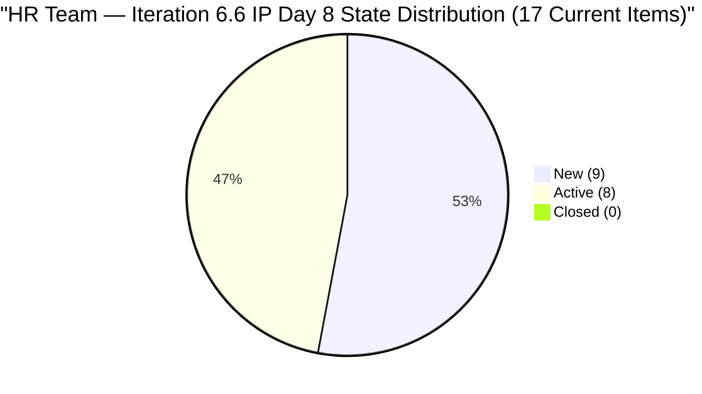
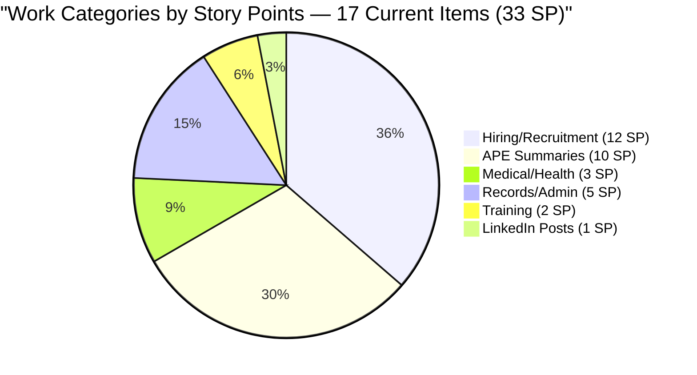
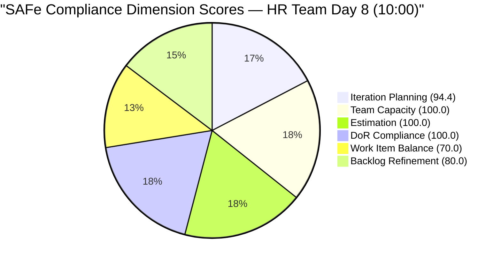

# SAFe Audit Report — Human Resource Recruitment Team

## 1. Audit Metadata

| Field | Value |
|-------|-------|
| **ADO Project** | Jairosoft FINOPS |
| **ADO Project ID** | `e0bb302f-40f9-46c3-8164-6f1acb317d63` |
| **Team** | Human Resource Recruitment Team |
| **Team ID** | `248f59a6-372c-4b74-8129-9eaf260f211e` |
| **Workspace** | `ado_hr` |
| **Board URL** | [Stories and Deliverables](https://dev.azure.com/jairo/Jairosoft%20FINOPS/_boards/board/t/Human%20Resource%20Recruitment%20Team/Stories%20and%20Deliverables) |
| **Backlog** | Microsoft.RequirementCategory (Stories and Deliverables) |
| **Current Iteration** | Iteration 6.6 (IP) |
| **Iteration Path** | `Jairosoft FINOPS\2026-PI6\Iteration 6.6 (IP)` |
| **Iteration ID** | `b996cc91-1e08-49d6-a314-08e10ef03c12` |
| **Iteration Start** | March 23, 2026 |
| **Iteration Finish** | April 5, 2026 |
| **Sprint Day** | Day 8 of 14 (Monday, Mar 30) |
| **Audit Date** | March 30, 2026 — 10:00 PHT |
| **Previous Audit** | `AUDIT_20260330_0900.md` (Iteration 6.6 IP Day 8, Score 90.8/100) |
| **Overall Score** | **90.7 / 100 (Low Risk)** |
| **Scoring Rubric** | ADO SAFe v1 (six-dimension deterministic scoring) |
| **Auditor** | AI EngProd Consultant |
| **Framework** | SAFe 6.0 |
| **Audit Series** | #18 |

> **Scope note:** This audit covers only the HR Recruitment Team board in Jairosoft FINOPS. No other boards, teams, projects, or repositories were analyzed.

---

## 2. Executive Summary

This is the **18th audit in the series** and the **sixth audit of Iteration 6.6 (IP)**. Today is Sprint Day 8 of 14 (57% elapsed).

**The 3-day stall has broken.** Five items were activated today (Mar 30), signaling the start of the expected burst delivery pattern. Items #201209, #201256, #201274, #201275, and #201277 all moved to Active status, bringing the Active count from 6 to 8. Additionally, two items (#201264 "LinkedIn Senior Technical Lead - Interview" and #201474 "Annual Medical Exam Budget - Cebu") have been removed from the backlog entirely, reducing the visible backlog from 20 to 18 items and current iteration items from 19 to 17.

**Score adjusts marginally to 90.7/100 (Low Risk)**, down 0.1 from 90.8, due to the Iteration Planning ratio shifting from 19/20 to 17/18 (94.4 vs 95.0). All other dimensions remain unchanged.

**Critical observation:** With 8 Active items and burst activity beginning, the team appears to be following the Iteration 6.5 pattern (burst on Day 8-9). However, 33 SP remain committed across 17 items with approximately 5 working days left. The pace needed is 6.6 SP/day, which exceeds single-contributor capacity at 5 h/day.



---

## 3. Previous Audit Delta

**Previous:** AUDIT_20260330_0900 — Iteration 6.6 (IP) Day 8, 09:00 UTC

| Metric | Day 8 (09:00) | **Day 8 (10:00 PHT)** | Delta |
|--------|--------------|-----------------------|-------|
| Visible Backlog | 20 | **18** | -2 (removed #201264, #201474) |
| Current Items | 19 | **17** | -2 |
| Items New | 13 | **9** | -4 (4 activated, 2 removed) |
| Items Active | 6 | **8** | +2 net (+5 activated, -2 removed from backlog, -1 was already Active) |
| Items Closed | 1 (#201208) | **1** | 0 (no new closures; #201208 was already removed from backlog) |
| SP Committed (current) | 36 | **33** | -3 (removed items had 4 SP total; #201208 already gone) |
| SP Burned | 1 | **0** | -1 (#201208 no longer in backlog) |
| Untouched current | 11/19 (57.9%) | **7/17 (41.2%)** | Improved (4 items activated today) |
| Overall Score | 90.8 | **90.7** | -0.1 |

**Key changes:**

1. **#201264 (LinkedIn Senior Technical Lead - Interview, 2 SP, Active)** — Removed from backlog. Previously Active since Day 3. Either closed and removed, or de-committed.
2. **#201474 (Annual Medical Exam Budget - Cebu, 2 SP, Active)** — Removed from backlog. Previously Active since Day 1.
3. **#201209 (S&M - John Dave Fernandez)** — New to **Active** (changed Mar 30 15:15)
4. **#201256 (Annual Medical Check-up Cebu)** — Remained Active (updated Mar 30 15:36)
5. **#201274 (APE - Bon Jovie Cueva)** — New to **Active** (changed Mar 30 15:33)
6. **#201275 (APE - Rommel Senillo)** — New to **Active** (changed Mar 30 15:33)
7. **#201277 (APE - Calvin John Dalino)** — New to **Active** (changed Mar 30 15:34)

The burst activation pattern has begun. Five items activated within ~20 minutes (15:15-15:36 UTC), consistent with Almera's batch working style observed in Iteration 6.5.

---

## 4. Current Iteration Snapshot

### 4.1 Iteration Overview

| Metric | Value |
|--------|-------|
| Iteration | Iteration 6.6 (IP) |
| Date Range | March 23 - April 5, 2026 (14 days) |
| Sprint Day | Day 8 of 14 (57% elapsed) |
| Items Committed (current) | 17 |
| Story Points | 33 SP |
| Items Closed | 0 |
| SP Burned | 0 SP (0%) |
| Items Active | 8 (47.1%) |
| Items New | 9 (52.9%) |

### 4.2 Team Capacity

| Member | Activities | Capacity/Day | Days Off |
|--------|-----------|-------------|----------|
| Almera Kleer Tayao | Documentation (4h), Requirements (1h) | **5 h/day** | Apr 1 |
| Grace | (no activities configured) | 0 h/day | — |
| **Total** | | **5 h/day** | |

Effective remaining working days (excluding today): ~5 (Apr 1 off; sprint ends Apr 5).

### 4.3 Full Sprint Backlog — Day 8 State

| # | ID | Title | State | SP | Changed | Untouched? |
|---|---|---|---|---|---|---|
| 1 | 201725 | Sr. Tech Lead — Mark Jovet Verano | **Active** | 2 | Mar 28 | No |
| 2 | 201736 | Sr. Tech Lead — Stephen Pabatao | **Active** | 2 | Mar 28 | No |
| 3 | 201209 | S&M — John Dave Fernandez (Final Interview) | **Active** | 1 | **Mar 30** | No |
| 4 | 201256 | Annual Medical Check-up - Cebu | **Active** | 1 | **Mar 30** | No |
| 5 | 201274 | APE — Bon Jovie Cueva Summary | **Active** | 2 | **Mar 30** | No |
| 6 | 201275 | APE — Rommel Senillo Summary | **Active** | 2 | **Mar 30** | No |
| 7 | 201277 | APE — Calvin John Dalino Summary | **Active** | 2 | **Mar 30** | No |
| 8 | 200319 | LinkedIn DevOps Engr. Hiring | **Active** | 2 | Mar 24 | No |
| 9 | 201207 | S&M — Edgardo Rojas Jr. (Final Interview) | New | 1 | Mar 17 | **Yes** |
| 10 | 200671 | LinkedIn Tech Sales from Manila Hiring | New | 1 | Mar 24 | No |
| 11 | 201483 | Result Reading with Doc Karl (Davao/Cebu) | New | 2 | Mar 26 | No |
| 12 | 197939 | Communication Skills Proposals Summary | New | 2 | Mar 17 | **Yes** |
| 13 | 201272 | LinkedIn Bubble Developer Hiring — Interview | New | 2 | Mar 18 | **Yes** |
| 14 | 201273 | LinkedIn Bubble Trainer Hiring — Interview | New | 2 | Mar 18 | **Yes** |
| 15 | 201276 | APE — Ryan Vince Castillo Summary | New | 2 | Mar 18 | **Yes** |
| 16 | 193582 | APE — Karl Jordan Caumban | New | 2 | Mar 17 | **Yes** |
| 17 | 195671 | Joniel — Upload digital 201 files to Portal | New | 5 | Mar 12 | **Yes** |

**Untouched (7 items, 41.2%):** #201207, #197939, #201272, #201273, #201276, #193582, #195671 — all changed before March 23.

### 4.4 Non-Current Backlog Item

| ID | Title | State | SP | Iteration Path | Changed |
|----|-------|-------|----|----------------|---------|
| 200677 | Technical Interviews of qualified applicants | New | 2 | 2026-PI6 (unassigned) | Mar 9 |

---

## 5. Work Item Analysis

### 5.1 Work Item Type Distribution

| Type | Count (Current) | Share |
|------|---------|-------|
| User Story | 17 | 100% |

All 17 current items are User Stories — triggers the -30 dominant-type penalty.

### 5.2 Work Category Distribution (17 Current Items)

| Category | Items | SP | Status |
|----------|-------|----|--------|
| Hiring / Recruitment | 7 | 12 | 2 Active (Sr TL candidates), 2 Active (S&M, DevOps), 3 New |
| APE (Performance Evaluation) | 5 | 10 | 3 Active (Cueva, Senillo, Dalino), 2 New (Castillo, Caumban) |
| Medical / Health | 2 | 3 | 1 Active (Check-up), 1 New (Doc Karl) |
| Training | 1 | 2 | New (untouched) |
| Records / Administration | 1 | 5 | New (untouched, largest item) |
| LinkedIn Hiring Posts | 1 | 1 | New |



### 5.3 DoR Compliance Assessment

All 17 items pass DoR:

- Descriptions: structured "As a... I want... So that..." format with targets, all well above 30 non-whitespace chars
- Acceptance criteria: numbered lists with measurable metrics, all above 20 non-whitespace chars

### 5.4 Freshness Assessment

| Metric | Value | Status |
|--------|-------|--------|
| Fresh (< 45 days, after Feb 13) | 18/18 (100%) | Base = 100.0 |
| Stale-90 (before Dec 30, 2025) | 0 | No penalty |
| Stale-180 (before Oct 2, 2025) | 0 | No penalty |
| Untouched current items | 7/17 (41.2%) | -20 (> 30%) |

---

## 6. SAFe Compliance Scorecard

| # | Dimension | Score | Formula | Evidence | Notes |
|---|-----------|-------|---------|----------|-------|
| 1 | **Iteration Planning** | **94.4** | 17/18 x 100 | 17 of 18 in current iteration | Down from 95.0 (backlog shrank) |
| 2 | **Team Capacity** | **100.0** | 1/1 x 100 | Almera: 5 h/day; Apr 1 day off | Bus factor = 1 (structural) |
| 3 | **Estimation** | **100.0** | 17/17 x 100 | All 17 current items have SP > 0 | Total 33 SP |
| 4 | **DoR Compliance** | **100.0** | 17/17 x 100 | All 17 pass Desc >= 30 AND AC >= 20 | Unchanged |
| 5 | **Work Item Balance** | **70.0** | 100 - 30 | 100% User Story > 60% -> -30 | No Spikes in IP sprint |
| 6 | **Backlog Refinement** | **80.0** | 100 - 20 | 18/18 fresh; 7/17 untouched (41.2%) | -20 for untouched > 30% |
| | **Overall** | **90.7** | (94.4+100+100+100+70+80)/6 | **Low Risk (>= 80)** | |

### Score Computation Detail

```
Iteration Planning:  round(17/18 x 100, 1) = 94.4
Team Capacity:       round(1/1 x 100, 1)   = 100.0
Estimation:          round(17/17 x 100, 1)  = 100.0
DoR Compliance:      round(17/17 x 100, 1)  = 100.0
Work Item Balance:   100 - 30 = 70.0
Backlog Refinement:  base = 100.0
  untouched: 7/17 = 41.2% > 30% -> -20
  Result: 80.0

Overall: (94.4 + 100.0 + 100.0 + 100.0 + 70.0 + 80.0) / 6
       = 544.4 / 6
       = 90.7 (Low Risk)
```

### Score History — Iteration 6.6 (IP)

| Audit # | Date | Day | Score | Band | Key Change |
|---------|------|-----|-------|------|------------|
| 13 | Mar 25 (0848) | Day 2 | 90.8 | Low Risk | First 6.6 audit |
| 14 | Mar 25 (1430) | Day 3 | 90.8 | Low Risk | 6 Active, 0 Closed |
| 15 | Mar 26 (1614) | Day 4 | 90.8 | Low Risk | 1 Closed (#201208) |
| 16 | Mar 27 (0900) | Day 5 | 90.8 | Low Risk | +2 new Active items |
| 17 | Mar 30 (0900) | Day 8 | 90.8 | Low Risk | No changes; 3-day stall |
| **18** | **Mar 30 (1000)** | **Day 8** | **90.7** | **Low Risk** | **Burst begins; 5 activations; 2 items removed from backlog** |



---

## 7. Dimension Findings

### 7.1 Iteration Planning (94.4/100) — STRONG

17 of 18 visible backlog items assigned to the current iteration. Only #200677 (Technical Interviews, 2 SP, PI6 root) remains unassigned. Score dropped slightly from 95.0 due to backlog shrinking from 20 to 18 (17/18 = 94.4 vs 19/20 = 95.0). Assigning #200677 would bring this to 100.0.

### 7.2 Team Capacity (100.0/100) — FULL

Almera at 5 h/day (Documentation 4h, Requirements 1h). April 1 day-off recorded. With approximately 5 working days remaining, effective remaining capacity is ~25 hours. No changes.

### 7.3 Estimation (100.0/100) — FULL

All 17 items have story points. Distribution: 1 SP (3 items), 2 SP (13 items), 5 SP (1 item). Total: 33 SP committed, 0 SP burned.

### 7.4 DoR Compliance (100.0/100) — FULL

All 17 items pass DoR with well-structured descriptions and acceptance criteria.

### 7.5 Work Item Balance (70.0/100) — MODERATE

100% User Story composition in an IP sprint. No Spikes, Enablers, or improvement items. This penalty has persisted across all six Iteration 6.6 audits.

### 7.6 Backlog Refinement (80.0/100) — GOOD WITH PENALTY

All 18 items fresh. Untouched ratio improved from 11/19 (57.9%) to 7/17 (41.2%) — 4 items were activated today and 2 items were removed. Still above the 30% threshold, so the -20 penalty persists. The score will improve only when untouched items drop to 5 or fewer out of 17 (29.4% or below).

---

## 8. Risks and Bottlenecks

| # | Risk | Severity | Status | Mitigation |
|---|------|----------|--------|------------|
| 1 | **Sprint burndown (57% elapsed, 0% burned in current scope)** | **Critical** | Active — burst activations began | 8 Active items; closures expected within 24-48h |
| 2 | **Bus factor = 1** | Critical (Structural) | Unchanged — 18 audits | Almera is sole delivery agent; Grace has 0 capacity |
| 3 | **No iteration goal** | High | Unchanged — 18 consecutive audits | Mandatory SAFe artifact; still absent |
| 4 | **No PI objectives** | High | Unchanged — 18 consecutive audits | Feature-to-PI linkage still absent |
| 5 | **#195671 (5 SP, 18+ days untouched)** | Medium (Growing) | Joniel dependency still unresolved | Largest single item; de-commit if blocked |
| 6 | **#201483 state regression unresolved** | Medium | Day 8; 4 days since Active-to-New regression | Still New; clarify blocker with Doc Karl |
| 7 | **IP iteration without Spikes** | Medium | Unchanged | Add at least 1 Spike for IP compliance |
| 8 | **2 items removed without explanation** | Low | New — #201264, #201474 removed | Confirm whether closed elsewhere or de-committed |
| 9 | **#200677 unassigned** | Low | Unchanged from Day 2 | Assign to Iter 6.6 or defer explicitly |

### Delivery Pattern Comparison

| Pattern | 6.5 | 6.6 (so far) |
|---------|-----|-------------|
| Days 1-7 closures | 0 | 1 (#201208, since removed) |
| Day 8 activations | ~4 | **5 (burst begins)** |
| Burst day | Day 9 (12 items, 23 SP) | Expected Day 8-9 |
| Outlook | Burst Day 9 | **Burst pattern emerging; closures expected Day 8-9** |

---

## 9. Prioritized Recommendations

### P0 — Urgent (Today)

1. **Close the 8 Active items as rapidly as possible.** The APE cluster (#201274, #201275, #201277) and medical (#201256) were just activated and should be first closure candidates. The S&M item (#201209) and Sr. Tech Lead items (#201725, #201736) have been Active longest.

2. **Activate remaining APE items** (#201276 Ryan Vince Castillo, #193582 Karl Jordan Caumban) — 2 items, 4 SP, still New and untouched. Batch-activating these would reduce the untouched ratio below 30% and improve Backlog Refinement to 100.

### P1 — Critical (By Day 9)

1. **Resolve #201483** (Result Reading with Doc Karl). Still New after regression from Active on Mar 26. Either reschedule or de-commit.

2. **Evaluate #195671** (Joniel 201 files, 5 SP, 18+ days untouched). If Joniel is blocked, de-commit to reduce scope from 33 to 28 SP.

3. **Clarify removed items** (#201264, #201474). Confirm whether they were completed and closed in a different view, or de-committed to a future iteration.

### P2 — Important (By Day 10)

1. **Define an iteration goal for 6.6 (IP).** Absent across 18 consecutive audits. Suggested: *"Complete all APE summaries, finalize Sr. Tech Lead hiring decisions, and close remaining recruitment items."*

2. **Assign #200677** — pull into Iter 6.6 (2 SP) or defer explicitly.

### P3 — Strategic

1. **Add one Spike** for the IP iteration to improve Work Item Balance.
2. **Link Features to PI6 Objectives** — absent for 18 audits; strategic alignment gap.

---

## 10. Evidence Gaps and Limitations

| Gap | Impact | Notes |
|-----|--------|-------|
| **No iteration goal in ADO** | Cannot verify sprint goal via API | Absent 18 consecutive audits |
| **PI Objectives not verifiable** | Cannot confirm Feature-to-PI linkage | Structural gap |
| **#201264 and #201474 removal reason** | Cannot confirm close vs de-commit | Items gone from backlog; no state trail |
| **#201483 state change reason** | Unknown blocker | Active to New on Mar 26; still unresolved |
| **Grace's role undefined** | 0 capacity; unclear function on team | Structural; not a scoring impact |
| **#195671 Joniel dependency** | 5 SP at risk if blocked | External resource; 18+ days untouched |
| **No GitHub repositories scoped** | No code delivery evidence | HR work is non-code |

---

## Appendix: Score History — HR Recruitment Team (All 18 Audits)

| # | Date | Iteration | Score | Key Event |
|---|------|-----------|-------|-----------|
| 1 | Feb 25 | 6.4 | 20/100 | Critical — no SP, no AC |
| 2 | Mar 3 | 6.4 | 40/100 | 17 items closed, SP partial |
| 3 | Mar 4 | 6.4 | 40/100 | Feature hierarchy partial |
| 4 | Mar 5 | 6.4 | 50/100 | SP 100%, AC improving |
| 5 | Mar 6 | 6.4 | 60/100 | INVEST compliance improving |
| 6 | Mar 9 | 6.4 | 65/100 | 6.4 close — 14 items done |
| 7 | Mar 10 | 6.5 | 75/100 | 6.5 sprint planning — clean start |
| 8 | Mar 11 | 6.5 | 70/100 | Scope creep, WIP explosion |
| 9 | Mar 16 | 6.5 | 60/100 | 5-day stall, overdue items |
| 10 | Mar 17 | 6.5 | 70/100 | Stall broken, 3 closures |
| 11 | Mar 18 | 6.5 | 75/100 | 12-item burst day |
| 12 | Mar 22 | 6.5 | 80/100 | 100% complete — series high |
| 13 | Mar 25 (0848) | 6.6 | 90.8/100 | First 6.6 audit — strong planning |
| 14 | Mar 25 (1430) | 6.6 | 90.8/100 | Day 3; 6 Active, 0 Closed |
| 15 | Mar 26 (1614) | 6.6 | 90.8/100 | 1 Closed (#201208); #201483 regression |
| 16 | Mar 27 (0900) | 6.6 | 90.8/100 | +2 Active hires (#201725, #201736) |
| 17 | Mar 30 (0900) | 6.6 | 90.8/100 | 3-day stall; 57% elapsed, 2.8% burned |
| **18** | **Mar 30 (1000)** | **6.6** | **90.7/100** | **Burst begins; 5 activations; 2 items removed** |

---

*Report generated: March 30, 2026 10:00 PHT | SAFe 6.0 Framework | Jairosoft FINOPS — HR Recruitment Team*
*Iteration 6.6 (IP): Mar 23 - Apr 5, 2026 | Day 8 of 14 | Audit #18 in series*
*Score: 90.7/100 (Low Risk) | Previous: AUDIT_20260330_0900 (90.8/100)*
*Burst activation pattern detected — 5 items activated within 20 minutes; closures expected imminently*
