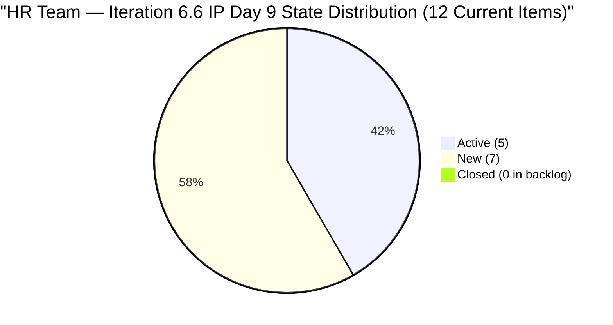
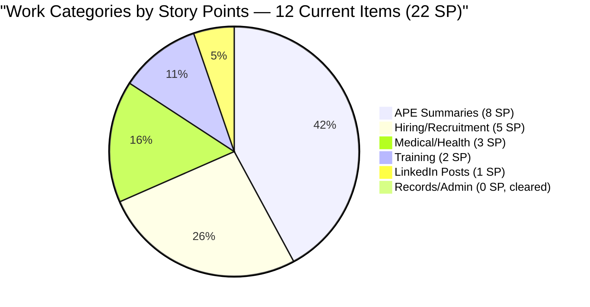
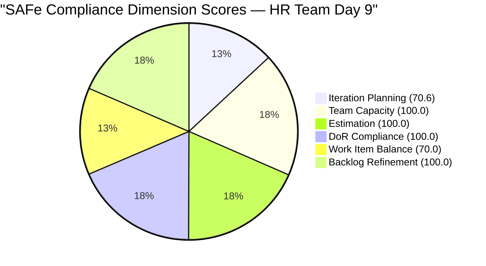

# SAFe Audit Report — Human Resource Recruitment Team

## 1. Audit Metadata

| Field | Value |
|-------|-------|
| **ADO Project** | Jairosoft FINOPS |
| **ADO Project ID** | `e0bb302f-40f9-46c3-8164-6f1acb317d63` |
| **Team** | Human Resource Recruitment Team |
| **Team ID** | `248f59a6-372c-4b74-8129-9eaf260f211e` |
| **Workspace** | `ado_hr` |
| **Board URL** | [Stories and Deliverables](https://dev.azure.com/jairo/Jairosoft%20FINOPS/_boards/board/t/Human%20Resource%20Recruitment%20Team/Stories%20and%20Deliverables) |
| **Backlog** | Microsoft.RequirementCategory (Stories and Deliverables) |
| **Current Iteration** | Iteration 6.6 (IP) |
| **Iteration Path** | `Jairosoft FINOPS\2026-PI6\Iteration 6.6 (IP)` |
| **Iteration ID** | `b996cc91-1e08-49d6-a314-08e10ef03c12` |
| **Iteration Start** | March 23, 2026 |
| **Iteration Finish** | April 5, 2026 |
| **Sprint Day** | Day 9 of 14 (Tuesday, Mar 31) |
| **Audit Date** | March 31, 2026 — 09:00 PHT |
| **Previous Audit** | `AUDIT_20260330_1000.md` (Iteration 6.6 IP Day 8, Score 90.7/100) |
| **Overall Score** | **90.1 / 100 (Low Risk)** |
| **Scoring Rubric** | ADO SAFe v1 (six-dimension deterministic scoring) |
| **Auditor** | AI EngProd Consultant |
| **Framework** | SAFe 6.0 |
| **Audit Series** | #19 |

> **Scope note:** This audit covers only the HR Recruitment Team board in Jairosoft FINOPS. No other boards, teams, projects, or repositories were analyzed.

---

## 2. Executive Summary

This is the **19th audit in the series** and the **seventh audit of Iteration 6.6 (IP)**. Today is Sprint Day 9 of 14 (64% elapsed).

**The burst pattern has delivered results.** Five items that were Active yesterday have been **Closed** overnight: #201725 (Sr. Tech Lead - Mark Jovet Verano), #201736 (Sr. Tech Lead - Stephen Pabatao), #201209 (S&M - John Dave Fernandez), #201207 (S&M - Edgardo Rojas Jr.), and #195671 (Joniel 201 files upload, 5 SP). These are no longer in the backlog. Additionally, **four new items have been added** to the backlog at the project root level (not yet assigned to Iteration 6.6): #202017, #202022, #202039, #202042 — all hiring decision follow-ups for candidates whose interview items just closed.

The visible backlog has shifted from 18 to **17 items** (5 removed via closure, 4 new items added). Current iteration items dropped from 17 to **12** (5 closures, no new items assigned to iteration). Total SP committed in the iteration dropped from 33 to **22 SP**, with at least 11 SP burned via the 5 closures.

**Score adjusts slightly to 90.1/100 (Low Risk)**, down 0.6 from 90.7, driven by the Iteration Planning ratio dropping from 17/18 (94.4) to 12/17 (70.6) as the new unassigned items dilute the denominator. All other dimensions improved or held steady.



---

## 3. Previous Audit Delta

**Previous:** AUDIT_20260330_1000 — Iteration 6.6 (IP) Day 8, 10:00 PHT

| Metric | Day 8 (10:00) | **Day 9 (09:00)** | Delta |
|--------|--------------|-------------------|-------|
| Visible Backlog | 18 | **17** | -1 (5 closed/removed, 4 new added) |
| Current Items | 17 | **12** | -5 (5 closures) |
| Items Active | 8 | **5** | -3 (5 closed, 2 remain + new states) |
| Items New | 9 | **7** | -2 |
| Items Closed (cumulative) | 0 in backlog | **5 closed today** (gone from backlog) | +5 |
| SP Committed (current) | 33 | **22** | -11 (5 items burned) |
| SP Burned (cumulative this sprint) | 0 | **11** | +11 |
| Non-current backlog items | 1 (#200677) | **5** (#200677, #202017, #202022, #202039, #202042) | +4 |
| Untouched current | 7/17 (41.2%) | **0/12 (0%)** | Resolved |
| Overall Score | 90.7 | **90.1** | -0.6 |

**Key changes:**
1. **#201725 (Sr. Tech Lead - Mark Jovet Verano, 2 SP)** — **CLOSED** Mar 31. Removed from backlog.
2. **#201736 (Sr. Tech Lead - Stephen Pabatao, 2 SP)** — **CLOSED** Mar 31. Removed from backlog.
3. **#201209 (S&M - John Dave Fernandez, 1 SP)** — **CLOSED** Mar 31. Removed from backlog.
4. **#201207 (S&M - Edgardo Rojas Jr., 1 SP)** — **CLOSED** Mar 31. Removed from backlog.
5. **#195671 (Joniel 201 files upload, 5 SP)** — **CLOSED** Mar 31. Removed from backlog. The long-standing blocked item is finally resolved.
6. **#202017 (Sr. Tech Lead - Mark Jovet Verano - Client Interview & Decision, 2 SP)** — **NEW** item added at project root. Follow-up to closed #201725.
7. **#202022 (Sr. Tech Lead - Stephen Pabatao - Client Interview & Decision, 2 SP)** — **NEW** item added at project root. Follow-up to closed #201736.
8. **#202039 (S&M - John Dave Fernandez Decision, 1 SP)** — **NEW** item added at project root. Follow-up to closed #201209.
9. **#202042 (S&M - Edgardo Rojas Jr. Final Decision, 1 SP)** — **NEW** item added at project root. Follow-up to closed #201207.
10. All remaining 12 current items had ChangedDate updated to Mar 31 (batch update).

---

## 4. Current Iteration Snapshot

### 4.1 Iteration Overview

| Metric | Value |
|--------|-------|
| Iteration | Iteration 6.6 (IP) |
| Date Range | March 23 - April 5, 2026 (14 days) |
| Sprint Day | Day 9 of 14 (64% elapsed) |
| Items Committed (current) | 12 |
| Story Points Committed | 22 SP |
| Items Closed (burned, removed from backlog) | 5 (11 SP) |
| SP Burned | 11 SP (50% of original 22 SP scope; 33% of original 33 SP) |
| Items Active | 5 (41.7%) |
| Items New | 7 (58.3%) |

### 4.2 Team Capacity

| Member | Activities | Capacity/Day | Days Off |
|--------|-----------|-------------|----------|
| Almera Kleer Tayao | Documentation (4h), Requirements (1h) | **5 h/day** | Apr 1 |
| **Total** | | **5 h/day** | |

> Note: Grace is no longer listed in the team capacity API response for this iteration. Only Almera has configured capacity.

### 4.3 Full Sprint Backlog — Day 9 State (12 Current Items)

| # | ID | Title | State | SP | Changed | Assignee |
|---|---|---|---|---|---|---|
| 1 | 200319 | LinkedIn DevOps Engr. Hiring | **Active** | 2 | Mar 31 | Almera |
| 2 | 201256 | Annual Medical Check-up - Cebu | **Active** | 1 | Mar 31 | Almera |
| 3 | 201274 | APE - Bon Jovie Cueva - Summary | **Active** | 2 | Mar 31 | Almera |
| 4 | 201275 | APE - Rommel Senillo - Summary | **Active** | 2 | Mar 31 | Almera |
| 5 | 201277 | APE - Calvin John Dalino - Summary | **Active** | 2 | Mar 31 | Almera |
| 6 | 193582 | APE - Karl Jordan Caumban | New | 2 | Mar 31 | Almera |
| 7 | 201276 | APE - Ryan Vince Castillo - Summary | New | 2 | Mar 31 | Almera |
| 8 | 200671 | LinkedIn Tech Sales from Manila Hiring | New | 1 | Mar 31 | Almera |
| 9 | 201272 | LinkedIn Bubble Developer Hiring - Interview | New | 2 | Mar 31 | Almera |
| 10 | 201273 | LinkedIn Bubble Trainer Hiring - Interview | New | 2 | Mar 31 | Almera |
| 11 | 197939 | Communication Skills Proposals Summary | New | 2 | Mar 31 | Almera |
| 12 | 201483 | Result Reading with Doc Karl (Davao/Cebu) | New | 2 | Mar 31 | Almera |

### 4.4 Non-Current Backlog Items (5)

| ID | Title | State | SP | Iteration Path | Changed |
|----|-------|-------|----|----------------|---------|
| 200677 | Technical Interviews of qualified applicants | New | 2 | 2026-PI6 (unassigned) | Mar 9 |
| 202017 | Sr. Tech Lead - Mark Jovet Verano - Client Interview & Decision | New | 2 | Jairosoft FINOPS (root) | Mar 31 |
| 202022 | Sr. Tech Lead - Stephen Pabatao - Client Interview & Decision | New | 2 | Jairosoft FINOPS (root) | Mar 31 |
| 202039 | S&M - John Dave Fernandez (Decision) | New | 1 | Jairosoft FINOPS (root) | Mar 31 |
| 202042 | S&M - Edgardo Rojas Jr. (Final Decision) | New | 1 | Jairosoft FINOPS (root) | Mar 31 |

### 4.5 Items Closed Today (Removed from Backlog)

| ID | Title | SP | Changed |
|----|-------|----|---------|
| 201725 | Sr. Tech Lead - Mark Jovet Verano | 2 | Mar 31 |
| 201736 | Sr. Tech Lead - Stephen Pabatao | 2 | Mar 31 |
| 201209 | S&M - John Dave Fernandez (Final Interview) | 1 | Mar 31 |
| 201207 | S&M - Edgardo Rojas Jr. (Final Interview) | 1 | Mar 31 |
| 195671 | Joniel - Upload digital 201 files to Portal | 5 | Mar 31 |
| **Total Burned** | | **11 SP** | |

---

## 5. Work Item Analysis

### 5.1 Work Item Type Distribution

| Type | Count (Current) | Share |
|------|---------|-------|
| User Story | 12 | 100% |

All 12 current items are User Stories — triggers the -30 dominant-type penalty.

### 5.2 Work Category Distribution (12 Current Items)

| Category | Items | SP | Status |
|----------|-------|----|--------|
| APE (Performance Evaluation) | 4 | 8 | 3 Active (Cueva, Senillo, Dalino), 1 New (Caumban, Castillo) |
| Hiring / Recruitment (LinkedIn) | 3 | 5 | 1 Active (DevOps), 2 New (Bubble Dev, Bubble Trainer) |
| LinkedIn Hiring Posts | 1 | 1 | New (Tech Sales Manila) |
| Medical / Health | 2 | 3 | 1 Active (Check-up Cebu), 1 New (Doc Karl) |
| Training | 1 | 2 | New (Comm Skills Proposals) |



### 5.3 DoR Compliance Assessment

All 12 items pass DoR:
- Descriptions: structured "As a... I want... So that..." format with targets, all well above 30 non-whitespace chars
- Acceptance criteria: numbered lists with measurable metrics, all above 20 non-whitespace chars

### 5.4 Freshness Assessment

| Metric | Value | Status |
|--------|-------|--------|
| Fresh (< 45 days, after Feb 14) | 17/17 (100%) | Base = 100.0 |
| Stale-90 (before Dec 31, 2025) | 0 | No penalty |
| Stale-180 (before Oct 3, 2025) | 0 | No penalty |
| Untouched current items | 0/12 (0%) | No penalty (all updated Mar 31) |

---

## 6. SAFe Compliance Scorecard

| # | Dimension | Score | Formula | Evidence | Notes |
|---|-----------|-------|---------|----------|-------|
| 1 | **Iteration Planning** | **70.6** | 12/17 x 100 | 12 of 17 visible items in current iteration | Down from 94.4 — 4 new items at root dilute ratio |
| 2 | **Team Capacity** | **100.0** | 1/1 x 100 | Almera: 5 h/day; Apr 1 day off | Grace no longer in capacity config |
| 3 | **Estimation** | **100.0** | 12/12 x 100 | All 12 current items have SP > 0 | Total 22 SP |
| 4 | **DoR Compliance** | **100.0** | 12/12 x 100 | All 12 pass Desc >= 30 AND AC >= 20 | Unchanged |
| 5 | **Work Item Balance** | **70.0** | 100 - 30 | 100% User Story > 60% -> -30 | No Spikes in IP sprint |
| 6 | **Backlog Refinement** | **100.0** | 100 - 0 | 17/17 fresh; 0 stale; 0/12 untouched | Improved from 80.0 (untouched cleared) |
| | **Overall** | **90.1** | (70.6+100+100+100+70+100)/6 | **Low Risk (>= 80)** | |

### Score Computation Detail

```
Iteration Planning:  round(12/17 x 100, 1) = 70.6
Team Capacity:       round(1/1 x 100, 1)   = 100.0
Estimation:          round(12/12 x 100, 1)  = 100.0
DoR Compliance:      round(12/12 x 100, 1)  = 100.0
Work Item Balance:   100 - 30 = 70.0
Backlog Refinement:  base = round(17/17 x 100, 1) = 100.0
  stale_90: 0/17 = 0% -> no penalty
  stale_180: 0 -> no penalty
  untouched: 0/12 = 0% -> no penalty
  Result: 100.0

Overall: (70.6 + 100.0 + 100.0 + 100.0 + 70.0 + 100.0) / 6
       = 540.6 / 6
       = 90.1 (Low Risk)
```

### Score History — Iteration 6.6 (IP)

| Audit # | Date | Day | Score | Band | Key Change |
|---------|------|-----|-------|------|------------|
| 13 | Mar 25 (0848) | Day 2 | 90.8 | Low Risk | First 6.6 audit |
| 14 | Mar 25 (1430) | Day 3 | 90.8 | Low Risk | 6 Active, 0 Closed |
| 15 | Mar 26 (1614) | Day 4 | 90.8 | Low Risk | 1 Closed (#201208) |
| 16 | Mar 27 (0900) | Day 5 | 90.8 | Low Risk | +2 new Active items |
| 17 | Mar 30 (0900) | Day 8 | 90.8 | Low Risk | No changes; 3-day stall |
| 18 | Mar 30 (1000) | Day 8 | 90.7 | Low Risk | Burst begins; 5 activations; 2 items removed |
| **19** | **Mar 31 (0900)** | **Day 9** | **90.1** | **Low Risk** | **5 closures (11 SP burned); 4 new items at root; untouched cleared** |



---

## 7. Dimension Findings

### 7.1 Iteration Planning (70.6/100) — DOWN FROM 94.4

12 of 17 visible backlog items assigned to the current iteration. The significant drop from 94.4 is caused by 4 new items (#202017, #202022, #202039, #202042) created at the project root level without iteration assignment. These are follow-up decision items for candidates whose interview items just closed. Assigning all 4 to Iteration 6.6 would restore the ratio to 16/17 = 94.1. Assigning #200677 as well would yield 17/17 = 100.0.

### 7.2 Team Capacity (100.0/100) — FULL

Almera at 5 h/day (Documentation 4h, Requirements 1h). April 1 day-off recorded. Grace no longer appears in the capacity configuration. With ~4 working days remaining (Apr 1 off; sprint ends Apr 5), effective remaining capacity is ~20 hours.

### 7.3 Estimation (100.0/100) — FULL

All 12 items have story points. Distribution: 1 SP (2 items), 2 SP (10 items). Total: 22 SP committed, 11 SP already burned.

### 7.4 DoR Compliance (100.0/100) — FULL

All 12 items pass DoR with well-structured descriptions and acceptance criteria.

### 7.5 Work Item Balance (70.0/100) — MODERATE

100% User Story composition in an IP sprint. No Spikes, Enablers, or improvement items. This penalty has persisted across all seven Iteration 6.6 audits.

### 7.6 Backlog Refinement (100.0/100) — PERFECT (UP FROM 80.0)

All 17 items fresh. The untouched penalty that persisted for six audits (-20 for untouched > 30%) has been **cleared**: all 12 current items now show ChangedDate = Mar 31 (batch update), and all previously untouched items either were closed or were updated. This is the first time Backlog Refinement has reached 100.0 in Iteration 6.6.

---

## 8. Risks and Bottlenecks

| # | Risk | Severity | Status | Mitigation |
|---|------|----------|--------|------------|
| 1 | **4 new items unassigned to iteration** | **High** | New — #202017, #202022, #202039, #202042 at project root | Assign to Iter 6.6 or PI7; would fix Iteration Planning to 94.1 |
| 2 | **Bus factor = 1** | Critical (Structural) | Unchanged — 19 audits | Almera is sole delivery agent |
| 3 | **No iteration goal** | High | Unchanged — 19 consecutive audits | Mandatory SAFe artifact; still absent |
| 4 | **No PI objectives** | High | Unchanged — 19 consecutive audits | Feature-to-PI linkage still absent |
| 5 | **12 items / 22 SP remaining with ~4 working days** | Medium | 5.5 SP/day pace needed at 5 h/day | Burst pattern proven; watch for closures today |
| 6 | **7 items still New (58.3%)** | Medium | Only 5 of 12 items Active | Need activation wave for remaining items |
| 7 | **#200677 unassigned** | Low | Unchanged from Day 2 | Assign to Iter 6.6 or defer explicitly |

---

## 9. Prioritized Recommendations

### P0 — Urgent (Today)

1. **Assign #202017, #202022, #202039, #202042 to Iteration 6.6.** These follow-up decision items are sitting at project root. Assigning them would raise Iteration Planning from 70.6 to 94.1 and add 6 SP to the sprint scope (but they are logically part of the current iteration work).

2. **Close the 5 Active items** (#200319 DevOps Hiring, #201256 Medical, #201274/#201275/#201277 APE summaries). Continue the burst pattern from yesterday.

### P1 — Critical (By Day 10)

3. **Activate remaining 7 New items.** Priority candidates: APE cluster (#193582, #201276), then hiring items (#200671, #201272, #201273).

4. **Resolve #201483** (Result Reading with Doc Karl). Still New since regression on Mar 26. Now Day 9.

### P2 — Important (By Day 11)

5. **Define an iteration goal for 6.6 (IP).** Absent across 19 consecutive audits. Suggested: *"Complete all APE summaries, close remaining hiring campaigns, and finalize candidate decisions."*

6. **Assign #200677** (Technical Interviews, 2 SP) — pull into Iter 6.6 or defer explicitly.

### P3 — Strategic

7. **Add one Spike** for the IP iteration to improve Work Item Balance.
8. **Link Features to PI6 Objectives** — absent for 19 audits; strategic alignment gap.

---

## 10. Evidence Gaps and Limitations

| Gap | Impact | Notes |
|-----|--------|-------|
| **No iteration goal in ADO** | Cannot verify sprint goal via API | Absent 19 consecutive audits |
| **PI Objectives not verifiable** | Cannot confirm Feature-to-PI linkage | Structural gap |
| **4 new items at root level** | Unclear if intentionally unplanned or oversight | Created Mar 31 as follow-ups to closures |
| **Grace removed from capacity** | No longer in capacity API response | Was 0 capacity previously; now absent entirely |
| **Closed items not in backlog** | Cannot verify closure SP from backlog alone | Confirmed via direct work item query |
| **No GitHub repositories scoped** | No code delivery evidence | HR work is non-code |

---

## Appendix: Score History — HR Recruitment Team (All 19 Audits)

| # | Date | Iteration | Score | Key Event |
|---|------|-----------|-------|-----------|
| 1 | Feb 25 | 6.4 | 20/100 | Critical — no SP, no AC |
| 2 | Mar 3 | 6.4 | 40/100 | 17 items closed, SP partial |
| 3 | Mar 4 | 6.4 | 40/100 | Feature hierarchy partial |
| 4 | Mar 5 | 6.4 | 50/100 | SP 100%, AC improving |
| 5 | Mar 6 | 6.4 | 60/100 | INVEST compliance improving |
| 6 | Mar 9 | 6.4 | 65/100 | 6.4 close — 14 items done |
| 7 | Mar 10 | 6.5 | 75/100 | 6.5 sprint planning — clean start |
| 8 | Mar 11 | 6.5 | 70/100 | Scope creep, WIP explosion |
| 9 | Mar 16 | 6.5 | 60/100 | 5-day stall, overdue items |
| 10 | Mar 17 | 6.5 | 70/100 | Stall broken, 3 closures |
| 11 | Mar 18 | 6.5 | 75/100 | 12-item burst day |
| 12 | Mar 22 | 6.5 | 80/100 | 100% complete — series high |
| 13 | Mar 25 (0848) | 6.6 | 90.8/100 | First 6.6 audit — strong planning |
| 14 | Mar 25 (1430) | 6.6 | 90.8/100 | Day 3; 6 Active, 0 Closed |
| 15 | Mar 26 (1614) | 6.6 | 90.8/100 | 1 Closed (#201208); #201483 regression |
| 16 | Mar 27 (0900) | 6.6 | 90.8/100 | +2 Active hires (#201725, #201736) |
| 17 | Mar 30 (0900) | 6.6 | 90.8/100 | 3-day stall; 57% elapsed, 2.8% burned |
| 18 | Mar 30 (1000) | 6.6 | 90.7/100 | Burst begins; 5 activations; 2 items removed |
| **19** | **Mar 31 (0900)** | **6.6** | **90.1/100** | **5 closures (11 SP); 4 new items; untouched cleared** |

---

*Report generated: March 31, 2026 09:00 PHT | SAFe 6.0 Framework | Jairosoft FINOPS — HR Recruitment Team*
*Iteration 6.6 (IP): Mar 23 - Apr 5, 2026 | Day 9 of 14 | Audit #19 in series*
*Score: 90.1/100 (Low Risk) | Previous: AUDIT_20260330_1000 (90.7/100)*
*Burst delivery confirmed — 5 closures (11 SP) overnight; 12 items / 22 SP remaining with 4 working days left*
