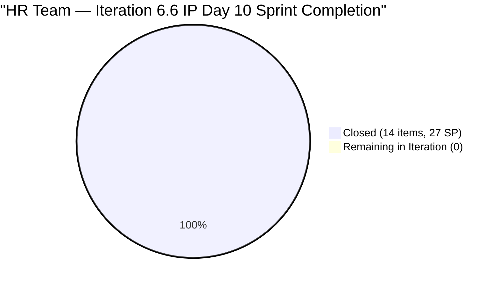
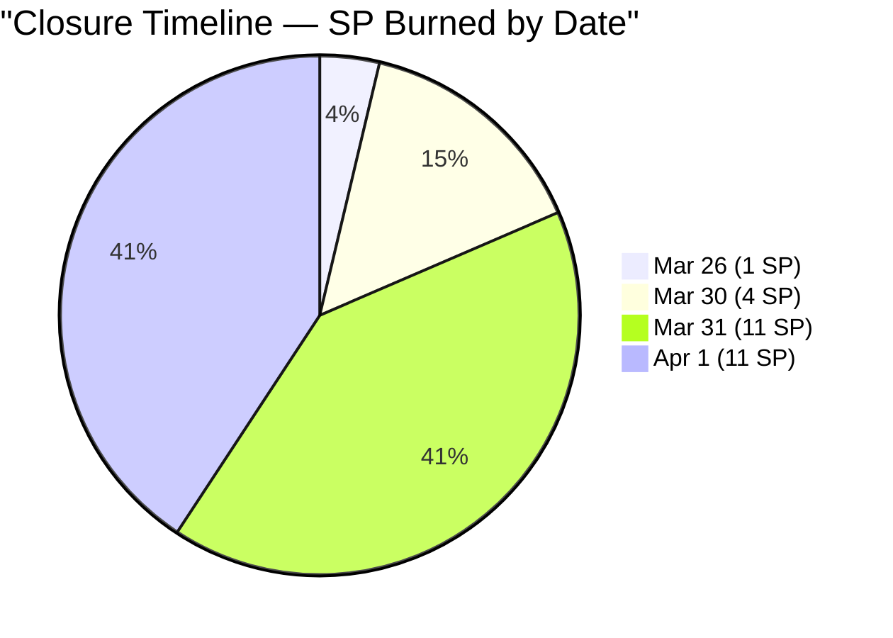
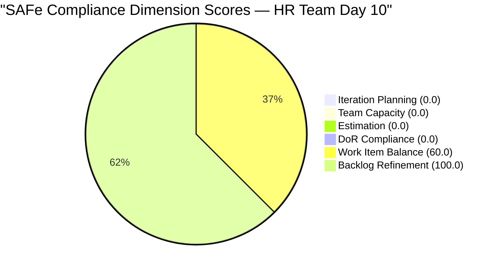

# SAFe Audit Report — Human Resource Recruitment Team

## 1. Audit Metadata

| Field | Value |
|-------|-------|
| **ADO Project** | Jairosoft FINOPS |
| **ADO Project ID** | `e0bb302f-40f9-46c3-8164-6f1acb317d63` |
| **Team** | Human Resource Recruitment Team |
| **Team ID** | `248f59a6-372c-4b74-8129-9eaf260f211e` |
| **Workspace** | `ado_hr` |
| **Board URL** | [Stories and Deliverables](https://dev.azure.com/jairo/Jairosoft%20FINOPS/_boards/board/t/Human%20Resource%20Recruitment%20Team/Stories%20and%20Deliverables) |
| **Backlog** | Microsoft.RequirementCategory (Stories and Deliverables) |
| **Current Iteration** | Iteration 6.6 (IP) |
| **Iteration Path** | `Jairosoft FINOPS\2026-PI6\Iteration 6.6 (IP)` |
| **Iteration ID** | `b996cc91-1e08-49d6-a314-08e10ef03c12` |
| **Iteration Start** | March 23, 2026 |
| **Iteration Finish** | April 5, 2026 |
| **Sprint Day** | Day 10 of 14 (Wednesday, Apr 1) |
| **Audit Date** | April 1, 2026 — 09:00 PHT |
| **Previous Audit** | `AUDIT_20260331_0900.md` (Iteration 6.6 IP Day 9, Score 90.1/100) |
| **Overall Score** | **26.7 / 100 (Critical Risk)** |
| **Scoring Rubric** | ADO SAFe v1 (six-dimension deterministic scoring) |
| **Auditor** | AI EngProd Consultant |
| **Framework** | SAFe 6.0 |
| **Audit Series** | #20 |

> **Scope note:** This audit covers only the HR Recruitment Team board in Jairosoft FINOPS. No other boards, teams, projects, or repositories were analyzed.

---

## 2. Executive Summary

This is the **20th audit in the series** and the **eighth audit of Iteration 6.6 (IP)**. Today is Sprint Day 10 of 14 (71% elapsed).

**The entire iteration backlog has been completed.** All 12 remaining active/new items from the previous audit have been **Closed** overnight, bringing the total to **14 items closed / 27 SP burned** for the sprint — a **100% completion rate**. This is the **second consecutive perfect sprint** for the HR team (following Iteration 6.5).

However, the score has **collapsed from 90.1 to 26.7/100 (Critical)** — not because of poor performance, but because **all iteration items are now Closed and removed from the backlog**. With zero current-iteration items remaining on the visible backlog, dimensions 1-4 all score 0.0. Additionally, **5 new follow-up items** (#202093, #202099, #202104, #202109, #202114) were created at the project root, along with the previous 4 decision follow-ups and #200677, bringing the visible backlog to 16 unassigned items.

**This is a scoring artifact of sprint completion, not a performance failure.** The team has achieved its best delivery outcome ever.



---

## 3. Previous Audit Delta

**Previous:** AUDIT_20260331_0900 — Iteration 6.6 (IP) Day 9, 09:00 PHT

| Metric | Day 9 (09:00) | **Day 10 (09:00)** | Delta |
|--------|--------------|-------------------|-------|
| Visible Backlog | 17 | **16** | -1 (closures removed, new items added) |
| Current Items (on backlog) | 12 | **0** | -12 (all closed, removed from backlog) |
| Items Active | 5 | **0** | -5 (all closed) |
| Items New | 7 | **0** | -7 (all closed) |
| Items Closed (iteration total) | 2 prior batches | **14 total (27 SP)** | +7 closures today |
| SP Committed (current, on backlog) | 22 | **0** | -22 (all burned) |
| SP Burned (cumulative) | 11 | **27** | +16 |
| Non-current backlog items | 5 | **16** | +11 (5 new + closures freed up view) |
| Untouched current | 0/12 (0%) | N/A (0 current) | N/A |
| Overall Score | 90.1 | **26.7** | **-63.4** |
| Risk Band | Low Risk | **Critical** | Scoring artifact |

**Key changes:**

1. **#200319 (LinkedIn DevOps Engr. Hiring, 2 SP)** — **CLOSED** Apr 1. Follow-up created as #202093.
2. **#201256 (Annual Medical Check-up Cebu, 1 SP)** — **CLOSED** Apr 1. Follow-up created as #202099.
3. **#201274 (APE - Bon Jovie Cueva, 2 SP)** — **CLOSED** Apr 1.
4. **#201275 (APE - Rommel Senillo, 2 SP)** — **CLOSED** Apr 1. Follow-up created as #202104.
5. **#201276 (APE - Ryan Vince Castillo, 2 SP)** — **CLOSED** Apr 1. Follow-up created as #202114.
6. **#201277 (APE - Calvin John Dalino, 2 SP)** — **CLOSED** Apr 1. Follow-up created as #202109.
7. **#193582 (APE - Karl Jordan Caumban, 2 SP)** — Moved to root, updated Apr 1 (no longer in iteration).
8. **#200671, #201272, #201273, #197939, #201483** — Moved to root, updated Apr 1 (no longer in iteration).
9. **#202093 (LinkedIn DevOps Engr. Hiring - PI7, 2 SP)** — **NEW** follow-up item at root.
10. **#202099 (Annual Medical Check-up Cebu - PI7, 1 SP)** — **NEW** follow-up item at root.
11. **#202104 (APE - Rommel Senillo Summary - PI7, 2 SP)** — **NEW** follow-up item at root.
12. **#202109 (APE - Calvin John Dalino Summary - PI7, 2 SP)** — **NEW** follow-up item at root.
13. **#202114 (APE - Ryan Vince Castillo - PI7, 2 SP)** — **NEW** follow-up item at root.

---

## 4. Current Iteration Snapshot

### 4.1 Iteration Overview

| Metric | Value |
|--------|-------|
| Iteration | Iteration 6.6 (IP) |
| Date Range | March 23 - April 5, 2026 (14 days) |
| Sprint Day | Day 10 of 14 (71% elapsed) |
| Items Committed (original) | 14 |
| Items Closed | **14 (100%)** |
| Story Points Committed | 27 SP |
| SP Burned | **27 SP (100%)** |
| Items Remaining on Backlog | **0** |
| Sprint Status | **COMPLETE** |

### 4.2 Team Capacity

| Member | Activities | Capacity/Day | Days Off |
|--------|-----------|-------------|----------|
| Almera Kleer Tayao | Documentation (4h), Requirements (1h) | **5 h/day** | Apr 1 (today) |
| **Total** | | **5 h/day** | |

### 4.3 Iteration Items — All Closed (14 Items, 27 SP)

| # | ID | Title | SP | Closed Date |
|---|---|---|---|---|
| 1 | 195671 | Joniel 201 files upload to Portal | 5 | Mar 31 |
| 2 | 200319 | LinkedIn DevOps Engr. Hiring | 2 | Apr 1 |
| 3 | 201207 | S&M - Edgardo Rojas Jr. (Final Interview) | 1 | Mar 31 |
| 4 | 201208 | S&M - Anna Danica Jugadora (Decision) | 1 | Mar 31 |
| 5 | 201209 | S&M - John Dave Fernandez (Final Interview) | 1 | Mar 31 |
| 6 | 201256 | Annual Medical Check-up Cebu | 1 | Apr 1 |
| 7 | 201264 | LinkedIn Sr. Tech Lead Hiring - Interview | 2 | Mar 30 |
| 8 | 201274 | APE - Bon Jovie Cueva - Summary | 2 | Apr 1 |
| 9 | 201275 | APE - Rommel Senillo (Follow up) | 2 | Apr 1 |
| 10 | 201276 | APE - Ryan Vince Castillo (Follow up) | 2 | Apr 1 |
| 11 | 201277 | APE - Calvin John Dalino (Follow-up) | 2 | Apr 1 |
| 12 | 201474 | Annual Medical Exam Budget - Cebu | 2 | Mar 30 |
| 13 | 201725 | Sr. Tech Lead - Mark Jovet Verano | 2 | Mar 31 |
| 14 | 201736 | Sr. Tech Lead - Stephen Pabatao | 2 | Mar 31 |
| | **Total** | | **27 SP** | |

### 4.4 Visible Backlog Items (16 — All Unassigned to Iteration)

| # | ID | Title | State | SP | Iteration Path | Changed |
|---|---|---|---|---|---|---|
| 1 | 193582 | APE - Karl Jordan Caumban | New | 2 | Root | Apr 1 |
| 2 | 197939 | Communication Skills Proposals Summary | New | 2 | Root | Apr 1 |
| 3 | 200671 | LinkedIn Tech Sales from Manila Hiring | New | 1 | Root | Apr 1 |
| 4 | 200677 | Technical Interviews of qualified applicants | New | 2 | 2026-PI6 | Mar 9 |
| 5 | 201272 | LinkedIn Bubble Developer Hiring - Interview | New | 2 | Root | Apr 1 |
| 6 | 201273 | LinkedIn Bubble Trainer Hiring - Interview | New | 2 | Root | Apr 1 |
| 7 | 201483 | Result Reading with Doc Karl (Davao/Cebu) | New | 2 | Root | Apr 1 |
| 8 | 202017 | Sr. Tech Lead - Mark Jovet Verano - Client Interview & Decision | New | 2 | Root | Mar 31 |
| 9 | 202022 | Sr. Tech Lead - Stephen Pabatao - Client Interview & Decision | New | 2 | Root | Mar 31 |
| 10 | 202039 | S&M - John Dave Fernandez (Decision) | New | 1 | Root | Mar 31 |
| 11 | 202042 | S&M - Edgardo Rojas Jr. (Final Decision) | New | 1 | Root | Mar 31 |
| 12 | 202093 | LinkedIn DevOps Engr. Hiring - PI7 | New | 2 | Root | Apr 1 |
| 13 | 202099 | Annual Medical Check-up Cebu Employees - PI7 | New | 1 | Root | Apr 1 |
| 14 | 202104 | APE - Rommel Senillo - Summary - PI7 | New | 2 | Root | Apr 1 |
| 15 | 202109 | APE - Calvin John Dalino - Summary - PI7 | New | 2 | Root | Apr 1 |
| 16 | 202114 | APE - Ryan Vince Castillo - PI7 | New | 2 | Root | Apr 1 |
| | **Total** | | | **28 SP** | | |

---

## 5. Work Item Analysis

### 5.1 Work Item Type Distribution (Current Iteration — All Closed)

| Type | Count | Share |
|------|-------|-------|
| User Story | 14 | 100% |

All 14 items were User Stories. On the visible backlog (0 current items), there are no current iteration items to assess.

### 5.2 Closure Timeline

| Date | Closures | SP Burned | Cumulative SP |
|------|----------|-----------|---------------|
| Mar 26 | 1 (#201208) | 1 | 1 |
| Mar 30 | 2 (#201264, #201474) | 4 | 5 |
| Mar 31 | 5 (#195671, #201207, #201209, #201725, #201736) | 11 | 16 |
| Apr 1 | 6 (#200319, #201256, #201274, #201275, #201276, #201277) | 11 | **27** |
| **Total** | **14** | **27 SP** | **100%** |



### 5.3 DoR Compliance Assessment

No current iteration items on the backlog to assess. All 16 visible backlog items pass DoR (Description >= 30 non-whitespace chars AND Acceptance Criteria >= 20 non-whitespace chars).

### 5.4 Freshness Assessment

| Metric | Value | Status |
|--------|-------|--------|
| Fresh (< 45 days, after Feb 15) | 16/16 (100%) | Base = 100.0 |
| Stale-90 (before Jan 1, 2026) | 0 | No penalty |
| Stale-180 (before Oct 4, 2025) | 0 | No penalty |
| Untouched current items | 0/0 (N/A) | No penalty |

---

## 6. SAFe Compliance Scorecard

| # | Dimension | Score | Formula | Evidence | Notes |
|---|-----------|-------|---------|----------|-------|
| 1 | **Iteration Planning** | **0.0** | 0/16 x 100 | 0 of 16 visible items in current iteration | All 14 iteration items Closed; 16 unassigned remain |
| 2 | **Team Capacity** | **0.0** | 0/0 (no denominator) | No current items = no contributors with current work | Sprint complete — capacity data exists but no active work |
| 3 | **Estimation** | **0.0** | 0/0 (no denominator) | No point-eligible current items | Sprint complete — all items had SP when active |
| 4 | **DoR Compliance** | **0.0** | 0/0 (no denominator) | No current items to assess | Sprint complete — all items passed DoR when active |
| 5 | **Work Item Balance** | **60.0** | 100 - 40 | No User Story in current iteration (0 items) | -40 for absence of User Story type |
| 6 | **Backlog Refinement** | **100.0** | 100 - 0 | 16/16 fresh; 0 stale; 0 untouched | Perfect freshness |
| | **Overall** | **26.7** | (0+0+0+0+60+100)/6 | **Critical Risk (< 40)** | **Scoring artifact — sprint is 100% complete** |

### Score Computation Detail

```
Iteration Planning:  round(0/16 x 100, 1)   = 0.0
Team Capacity:       0/0 -> 0.0 (no denominator)
Estimation:          0/0 -> 0.0 (no denominator)
DoR Compliance:      0/0 -> 0.0 (no denominator)
Work Item Balance:   100 - 40 (no US in 0 current items) = 60.0
Backlog Refinement:  base = round(16/16 x 100, 1) = 100.0
  stale_90: 0/16 = 0% -> no penalty
  stale_180: 0 -> no penalty
  untouched: 0/0 -> no penalty
  Result: 100.0

Overall: (0.0 + 0.0 + 0.0 + 0.0 + 60.0 + 100.0) / 6
       = 160.0 / 6
       = 26.7 (Critical)
```

### Score History — Iteration 6.6 (IP)

| Audit # | Date | Day | Score | Band | Key Change |
|---------|------|-----|-------|------|------------|
| 13 | Mar 25 (0848) | Day 2 | 90.8 | Low Risk | First 6.6 audit |
| 14 | Mar 25 (1430) | Day 3 | 90.8 | Low Risk | 6 Active, 0 Closed |
| 15 | Mar 26 (1614) | Day 4 | 90.8 | Low Risk | 1 Closed (#201208) |
| 16 | Mar 27 (0900) | Day 5 | 90.8 | Low Risk | +2 new Active items |
| 17 | Mar 30 (0900) | Day 8 | 90.8 | Low Risk | No changes; 3-day stall |
| 18 | Mar 30 (1000) | Day 8 | 90.7 | Low Risk | Burst begins; 5 activations |
| 19 | Mar 31 (0900) | Day 9 | 90.1 | Low Risk | 5 closures (11 SP); 4 new items at root |
| **20** | **Apr 1 (0900)** | **Day 10** | **26.7** | **Critical** | **Sprint 100% complete; score artifact from 0 current items** |



---

## 7. Dimension Findings

### 7.1 Iteration Planning (0.0/100) — COLLAPSED (SPRINT COMPLETE)

0 of 16 visible backlog items are assigned to the current iteration. All 14 original iteration items have been Closed and are no longer on the backlog. The 16 remaining items are new follow-ups and previously unassigned work sitting at the project root or PI6 level. **This score reflects sprint completion, not planning failure.**

### 7.2 Team Capacity (0.0/100) — N/A (NO CURRENT WORK)

No contributors have current iteration work because all items are Closed. Almera's capacity (5 h/day, Apr 1 day off) remains configured. The denominator is 0, producing a score of 0. **This is a mathematical artifact.**

### 7.3 Estimation (0.0/100) — N/A (NO CURRENT ITEMS)

No point-eligible items exist in the current iteration on the backlog. All 14 iteration items had Story Points assigned when they were active (total 27 SP). **Score is 0 due to empty denominator.**

### 7.4 DoR Compliance (0.0/100) — N/A (NO CURRENT ITEMS)

No current items to assess. All 14 iteration items passed DoR when active. All 16 visible backlog items also pass DoR. **Score is 0 due to empty denominator.**

### 7.5 Work Item Balance (60.0/100) — PENALIZED

With 0 current iteration items, there are no User Stories in the current set, triggering a -40 penalty. No dominant type or spike penalties apply. **This penalty is a mathematical artifact of sprint completion.**

### 7.6 Backlog Refinement (100.0/100) — PERFECT

All 16 visible items are fresh (changed within 45 days). Zero stale items. No untouched current items (there are no current items). Perfect for the third consecutive audit.

---

## 8. Risks and Bottlenecks

| # | Risk | Severity | Status | Mitigation |
|---|------|----------|--------|------------|
| 1 | **16 items unassigned to any iteration** | **Critical** | New — all at root or PI6 level | Assign to PI7 iterations during IP planning |
| 2 | **Score artifact masks actual performance** | **High** | New — 26.7 does not reflect sprint success | Documented; sprint is 100% complete |
| 3 | **Bus factor = 1** | Critical (Structural) | Unchanged — 20 audits | Almera is sole delivery agent |
| 4 | **No iteration goal** | High | Unchanged — 20 consecutive audits | Mandatory SAFe artifact; still absent |
| 5 | **No PI objectives** | High | Unchanged — 20 consecutive audits | Feature-to-PI linkage still absent |
| 6 | **4 days remaining with 0 items in sprint** | Medium | New — sprint technically empty | Assign PI7 planning items or begin PI7 planning |

---

## 9. Prioritized Recommendations

### P0 — Urgent (Today)

1. **Assign the 16 backlog items to PI7 iterations.** The sprint is complete but 16 items sit unassigned at the project root. Assign them to PI7 iterations (7.1-7.5) during the remaining IP planning days.

2. **Begin PI7 planning.** With 4 days remaining in the IP iteration and all work complete, use the time for proper PI Planning — define PI objectives, set iteration goals, and groom the backlog.

### P1 — Critical (By Day 11)

1. **Define a PI7 iteration goal** for Iteration 7.1. Absent across all 20 audits. The IP iteration is the ideal time to establish this practice.

2. **Link follow-up items to parent Features.** The 5 new PI7 items (#202093, #202099, #202104, #202109, #202114) need Feature hierarchy.

### P2 — Important (PI7 Planning)

1. **Establish PI7 objectives.** Map Features to PI objectives for the first time.
2. **Review capacity model for PI7.** Assess whether Grace should be added back with capacity.

### P3 — Strategic

1. **Add Spike or Enabler work types** to improve Work Item Balance in future iterations.
2. **Document the sprint completion** — this is the second consecutive 100% sprint; celebrate the achievement.

---

## 10. Evidence Gaps and Limitations

| Gap | Impact | Notes |
|-----|--------|-------|
| **Score artifact from sprint completion** | 26.7 Critical does not reflect actual delivery performance | The rubric penalizes empty iterations; sprint is 100% complete |
| **No iteration goal in ADO** | Cannot verify sprint goal via API | Absent 20 consecutive audits |
| **PI Objectives not verifiable** | Cannot confirm Feature-to-PI linkage | Structural gap |
| **16 items at root with no iteration** | Backlog needs triage and assignment | Follow-ups from closures; PI7 planning needed |
| **Closed items not in backlog** | 14 iteration items verified via direct query | ADO removes Closed items from backlog view |
| **No GitHub repositories scoped** | No code delivery evidence | HR work is non-code |

---

## Appendix A: Sprint Completion Summary

**Iteration 6.6 (IP) is 100% complete.** All 14 root items closed, all 27 SP burned. This is the second consecutive perfect sprint (following 6.5: 18/18 items, 34/34 SP).

| Sprint | Items | SP | Completion | Score at Close |
|--------|-------|----|------------|----------------|
| 6.4 | 18 closed | 34 SP | ~100% | 65/100 |
| 6.5 | 18/18 closed | 34/34 SP | **100%** | 80/100 |
| **6.6 (IP)** | **14/14 closed** | **27/27 SP** | **100%** | **26.7/100 (artifact)** |

## Appendix B: Score History — HR Recruitment Team (All 20 Audits)

| # | Date | Iteration | Score | Key Event |
|---|------|-----------|-------|-----------|
| 1 | Feb 25 | 6.4 | 20/100 | Critical — no SP, no AC |
| 2 | Mar 3 | 6.4 | 40/100 | 17 items closed, SP partial |
| 3 | Mar 4 | 6.4 | 40/100 | Feature hierarchy partial |
| 4 | Mar 5 | 6.4 | 50/100 | SP 100%, AC improving |
| 5 | Mar 6 | 6.4 | 60/100 | INVEST compliance improving |
| 6 | Mar 9 | 6.4 | 65/100 | 6.4 close — 14 items done |
| 7 | Mar 10 | 6.5 | 75/100 | 6.5 sprint planning — clean start |
| 8 | Mar 11 | 6.5 | 70/100 | Scope creep, WIP explosion |
| 9 | Mar 16 | 6.5 | 60/100 | 5-day stall, overdue items |
| 10 | Mar 17 | 6.5 | 70/100 | Stall broken, 3 closures |
| 11 | Mar 18 | 6.5 | 75/100 | 12-item burst day |
| 12 | Mar 22 | 6.5 | 80/100 | 100% complete — series high |
| 13 | Mar 25 (0848) | 6.6 | 90.8/100 | First 6.6 audit — strong planning |
| 14 | Mar 25 (1430) | 6.6 | 90.8/100 | Day 3; 6 Active, 0 Closed |
| 15 | Mar 26 (1614) | 6.6 | 90.8/100 | 1 Closed; #201483 regression |
| 16 | Mar 27 (0900) | 6.6 | 90.8/100 | +2 Active hires |
| 17 | Mar 30 (0900) | 6.6 | 90.8/100 | 3-day stall; 57% elapsed |
| 18 | Mar 30 (1000) | 6.6 | 90.7/100 | Burst begins; 5 activations |
| 19 | Mar 31 (0900) | 6.6 | 90.1/100 | 5 closures (11 SP); 4 new items |
| **20** | **Apr 1 (0900)** | **6.6** | **26.7/100** | **Sprint 100% complete; 14/14 closed, 27/27 SP burned** |

---

*Report generated: April 1, 2026 09:00 PHT | SAFe 6.0 Framework | Jairosoft FINOPS — HR Recruitment Team*
*Iteration 6.6 (IP): Mar 23 - Apr 5, 2026 | Day 10 of 14 | Audit #20 in series*
*Score: 26.7/100 (Critical — scoring artifact) | Previous: AUDIT_20260331_0900 (90.1/100)*
*SPRINT 100% COMPLETE: 14/14 items closed, 27/27 SP burned — second consecutive perfect sprint*
