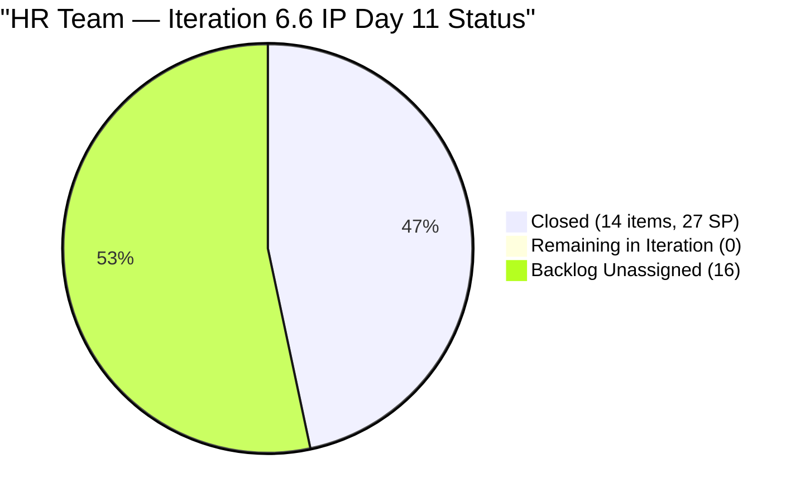
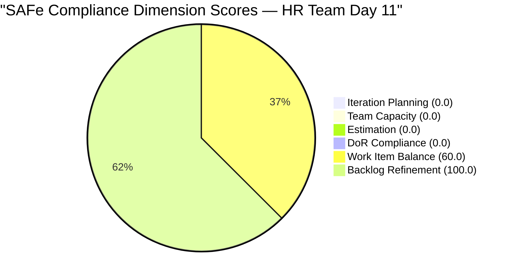

# SAFe Audit Report — Human Resource Recruitment Team

## 1. Audit Metadata

| Field | Value |
|-------|-------|
| **ADO Project** | Jairosoft FINOPS |
| **ADO Project ID** | `e0bb302f-40f9-46c3-8164-6f1acb317d63` |
| **Team** | Human Resource Recruitment Team |
| **Team ID** | `248f59a6-372c-4b74-8129-9eaf260f211e` |
| **Workspace** | `ado_hr` |
| **Board URL** | [Stories and Deliverables](https://dev.azure.com/jairo/Jairosoft%20FINOPS/_boards/board/t/Human%20Resource%20Recruitment%20Team/Stories%20and%20Deliverables) |
| **Backlog** | Microsoft.RequirementCategory (Stories and Deliverables) |
| **Current Iteration** | Iteration 6.6 (IP) |
| **Iteration Path** | `Jairosoft FINOPS\2026-PI6\Iteration 6.6 (IP)` |
| **Iteration ID** | `b996cc91-1e08-49d6-a314-08e10ef03c12` |
| **Iteration Start** | March 23, 2026 |
| **Iteration Finish** | April 5, 2026 |
| **Sprint Day** | Day 11 of 14 (Thursday, Apr 2) |
| **Audit Date** | April 2, 2026 — 09:00 PHT |
| **Previous Audit** | `AUDIT_20260401_0900.md` (Iteration 6.6 IP Day 10, Score 26.7/100) |
| **Overall Score** | **26.7 / 100 (Critical Risk)** |
| **Scoring Rubric** | ADO SAFe v1 (six-dimension deterministic scoring) |
| **Auditor** | AI EngProd Consultant |
| **Framework** | SAFe 6.0 |
| **Audit Series** | #21 |

> **Scope note:** This audit covers only the HR Recruitment Team board in Jairosoft FINOPS. No other boards, teams, projects, or repositories were analyzed.

---

## 2. Executive Summary

This is the **21st audit in the series** and the **ninth audit of Iteration 6.6 (IP)**. Today is Sprint Day 11 of 14 (79% elapsed).

**The sprint remains 100% complete with no changes since the previous audit.** All 14 iteration items (27 SP) were closed by April 1. The visible backlog holds the same **16 unassigned items** — none have been moved into the current iteration or any PI7 iteration. The score remains flat at **26.7/100 (Critical)**, which continues to be a **scoring artifact of sprint completion**, not a performance failure.

With only 3 working days remaining in the IP iteration, the window for PI7 planning is rapidly closing. The 16 backlog items remain at the project root or PI6 level with no iteration assignment, which is the primary actionable concern.



---

## 3. Previous Audit Delta

**Previous:** AUDIT_20260401_0900 — Iteration 6.6 (IP) Day 10, 09:00 PHT

| Metric | Day 10 (09:00) | **Day 11 (09:00)** | Delta |
|--------|--------------|-------------------|-------|
| Visible Backlog | 16 | **16** | 0 (no change) |
| Current Items (on backlog) | 0 | **0** | 0 |
| Items Closed (iteration total) | 14 (27 SP) | **14 (27 SP)** | 0 |
| Non-current backlog items | 16 | **16** | 0 |
| Overall Score | 26.7 | **26.7** | **0.0** |
| Risk Band | Critical | **Critical** | Stable (artifact) |

**Key changes:** None. The board is completely unchanged from the previous audit. No items were created, moved, updated, or closed in the last 24 hours.

---

## 4. Current Iteration Snapshot

### 4.1 Iteration Overview

| Metric | Value |
|--------|-------|
| Iteration | Iteration 6.6 (IP) |
| Date Range | March 23 - April 5, 2026 (14 days) |
| Sprint Day | Day 11 of 14 (79% elapsed) |
| Items Committed (original) | 14 |
| Items Closed | **14 (100%)** |
| Story Points Committed | 27 SP |
| SP Burned | **27 SP (100%)** |
| Items Remaining on Backlog | **0** |
| Sprint Status | **COMPLETE** |

### 4.2 Team Capacity

| Member | Activities | Capacity/Day | Days Off |
|--------|-----------|-------------|----------|
| Almera Kleer Tayao | Documentation (4h), Requirements (1h) | **5 h/day** | Apr 1 (past) |
| **Total** | | **5 h/day** | |

### 4.3 Visible Backlog Items (16 — All Unassigned to Iteration)

| # | ID | Title | State | Type | SP | Iteration Path | Changed |
|---|---|---|---|---|---|---|---|
| 1 | 193582 | APE - Caumban, Karl Jordan | New | User Story | 2 | Root | Apr 1 |
| 2 | 197939 | Communication Skills Proposals Summary | New | User Story | 2 | Root | Apr 1 |
| 3 | 200671 | LinkedIn Tech Sales from Manila Hiring | New | User Story | 1 | Root | Apr 1 |
| 4 | 200677 | Technical Interviews of qualified applicants | New | User Story | 2 | 2026-PI6 | Mar 9 |
| 5 | 201272 | LinkedIn Bubble Developer Hiring - Interview | New | User Story | 2 | Root | Apr 1 |
| 6 | 201273 | LinkedIn Bubble Trainer Hiring - Interview | New | User Story | 2 | Root | Apr 1 |
| 7 | 201483 | Result Reading with Doc Karl (Davao/Cebu) | New | User Story | 2 | Root | Apr 1 |
| 8 | 202017 | Sr. Tech Lead - Mark Jovet Verano - Client Interview & Decision | New | User Story | 2 | Root | Mar 31 |
| 9 | 202022 | Sr. Tech Lead - Stephen Pabatao - Client Interview & Decision | New | User Story | 2 | Root | Mar 31 |
| 10 | 202039 | S&M - John Dave Fernandez (Decision) | New | User Story | 1 | Root | Mar 31 |
| 11 | 202042 | S&M - Edgardo Rojas Jr. (Final Decision) | New | User Story | 1 | Root | Mar 31 |
| 12 | 202093 | LinkedIn DevOps Engr. Hiring - PI7 | New | User Story | 2 | Root | Apr 1 |
| 13 | 202099 | Annual Medical Check-up Cebu Employees - PI7 | New | User Story | 1 | Root | Apr 1 |
| 14 | 202104 | APE - Rommel Senillo - Summary - PI7 | New | User Story | 2 | Root | Apr 1 |
| 15 | 202109 | APE - Calvin John Dalino - Summary - PI7 | New | User Story | 2 | Root | Apr 1 |
| 16 | 202114 | APE - Ryan Vince Castillo - PI7 | New | User Story | 2 | Root | Apr 1 |
| | **Total** | | | | **28 SP** | | |

---

## 5. Work Item Analysis

### 5.1 Work Item Type Distribution (Current Iteration — Empty)

No items are assigned to the current iteration. All 16 visible backlog items are User Stories.

### 5.2 DoR Compliance Assessment

No current iteration items to assess. All 16 visible backlog items pass DoR (Description >= 30 non-whitespace chars AND Acceptance Criteria >= 20 non-whitespace chars).

### 5.3 Freshness Assessment

| Metric | Value | Status |
|--------|-------|--------|
| Fresh (< 45 days, after Feb 16) | 16/16 (100%) | Base = 100.0 |
| Stale-90 (before Jan 2, 2026) | 0 | No penalty |
| Stale-180 (before Oct 5, 2025) | 0 | No penalty |
| Untouched current items | 0/0 (N/A) | No penalty |

**Note:** #200677 (Mar 9) is the oldest item but still within the 45-day freshness window.

---

## 6. SAFe Compliance Scorecard

| # | Dimension | Score | Formula | Evidence | Notes |
|---|-----------|-------|---------|----------|-------|
| 1 | **Iteration Planning** | **0.0** | 0/16 x 100 | 0 of 16 visible items in current iteration | Sprint complete; 16 unassigned remain |
| 2 | **Team Capacity** | **0.0** | 0/0 (no denominator) | No current items = no contributors with current work | Sprint complete |
| 3 | **Estimation** | **0.0** | 0/0 (no denominator) | No point-eligible current items | Sprint complete |
| 4 | **DoR Compliance** | **0.0** | 0/0 (no denominator) | No current items to assess | Sprint complete |
| 5 | **Work Item Balance** | **60.0** | 100 - 40 | No User Story in current iteration (0 items) | -40 for absence of User Story type |
| 6 | **Backlog Refinement** | **100.0** | 100 - 0 | 16/16 fresh; 0 stale; 0 untouched | Perfect freshness |
| | **Overall** | **26.7** | (0+0+0+0+60+100)/6 | **Critical Risk (< 40)** | **Scoring artifact — sprint is 100% complete** |

### Score Computation Detail

```
Iteration Planning:  round(0/16 x 100, 1)   = 0.0
Team Capacity:       0/0 -> 0.0 (no denominator)
Estimation:          0/0 -> 0.0 (no denominator)
DoR Compliance:      0/0 -> 0.0 (no denominator)
Work Item Balance:   100 - 40 (no US in 0 current items) = 60.0
Backlog Refinement:  base = round(16/16 x 100, 1) = 100.0
  stale_90: 0/16 = 0% -> no penalty
  stale_180: 0 -> no penalty
  untouched: 0/0 -> no penalty
  Result: 100.0

Overall: (0.0 + 0.0 + 0.0 + 0.0 + 60.0 + 100.0) / 6
       = 160.0 / 6
       = 26.7 (Critical)
```

### Score History — Iteration 6.6 (IP)

| Audit # | Date | Day | Score | Band | Key Change |
|---------|------|-----|-------|------|------------|
| 13 | Mar 25 (0848) | Day 2 | 90.8 | Low Risk | First 6.6 audit |
| 14 | Mar 25 (1430) | Day 3 | 90.8 | Low Risk | 6 Active, 0 Closed |
| 15 | Mar 26 (1614) | Day 4 | 90.8 | Low Risk | 1 Closed (#201208) |
| 16 | Mar 27 (0900) | Day 5 | 90.8 | Low Risk | +2 new Active items |
| 17 | Mar 30 (0900) | Day 8 | 90.8 | Low Risk | No changes; 3-day stall |
| 18 | Mar 30 (1000) | Day 8 | 90.7 | Low Risk | Burst begins; 5 activations |
| 19 | Mar 31 (0900) | Day 9 | 90.1 | Low Risk | 5 closures (11 SP); 4 new items at root |
| 20 | Apr 1 (0900) | Day 10 | 26.7 | Critical | Sprint 100% complete; score artifact |
| **21** | **Apr 2 (0900)** | **Day 11** | **26.7** | **Critical** | **No changes; board frozen 24h** |



---

## 7. Dimension Findings

### 7.1 Iteration Planning (0.0/100) — UNCHANGED (SPRINT COMPLETE)

0 of 16 visible backlog items are assigned to the current iteration. Identical to Day 10. The 16 items remain at the project root or PI6 level with no iteration assignment. **This score reflects sprint completion, not planning failure.**

### 7.2 Team Capacity (0.0/100) — N/A (NO CURRENT WORK)

No contributors have current iteration work. Almera's capacity (5 h/day) remains configured. The denominator is 0, producing a score of 0. **Mathematical artifact.**

### 7.3 Estimation (0.0/100) — N/A (NO CURRENT ITEMS)

No point-eligible items exist in the current iteration. All 16 backlog items have Story Points assigned (range 1-2 SP). **Score is 0 due to empty denominator.**

### 7.4 DoR Compliance (0.0/100) — N/A (NO CURRENT ITEMS)

No current items to assess. All 16 visible backlog items pass DoR. **Score is 0 due to empty denominator.**

### 7.5 Work Item Balance (60.0/100) — PENALIZED

With 0 current iteration items, there are no User Stories in the current set, triggering a -40 penalty. **Mathematical artifact of sprint completion.**

### 7.6 Backlog Refinement (100.0/100) — PERFECT

All 16 visible items are fresh (changed within 45 days). Zero stale items. Perfect for the fourth consecutive audit. **Note:** #200677 (changed Mar 9) is approaching the freshness boundary in ~2 weeks.

---

## 8. Risks and Bottlenecks

| # | Risk | Severity | Status | Mitigation |
|---|------|----------|--------|------------|
| 1 | **16 items unassigned — now 24h stale** | **Critical** | Worsened — no action since Day 10 | Assign to PI7 iterations TODAY; 3 days left in IP |
| 2 | **PI7 planning window closing** | **Critical** | New — only 3 working days remain | Begin PI7 planning immediately |
| 3 | **Board frozen 24h** | **High** | New — zero activity since Apr 1 | Almera may be on leave (Apr 1 day off extended?) |
| 4 | **Score artifact masks performance** | **High** | Unchanged — 26.7 does not reflect success | Documented; sprint is 100% complete |
| 5 | **Bus factor = 1** | Critical (Structural) | Unchanged — 21 audits | Almera is sole delivery agent |
| 6 | **No iteration goal** | High | Unchanged — 21 consecutive audits | Mandatory SAFe artifact; still absent |
| 7 | **No PI objectives** | High | Unchanged — 21 consecutive audits | Feature-to-PI linkage still absent |

---

## 9. Prioritized Recommendations

### P0 — Urgent (Today)

1. **Assign the 16 backlog items to PI7 iterations immediately.** The IP iteration ends in 3 days. 5 items are explicitly tagged "PI7" in their titles (#202093, #202099, #202104, #202109, #202114) and should be the first to move. The remaining 11 items need triage.

2. **Verify Almera's availability.** The board has been frozen for 24 hours. If Almera's Apr 1 day off extended, PI7 planning is further at risk.

### P1 — Critical (By Day 12)

1. **Define a PI7 iteration goal** for Iteration 7.1. Absent across all 21 audits. The IP iteration is the ideal time to establish this practice.

2. **Link follow-up items to parent Features.** The 5 PI7 items (#202093, #202099, #202104, #202109, #202114) and 4 decision items (#202017, #202022, #202039, #202042) need Feature hierarchy.

### P2 — Important (PI7 Planning)

1. **Establish PI7 objectives.** Map Features to PI objectives for the first time.
2. **Review capacity model for PI7.** Assess whether Grace should be added back with capacity.

### P3 — Strategic

1. **Add Spike or Enabler work types** to improve Work Item Balance in future iterations.
2. **Celebrate the achievement** — third consecutive perfect sprint delivery.

---

## 10. Evidence Gaps and Limitations

| Gap | Impact | Notes |
|-----|--------|-------|
| **Score artifact from sprint completion** | 26.7 Critical does not reflect actual delivery performance | Rubric penalizes empty iterations; sprint is 100% complete |
| **No iteration goal in ADO** | Cannot verify sprint goal via API | Absent 21 consecutive audits |
| **PI Objectives not verifiable** | Cannot confirm Feature-to-PI linkage | Structural gap |
| **16 items at root with no iteration** | Backlog needs triage and assignment | Follow-ups from closures; PI7 planning needed |
| **Closed items not in backlog** | 14 iteration items verified via prior audit | ADO removes Closed items from backlog view |
| **No GitHub repositories scoped** | No code delivery evidence | HR work is non-code |
| **24h board freeze** | Cannot determine if Almera is available | No activity detected since Apr 1 |

---

## Appendix A: Sprint Completion Summary

**Iteration 6.6 (IP) is 100% complete.** All 14 root items closed, all 27 SP burned. This is the **third consecutive perfect sprint** (6.4: ~100%, 6.5: 100%, 6.6: 100%).

| Sprint | Items | SP | Completion | Score at Close |
|--------|-------|----|------------|----------------|
| 6.4 | 18 closed | 34 SP | ~100% | 65/100 |
| 6.5 | 18/18 closed | 34/34 SP | **100%** | 80/100 |
| **6.6 (IP)** | **14/14 closed** | **27/27 SP** | **100%** | **26.7/100 (artifact)** |

## Appendix B: Score History — HR Recruitment Team (All 21 Audits)

| # | Date | Iteration | Score | Key Event |
|---|------|-----------|-------|-----------|
| 1 | Feb 25 | 6.4 | 20/100 | Critical — no SP, no AC |
| 2 | Mar 3 | 6.4 | 40/100 | 17 items closed, SP partial |
| 3 | Mar 4 | 6.4 | 40/100 | Feature hierarchy partial |
| 4 | Mar 5 | 6.4 | 50/100 | SP 100%, AC improving |
| 5 | Mar 6 | 6.4 | 60/100 | INVEST compliance improving |
| 6 | Mar 9 | 6.4 | 65/100 | 6.4 close — 14 items done |
| 7 | Mar 10 | 6.5 | 75/100 | 6.5 sprint planning — clean start |
| 8 | Mar 11 | 6.5 | 70/100 | Scope creep, WIP explosion |
| 9 | Mar 16 | 6.5 | 60/100 | 5-day stall, overdue items |
| 10 | Mar 17 | 6.5 | 70/100 | Stall broken, 3 closures |
| 11 | Mar 18 | 6.5 | 75/100 | 12-item burst day |
| 12 | Mar 22 | 6.5 | 80/100 | 100% complete — series high |
| 13 | Mar 25 (0848) | 6.6 | 90.8/100 | First 6.6 audit — strong planning |
| 14 | Mar 25 (1430) | 6.6 | 90.8/100 | Day 3; 6 Active, 0 Closed |
| 15 | Mar 26 (1614) | 6.6 | 90.8/100 | 1 Closed; #201483 regression |
| 16 | Mar 27 (0900) | 6.6 | 90.8/100 | +2 Active hires |
| 17 | Mar 30 (0900) | 6.6 | 90.8/100 | 3-day stall; 57% elapsed |
| 18 | Mar 30 (1000) | 6.6 | 90.7/100 | Burst begins; 5 activations |
| 19 | Mar 31 (0900) | 6.6 | 90.1/100 | 5 closures (11 SP); 4 new items |
| 20 | Apr 1 (0900) | 6.6 | 26.7/100 | Sprint 100% complete; 14/14 closed |
| **21** | **Apr 2 (0900)** | **6.6** | **26.7/100** | **No changes; board frozen 24h** |

---

*Report generated: April 2, 2026 09:00 PHT | SAFe 6.0 Framework | Jairosoft FINOPS — HR Recruitment Team*
*Iteration 6.6 (IP): Mar 23 - Apr 5, 2026 | Day 11 of 14 | Audit #21 in series*
*Score: 26.7/100 (Critical — scoring artifact) | Previous: AUDIT_20260401_0900 (26.7/100)*
*SPRINT 100% COMPLETE: 14/14 items closed, 27/27 SP burned — third consecutive perfect sprint*
*Board frozen 24h — no activity since April 1*
