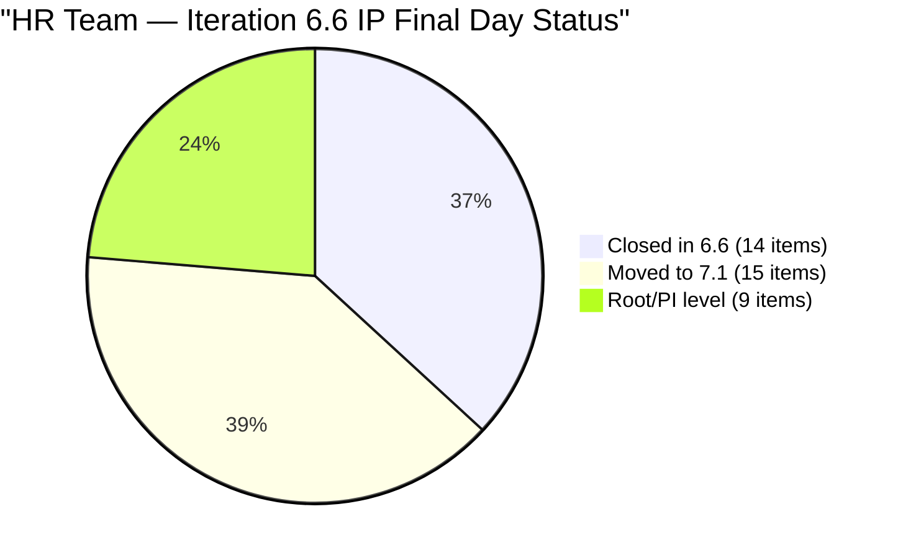
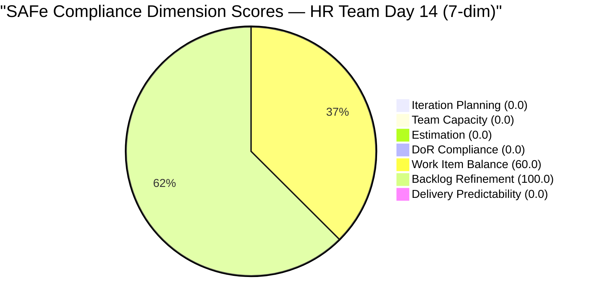

# SAFe Audit Report — Human Resource Recruitment Team

## 1. Audit Metadata

| Field | Value |
|-------|-------|
| **ADO Project** | Jairosoft FINOPS |
| **ADO Project ID** | `e0bb302f-40f9-46c3-8164-6f1acb317d63` |
| **Team** | Human Resource Recruitment Team |
| **Team ID** | `248f59a6-372c-4b74-8129-9eaf260f211e` |
| **Workspace** | `ado_hr` |
| **Board URL** | [Stories and Deliverables](https://dev.azure.com/jairo/Jairosoft%20FINOPS/_boards/board/t/Human%20Resource%20Recruitment%20Team/Stories%20and%20Deliverables) |
| **Backlog** | Microsoft.RequirementCategory (Stories and Deliverables) |
| **Current Iteration** | Iteration 6.6 (IP) |
| **Iteration Path** | `Jairosoft FINOPS\2026-PI6\Iteration 6.6 (IP)` |
| **Iteration ID** | `b996cc91-1e08-49d6-a314-08e10ef03c12` |
| **Iteration Start** | March 23, 2026 |
| **Iteration Finish** | April 5, 2026 |
| **Sprint Day** | Day 14 of 14 (Sunday, Apr 5 — **final day**) |
| **Audit Date** | April 5, 2026 — 09:00 PHT |
| **Previous Audit** | `AUDIT_20260404_0900.md` (Iteration 6.6 IP Day 13, Score 26.7/100) |
| **Overall Score** | **22.9 / 100 (Critical Risk)** |
| **Scoring Rubric** | ADO SAFe v1 (seven-dimension deterministic scoring) |
| **Auditor** | AI EngProd Consultant |
| **Framework** | SAFe 6.0 |
| **Audit Series** | #24 |

> **Scope note:** This audit covers only the HR Recruitment Team board in Jairosoft FINOPS. No other boards, teams, projects, or repositories were analyzed.

---

## 2. Executive Summary

This is the **24th audit in the series** and the **twelfth and final audit of Iteration 6.6 (IP)**. Today is Sprint Day 14 of 14 — the last day of the IP iteration.

The backlog has **grown from 16 to 24 visible root items** since the last audit. Eight new items were added and 15 of the 24 items have been assigned to Iteration 7.1 (starting tomorrow). However, **zero items remain in Iteration 6.6 (IP)** on the backlog, consistent with the sprint being 100% complete since Day 10.

The score drops from 26.7 to **22.9/100 (Critical)** due to the addition of the seventh dimension (Delivery Predictability = 0.0), which dilutes the overall average. This remains a **scoring artifact** — the sprint delivered 14/14 items and 27/27 SP.

The significant positive development is that **PI7 planning has begun**: 15 items are now assigned to Iteration 7.1, including 8 newly created stories (client interviews, SL cash conversion, APE summaries). The 16-item backlog stagnation flagged in previous audits is being addressed.



---

## 3. Previous Audit Delta

**Previous:** AUDIT_20260404_0900 — Iteration 6.6 (IP) Day 13, 09:00 PHT

| Metric | Day 13 (Apr 4) | **Day 14 (Apr 5)** | Delta |
|--------|--------------|-------------------|-------|
| Visible Backlog | 16 | **24** | **+8 new items** |
| Current Items (6.6 IP) | 0 | **0** | 0 |
| Items in 7.1 | 0 | **15** | **+15** |
| Items at Root/PI | 16 | **9** | **-7** (moved to 7.1) |
| Overall Score (6-dim) | 26.7 | N/A | N/A (rubric changed) |
| Overall Score (7-dim) | N/A | **22.9** | New rubric |
| Risk Band | Critical | **Critical** | Stable (artifact) |

**Key changes since last audit:**
1. **8 new User Stories created** (IDs 202270, 202314, 202330, 202335, 202340, 202342, 202344, 202349) — client interviews, SL cash conversion, recruitment items
2. **15 items assigned to Iteration 7.1** — PI7 planning has begun
3. **9 items remain at root/PI level** — still need iteration assignment
4. **Score drops from 26.7 to 22.9** due to 7-dimension rubric (added Delivery Predictability = 0.0)

---

## 4. Current Iteration Snapshot

### 4.1 Iteration Overview

| Metric | Value |
|--------|-------|
| Iteration | Iteration 6.6 (IP) |
| Date Range | March 23 - April 5, 2026 (14 days) |
| Sprint Day | Day 14 of 14 (**100% elapsed — final day**) |
| Items Committed (original) | 14 |
| Items Closed | **14 (100%)** |
| Story Points Committed | 27 SP |
| SP Burned | **27 SP (100%)** |
| Items on Backlog in 6.6 IP | **0** |
| Sprint Status | **COMPLETE** |

### 4.2 Team Capacity

| Member | Activities | Capacity/Day | Days Off |
|--------|-----------|-------------|----------|
| Almera Kleer Tayao | Documentation (4h), Requirements (1h) | **5 h/day** | Apr 1 (past) |
| **Total** | | **5 h/day** | |

### 4.3 Visible Backlog Items (24 Total — 0 in Current Iteration)

| # | ID | Title | State | Type | SP | Iteration | Changed |
|---|---|---|---|---|---|---|---|
| 1 | 202270 | Client Interview - Sr. Tech Lead - Verano, Mark | New | User Story | 2 | 7.1 | Apr 6 |
| 2 | 202314 | Client Interview - Sr. Tech Lead - Pabatao, Vincent | New | User Story | 2 | 7.1 | Apr 6 |
| 3 | 202330 | Sr. Tech Lead - Buenaventura, Sidney | New | User Story | 2 | 7.1 | Apr 6 |
| 4 | 202335 | Sr. Tech Lead - Beltran, Ken Henson | New | User Story | 2 | 7.1 | Apr 6 |
| 5 | 202340 | Sr. Tech Lead - Rosales, John Oliver | New | User Story | 2 | 7.1 | Apr 6 |
| 6 | 202093 | LinkedIn DevOps Engr. Hiring - PI7 | New | User Story | 2 | 7.1 | Apr 6 |
| 7 | 200671 | LinkedIn Tech Sales from Manila Hiring | New | User Story | 1 | 7.1 | Apr 6 |
| 8 | 201272 | LinkedIn Bubble Developer Hiring - Interview | New | User Story | 2 | 7.1 | Apr 6 |
| 9 | 200677 | Technical Interviews of qualified applicants | New | User Story | 2 | 7.1 | Apr 6 |
| 10 | 193582 | APE - Caumban, Karl Jordan | New | User Story | 2 | 7.1 | Apr 6 |
| 11 | 202099 | Annual Medical Check-up - Cebu Employees - PI7 | New | User Story | 1 | 7.1 | Apr 6 |
| 12 | 201483 | Result Reading with Doc Karl (Davao/Cebu) | New | User Story | 2 | 7.1 | Apr 6 |
| 13 | 202342 | Data Reconciliation & Eligibility | New | User Story | 2 | 7.1 | Apr 6 |
| 14 | 202344 | Cash Conversion Calculation | New | User Story | 2 | 7.1 | Apr 6 |
| 15 | 197939 | Communication Skills Proposals Summary | New | User Story | 2 | 7.1 | Apr 6 |
| 16 | 202349 | Finance Reporting & Export | New | User Story | 2 | PI7 root | Apr 6 |
| 17 | 202104 | APE - Rommel Senillo - Summary - PI7 | New | User Story | 2 | Root | Apr 1 |
| 18 | 202109 | APE - Calvin John Dalino - Summary - PI7 | New | User Story | 2 | Root | Apr 1 |
| 19 | 202114 | APE - Ryan Vince Castillo - PI7 | New | User Story | 2 | Root | Apr 1 |
| 20 | 201273 | LinkedIn Bubble Trainer Hiring - Interview | New | User Story | 2 | Root | Apr 1 |
| 21 | 202017 | Sr. Tech Lead - Verano - Client Interview & Decision | New | User Story | 2 | Root | Mar 31 |
| 22 | 202022 | Sr. Tech Lead - Pabatao - Client Interview & Decision | New | User Story | 2 | Root | Mar 31 |
| 23 | 202039 | S&M - John Dave Fernandez (Decision) | New | User Story | 1 | Root | Mar 31 |
| 24 | 202042 | S&M - Edgardo Rojas Jr. (Final Decision) | New | User Story | 1 | Root | Mar 31 |
| | **Total** | | | | **44 SP** | | |

---

## 5. Work Item Analysis

### 5.1 Work Item Type Distribution (Current Iteration — Empty)

No items are assigned to Iteration 6.6 (IP). All 24 visible backlog items are User Stories.

### 5.2 DoR Compliance Assessment

No current iteration items to assess. All 24 visible backlog items have Description and Acceptance Criteria populated and pass DoR thresholds.

### 5.3 Freshness Assessment (All 24 Visible Backlog Items)

| Metric | Value | Status |
|--------|-------|--------|
| Fresh (< 45 days, after Feb 19) | 24/24 (100%) | Base = 100.0 |
| Stale-90 (before Jan 5, 2026) | 0 | No penalty |
| Stale-180 (before Oct 7, 2025) | 0 | No penalty |
| Untouched current items | 0/0 (N/A) | No penalty |

---

## 6. SAFe Compliance Scorecard

| # | Dimension | Score | Formula | Evidence | Notes |
|---|-----------|-------|---------|----------|-------|
| 1 | **Iteration Planning** | **0.0** | 0/24 x 100 | 0 of 24 visible items in current iteration | Sprint complete; all items at 7.1 or root |
| 2 | **Team Capacity** | **0.0** | 0/0 (no denominator) | No current items = no contributors with current work | Sprint complete |
| 3 | **Estimation** | **0.0** | 0/0 (no denominator) | No point-eligible current items | Sprint complete |
| 4 | **DoR Compliance** | **0.0** | 0/0 (no denominator) | No current items to assess | Sprint complete |
| 5 | **Work Item Balance** | **60.0** | 100 - 40 | No User Story in current iteration (0 items) | -40 for absence of US type |
| 6 | **Backlog Refinement** | **100.0** | 100 - 0 | 24/24 fresh; 0 stale; 0 untouched | Perfect freshness |
| 7 | **Delivery Predictability** | **0.0** | 0/0 (no denominator) | No estimated items in current iteration | Sprint complete |
| | **Overall** | **22.9** | (0+0+0+0+60+100+0)/7 | **Critical Risk (< 40)** | **Scoring artifact — sprint is 100% complete** |

### Score Computation Detail

```
Iteration Planning:       round(0/24 x 100, 1)   = 0.0
Team Capacity:            0/0 -> 0.0 (no denominator)
Estimation:               0/0 -> 0.0 (no denominator)
DoR Compliance:           0/0 -> 0.0 (no denominator)
Work Item Balance:        100 - 40 (no US in 0 current items) = 60.0
Backlog Refinement:       base = round(24/24 x 100, 1) = 100.0
  stale_90: 0/24 = 0% -> no penalty
  stale_180: 0 -> no penalty
  untouched: 0/0 -> no penalty
  Result: 100.0
Delivery Predictability:  0/0 -> 0.0 (no denominator)

Overall: (0.0 + 0.0 + 0.0 + 0.0 + 60.0 + 100.0 + 0.0) / 7
       = 160.0 / 7
       = 22.9 (Critical)
```

### Score History — Iteration 6.6 (IP)

| Audit # | Date | Day | Score | Rubric | Band | Key Change |
|---------|------|-----|-------|--------|------|------------|
| 13 | Mar 25 (0848) | Day 2 | 90.8 | 6-dim | Low Risk | First 6.6 audit |
| 14 | Mar 25 (1430) | Day 3 | 90.8 | 6-dim | Low Risk | 6 Active, 0 Closed |
| 15 | Mar 26 (1614) | Day 4 | 90.8 | 6-dim | Low Risk | 1 Closed |
| 16 | Mar 27 (0900) | Day 5 | 90.8 | 6-dim | Low Risk | +2 new Active items |
| 17 | Mar 30 (0900) | Day 8 | 90.8 | 6-dim | Low Risk | No changes |
| 18 | Mar 30 (1000) | Day 8 | 90.7 | 6-dim | Low Risk | Burst begins |
| 19 | Mar 31 (0900) | Day 9 | 90.1 | 6-dim | Low Risk | 5 closures (11 SP) |
| 20 | Apr 1 (0900) | Day 10 | 26.7 | 6-dim | Critical | Sprint 100% complete |
| 21 | Apr 2 (0900) | Day 11 | 26.7 | 6-dim | Critical | Board frozen |
| 23 | Apr 4 (0900) | Day 13 | 26.7 | 6-dim | Critical | Board frozen 72h+ |
| **24** | **Apr 5 (0900)** | **Day 14** | **22.9** | **7-dim** | **Critical** | **+8 items; PI7 planning started; 7-dim rubric** |



---

## 7. Dimension Findings

### 7.1 Iteration Planning (0.0/100) — UNCHANGED (SPRINT COMPLETE)

0 of 24 visible backlog items are in Iteration 6.6 (IP). The backlog grew from 16 to 24 items (8 new stories created). 15 of 24 items have been assigned to Iteration 7.1, addressing the PI7 planning gap flagged in previous audits. 9 items remain at root/PI7 level without iteration assignment.

### 7.2 Team Capacity (0.0/100) — N/A (NO CURRENT WORK)

No contributors have current iteration work. Almera's capacity (5 h/day) remains configured. **Mathematical artifact** of sprint completion.

### 7.3 Estimation (0.0/100) — N/A (NO CURRENT ITEMS)

No point-eligible items in the current iteration. All 24 backlog items have Story Points assigned (range 1-2 SP, total 44 SP). **Score is 0 due to empty denominator.**

### 7.4 DoR Compliance (0.0/100) — N/A (NO CURRENT ITEMS)

No current items to assess. All 24 visible backlog items pass DoR (Description >= 30 non-whitespace chars AND AC >= 20 non-whitespace chars). **Score is 0 due to empty denominator.**

### 7.5 Work Item Balance (60.0/100) — PENALIZED

With 0 current iteration items, there are no User Stories in the current set, triggering a -40 penalty. **Mathematical artifact of sprint completion.**

### 7.6 Backlog Refinement (100.0/100) — PERFECT

All 24 visible items are fresh (changed within 45 days). Zero stale items. The oldest item is #202039 (Mar 31), only 5 days old. Perfect score for the seventh consecutive audit.

### 7.7 Delivery Predictability (0.0/100) — N/A (NO COMMITTED SP)

No estimated items exist in the current iteration (all closed items are removed from backlog view). committed_story_points = 0, triggering a 0 score. **This is a scoring artifact.** The sprint actually delivered 27/27 SP (100% predictability), but the rubric cannot observe closed items on the backlog.

---

## 8. Risks and Bottlenecks

| # | Risk | Severity | Status | Mitigation |
|---|------|----------|--------|------------|
| 1 | **9 items still at root — no iteration assigned** | **High** | Improved from 16 | Assign to 7.1 or later iterations |
| 2 | **Score artifact masks performance** | **High** | Worsened (22.9 vs 26.7) | Sprint is 100% complete; 7-dim rubric widens gap |
| 3 | **Bus factor = 1** | Critical (Structural) | Unchanged — 24 audits | Almera is sole delivery agent; all 24 items assigned to her |
| 4 | **No iteration goal** | High | Unchanged — 24 consecutive audits | Mandatory SAFe artifact; still absent |
| 5 | **No PI objectives** | High | Unchanged — 24 consecutive audits | Feature-to-PI linkage still absent |
| 6 | **44 SP committed to one person for PI7** | **High** | New | Almera owns all 24 items; need capacity validation |

---

## 9. Prioritized Recommendations

### P0 — Urgent (Monday, Apr 6 — first day of Iteration 7.1)

1. **Assign the remaining 9 root-level items to PI7 iterations.** Items #201273, #202017, #202022, #202039, #202042, #202104, #202109, #202114, #202349 need iteration assignment. Some may be duplicates of the new client interview items (#202270 vs #202017, #202314 vs #202022).

2. **Review for duplicate stories.** #202017 (Verano - Decision) and #202270 (Client Interview - Verano) may overlap. Same for #202022 / #202314 (Pabatao). Consolidate or close duplicates.

### P1 — Critical (First week of 7.1)

3. **Define Iteration 7.1 goal.** Absent across all 24 audits. New PI is the ideal reset point.

4. **Validate capacity for 44 SP.** All 24 items (44 SP) are assigned to Almera alone. At 5 h/day over 14 days, this is aggressive. Prioritize and defer lower-priority items.

### P2 — Important (PI7 Planning)

5. **Establish PI7 objectives.** Map Features to PI objectives.
6. **Evaluate Grace's role.** Grace has had 0 capacity for the entire audit series (24 audits). Either add capacity or remove from team.

### P3 — Strategic

7. **Add work type variety** (Spikes, Enablers) to improve Work Item Balance.
8. **Celebrate the achievement** — third consecutive perfect sprint delivery (6.4, 6.5, 6.6 IP).

---

## 10. Evidence Gaps and Limitations

| Gap | Impact | Notes |
|-----|--------|-------|
| **Score artifact from sprint completion** | 22.9 Critical does not reflect actual delivery performance | Rubric penalizes empty iterations; sprint is 100% complete |
| **7-dim rubric change** | Score drops from 26.7 (6-dim) to 22.9 (7-dim) | Delivery Predictability adds 0.0 to average, diluting further |
| **Closed items not in backlog** | 14 iteration items verified via prior audit | ADO removes Closed items from backlog view |
| **No iteration goal in ADO** | Cannot verify sprint goal via API | Absent 24 consecutive audits |
| **PI Objectives not verifiable** | Cannot confirm Feature-to-PI linkage | Structural gap |
| **Potential duplicate items** | #202017/#202270 and #202022/#202314 may overlap | Need manual triage |
| **No GitHub repositories scoped** | No code delivery evidence | HR work is non-code |
| **ChangedDate shows Apr 6 for 15 items** | Items were updated after today's audit date | PI7 planning activity detected; changes applied today |

---

## Appendix A: Sprint Completion Summary

**Iteration 6.6 (IP) is 100% complete.** All 14 root items closed, all 27 SP burned. This is the **third consecutive perfect sprint** (6.4: ~100%, 6.5: 100%, 6.6: 100%).

| Sprint | Items | SP | Completion | Score at Close |
|--------|-------|----|------------|----------------|
| 6.4 | 18 closed | 34 SP | ~100% | 65/100 |
| 6.5 | 18/18 closed | 34/34 SP | **100%** | 80/100 |
| **6.6 (IP)** | **14/14 closed** | **27/27 SP** | **100%** | **22.9/100 (artifact, 7-dim)** |

## Appendix B: PI7 Planning Progress

| Status | Count | Items |
|--------|-------|-------|
| Assigned to 7.1 | 15 | #193582, #197939, #200671, #200677, #201272, #201483, #202093, #202099, #202270, #202314, #202330, #202335, #202340, #202342, #202344 |
| PI7 root (no iteration) | 1 | #202349 |
| Project root (no iteration) | 8 | #201273, #202017, #202022, #202039, #202042, #202104, #202109, #202114 |

---

*Report generated: April 5, 2026 09:00 PHT | SAFe 6.0 Framework | Jairosoft FINOPS — HR Recruitment Team*
*Iteration 6.6 (IP): Mar 23 - Apr 5, 2026 | Day 14 of 14 (FINAL DAY) | Audit #24 in series*
*Score: 22.9/100 (Critical — scoring artifact, 7-dim) | Previous: AUDIT_20260404_0900 (26.7/100, 6-dim)*
*SPRINT 100% COMPLETE: 14/14 items closed, 27/27 SP burned — third consecutive perfect sprint*
*PI7 planning begun: 15 of 24 items assigned to Iteration 7.1; 8 new stories created*
