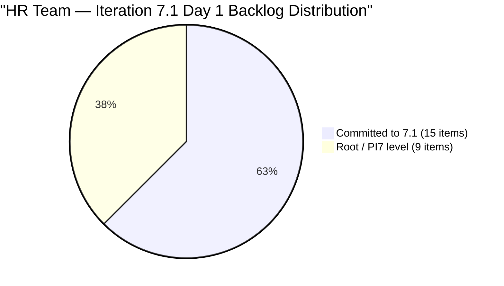

# SAFe Audit Report — Human Resource Recruitment Team

## 1. Audit Metadata

| Field | Value |
|-------|-------|
| **ADO Project** | Jairosoft FINOPS |
| **ADO Project ID** | `e0bb302f-40f9-46c3-8164-6f1acb317d63` |
| **Team** | Human Resource Recruitment Team |
| **Team ID** | `248f59a6-372c-4b74-8129-9eaf260f211e` |
| **Workspace** | `ado_hr` |
| **Board URL** | [Stories and Deliverables](https://dev.azure.com/jairo/Jairosoft%20FINOPS/_boards/board/t/Human%20Resource%20Recruitment%20Team/Stories%20and%20Deliverables) |
| **Backlog** | Microsoft.RequirementCategory (Stories and Deliverables) |
| **Current Iteration** | Iteration 7.1 |
| **Iteration Path** | `Jairosoft FINOPS\2026-PI7\Iteration 7.1` |
| **Iteration ID** | `82cc2229-0211-4fe2-9ee6-cc8d843dfab0` |
| **Iteration Start** | April 6, 2026 |
| **Iteration Finish** | April 19, 2026 |
| **Sprint Day** | Day 1 of 14 (Monday, Apr 6 — **first day**) |
| **Audit Date** | April 6, 2026 — 09:00 PHT |
| **Previous Audit** | `AUDIT_20260405_0900.md` (Iteration 6.6 IP Day 14 Final, Score 22.9/100) |
| **Overall Score** | **76.1 / 100 (Moderate Risk)** |
| **Scoring Rubric** | ADO SAFe v1 (seven-dimension deterministic scoring) |
| **Auditor** | AI EngProd Consultant |
| **Framework** | SAFe 6.0 |
| **Audit Series** | #25 |

> **Scope note:** This audit covers only the HR Recruitment Team board in Jairosoft FINOPS. No other boards, teams, projects, or repositories were analyzed.

---

## 2. Executive Summary

This is the **25th audit in the series** and the **first audit of Iteration 7.1** — the opening sprint of PI7. Today is Sprint Day 1 of 14.

The score rebounds dramatically from **22.9 to 76.1/100 (Moderate Risk)**, a gain of **+53.2 points**. The previous Critical score was a scoring artifact of the completed 6.6 IP sprint having zero current items. With PI7 planning now executed, **15 of 24 visible backlog items are committed to Iteration 7.1**, restoring healthy scores across most dimensions.

Key positives:
- **62.5% of backlog committed** — 15 items (28 SP) assigned to the iteration
- **100% estimation** — all 15 items have Story Points
- **100% DoR compliance** — all items have Description and Acceptance Criteria
- **100% backlog freshness** — all 24 items changed within 45 days

The only dimension at zero is **Delivery Predictability (0.0)**, which is expected on Day 1. The **bus factor = 1** structural risk persists — all 15 items are assigned exclusively to Almera.



---

## 3. Previous Audit Delta

**Previous:** AUDIT_20260405_0900 — Iteration 6.6 (IP) Day 14 Final, 09:00 PHT

| Metric | 6.6 IP Day 14 (Apr 5) | **7.1 Day 1 (Apr 6)** | Delta |
|--------|----------------------|----------------------|-------|
| Iteration | 6.6 (IP) Final | **7.1** | New PI, new iteration |
| Visible Backlog | 24 | **24** | 0 |
| Current Iteration Items | 0 | **15** | **+15** |
| Items at Root/PI | 24 | **9** | **-15** (committed) |
| Committed SP | 0 | **28** | **+28** |
| Overall Score | 22.9 (Critical) | **76.1 (Moderate)** | **+53.2** |
| Iteration Planning | 0.0 | **62.5** | **+62.5** |
| Team Capacity | 0.0 | **100.0** | **+100.0** |
| Estimation | 0.0 | **100.0** | **+100.0** |
| DoR Compliance | 0.0 | **100.0** | **+100.0** |
| Work Item Balance | 60.0 | **70.0** | **+10.0** |
| Backlog Refinement | 100.0 | **100.0** | 0 |
| Delivery Predictability | 0.0 | **0.0** | 0 (Day 1) |

**Key changes:**
1. **New iteration started** — Iteration 7.1 is Day 1; all scoring dimensions reactivated
2. **15 items committed** — from the 24 items that were staged during 6.6 IP
3. **9 items still unassigned** — remain at root/PI7 level without iteration assignment
4. **Score rebounds +53.2 points** — artifact resolved; genuine sprint commitment in place

---

## 4. Current Iteration Snapshot

### 4.1 Iteration Overview

| Metric | Value |
|--------|-------|
| Iteration | Iteration 7.1 |
| Date Range | April 6 - April 19, 2026 (14 days) |
| Sprint Day | Day 1 of 14 (**0% elapsed**) |
| Items Committed | 15 |
| Items Closed | 0 |
| Story Points Committed | 28 SP |
| SP Burned | 0 SP |
| Sprint Status | **JUST STARTED** |

### 4.2 Team Capacity

| Member | Activities | Capacity/Day | Days Off |
|--------|-----------|-------------|----------|
| Almera Kleer Tayao | Documentation (4h), Requirements (1h) | **5 h/day** | Apr 9 |
| **Total** | | **5 h/day** | |

### 4.3 Current Iteration Items (15 in Iteration 7.1)

| # | ID | Title | State | Type | SP | Changed |
|---|---|---|---|---|---|---|
| 1 | 202270 | Client Interview - Sr. Tech Lead - Verano, Mark | Ready | User Story | 2 | Apr 7 |
| 2 | 202314 | Client Interview - Sr. Tech Lead - Pabatao, Vincent | Ready | User Story | 2 | Apr 7 |
| 3 | 202330 | Sr. Tech Lead - Buenaventura, Sidney | Ready | User Story | 2 | Apr 7 |
| 4 | 202335 | Sr. Tech Lead - Beltran, Ken Henson | Ready | User Story | 2 | Apr 7 |
| 5 | 202340 | Sr. Tech Lead - Rosales, John Oliver | Ready | User Story | 2 | Apr 7 |
| 6 | 202093 | LinkedIn DevOps Engr. Hiring - PI7 | Ready | User Story | 2 | Apr 7 |
| 7 | 200671 | LinkedIn Tech Sales from Manila Hiring | Ready | User Story | 1 | Apr 7 |
| 8 | 201272 | LinkedIn Bubble Developer Hiring - Interview | Ready | User Story | 2 | Apr 7 |
| 9 | 200677 | Technical Interviews of qualified applicants | Ready | User Story | 2 | Apr 7 |
| 10 | 193582 | APE - Caumban, Karl Jordan | Ready | User Story | 2 | Apr 7 |
| 11 | 202099 | Annual Medical Check-up - Cebu Employees - PI7 | Ready | User Story | 1 | Apr 7 |
| 12 | 201483 | Result Reading with Doc Karl (Davao/Cebu) | Ready | User Story | 2 | Apr 7 |
| 13 | 202342 | Data Reconciliation & Eligibility | Ready | User Story | 2 | Apr 7 |
| 14 | 202344 | Cash Conversion Calculation | Ready | User Story | 2 | Apr 7 |
| 15 | 197939 | Communication Skills Proposals Summary Presentation | Ready | User Story | 2 | Apr 7 |
| | **Total** | | | | **28 SP** | |

### 4.4 Non-Current Backlog Items (9 at Root/PI Level)

| # | ID | Title | Type | SP | Iteration | Changed |
|---|---|---|---|---|---|---|
| 1 | 202349 | Finance Reporting & Export | User Story | 2 | PI7 root | Apr 6 |
| 2 | 202104 | APE - Rommel Senillo - Summary - PI7 | User Story | 2 | Root | Apr 1 |
| 3 | 202109 | APE - Calvin John Dalino - Summary - PI7 | User Story | 2 | Root | Apr 1 |
| 4 | 202114 | APE - Ryan Vince Castillo - PI7 | User Story | 2 | Root | Apr 1 |
| 5 | 201273 | LinkedIn Bubble Trainer Hiring - Interview | User Story | 2 | Root | Apr 1 |
| 6 | 202017 | Sr. Tech Lead - Verano - Client Interview & Decision | User Story | 2 | Root | Mar 31 |
| 7 | 202022 | Sr. Tech Lead - Pabatao - Client Interview & Decision | User Story | 2 | Root | Mar 31 |
| 8 | 202039 | S&M - John Dave Fernandez (Decision) | User Story | 1 | Root | Mar 31 |
| 9 | 202042 | S&M - Edgardo Rojas Jr. (Final Decision) | User Story | 1 | Root | Mar 31 |

---

## 5. Work Item Analysis

### 5.1 Work Item Type Distribution (Current Iteration)

| Type | Count | Share | SP |
|------|-------|-------|-----|
| User Story | 15 | 100% | 28 SP |
| **Total** | **15** | **100%** | **28 SP** |

All current items are User Stories. No Spikes, Training, or other types. This is a homogeneous sprint composition.

### 5.2 State Distribution

| State | Count | SP |
|-------|-------|----|
| Ready | 15 | 28 SP |
| **Total** | **15** | **28 SP** |

All items are in Ready state — sprint-ready on Day 1. Items were batch-updated to Ready during PI7 planning.

### 5.3 DoR Compliance Assessment

All 15 current items pass DoR thresholds:
- All have Description >= 30 non-whitespace characters
- All have Acceptance Criteria >= 20 non-whitespace characters
- Every item includes structured user story format and measurable acceptance criteria

### 5.4 Freshness Assessment (All 24 Visible Backlog Items)

| Metric | Value | Status |
|--------|-------|--------|
| Fresh (< 45 days, after Feb 19) | 24/24 (100%) | Base = 100.0 |
| Stale-90 (before Jan 6, 2026) | 0 | No penalty |
| Stale-180 (before Oct 8, 2025) | 0 | No penalty |
| Untouched current items (changed before Apr 6) | 0/15 (0%) | No penalty |

---

## 6. SAFe Compliance Scorecard

| # | Dimension | Score | Formula | Evidence | Notes |
|---|-----------|-------|---------|----------|-------|
| 1 | **Iteration Planning** | **62.5** | 15/24 x 100 | 15 of 24 visible items in current iteration | 9 items remain unassigned |
| 2 | **Team Capacity** | **100.0** | 1/1 x 100 | 1 contributor with work has capacity | Almera: 5 h/day |
| 3 | **Estimation** | **100.0** | 15/15 x 100 | All 15 point-eligible items estimated | Range: 1-2 SP |
| 4 | **DoR Compliance** | **100.0** | 15/15 x 100 | All items pass Desc >= 30 AND AC >= 20 | Strong DoR discipline |
| 5 | **Work Item Balance** | **70.0** | 100 - 30 | US present (no -40); dominant type 100% > 60% (-30) | All User Stories |
| 6 | **Backlog Refinement** | **100.0** | 100.0 - 0 | 24/24 fresh; 0 stale; 0 untouched | Perfect freshness |
| 7 | **Delivery Predictability** | **0.0** | 0/28 x 100 | 0 of 28 committed SP closed | **early-sprint — low delivery expected** |
| | **Overall** | **76.1** | (62.5+100+100+100+70+100+0)/7 | **Moderate Risk (60-79.9)** | Day 1 — DP will improve |

### Score Computation Detail

```
Iteration Planning:       round(15/24 x 100, 1)   = 62.5
Team Capacity:            round(1/1 x 100, 1)      = 100.0
Estimation:               round(15/15 x 100, 1)    = 100.0
DoR Compliance:           round(15/15 x 100, 1)    = 100.0
Work Item Balance:        100 - 30 (dominant > 60%) = 70.0
  User Story present: no -40 penalty
  dominant_type_share = 15/15 = 100% > 60%: -30
  spike_share = 0/15 = 0%: no -20
Backlog Refinement:       base = round(24/24 x 100, 1) = 100.0
  stale_90: 0/24 = 0% -> no penalty
  stale_180: 0 -> no penalty
  untouched: 0/15 = 0% -> no penalty
  Result: 100.0
Delivery Predictability:  round(0/28 x 100, 1) = 0.0

Overall: (62.5 + 100.0 + 100.0 + 100.0 + 70.0 + 100.0 + 0.0) / 7
       = 532.5 / 7
       = 76.1 (Moderate Risk)
```

### Score Trend — Last 5 Audits + Current

| Audit Date | Iteration | Score | Band |
|------------|-----------|-------|------|
| Apr 1 | 6.6 IP Day 10 | 26.7 | Critical (artifact) |
| Apr 2 | 6.6 IP Day 11 | 26.7 | Critical (artifact) |
| Apr 4 | 6.6 IP Day 13 | 26.7 | Critical (artifact) |
| Apr 5 | 6.6 IP Day 14 | 22.9 | Critical (artifact) |
| **Apr 6** | **7.1 Day 1** | **76.1** | **Moderate Risk** |

---

## 7. Dimension Findings

### 7.1 Iteration Planning (62.5/100) — STRONG RECOVERY

15 of 24 visible backlog items are committed to Iteration 7.1. This represents a dramatic recovery from 0.0 in the previous audit when 6.6 IP had no current items. The remaining 9 items at root/PI level include potential duplicates (#202017 vs #202270, #202022 vs #202314) and APE summaries that may be deferred to later iterations.

### 7.2 Team Capacity (100.0/100) — FULL

Almera is the sole contributor with current work and has capacity configured (Documentation 4h + Requirements 1h = 5 h/day). One day off scheduled (Apr 9). **Bus factor = 1 remains the structural concern.**

### 7.3 Estimation (100.0/100) — FULL

All 15 current items have Story Points assigned (range 1-2 SP, total 28 SP). Estimation discipline has been maintained throughout the audit series.

### 7.4 DoR Compliance (100.0/100) — FULL

All 15 items have well-structured Description (user story format) and Acceptance Criteria (measurable metrics). This continues the DoR excellence seen in Iteration 6.6.

### 7.5 Work Item Balance (70.0/100) — PENALIZED (-30)

All 15 items are User Stories. While having User Stories is positive (avoids the -40 penalty), the 100% concentration in a single type triggers the -30 dominant type penalty. Adding Spikes or Enablers for research/technical work would improve diversity.

### 7.6 Backlog Refinement (100.0/100) — PERFECT

All 24 visible backlog items are fresh (changed within 45 days). Zero stale items. Zero untouched current items. This is the **eighth consecutive perfect Backlog Refinement score**.

### 7.7 Delivery Predictability (0.0/100) — EARLY-SPRINT — LOW DELIVERY EXPECTED

0 of 28 committed SP are closed. All 15 items are in Ready state — no items have moved to Active or Closed yet. This is expected on Day 1 of a 14-day sprint. This dimension will improve as items move through the workflow and are closed.

---

## 8. Risks and Bottlenecks

| # | Risk | Severity | Status | Mitigation |
|---|------|----------|--------|------------|
| 1 | **Bus factor = 1** | Critical (Structural) | Unchanged — 25 audits | Almera is sole delivery agent; all 15 items assigned to her |
| 2 | **9 items still at root — no iteration assigned** | High | Unchanged from prior | Assign to 7.1 or later iterations; review for duplicates |
| 3 | **28 SP for one person in 14 days** | Moderate | New assessment | At 5 h/day x 13 working days = 65 hrs; 28 SP feasible but tight |
| 4 | **Potential duplicate stories** | Moderate | Unchanged | #202017/#202270 (Verano) and #202022/#202314 (Pabatao) overlap |
| 5 | **No iteration goal defined** | High | Unchanged — 25 consecutive audits | Mandatory SAFe artifact; still absent |
| 6 | **No PI objectives linked** | High | Unchanged — 25 consecutive audits | Feature-to-PI linkage still absent |
| 7 | **Grace has 0 capacity** | Low (Structural) | Unchanged — 25 audits | Grace not on team capacity for 7.1; role unclear |

---

## 9. Prioritized Recommendations

### P0 — Urgent (Today, Day 1)

1. **Define Iteration 7.1 sprint goal.** PI7 is the ideal reset point. Absent across all 25 audits. Recommend a goal like: "Complete Sr. Tech Lead client interviews and finalize SL cash conversion pipeline."

2. **Review and consolidate potential duplicates.** #202017 (Verano - Decision) overlaps with #202270 (Client Interview - Verano). Same for #202022/#202314 (Pabatao). Close duplicates to clean the backlog.

### P1 — This Week

3. **Assign the remaining 9 root-level items to PI7 iterations.** Items #201273, #202017, #202022, #202039, #202042, #202104, #202109, #202114, #202349 need iteration assignment.

4. **Begin moving items to Active state.** All 15 items are in Ready state. Starting work and updating states will drive Delivery Predictability.

### P2 — PI7 Planning

5. **Establish PI7 objectives.** Map Features to PI objectives to enable strategic alignment tracking.

6. **Add work type variety.** Consider adding Spikes for research items (e.g., SL cash conversion process design) to improve Work Item Balance from 70 to potentially 100.

### P3 — Strategic

7. **Evaluate Grace's role.** Grace has had 0 capacity for 25 consecutive audits. Either add capacity or remove from team.

8. **Address bus factor.** Explore cross-training or delegation to reduce single-person dependency.

---

## 10. Evidence Gaps and Limitations

| Gap | Impact | Notes |
|-----|--------|-------|
| **Delivery Predictability = 0.0 (Day 1)** | Score suppressed; expected on sprint start | Will naturally improve as items close |
| **No iteration goal in ADO** | Cannot verify sprint goal via API | Absent 25 consecutive audits |
| **PI Objectives not verifiable** | Cannot confirm Feature-to-PI linkage | Structural gap |
| **Potential duplicate items** | #202017/#202270 and #202022/#202314 may overlap | Need manual triage |
| **No GitHub repositories scoped** | No code delivery evidence | HR work is non-code |
| **Grace not on 7.1 capacity** | Grace's role on team is unclear | 0 capacity for entire audit series |

---

*Report generated: April 6, 2026 09:00 PHT | SAFe 6.0 Framework | Jairosoft FINOPS — HR Recruitment Team*
*Iteration 7.1: Apr 6 - Apr 19, 2026 | Day 1 of 14 | Audit #25 in series*
*Score: 76.1/100 (Moderate Risk) | Previous: AUDIT_20260405_0900 (22.9/100 Critical — scoring artifact)*
*PI7 LAUNCH: 15 items committed (28 SP), all assigned to Almera | 9 items remain unassigned*
*Score rebound +53.2 points — sprint commitment restores healthy metrics*
