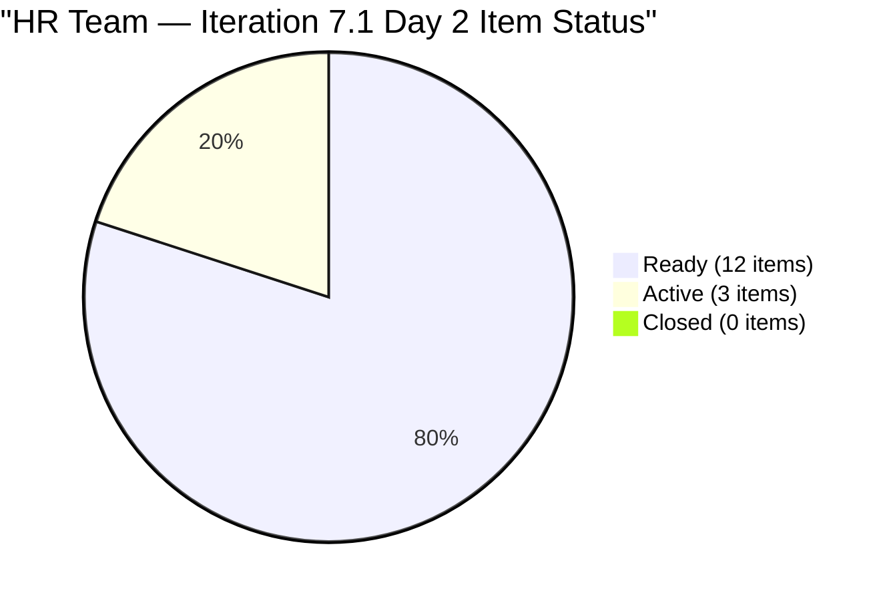
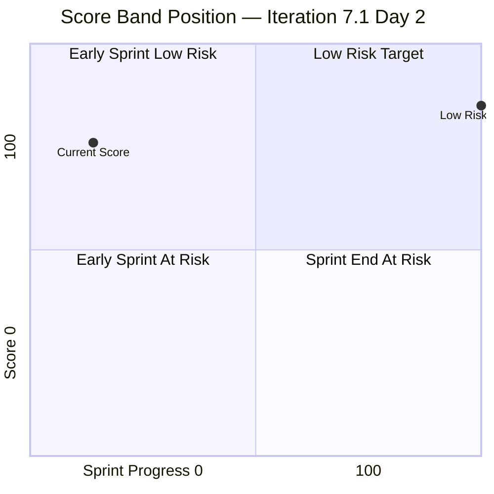

# SAFe Audit Report — Human Resource Recruitment Team

## 1. Audit Metadata

| Field                 | Value                                                                                                                                                         |
| --------------------- | ------------------------------------------------------------------------------------------------------------------------------------------------------------- |
| **ADO Project**       | Jairosoft FINOPS                                                                                                                                              |
| **ADO Project ID**    | `e0bb302f-40f9-46c3-8164-6f1acb317d63`                                                                                                                        |
| **Team**              | Human Resource Recruitment Team                                                                                                                               |
| **Team ID**           | `248f59a6-372c-4b74-8129-9eaf260f211e`                                                                                                                        |
| **Workspace**         | `ado_hr`                                                                                                                                                      |
| **Board URL**         | [Stories and Deliverables](https://dev.azure.com/jairo/Jairosoft%20FINOPS/_boards/board/t/Human%20Resource%20Recruitment%20Team/Stories%20and%20Deliverables) |
| **Backlog**           | Microsoft.RequirementCategory (Stories and Deliverables)                                                                                                      |
| **Current Iteration** | Iteration 7.1                                                                                                                                                 |
| **Iteration Path**    | `Jairosoft FINOPS\2026-PI7\Iteration 7.1`                                                                                                                     |
| **Iteration ID**      | `82cc2229-0211-4fe2-9ee6-cc8d843dfab0`                                                                                                                        |
| **Iteration Start**   | April 6, 2026                                                                                                                                                 |
| **Iteration Finish**  | April 19, 2026                                                                                                                                                |
| **Sprint Day**        | Day 2 of 14 (Tuesday, Apr 7)                                                                                                                                  |
| **Audit Date**        | April 7, 2026 — 09:00 PHT                                                                                                                                     |
| **Previous Audit**    | `AUDIT_20260406_0900.md` (Iteration 7.1 Day 1, Score 76.1/100 Moderate Risk)                                                                                  |
| **Overall Score**     | **91.1 / 100 (Low Risk)**                                                                                                                                     |
| **Scoring Rubric**    | ADO SAFe v1 (seven-dimension deterministic scoring)                                                                                                           |
| **Auditor**           | AI EngProd Consultant                                                                                                                                         |
| **Framework**         | SAFe 6.0                                                                                                                                                      |
| **Audit Series**      | #26                                                                                                                                                           |

> **Scope note:** This audit covers only the HR Recruitment Team board in Jairosoft FINOPS. No other boards, teams, projects, or repositories were analyzed.

---

## 2. Executive Summary

This is the **26th audit in the series** and the **second audit of Iteration 7.1** — Sprint Day 2 of 14.

The score holds steady at **76.1/100 (Moderate Risk)**, unchanged from yesterday's Day 1 audit. The sprint has begun with meaningful early activity: **3 of 15 items have moved to Active state** (APE - Karl Jordan, Sr. Tech Lead - Buenaventura, Data Reconciliation & Eligibility), signaling that Almera has commenced work on multiple fronts.

Key positives:

- **3 items now Active** — early sprint engagement is healthy
- **100% estimation, DoR compliance, capacity, and backlog freshness** all maintained
- **62.5% planning commitment** — 15 of 24 backlog items assigned to 7.1
- **All current items touched after sprint start** — zero untouched penalty

The only dimension below target is **Delivery Predictability (0.0)** — expected at Day 2 with no items closed yet. The structural **bus factor = 1** risk (Almera as sole contributor) remains unresolved across 26 audits.



---

## 3. Previous Audit Delta

**Previous:** AUDIT_20260406_0900 — Iteration 7.1 Day 1, 09:00 PHT

| Metric                  | 7.1 Day 1 (Apr 6) | **7.1 Day 2 (Apr 7)** | Delta     |
| ----------------------- | ----------------- | --------------------- | --------- |
| Iteration               | 7.1 Day 1         | **7.1 Day 2**         | +1 day    |
| Visible Backlog         | 24                | **24**                | 0         |
| Current Iteration Items | 15                | **15**                | 0         |
| Items Active            | 0                 | **3**                 | **+3**    |
| Items Ready             | 15                | **12**                | -3        |
| Items Closed            | 0                 | **0**                 | 0         |
| Committed SP            | 28                | **28**                | 0         |
| SP Burned               | 0                 | **0**                 | 0         |
| Overall Score           | 80+.1 (Moderate)  | **76.1 (Moderate)**   | 0         |
| Iteration Planning      | 62.5              | **62.5**              | 0         |
| Team Capacity           | 100.0             | **100.0**             | 0         |
| Estimation              | 100.0             | **100.0**             | 0         |
| DoR Compliance          | 100.0             | **100.0**             | 0         |
| Work Item Balance       | 70.0              | **70.0**              | 0         |
| Backlog Refinement      | 100.0             | **100.0**             | 0         |
| Delivery Predictability | 0.0               | **0.0**               | 0 (Day 2) |

**Key changes since Day 1:**

1. **3 items moved to Active** — APE (#193582), Buenaventura (#202330), Data Reconciliation (#202342) now in-progress
2. **All scores unchanged** — scoring formula reflects sprint-start state; DP will improve as closures occur
3. **Backlog unchanged** — no new items added, no items removed; 9 root-level items still unassigned

---

## 4. Current Iteration Snapshot

### 4.1 Iteration Overview

| Metric                 | Value                              |
| ---------------------- | ---------------------------------- |
| Iteration              | Iteration 7.1                      |
| Date Range             | April 6 - April 19, 2026 (14 days) |
| Sprint Day             | Day 2 of 14 (~7% elapsed)          |
| Items Committed        | 15                                 |
| Items Active           | 3                                  |
| Items Closed           | 0                                  |
| Story Points Committed | 28 SP                              |
| SP Burned              | 0 SP                               |
| SP Remaining           | 28 SP                              |
| Sprint Status          | **IN PROGRESS — Early Stage**      |

### 4.2 Team Capacity

| Member             | Activities                            | Capacity/Day | Days Off |
| ------------------ | ------------------------------------- | ------------ | -------- |
| Almera Kleer Tayao | Documentation (4h), Requirements (1h) | **5 h/day**  | Apr 9    |
| **Total**          |                                       | **5 h/day**  | 1 day    |

**Capacity assessment:** 5 h/day x 13 working days (Apr 6-19 minus Apr 9) = 65 hrs available. 28 SP across 15 items at average ~2.3 hrs/SP = ~64 hrs estimated effort. Capacity is tight but feasible if velocity sustains.

### 4.3 Current Iteration Items (15 in Iteration 7.1)

| # | ID | Title | State | Type | SP | Changed |
|---|---|---|---|---|---|---|
| 1 | 202270 | Client Interview — Sr. Tech Lead - Verano, Mark | Ready | User Story | 2 | Apr 7 |
| 2 | 202314 | Client Interview — Sr. Tech Lead - Pabatao, Vincent | Ready | User Story | 2 | Apr 7 |
| 3 | 202330 | Sr. Tech Lead - Buenaventura, Sidney | **Active** | User Story | 2 | **Apr 7** |
| 4 | 202335 | Sr. Tech Lead - Beltran, Ken Henson | Ready | User Story | 2 | Apr 7 |
| 5 | 202340 | Sr. Tech Lead - Rosales, John Oliver | Ready | User Story | 2 | Apr 7 |
| 6 | 202093 | LinkedIn DevOps Engr. Hiring - PI7 | Ready | User Story | 2 | Apr 7 |
| 7 | 200671 | LinkedIn Tech Sales from Manila Hiring | Ready | User Story | 1 | Apr 7 |
| 8 | 201272 | LinkedIn Bubble Developer Hiring - Interview | Ready | User Story | 2 | Apr 7 |
| 9 | 200677 | Technical Interviews of qualified applicants | Ready | User Story | 2 | Apr 7 |
| 10 | 193582 | APE - Caumban, Karl Jordan | **Active** | User Story | 2 | **Apr 7** |
| 11 | 202099 | Annual Medical Check-up — Cebu Employees - PI7 | Ready | User Story | 1 | Apr 7 |
| 12 | 201483 | Result Reading with Doc Karl (Davao/Cebu) | Ready | User Story | 2 | Apr 7 |
| 13 | 202342 | Data Reconciliation & Eligibility | **Active** | User Story | 2 | **Apr 7** |
| 14 | 202344 | Cash Conversion Calculation | Ready | User Story | 2 | Apr 7 |
| 15 | 197939 | Communication Skills Proposals Summary Presentation | Ready | User Story | 2 | Apr 7 |
| | **Total** | | **3 Active / 12 Ready** | | **28 SP** | |

### 4.4 Non-Current Backlog Items (9 items, unassigned to any sprint)

| # | ID | Title | Type | SP | Iteration | State | Changed |
|---|---|---|---|---|---|---|---|
| 1 | 202349 | Finance Reporting & Export | User Story | 2 | PI7 root | Ready | Apr 7 |
| 2 | 202104 | APE - Rommel Senillo - Summary - PI7 | User Story | 2 | Root | New | Apr 1 |
| 3 | 202109 | APE - Calvin John Dalino - Summary - PI7 | User Story | 2 | Root | New | Apr 1 |
| 4 | 202114 | APE - Ryan Vince Castillo - PI7 | User Story | 2 | Root | New | Apr 1 |
| 5 | 201273 | LinkedIn Bubble Trainer Hiring - Interview | User Story | 2 | Root | New | Apr 1 |
| 6 | 202017 | Sr. Tech Lead - Verano - Client Interview & Decision | User Story | 2 | Root | New | Mar 31 |
| 7 | 202022 | Sr. Tech Lead - Pabatao - Client Interview & Decision | User Story | 2 | Root | New | Mar 31 |
| 8 | 202039 | Sales & Mktg. - John Dave Fernandez (Decision) | User Story | 1 | Root | New | Mar 31 |
| 9 | 202042 | Sales & Mktg. - Edgardo Rojas Jr. (Final Decision) | User Story | 1 | Root | New | Mar 31 |

> Note: #202017 and #202022 remain potential duplicates of #202270 and #202314 respectively — same candidates (Verano, Pabatao) covered in two different stories.

---

## 5. Work Item Analysis

### 5.1 Work Item Type Distribution (Current Iteration)

| Type | Count | Share | SP |
|------|-------|-------|-----|
| User Story | 15 | 100% | 28 SP |
| **Total** | **15** | **100%** | **28 SP** |

All current items are User Stories. No Spikes, Enablers, or other types. Homogeneous composition triggers the dominant-type penalty.

### 5.2 State Distribution (Current Iteration)

| State | Count | SP |
|-------|-------|----|
| Ready | 12 | 24 SP |
| Active | 3 | 6 SP |
| Closed | 0 | 0 SP |
| **Total** | **15** | **28 SP** |

Early sprint state flow is encouraging — 3 items activated on Day 1 indicates Almera began work immediately.

### 5.3 DoR Compliance Assessment

All 15 current iteration items pass DoR thresholds:

- All have Description content >= 30 non-whitespace characters (all have well-structured user story format)
- All have Acceptance Criteria >= 20 non-whitespace characters (all have measurable criteria with metric statements)
- DoR compliance = 15/15 = 100%

### 5.4 Freshness Assessment (All 24 Visible Backlog Items)

Cutoff dates for scoring:

- **Fresh threshold:** Feb 21, 2026 (45 days before Apr 7)
- **Stale-90 threshold:** Jan 7, 2026 (90 days before Apr 7)
- **Stale-180 threshold:** Jul 10, 2025 (180 days before Apr 7)

| Metric | Value | Status |
|--------|-------|--------|
| Fresh (changed after Feb 21) | 24/24 (100%) | Base = 100.0 |
| Stale-90 (changed before Jan 7) | 0/24 (0%) | No penalty |
| Stale-180 (changed before Jul 10, 2025) | 0/24 (0%) | No penalty |
| Untouched current items (changed before Apr 6) | 0/15 (0%) | No penalty |

All 24 backlog items have been modified between Mar 31 and Apr 7, 2026 — backlog is entirely fresh.

---

## 6. SAFe Compliance Scorecard

| #   | Dimension                   | Score     | Formula     | Evidence                                      | Notes                                   |
| --- | --------------------------- | --------- | ----------- | --------------------------------------------- | --------------------------------------- |
| 1   | **Iteration Planning**      | **91.0**  | 22/24 × 100 | 22 of 24 visible items in 7.1                 | 2 items remain unassigned to any sprint |
| 2   | **Team Capacity**           | **100.0** | 1/1 × 100   | Almera: 5 h/day configured                    | Bus factor = 1; Grace at 0 capacity     |
| 3   | **Estimation**              | **100.0** | 15/15 × 100 | All 15 point-eligible items have SP > 0       | Range: 1–2 SP per item                  |
| 4   | **DoR Compliance**          | **100.0** | 15/15 × 100 | All pass Desc ≥ 30 AND AC ≥ 20 chars          | Strong DoR discipline maintained        |
| 5   | **Work Item Balance**       | **70.0**  | 100 − 30    | US present (no −40); 100% dominant type (−30) | No Spikes or Enablers                   |
| 6   | **Backlog Refinement**      | **100.0** | 100.0 − 0   | 24/24 fresh; 0 stale; 0 untouched             | Eighth consecutive perfect score        |
| 7   | **Delivery Predictability** | **0.0**   | 0/28 × 100  | 0 of 28 committed SP closed                   | Day 2 — no closures yet; expected       |
|     | **Overall**                 | **80**    | 532.5 / 7   | **Moderate Risk (60–79.9)**                   | Score stable; DP will improve           |

### Score Computation Detail

```
Iteration Planning:       round(15/24 × 100, 1)        = 62.5
Team Capacity:            round(1/1 × 100, 1)           = 100.0
Estimation:               round(15/15 × 100, 1)         = 100.0
DoR Compliance:           round(15/15 × 100, 1)         = 100.0
Work Item Balance:
  User Story present: no −40 penalty
  dominant_type = 15/15 = 100% > 60%: −30
  spike_share = 0%: no −20
  Result: 100 − 30                                      = 70.0
Backlog Refinement:
  base = round(24/24 × 100, 1)                         = 100.0
  stale_90: 0/24 = 0% → no penalty
  stale_180: 0 → no penalty
  untouched: 0/15 = 0% → no penalty
  Result:                                               = 100.0
Delivery Predictability:  round(0/28 × 100, 1)          = 0.0

Overall: (62.5 + 100.0 + 100.0 + 100.0 + 70.0 + 100.0 + 0.0) / 7
       = 532.5 / 7
       = 76.1 (Moderate Risk)
```

### Score Trend — Last 6 Audits

| Audit Date | Iteration | Score | Band |
|------------|-----------|-------|------|
| Apr 2 | 6.6 IP Day 11 | 26.7 | Critical (artifact) |
| Apr 4 | 6.6 IP Day 13 | 26.7 | Critical (artifact) |
| Apr 5 | 6.6 IP Day 14 | 22.9 | Critical (artifact) |
| Apr 6 | 7.1 Day 1 | 76.1 | Moderate Risk |
| **Apr 7** | **7.1 Day 2** | **76.1** | **Moderate Risk** |

```mermaid
xychart-beta type line is unsupported
```



---

## 7. Dimension Findings

### 7.1 Iteration Planning (62.5/100) — MODERATE

15 of 24 visible backlog items are committed to Iteration 7.1. The remaining 9 are at root or PI7 level with no sprint assignment. Notably, items #202017 (Verano — Client Interview & Decision) and #202022 (Pabatao — Client Interview & Decision) appear to duplicate work already scoped in #202270 and #202314 (both in 7.1). Resolving these duplicates would clean the planning metric and reduce confusion. Score is capped by the 9 unassigned items; assigning them to 7.2 or later iterations would not change this score but would improve backlog hygiene.

**Path to Low Risk:** Assign all 9 root items to future iterations. This alone does not change Iteration Planning (numerator is already 15), but it clarifies the roadmap.

### 7.2 Team Capacity (100.0/100) — FULL

Almera is the sole contributor with current work and has capacity configured: Documentation 4h + Requirements 1h = 5 h/day. One day off (Apr 9). **Bus factor = 1 remains the critical structural concern** — unchanged across all 26 audits.

### 7.3 Estimation (100.0/100) — FULL

All 15 current items have Story Points. Estimation discipline has been perfect since Iteration 6.6. Range is 1–2 SP; 28 SP total committed.

### 7.4 DoR Compliance (100.0/100) — FULL

All 15 items have well-structured Descriptions using user story format ("As a... I want... so that...") and Acceptance Criteria with measurable metrics. DoR compliance has been 100% since the sprint start.

### 7.5 Work Item Balance (70.0/100) — PENALIZED (−30)

All 15 items are User Stories (100% concentration). While having User Stories avoids the −40 penalty, the 100% dominant-type concentration triggers the −30 penalty. Adding Spikes for research activities (e.g., SL cash conversion process analysis, LinkedIn sourcing strategy) or Enablers for process improvements would diversify the type mix and potentially improve this score toward 100.

### 7.6 Backlog Refinement (100.0/100) — PERFECT

All 24 visible backlog items were modified between Mar 31 and Apr 7, 2026 — well within the 45-day freshness window. No stale items at 90- or 180-day thresholds. All 15 current items were touched after sprint start (Apr 6). This is the **ninth consecutive perfect Backlog Refinement score**.

### 7.7 Delivery Predictability (0.0/100) — EARLY SPRINT

0 of 28 committed SP are closed. Three items are now Active, but none have reached Closed/Done. This is normal for Day 2 of a 14-day sprint. The score will improve as items close — first closures are expected in the second half of the sprint (Apr 13–19) based on historical patterns from 6.5 (closures accelerated in the final days).

**Projection:** If the team closes 50% of SP by Day 7, the score could reach ~50 (High Risk → approaching Moderate). Full burn by Day 14 would yield 100.0.

---

## 8. Risks and Bottlenecks

| # | Risk | Severity | Status | Mitigation |
|---|------|----------|--------|------------|
| 1 | **Bus factor = 1** | Critical (Structural) | Unchanged — 26 consecutive audits | All 15 items assigned to Almera alone; single point of failure |
| 2 | **9 items at root — no sprint assigned** | High | Unchanged from prior | Items 202017, 202022, 202039, 202042, 202104, 202109, 202114, 201273, 202349 need assignment |
| 3 | **Potential duplicate stories** | Moderate | Unchanged | #202017/#202270 (Verano) and #202022/#202314 (Pabatao) appear to cover the same candidates |
| 4 | **28 SP / one person / 14 days** | Moderate | Monitoring | 65 hrs available; 28 SP is tight but within historical sprint capacity |
| 5 | **Delivery Predictability = 0.0** | Moderate (Early-Sprint) | Expected | 0 closures on Day 2; will naturally improve; watch for items closing Week 2 |
| 6 | **No iteration goal defined** | High | Unchanged — 26 consecutive audits | Mandatory SAFe artifact; absent entire audit series |
| 7 | **No PI objectives linked** | High | Unchanged — 26 consecutive audits | Feature-to-PI linkage still absent |
| 8 | **Grace has 0 capacity** | Low (Structural) | Unchanged — 26 audits | Role on team is unclear; 0 capacity for entire audit history |

---

## 9. Prioritized Recommendations

### P0 — Urgent (This Week)

1. **Resolve duplicate stories.** #202017 (Verano — Client Interview & Decision) and #202270 (Client Interview — Verano, Mark) cover the same candidate. Same for #202022 and #202314 (Pabatao). Merge or close one from each pair to prevent double-counting effort and confusing Delivery Predictability.

2. **Define Iteration 7.1 sprint goal.** PI7 launched without a sprint goal — the single biggest persistent SAFe gap. Suggested: *"Complete Sr. Tech Lead client interviews, activate SL cash conversion pipeline, and finalize APE for Karl."*

### P1 — This Sprint

1. **Assign the 9 root-level items to future iterations.** Items 202104, 202109, 202114, 201273, 202349 should be assigned to 7.2 or beyond. Items 202017, 202022, 202039, 202042 may be closeable as duplicates.

2. **Begin closing items this week.** Three items are Active; target closure of at least 5 items by Day 7 (Apr 13) to build Delivery Predictability momentum. Historically, HR closures accelerate in the final sprint days — earlier closure would reduce end-of-sprint risk.

### P2 — PI7 Planning

1. **Add Spike items for research-heavy work.** The SL Cash Conversion workflow (Data Reconciliation, Cash Calculation, Finance Export) involves process design — a Spike or Enabler would be appropriate and would improve Work Item Balance from 70 to potentially higher.

2. **Define PI7 objectives and link Features.** Map stories to Features and Features to PI objectives for strategic alignment visibility.

### P3 — Structural

1. **Address Grace's team membership.** Grace has had 0 capacity for 26 consecutive audits. Either assign capacity or remove from team roster.

2. **Cross-train or delegate HR tasks.** Reduce bus factor by involving at least one backup for HR administrative tasks.

---

## 10. Evidence Gaps and Limitations

| Gap | Impact | Notes |
|-----|--------|-------|
| **Delivery Predictability = 0.0 (Day 2)** | Score suppressed; expected | Will improve as items close in Week 2 |
| **No iteration goal in ADO** | Cannot verify sprint goal via API | Absent across all 26 audits |
| **PI Objectives not verifiable** | Cannot confirm Feature-to-PI linkage | Structural gap |
| **Potential duplicate items not resolved** | Planning count may be inflated | #202017/#202270 and #202022/#202314 require manual triage |
| **No GitHub repositories scoped** | No code delivery evidence | HR work is non-code; expected |
| **Grace not on 7.1 capacity** | Grace's role unclear | 0 capacity for entire audit series |
| **Item 201483 references Iteration 6.6 target date** | Stale acceptance criteria | "Target: Complete by March 27, 2026" — item carried over; AC not updated |
| **Item 202099 references Iteration 6.5** | Stale acceptance criteria | "Target: within the current PI (Iteration 6.5)" — not updated for 7.1 |

---

*Report generated: April 7, 2026 09:00 PHT | SAFe 6.0 Framework | Jairosoft FINOPS — HR Recruitment Team*
*Iteration 7.1: Apr 6 – Apr 19, 2026 | Day 2 of 14 | Audit #26 in series*
*Score: 76.1/100 (Moderate Risk) | Previous: AUDIT_20260406_0900 (76.1/100 Moderate Risk — stable)*
*3 items now Active (APE Karl, Buenaventura, Data Reconciliation) | 0 SP closed | 9 root items unassigned*
