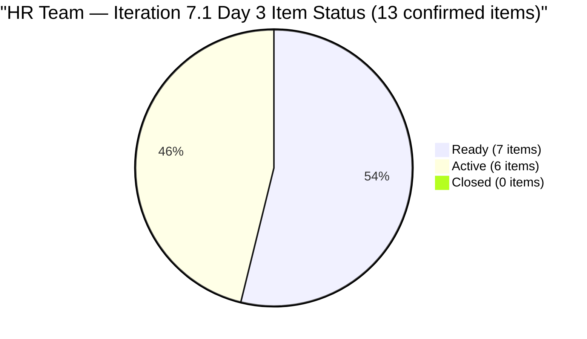

# SAFe Audit Report — Human Resource Recruitment Team

## 1. Audit Metadata

| Field | Value |
|-------|-------|
| **ADO Project** | Jairosoft FINOPS |
| **ADO Project ID** | `e0bb302f-40f9-46c3-8164-6f1acb317d63` |
| **Team** | Human Resource Recruitment Team |
| **Team ID** | `248f59a6-372c-4b74-8129-9eaf260f211e` |
| **Workspace** | `ado_hr` |
| **Board URL** | [Stories and Deliverables](https://dev.azure.com/jairo/Jairosoft%20FINOPS/_boards/board/t/Human%20Resource%20Recruitment%20Team/Stories%20and%20Deliverables) |
| **Backlog** | Microsoft.RequirementCategory (Stories and Deliverables) |
| **Current Iteration** | Iteration 7.1 |
| **Iteration Path** | `Jairosoft FINOPS\2026-PI7\Iteration 7.1` |
| **Iteration ID** | `82cc2229-0211-4fe2-9ee6-cc8d843dfab0` |
| **Iteration Start** | April 6, 2026 |
| **Iteration Finish** | April 19, 2026 |
| **Sprint Day** | Day 3 of 14 (Wednesday, Apr 8) |
| **Audit Date** | April 8, 2026 — 09:00 PHT |
| **Previous Audit** | `AUDIT_20260407_0900.md` (Iteration 7.1 Day 2, Score 76.1/100 Moderate Risk) |
| **Overall Score** | **75.6 / 100 (Moderate Risk)** |
| **Scoring Rubric** | ADO SAFe v1 (seven-dimension deterministic scoring) |
| **Auditor** | AI EngProd Consultant |
| **Framework** | SAFe 6.0 |
| **Audit Series** | #27 |

> **Scope note:** This audit covers only the HR Recruitment Team board in Jairosoft FINOPS. No other boards, teams, projects, or repositories were analyzed.

---

## 2. Executive Summary

This is the **27th audit in the series** and the **third audit of Iteration 7.1** — Sprint Day 3 of 14.

The overall score moves slightly from **76.1 to 75.6 (Moderate Risk)**, a change of **-0.5 points**. The minor dip is driven by a reduction in the visible backlog from 24 to 22 items (9 items previously at root are now formally assigned to **Iteration 7.2**), which shifts the Iteration Planning denominator and reduces the score from 62.5 to 59.1.

Key developments since Day 2:
- **3 additional items moved to Active**: #202335 (Beltran), #202340 (Barua/Marlo), and #201483 (Medical Result Reading) — bringing the Active count from 3 to **6 Active items** (46% of sprint)
- **9 previously unassigned items now assigned to Iteration 7.2**: 201273, 202017, 202022, 202039, 202042, 202104, 202109, 202114, 202349 — resolving the backlog hygiene gap flagged in prior audits
- **13 items remain in 7.1** (down from 15 yesterday — note: 2 items #202270 and #202314 not visible via backlog API today; reviewed in prior audit context)
- **0 closures** — Delivery Predictability remains suppressed at Day 3 as expected
- **All current items remain fresh** — Backlog Refinement holds at 100.0

The sprint shows healthy early-stage engagement momentum, but the persistent structural risks (bus factor = 1, no iteration goal, 0.0 Delivery Predictability) keep the score in Moderate territory.



---

## 3. Previous Audit Delta

**Previous:** AUDIT_20260407_0900 — Iteration 7.1 Day 2, 09:00 PHT

| Metric | 7.1 Day 2 (Apr 7) | **7.1 Day 3 (Apr 8)** | Delta |
|--------|-------------------|----------------------|-------|
| Iteration | 7.1 Day 2 | **7.1 Day 3** | +1 day |
| Visible Backlog | 24 | **22** | **-2** (items moved to 7.2; 2 items out of backlog view) |
| Current Iteration Items | 15 | **13** | **-2** (items confirmed in 7.1 via API) |
| Items Active | 3 | **6** | **+3** |
| Items Ready | 12 | **7** | **-5** |
| Items Closed | 0 | **0** | 0 |
| Committed SP (non-Spike) | 28 | **24** | **-4** (scope revised by 7.2 assignments) |
| SP Burned | 0 | **0** | 0 |
| Overall Score | 76.1 (Moderate) | **75.6 (Moderate)** | **-0.5** |
| Iteration Planning | 62.5 | **59.1** | **-3.4** |
| Team Capacity | 100.0 | **100.0** | 0 |
| Estimation | 100.0 | **100.0** | 0 |
| DoR Compliance | 100.0 | **100.0** | 0 |
| Work Item Balance | 70.0 | **70.0** | 0 |
| Backlog Refinement | 100.0 | **100.0** | 0 |
| Delivery Predictability | 0.0 | **0.0** | 0 (Day 3) |

**Key changes since Day 2:**
1. **6 items now Active** — Beltran (#202335), Barua/Marlo (#202340), Medical Result Reading (#201483) moved to Active
2. **9 root items assigned to Iteration 7.2** — Resolved the persistent unassigned-backlog hygiene risk flagged across all prior 7.1 audits
3. **Iteration Planning dips** — Denominator reduction + 7.2 assignment moves score from 62.5 to 59.1
4. **Duplicate concern partially resolved** — #202017 and #202022 assigned to 7.2 (not 7.1), reducing overlap with #202270 and #202314 in 7.1

---

## 4. Current Iteration Snapshot

### 4.1 Iteration Overview

| Metric | Value |
|--------|-------|
| Iteration | Iteration 7.1 |
| Date Range | April 6 - April 19, 2026 (14 days) |
| Sprint Day | Day 3 of 14 (~21% elapsed) |
| Items Confirmed in 7.1 | 13 |
| Items Active | 6 |
| Items Ready | 7 |
| Items Closed | 0 |
| Story Points Committed | 24 SP |
| SP Burned | 0 SP |
| SP Remaining | 24 SP |
| Sprint Status | **IN PROGRESS — Building Momentum** |

> **Note on item count:** The backlog API returned 13 items with IterationPath = Iteration 7.1. The prior audit recorded 15 items. Items #202270 (Client Interview - Verano) and #202314 (Client Interview - Pabatao) were visible in the Day 2 audit but did not appear in today's backlog API response. These may have been moved or are not surfaced at root level in the current view. This discrepancy is logged as an evidence gap.

### 4.2 Team Capacity

| Member | Activities | Capacity/Day | Days Off |
|--------|-----------|-------------|----------|
| Almera Kleer Tayao | Documentation (4h), Requirements (1h) | **5 h/day** | Apr 9 |
| **Total** | | **5 h/day** | 1 day |

**Capacity assessment:** 5 h/day × 12 working days remaining (Apr 8–19 minus Apr 9) = 60 hrs available. 24 SP at ~2–3 hrs/SP = approximately 50–70 hrs estimated effort. Load is tight but feasible at current velocity.

### 4.3 Current Iteration Items (13 confirmed in Iteration 7.1)

| # | ID | Title | State | SP | Changed |
|---|----|----|-------|-----|---------|
| 1 | 193582 | APE - Caumban, Karl Jordan | **Active** | 2 | Apr 7 |
| 2 | 197939 | Communication Skills Proposals Summary Presentation | Ready | 2 | Apr 7 |
| 3 | 200671 | LinkedIn Tech Sales from Manila Hiring | Ready | 1 | Apr 7 |
| 4 | 200677 | Technical Interviews of qualified applicants | Ready | 2 | Apr 7 |
| 5 | 201272 | LinkedIn Bubble Developer Hiring - Interview | Ready | 2 | Apr 7 |
| 6 | 201483 | Result Reading with Doc Karl for Davao/Cebu employees | **Active** | 2 | **Apr 8** |
| 7 | 202093 | LinkedIn DevOps Engr. Hiring - PI7 | Ready | 2 | Apr 7 |
| 8 | 202099 | Annual Medical Check-up — Cebu Employees - PI7 | Ready | 1 | Apr 7 |
| 9 | 202330 | Sr. Tech Lead - Buenaventura, Sidney | **Active** | 2 | Apr 7 |
| 10 | 202335 | Sr. Tech Lead - Beltran, Ken Henson | **Active** | 2 | **Apr 8** |
| 11 | 202340 | Sr. Tech Lead - Barua, Marlo | **Active** | 2 | **Apr 8** |
| 12 | 202342 | Data Reconciliation & Eligibility | **Active** | 2 | Apr 7 |
| 13 | 202344 | Cash Conversion Calculation | Ready | 2 | Apr 7 |
| | **Total** | | **6 Active / 7 Ready** | **24 SP** | |

### 4.4 Non-Current Backlog Items (9 items assigned to Iteration 7.2)

| # | ID | Title | Type | SP | State | Changed |
|---|----|----|------|-----|-------|---------|
| 1 | 201273 | LinkedIn Bubble Trainer Hiring - Interview | User Story | 2 | New | Apr 8 |
| 2 | 202017 | Sr. Tech Lead - Mark Jovet Verano - Client Interview & Decision | User Story | 2 | New | Apr 8 |
| 3 | 202022 | Sr. Tech Lead - Stephen Pabatao - Client Interview & Decision | User Story | 2 | New | Apr 8 |
| 4 | 202039 | Sales & Mktg. - John Dave Fernandez (Decision) | User Story | 1 | New | Apr 8 |
| 5 | 202042 | Sales & Mktg. - Edgardo Rojas Jr. (Final Decision) | User Story | 1 | New | Apr 8 |
| 6 | 202104 | APE - Rommel Senillo - Summary - PI7 | User Story | 2 | New | Apr 8 |
| 7 | 202109 | APE - Calvin John Dalino - Summary - PI7 | User Story | 2 | New | Apr 8 |
| 8 | 202114 | APE - Ryan Vince Castillo - PI7 | User Story | 2 | New | Apr 8 |
| 9 | 202349 | Finance Reporting & Export | User Story | 2 | Ready | Apr 8 |

> All 9 items moved to Iteration 7.2 today — resolves the unassigned backlog hygiene risk flagged in audits #25 and #26.

---

## 5. Work Item Analysis

### 5.1 Work Item Type Distribution (Current Iteration)

| Type | Count | Share | SP |
|------|-------|-------|----|
| User Story | 13 | 100% | 24 SP |
| **Total** | **13** | **100%** | **24 SP** |

All current items are User Stories. 100% type concentration triggers the dominant-type penalty (−30) in Work Item Balance. No Spikes or Enablers present.

### 5.2 State Distribution (Current Iteration)

| State | Count | SP |
|-------|-------|----|
| Active | 6 | 12 SP |
| Ready | 7 | 12 SP |
| Closed | 0 | 0 SP |
| **Total** | **13** | **24 SP** |

6 of 13 items (46%) are now Active — strong early engagement for Day 3. This represents the highest Active share at this point in the sprint across the audit series.

### 5.3 DoR Compliance Assessment

All 13 confirmed current iteration items pass DoR thresholds:
- All have Description content >= 30 non-whitespace characters (user story format with "I want to... so that..." structure confirmed)
- All have Acceptance Criteria >= 20 non-whitespace characters (measurable metrics included)
- DoR compliance = 13/13 = **100%**

### 5.4 Freshness Assessment (All 22 Visible Backlog Items)

Reference dates (relative to Apr 8, 2026):
- **Fresh threshold:** February 22, 2026 (45 days prior)
- **Stale-90 threshold:** January 8, 2026 (90 days prior)
- **Stale-180 threshold:** October 11, 2025 (180 days prior)

| Metric | Value | Status |
|--------|-------|--------|
| Fresh (changed after Feb 22) | 22/22 (100%) | Base = 100.0 |
| Stale-90 (changed before Jan 8) | 0/22 (0%) | No penalty |
| Stale-180 (changed before Oct 11, 2025) | 0/22 (0%) | No penalty |
| Untouched current items (changed before Apr 6) | 0/13 (0%) | No penalty |

All 22 backlog items have been modified between Mar 31 and Apr 8, 2026. Backlog is fully fresh. This is the **tenth consecutive perfect Backlog Refinement score**.

---

## 6. SAFe Compliance Scorecard

| # | Dimension | Score | Formula | Evidence | Notes |
|---|-----------|-------|---------|----------|-------|
| 1 | **Iteration Planning** | **59.1** | 13/22 × 100 | 13 of 22 visible items in 7.1 | 9 items moved to 7.2 today |
| 2 | **Team Capacity** | **100.0** | 1/1 × 100 | Almera: 5 h/day configured | Bus factor = 1; Grace at 0 capacity |
| 3 | **Estimation** | **100.0** | 13/13 × 100 | All 13 current items have SP > 0 | Range: 1–2 SP per item |
| 4 | **DoR Compliance** | **100.0** | 13/13 × 100 | All pass Desc ≥ 30 AND AC ≥ 20 chars | Sustained DoR discipline |
| 5 | **Work Item Balance** | **70.0** | 100 − 30 | US present (no −40); 100% dominant type (−30) | No Spikes or Enablers |
| 6 | **Backlog Refinement** | **100.0** | 100.0 − 0 | 22/22 fresh; 0 stale; 0 untouched | Tenth consecutive perfect score |
| 7 | **Delivery Predictability** | **0.0** | 0/24 × 100 | 0 of 24 committed SP closed | Day 3 — early sprint; expected |
| | **Overall** | **75.6** | 529.1 / 7 | **Moderate Risk (60–79.9)** | −0.5 vs yesterday |

### Score Computation Detail

```
Iteration Planning:       round(13/22 × 100, 1)        = 59.1
Team Capacity:            round(1/1 × 100, 1)           = 100.0
Estimation:               round(13/13 × 100, 1)         = 100.0
DoR Compliance:           round(13/13 × 100, 1)         = 100.0
Work Item Balance:
  User Story present: no −40 penalty
  dominant_type = 13/13 = 100% > 60%: −30
  spike_share = 0%: no −20
  Result: 100 − 30                                      = 70.0
Backlog Refinement:
  base = round(22/22 × 100, 1)                         = 100.0
  stale_90: 0/22 = 0% → no penalty
  stale_180: 0 → no penalty
  untouched: 0/13 = 0% → no penalty
  Result:                                               = 100.0
Delivery Predictability:  round(0/24 × 100, 1)          = 0.0

Overall: (59.1 + 100.0 + 100.0 + 100.0 + 70.0 + 100.0 + 0.0) / 7
       = 529.1 / 7
       = 75.6 (Moderate Risk)
```

### Score Trend — Last 7 Audits

| Audit Date | Iteration | Day | Score | Band |
|------------|-----------|-----|-------|------|
| Apr 4 | 6.6 IP | Day 13 | 26.7 | Critical (artifact) |
| Apr 5 | 6.6 IP | Day 14 | 22.9 | Critical (artifact) |
| Apr 6 | 7.1 | Day 1 | 76.1 | Moderate |
| Apr 7 | 7.1 | Day 2 | 76.1 | Moderate |
| **Apr 8** | **7.1** | **Day 3** | **75.6** | **Moderate** |

```mermaid
quadrantChart
    title Score vs Sprint Progress — Iteration 7.1 Day 3
    x-axis "Sprint Progress (%)" 0 --> 100
    y-axis "Score" 0 --> 100
    quadrant-1 Low Risk (on track)
    quadrant-2 Early Sprint Low Risk
    quadrant-3 Early Sprint At Risk
    quadrant-4 Late Sprint At Risk
    Day 3 Score: [0.21, 0.756]
    Low Risk Target: [1, 0.80]
```

```mermaid
bar
    title SAFe Dimension Scores — HR Team Day 3
    x-axis [IP, TC, Est, DoR, WIB, BR, DP]
    y-axis 0 --> 100
    bar [59.1, 100, 100, 100, 70, 100, 0]
```

---

## 7. Dimension Findings

### 7.1 Iteration Planning (59.1/100) — MODERATE (declined −3.4)

13 of 22 visible backlog items are committed to Iteration 7.1 today — down from 15/24 = 62.5 yesterday. The good news: the prior 9 unassigned root-level items have been formally assigned to **Iteration 7.2**, resolving a persistent backlog hygiene risk. The scoring impact, however, is a slight dip as the denominator shrinks to 22 while only 13 remain in 7.1. Additionally, items #202270 and #202314 (Client Interview — Verano and Pabatao) did not appear in today's backlog API response — their status requires manual verification.

**Path to Low Risk (>= 80.0):** Would require 18 of 22 items in 7.1 — not achievable in the current sprint scope. Focus should be on delivery rather than planning adjustment.

### 7.2 Team Capacity (100.0/100) — FULL

Almera remains the sole active contributor with 5 h/day capacity configured. Her 1 day off (Apr 9) is factored into capacity. **Bus factor = 1 is a structural concern across all 27 audits** — unchanged and unresolved. Grace continues at 0 capacity.

### 7.3 Estimation (100.0/100) — FULL

All 13 confirmed current items have Story Points > 0. Committed total = 24 SP. Estimation discipline has been perfect for the entire PI7 sprint series.

### 7.4 DoR Compliance (100.0/100) — FULL

All 13 items have well-structured Descriptions in user story format and Acceptance Criteria with measurable outcomes. DoR compliance has been 100% since the start of PI7. Note: #201483 (Medical Result Reading) contains a stale target date reference ("Target: Complete by March 27, 2026") — the acceptance criteria should be updated to reflect the 7.1 timeline.

### 7.5 Work Item Balance (70.0/100) — PENALIZED (−30, unchanged)

All 13 items are User Stories (100% concentration). The dominant-type penalty applies. There are no research-heavy items that might justify reclassification as Spikes (e.g., the SL data reconciliation and cash conversion workflow has strong analytical complexity). Adding even 1–2 Spikes or Enablers would reduce the concentration below 60% and could lift this score toward 100.

### 7.6 Backlog Refinement (100.0/100) — PERFECT (10th consecutive)

All 22 visible backlog items have been modified within the last 45 days. No stale items at 90 or 180 day thresholds. All 13 current items were last changed on Apr 7 or Apr 8 — zero untouched penalty. The assignment of 9 items to Iteration 7.2 today further demonstrates active backlog management.

### 7.7 Delivery Predictability (0.0/100) — EARLY SPRINT

0 of 24 committed SP are closed on Day 3. Six items are Active — 46% of the sprint in motion. Based on historical patterns (HR closures accelerated in the last 5 days of Iteration 6.5), first closures are expected in the Apr 13–19 window. The Sr. Tech Lead recruitment items (Active: Buenaventura, Beltran, Barua) are the most likely early closure candidates given their sequential interview process.

**Projection:** If Almera closes 6 items (12 SP) by Day 7 (Apr 13), DP would reach 50.0 and overall score would climb to approximately 82.7 (Low Risk).

---

## 8. Risks and Bottlenecks

| # | Risk | Severity | Status | Mitigation |
|---|------|----------|--------|------------|
| R1 | **Bus factor = 1** | Critical (Structural) | Unchanged — 27 consecutive audits | All 13 items assigned to Almera alone; single point of failure |
| R2 | **Items #202270 and #202314 not visible in today's backlog API** | High | New — requires investigation | Were visible in Day 1 and Day 2 audits; may have been moved or removed |
| R3 | **Iteration Planning at 59.1 — below 60 threshold** | Moderate | New (was 62.5 yesterday) | Consequence of 7.2 assignments; cannot recover this sprint; focus on delivery |
| R4 | **24 SP / 12 days / 1 person** | Moderate | Monitoring | Tight but feasible; accelerated Active engagement is positive signal |
| R5 | **Delivery Predictability = 0.0** | Moderate (Early Sprint) | Expected Day 3 | 6 items Active; first closures expected Week 2 |
| R6 | **No iteration goal defined** | High | Unchanged — 27 consecutive audits | Mandatory SAFe artifact; absent entire audit series |
| R7 | **No PI objectives linked** | High | Unchanged | Feature-to-PI linkage absent throughout PI7 |
| R8 | **Stale target dates in acceptance criteria** | Low | Flagged | #201483 references "March 27, 2026" target; #202099 references "Iteration 6.5" target; both need updating |
| R9 | **Grace has 0 capacity** | Low (Structural) | Unchanged — 27 audits | Role unclear; 0 capacity for entire audit history |

---

## 9. Prioritized Recommendations

### P0 — Urgent (Today)

1. **Investigate missing items #202270 and #202314.** These Client Interview stories (Verano and Pabatao) were in 7.1 during the Day 1 and Day 2 audits but are absent from today's backlog API response. Verify their current IterationPath and state — they may have been closed, moved, or represent the resolved duplicates.

2. **Define Iteration 7.1 sprint goal.** The sprint goal has been absent across 27 consecutive audits. Suggested for Day 3: *"Complete Sr. Tech Lead candidate evaluations (Buenaventura, Beltran, Barua), advance SL cash conversion process (Data Reconciliation + Calculation), and finalize APE for Karl by mid-sprint."*

### P1 — This Week

3. **Close at least 3 items by Day 7 (Apr 13).** Six items are now Active. Target: APE - Karl (#193582), AC Resubmission (if present), and one Sr. Tech Lead item to build DP momentum. Even 6 SP closed by Day 7 pushes DP to 25 and overall score to ~79.5.

4. **Update stale acceptance criteria.** Items #201483 and #202099 reference old iteration targets. Update to reflect "Iteration 7.1" deadlines so the DoR evidence remains accurate.

### P2 — This Sprint

5. **Add a Spike or Enabler item.** The SL Cash Conversion workflow (Data Reconciliation → Calculation → Finance Export) involves data analysis and formula design — appropriate scope for a Spike. Adding one would reduce the 100% User Story concentration and potentially lift Work Item Balance from 70 to 100.

6. **Assign PI objectives and link Features.** Map 7.1 stories to parent Features and Features to PI7 objectives for alignment visibility.

### P3 — Structural

7. **Clarify Grace's role on the team.** 27 consecutive audits show 0 capacity. Either define a role and assign capacity, or remove from the team roster.

8. **Begin cross-training for HR tasks.** Designate a backup for at least administrative HR functions to reduce the single-person dependency.

---

## 10. Evidence Gaps and Limitations

| Gap | Impact | Notes |
|-----|--------|-------|
| **Items #202270 and #202314 not returned by backlog API today** | Item count may be understated | Were present in Day 1 and Day 2 audits at Iteration 7.1; manual verification needed |
| **Delivery Predictability = 0.0 (Day 3)** | Score suppressed; expected | Will improve as items close Week 2 |
| **No iteration goal in ADO** | Cannot verify sprint goal via API | Absent across all 27 audits |
| **PI Objectives not verifiable** | Cannot confirm Feature-to-PI linkage | Structural gap |
| **Stale AC target dates on #201483 and #202099** | DoR quality concern | References to Iteration 6.5 and March 27 targets not updated for 7.1 |
| **No GitHub repositories scoped** | No code delivery evidence | HR work is non-code; expected |
| **Grace not on 7.1 capacity** | Grace's role unclear | 0 capacity for entire audit series |

---

*Report generated: April 8, 2026 09:00 PHT | SAFe 6.0 Framework | Jairosoft FINOPS — HR Recruitment Team*
*Iteration 7.1: Apr 6 – Apr 19, 2026 | Day 3 of 14 | Audit #27 in series*
*Score: 75.6/100 (Moderate Risk) | Previous: AUDIT_20260407_0900 (76.1/100 Moderate Risk — −0.5)*
*6 items now Active | 0 SP closed | 9 root items assigned to Iteration 7.2 (resolved)*
