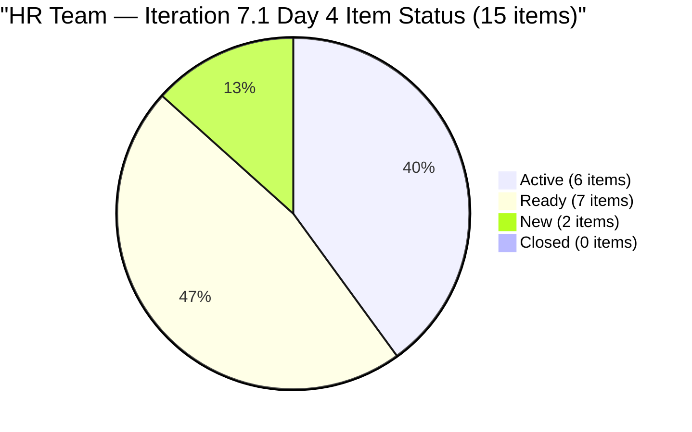
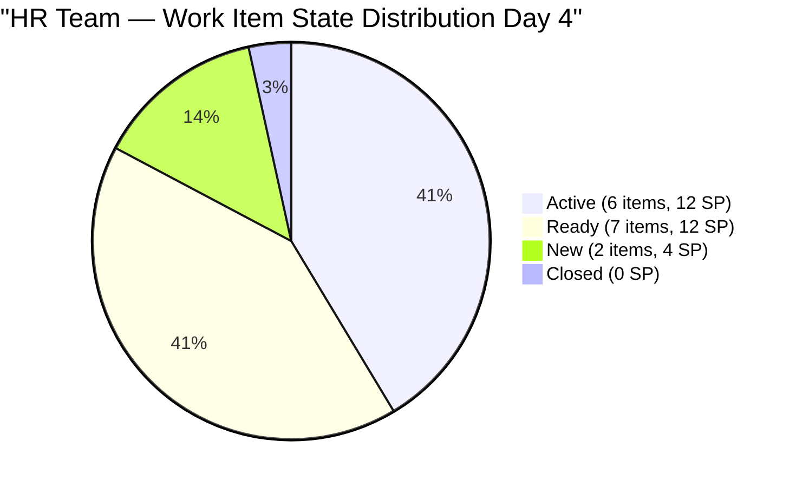

# SAFe Audit Report — Human Resource Recruitment Team

## 1. Audit Metadata

| Field | Value |
|-------|-------|
| **ADO Project** | Jairosoft FINOPS |
| **ADO Project ID** | `e0bb302f-40f9-46c3-8164-6f1acb317d63` |
| **Team** | Human Resource Recruitment Team |
| **Team ID** | `248f59a6-372c-4b74-8129-9eaf260f211e` |
| **Workspace** | `ado_hr` |
| **Board URL** | [Stories and Deliverables](https://dev.azure.com/jairo/Jairosoft%20FINOPS/_boards/board/t/Human%20Resource%20Recruitment%20Team/Stories%20and%20Deliverables) |
| **Backlog** | Microsoft.RequirementCategory (Stories and Deliverables) |
| **Current Iteration** | Iteration 7.1 |
| **Iteration Path** | `Jairosoft FINOPS\2026-PI7\Iteration 7.1` |
| **Iteration ID** | `82cc2229-0211-4fe2-9ee6-cc8d843dfab0` |
| **Iteration Start** | April 6, 2026 |
| **Iteration Finish** | April 19, 2026 |
| **Sprint Day** | Day 4 of 14 (Thursday, Apr 9) |
| **Audit Date** | April 9, 2026 — 09:00 PHT |
| **Previous Audit** | `AUDIT_20260408_0900.md` (Iteration 7.1 Day 3, Score 75.6/100 Moderate Risk) |
| **Overall Score** | **76.1 / 100 (Moderate Risk)** |
| **Scoring Rubric** | ADO SAFe v1 (seven-dimension deterministic scoring) |
| **Auditor** | AI EngProd Consultant |
| **Framework** | SAFe 6.0 |
| **Audit Series** | #28 |

> **Scope note:** This audit covers only the HR Recruitment Team board in Jairosoft FINOPS. No other boards, teams, projects, or repositories were analyzed.

---

## 2. Executive Summary

This is the **28th audit in the series** and the **fourth audit of Iteration 7.1** — Sprint Day 4 of 14.

The overall score moves from **75.6 to 76.1 (Moderate Risk)**, a gain of **+0.5 points**. The improvement is driven by the re-emergence of items #202270 (Client Interview — Verano) and #202314 (Client Interview — Pabatao) in today's backlog API response, restoring the current iteration root count from 13 to **15 items**. Both items now show as **New** state (previously flagged as an evidence gap in the Day 3 audit) with ChangedDate of April 9, confirming they are active 7.1 commitments.

Key developments since Day 3:

- **Items #202270 and #202314 resolved**: Both Client Interview stories are now confirmed in the backlog API with IterationPath = 7.1. The evidence gap from Day 3 is closed.
- **All 6 Active items remain in motion**: No new closures but active engagement continues — Almera has 1 day off today (Apr 9 is her recorded day off)
- **Iteration Planning recovers to 62.5**: 15 of 24 visible items in 7.1 (up from 13/22 = 59.1 on Day 3)
- **0 closures** — Delivery Predictability remains at 0.0 on Day 4 as expected
- **Committed SP increases to 28** (adding 4 SP from the two recovered items; up from 24 SP on Day 3)

The sprint is at 28.6% elapsed (4 of 14 days). With Almera on leave today, the active engagement is on pause until tomorrow. First closures are expected in the Apr 13–14 window based on the Sr. Tech Lead sequential interview pipeline.



---

## 3. Previous Audit Delta

**Previous:** AUDIT_20260408_0900 — Iteration 7.1 Day 3, 09:00 PHT

| Metric | 7.1 Day 3 (Apr 8) | **7.1 Day 4 (Apr 9)** | Delta |
|--------|-------------------|----------------------|-------|
| Iteration | 7.1 Day 3 | **7.1 Day 4** | +1 day |
| Visible Backlog | 22 | **24** | **+2** (#202270 and #202314 re-appear) |
| Current Iteration Items | 13 | **15** | **+2** (evidence gap closed) |
| Items Active | 6 | **6** | 0 |
| Items Ready | 7 | **7** | 0 |
| Items New | 0 | **2** | **+2** (#202270, #202314) |
| Items Closed | 0 | **0** | 0 |
| Committed SP | 24 | **28** | **+4** (2 SP each for #202270 and #202314) |
| SP Burned | 0 | **0** | 0 |
| Overall Score | 75.6 (Moderate) | **76.1 (Moderate)** | **+0.5** |
| Iteration Planning | 59.1 | **62.5** | **+3.4** |
| Team Capacity | 100.0 | **100.0** | 0 |
| Estimation | 100.0 | **100.0** | 0 |
| DoR Compliance | 100.0 | **100.0** | 0 |
| Work Item Balance | 70.0 | **70.0** | 0 |
| Backlog Refinement | 100.0 | **100.0** | 0 |
| Delivery Predictability | 0.0 | **0.0** | 0 (Day 4) |

**Key changes since Day 3:**

1. **Items #202270 and #202314 resolved** — Both Client Interview stories re-appear in backlog API with IterationPath confirmed as 7.1; ChangedDate updated to Apr 9 (both marked New). Evidence gap from Day 3 fully closed.
2. **Committed SP grows to 28** — Two additional 2-SP items bring total from 24 to 28 SP.
3. **Iteration Planning recovers** — 15/24 = 62.5, recovering the 3.4-point dip from Day 3.
4. **No closures** — Almera's day off (Apr 9) means no activity expected today; sprint engagement resumes Apr 10.

---

## 4. Current Iteration Snapshot

### 4.1 Iteration Overview

| Metric | Value |
|--------|-------|
| Iteration | Iteration 7.1 |
| Date Range | April 6 - April 19, 2026 (14 days) |
| Sprint Day | Day 4 of 14 (~29% elapsed) |
| Items Confirmed in 7.1 | 15 |
| Items Active | 6 |
| Items Ready | 7 |
| Items New | 2 |
| Items Closed | 0 |
| Story Points Committed | 28 SP |
| SP Burned | 0 SP |
| SP Remaining | 28 SP |
| Sprint Status | **IN PROGRESS — Building Momentum (Day Off)** |

### 4.2 Team Capacity

| Member | Activities | Capacity/Day | Days Off |
|--------|-----------|-------------|----------|
| Almera Kleer Tayao | Documentation (4h), Requirements (1h) | **5 h/day** | **Apr 9** (today) |
| **Total** | | **5 h/day** | 1 day |

**Capacity assessment:** 5 h/day × 11 remaining working days (Apr 10–19) = 55 hrs available. 28 SP at ~2 hrs/SP = ~56 hrs estimated effort. Load remains tight; no buffer. Almera returns Apr 10.

### 4.3 Current Iteration Items (15 items — fully confirmed in Iteration 7.1)

| # | ID | Title | Type | State | SP | Changed |
|---|----|----|------|-------|-----|---------|
| 1 | 193582 | APE - Caumban, Karl Jordan | User Story | **Active** | 2 | Apr 7 |
| 2 | 197939 | Communication Skills Proposals Summary Presentation | User Story | Ready | 2 | Apr 7 |
| 3 | 200671 | LinkedIn Tech Sales from Manila Hiring | User Story | Ready | 1 | Apr 7 |
| 4 | 200677 | Technical Interviews of qualified applicants | User Story | Ready | 2 | Apr 7 |
| 5 | 201272 | LinkedIn Bubble Developer Hiring - Interview | User Story | Ready | 2 | Apr 7 |
| 6 | 201483 | Result Reading with Doc Karl for Davao/Cebu employees | User Story | **Active** | 2 | Apr 8 |
| 7 | 202093 | LinkedIn DevOps Engr. Hiring - PI7 | User Story | Ready | 2 | Apr 7 |
| 8 | 202099 | Annual Medical Check-up — Cebu Employees - PI7 | User Story | Ready | 1 | Apr 7 |
| 9 | 202270 | Client Interview \| Sr. Tech Lead - Verano, Mark | User Story | **New** | 2 | **Apr 9** |
| 10 | 202314 | Client Interview \| Sr. Tech Lead - Pabatao, Vincent | User Story | **New** | 2 | **Apr 9** |
| 11 | 202330 | Sr. Tech Lead - Buenaventura, Sidney | User Story | **Active** | 2 | Apr 7 |
| 12 | 202335 | Sr. Tech Lead - Beltran, Ken Henson | User Story | **Active** | 2 | Apr 8 |
| 13 | 202340 | Sr. Tech Lead - Barua, Marlo | User Story | **Active** | 2 | Apr 8 |
| 14 | 202342 | Data Reconciliation & Eligibility | User Story | **Active** | 2 | Apr 7 |
| 15 | 202344 | Cash Conversion Calculation | User Story | Ready | 2 | Apr 7 |
| | **Total** | | | **6 Active / 7 Ready / 2 New** | **28 SP** | |

### 4.4 Non-Current Backlog Items (9 items in Iteration 7.2)

Items #201273, #202017, #202022, #202039, #202042, #202104, #202109, #202114, #202349 remain assigned to Iteration 7.2. This reflects the proactive backlog hygiene action taken on Apr 8. These items are counted in the visible backlog (24 total) but not in the current iteration scope.

---

## 5. Work Item Analysis

### 5.1 Work Item Type Distribution (Current Iteration — 15 items)

| Type | Count | Share | SP |
|------|-------|-------|----|
| User Story | 15 | 100% | 28 SP |
| **Total** | **15** | **100%** | **28 SP** |

All 15 current items are User Stories. The 100% type concentration triggers the dominant-type penalty (−30) in Work Item Balance. The two recovered items (#202270, #202314) are both User Stories in the sequential Sr. Tech Lead hiring pipeline — appropriate type for these activities.

### 5.2 State Distribution (Current Iteration — 15 items)

| State | Count | SP |
|-------|-------|----|
| Active | 6 | 12 SP |
| Ready | 7 | 12 SP |
| New | 2 | 4 SP |
| Closed | 0 | 0 SP |
| **Total** | **15** | **28 SP** |

6 of 15 items (40%) are Active on Day 4. The two Client Interview items (#202270, #202314) are in New state — these represent downstream steps in the Sr. Tech Lead recruitment pipeline and are expected to activate after the current Active interview items close.



### 5.3 DoR Compliance Assessment

All 15 confirmed current iteration items pass DoR thresholds:

- All have Description content >= 30 non-whitespace characters (user story format with "I want to... so that..." structure)
- All have Acceptance Criteria >= 20 non-whitespace characters (measurable metrics included)
- Items #202270 and #202314 have well-formed ACs with 6 measurable criteria each
- DoR compliance = 15/15 = **100%**

Noted: #201272 still references "Iteration 6.5" in its target date — this acceptance criteria staleness was flagged in prior audits and remains unresolved. Similarly #202093 references "Iteration 6.5" target. Neither prevents DoR passage (content thresholds are met) but should be updated for accuracy.

### 5.4 Freshness Assessment (All 24 Visible Backlog Items)

Reference dates (relative to Apr 9, 2026):

- **Fresh threshold:** February 23, 2026 (45 days prior)
- **Stale-90 threshold:** January 9, 2026 (90 days prior)
- **Stale-180 threshold:** October 12, 2025 (180 days prior)

| Metric | Value | Status |
|--------|-------|--------|
| Fresh (changed after Feb 23) | 24/24 (100%) | Base = 100.0 |
| Stale-90 (changed before Jan 9) | 0/24 (0%) | No penalty |
| Stale-180 (changed before Oct 12, 2025) | 0/24 (0%) | No penalty |
| Untouched current items (changed before Apr 6) | 0/15 (0%) | No penalty |

All 24 visible backlog items have been modified since late March 2026. All 15 current iteration items were last changed on Apr 7 or later — zero untouched penalty. Backlog Refinement remains perfect for the **eleventh consecutive audit**.

---

## 6. SAFe Compliance Scorecard

| # | Dimension | Score | Formula | Evidence | Notes |
|---|-----------|-------|---------|----------|-------|
| 1 | **Iteration Planning** | **62.5** | 15/24 × 100 | 15 of 24 visible items in 7.1 | +3.4 vs Day 3; #202270/#202314 re-confirmed |
| 2 | **Team Capacity** | **100.0** | 1/1 × 100 | Almera: 5 h/day configured | Bus factor = 1; day off Apr 9 |
| 3 | **Estimation** | **100.0** | 15/15 × 100 | All 15 current items have SP > 0 | Range: 1–2 SP; total = 28 SP |
| 4 | **DoR Compliance** | **100.0** | 15/15 × 100 | All pass Desc ≥ 30 AND AC ≥ 20 chars | Stale AC target dates noted (non-blocking) |
| 5 | **Work Item Balance** | **70.0** | 100 − 30 | US present (no −40); 100% dominant (−30) | No Spikes or Enablers |
| 6 | **Backlog Refinement** | **100.0** | 100.0 − 0 | 24/24 fresh; 0 stale; 0 untouched | 11th consecutive perfect score |
| 7 | **Delivery Predictability** | **0.0** | 0/28 × 100 | 0 of 28 committed SP closed | Day 4 — Almera on leave today |
| | **Overall** | **76.1** | 532.5 / 7 | **Moderate Risk (60–79.9)** | +0.5 vs Day 3 |

### Score Computation Detail

```
Iteration Planning:       round(15/24 × 100, 1)        = 62.5
Team Capacity:            round(1/1 × 100, 1)           = 100.0
Estimation:               round(15/15 × 100, 1)         = 100.0
DoR Compliance:           round(15/15 × 100, 1)         = 100.0
Work Item Balance:
  User Story present: no −40 penalty
  dominant_type = 15/15 = 100% > 60%: −30
  spike_share = 0%: no −20
  Result: 100 − 30                                      = 70.0
Backlog Refinement:
  base = round(24/24 × 100, 1)                         = 100.0
  stale_90: 0/24 = 0% → no penalty
  stale_180: 0 → no penalty
  untouched: 0/15 = 0% → no penalty
  Result:                                               = 100.0
Delivery Predictability:  round(0/28 × 100, 1)          = 0.0
  (early sprint annotation: Day 4 of 14, Almera on leave today)

Overall: (62.5 + 100.0 + 100.0 + 100.0 + 70.0 + 100.0 + 0.0) / 7
       = 532.5 / 7
       = 76.1 (Moderate Risk)
```

### Score Trend — Last 7 Audits

| Audit Date | Iteration | Day | Score | Band |
|------------|-----------|-----|-------|------|
| Apr 4 | 6.6 IP | Day 13 | 26.7 | Critical (artifact) |
| Apr 5 | 6.6 IP | Day 14 | 22.9 | Critical (artifact) |
| Apr 6 | 7.1 | Day 1 | 76.1 | Moderate |
| Apr 7 | 7.1 | Day 2 | 76.1 | Moderate |
| Apr 8 | 7.1 | Day 3 | 75.6 | Moderate |
| **Apr 9** | **7.1** | **Day 4** | **76.1** | **Moderate** |

```mermaid
xychart-beta
```

```mermaid
bar
    title SAFe Dimension Scores — HR Team Day 4
    x-axis [IP, TC, Est, DoR, WIB, BR, DP]
    y-axis 0 --> 100
    bar [62.5, 100, 100, 100, 70, 100, 0]
```

### Score Trajectory to Low Risk

For the overall score to reach Low Risk (80.0), Delivery Predictability must improve. When Almera closes items:

| SP Closed | DP Score | Projected Overall |
|-----------|----------|------------------|
| 0 (today) | 0.0 | **76.1 (Moderate)** |
| 7 SP (~25%) | 25.0 | 79.7 (Moderate borderline) |
| 8 SP | 28.6 | 80.1 (Low Risk) |
| 14 SP (50%) | 50.0 | 83.2 (Low Risk) |
| 28 SP (100%) | 100.0 | 90.4 (Low Risk) |

**First Low Risk target: 8 SP closed** — achievable with 4 closures of 2 SP items each. With 6 items Active and Almera returning Apr 10, this is attainable by Day 7 (Apr 13).

---

## 7. Dimension Findings

### 7.1 Iteration Planning (62.5/100) — STABLE (recovered +3.4)

15 of 24 visible backlog items are committed to Iteration 7.1. The previous Day 3 dip to 59.1 (when only 13 items appeared in the API) has been resolved with the re-confirmation of #202270 and #202314. The 9 non-current items (in 7.2) and their assignment is now stable. The score is firmly in Moderate territory — recovery to >80 would require moving additional 7.2 items into 7.1 scope, which is not recommended mid-sprint. Focus should remain on delivery.

**Note on recovered items:** #202270 (Verano) and #202314 (Pabatao) are logical downstream items in the Sr. Tech Lead hiring funnel — they represent the client interview stage following the internal interviews (Buenaventura, Beltran, Barua) currently Active in the sprint. The workflow dependency is appropriate.

### 7.2 Team Capacity (100.0/100) — FULL

Almera is on her scheduled day off today (Apr 9). Capacity is configured at 5 h/day with 1 day off recorded for the iteration. Bus factor = 1 remains a structural risk across all 28 audits — unchanged and unresolved. Grace continues to show 0 capacity with no active work items.

### 7.3 Estimation (100.0/100) — FULL

All 15 current items have Story Points > 0. Committed total = 28 SP. Estimation discipline remains perfect across the entire PI7 series. #202270 and #202314 each have 2 SP assigned — correctly estimated for a client interview coordination task.

### 7.4 DoR Compliance (100.0/100) — FULL

All 15 items have well-structured Descriptions and Acceptance Criteria exceeding minimum thresholds. The two recovered Client Interview stories (#202270, #202314) have identical, thorough ACs with 6 measurable criteria — both referencing the correct Iteration 7.1 target.

Persistent stale reference issue: #201272 and #202093 reference "Iteration 6.5" in their target dates. This has been flagged across 3 consecutive audits without resolution. While it does not affect DoR pass/fail, it is a quality concern for sprint accuracy.

### 7.5 Work Item Balance (70.0/100) — STABLE (unchanged)

All 15 items are User Stories. The structural 100% concentration penalty (-30) applies. The two client interview items are appropriate User Story types. No Spikes or Enablers present. This score will not improve without the addition of a Spike or Enabler type item — recommended in prior audits but not yet acted upon.

### 7.6 Backlog Refinement (100.0/100) — PERFECT (11th consecutive)

All 24 visible backlog items have been modified since Feb 23, 2026 (fresh threshold). All 15 current iteration items were last changed on Apr 7 or Apr 9 — zero untouched items. The active backlog hygiene demonstrated across 28 consecutive audits is the team's single strongest SAFe practice.

### 7.7 Delivery Predictability (0.0/100) — EARLY SPRINT (Day 4, Day Off)

0 of 28 committed SP are closed. Almera is on leave today. Based on historical delivery patterns from Iteration 6.5 (where closures accelerated in the final 5 days), first closures are projected for the Apr 13–14 window. The Client Interview pipeline (Active: Buenaventura, Beltran, Barua → New: Verano, Pabatao) suggests that closing the internal interview items will trigger the client interview steps, creating a natural cadence of closures in the second half of the sprint.

**Early-sprint annotation:** Day 4 of 14, Almera on scheduled leave. Low delivery expected today. Score suppression is expected and appropriate at this stage.

---

## 8. Risks and Bottlenecks

| # | Risk | Severity | Status | Mitigation |
|---|------|----------|--------|------------|
| R1 | **Bus factor = 1** | Critical (Structural) | Unchanged — 28 consecutive audits | All 15 items assigned to Almera alone; single point of failure |
| R2 | **28 SP / 11 remaining days / 1 person (on leave today)** | Moderate | Monitoring | Tight but feasible at historical velocity; ~2.5 SP/day needed from Apr 10 |
| R3 | **Delivery Predictability = 0.0 (Day 4)** | Low (Early Sprint) | Expected | 6 items Active; first closures projected Apr 13–14 |
| R4 | **Iteration Planning at 62.5 — below Low Risk threshold** | Moderate | Stable | Structural; 9 items in 7.2 reduce ratio; cannot recover this sprint |
| R5 | **No iteration goal defined** | High | Unchanged — 28 consecutive audits | Mandatory SAFe artifact; absent entire audit series |
| R6 | **No PI objectives linked** | High | Unchanged | Feature-to-PI linkage absent throughout PI7 |
| R7 | **Stale target dates in acceptance criteria** | Low | Persists (3 audits) | #201272 and #202093 reference Iteration 6.5; #201483 references March 27 |
| R8 | **Grace at 0 capacity** | Low (Structural) | Unchanged — 28 audits | Role unclear; 0 capacity for entire audit history |
| R9 | **Client Interview pipeline dependency** | Moderate | New | #202270 and #202314 depend on #202330, #202335, #202340 closing first |

---

## 9. Prioritized Recommendations

### P0 — Urgent (Today / Tomorrow)

1. **Define Iteration 7.1 sprint goal before Day 5 (Apr 10).** Suggested: *"Complete Sr. Tech Lead candidate evaluations (Buenaventura, Beltran, Barua) and advance to client interviews (Verano, Pabatao); finalize APE for Karl; complete Data Reconciliation and Medical Check-up."* This is the most persistent gap in the audit series (28 consecutive audits without a sprint goal).

2. **Begin closure of Active items starting Apr 10.** Six items are Active. Priority closure sequence: (a) APE - Karl (#193582, 2 SP) — ready for completion; (b) Data Reconciliation (#202342, 2 SP) — analytical work in progress; (c) Sr. Tech Lead Buenaventura (#202330, 2 SP). Even 8 SP closed by Day 6 (Apr 11) pushes DP to 28.6 and overall score to 80.1 (Low Risk).

### P1 — This Week

1. **Activate and close the Client Interview items (#202270, #202314) once prerequisites complete.** These New items represent the client-side evaluation of Verano and Pabatao. As soon as the internal interview items (#202330, #202335, #202340) close, move these to Active and coordinate client interview scheduling.

2. **Update stale acceptance criteria in #201272, #202093.** Both reference "Iteration 6.5" targets. Update to "Iteration 7.1" for documentation accuracy. This has been flagged for 3 consecutive audits.

### P2 — This Sprint

1. **Add one Spike or Enabler item.** The SL Cash Conversion workflow (Data Reconciliation → Cash Conversion Calculation → Finance Export) involves formula research and data analysis — this is spike-eligible work. Adding 1 Spike would reduce the 100% User Story concentration below 60%, lifting Work Item Balance from 70 to 100 and improving the overall score by approximately 4.3 points.

2. **Assign PI objectives and link Features to 7.1 stories.** Features #200671, #200677 have children in 7.1 but no PI7 objective linkage is visible.

### P3 — Structural

1. **Define Grace's role.** 28 consecutive audits show 0 capacity. Either assign active work or remove from the team configuration.

2. **Document a bus factor mitigation plan.** Identify 1 backup resource who can handle at minimum the administrative HR tasks (scheduling, documentation) in case of Almera's unavailability for more than 1 day.

---

## 10. Evidence Gaps and Limitations

| Gap | Impact | Notes |
|-----|--------|-------|
| **Items #202270 and #202314 — Day 3 evidence gap resolved** | Resolved ✓ | Both items confirmed in API today with IterationPath = 7.1 and ChangedDate = Apr 9 |
| **Delivery Predictability = 0.0 (Day 4)** | Score suppressed; expected | Will improve as items close; target: 8 SP by Day 6 (Low Risk boundary) |
| **Almera on leave today (Apr 9)** | No activity expected | Scheduled day off; sprint resumes Apr 10 |
| **No iteration goal in ADO** | Cannot verify sprint goal via API | Absent across all 28 audits |
| **PI Objectives not verifiable** | Cannot confirm Feature-to-PI linkage | Structural gap |
| **Stale AC target dates on #201272, #202093, #201483** | DoR quality concern | References to Iteration 6.5 and March 2026 targets not updated |
| **No GitHub repositories scoped** | No code delivery evidence | HR work is non-code; expected |
| **Grace not on 7.1 capacity** | Grace's role unclear | 0 capacity across 28 audits |

---

*Report generated: April 9, 2026 09:00 PHT | SAFe 6.0 Framework | Jairosoft FINOPS — HR Recruitment Team*
*Iteration 7.1: Apr 6 – Apr 19, 2026 | Day 4 of 14 | Audit #28 in series*
*Score: 76.1/100 (Moderate Risk) | Previous: AUDIT_20260408_0900 (75.6/100 Moderate Risk — +0.5)*
*15 items confirmed in 7.1 (inc. #202270 and #202314 resolved) | 6 Active | 0 SP closed | 28 SP committed*
