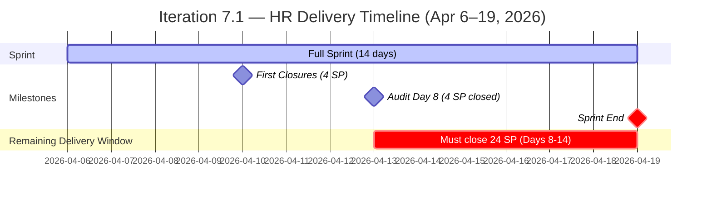
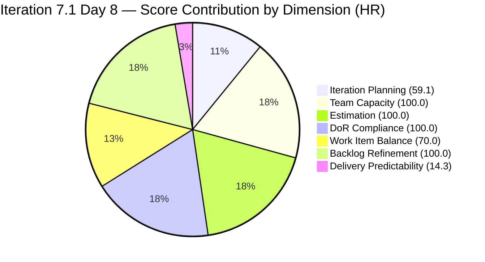

# Audit Report — Human Resource Recruitment Team
## Iteration 7.1 | Day 8 of 14 | Second-Half Sprint Check

---

## 1. Audit Metadata

| Field | Value |
|-------|-------|
| **Audit Number** | #30 |
| **Audit Date** | April 13, 2026, 09:00 PHT |
| **Auditor** | Ramon Aseniero, SAFe Agile PM Consultant |
| **Team** | Human Resource Recruitment Team |
| **ADO Project** | Jairosoft FINOPS |
| **Workspace** | `ado_hr` |
| **Iteration** | Iteration 7.1 — Apr 6–19, 2026 |
| **Sprint Day** | Day 8 of 14 (57% elapsed — Second Half) |
| **Prior Audit** | AUDIT_20260412_0900.md (Day 7, Score 75.6 Moderate Risk) |
| **Report Path** | `ado_hr/audit/AUDIT_20260413_0900.md` |

---

## 2. Executive Summary

The HR Recruitment Team enters Day 8 with a score of **77.6 (Moderate Risk)**, a meaningful improvement of **+2.0 points** from Day 7 (75.6). The key driver of improvement is **confirmed delivery**: two Client Interview stories for Sr. Tech Lead candidates (Verano and Pabatao — IDs 202270 and 202314) were closed on April 10, representing **4 SP delivered** from an overall iteration commitment of 28 SP. This is the team's first delivery signal in Iteration 7.1.

The Delivery Predictability score of 14.3 remains below threshold, reflecting that 4 of 28 committed story points have been delivered with 6 days remaining. The sprint now must accelerate: with 24 SP open across 13 visible items, Almera needs to sustain a pace of approximately **4 SP/day** over the final 6 working days to approach full delivery.

Structural risks remain unchanged: bus factor of 1, no iteration goal, and 100% User Story type dominance. However, the backlog is pristine (all 22 items touched within 7 days), DoR and Estimation are perfect, and capacity is correctly configured.

**The sprint has turned the corner. The team must sustain and accelerate closures in Days 8–14.**

---

## 3. Previous Audit Delta

| Dimension | Day 7 (Apr 12) | Day 8 (Apr 13) | Change |
|-----------|----------------|----------------|--------|
| Iteration Planning | 59.1 | 59.1 | 0.0 |
| Team Capacity | 100.0 | 100.0 | 0.0 |
| Estimation | 100.0 | 100.0 | 0.0 |
| DoR Compliance | 100.0 | 100.0 | 0.0 |
| Work Item Balance | 70.0 | 70.0 | 0.0 |
| Backlog Refinement | 100.0 | 100.0 | 0.0 |
| Delivery Predictability | 0.0 | 14.3 | **+14.3** |
| **Overall** | **75.6** | **77.6** | **+2.0** |
| **Risk Band** | Moderate | Moderate | — |

**Key changes since Day 7 (Apr 12):**
- **First closures recorded** — Items 202270 (Client Interview / Verano, Mark) and 202314 (Client Interview / Pabatao, Vincent) both Closed on Apr 10, 2 SP each = 4 SP delivered. These are no longer in the visible backlog.
- **Delivery Predictability recovers from 0.0 to 14.3** — Sprint is no longer at zero delivery. Trajectory improving but pace still below target.
- All other dimensions stable; no new items added or removed from active backlog.

---

## 4. Current Iteration Snapshot

| Metric | Value |
|--------|-------|
| Visible Root Backlog Items | 22 |
| Items in Iteration 7.1 (visible) | 13 |
| Closed Items (iteration query, removed from backlog) | 2 (202270, 202314) |
| Total Committed Story Points (all iteration items) | 28 SP |
| Closed Story Points | 4 SP (14.3%) |
| Remaining Open Story Points | 24 SP |
| Sprint Elapsed | 57% (Day 8/14) |
| Days Remaining | 6 |
| Required Pace to Complete | ~4.0 SP/day |
| Active Members | 1 (Almera Kleer Tayao) |
| Total Capacity/Day | 5 h (4h Documentation + 1h Requirements) |
| Days Off This Iteration | 1 (Apr 9 — already taken) |

### State Distribution (13 visible current items)

| State | Count | Items |
|-------|-------|-------|
| Active | 5 | 193582, 202330, 202335, 202340, 202342, 201483 |
| Ready | 7 | 197939, 200671, 200677, 201272, 202093, 202099, 202344 |
| Closed (removed from backlog) | 2 | 202270, 202314 |

*Note: Active count = 6 (not 5) — 193582, 202330, 202335, 202340, 202342, 201483 are all Active.*

### Revised State Distribution

| State | Count | Items |
|-------|-------|-------|
| Active | 6 | 193582, 202330, 202335, 202340, 202342, 201483 |
| Ready | 7 | 197939, 200671, 200677, 201272, 202093, 202099, 202344 |
| Closed (out of backlog) | 2 | 202270, 202314 |

---

## 5. Work Item Analysis

### Iteration 7.1 — Visible Open Items (13)

| ID | Title | Type | State | SP | Assignee | Last Changed |
|----|-------|------|-------|----|----------|-------------|
| 193582 | APE — Caumban, Karl Jordan | US | Active | 2 | Almera | Apr 7 |
| 197939 | Communication Skills Proposals Summary Presentation | US | Ready | 2 | Almera | Apr 7 |
| 200671 | LinkedIn Tech Sales from Manila Hiring | US | Ready | 1 | Almera | Apr 7 |
| 200677 | Technical Interviews of Qualified Applicants | US | Ready | 2 | Almera | Apr 7 |
| 201272 | LinkedIn Bubble Developer Hiring — Interview | US | Ready | 2 | Almera | Apr 7 |
| 201483 | Result Reading with Doc Karl (Davao/Cebu employees) | US | Active | 2 | Almera | Apr 8 |
| 202093 | LinkedIn DevOps Engr. Hiring — PI7 | US | Ready | 2 | Almera | Apr 7 |
| 202099 | Annual Medical Check-up — Cebu Employees PI7 | US | Ready | 1 | Almera | Apr 7 |
| 202330 | Sr. Tech Lead — Buenaventura, Sidney | US | Active | 2 | Almera | Apr 7 |
| 202335 | Sr. Tech Lead — Beltran, Ken Henson | US | Active | 2 | Almera | Apr 8 |
| 202340 | Sr. Tech Lead — Barua, Marlo | US | Active | 2 | Almera | Apr 8 |
| 202342 | Data Reconciliation & Eligibility (Sick Leave) | US | Active | 2 | Almera | Apr 7 |
| 202344 | Cash Conversion Calculation (Sick Leave) | US | Ready | 2 | Almera | Apr 7 |

**Visible committed: 13 items / 24 SP | 0 visible items closed**

### Closed Items Detected in Iteration Query (Removed from Backlog)

| ID | Title | Type | State | SP | Closed Date |
|----|-------|------|-------|----|-------------|
| 202270 | Client Interview — Sr. Tech Lead Verano, Mark | US | Closed | 2 | Apr 10 |
| 202314 | Client Interview — Sr. Tech Lead Pabatao, Vincent | US | Closed | 2 | Apr 10 |

**Total closed this iteration: 2 items / 4 SP**

### DoR Verification (All 13 visible current items)

All 13 items verified against DoR criteria:
- Description ≥ 30 non-whitespace characters: **13/13 PASS**
- Acceptance Criteria ≥ 20 non-whitespace characters: **13/13 PASS**

**DoR Compliance: 100% (13/13)**

### Backlog Items in 7.2 (Future Sprint Planning)

| ID | Title | Iteration | State | SP |
|----|-------|-----------|-------|-----|
| 201273 | LinkedIn Bubble Trainer Hiring — Interview | 7.2 | New | 2 |
| 202017 | Sr. Tech Lead — Mark Jovet Verano — Client Interview & Decision | 7.2 | New | 2 |
| 202022 | Sr. Tech Lead — Stephen Pabatao — Client Interview & Decision | 7.2 | New | 2 |
| 202039 | Sales & Mktg. — John Dave Fernandez (Decision) | 7.2 | New | 1 |
| 202042 | Sales & Mktg. — Edgardo Rojas Jr. (Final Decision) | 7.2 | New | 1 |
| 202104 | APE — Rommel Senillo — Summary PI7 | 7.2 | New | 2 |
| 202109 | APE — Calvin John Dalino — Summary PI7 | 7.2 | New | 2 |
| 202114 | APE — Ryan Vince Castillo — PI7 | 7.2 | New | 2 |
| 202349 | Finance Reporting & Export | 7.2 | Ready | 2 |

---

## 6. SAFe Compliance Scorecard

| Dimension | Score | Evidence | Notes |
|-----------|-------|----------|-------|
| Iteration Planning | 59.1 | 13 of 22 visible items in 7.1 | Stable; 9 items planned for 7.2 |
| Team Capacity | 100.0 | 1 contributor with work / 1 with capacity | Almera 5h/day; Grace at 0h not sprint-assigned |
| Estimation | 100.0 | 13/13 point-eligible items estimated | Sustained 100% across all PI7 audits |
| DoR Compliance | 100.0 | 13/13 items pass Desc+AC checks | Fourth consecutive 100% DoR audit |
| Work Item Balance | 70.0 | 100% User Story; dominant type >60% → -30 | Structural characteristic of HR work type |
| Backlog Refinement | 100.0 | 22/22 items fresh (≤45 days); 0 stale; 0 untouched sprint items | All sprint items touched Apr 7–8 |
| Delivery Predictability | 14.3 | 4 SP closed / 28 SP total committed | First closures on Apr 10; 24 SP remain in 6 days |
| **Overall** | **77.6** | | **Moderate Risk** |

### Score Computation Detail

```
1. Iteration Planning   = round(13 / 22 × 100, 1) = 59.1
2. Team Capacity        = round(1 / 1 × 100, 1)   = 100.0
3. Estimation           = round(13 / 13 × 100, 1)  = 100.0
4. DoR Compliance       = round(13 / 13 × 100, 1)  = 100.0
5. Work Item Balance    = 100 − 30 (US dominant >60%) = 70.0
6. Backlog Refinement   = 100.0 (base: 22/22 fresh)
                          − 0 (stale_90/visible = 0%)
                          − 0 (stale_180 = 0)
                          − 0 (untouched/current = 0/13 = 0%)
                          = 100.0
7. Delivery Predictability:
   committed_SP = 24 SP (visible) + 4 SP (closed/removed) = 28 SP total
   closed_SP = 4 SP (202270 + 202314)
   = round(4 / 28 × 100, 1) = round(14.286, 1) = 14.3

Overall = round((59.1 + 100.0 + 100.0 + 100.0 + 70.0 + 100.0 + 14.3) / 7, 1)
        = round(543.4 / 7, 1)
        = round(77.629, 1)
        = 77.6  →  MODERATE RISK (60–79.9)
```

---

## 7. Dimension Findings

### 7.1 Iteration Planning — 59.1 (Stable, Below Threshold)
The sprint carries 13 of 22 visible backlog items (59.1%). This ratio is stable from Day 7 — no new items were added to or removed from the sprint scope. Nine items are correctly staged for 7.2 (future iterations), which reflects deliberate sprint partitioning. The 59.1 score is slightly below the 60-point boundary, a recurring characteristic of this team due to the healthy 7.2 pipeline maintained for forward planning.

### 7.2 Team Capacity — 100.0 (Excellent)
Almera remains the sole active contributor with 5h/day configured capacity (4h Documentation + 1h Requirements). Grace appears in the team member list with 0 capacity and no sprint assignments. The 1-day leave on April 9 was already consumed; no additional days off are recorded for the remainder of the iteration.

### 7.3 Estimation — 100.0 (Excellent)
All 13 sprint items carry story points (1–2 SP). The total committed load of 28 SP (including 4 closed) is well within the sprint boundary for a solo contributor at 5h/day over 14 days.

### 7.4 DoR Compliance — 100.0 (Excellent)
Fourth consecutive audit with 100% DoR compliance. All 13 visible items maintain well-structured descriptions (As a / I want to / So that format) with specific, measurable acceptance criteria. The two closed items (202270, 202314) also had full DoR before closure.

### 7.5 Work Item Balance — 70.0 (Structural Deficit)
The sprint contains 13/13 User Stories (100%). The dominant type penalty (-30) applies consistently. As noted across all 30 audits, HR work maps naturally to User Stories, and the absence of Spikes or research-type items is a structural team characteristic, not a correctable planning deficiency.

### 7.6 Backlog Refinement — 100.0 (Excellent)
All 22 visible backlog items have been modified within the last 7 days (Apr 6–8). Zero items exceed the 90-day stale threshold. Zero items in the current sprint were untouched since sprint start — all 13 visible sprint items were last updated Apr 7–8. The backlog is in optimal health.

### 7.7 Delivery Predictability — 14.3 (Critical, Improving)
The team recorded its first closures on April 10 (Day 5): two Sr. Tech Lead Client Interview stories for Verano (202270, 2 SP) and Pabatao (202314, 2 SP) were closed. This brings the sprint to 4/28 SP delivered (14.3%).

With 24 SP remaining and 6 working days left (Apr 13–19), the required burn rate is **~4.0 SP/day**. This is achievable for Almera based on her historical sprint pattern — in Iteration 6.5, she closed 12 items / 23 SP on a single day (Mar 18). However, that pace requires deliberate focus.

The 7 items currently in "Ready" state are the most actionable candidates for immediate closure (#202099 Annual Medical Check-up, #200671 LinkedIn Tech Sales — both 1 SP are likely completion-ready).

---

## 8. Risks and Bottlenecks



| # | Risk | Severity | Status |
|---|------|----------|--------|
| R1 | **24 SP open at Day 8 with 6 days remaining** — Requires ~4 SP/day sustained pace to avoid delivery shortfall. | HIGH | Active — monitoring |
| R2 | **Bus Factor = 1** — Almera is the sole contributor; any leave or block stops all delivery immediately. | HIGH | Structural, persistent (30 audits) |
| R3 | **No iteration goal** — Sprint has no defined outcome statement across 30 audits. Prioritization remains ad-hoc. | HIGH | Persistent, unfixed |
| R4 | **Iteration Planning below 60%** — 13/22 = 59.1%; just under boundary. Acceptable given the healthy 7.2 pipeline. | LOW-MODERATE | Stable |
| R5 | **100% User Story type dominance** — No type diversity; structural HR characteristic. | LOW | Structural |

---

## 9. Prioritized Recommendations

| Priority | Action | Owner | Target |
|----------|--------|-------|--------|
| P1 | **Close the two 1-SP items today** — #202099 (Annual Medical Check-up) and #200671 (LinkedIn Tech Sales) are in "Ready" state and likely completion-ready. Close them immediately to record 2 more SP and establish forward momentum. | Almera | Apr 13 |
| P2 | **Move Active Sr. Tech Lead items to closure** — #202330, #202335, #202340 are recruitment tracking stories for Sidney Buenaventura, Ken Henson Beltran, and Marlo Barua. If hiring decisions are reached, close each (6 SP total). | Almera | Apr 14–15 |
| P3 | **Close the Sick Leave workstream** — #202342 (Data Reconciliation, Active) must precede #202344 (Cash Conversion, Ready). If the employee list and sick leave data are reconciled, close 202342 and proceed to 202344 (4 SP combined). | Almera | Apr 14–15 |
| P4 | **Define a sprint goal** — Document a one-sentence iteration outcome (e.g., "Complete Sr. Tech Lead candidate pipeline evaluations and initiate the sick leave cash conversion process for eligible employees"). Linked in ADO iteration settings. | Ramon / Almera | Apr 13 |
| P5 | **Plan 7.2 sprint scope** — The 9 items staged for 7.2 (16 SP) are ready for sprint planning. Validate against Almera's expected capacity and any schedule changes (e.g., holiday observances). | Ramon | Apr 14 |

---

## 10. Evidence Gaps and Limitations

| Gap | Impact | Notes |
|-----|--------|-------|
| Closed items (202270, 202314) removed from visible backlog | Committed/closed SP must be reconciled from iteration query vs. backlog query | Standard ADO behavior; delivery score uses combined evidence |
| No iteration goal configured in ADO | Cannot assess strategic alignment of sprint outcomes | Persistent gap across all 30 audits |
| PI Objectives not linked | Cannot verify strategic alignment | Longstanding structural gap |
| Grace (0 capacity) appears in team roster | Potential capacity gap if Grace takes work unexpectedly | No sprint items assigned to Grace; acceptable as-is |
| No intra-sprint burn history available via API | Cannot confirm daily velocity trend | State-level data only; delivery accelerating based on Apr 10 closure signal |

---

## 11. Score Trend Visualization



---

*Report generated by Claude Code ADO SAFe Audit Agent | Iteration 7.1, Day 8 | Apr 13, 2026 09:00 PHT*
