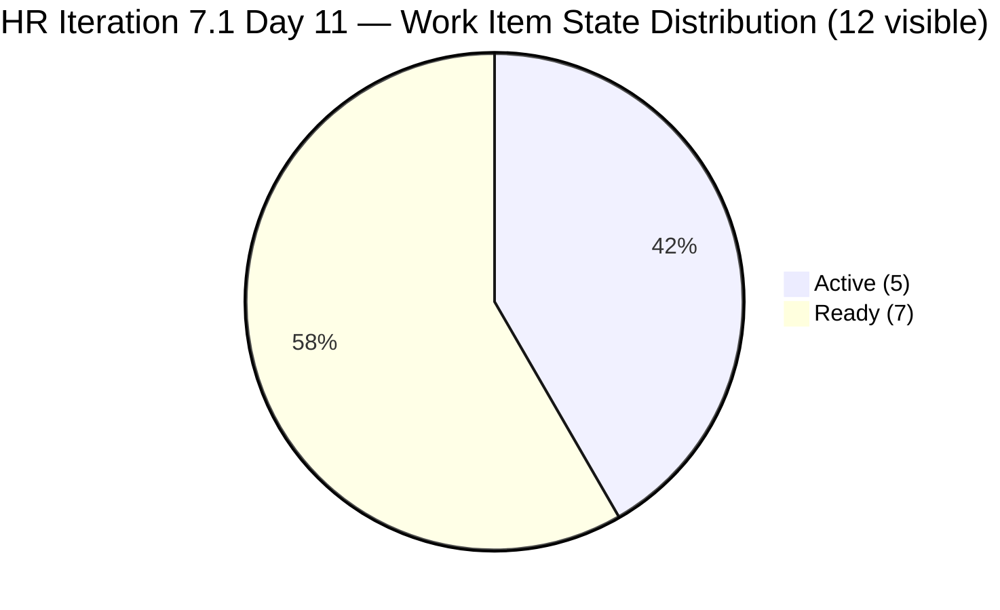
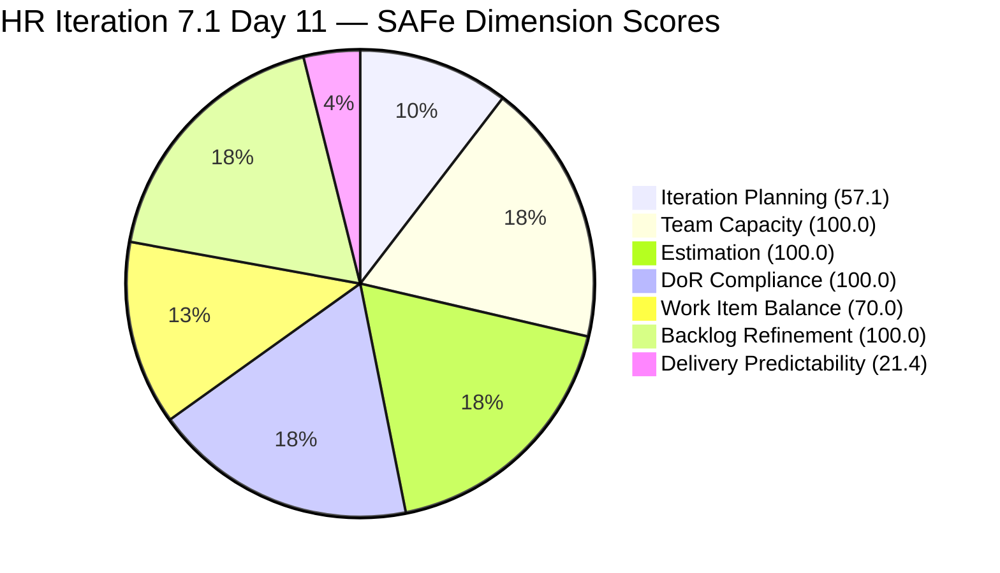
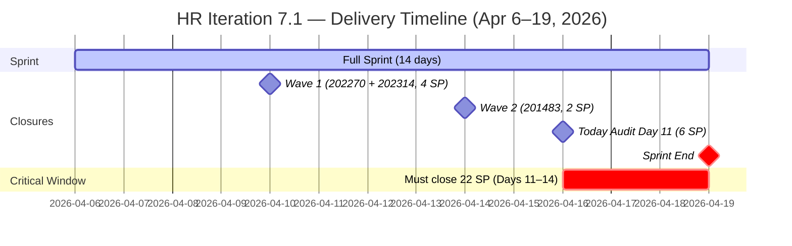

# Audit Report — Human Resource Recruitment Team
## Iteration 7.1 | Day 11 of 14 | Final Stretch

---

## 1. Audit Metadata

| Field | Value |
|-------|-------|
| **Audit Number** | #31 |
| **Audit Date** | April 16, 2026, 09:00 PHT |
| **Auditor** | Ramon Aseniero, SAFe Agile PM Consultant |
| **Team** | Human Resource Recruitment Team |
| **ADO Project** | Jairosoft FINOPS |
| **Workspace** | `ado_hr` |
| **Iteration** | Iteration 7.1 — Apr 6–19, 2026 |
| **Sprint Day** | Day 11 of 14 (79% elapsed — Final Stretch) |
| **Prior Audit** | AUDIT_20260413_0900.md (Day 8, Score 77.6 Moderate Risk) |
| **Report Path** | `ado_hr/audit/AUDIT_20260416_0900.md` |

---

## 2. Executive Summary

The HR Recruitment Team enters Day 11 with a score of **78.4 (Moderate Risk)**, an improvement of **+0.8 points** from the Day 8 score of 77.6. The gain is driven by a third closure recorded on April 14: **Item 201483 (Result Reading with Doc Karl — Davao/Cebu employees)** was closed at 2 SP, bringing total delivered story points to **6 SP from 3 items**.

The sprint is now at 79% elapsed with **22 SP remaining across 12 open items** and only **3 working days left** (Apr 16, Apr 17, Apr 19 — assuming Apr 18 is weekend). The required burn rate to close out the sprint is approximately **7.3 SP/day**, a pace significantly above Almera's historical daily average. This creates a high risk of delivery shortfall.

All other dimensions remain excellent: Estimation, DoR Compliance, Team Capacity, and Backlog Refinement continue at 100%. The Iteration Planning score dips slightly to 57.1 as one more item left the visible backlog. The structural deficit in Work Item Balance (70.0) remains a consistent characteristic of HR work type.

**The sprint is in the critical window. Almera must close multiple items per day to reach an acceptable delivery rate. The 7 Ready-state items are the most actionable targets.**

---

## 3. Previous Audit Delta

| Dimension | Day 8 (Apr 13) | Day 11 (Apr 16) | Change |
|-----------|----------------|-----------------|--------|
| Iteration Planning | 59.1 | 57.1 | **-2.0** |
| Team Capacity | 100.0 | 100.0 | 0.0 |
| Estimation | 100.0 | 100.0 | 0.0 |
| DoR Compliance | 100.0 | 100.0 | 0.0 |
| Work Item Balance | 70.0 | 70.0 | 0.0 |
| Backlog Refinement | 100.0 | 100.0 | 0.0 |
| Delivery Predictability | 14.3 | 21.4 | **+7.1** |
| **Overall** | **77.6** | **78.4** | **+0.8** |
| **Risk Band** | Moderate | Moderate | — |

**Key changes since Day 8 (Apr 13):**
- **Third closure recorded** — Item 201483 (Result Reading with Doc Karl, Davao/Cebu employees, 2 SP) was closed on April 14. This removes it from the visible backlog, reducing visible_root_backlog_items from 22 to 21 and visible current items from 13 to 12.
- **Delivery Predictability improves from 14.3 to 21.4** — 6 SP closed out of 28 total committed SP.
- **Iteration Planning dips from 59.1 to 57.1** — Denominator dropped from 22 to 21 (201483 removed from backlog); numerator dropped from 13 to 12.
- All other dimensions stable — no new items, no estimation changes, all remaining items still fresh.

---

## 4. Current Iteration Snapshot

| Metric | Value |
|--------|-------|
| Visible Root Backlog Items | 21 |
| Items in Iteration 7.1 (visible in backlog) | 12 |
| Closed Items (removed from backlog) | 3 (202270, 202314, 201483) |
| Total Committed Story Points | 28 SP |
| Closed Story Points | 6 SP (21.4%) |
| Remaining Open Story Points | 22 SP |
| Sprint Elapsed | 79% (Day 11/14) |
| Working Days Remaining | ~3 (Apr 16, 17, 19) |
| Required Pace to Complete | ~7.3 SP/day |
| Active Members | 1 (Almera Kleer Tayao) |
| Total Capacity/Day | 5 h (4h Documentation + 1h Requirements) |
| Days Off Remaining | 0 |

### State Distribution — 12 Visible Current Items

| State | Count | Items |
|-------|-------|-------|
| Active | 5 | 193582, 202330, 202335, 202340, 202342 |
| Ready | 7 | 197939, 200671, 200677, 201272, 202093, 202099, 202344 |
| Closed (removed from backlog) | 3 | 202270, 202314, 201483 |



---

## 5. Work Item Analysis

### Iteration 7.1 — Visible Open Items (12)

| ID | Title | Type | State | SP | Assignee | Last Changed |
|----|-------|------|-------|----|----------|-------------|
| 193582 | APE — Caumban, Karl Jordan | US | Active | 2 | Almera | Apr 7 |
| 197939 | Communication Skills Proposals Summary Presentation | US | Ready | 2 | Almera | Apr 7 |
| 200671 | LinkedIn Tech Sales from Manila Hiring | US | Ready | 1 | Almera | Apr 7 |
| 200677 | Technical Interviews of Qualified Applicants | US | Ready | 2 | Almera | Apr 7 |
| 201272 | LinkedIn Bubble Developer Hiring — Interview | US | Ready | 2 | Almera | Apr 7 |
| 202093 | LinkedIn DevOps Engr. Hiring — PI7 | US | Ready | 2 | Almera | Apr 7 |
| 202099 | Annual Medical Check-up — Cebu Employees PI7 | US | Ready | 1 | Almera | Apr 7 |
| 202330 | Sr. Tech Lead — Buenaventura, Sidney | US | Active | 2 | Almera | Apr 7 |
| 202335 | Sr. Tech Lead — Beltran, Ken Henson | US | Active | 2 | Almera | Apr 8 |
| 202340 | Sr. Tech Lead — Barua, Marlo | US | Active | 2 | Almera | Apr 8 |
| 202342 | Data Reconciliation & Eligibility (Sick Leave) | US | Active | 2 | Almera | Apr 7 |
| 202344 | Cash Conversion Calculation (Sick Leave) | US | Ready | 2 | Almera | Apr 7 |

**Visible committed: 12 items / 22 SP | No new closures since Apr 14**

### Closed Items in Iteration (Removed from Backlog)

| ID | Title | Type | State | SP | Closed Date |
|----|-------|------|-------|----|-------------|
| 202270 | Client Interview — Sr. Tech Lead Verano, Mark | US | Closed | 2 | Apr 10 |
| 202314 | Client Interview — Sr. Tech Lead Pabatao, Vincent | US | Closed | 2 | Apr 10 |
| 201483 | Result Reading with Doc Karl (Davao/Cebu) | US | Closed | 2 | Apr 14 |

**Total closed: 3 items / 6 SP**

### DoR Verification — All 12 Visible Current Items

All 12 items verified:
- Description ≥ 30 non-whitespace characters: **12/12 PASS**
- Acceptance Criteria ≥ 20 non-whitespace characters: **12/12 PASS**

**DoR Compliance: 100% (12/12)**

### Backlog Items Staged for 7.2

| ID | Title | Iteration | State | SP |
|----|-------|-----------|-------|-----|
| 201273 | LinkedIn Bubble Trainer Hiring — Interview | 7.2 | New | 2 |
| 202017 | Sr. Tech Lead — Verano — Client Interview & Decision | 7.2 | New | 2 |
| 202022 | Sr. Tech Lead — Pabatao — Client Interview & Decision | 7.2 | New | 2 |
| 202039 | Sales & Mktg. — Fernandez (Decision) | 7.2 | New | 1 |
| 202042 | Sales & Mktg. — Rojas Jr. (Final Decision) | 7.2 | New | 1 |
| 202104 | APE — Rommel Senillo — Summary PI7 | 7.2 | New | 2 |
| 202109 | APE — Calvin John Dalino — Summary PI7 | 7.2 | New | 2 |
| 202114 | APE — Ryan Vince Castillo — PI7 | 7.2 | New | 2 |
| 202349 | Finance Reporting & Export | 7.2 | Ready | 2 |

---

## 6. SAFe Compliance Scorecard

| Dimension | Score | Evidence | Notes |
|-----------|-------|----------|-------|
| Iteration Planning | 57.1 | 12 of 21 visible items in 7.1 | Dipped -2.0 from Day 8 as 201483 closed and left backlog |
| Team Capacity | 100.0 | 1 contributor with work / 1 with configured capacity | Almera 5h/day; Grace at 0h not sprint-assigned |
| Estimation | 100.0 | 12/12 point-eligible items estimated | Perfect across entire PI7 series |
| DoR Compliance | 100.0 | 12/12 items pass Desc+AC checks | All active and ready items fully documented |
| Work Item Balance | 70.0 | 100% User Story; dominant type >60% → -30 | Structural HR characteristic; 12/12 US |
| Backlog Refinement | 100.0 | 21/21 fresh (≤45 days); 0 stale_90; 0 untouched sprint items | All sprint items last touched Apr 7–8 |
| Delivery Predictability | 21.4 | 6 SP closed / 28 SP total committed | 3 items closed; 22 SP remain with 3 days left |
| **Overall** | **78.4** | | **Moderate Risk** |

### Score Computation Detail

```
1. Iteration Planning   = round(12 / 21 × 100, 1) = round(57.143, 1) = 57.1
2. Team Capacity        = round(1 / 1 × 100, 1)   = 100.0
3. Estimation           = round(12 / 12 × 100, 1)  = 100.0
4. DoR Compliance       = round(12 / 12 × 100, 1)  = 100.0
5. Work Item Balance    = 100 − 30 (US dominant >60%) = 70.0
6. Backlog Refinement:
   base = round(21/21 × 100, 1) = 100.0
   stale_90/visible = 0% → no penalty
   stale_180 = 0 → no penalty
   untouched/current = 0/12 = 0% → no penalty
   = 100.0
7. Delivery Predictability:
   committed_SP = 22 SP (open visible) + 6 SP (closed) = 28 SP total
   closed_SP = 2 + 2 + 2 = 6 SP
   = round(6 / 28 × 100, 1) = round(21.429, 1) = 21.4

Overall = round((57.1 + 100.0 + 100.0 + 100.0 + 70.0 + 100.0 + 21.4) / 7, 1)
        = round(548.5 / 7, 1)
        = round(78.357, 1)
        = 78.4  →  MODERATE RISK (60–79.9)
```

---

## 7. Dimension Findings

### 7.1 Iteration Planning — 57.1 (Stable, Below Threshold)
With 201483 now removed from the visible backlog, the planning ratio is 12/21 = 57.1%. This is a natural consequence of delivery — as items close, both the numerator (current sprint items visible) and denominator (total visible backlog) drop together. The 9 items staged for 7.2 provide a healthy forward pipeline. The score remains slightly below the 60-point threshold, a persistent characteristic across all PI7 audits for this team.

### 7.2 Team Capacity — 100.0 (Excellent)
Almera remains the sole active contributor with 5h/day capacity (4h Documentation + 1h Requirements). Her April 9 day off has been consumed. No remaining days off are configured. The team's bus factor of 1 remains a structural risk — unchanged across 31 audits.

### 7.3 Estimation — 100.0 (Excellent)
All 12 visible sprint items carry story points ranging from 1–2 SP. The total committed load of 28 SP is aligned with a solo contributor's 14-day capacity at 5h/day. No estimation gaps exist.

### 7.4 DoR Compliance — 100.0 (Excellent)
All 12 visible items continue to maintain full DoR compliance. Descriptions follow the "As a / I want to / So that" structure with measurable targets. Acceptance criteria are specific and testable. The three closed items (202270, 202314, 201483) also passed DoR before closure — confirming DoR was a prerequisite for delivery.

### 7.5 Work Item Balance — 70.0 (Structural Deficit)
The sprint contains 12/12 User Stories (100%). The dominant type penalty (-30) applies. As documented across all 31 HR audits, this is a structural characteristic: HR recruitment and wellness activities map naturally to User Stories, with no Spikes or exploratory items in scope. The score of 70 is the theoretical ceiling for this team's work type composition.

### 7.6 Backlog Refinement — 100.0 (Excellent)
All 21 visible backlog items have been touched within the last 45 days (most recently Apr 7–8). Zero items exceed the 90-day stale threshold. Zero items in the current sprint are untouched since the sprint start date (Apr 6) — all 12 visible sprint items were last updated Apr 7–8. The backlog is in optimal health for the fourth consecutive audit.

### 7.7 Delivery Predictability — 21.4 (High Risk, Improving)
Three items are now closed (6 SP), up from two items (4 SP) at Day 8. Item 201483 (Result Reading with Doc Karl, 2 SP) was closed on April 14.

**Critical situation:** With 22 SP remaining and approximately 3 working days left (Apr 16, 17, 19), the required burn rate is **~7.3 SP/day**. This is significantly above any historically observed daily pace for this team.

However, Almera has demonstrated burst capacity: in Iteration 6.5, she closed 12 items (23 SP) in a single day (Mar 18, 2026). If she can activate a similar burst across the final 3 days, a strong delivery finish is possible. The 7 items in "Ready" state are the most accessible — they require only a final review and state transition to Closed, not further development work.

**Delivery trajectory by state:**
- 5 Active items (10 SP): require work completion + closure
- 7 Ready items (12 SP): require only closure action

---

## 8. Risks and Bottlenecks

| # | Risk | Severity | Status |
|---|------|----------|--------|
| R1 | **22 SP open with only 3 days remaining** — Requires ~7.3 SP/day sustained pace. Well above daily historical average. | CRITICAL | Active — urgent |
| R2 | **7 Ready-state items untransitioned** — Items 197939, 200671, 200677, 201272, 202093, 202099, 202344 are in "Ready" state. If work is complete, these can be closed immediately to capture 12 SP. | HIGH | Actionable today |
| R3 | **Bus Factor = 1** — Almera is the sole contributor; any leave or disruption stops all delivery. | HIGH | Structural, persistent |
| R4 | **No iteration goal** — Sprint has no defined outcome statement across all 31 audits. | HIGH | Persistent, unfixed |
| R5 | **Iteration Planning below 60%** — 12/21 = 57.1%; marginal sub-threshold. Acceptable given 7.2 pipeline. | LOW-MODERATE | Stable |
| R6 | **100% User Story dominance** — No type diversity; structural HR characteristic. | LOW | Structural |

---

## 9. Prioritized Recommendations

| Priority | Action | Owner | Target |
|----------|--------|-------|--------|
| P1 | **Close all 7 Ready-state items today** — Items 202099 (Annual Medical Check-up, 1 SP) and 200671 (LinkedIn Tech Sales, 1 SP) are the easiest targets. If the corresponding work is complete, transition all 7 Ready items to Closed immediately (12 SP total). This single action would bring Delivery Predictability from 21.4 to 64.3. | Almera | Apr 16 |
| P2 | **Close Active Sr. Tech Lead recruitment items** — #202330 (Buenaventura, Sidney), #202335 (Beltran, Ken Henson), #202340 (Barua, Marlo) — 3 items, 6 SP. If hiring decisions have been made or candidates have been evaluated, close these recruitment tracking stories. | Almera | Apr 16–17 |
| P3 | **Close the Sick Leave workstream** — #202342 (Data Reconciliation, Active, 2 SP) and #202344 (Cash Conversion Calculation, Ready, 2 SP). Close 202342 first, then 202344. Combined 4 SP if completed. | Almera | Apr 17 |
| P4 | **Close APE — Caumban** — #193582 (Active, 2 SP). The performance evaluation of Karl Jordan Caumban should be completable within Day 11. Close when the evaluation form is signed and recorded. | Almera | Apr 17 |
| P5 | **Define a sprint goal for 7.1 close and 7.2 planning** — Document a one-sentence iteration outcome retroactively (e.g., "Advance Sr. Tech Lead candidate pipeline to client interview stage and initiate sick leave cash conversion reconciliation"). Then define the 7.2 sprint goal for the 9 staged items before sprint start. | Ramon / Almera | Apr 16 |
| P6 | **Validate 7.2 sprint scope** — The 9 staged items (16 SP) are ready. With Almera's capacity at 5h/day × 14 days = 70h, and typical 2–3 SP/story, 16 SP is feasible. Confirm sprint planning is done before Apr 20. | Ramon | Apr 17–19 |

---

## 10. Evidence Gaps and Limitations

| Gap | Impact | Notes |
|-----|--------|-------|
| Closed items (202270, 202314, 201483) removed from visible backlog | Committed/closed SP reconciled from iteration query vs. backlog | Standard ADO behavior; delivery score uses full iteration context |
| No iteration goal configured in ADO | Cannot assess strategic alignment of sprint outcomes | Persistent across all 31 audits |
| PI Objectives not linked to sprint items | Cannot verify PI-level strategic alignment | Longstanding structural gap |
| Grace (0 capacity) appears in team roster | No sprint assignments; safe to ignore if unchanged | No items assigned to Grace in 7.1 |
| No intra-sprint burn history available via API | Cannot confirm daily velocity trend | Delivery evidence is state-transition-based only |
| 7 items in "Ready" state without changedDate update | May already be complete but not transitioned | Almera to review and close if done |

---

## 11. Score Trend Visualization





---

*Report generated by Claude Code ADO SAFe Audit Agent | Iteration 7.1, Day 11 | Apr 16, 2026 09:00 PHT*
