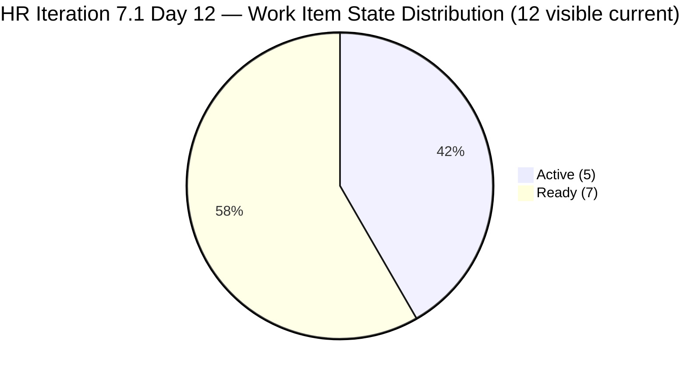
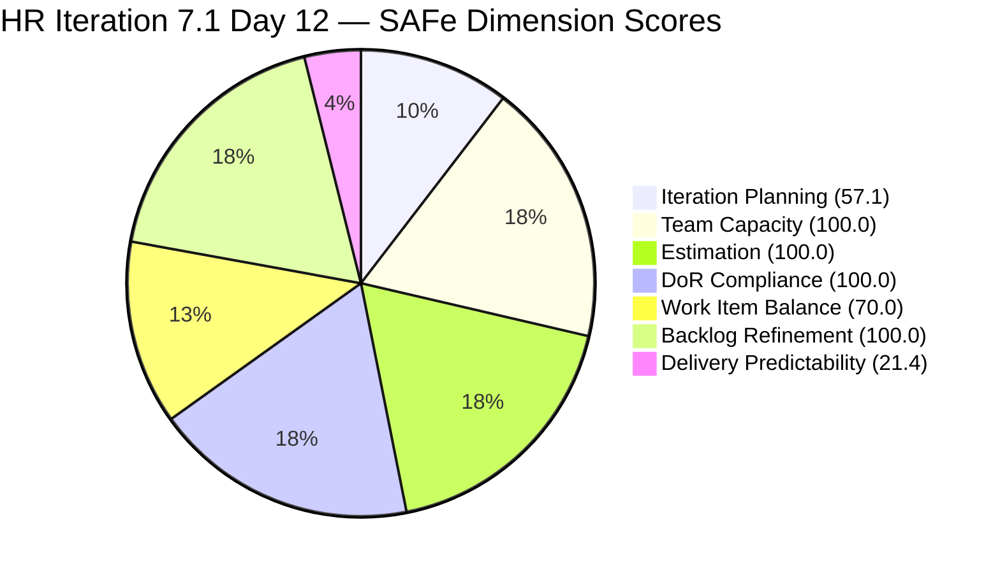
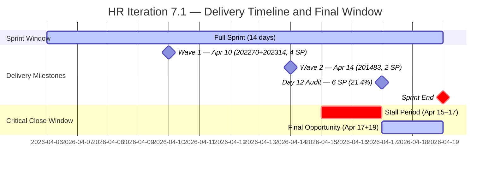

# Audit Report — Human Resource Recruitment Team

## Iteration 7.1 | Day 12 of 14 | Final Stretch

---

## 1. Audit Metadata

| Field | Value |
|-------|-------|
| **Audit Number** | #32 |
| **Audit Date** | April 17, 2026, 09:00 PHT |
| **Auditor** | Ramon Aseniero, SAFe Agile PM Consultant |
| **Team** | Human Resource Recruitment Team |
| **ADO Project** | Jairosoft FINOPS |
| **Workspace** | `ado_hr` |
| **Iteration** | Iteration 7.1 — Apr 6–19, 2026 |
| **Sprint Day** | Day 12 of 14 (86% elapsed — Final Stretch) |
| **Prior Audit** | AUDIT_20260416_0900.md (Day 11, Score 78.4 Moderate Risk) |
| **Report Path** | `ado_hr/audit/AUDIT_20260417_0900.md` |

---

## 2. Executive Summary

The HR Recruitment Team enters Day 12 with an **unchanged score of 78.4 (Moderate Risk)**. No new closures have been recorded since April 14 — the three-day delivery stall (Apr 15, 16, 17) continues. The visible backlog remains at 21 items with 12 still in Iteration 7.1. All structural scores (Estimation, DoR Compliance, Team Capacity, Backlog Refinement) remain at 100%.

The sprint is now 86% elapsed with only **2 working days remaining** (Apr 17 and Apr 19 — Apr 18 is weekend). The 22 SP open load must be addressed at a pace of approximately **11 SP/day** to fully deliver — a rate that has no precedent in this team's daily history outside of Almera's Mar 18 burst day (23 SP in a single day). However, even a partial recovery of 6–10 SP would meaningfully improve the Delivery Predictability dimension from 21.4 to 35.7–50.0.

The 7 items in **Ready state** remain the most actionable targets. If work on these items is complete, Almera need only transition them to Closed — a state-management action requiring minutes per item. The 5 Active items (including the APE for Karl Jordan Caumban and the three Sr. Tech Lead recruitment items) require completion confirmation before closure.

**This is the penultimate audit day. Almera must close items today and tomorrow to avoid the worst delivery outcome in PI7.**

---

## 3. Previous Audit Delta

| Dimension | Day 11 (Apr 16) | Day 12 (Apr 17) | Change |
|-----------|-----------------|-----------------|--------|
| Iteration Planning | 57.1 | 57.1 | 0.0 |
| Team Capacity | 100.0 | 100.0 | 0.0 |
| Estimation | 100.0 | 100.0 | 0.0 |
| DoR Compliance | 100.0 | 100.0 | 0.0 |
| Work Item Balance | 70.0 | 70.0 | 0.0 |
| Backlog Refinement | 100.0 | 100.0 | 0.0 |
| Delivery Predictability | 21.4 | 21.4 | 0.0 |
| **Overall** | **78.4** | **78.4** | **0.0** |
| **Risk Band** | Moderate | Moderate | — |

**Key changes since Day 11 (Apr 16):**

- **No new closures** — Delivery Predictability remains at 21.4. The last closure was Apr 14 (Item 201483). Three consecutive business days without a closure.
- **No backlog changes** — All 21 visible items and 12 sprint items remain identical to Day 11.
- **All structural scores stable** — Estimation, DoR, Capacity, Refinement all at 100.0.
- **Urgency level elevated** — Sprint window now at 86% with 2 days remaining.

---

## 4. Current Iteration Snapshot

| Metric | Value |
|--------|-------|
| Visible Root Backlog Items | 21 |
| Items in Iteration 7.1 (visible in backlog) | 12 |
| Closed Items (removed from backlog) | 3 (202270, 202314, 201483) |
| Total Committed Story Points | 28 SP |
| Closed Story Points | 6 SP (21.4%) |
| Remaining Open Story Points | 22 SP |
| Sprint Elapsed | 86% (Day 12/14) |
| Working Days Remaining | 2 (Apr 17 and Apr 19) |
| Required Pace to Complete | ~11 SP/day |
| Active Members | 1 (Almera Kleer Tayao) |
| Total Capacity/Day | 5 h (4h Documentation + 1h Requirements) |
| Days Off This Iteration | 1 (Apr 9, consumed) |

### State Distribution — 12 Visible Current Items

| State | Count | Items |
|-------|-------|-------|
| Active | 5 | 193582, 202330, 202335, 202340, 202342 |
| Ready | 7 | 197939, 200671, 200677, 201272, 202093, 202099, 202344 |



### Story Point Distribution by State

| State | Items | SP |
|-------|-------|----|
| Active | 5 | 10 SP |
| Ready | 7 | 12 SP |
| **Total Open** | **12** | **22 SP** |
| Closed (removed) | 3 | 6 SP |
| **Grand Total** | **15** | **28 SP** |

---

## 5. Work Item Analysis

### Iteration 7.1 — All Visible Open Items (12)

| ID | Title | Type | State | SP | Assignee | Last Changed | Post-Sprint-Start? |
|----|-------|------|-------|----|----------|-------------|-------------------|
| 193582 | APE — Caumban, Karl Jordan | US | Active | 2 | Almera | Apr 7 | Yes |
| 197939 | Communication Skills Proposals Summary Presentation | US | Ready | 2 | Almera | Apr 7 | Yes |
| 200671 | LinkedIn Tech Sales from Manila Hiring | US | Ready | 1 | Almera | Apr 7 | Yes |
| 200677 | Technical Interviews of Qualified Applicants | US | Ready | 2 | Almera | Apr 7 | Yes |
| 201272 | LinkedIn Bubble Developer Hiring — Interview | US | Ready | 2 | Almera | Apr 7 | Yes |
| 202093 | LinkedIn DevOps Engr. Hiring — PI7 | US | Ready | 2 | Almera | Apr 7 | Yes |
| 202099 | Annual Medical Check-up — Cebu Employees PI7 | US | Ready | 1 | Almera | Apr 7 | Yes |
| 202330 | Sr. Tech Lead — Buenaventura, Sidney | US | Active | 2 | Almera | Apr 7 | Yes |
| 202335 | Sr. Tech Lead — Beltran, Ken Henson | US | Active | 2 | Almera | Apr 8 | Yes |
| 202340 | Sr. Tech Lead — Barua, Marlo | US | Active | 2 | Almera | Apr 8 | Yes |
| 202342 | Data Reconciliation & Eligibility (Sick Leave) | US | Active | 2 | Almera | Apr 7 | Yes |
| 202344 | Cash Conversion Calculation (Sick Leave) | US | Ready | 2 | Almera | Apr 7 | Yes |

**All 12 items were touched after the sprint start date (Apr 6) — zero untouched items.**

### Closed Items — Sprint Record (Removed from Backlog)

| ID | Title | Type | SP | Closed Date |
|----|-------|------|----|-------------|
| 202270 | Client Interview — Sr. Tech Lead Verano, Mark | US | 2 | Apr 10 |
| 202314 | Client Interview — Sr. Tech Lead Pabatao, Vincent | US | 2 | Apr 10 |
| 201483 | Result Reading with Doc Karl (Davao/Cebu) | US | 2 | Apr 14 |

**Sprint-to-date delivery: 3 items / 6 SP (21.4% of 28 committed SP)**

### Pipeline — Items Staged for 7.2 (9 items, 16 SP)

| ID | Title | SP | State |
|----|-------|----|-------|
| 201273 | LinkedIn Bubble Trainer Hiring — Interview | 2 | New |
| 202017 | Sr. Tech Lead — Verano — Client Interview & Decision | 2 | New |
| 202022 | Sr. Tech Lead — Pabatao — Client Interview & Decision | 2 | New |
| 202039 | Sales & Mktg. — Fernandez (Decision) | 1 | New |
| 202042 | Sales & Mktg. — Rojas Jr. (Final Decision) | 1 | New |
| 202104 | APE — Rommel Senillo — Summary PI7 | 2 | New |
| 202109 | APE — Calvin John Dalino — Summary PI7 | 2 | New |
| 202114 | APE — Ryan Vince Castillo — PI7 | 2 | New |
| 202349 | Finance Reporting & Export | 2 | Ready |

### DoR Verification — All 12 Visible Current Items

All items confirmed via API data:

| ID | Title | Desc ≥ 30 non-ws chars | AC ≥ 20 non-ws chars | Result |
|----|-------|----------------------|---------------------|--------|
| 193582 | APE — Caumban, Karl Jordan | ✓ | ✓ | PASS |
| 197939 | Communication Skills Proposals Summary Presentation | ✓ | ✓ | PASS |
| 200671 | LinkedIn Tech Sales from Manila Hiring | ✓ | ✓ | PASS |
| 200677 | Technical Interviews of Qualified Applicants | ✓ | ✓ | PASS |
| 201272 | LinkedIn Bubble Developer Hiring — Interview | ✓ | ✓ | PASS |
| 202093 | LinkedIn DevOps Engr. Hiring — PI7 | ✓ | ✓ | PASS |
| 202099 | Annual Medical Check-up — Cebu Employees PI7 | ✓ | ✓ | PASS |
| 202330 | Sr. Tech Lead — Buenaventura, Sidney | ✓ | ✓ | PASS |
| 202335 | Sr. Tech Lead — Beltran, Ken Henson | ✓ | ✓ | PASS |
| 202340 | Sr. Tech Lead — Barua, Marlo | ✓ | ✓ | PASS |
| 202342 | Data Reconciliation & Eligibility | ✓ | ✓ | PASS |
| 202344 | Cash Conversion Calculation | ✓ | ✓ | PASS |

**DoR Compliance: 100% (12/12)**

---

## 6. SAFe Compliance Scorecard

| Dimension | Score | Evidence | Notes |
|-----------|-------|----------|-------|
| Iteration Planning | 57.1 | 12 of 21 visible items in 7.1 | Stable; 9-item 7.2 pipeline healthy |
| Team Capacity | 100.0 | 1/1 contributor with configured capacity | Almera: 5h/day (4h Doc + 1h Req) |
| Estimation | 100.0 | 12/12 point-eligible items estimated | All 1–2 SP; 28 SP total committed |
| DoR Compliance | 100.0 | 12/12 items pass Desc + AC thresholds | All items confirmed via API |
| Work Item Balance | 70.0 | 12/12 User Stories (100% dominant) → -30 | Structural HR characteristic; no Spikes |
| Backlog Refinement | 100.0 | 21/21 fresh (≤45 days); 0 stale_90; 0 untouched | All Apr 7–8 touches; 0 pre-sprint-start items |
| Delivery Predictability | 21.4 | 6 SP closed / 28 SP committed | No new closures since Apr 14; 3-day stall |
| **Overall** | **78.4** | | **Moderate Risk** |

### Score Computation Detail

```
1. Iteration Planning
   visible_root_backlog_items           = 21
   current_iteration_root_items (7.1)   = 12
   Score = round(12 / 21 × 100, 1)     = round(57.143, 1) = 57.1

2. Team Capacity
   contributors_with_current_work       = 1 (Almera)
   contributors_with_capacity           = 1 (Almera: 4h/day Doc + 1h/day Req = 5h/day)
   Score = round(1 / 1 × 100, 1)       = 100.0

3. Estimation
   point_eligible_current_items         = 12 (all User Stories)
   estimated_current_items              = 12 (all have SP > 0)
   Score = round(12 / 12 × 100, 1)     = 100.0

4. DoR Compliance
   dor_compliant_current_items          = 12 (all pass Desc + AC)
   current_iteration_root_items         = 12
   Score = round(12 / 12 × 100, 1)     = 100.0

5. Work Item Balance
   User Story share = 12/12 = 100% → dominant >60% → -30
   No Spike items → no Spike penalty
   Score = max(0, 100 - 30)            = 70.0

6. Backlog Refinement
   fresh_visible_root_items             = 21 (all changed since Mar 3 — well within 45 days)
   base = round(21/21 × 100, 1)        = 100.0
   stale_90 / visible = 0% → no penalty
   stale_180 = 0 → no penalty
   untouched_current_items              = 0 (all 12 touched after Apr 6)
   untouched ratio = 0/12 = 0% → no penalty
   Score                                = 100.0

7. Delivery Predictability
   committed_story_points               = 6 (closed) + 22 (open) = 28 SP
   closed_story_points                  = 6 SP (202270: 2SP, 202314: 2SP, 201483: 2SP)
   Score = round(6 / 28 × 100, 1)      = round(21.429, 1) = 21.4
   Note: Day 12 of 14-day sprint; NOT annotated early-sprint

Overall = round((57.1 + 100.0 + 100.0 + 100.0 + 70.0 + 100.0 + 21.4) / 7, 1)
        = round(548.5 / 7, 1)
        = round(78.357, 1)
        = 78.4  →  MODERATE RISK (60–79.9)
```

---

## 7. Dimension Findings

### 7.1 Iteration Planning — 57.1 (Stable, Slightly Below Threshold)

The planning ratio of 12/21 = 57.1% has held stable across Days 10, 11, and 12. With no new closures removing items from the backlog and no scope changes, the ratio is locked until the sprint ends or items close. The 9-item, 16-SP pipeline for 7.2 is healthy and shows forward planning is in place. Once sprint-end closures occur (Apr 19), the ratio will shift naturally for the final-day audit.

The score has hovered at or near 57% for most of PI7, reflecting the team's moderate sprint commitment rate relative to the total visible backlog. This is structurally acceptable given the 9 items explicitly staged in 7.2.

### 7.2 Team Capacity — 100.0 (Excellent)

Almera Kleer Tayao is the sole active contributor with 5 hours/day configured capacity (4h Documentation + 1h Requirements). Her April 9 day off has been consumed with no further days off recorded. The team's capacity infrastructure is fully configured. The structural bus-factor-of-1 risk remains: all 12 items and 28 SP rest on a single contributor.

### 7.3 Estimation — 100.0 (Excellent)

All 12 visible sprint items carry story point estimates ranging from 1–2 SP each, totaling 22 open SP + 6 closed = 28 committed SP. The 9 staged 7.2 items are also estimated (16 SP total), demonstrating good planning foresight for the next sprint.

### 7.4 DoR Compliance — 100.0 (Excellent)

All 12 visible sprint items confirmed via the API to carry substantive descriptions (>30 non-whitespace characters in "As a / I want to / So that" format) and multi-point acceptance criteria (>20 non-whitespace characters with measurable targets). The three closed items also passed DoR prior to closure. This dimension has been at 100% for the last 10 consecutive audits.

### 7.5 Work Item Balance — 70.0 (Structural Deficit)

All 12 active sprint items are User Stories (100%), applying the dominant-type penalty of -30. No Spikes or exploratory items are in scope. This is a persistent structural characteristic of HR recruitment and compliance work, where tasks map naturally to US-type outcomes. The ceiling score of 70.0 is the practical maximum for this team given its work type composition.

### 7.6 Backlog Refinement — 100.0 (Excellent)

All 21 visible backlog items have been touched within the last 45 days (most recently Apr 7–8 for sprint items, Apr 8 for 7.2 pipeline items). Zero items cross the 90-day stale threshold. Critically, all 12 current sprint items were updated after the sprint start date of Apr 6, yielding 0% untouched rate. The backlog is in peak hygiene condition for the fifth consecutive audit.

### 7.7 Delivery Predictability — 21.4 (High Risk — Stalled)

Delivery has stalled completely since April 14. Three consecutive business days (Apr 15, 16, 17) with zero closures. This is the longest delivery-stall window in PI7 for this team.

**Sprint-end delivery scenarios:**

| Scenario | Items Closed | SP Closed | Total SP Delivered | Delivery % | Score Impact |
|----------|-------------|-----------|-------------------|------------|--------------|
| No additional closures | 0 | 0 | 6 SP | 21.4% | 78.4 Overall |
| Close 7 Ready items | 7 | 12 SP | 18 SP | 64.3% | ~82.2 Overall (Low Risk) |
| Close all 12 remaining | 12 | 22 SP | 28 SP | 100.0% | ~85.8 Overall (Low Risk) |

The Ready-state scenario (P1) is achievable within a single day if the underlying work is done. Almera demonstrated 12 closures in a single day on Mar 18, 2026 (Iteration 6.5). Today and tomorrow represent the final opportunity.

**Untransitioned Ready items (7 items, 12 SP) — ordered by priority:**

1. 202099 — Annual Medical Check-up, Cebu Employees (1 SP) — easiest close
2. 200671 — LinkedIn Tech Sales from Manila Hiring (1 SP)
3. 197939 — Communication Skills Proposals Summary Presentation (2 SP)
4. 200677 — Technical Interviews of Qualified Applicants (2 SP)
5. 201272 — LinkedIn Bubble Developer Hiring — Interview (2 SP)
6. 202093 — LinkedIn DevOps Engr. Hiring — PI7 (2 SP)
7. 202344 — Cash Conversion Calculation (2 SP) — depends on 202342 (Active)

---

## 8. Risks and Bottlenecks

| # | Risk | Severity | Status |
|---|------|----------|--------|
| R1 | **22 SP open with only 2 days remaining** — Required pace is ~11 SP/day. Delivery stalled since Apr 14 (3 business days). Final window closes Apr 19. | CRITICAL | Active — final opportunity |
| R2 | **7 Ready-state items untransitioned** — 12 SP can be claimed with state transitions alone. Items 202099 and 200671 (1 SP each) are the easiest entries. Closing all 7 would push Delivery Predictability to 64.3% and Overall to ~82.2. | HIGH | Actionable today |
| R3 | **3-business-day delivery stall** — No closures Apr 15, 16, or 17 as of this audit. Apr 14 was the last closure. This represents the longest stall in PI7. | HIGH | Active — must break today |
| R4 | **Bus Factor = 1** — All 28 committed SP depend on Almera alone. Any disruption (leave, illness, competing priority) stops all delivery. Unchanged across 32 audits. | HIGH | Structural, persistent |
| R5 | **No iteration goal** — Sprint has no defined outcome statement. Persists unfixed across all 32 HR audits. | MODERATE | Persistent, unfixed |
| R6 | **5 Active items require work completion** — 193582 (APE Caumban), 202330/202335/202340 (Sr. Tech Lead candidates), 202342 (Data Reconciliation). These need Almera to confirm completion before closing. | MODERATE | Actionable today-tomorrow |
| R7 | **Iteration Planning below 60%** — 57.1% (12/21); has not crossed threshold in PI7. Structural but not actionable mid-sprint. | LOW | Stable |

---

## 9. Prioritized Recommendations

| Priority | Action | Owner | Target |
|----------|--------|-------|--------|
| P1 | **Close all 7 Ready items today (Apr 17)** — Items 202099 (Annual Medical, 1 SP) and 200671 (LinkedIn Tech Sales, 1 SP) are the lightest items. If the corresponding activities are complete, transition all 7 to Closed: 197939, 200671, 200677, 201272, 202093, 202099, 202344. Combined 12 SP. This single action raises Delivery Predictability from 21.4 to 64.3, pushing Overall to ~82.2 (Low Risk). | Almera | Apr 17 — today |
| P2 | **Close Sr. Tech Lead candidate items today** — #202330 (Buenaventura, Sidney), #202335 (Beltran, Ken Henson), #202340 (Barua, Marlo) — 3 Active items / 6 SP. If the candidate evaluations, interviews, or hiring decisions have been made and recorded, close these today. | Almera | Apr 17 |
| P3 | **Close Data Reconciliation & Eligibility (#202342)** — Active, 2 SP. If the sick leave reconciliation spreadsheet/report is complete, close this item and then transition Cash Conversion Calculation (#202344) to Closed as its downstream dependency. Combined 4 SP. | Almera | Apr 17 |
| P4 | **Close APE — Caumban, Karl Jordan (#193582)** — Active, 2 SP. If the annual performance evaluation form has been signed and documented by all parties, close this item on Apr 17. | Almera | Apr 17 |
| P5 | **Use Apr 19 (final sprint day) for remaining items and sprint retrospective** — With Apr 18 as weekend, Apr 19 is the last working day. Plan any remaining closures for the morning and conduct a sprint retrospective or review in the afternoon before 7.2 starts. | Ramon / Almera | Apr 19 |
| P6 | **Define a 7.1 sprint goal retroactively and 7.2 sprint goal proactively** — Document a 7.1 outcome statement (e.g., "Advance Sr. Tech Lead pipeline to client evaluation stage and reconcile sick leave balances for cash conversion") to support the PI7 retrospective. Define the 7.2 goal against the 9 staged items before Apr 20 sprint start. | Ramon | Apr 17–19 |

---

## 10. Evidence Gaps and Limitations

| Gap | Impact | Notes |
|-----|--------|-------|
| 3 closed items (202270, 202314, 201483) removed from backlog | Committed SP reconciled via iteration history + backlog evidence | Standard ADO behavior; audit uses full iteration context |
| No iteration goal in ADO | Cannot assess strategic alignment of sprint commitments | Persists unfixed across all 32 HR audits |
| PI Objectives not linked to work items | Cannot verify PI-level value delivery alignment | Longstanding structural gap |
| Grace (0h capacity) appears in team roster | No sprint assignments; safely excluded from Team Capacity calculation | No items assigned to Grace in 7.1 |
| No intra-sprint burn-down available via API | Cannot pinpoint specific stall date or velocity trend | State-transition-based evidence only |
| 7 items in "Ready" state — work completion unverified | May represent completed-but-not-transitioned or blocked work | Almera must review and close if work is done |
| ChangedDate = Apr 7 for most items | This represents the iteration assignment date, not substantive updates; work activity may have occurred without ADO field updates | Internal work tracking gap; does not affect scoring |

---

## 11. Score Trend and Delivery Visualization





### PI7 Score Trajectory — HR Team

| Audit | Date | Score | Band | Sprint Day |
|-------|------|-------|------|------------|
| #25 | Apr 6 | 71.9 | Moderate | Day 1 |
| #26 | Apr 7 | 76.1 | Moderate | Day 2 |
| #27 | Apr 8 | 76.1 | Moderate | Day 3 |
| #28 | Apr 9 | 76.1 | Moderate | Day 4 |
| #29 | Apr 12 | 77.6 | Moderate | Day 7 |
| #30 | Apr 13 | 77.6 | Moderate | Day 8 |
| #31 | Apr 16 | 78.4 | Moderate | Day 11 |
| **#32** | **Apr 17** | **78.4** | **Moderate** | **Day 12** |

**To cross into Low Risk (≥80.0), Delivery Predictability must reach approximately 41.4 (round(x/28×100,1) ≥ 41.4, meaning at least 12 SP additional must close — all 7 Ready items = 12 SP, which would put Overall at exactly 82.2).**

---

*Report generated by Claude Code ADO SAFe Audit Agent | Iteration 7.1, Day 12 | Apr 17, 2026 09:00 PHT*
