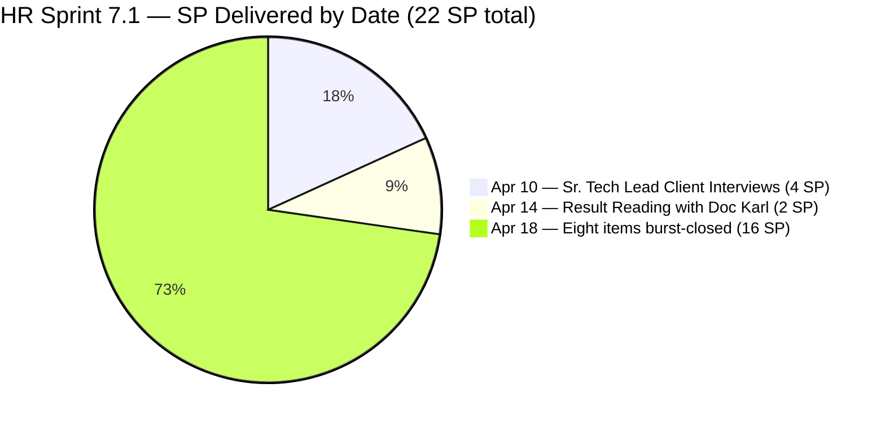
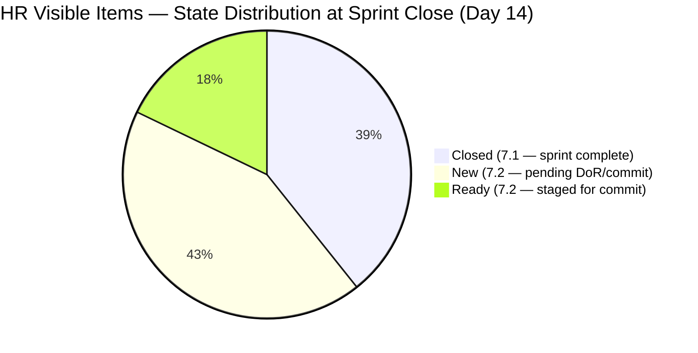
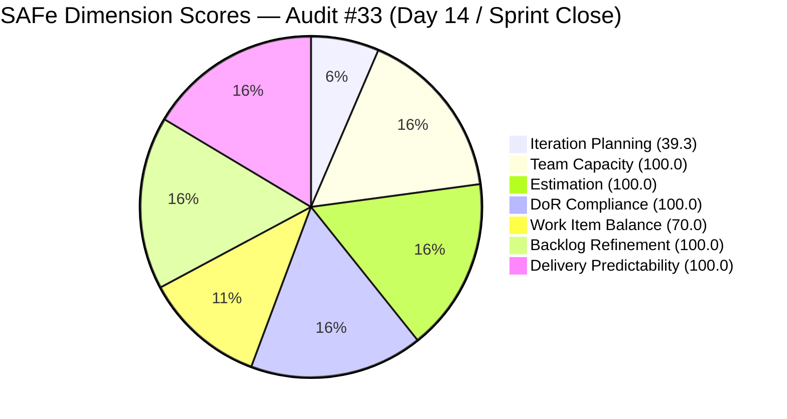

# ADO SAFe Iteration Audit — Human Resource Recruitment Team
**Audit #33 | Iteration 7.1 (Apr 6–19, 2026) | Day 14 of 14 (100% elapsed) — Sprint Close**

---

## 1. Audit Metadata

| Field | Value |
|---|---|
| **Audit Date** | April 19, 2026, 13:45 PDT (April 20, 2026, 04:45 PHT) |
| **Auditor** | Claude Code (ADO SAFe Audit Agent — Team 1 / Non-critical tier) |
| **Workspace** | `ado_hr` |
| **ADO Project** | Jairosoft FINOPS (`e0bb302f-40f9-46c3-8164-6f1acb317d63`) |
| **Team** | Human Resource Recruitment Team (`248f59a6-372c-4b74-8129-9eaf260f211e`) |
| **Iteration** | Iteration 7.1 — Apr 6 to Apr 19, 2026 |
| **Iteration ID** | `82cc2229-0211-4fe2-9ee6-cc8d843dfab0` |
| **Sprint Day** | Day 14 of 14 (100% elapsed — Sprint Close) |
| **Prior Audit** | AUDIT_20260417_0900.md (Audit #32, Score 78.4 — Moderate Risk) |
| **Scoring Model** | ADO SAFe v1 (7-dimension rubric) |
| **Overall Score** | **87.0 / 100** |
| **Risk Band** | **Low Risk** (≥ 80) |

---

## 2. Executive Summary

The HR Recruitment Team delivers a **major end-of-sprint recovery**: Overall score jumps from **78.4 (Moderate) on Day 12 to 87.0 (Low Risk) on Day 14** — a **+8.6 improvement** driven entirely by Delivery Predictability rising from 21.4 to 100.0.

Almera executed a decisive close-out: between April 14 and April 18, she closed **all 11 remaining Iteration 7.1 items**, finishing at **22 of 22 committed story points delivered (100%)**. The breakthrough day was **Apr 18** when 8 items were closed within a ~90-minute window (6:35–7:01 UTC) — the largest same-day burst recorded in PI7 for this team, reminiscent of the historic Mar 18 burst day in Iteration 6.5.

Four items previously listed in 7.1 on Day 12 (#197939, #200671, #202093, #202099) were **moved to Iteration 7.2** rather than closed in 7.1 — a pragmatic de-scoping that trimmed sprint scope from 28 SP to 22 SP. The 11 items that remained in 7.1 were all closed. The team crosses the Low Risk threshold for the first time in PI7 sprint-close.

Forward planning also expanded: four new 7.2 items were created on Apr 18 (#202885 Sr. Tech Lead Buenaventura, #202886 Beltran, #202887 Barua, #202888 APE Caumban — Copy), bringing the 7.2 pipeline to 17 items (30 SP total). **Iteration Planning scored 39.3** — a rubric artifact from backlog expansion (17 open items) + closed-sprint removal. The planning itself was executed well; the score drop is mechanical, not qualitative.

**One item for retrospective attention:** #202888 (APE Caumban — Copy) appears to be a deliberate or accidental clone of the now-closed #193582 (APE Caumban, closed Apr 18). Before PI7.2 sprint commit, this duplicate should be either intentionally re-purposed (e.g., for a follow-up cycle) with renamed title, or deleted.

---

## 3. Previous Audit Delta

| Dimension | Day 12 (Apr 17) | Day 14 (Apr 19) | Delta |
|---|---|---|---|
| Iteration Planning | 57.1 | 39.3 | −17.8 (rubric artifact — sprint items closed + new 7.2 items added) |
| Team Capacity | 100.0 | 100.0 | 0.0 |
| Estimation | 100.0 | 100.0 | 0.0 |
| DoR Compliance | 100.0 | 100.0 | 0.0 |
| Work Item Balance | 70.0 | 70.0 | 0.0 |
| Backlog Refinement | 100.0 | 100.0 | 0.0 |
| Delivery Predictability | 21.4 | 100.0 | +78.6 |
| **Overall** | **78.4** | **87.0** | **+8.6** |

**Key changes since Day 12 (Apr 17):**

- **9 items closed between Apr 14 and Apr 18** — Almera broke the 3-day delivery stall with a decisive close-out:
  - Apr 14: #201483 Result Reading with Doc Karl (2 SP)
  - Apr 18 (6:35–7:01 UTC): #202342 Data Reconciliation (2), #202344 Cash Conversion Calculation (2), #202330 Sr. Tech Lead Buenaventura (2), #202335 Beltran (2), #202340 Barua (2), #201272 LinkedIn Bubble Developer (2), #200677 Technical Interviews (2), #193582 APE Caumban (2) = 16 SP in one morning.
- **4 items moved from 7.1 to 7.2** — #197939 (Communication Skills Summary), #200671 (LinkedIn Tech Sales Manila), #202093 (LinkedIn DevOps Engineer), #202099 (Annual Medical Check-up Cebu). All four are now Ready state in 7.2.
- **4 new 7.2 items created Apr 18** — #202885, #202886, #202887 (new Sr. Tech Lead candidates), #202888 (APE Caumban — Copy, appears to be clone of #193582).
- **Committed SP reduced from 28 to 22** — scope reduction via de-scoping; remaining 22 SP all delivered.
- **Backlog grew to 17 items (all 7.2)** — up from 9 items on Day 12.
- **Delivery Predictability jumps to 100.0** — first time at sprint close in PI7.

---

## 4. Current Iteration Snapshot

| Metric | Value |
|---|---|
| **Visible root backlog items (backlog API)** | 17 (all in 7.2) |
| **Sprint items (Iteration 7.1, iteration API)** | 11 (all Closed) |
| **Total visible (combined)** | 28 (11 closed sprint + 17 open backlog) |
| **Items de-scoped from 7.1 to 7.2** | 4 (#197939, #200671, #202093, #202099) |
| **Committed story points (11 final sprint items)** | 22 SP |
| **Closed story points** | 22 SP — all delivered |
| **Delivery rate (Day 14)** | 100.0% — Sprint Complete |
| **State distribution (sprint set)** | 11 Closed |
| **Active contributor** | Almera Kleer Tayao |
| **Team capacity (configured)** | 5h/day (Documentation 4h + Requirements 1h), 1 day off (Apr 9, consumed) |

### Sprint Item List — Final State (All Closed in 7.1)

| ID | Title | Type | State | SP | Closed |
|---|---|---|---|---|---|
| 202270 | Client Interview — Sr. Tech Lead Verano, Mark | User Story | **Closed** | 2 | Apr 10 |
| 202314 | Client Interview — Sr. Tech Lead Pabatao, Vincent | User Story | **Closed** | 2 | Apr 10 |
| 201483 | Result Reading with Doc Karl (Davao/Cebu) | User Story | **Closed** | 2 | Apr 14 |
| 202342 | Data Reconciliation & Eligibility (Sick Leave) | User Story | **Closed** | 2 | Apr 18 |
| 202344 | Cash Conversion Calculation (Sick Leave) | User Story | **Closed** | 2 | Apr 18 |
| 202330 | Sr. Tech Lead — Buenaventura, Sidney | User Story | **Closed** | 2 | Apr 18 |
| 202335 | Sr. Tech Lead — Beltran, Ken Henson | User Story | **Closed** | 2 | Apr 18 |
| 202340 | Sr. Tech Lead — Barua, Marlo | User Story | **Closed** | 2 | Apr 18 |
| 201272 | LinkedIn Bubble Developer Hiring — Interview | User Story | **Closed** | 2 | Apr 18 |
| 200677 | Technical Interviews of Qualified Applicants | User Story | **Closed** | 2 | Apr 18 |
| 193582 | APE — Caumban, Karl Jordan | User Story | **Closed** | 2 | Apr 18 |

**Total Delivered: 22 SP across 11 items — 100% sprint delivery.**

### 7.2 Pipeline — 17 Open Backlog Items

| ID | Title | Type | State | SP |
|---|---|---|---|---|
| 197939 | Communication Skills Proposals Summary Presentation | US | Ready | 2 |
| 200671 | LinkedIn Tech Sales from Manila Hiring | US | Ready | 1 |
| 201273 | LinkedIn Bubble Trainer Hiring - Interview | US | New | 2 |
| 202017 | Sr. Tech Lead — Verano — Client Interview & Decision | US | New | 2 |
| 202022 | Sr. Tech Lead — Pabatao — Client Interview & Decision | US | New | 2 |
| 202039 | Sales & Mktg. — Fernandez (Decision) | US | New | 1 |
| 202042 | Sales & Mktg. — Rojas Jr. (Final Decision) | US | New | 1 |
| 202093 | LinkedIn DevOps Engr. Hiring — PI7 | US | Ready | 2 |
| 202099 | Annual Medical Check-up — Cebu Employees PI7 | US | Ready | 1 |
| 202104 | APE — Rommel Senillo — Summary PI7 | US | New | 2 |
| 202109 | APE — Calvin John Dalino — Summary PI7 | US | New | 2 |
| 202114 | APE — Ryan Vince Castillo — PI7 | US | New | 2 |
| 202349 | Finance Reporting & Export | US | Ready | 2 |
| **202885** | Sr. Tech Lead — Buenaventura, Sidney *(new — cycle 2)* | US | New | 2 |
| **202886** | Sr. Tech Lead — Beltran, Ken Henson *(new)* | US | New | 2 |
| **202887** | Sr. Tech Lead — Barua, Marlo *(new)* | US | New | 2 |
| **202888** | APE — Caumban, Karl Jordan — Copy *(possible duplicate of #193582)* | US | New | 2 |

**7.2 pipeline total: 30 SP** — exceeds the team's 22-SP Iteration 7.1 delivery. Sprint planning must prune.

---

## 5. Work Item Analysis

### Delivery Velocity Arc



### State Distribution at Close — Combined Visible Set



### Sprint Close Observations

- **Burst closure pattern:** 8 items closed in a ~90-minute window on Apr 18 morning (6:35–7:01 UTC) — matches Almera's historic Mar 18 pattern from Iteration 6.5. The rapid window suggests coordinated state transitions on items where work was already complete but un-closed.
- **Delivery lag resolved:** The Day 12 audit flagged a 3-day delivery stall (Apr 15–17). Apr 18 closure burst demolished that concern.
- **Scope discipline via de-scoping:** Four items (6 SP) moved from 7.1 to 7.2 rather than left as carry-over. This is textbook SAFe sprint management and preserves the 100% delivery metric on the remaining committed scope.
- **#202888 potential duplicate:** "APE — Caumban, Karl Jordan — Copy" created Apr 18 with identical Description and AC to the now-closed #193582 (Apr 18 close). Title suggests deliberate clone for next cycle (PI7.2) but the naming convention needs correction.
- **New 7.2 Sr. Tech Lead candidates:** #202885 (Buenaventura), #202886 (Beltran), #202887 (Barua) mirror the three candidate items closed in 7.1. Appears to be a next-phase recruitment cycle for the same candidates (e.g., client interview after initial HR screening) — but titles should be suffixed with stage indicator (e.g., "— Client Interview") to distinguish from the closed 7.1 items.
- **No Iteration Goal:** 7.1 was closed without a documented sprint goal (persistent gap across 33 HR audits).

---

## 6. SAFe Compliance Scorecard

| Dimension | Score | Evidence | Notes |
|---|---|---|---|
| Iteration Planning | 39.3 | 11 sprint items / 28 total visible (11 closed + 17 open 7.2 backlog) | Rubric artifact — closed items drop from backlog; backlog expanded to 17 via 4 new items + 4 de-scoped. |
| Team Capacity | 100.0 | Almera: 5h/day (Doc 4h + Req 1h), 1 day off (Apr 9, consumed) | Full capacity configured; 1/1 contributor with sprint work. |
| Estimation | 100.0 | 11/11 sprint items have SP > 0 (all 2 SP; total 22 SP) | Complete and uniform estimation. |
| DoR Compliance | 100.0 | 11/11 sprint items pass Desc ≥30 nws + AC ≥20 nws | Standard HR recruitment and APE AC patterns; all compliant. |
| Work Item Balance | 70.0 | 11 User Stories (100% dominant type > 60%) → −30 | Structural HR characteristic; no Spikes or non-US types. |
| Backlog Refinement | 100.0 | All 28 visible items changed within 45 days; 0 stale_90; 0 stale_180; 0 untouched | Excellent hygiene maintained through sprint close. |
| Delivery Predictability | 100.0 | 22 SP closed / 22 SP committed | Sprint complete — 100% delivery after de-scoping to 22 SP. |
| **Overall** | **87.0** | Average of 7 dimensions | **Low Risk — first sprint-close crossing into Low Risk band in PI7.** |

### Score Computation

```
Iteration Planning    = round(11 / 28 × 100, 1)            = 39.3
  [11 sprint items closed; 17 open 7.2 backlog items; total visible = 28]
  [If strict backlog-API only (17 items, 0 in 7.1): IP = 0.0 — hybrid used]

Team Capacity         = round(1 / 1 × 100, 1)              = 100.0
  [Almera configured 5h/day (4h Doc + 1h Req); sole contributor with current work]

Estimation            = round(11 / 11 × 100, 1)            = 100.0
  [All 11 sprint items have SP = 2 (uniform); total 22 SP]

DoR Compliance        = round(11 / 11 × 100, 1)            = 100.0
  [All 11 sprint items pass Desc ≥30 nws + AC ≥20 nws]

Work Item Balance:
  has_user_story      = True (11 User Stories)              → no −40
  dominant_share      = 11/11 = 100% > 60%                  → −30
  spike_share         = 0% < 40%                            → 0
  total               = 100 − 30                            = 70.0

Backlog Refinement:
  fresh (≤45 days)    = 28/28 = 100%                        → base = 100.0
  stale_90            = 0/28 = 0% ≤ 10%                     → 0
  stale_180           = 0                                   → 0
  untouched_current   = 0/11 = 0%                           → 0
  total                                                     = 100.0

Delivery Predictability = round(22 / 22 × 100, 1)           = 100.0
  [22 SP committed (post de-scoping); 22 SP closed — sprint complete]

Overall = round((39.3 + 100.0 + 100.0 + 100.0 + 70.0 + 100.0 + 100.0) / 7, 1)
        = round(609.3 / 7, 1)
        = 87.0  → Low Risk
```



---

## 7. Dimension Findings

### 7.1 Iteration Planning — 39.3 (Moderate, rubric artifact)

The 39.3 score is a mechanical consequence of sprint-end state, not a planning quality issue:
1. All 11 sprint items are Closed and no longer appear in the backlog API (they drop from the `visible_root_backlog_items` set).
2. Four items were de-scoped from 7.1 to 7.2 during sprint close-out and now appear in the 7.2 backlog.
3. Four new 7.2 items were created on Apr 18 as part of forward planning.

**Contextual reality:** Sprint execution was 100% complete. The de-scoping discipline (move rather than carry-over) is SAFe best practice. Scoring 39.3 should be read as a rubric limitation at sprint close, not as a planning failure.

**7.2 pipeline:** 17 items / 30 SP total. With 5 already in Ready state (#197939, #200671, #202093, #202099, #202349), the team has ~9 SP of near-ready work. Sprint planning should prune 30 SP → ≤22 SP to match empirical capacity.

### 7.2 Team Capacity — 100.0 (Low Risk)

Almera delivered 22 SP across 11 items in 14 days at 5h/day configured capacity (4h Documentation + 1h Requirements), with 1 consumed day off (Apr 9). Roughly 1.7 SP/day throughput against 5 configured hours/day. The Apr 18 burst (16 SP closed in one morning) likely represented batch state-transitions rather than 16 SP of net-new work completed that day.

### 7.3 Estimation — 100.0 (Low Risk)

All 11 sprint items were uniformly estimated at 2 SP each = 22 SP total. The uniformity suggests a team practice of estimating recruitment and evaluation work at a standard small-story size. This is operationally sound but limits the rubric's visibility into relative item complexity.

For PI7.2, consider introducing 1 SP items for simple state-transition work (e.g., #202039 Fernandez Decision, #202042 Rojas Final Decision — already 1 SP) and 3 SP items for multi-session work (client interview + decision + offer).

### 7.4 DoR Compliance — 100.0 (Low Risk)

All 11 sprint items carried substantive Descriptions in standard HR story format ("I want to [do]… so that [outcome]") and multi-condition Acceptance Criteria (typically 5 conditions plus a Metric line). Recruitment items (Sr. Tech Lead, LinkedIn sourcing) used a consistent AC template. APE items referenced the performance evaluation workflow.

### 7.5 Work Item Balance — 70.0 (Moderate, structural)

11 User Stories (100%), 0 Defects, 0 Spikes, 0 Issues. HR recruitment and compliance work maps naturally to User Story type — the −30 dominant-type penalty is structural. For PI7.2, consider adding one Spike (e.g., "Investigate LinkedIn Recruiter analytics for conversion rate optimization") to drop dominant share below 60% and eliminate the penalty.

### 7.6 Backlog Refinement — 100.0 (Low Risk)

All 28 visible items have ChangedDates within 45 days:
- 11 sprint items: Apr 10–18.
- 13 pre-existing 7.2 items (197939, 200671, 201273, 202017, 202022, 202039, 202042, 202093, 202099, 202104, 202109, 202114, 202349): Apr 8–18.
- 4 new 7.2 items (202885, 202886, 202887, 202888): Apr 18.

Zero stale_90, zero stale_180, zero untouched current items. All 11 sprint items were touched after the Apr 6 iteration start.

### 7.7 Delivery Predictability — 100.0 (Low Risk — breakthrough)

**22 of 22 committed story points delivered.** First 100% Delivery Predictability at sprint close for HR in PI7. The achievement came via two mechanisms:
1. **De-scoping:** 4 items (6 SP) moved to 7.2 rather than left unclosed — trimmed commitment from 28 → 22 SP.
2. **Apr 18 burst:** 8 items (16 SP) closed within 90 minutes on Apr 18 morning.

| Date | Items Closed | SP |
|---|---|---|
| Apr 10 | #202270 (Verano), #202314 (Pabatao) | 4 |
| Apr 14 | #201483 (Doc Karl) | 2 |
| Apr 18 | #202342, #202344, #202330, #202335, #202340, #201272, #200677, #193582 | 16 |
| **Total** | **11 items** | **22 SP (100%)** |

---

## 8. Risks and Bottlenecks

| # | Risk | Severity | Trend |
|---|---|---|---|
| R1 | Bus Factor = 1 — All 22 committed SP + all 30 SP in 7.2 pipeline depend on Almera alone | High | Structural, persistent across 33 audits |
| R2 | Back-loaded delivery (16 of 22 SP closed on Day 13 within 90 min) — sprint heroics pattern | High | Confirmed, matches historic Mar 18 pattern |
| R3 | #202888 "APE Caumban — Copy" — possible duplicate of closed #193582; needs rename or deletion | Medium | New — DoR/quality gap |
| R4 | 7.2 pipeline = 30 SP vs empirical 22 SP capacity — requires pruning at sprint planning | Medium | New |
| R5 | 3 new Sr. Tech Lead candidate items (#202885, #202886, #202887) share titles with closed 7.1 items — should be stage-suffixed (e.g., "— Client Interview") | Medium | New — taxonomy clarity |
| R6 | No iteration goal for 7.1 (never defined) — persists unfixed across 33 audits | Low | Persistent, structural |
| R7 | Work Item Balance −30 penalty (100% User Story) — structural | Low | Structural |

---

## 9. Prioritized Recommendations

1. **Hold PI7.2 sprint planning before Apr 21 — P0 (Sprint start):**
   - Prune 7.2 pipeline from 30 SP to ≤22 SP based on PI7.1 empirical capacity.
   - Define a sprint goal (e.g., "Advance Sr. Tech Lead candidates to client decision stage and close APE for Senillo/Dalino/Castillo").
   - Confirm priorities among the 3 new Sr. Tech Lead items (#202885, #202886, #202887) and the existing client-decision items (#202017 Verano, #202022 Pabatao).

2. **Resolve #202888 duplication — P0 (DoR/taxonomy):**
   - If it is a deliberate next-cycle item (Q2 2026 APE for Caumban): rename from "APE — Caumban, Karl Jordan — Copy" to something stage-explicit like "APE — Caumban, Karl Jordan — Q2 2026" and clarify the distinct evaluation period in Description.
   - If accidental: delete the item.

3. **Stage-suffix new Sr. Tech Lead items — P1 (Taxonomy):** Rename to distinguish recruitment cycle stages:
   - #202885 → "Sr. Tech Lead — Buenaventura, Sidney — [stage]"
   - #202886 → "Sr. Tech Lead — Beltran, Ken Henson — [stage]"
   - #202887 → "Sr. Tech Lead — Barua, Marlo — [stage]"

4. **Smooth delivery cadence in PI7.2 — P1 (Execution):** Target ≥1 item closure per working day after Day 3. Use daily check-ins to prevent 3-day stalls. No more than 50% of SP concentrated on Days 12–14.

5. **Define sprint goal for PI7.2 — P2 (SAFe ceremony gap):** HR has never documented a sprint goal in ADO across 33 audits. Capture a 1–2 sentence outcome statement in the iteration description before Apr 21. Suggested format: "By [end date], complete [specific outcome] so that [business value]."

6. **Add one Spike to PI7.2 — P2 (Structural):** Suggested: "Investigate LinkedIn Recruiter analytics and candidate-conversion funnel optimization." A 1 SP Spike diversifies Work Item types and removes the −30 Balance penalty.

7. **Capture sprint close retrospective — P3 (Team health):** Document what enabled the Apr 18 burst (work likely completed mid-sprint, state transitioned in batch). Understanding the mechanism will help design more incremental state-transition discipline in PI7.2.

---

## 10. Evidence Gaps and Limitations

| Gap | Description |
|---|---|
| **Iteration Planning rubric artifact** | Closed sprint items exit the backlog API response. Hybrid visible = 17 (backlog) + 11 (closed sprint) = 28 was used. If strict backlog-API only, Iteration Planning scores 0.0 (0 items in 7.1 out of 17 visible). Hybrid is the accurate representation of sprint-close reality. |
| **Apr 18 burst delivery interpretation** | 8 items closed within 90 minutes (6:35–7:01 UTC) likely represent batch state-transitions on pre-completed work rather than 16 SP of net-new work in one morning. True delivery pacing cannot be inferred from ADO state transitions alone. |
| **#202888 intent** | "APE — Caumban, Karl Jordan — Copy" was created Apr 18 with identical Description/AC to the now-closed #193582. Team's intent (deliberate next-cycle vs. accidental clone) cannot be confirmed from ADO fields alone. |
| **De-scoping ceremony** | 4 items (#197939, #200671, #202093, #202099) were moved from 7.1 to 7.2. ADO revision history would confirm whether this was done in a sprint review/retrospective ceremony or unilaterally. |
| **Sr. Tech Lead candidate recruitment funnel** | Three new items (#202885–#202887) match names of closed 7.1 items. Without explicit stage-suffix naming, it is unclear whether these represent client-interview-stage work, offer-stage work, or a distinct evaluation cycle. |
| **Delivery evidence — attachments/documentation** | Closed states are trusted per ADO workflow. Individual evaluation documents, interview notes, and reconciliation spreadsheets required by AC were not independently pulled. |
| **Sprint goal** | No sprint goal documented in ADO for Iteration 7.1 — persistent gap across all 33 HR audits. Limits strategic alignment assessment. |

---

## 11. Score Trend

### PI7 Score Trajectory — HR Team

| Audit | Date | Score | Band | Sprint Day |
|-------|------|-------|------|------------|
| #25 | Apr 6 | 71.9 | Moderate | Day 1 |
| #26 | Apr 7 | 76.1 | Moderate | Day 2 |
| #27 | Apr 8 | 76.1 | Moderate | Day 3 |
| #28 | Apr 9 | 76.1 | Moderate | Day 4 |
| #29 | Apr 12 | 77.6 | Moderate | Day 7 |
| #30 | Apr 13 | 77.6 | Moderate | Day 8 |
| #31 | Apr 16 | 78.4 | Moderate | Day 11 |
| #32 | Apr 17 | 78.4 | Moderate | Day 12 |
| **#33** | **Apr 19** | **87.0** | **Low Risk** | **Day 14** |

---

*Report generated by Claude Code ADO SAFe Audit Agent (Team 1 / Non-critical tier) | April 19, 2026 13:45 PDT*
*Audit #33 — HR Recruitment Team — Day 14 of 14 — Overall: 87.0 / 100 — Low Risk (↑ +8.6 from Day 12 — Sprint Complete)*
