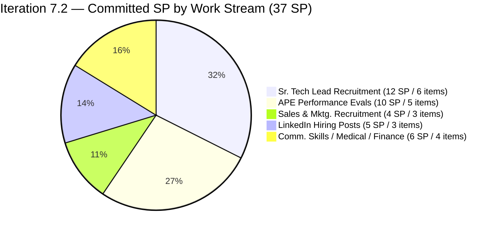
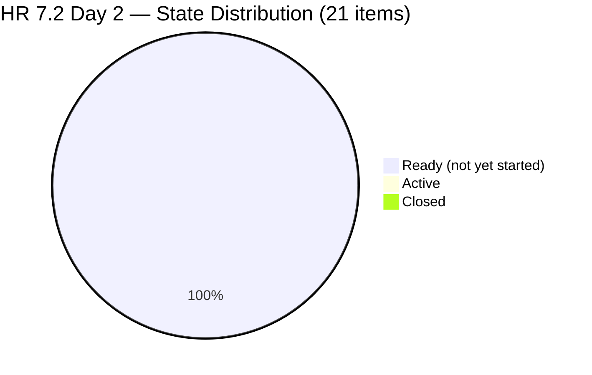
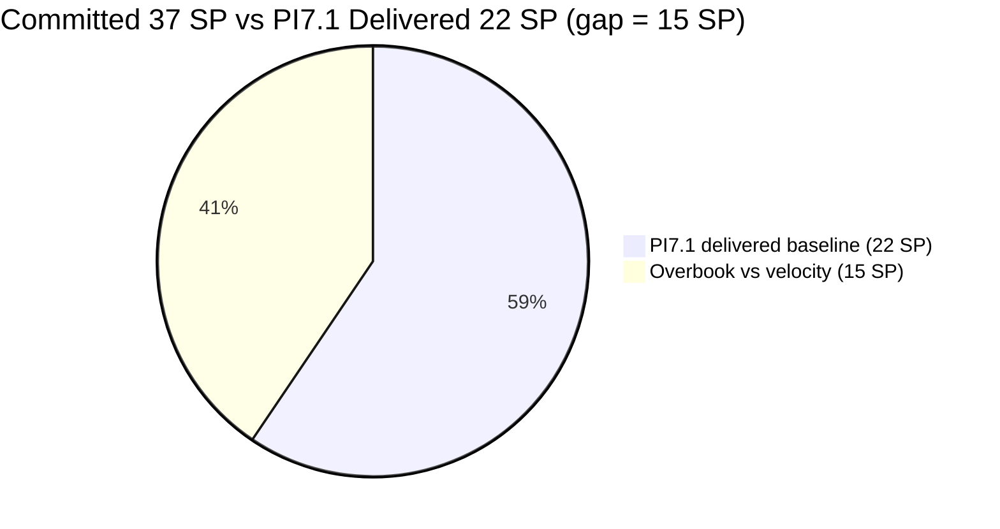
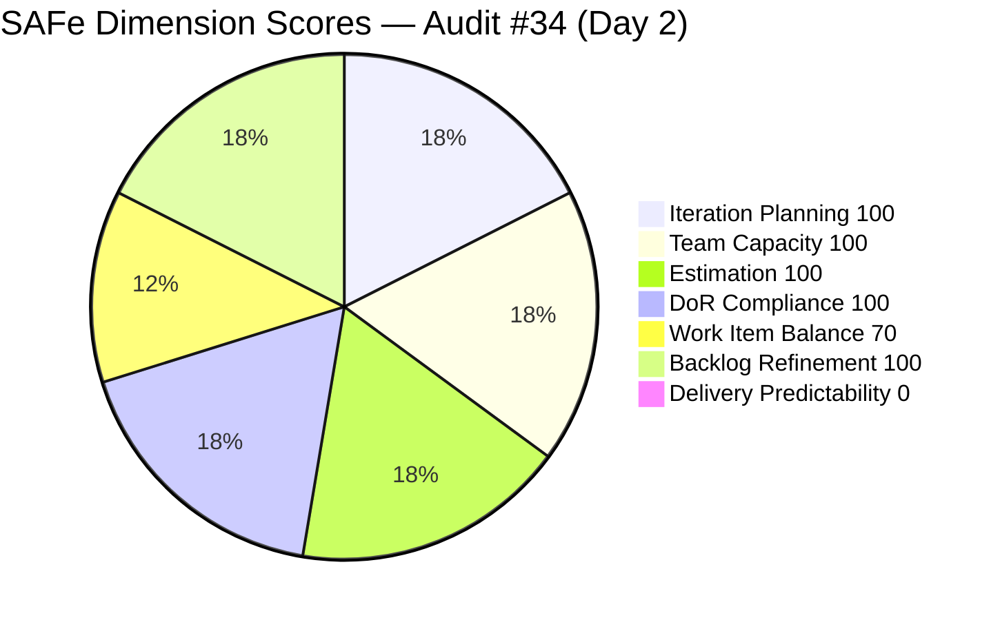

# ADO SAFe Iteration Audit — Human Resource Recruitment Team

**Audit #34 | Iteration 7.2 (Apr 20 – May 3, 2026) | Day 2 of 14 (~14% elapsed — early sprint)**

---

## 1. Audit Metadata

| Field | Value |
|---|---|
| **Audit Date** | April 21, 2026, 14:00 PDT |
| **Auditor** | Claude Code (ADO SAFe Audit Agent — Team A / non-critical tier) |
| **Workspace** | `ado_hr` |
| **ADO Project** | Jairosoft FINOPS (`e0bb302f-40f9-46c3-8164-6f1acb317d63`) |
| **Team** | Human Resource Recruitment Team (`248f59a6-372c-4b74-8129-9eaf260f211e`) |
| **Iteration** | Iteration 7.2 — Apr 20 to May 3, 2026 |
| **Iteration ID** | `a9888bc5-48df-40dd-bcc8-6926a11aa7c7` |
| **Sprint Day** | Day 2 of 14 (~14% elapsed — early-sprint annotation applies to DP) |
| **Prior Audit** | AUDIT_20260419_1345.md (#33, 7.1 sprint close, Overall 87.0 — Low Risk) |
| **Scoring Model** | ADO SAFe v1 (7-dimension rubric) |
| **Overall Score** | **81.4 / 100** |
| **Risk Band** | **Low Risk** (≥ 80) |

---

## 2. Executive Summary

HR opens Iteration 7.2 at **81.4 (Low Risk)** on Day 2 — the team carries PI7.1's closing momentum into a clean, well-groomed sprint plan. Six dimensions hold above the 70-point floor; only **Delivery Predictability (0.0)** drags the overall average, and it is explicitly annotated as **early-sprint — low delivery expected** per the rubric.

**Planning health:** 21 root items (37 SP) in Iteration 7.2 — all User Stories, all Ready state, all assigned to Almera Kleer Tayao, all with SP estimated, all DoR-compliant. Iteration Planning scores a perfect **100.0** because every visible root item is scoped to the current sprint.

**Scope-vs-capacity warning (P1):** At 37 SP committed against PI7.1's empirical 22 SP delivered, the team is **~68% overbooked** versus demonstrated velocity. The recommendation from Audit #33 to prune 7.2 from 30 SP to ≤22 SP was not just unmet — the pipeline grew by 4 items (203053 Fajardo, 203057 Ramos, 203063 Abina, 203067 APE Tayao) and 7 SP. This is a repeat of the 7.1 overbooking pattern flagged at sprint start.

**Grace's status:** Grace has 0 configured capacity and 0 assignments in 7.2 — consistent with prior sprints. Almera remains the sole contributor (bus factor 1).

**Almera's configured capacity:** 5h/day (3h Documentation + 2h Requirements), 1 day off (May 1). Same sole-contributor profile as PI7.1.

**Positive deltas from Audit #33:**
- #202888 "APE Caumban — Copy" has been renamed to "APE — Caumban, Karl Jordan" (the "— Copy" suffix flagged in Audit #33 was removed).
- Four new 7.2 items were added (#203053, #203057, #203063, #203067) expanding the recruitment funnel rather than re-using ambiguous titles.
- All 21 items were refreshed (touched) between Apr 18–21; only 1 item (#200671) was last touched Apr 18 (pre-sprint-start).

---

## 3. Previous Audit Delta

| Dimension | Day 14 (Apr 19, 7.1 close) | Day 2 (Apr 21, 7.2 open) | Delta |
|---|---|---|---|
| Iteration Planning | 39.3 | 100.0 | +60.7 (iteration rolled over; all items in 7.2) |
| Team Capacity | 100.0 | 100.0 | 0.0 |
| Estimation | 100.0 | 100.0 | 0.0 |
| DoR Compliance | 100.0 | 100.0 | 0.0 |
| Work Item Balance | 70.0 | 70.0 | 0.0 (100% US, structural) |
| Backlog Refinement | 100.0 | 100.0 | 0.0 |
| Delivery Predictability | 100.0 | **0.0** | −100.0 (early-sprint, Day 2) |
| **Overall** | **87.0** | **81.4** | **−5.6** (early-sprint mechanical) |

**Key changes since Audit #33 (Apr 19 sprint close):**

- **Iteration rolled over Apr 20 00:00 UTC.** All 21 items previously flagged as 7.2 pipeline are now the active Iteration 7.2.
- **#202888 renamed.** "APE — Caumban, Karl Jordan — Copy" is now "APE — Caumban, Karl Jordan" (the duplicate-of-#193582 taxonomy risk was resolved). The R3 item from Audit #33 is closed.
- **4 new items added to 7.2 (~7 SP):**
  - #203053 Sr. Tech Lead — Reban Cliff Fajardo (2 SP)
  - #203057 Sr. Tech Lead — Rodelio Ramos (2 SP)
  - #203063 Sales & Mktg. — Angel Dorothy Abina (2 SP)
  - #203067 APE — Tayao, Almera Kleer (2 SP, self-evaluation)
- **Total 7.2 commitment: 37 SP across 21 User Stories** — up from the 30 SP / 17 items snapshot at 7.1 close. **The P0 recommendation from Audit #33 to prune to ≤22 SP was not implemented.**
- **All 21 items are Ready state** — strong DoR discipline heading into sprint.
- **Almera's capacity:** configured at 5h/day (3h Doc + 2h Req) with 1 day off (May 1). Similar profile to 7.1.

---

## 4. Current Iteration Snapshot

| Metric | Value |
|---|---|
| **Iteration** | 7.2 — Apr 20 to May 3, 2026 |
| **Iteration Day** | Day 2 of 14 (~14% elapsed) |
| **Visible root backlog items** | 21 (all in 7.2) |
| **Current iteration root items (7.2)** | 21 |
| **Point-eligible current items** | 21 |
| **Estimated items (SP > 0)** | 21 (100%) |
| **Committed Story Points** | **37 SP** |
| **Closed Story Points** | 0 SP (Day 2) |
| **Contributors with current work** | 1 (Almera Kleer Tayao) |
| **Configured capacity** | Almera 5h/day (Documentation 3h + Requirements 2h) |
| **Days off** | 1 (May 1, International Labor Day — 1/14 days = 7%) |
| **DoR compliance** | 21/21 (100%) |
| **Untouched current items (ChangedDate < Apr 20)** | 1 (#200671, Apr 18) |

### Sprint Item List — Iteration 7.2 (21 items / 37 SP)

| ID | Title | Type | State | SP | ChangedDate | Touched since Apr 20? |
|---|---|---|---|---|---|---|
| 197939 | Communication Skills Proposals Summary Presentation | US | Ready | 2 | Apr 20 20:42 | Yes |
| 200671 | LinkedIn Tech Sales from Manila Hiring | US | Ready | 1 | **Apr 18 06:57** | **No (untouched)** |
| 201273 | LinkedIn Bubble Trainer Hiring — Interview | US | Ready | 2 | Apr 21 01:14 | Yes |
| 202017 | Sr. Tech Lead — Mark Jovet Verano — Client Interview & Decision | US | Ready | 2 | Apr 21 01:14 | Yes |
| 202022 | Sr. Tech Lead — Stephen Pabatao — Client Interview & Decision | US | Ready | 2 | Apr 21 01:14 | Yes |
| 202039 | Sales & Mktg. — John Dave Fernandez (Decision) | US | Ready | 1 | Apr 21 01:14 | Yes |
| 202042 | Sales & Mktg. — Edgardo Rojas Jr. (Final Decision) | US | Ready | 1 | Apr 21 01:15 | Yes |
| 202093 | LinkedIn DevOps Engr. Hiring | US | Ready | 2 | Apr 20 20:40 | Yes |
| 202099 | Annual Medical Check-up — Cebu Employees PI7 | US | Ready | 1 | Apr 20 20:41 | Yes |
| 202104 | APE — Rommel Senillo — Summary PI7 | US | Ready | 2 | Apr 21 01:06 | Yes |
| 202109 | APE — Calvin John Dalino — Summary | US | Ready | 2 | Apr 21 01:06 | Yes |
| 202114 | APE — Ryan Vince Castillo | US | Ready | 2 | Apr 21 01:06 | Yes |
| 202349 | Finance Reporting & Export | US | Ready | 2 | Apr 20 20:12 | Yes |
| 202885 | Sr. Tech Lead — Buenaventura, Sidney | US | Ready | 2 | Apr 21 00:59 | Yes |
| 202886 | Sr. Tech Lead — Beltran, Ken Henson | US | Ready | 2 | Apr 21 00:59 | Yes |
| 202887 | Sr. Tech Lead — Barua, Marlo | US | Ready | 2 | Apr 21 00:59 | Yes |
| 202888 | APE — Caumban, Karl Jordan *(renamed from "— Copy")* | US | Ready | 2 | Apr 21 01:00 | Yes |
| **203053** | Sr. Tech Lead — Reban Cliff Fajardo *(new)* | US | Ready | 2 | Apr 21 00:59 | Yes |
| **203057** | Sr. Tech Lead — Rodelio Ramos *(new)* | US | Ready | 2 | Apr 21 00:59 | Yes |
| **203063** | Sales & Mktg. — Angel Dorothy Abina *(new)* | US | Ready | 2 | Apr 21 01:15 | Yes |
| **203067** | APE — Tayao, Almera Kleer *(new, self-evaluation)* | US | Ready | 2 | Apr 21 01:06 | Yes |

**Total: 21 items / 37 SP / all Ready / all Almera / all User Story / 1 untouched since sprint start**

---

## 5. Work Item Analysis

### Commitment Composition



### State Distribution at Day 2



### Commitment vs Empirical Velocity



### Observations

- **Commitment 37 SP exceeds PI7.1 delivery (22 SP) by ~68%.** Even PI6.5's 34 SP (current series-high, burst-day delivery) is below the 7.2 commitment. Without a structural capacity change (e.g., dedicated backup contributor), this sprint is structurally overbooked.
- **All items Ready / DoR-compliant.** Planning artifact quality remains excellent — every item has a well-formed Description, Acceptance Criteria with a Metric line, and SP estimate.
- **One untouched item (#200671).** LinkedIn Tech Sales from Manila Hiring was last touched Apr 18 06:57 UTC, just under 48 hours before the iteration started. At 1/21 = 4.8%, this falls under the 10% threshold so no Backlog Refinement penalty applies — but it is the single item that did not receive a sprint-start refresh.
- **Zero Spike, Zero Enabler, Zero Defect.** 100% User Story mix → −30 Work Item Balance penalty (structural for HR recruitment work).
- **Forward recruitment funnel has 6 Sr. Tech Lead candidate items** in flight simultaneously (Buenaventura, Beltran, Barua, Verano, Pabatao, Fajardo, Ramos — 7 actually). This is a deep candidate pipeline; consider whether all 7 can realistically progress in a single 14-day sprint.

---

## 6. SAFe Compliance Scorecard

| Dimension | Score | Evidence | Notes |
|---|---|---|---|
| Iteration Planning | **100.0** | 21 current / 21 visible root items | Perfect scoping — every visible root item is in the active sprint |
| Team Capacity | **100.0** | 1/1 contributor with current work has configured activity (Almera 5h/day) | Sole-contributor baseline; bus factor = 1 |
| Estimation | **100.0** | 21/21 point-eligible items have SP > 0 | All 21 items estimated (37 SP total) |
| DoR Compliance | **100.0** | 21/21 pass Description ≥30 nws + AC ≥20 nws | Standard HR story templates with Metric line |
| Work Item Balance | **70.0** | 21 User Stories (100%) → dominant_type_share = 100% > 60% → −30 | Has US so no −40; no Spike so no −20; structural HR penalty |
| Backlog Refinement | **100.0** | fresh = 21/21 = 100%; stale_90 = 0; stale_180 = 0; untouched_current = 1/21 = 4.8% (< 10%, no penalty) | Excellent sprint-start hygiene |
| Delivery Predictability | **0.0** | 0 SP closed / 37 SP committed — *early-sprint — low delivery expected* (Day 2 of 14) | Rubric-mandated early-sprint annotation; no formula adjustment |
| **Overall** | **81.4** | (100 + 100 + 100 + 100 + 70 + 100 + 0) / 7 = 570/7 = 81.4 | **Low Risk** (≥ 80) |

### Score Computation

```
Iteration Planning      = round(21 / 21 × 100, 1)   = 100.0
Team Capacity           = round(1 / 1 × 100, 1)     = 100.0
Estimation              = round(21 / 21 × 100, 1)   = 100.0
DoR Compliance          = round(21 / 21 × 100, 1)   = 100.0

Work Item Balance:
  has_user_story        = True (21 US)              → no −40
  dominant_type_share   = 21/21 = 100% > 60%        → −30
  spike_share           = 0/21 = 0% < 40%           → 0
  total                 = 100 − 30                  = 70.0

Backlog Refinement:
  fresh_visible (≤45d)  = 21/21 = 100%              → base = 100.0
  stale_90              = 0/21 = 0%                 → 0
  stale_180             = 0                         → 0
  untouched_current     = 1/21 = 4.8% < 10%         → 0
  total                                             = 100.0

Delivery Predictability = round(0 / 37 × 100, 1)    = 0.0
  [Day 2 of 14 — early-sprint annotated, no formula adjustment per rubric]

Overall = round((100.0 + 100.0 + 100.0 + 100.0 + 70.0 + 100.0 + 0.0) / 7, 1)
        = round(570.0 / 7, 1)
        = 81.4  → Low Risk
```



---

## 7. Dimension Findings

### 7.1 Iteration Planning — 100.0 (Low Risk)

Every one of the 21 visible root backlog items is scoped to Iteration 7.2. This is the inverse pattern from Audit #33 (39.3 at sprint close) where closed items dropped from the backlog API and unscoped 7.2 items skewed the ratio down. Today's 100.0 reflects a clean sprint-planning baseline.

### 7.2 Team Capacity — 100.0 (Low Risk, with bus-factor caveat)

Almera is the sole contributor with current work and is configured at 5h/day (Documentation 3h + Requirements 2h), 1 day off (May 1, Labor Day). Per rubric, 1/1 contributors_with_capacity = 100.0.

**Structural caveat (not rubric-affecting):** Bus factor = 1. Grace is on the team roster but has 0 configured capacity and 0 7.2 assignments. Total team throughput = 5h × 13 working days = 65 hours over the sprint.

### 7.3 Estimation — 100.0 (Low Risk)

All 21 point-eligible items have SP > 0:
- 18 items at 2 SP
- 3 items at 1 SP (#200671 LinkedIn Tech Sales Manila, #202039 Fernandez Decision, #202042 Rojas Final Decision)

Total commitment = 37 SP.

### 7.4 DoR Compliance — 100.0 (Low Risk)

All 21 items pass the rubric's thresholds (Description ≥ 30 non-whitespace chars, AC ≥ 20 non-whitespace chars). Story templates are consistent:
- Recruitment items: "I want to process and complete the recruitment steps for [Name]… so that his/her application is properly evaluated and a hiring decision is made." with 5-condition AC plus Metric.
- APE items: "To facilitate and complete the annual performance evaluation of [Name]…" with 5-condition AC plus Metric.
- LinkedIn sourcing: "I want to publish and manage the [Role] job posting on LinkedIn… so that qualified candidates are sourced and shortlisted." with 5-condition AC plus "at least 3 qualified candidates shortlisted" Metric.

### 7.5 Work Item Balance — 70.0 (Moderate, structural)

21 User Stories / 0 Defects / 0 Spikes / 0 Enablers / 0 Issues. Penalty breakdown:

- Has User Story: Yes → no −40
- Dominant type share: 100% > 60% → **−30**
- Spike share: 0% < 40% → no −20
- Total: 100 − 30 = **70.0**

This is structural for HR recruitment/compliance work. To remove the penalty, the team would need to add at least one non-User-Story item (Spike, Enabler, or Defect) totaling ≥ 40% of the sprint composition — unrealistic at current 21-item scale. A single Spike at 1/21 = 4.8% would not change the dominance percentage meaningfully.

### 7.6 Backlog Refinement — 100.0 (Low Risk)

- fresh_visible_root_items: 21/21 (all ChangedDate ≥ Mar 7, 2026)
- stale_90: 0/21 = 0%
- stale_180: 0
- untouched_current (ChangedDate < Apr 20): 1/21 = 4.8% (< 10% threshold) — #200671 LinkedIn Tech Sales Manila last touched Apr 18 06:57 UTC
- Total: 100.0 (no penalties triggered)

The 4.8% untouched ratio is well below the 10% threshold, so no penalty applies. However, #200671 is worth an explicit prompt to Almera before Day 3 to refresh its status or confirm commitment.

### 7.7 Delivery Predictability — 0.0 (early-sprint — low delivery expected)

0 SP closed / 37 SP committed = 0.0 per rubric formula. Per skill spec Section 3.7: "When the iteration is in its first 5 days (Day 1–5 of a 14-day sprint), annotate the dimension findings with 'early-sprint — low delivery expected'. No formula adjustment." Today is Day 2 of 14.

**Commitment-vs-velocity analysis:**

| Reference | SP | Result |
|---|---|---|
| PI7.1 (Apr 6–19) — actual delivery | 22 | Low Risk close at 87.0 |
| PI6.5 (Mar 10–22) — series-high burst sprint | 34 | Low Risk close at 80.0 |
| PI7.2 — current commitment | **37** | Exceeds both references |
| Recommended range (≤ PI7.1 delivery) | ≤22 | — |

The sprint is **15 SP / 68% overbooked** versus PI7.1's delivered velocity. Without structural capacity change, a de-scoping decision is recommended by Day 5 to preserve the end-of-sprint Delivery Predictability score.

---

## 8. Risks and Bottlenecks

| # | Risk | Severity | Trend |
|---|---|---|---|
| R1 | **37 SP commitment exceeds PI7.1 delivery (22 SP) by ~68%** — structurally overbooked; repeat of 7.1 sprint-start overbooking. The Audit #33 P0 recommendation to prune 7.2 to ≤22 SP was not implemented. | HIGH | New — sprint-start signal |
| R2 | Bus factor = 1 — all 21 items / 37 SP assigned to Almera alone | HIGH | Structural, persistent across 34 audits |
| R3 | 6–7 Sr. Tech Lead candidates in simultaneous flight (Buenaventura, Beltran, Barua, Verano, Pabatao, Fajardo, Ramos) — pipeline depth may exceed interview/decision bandwidth | MEDIUM | New — pipeline concentration |
| R4 | #200671 LinkedIn Tech Sales Manila untouched since Apr 18 — not yet refreshed for 7.2 | LOW | New — minor hygiene gap |
| R5 | Grace has 0 configured capacity and 0 assignments — no second contributor to absorb overflow | MEDIUM | Structural, persistent |
| R6 | Work Item Balance −30 penalty (100% User Story) — structural HR characteristic | LOW | Structural, persistent across 34 audits |
| R7 | No iteration goal documented in ADO for 7.2 — persistent gap | LOW | Persistent across 34 audits |
| R8 | #203067 APE — Tayao Almera Kleer — self-evaluation, Almera is the sole contributor AND subject of her own evaluation (supervisor is needed); ensure supervisor path is defined | LOW | New — process-clarity flag |

---

## 9. Prioritized Recommendations

1. **[P0 — Day 2–3] De-scope 37 SP → ≤22 SP to match PI7.1 empirical velocity.** Candidate de-scope items (lowest-priority recruitment cycle extensions): #203053 Fajardo, #203057 Ramos (newest Sr. Tech Lead candidates), #203067 Tayao APE (self-eval can be moved to 7.3), #203063 Abina, and one of the new APE items (#202104–114). Reducing to ≤11 items / ≤22 SP preserves 100% delivery predictability and prevents sprint-end descoping churn.

2. **[P0 — Day 2–3] Define a sprint goal for 7.2.** HR has never documented a sprint goal in 34 audits. Suggested template: "By May 3, close ≥4 Sr. Tech Lead candidate decisions and complete ≥3 APE summaries so that PI7 recruitment and evaluation velocity is sustained." Capture in iteration description.

3. **[P1 — Day 2] Refresh #200671 LinkedIn Tech Sales Manila.** The only item not touched since sprint start. Either update status, confirm active, or de-scope from 7.2.

4. **[P1 — Day 2–3] Clarify #203067 APE — Tayao self-evaluation supervisor path.** Since Almera is the sole team contributor AND the subject of her own APE, identify the reviewing supervisor (Ramon? OTP?) and add to Description.

5. **[P2 — 7.2 mid-sprint] Add a Spike item to diversify Work Item mix.** Suggested: "Investigate LinkedIn Recruiter advanced-filter analytics for Sr. Tech Lead candidate sourcing optimization." A 1 SP Spike diversifies types (even if it doesn't cross the 40% threshold to remove the penalty, it begins the pattern change).

6. **[P2 — Ongoing] Stage the Sr. Tech Lead pipeline.** 7 candidate items in simultaneous flight is ambitious. Suggest staging: 3 items through client-interview-and-decision in 7.2, 2 items to HR-screening in 7.2, 2 items de-scoped to 7.3.

7. **[P3 — Ongoing] Resource planning discussion with Ramon.** At 37 SP / 1 contributor, the structural bus-factor-1 constraint is the single largest risk to HR throughput. Discuss either contractor capacity, Grace activation, or cross-training before PI7 retrospective.

---

## 10. Evidence Gaps and Limitations

| Gap | Description |
|---|---|
| **Iteration Goal** | No iteration goal is documented in the ADO iteration definition. Persistent across 34 HR audits. Limits outcome-based retrospective. |
| **De-scoping rationale for 4 items not implemented** | Audit #33 P0 recommended pruning 7.2 to ≤22 SP. The sprint opened with 37 SP. ADO audit trail does not reveal whether a planning session occurred and decided against pruning, or if no planning session was held. |
| **Grace's role on team** | Grace remains on team roster with 0 capacity and 0 assignments. No explicit evidence of whether this is intentional (e.g., she is working on ADO Admin/Finance tasks outside the HR scope) or a gap. |
| **Sr. Tech Lead pipeline stage tracking** | 7 candidate items (Buenaventura, Beltran, Barua, Verano, Pabatao, Fajardo, Ramos) are in flight. ADO titles use a mix of "Sr. Tech Lead — [Name]" and "Sr. Tech Lead — [Name] — Client Interview & Decision" patterns. Without stage suffixes on the first four, it is unclear which stage each candidate is in. |
| **#203067 APE self-evaluation supervisor** | The APE — Tayao Almera Kleer item is self-assigned. The AC references "Evaluation is reviewed and finalized by HR" — but Almera IS the HR team. Supervisor path is ambiguous. |

---

## 11. Score Trend

### PI7 Score Trajectory — HR Team

| Audit | Date | Score | Band | Sprint | Day |
|-------|------|-------|------|--------|-----|
| #25 | Apr 6 | 71.9 | Moderate | 7.1 | 1 |
| #26 | Apr 7 | 76.1 | Moderate | 7.1 | 2 |
| #27 | Apr 8 | 76.1 | Moderate | 7.1 | 3 |
| #28 | Apr 9 | 76.1 | Moderate | 7.1 | 4 |
| #29 | Apr 12 | 77.6 | Moderate | 7.1 | 7 |
| #30 | Apr 13 | 77.6 | Moderate | 7.1 | 8 |
| #31 | Apr 16 | 78.4 | Moderate | 7.1 | 11 |
| #32 | Apr 17 | 78.4 | Moderate | 7.1 | 12 |
| #33 | Apr 19 | **87.0** | **Low Risk** | 7.1 close | 14 |
| **#34** | **Apr 21** | **81.4** | **Low Risk** | **7.2 open** | **2** |

---

*Report generated by Claude Code ADO SAFe Audit Agent | April 21, 2026 14:00 PDT*
*Audit #34 — HR Recruitment Team — Iteration 7.2 Day 2 — Overall: 81.4 / 100 — Low Risk (early-sprint)*
