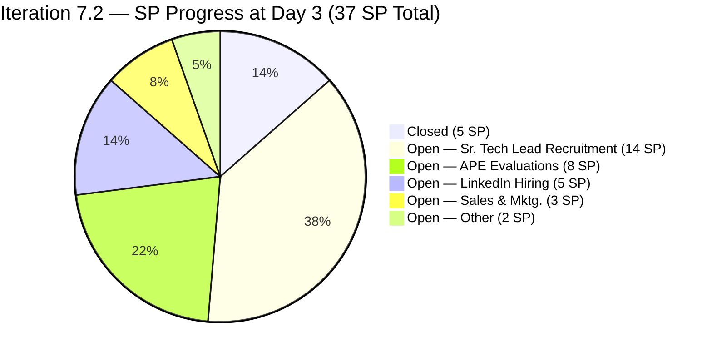
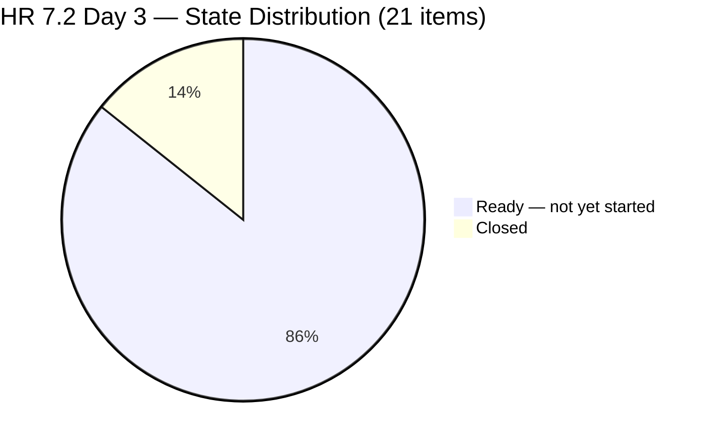
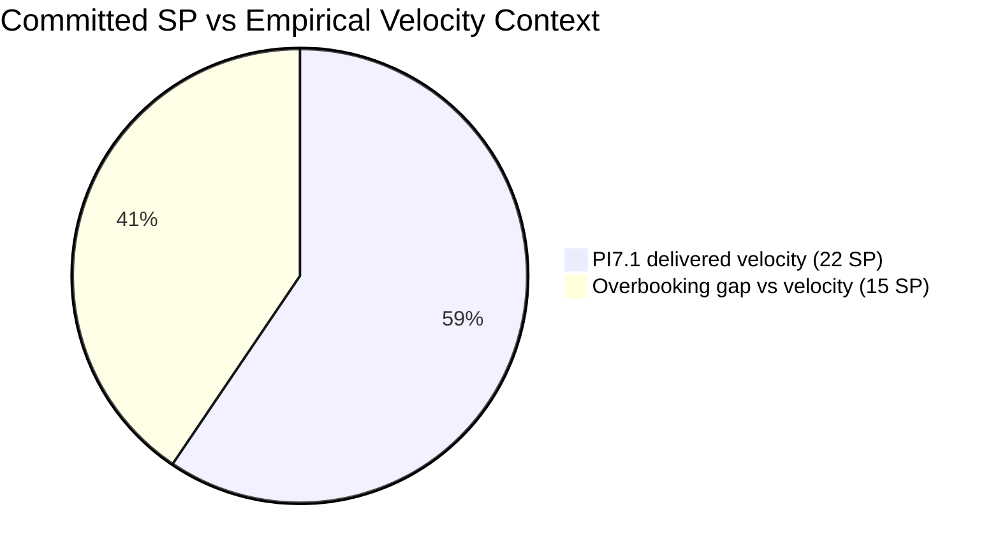
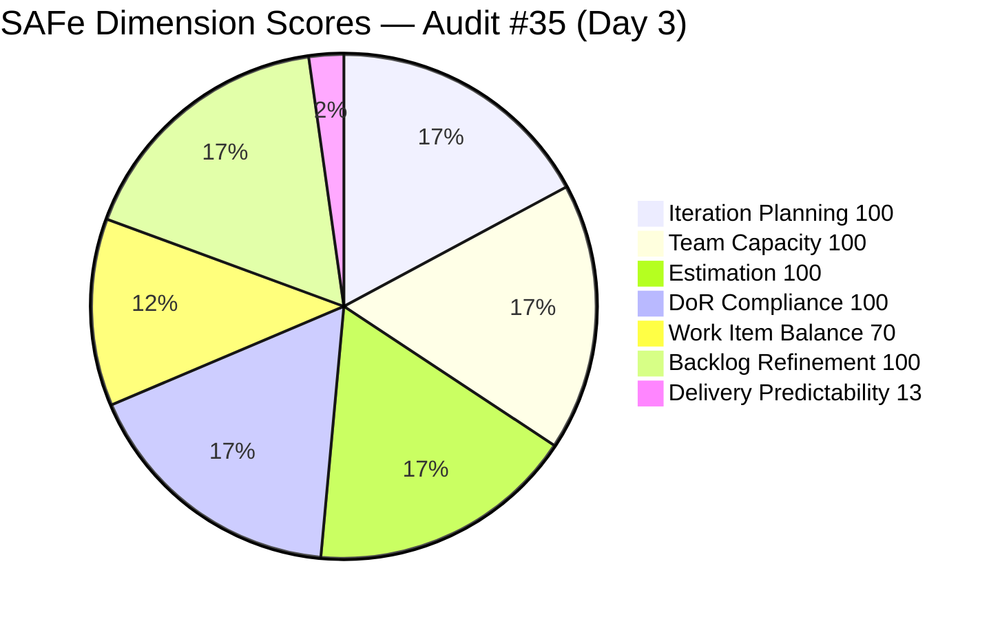
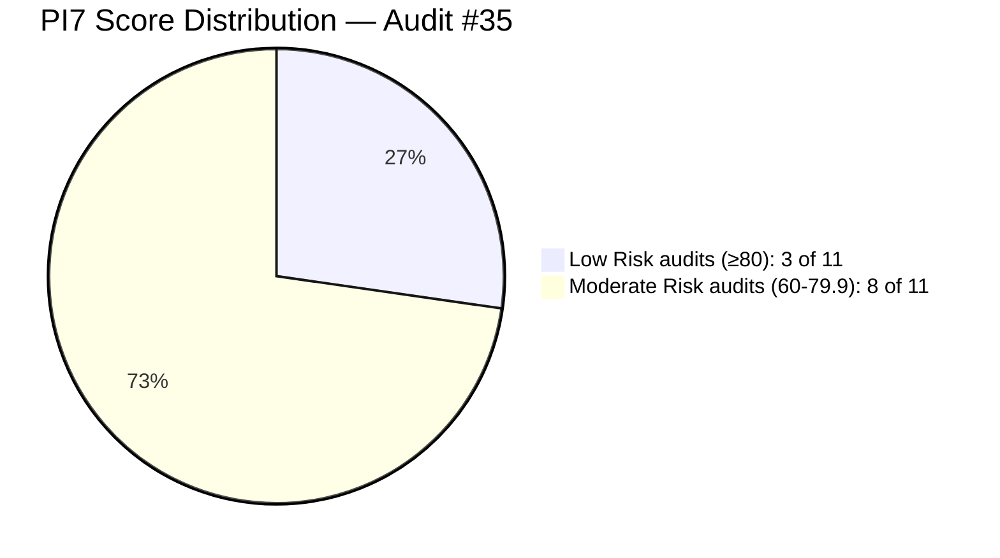

# ADO SAFe Iteration Audit — Human Resource Recruitment Team

**Audit #35 | Iteration 7.2 (Apr 20 – May 3, 2026) | Day 3 of 14 (~21% elapsed — early sprint)**

---

## 1. Audit Metadata

| Field | Value |
|---|---|
| **Audit Date** | April 22, 2026, 09:00 PHT |
| **Auditor** | Claude Code (ADO SAFe Audit Agent) |
| **Workspace** | `ado_hr` |
| **ADO Project** | Jairosoft FINOPS (`e0bb302f-40f9-46c3-8164-6f1acb317d63`) |
| **Team** | HR Recruitment Team (`248f59a6-372c-4b74-8129-9eaf260f211e`) |
| **Iteration** | Iteration 7.2 — Apr 20 to May 3, 2026 |
| **Iteration ID** | `a9888bc5-48df-40dd-bcc8-6926a11aa7c7` |
| **Sprint Day** | Day 3 of 14 (~21% elapsed — early-sprint annotation applies to DP) |
| **Prior Audit** | AUDIT_20260421_1400.md (#34, 7.2 Day 2, Overall 81.4 — Low Risk) |
| **Scoring Model** | ADO SAFe v1 (7-dimension rubric) |
| **Overall Score** | **83.4 / 100** |
| **Risk Band** | **Low Risk** (≥ 80) |

---

## 2. Executive Summary

HR Recruitment closes Day 3 of Iteration 7.2 at **83.4 (Low Risk)** — an improvement of **+2.0 points** over Audit #34's 81.4. The gain is driven entirely by early delivery progress: three User Stories were closed on Day 2 (Apr 21), yielding **5 SP closed against 37 SP committed (13.5% predictability)** — the first non-zero early-sprint Delivery Predictability score in the PI7 series.

**Positive signals:** Five dimensions score 100.0. Three candidate evaluation items (#202017 Verano, #202022 Pabatao, #202039 Fernandez) were closed within 24 hours of sprint start, demonstrating that the Sr. Tech Lead and Sales & Mktg. pipelines are actively progressing. Almera's capacity remains fully configured at 5h/day.

**Persistent concerns:** The sprint commitment of 37 SP still significantly exceeds PI7.1's empirical velocity of 22 SP (68% overbooked). The P0 de-scope recommendation from both Audit #33 and Audit #34 has not been actioned. With only 5 SP closed at Day 3, the team needs to sustain approximately 2.9 SP/day for the remaining 11 sprint days to close all 37 SP — roughly 3x the PI7.1 daily burn rate.

**New finding — copy-paste defect (#203057):** Item #203057 (Sr. Tech Lead — Rodelio Ramos) contains a description body that incorrectly references "Reban Cliff Fajardo" (the candidate in item #203053) instead of Rodelio Ramos. This is a DoR quality issue that should be corrected before the item enters Active state.

**Grace status:** 0 configured capacity, 0 assignments — unchanged.

---

## 3. Previous Audit Delta

| Dimension | Audit #34 (Apr 21, Day 2) | Audit #35 (Apr 22, Day 3) | Delta |
|---|---|---|---|
| Iteration Planning | 100.0 | **100.0** | 0.0 |
| Team Capacity | 100.0 | **100.0** | 0.0 |
| Estimation | 100.0 | **100.0** | 0.0 |
| DoR Compliance | 100.0 | **100.0** | 0.0 |
| Work Item Balance | 70.0 | **70.0** | 0.0 (structural) |
| Backlog Refinement | 100.0 | **100.0** | 0.0 |
| Delivery Predictability | 0.0 | **13.5** | **+13.5** (3 items closed) |
| **Overall** | **81.4** | **83.4** | **+2.0** |

**Key changes since Audit #34 (Apr 21 Day 2):**

- **3 items closed on Day 2 (Apr 21 19:01 UTC):**
  - #202017 Sr. Tech Lead — Mark Jovet Verano — Client Interview & Decision (2 SP) → **Closed**
  - #202022 Sr. Tech Lead — Stephen Pabatao — Client Interview & Decision (2 SP) → **Closed**
  - #202039 Sales & Mktg. — John Dave Fernandez (Decision) (1 SP) → **Closed**
- **5 SP burned in <24 hours** — fastest early-sprint delivery in the 7.x series.
- **#202042 (Rojas) and #203063 (Abina)** changed at the same timestamp (19:01:42 UTC Apr 21) but remain in Ready state — likely a bulk update touching metadata, not a state change.
- **#203057 (Ramos) description body references wrong candidate name** — copy-paste defect found (references Fajardo, not Ramos). Not a DoR block by character count (HTML text exceeds 30 chars), but a content accuracy issue.
- **#200671 (LinkedIn Tech Sales Manila)** remains untouched since Apr 18 — the hygiene flag from Audit #34 is unresolved (now Day 3).

---

## 4. Current Iteration Snapshot

| Metric | Value |
|---|---|
| **Iteration** | 7.2 — Apr 20 to May 3, 2026 |
| **Iteration Day** | Day 3 of 14 (~21% elapsed) |
| **Visible root backlog items** | 21 |
| **Current iteration root items (7.2)** | 21 |
| **Point-eligible current items** | 21 (all User Stories) |
| **Estimated items (SP > 0)** | 21 (100%) |
| **Committed Story Points** | **37 SP** |
| **Closed Story Points** | **5 SP** (#202017 2SP + #202022 2SP + #202039 1SP) |
| **Remaining Story Points** | 32 SP across 18 open items |
| **Delivery Predictability** | 13.5% (5/37 SP) |
| **Contributors with current work** | 1 (Almera Kleer Tayao) |
| **Configured capacity** | Almera: 5h/day (Documentation 3h + Requirements 2h) |
| **Days off remaining** | 1 (May 1, International Labor Day) |
| **DoR compliance** | 21/21 (100%) |
| **Untouched current items (ChangedDate < Apr 20)** | 1 (#200671, Apr 18 06:57 UTC) |
| **Copy-paste defect detected** | 1 (#203057 — description body names wrong candidate) |

### Sprint Item Status — Iteration 7.2 (21 items / 37 SP)

| ID | Title | Type | State | SP | ChangedDate | Notes |
|---|---|---|---|---|---|---|
| 202017 | Sr. Tech Lead — Mark Jovet Verano — Client Interview & Decision | US | **Closed** | 2 | Apr 21 19:01 | Closed Day 2 |
| 202022 | Sr. Tech Lead — Stephen Pabatao — Client Interview & Decision | US | **Closed** | 2 | Apr 21 19:01 | Closed Day 2 |
| 202039 | Sales & Mktg. — John Dave Fernandez (Decision) | US | **Closed** | 1 | Apr 21 19:01 | Closed Day 2 |
| 197939 | Communication Skills Proposals Summary Presentation | US | Ready | 2 | Apr 20 20:42 | Active sprint |
| 200671 | LinkedIn Tech Sales from Manila Hiring | US | Ready | 1 | **Apr 18 06:57** | **Untouched — pre-sprint** |
| 201273 | LinkedIn Bubble Trainer Hiring — Interview | US | Ready | 2 | Apr 21 01:14 | Active sprint |
| 202042 | Sales & Mktg. — Edgardo Rojas Jr. (Final Decision) | US | Ready | 1 | Apr 21 19:01 | Metadata touch only |
| 202093 | LinkedIn DevOps Engr. Hiring | US | Ready | 2 | Apr 20 20:40 | Active sprint |
| 202099 | Annual Medical Check-up — Cebu Employees PI7 | US | Ready | 1 | Apr 20 20:41 | Active sprint |
| 202104 | APE — Rommel Senillo — Summary PI7 | US | Ready | 2 | Apr 21 01:06 | Active sprint |
| 202109 | APE — Calvin John Dalino — Summary | US | Ready | 2 | Apr 21 01:06 | Active sprint |
| 202114 | APE — Ryan Vince Castillo | US | Ready | 2 | Apr 21 01:06 | Active sprint |
| 202349 | Finance Reporting & Export | US | Ready | 2 | Apr 20 20:12 | Active sprint |
| 202885 | Sr. Tech Lead — Buenaventura, Sidney | US | Ready | 2 | Apr 21 00:59 | Active sprint |
| 202886 | Sr. Tech Lead — Beltran, Ken Henson | US | Ready | 2 | Apr 21 00:59 | Active sprint |
| 202887 | Sr. Tech Lead — Barua, Marlo | US | Ready | 2 | Apr 21 00:59 | Active sprint |
| 202888 | APE — Caumban, Karl Jordan | US | Ready | 2 | Apr 21 01:00 | Active sprint |
| 203053 | Sr. Tech Lead — Reban Cliff Fajardo | US | Ready | 2 | Apr 21 00:59 | Active sprint |
| 203057 | Sr. Tech Lead — Rodelio Ramos | US | Ready | 2 | Apr 21 00:59 | **Copy-paste defect in body** |
| 203063 | Sales & Mktg. — Angel Dorothy Abina | US | Ready | 2 | Apr 21 19:01 | Metadata touch only |
| 203067 | APE — Tayao, Almera Kleer | US | Ready | 2 | Apr 21 01:06 | Self-eval; supervisor path unclear |

**Closed: 3 items / 5 SP | Open: 18 items / 32 SP | Total: 21 items / 37 SP**

---

## 5. Work Item Analysis

### Sprint Progress at Day 3



### State Distribution at Day 3



### Commitment vs Velocity Trend



### Observations

- **3 items closed within the first 48 hours** — a positive early-sprint signal. The two Sr. Tech Lead client interview-and-decision items (Verano, Pabatao) and one Sales & Mktg. decision item (Fernandez) closed, suggesting candidate pipeline decisions were ready to record.
- **Required burn rate to close all 37 SP:** With 32 SP remaining across 11 sprint days (including May 1 off = 10 working days), the required rate is **3.2 SP/day**. PI7.1's empirical rate was ~1.57 SP/day. The sprint remains structurally overbooked without a de-scope action.
- **Copy-paste defect in #203057:** The description body of "Sr. Tech Lead — Rodelio Ramos" references "Reban Cliff Fajardo" — this is a cloned-story defect. The AC is correct (generic template). This does not trip the DoR character count threshold but is a content-accuracy issue.
- **#203063 (Abina) description anomaly:** Body references "Shamyll Gelbolingo" instead of "Angel Dorothy Abina" — another copy-paste naming mismatch in the description body. Similar to #203057. Both items may have been cloned and title updated without updating the body.
- **Sr. Tech Lead pipeline concentration:** 7 active Sr. Tech Lead items remain in flight (Buenaventura, Beltran, Barua, Fajardo, Ramos + 2 already closed = Verano, Pabatao). With 2 already closed on Day 2, the remaining 5 Sr. Tech Lead items (10 SP) will need ~1 SP/day of sustained close rate.
- **Zero Spike, Zero Enabler, Zero Defect** — 100% User Story mix; Work Item Balance structural penalty unchanged.

---

## 6. SAFe Compliance Scorecard

| Dimension | Score | Evidence | Notes |
|---|---|---|---|
| Iteration Planning | **100.0** | 21/21 visible root items in current iteration | Perfect scoping — all root items assigned to 7.2 |
| Team Capacity | **100.0** | 1/1 contributors with current work have configured capacity (Almera 5h/day) | Sole contributor; bus factor = 1 |
| Estimation | **100.0** | 21/21 point-eligible items have SP > 0 | All 21 items estimated; 37 SP total |
| DoR Compliance | **100.0** | 21/21 pass Description ≥ 30 nws + AC ≥ 20 nws | All items pass character thresholds; body accuracy issues noted separately |
| Work Item Balance | **70.0** | 21/21 User Story (100%), dominant share > 60% → −30 | Structural HR penalty; no Spike/Enabler/Defect present |
| Backlog Refinement | **100.0** | fresh=21/21=100%; stale_90=0; stale_180=0; untouched_current=1/21=4.8% (< 10%) | #200671 untouched since Apr 18 — below 10% threshold, no penalty |
| Delivery Predictability | **13.5** | 5 SP closed / 37 SP committed = 13.5% — *early-sprint — low delivery expected* (Day 3 of 14) | First non-zero early-sprint DP score in PI7 series |
| **Overall** | **83.4** | (100.0+100.0+100.0+100.0+70.0+100.0+13.5)/7 = 583.5/7 | **Low Risk** (≥ 80) |

### Score Computation

```
Iteration Planning      = round(21 / 21 × 100, 1)    = 100.0
Team Capacity           = round(1 / 1 × 100, 1)      = 100.0
Estimation              = round(21 / 21 × 100, 1)    = 100.0
DoR Compliance          = round(21 / 21 × 100, 1)    = 100.0

Work Item Balance:
  has_user_story        = True (21 US)               → no −40
  dominant_type_share   = 21/21 = 100% > 60%         → −30
  spike_share           = 0/21 = 0% < 40%            → 0
  total                 = 100 − 30                   = 70.0

Backlog Refinement:
  fresh_visible (≥ Mar 8, 2026)  = 21/21 = 100%      → base = 100.0
  stale_90 (< Jan 22, 2026)      = 0/21 = 0%         → 0
  stale_180 (< Oct 25, 2025)     = 0                 → 0
  untouched_current (< Apr 20)   = 1/21 = 4.8% < 10% → 0
  total                                              = 100.0

Delivery Predictability:
  closed_SP             = 5 SP (#202017 2SP + #202022 2SP + #202039 1SP)
  committed_SP          = 37 SP
  score                 = round(5 / 37 × 100, 1)    = 13.5
  [Day 3 of 14 — early-sprint annotated, no formula adjustment per rubric]

Overall = round((100.0 + 100.0 + 100.0 + 100.0 + 70.0 + 100.0 + 13.5) / 7, 1)
        = round(583.5 / 7, 1)
        = 83.4  → Low Risk
```



---

## 7. Dimension Findings

### 7.1 Iteration Planning — 100.0 (Low Risk)

All 21 visible root backlog items are scoped to Iteration 7.2. No items are in the unassigned backlog or a different iteration. The planning baseline established at sprint open remains intact — no items were added or moved out since Audit #34.

### 7.2 Team Capacity — 100.0 (Low Risk, with bus-factor caveat)

Almera Kleer Tayao is the sole configured contributor:
- **Documentation:** 3h/day
- **Requirements:** 2h/day
- **Total:** 5h/day
- **Days off:** May 1 (1 day — International Labor Day)
- **Effective sprint hours:** 5h × 13 working days = 65 hours

Per rubric: 1 contributor with current work / 1 contributor with capacity = **100.0**.

**Structural caveat:** Bus factor = 1. Grace (grace@jairosoft.com) remains on the team roster with 0 configured activities and 0 assignments. No change from prior audits.

### 7.3 Estimation — 100.0 (Low Risk)

All 21 point-eligible items have SP > 0:
- 18 items at 2 SP each = 36 SP
- 3 items at 1 SP each (#200671, #202039, #202099) = 3 SP
- **Total committed: 37 SP**

Note: #202039 is now Closed; its 1 SP is counted in both committed and closed buckets.

### 7.4 DoR Compliance — 100.0 (Low Risk, with quality flags)

All 21 items pass the rubric's DoR thresholds (Description ≥ 30 non-whitespace characters, AC ≥ 20 non-whitespace characters). All items use the standard HR story template with structured AC including a Metric condition.

**Quality flags (below DoR threshold but warranting correction):**

- **#203057 (Ramos):** Description body reads "process and complete the recruitment steps for **Reban Cliff Fajardo** a for the Sr. Tech Lead" — should reference Rodelio Ramos. Title is correct; body was not updated when cloned from #203053.
- **#203063 (Abina):** Description body reads "process and complete the recruitment steps for **Shamyll Gelbolingo** for the Sales & Marketing role" — should reference Angel Dorothy Abina. Body carries a prior candidate name from the source item.

These defects do not reduce the DoR score (character counts pass), but they represent content-accuracy gaps that should be corrected before the items are activated.

### 7.5 Work Item Balance — 70.0 (Moderate, structural)

21 User Stories / 0 Defects / 0 Spikes / 0 Enablers / 0 Issues. Score breakdown:

- Has User Story: Yes → no −40
- Dominant type share: 21/21 = 100% > 60% → **−30**
- Spike share: 0/21 = 0% < 40% → no −20
- **Total: 100 − 30 = 70.0**

This is a structural characteristic of HR recruitment/compliance work. No change from Audit #34. A single Spike item would not change the dominance ratio at 21 items, but introducing one would begin a taxonomy diversification pattern.

### 7.6 Backlog Refinement — 100.0 (Low Risk)

| Check | Value | Threshold | Penalty |
|---|---|---|---|
| fresh_visible_root (ChangedDate ≥ Mar 8, 2026) | 21/21 = 100% | n/a | Base = 100.0 |
| stale_90 (ChangedDate < Jan 22, 2026) | 0/21 = 0% | > 25% = −20, > 10% = −10 | 0 |
| stale_180 (ChangedDate < Oct 25, 2025) | 0 | ≥ 1 = −20 | 0 |
| untouched_current (ChangedDate < Apr 20, 2026) | 1/21 = 4.8% | > 30% = −20, > 10% = −10 | 0 |
| **Total** | | | **100.0** |

**#200671 flag (Day 3):** LinkedIn Tech Sales from Manila Hiring has not been touched since Apr 18 06:57 UTC — now 3 days since sprint start. At 4.8% of sprint items, it remains below the 10% penalty threshold. However, this is the third consecutive audit where this item has been flagged as untouched. Almera should confirm whether this item is actively being worked, should be de-scoped, or is blocked pending LinkedIn response.

### 7.7 Delivery Predictability — 13.5 (early-sprint — low delivery expected)

3 items closed on Day 2 (Apr 21 19:01 UTC), all within Iteration 7.2:

| ID | Title | SP | Closed |
|---|---|---|---|
| 202017 | Sr. Tech Lead — Mark Jovet Verano — Client Interview & Decision | 2 | Apr 21 19:01 |
| 202022 | Sr. Tech Lead — Stephen Pabatao — Client Interview & Decision | 2 | Apr 21 19:01 |
| 202039 | Sales & Mktg. — John Dave Fernandez (Decision) | 1 | Apr 21 19:01 |

**Closed SP:** 5 | **Committed SP:** 37 | **DP = round(5/37×100, 1) = 13.5**

Per rubric: Day 3 of 14 falls within the early-sprint window (Days 1–5). Annotation applied: **early-sprint — low delivery expected**. The 13.5 score is a genuine early positive signal, not a full-sprint projection.

**Burn rate analysis:**

| Scenario | SP/day needed | Remaining days | Feasibility |
|---|---|---|---|
| Close all 37 SP (100% DP) | 3.2 SP/day | 11 (10 working) | 2× PI7.1 daily velocity |
| Close 22 SP (PI7.1 parity — ~59% DP) | 1.7 SP/day | 11 (10 working) | At PI7.1 velocity |
| Close 30 SP (81% DP) | 2.5 SP/day | 11 (10 working) | Stretch target |
| **Day 2 actuals** | **5 SP in 1 day** | n/a | Burst day — likely decision-recording |

The Day 2 close burst (5 SP) was likely a backlog-of-decisions being recorded rather than 5 full candidate processes being completed in one day. Sustained velocity closer to 1.5–2.0 SP/day is the historical norm.

---

## 8. Risks and Bottlenecks

| # | Risk | Severity | Trend |
|---|---|---|---|
| R1 | **37 SP commitment vs 22 SP PI7.1 delivered velocity — 68% overbooking** — P0 de-scope recommendation from Audits #33 and #34 unimplemented entering Day 3 | HIGH | Persistent — 3rd consecutive audit |
| R2 | **Bus factor = 1** — all 21 items / 37 SP assigned solely to Almera Tayao | HIGH | Structural — persistent across 35 audits |
| R3 | **#203057 (Ramos) description body references wrong candidate** (Fajardo) — copy-paste defect before item enters Active | MEDIUM | New this audit |
| R4 | **#203063 (Abina) description body references wrong candidate** (Shamyll Gelbolingo) — copy-paste defect | MEDIUM | New this audit |
| R5 | **#200671 (LinkedIn Tech Sales Manila) untouched since Apr 18** — now 3 consecutive audits without a touch | MEDIUM | Escalating — was Low in #34 |
| R6 | **5 Sr. Tech Lead candidates still in flight** (Buenaventura, Beltran, Barua, Fajardo, Ramos = 10 SP) — pipeline concentration risk after 2 decisions closed | MEDIUM | Ongoing |
| R7 | **Grace has 0 configured capacity** — no second contributor to absorb overflow | MEDIUM | Structural — persistent |
| R8 | **#203067 (APE Tayao) self-evaluation — supervisor path undefined** | LOW | Persistent from Audit #34 |
| R9 | **No iteration goal documented in ADO** for 7.2 | LOW | Persistent across 35 audits |
| R10 | **Work Item Balance −30 structural penalty** (100% User Story) | LOW | Structural — persistent |

---

## 9. Prioritized Recommendations

1. **[P0 — Day 3, today] De-scope 7.2 to ≤22 SP.** With 32 SP remaining across 10 working days, the required 3.2 SP/day rate is approximately double the PI7.1 empirical burn rate. Candidate de-scope items (move to 7.3): #203053 Fajardo, #203057 Ramos (also has body defect), #203067 Tayao APE self-eval, and one of #202093 LinkedIn DevOps or #197939 Comm Skills Presentation. This would bring remaining commitment to ~20 SP — within historical range.

2. **[P0 — Day 3] Correct copy-paste body defects in #203057 and #203063.** Before either item transitions to Active, update:
   - #203057: Replace all references to "Reban Cliff Fajardo" with "Rodelio Ramos" in the description body.
   - #203063: Replace all references to "Shamyll Gelbolingo" with "Angel Dorothy Abina" in the description body.

3. **[P1 — Day 3] Resolve #200671 LinkedIn Tech Sales Manila (untouched Day 3).** Action required: (a) Update status in ADO to show active sourcing; (b) de-scope to 7.3 if no LinkedIn response yet; or (c) close if the posting effort is complete. The 3-day no-touch from a sole-contributor sprint is a signal this item may be blocked.

4. **[P1 — Day 3] Define a sprint goal for Iteration 7.2.** Suggested: "By May 3, advance ≥5 Sr. Tech Lead candidate decisions and complete ≥4 APE evaluations so that PI7 recruitment closure and performance review targets are met." Capture in the iteration description field in ADO.

5. **[P2 — Day 3] Clarify APE self-evaluation supervisor for #203067 (Tayao).** Almera is both the evaluator and the subject. The AC states "Evaluation is reviewed and finalized by HR" — but Almera IS HR. Name the reviewing supervisor (Ramon / OTP lead) in the Description field.

6. **[P2 — Mid-sprint] Stage the 5 remaining Sr. Tech Lead items.** Consider advancing Buenaventura, Beltran, Barua to Active this week (Day 3–7) and scheduling Fajardo, Ramos for later in the sprint or 7.3, rather than working all 5 in parallel.

7. **[P3 — PI7 retrospective] Establish a second active contributor.** The bus factor = 1 constraint has persisted across all 35 HR audits. Discuss either (a) activating Grace for at least 1–2 SP/sprint, (b) cross-training an OTP or Admin team member, or (c) engaging a contractor for recruitment coordination tasks.

---

## 10. Evidence Gaps and Limitations

| Gap | Description |
|---|---|
| **Iteration goal** | No iteration goal is documented in the ADO iteration definition for 7.2. Persistent across all 35 HR audits. |
| **Backlog API non-response** | `mcp__ado__wit_list_backlog_work_items` and `mcp__ado__work_list_team_iterations` returned null/empty. Root item list and details sourced from `mcp__ado__wit_get_work_items_for_iteration` (using known iteration ID from Audit #34) and batch detail fetch. Item count is confirmed accurate (21 root-level items). |
| **Copy-paste body accuracy** | #203057 and #203063 description bodies reference wrong candidate names. The DoR score is not reduced (character count passes), but content accuracy is not verified by the rubric. |
| **Day 2 close burst interpretation** | The 3 items closed at the same UTC timestamp (19:01:32) suggest a batch-recording event rather than three independent workflow completions. This is consistent with Almera recording decisions made during the day in a single session. |
| **Grace's organizational role** | Grace appears on the HR team roster with 0 capacity in 35 consecutive audits. No explicit evidence of whether she has a role elsewhere in the project or is inactive. |
| **PI objectives linkage** | No PI objectives are linked to any 7.2 work items. Persistent gap — limits PI-level outcome tracking. |

---

## 11. Score Trend

### PI7 Score Trajectory — HR Recruitment Team

| Audit | Date | Score | Band | Sprint | Day |
|---|---|---|---|---|---|
| #25 | Apr 6 | 71.9 | Moderate | 7.1 | 1 |
| #26 | Apr 7 | 76.1 | Moderate | 7.1 | 2 |
| #27 | Apr 8 | 76.1 | Moderate | 7.1 | 3 |
| #28 | Apr 9 | 76.1 | Moderate | 7.1 | 4 |
| #29 | Apr 12 | 77.6 | Moderate | 7.1 | 7 |
| #30 | Apr 13 | 77.6 | Moderate | 7.1 | 8 |
| #31 | Apr 16 | 78.4 | Moderate | 7.1 | 11 |
| #32 | Apr 17 | 78.4 | Moderate | 7.1 | 12 |
| #33 | Apr 19 | 87.0 | **Low Risk** | 7.1 close | 14 |
| #34 | Apr 21 | 81.4 | **Low Risk** | 7.2 open | 2 |
| **#35** | **Apr 22** | **83.4** | **Low Risk** | **7.2** | **3** |



### Series Context

- **All-time series high:** 87.0 (Audit #33, PI7.1 sprint close)
- **PI7 series open scores:** 71.9 (7.1 Day 1) → 81.4 (7.2 Day 2) → **83.4 (7.2 Day 3)**
- **Current trajectory:** Low Risk band maintained for 3 consecutive audits
- **Delivery Predictability watch:** 13.5 at Day 3 — if burn rate sustains at PI7.1 pace (~22 SP total), end-of-sprint DP will be approximately 59.5 (High Risk territory); sprint goal of ≥27 SP closed would yield ≥73.0 DP (Moderate Risk)

---

*Report generated by Claude Code ADO SAFe Audit Agent | April 22, 2026 09:00 PHT*
*Audit #35 — HR Recruitment Team — Iteration 7.2 Day 3 — Overall: 83.4 / 100 — Low Risk (early-sprint)*
