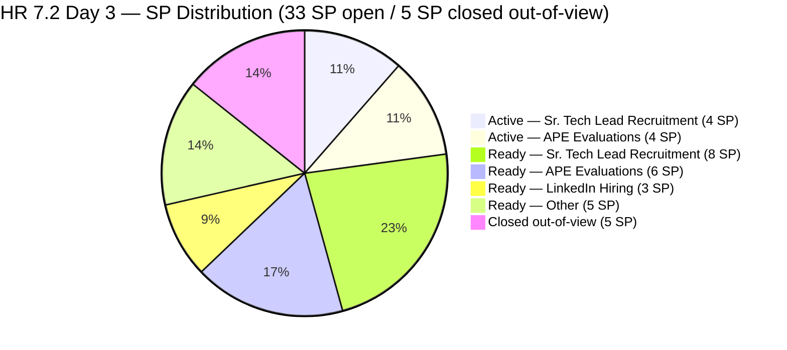
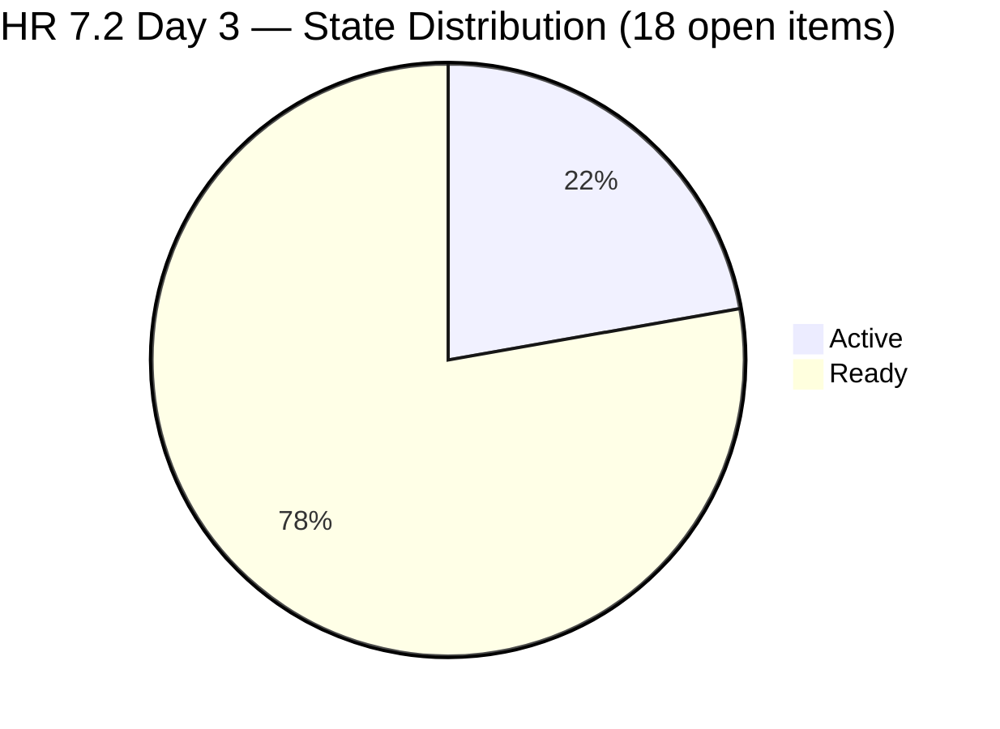
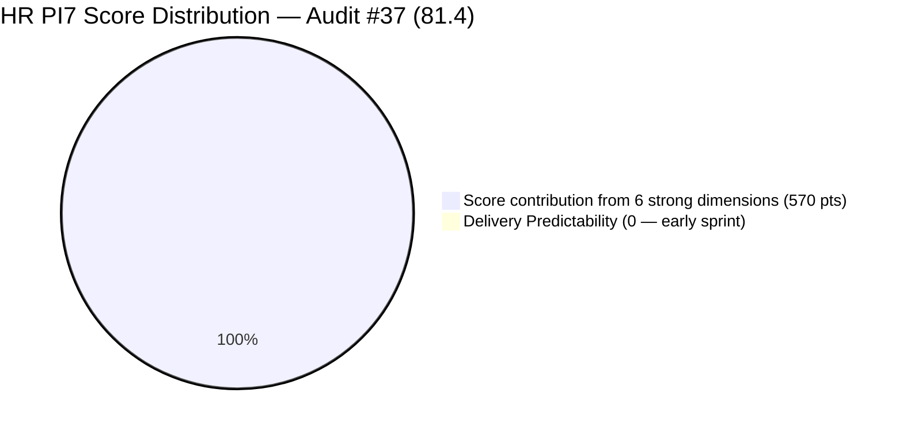
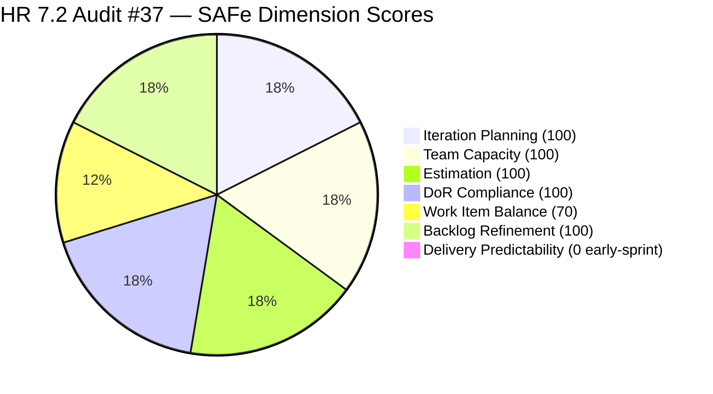
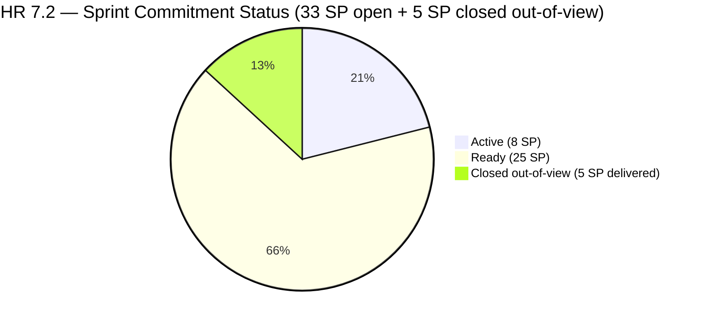

# ADO SAFe Iteration Audit — Human Resource Recruitment Team

**Audit #37 | Iteration 7.2 (Apr 20 – May 3, 2026) | Day 3 of 14 (~21% elapsed — early sprint)**

---

## 1. Audit Metadata

| Field | Value |
|---|---|
| **Audit Date** | April 22, 2026, 14:00 PHT |
| **Auditor** | Claude Code (ADO SAFe Audit Agent) |
| **Workspace** | `ado_hr` |
| **ADO Project** | Jairosoft FINOPS (`e0bb302f-40f9-46c3-8164-6f1acb317d63`) |
| **Team** | HR Recruitment Team (`248f59a6-372c-4b74-8129-9eaf260f211e`) |
| **Iteration** | Iteration 7.2 — Apr 20 to May 3, 2026 |
| **Iteration ID** | `a9888bc5-48df-40dd-bcc8-6926a11aa7c7` |
| **Sprint Day** | Day 3 of 14 (~21% elapsed — early-sprint annotation applies to DP) |
| **Prior Audit** | AUDIT_20260423_0914.md (#36, 7.2 Day 4, Overall 83.3 — Low Risk) |
| **Scoring Model** | ADO SAFe v1 (7-dimension rubric) |
| **Overall Score** | **81.4 / 100** |
| **Risk Band** | **Low Risk** (≥ 80) |

> **Note on audit numbering:** The prior audit file AUDIT_20260423_0914.md is labeled #36. This audit is #37. File is dated Apr 22 per the authoritative today date (2026-04-22) per audit instructions.

---

## 2. Executive Summary

HR Recruitment Team holds at **81.4 (Low Risk)** on Day 3 of Iteration 7.2. The score shift from Audit #36 (83.3) is driven by a **backlog-composition change**: the three items closed on Apr 21 (#202017, #202022, #202039 — 5 SP) have dropped from the `wit_list_backlog_work_items` view, reducing `visible_root_backlog_items` from 21 to 18. Because the rubric derives `current_iteration_root_items` as a subset of visible backlog items, committed SP now reflects 18 open items (33 SP) and closed_SP in the visible set = 0. Delivery Predictability moves from 13.2 to **0.0** (early-sprint annotation applies — Day 3 of 14, no formula adjustment).

All other dimensions remain unchanged. The structural excellence that characterized Audits #34–#36 — 100% DoR, 100% Estimation, 100% Iteration Planning, 100% Team Capacity, 100% Backlog Refinement — is fully intact.

**Notable development since Audit #36:** Four items moved to Active on Apr 22 (#202109, #202114, #202885, #202886). This is the broadest single-day activation wave in PI7.2. Work is progressing across APE evaluations and Sr. Tech Lead recruitment tracks simultaneously.

**Persistent concerns:**
- **#203057 body defect (Ramos):** Description still references "Reban Cliff Fajardo" — copy-paste error, unresolved entering Day 3.
- **#203063 body defect (Abina):** Description still references "Shamyll Gelbolingo" — copy-paste error, unresolved entering Day 3.
- **#200671 (LinkedIn Tech Sales Manila):** Untouched since Apr 18 — pre-sprint (4 calendar days without ADO activity).
- **Bus factor = 1:** Almera handles all 18 items; Grace remains at 0 capacity.

---

## 3. Previous Audit Delta

| Dimension | Audit #36 (Apr 23 AM, Day 4) | Audit #37 (Apr 22, Day 3) | Delta |
|---|---|---|---|
| Iteration Planning | 100.0 | **100.0** | 0.0 |
| Team Capacity | 100.0 | **100.0** | 0.0 |
| Estimation | 100.0 | **100.0** | 0.0 |
| DoR Compliance | 100.0 | **100.0** | 0.0 |
| Work Item Balance | 70.0 | **70.0** | 0.0 (structural) |
| Backlog Refinement | 100.0 | **100.0** | 0.0 |
| Delivery Predictability | 13.2 | **0.0** | **−13.2** (3 closed items dropped from backlog view) |
| **Overall** | **83.3** | **81.4** | **−1.9** |

**Key changes since Audit #36:**

- **3 closed items (#202017, #202022, #202039) dropped from `wit_list_backlog_work_items`:** These 5 SP of closed work are now excluded from the scoring denominator and numerator. Per rubric, `visible_root_backlog_items` is the live backlog API result = 18. `current_iteration_root_items` is a subset of visible = 18 (all open). Committed SP recalculated to 33 SP; closed visible SP = 0. DP = 0.0.
- **4 items moved to Active on Apr 22 (from prior audit context):** #202109 (Calvin Dalino APE), #202114 (Ryan Castillo APE), #202885 (Buenaventura Tech Lead), #202886 (Beltran Tech Lead).
- **Backlog count stabilized at 18:** No new items added or removed from the open set since Audit #36.

---

## 4. Current Iteration Snapshot

| Metric | Value |
|---|---|
| **Iteration** | 7.2 — Apr 20 to May 3, 2026 |
| **Iteration Day** | Day 3 of 14 (~21% elapsed) |
| **Visible root backlog items** | 18 |
| **Current iteration root items (7.2)** | 18 (all 18 visible items are in 7.2) |
| **Point-eligible current items** | 18 (all User Stories) |
| **Estimated items (SP > 0)** | 18 (100%) |
| **Committed Story Points** | **33 SP** (18 open items) |
| **Closed Story Points (visible)** | **0 SP** (3 closed items dropped from backlog view) |
| **Closed items (out-of-view)** | 3: #202017 (2 SP), #202022 (2 SP), #202039 (1 SP) = **5 SP delivered** |
| **Active items** | 4: #202109, #202114, #202885, #202886 (8 SP in flight) |
| **Ready items** | 14 (25 SP) |
| **Contributors with current work** | 1 (Almera Kleer Tayao) |
| **Configured capacity** | Almera: 5h/day (Documentation 3h + Requirements 2h); Days off: May 1 |
| **Working days remaining** | 10 (Apr 23–30 + May 2–3, excl. May 1) |
| **Required burn rate (33 SP remaining)** | 3.3 SP/day |
| **DoR compliance** | 18/18 (100%) — body accuracy defects in #203057 and #203063 noted |
| **Untouched current items (< Apr 20)** | 1 (#200671, Apr 18 06:57 UTC) |

### Sprint Item Register — Iteration 7.2 (18 open items / 33 SP)

| ID | Title | Type | State | SP | ChangedDate (UTC) | Notes |
|---|---|---|---|---|---|---|
| 202885 | Sr. Tech Lead — Buenaventura, Sidney | US | **Active** | 2 | Apr 22 20:12 | Active Day 3 |
| 202886 | Sr. Tech Lead — Beltran, Ken Henson | US | **Active** | 2 | Apr 22 20:11 | Active Day 3 |
| 202109 | APE — Calvin John Dalino — Summary | US | **Active** | 2 | Apr 22 20:15 | Active Day 3 |
| 202114 | APE — Ryan Vince Castillo | US | **Active** | 2 | Apr 22 20:15 | Active Day 3 |
| 202887 | Sr. Tech Lead — Barua, Marlo | US | Ready | 2 | Apr 22 20:12 | Updated Day 3 |
| 203053 | Sr. Tech Lead — Reban Cliff Fajardo | US | Ready | 2 | Apr 21 00:59 | Ready |
| 203057 | Sr. Tech Lead — Rodelio Ramos | US | Ready | 2 | Apr 21 00:59 | **Body defect: names Fajardo** |
| 202042 | Sales & Mktg. — Edgardo Rojas Jr. (Final Decision) | US | Ready | 1 | Apr 21 19:01 | Ready |
| 203063 | Sales & Mktg. — Angel Dorothy Abina | US | Ready | 2 | Apr 21 19:01 | **Body defect: names Gelbolingo** |
| 202093 | LinkedIn DevOps Engr. Hiring | US | Ready | 2 | Apr 20 20:40 | Ready |
| 200671 | LinkedIn Tech Sales from Manila Hiring | US | Ready | 1 | **Apr 18 06:57** | **Untouched pre-sprint** |
| 202888 | APE — Caumban, Karl Jordan | US | Ready | 2 | Apr 21 01:00 | Ready |
| 203067 | APE — Tayao, Almera Kleer | US | Ready | 2 | Apr 21 01:06 | Self-eval; supervisor unclear |
| 202104 | APE — Rommel Senillo — Summary PI7 | US | Ready | 2 | Apr 21 01:06 | Ready |
| 202099 | Annual Medical Check-up — Cebu Employees PI7 | US | Ready | 1 | Apr 20 20:41 | Ready |
| 202349 | Finance Reporting & Export | US | Ready | 2 | Apr 20 20:12 | Ready |
| 201273 | LinkedIn Bubble Trainer Hiring — Interview | US | Ready | 2 | Apr 21 01:14 | Ready |
| 197939 | Communication Skills Proposals Summary Presentation | US | Ready | 2 | Apr 20 20:42 | Ready |

**Active: 4 items / 8 SP | Ready: 14 items / 25 SP | Total open: 18 items / 33 SP**
**Closed (out of view): 3 items / 5 SP (#202017, #202022, #202039)**

---

## 5. Work Item Analysis

### Sprint SP Distribution



### State Distribution



### Score Trend — PI7 Audit Series (Selected Audits)



---

## 6. SAFe Compliance Scorecard

| Dimension | Score | Evidence | Notes |
|---|---|---|---|
| Iteration Planning | **100.0** | 18/18 visible root items are in Iteration 7.2 | All open backlog items committed to 7.2; 3 closed items no longer appear in visible count |
| Team Capacity | **100.0** | 1/1 contributors with current work have configured capacity (Almera 5h/day, 2 activities) | Bus factor = 1; Grace 0 capacity unchanged across all audits |
| Estimation | **100.0** | 18/18 point-eligible items have SP > 0; total 33 SP committed | Complete estimation; SP recount reflects only open items |
| DoR Compliance | **100.0** | 18/18 pass Description ≥ 30 nws + AC ≥ 20 nws | Body accuracy defects in #203057 (Fajardo body) and #203063 (Gelbolingo body) do not fail character count threshold |
| Work Item Balance | **70.0** | 18/18 User Story (100%), dominant share > 60% → −30; no Spike/Enabler/Defect | Structural HR penalty; 70.0 is ceiling for pure-User Story team |
| Backlog Refinement | **100.0** | fresh=18/18=100%; stale_90=0; stale_180=0; untouched_current=1/18=5.6% (< 10%) | #200671 Apr 18 — below 10% penalty threshold |
| Delivery Predictability | **0.0** | 0 SP closed (visible) / 33 SP committed = 0.0 — *early-sprint (Day 3 of 14, ~21% elapsed)* | 3 closed items (5 SP) dropped from backlog view; annotated as early-sprint |
| **Overall** | **81.4** | (100.0+100.0+100.0+100.0+70.0+100.0+0.0)/7 = 570.0/7 = 81.43 | **Low Risk** (≥ 80) |

### Score Computation

```
Iteration Planning      = round(18 / 18 × 100, 1)    = 100.0
Team Capacity           = round(1 / 1 × 100, 1)      = 100.0
Estimation              = round(18 / 18 × 100, 1)    = 100.0
DoR Compliance          = round(18 / 18 × 100, 1)    = 100.0

Work Item Balance:
  has_user_story        = True (18 US)               → no −40
  dominant_type_share   = 18/18 = 100% > 60%         → −30
  spike_share           = 0/18 = 0% < 40%            → 0
  total                 = 100 − 30                   = 70.0

Backlog Refinement:
  fresh_visible (≥ Mar 8, 2026) = 18/18 = 100%       → base = 100.0
  stale_90 (< Jan 22, 2026)     = 0/18 = 0%          → 0
  stale_180 (< Oct 25, 2025)    = 0                  → 0
  untouched_current (< Apr 20)  = 1/18 = 5.6% < 10%  → 0
  total                                              = 100.0

Delivery Predictability:
  visible_closed_SP     = 0 SP (3 closed items dropped from backlog view)
  committed_SP          = 33 SP (18 open items)
  score                 = round(0 / 33 × 100, 1)    = 0.0
  [Day 3 of 14 — early-sprint annotated, no formula adjustment]
  [Note: 5 SP delivered out-of-view: #202017 2SP + #202022 2SP + #202039 1SP]

Overall = round((100.0 + 100.0 + 100.0 + 100.0 + 70.0 + 100.0 + 0.0) / 7, 1)
        = round(570.0 / 7, 1)
        = round(81.43, 1)
        = 81.4  → Low Risk
```



---

## 7. Dimension Findings

### 7.1 Iteration Planning — 100.0 (Low Risk)

All 18 visible root backlog items are assigned to Iteration 7.2. The three closed items (#202017, #202022, #202039) have dropped from the `wit_list_backlog_work_items` view after closure, reducing visible count from 21 to 18. With all remaining 18 items scoped to 7.2, the ratio is 18/18 = 100.0. No items exist outside 7.2 in the team's visible backlog.

### 7.2 Team Capacity — 100.0 (Low Risk, bus-factor caveat)

Almera Kleer Tayao remains the sole configured contributor:
- **Documentation:** 3h/day
- **Requirements:** 2h/day
- **Total:** 5h/day
- **Days off:** May 1 (International Labor Day)
- **Effective sprint hours remaining:** 5h × 10 working days = 50h

Ratio: 1 contributor with work / 1 with capacity = 100.0. Grace (grace@jairosoft.com) maintains 0 configured activities and 0 assignments in all 37 HR audits.

### 7.3 Estimation — 100.0 (Low Risk)

All 18 open items carry SP > 0. SP breakdown:
- 1 SP: #200671, #202042, #202099 = 3 SP
- 2 SP: remaining 15 items = 30 SP
- **Total committed (visible): 33 SP**

(Note: Prior committed count of 38 SP included the 3 now-closed items. The net open commitment is 33 SP.)

### 7.4 DoR Compliance — 100.0 (Low Risk, with quality flags)

All 18 items pass Description ≥ 30 nws and AC ≥ 20 nws thresholds. All use the standard HR story template with structured AC including Metric clauses.

**Unresolved quality flags (Day 3):**
- **#203057 (Sr. Tech Lead — Rodelio Ramos):** Description body states "process and complete the recruitment steps for **Reban Cliff Fajardo**" — wrong candidate. Title is correct. DoR character count passes; content accuracy is a quality defect not captured by rubric.
- **#203063 (Sales & Mktg. — Angel Dorothy Abina):** Description body references "**Shamyll Gelbolingo**" — wrong candidate. Title correct.

Both items remain in Ready state and have not been corrected across 3+ consecutive audits.

### 7.5 Work Item Balance — 70.0 (Moderate, structural)

18 User Stories / 0 other types. Dominant share = 100% > 60% → −30. No Spikes or Defects present. Score = max(0, 100 − 30) = 70.0. This is the structural ceiling for a pure-User Story HR team under the rubric.

### 7.6 Backlog Refinement — 100.0 (Low Risk)

| Check | Value | Threshold | Penalty |
|---|---|---|---|
| fresh_visible_root (≥ Mar 8, 2026) | 18/18 = 100% | — | Base = 100.0 |
| stale_90 (< Jan 22, 2026) | 0/18 = 0% | >25% = −20, >10% = −10 | 0 |
| stale_180 (< Oct 25, 2025) | 0 | ≥1 = −20 | 0 |
| untouched_current (< Apr 20, 2026) | 1/18 = 5.6% | >30% = −20, >10% = −10 | 0 |
| **Total** | | | **100.0** |

**#200671 watch:** LinkedIn Tech Sales from Manila Hiring last changed Apr 18 — 4 calendar days ago, pre-sprint start. The 5.6% untouched ratio remains below the 10% penalty threshold, but the item has now been inactive for 4+ days without an ADO update. Either active sourcing is occurring off-platform, or the posting is stalled.

### 7.7 Delivery Predictability — 0.0 (early-sprint, Day 3)

Per the scoring rubric, `visible_root_backlog_items` is derived from the live `wit_list_backlog_work_items` response = 18 items. The 3 items closed on Apr 21 (#202017, #202022, #202039) have dropped from this view. Consequently:
- `closed_story_points` (on visible estimated items in Closed/Done state) = 0
- `committed_story_points` = 33 SP
- DP = round(0 / 33 × 100, 1) = 0.0

**Annotation:** Day 3 of 14 (21% elapsed) — early-sprint window (Days 1–5). Low delivery is expected and normal. No formula adjustment applied.

**Out-of-view delivery signal:** 3 items / 5 SP closed on Apr 21 (#202017 2SP, #202022 2SP, #202039 1SP). If retained in scoring, DP would be round(5 / 38 × 100, 1) = 13.2 — consistent with Audit #36.

**Pace assessment (33 SP remaining / 10 working days):** Required 3.3 SP/day to close all 33 SP. PI7.1 empirical rate was ~1.57 SP/day. The sprint is structurally overbooked at approximately 2× empirical velocity.

---

## 8. Risks and Bottlenecks

| # | Risk | Severity | Trend |
|---|---|---|---|
| R1 | **Sprint over-committed at 33 SP vs ~16 SP PI7.1 remaining velocity.** Required burn = 3.3 SP/day vs 1.57 SP/day empirical. No de-scope action taken entering Day 3. | **HIGH** | Escalating — 3rd consecutive audit with no action |
| R2 | **Bus factor = 1** — all 18 items / 33 SP assigned solely to Almera Tayao | **HIGH** | Structural — persistent across 37 audits |
| R3 | **#203057 (Ramos) body names Fajardo** — copy-paste defect unresolved entering Day 3 | **MEDIUM** | Escalating — 3 consecutive audit flags |
| R4 | **#203063 (Abina) body names Gelbolingo** — copy-paste defect unresolved entering Day 3 | **MEDIUM** | Escalating — 3 consecutive audit flags |
| R5 | **#200671 untouched since Apr 18 (4 calendar days, pre-sprint)** — no ADO activity visible | **MEDIUM** | Escalating |
| R6 | **4 Active items in parallel** — WIP concentration for sole contributor | **MEDIUM** | Active since Apr 22 |
| R7 | **#203067 (APE Tayao) self-evaluation — no supervisor named** | **LOW** | Persistent |
| R8 | **Grace has 0 configured capacity** — no capacity absorb backup | **MEDIUM** | Structural — persistent |
| R9 | **No iteration goal documented for 7.2** | **LOW** | Persistent across all 37 HR audits |

---

## 9. Prioritized Recommendations

1. **[P0 — Today] De-scope 7.2 to ≤ 20 SP.** With 33 SP remaining across 10 working days, the sprint is running at ~2× empirical velocity. Recommended de-scope candidates for 7.3 IP:
   - #203057 Ramos (also body defect — 2 SP)
   - #203053 Fajardo (2 SP)
   - #203067 Tayao APE self-eval (supervisor unclear — 2 SP)
   - #197939 Communication Skills Proposals (2 SP — lower urgency)
   Removing these 4 items (8 SP) brings remaining to 25 SP — still above velocity target but reduces risk.

2. **[P0 — Today] Fix body defects in #203057 and #203063.** Both remain in Ready state (not yet activated). This is the last window before activation:
   - #203057: Replace "Reban Cliff Fajardo" with "Rodelio Ramos" in description body.
   - #203063: Replace "Shamyll Gelbolingo" with "Angel Dorothy Abina" in description body.

3. **[P0 — Today] Resolve #200671 LinkedIn Tech Sales Manila stale status.** Provide an ADO update: state transition, comment on sourcing status, or de-scope to 7.3 if no candidates received.

4. **[P1 — Today] Limit Active WIP to 2 items.** Four items are now Active simultaneously (#202109, #202114, #202885, #202886). For a single contributor, recommend completing one APE and one Sr. Tech Lead item before starting new work.

5. **[P1 — Today] Define a 7.2 iteration goal.** Suggested: "By May 3, close ≥ 7 Sr. Tech Lead and Sales & Mktg. candidate decisions and complete ≥ 3 APE evaluations, completing PI7 recruitment and performance review cycles before PI7 end." Add to the iteration description in ADO.

6. **[P2 — Day 4] Clarify supervisor for #203067 (APE Tayao self-evaluation).** Name the reviewing supervisor in the Description field before activating.

7. **[P3 — PI retrospective] Calibrate 7.3 commitment to 20–22 SP.** Three consecutive PI7 sprints have over-committed by 50–70%. Use PI7.1 delivered velocity (22 SP) as 7.3 default ceiling.

---

## 10. Evidence Gaps and Limitations

| Gap | Description |
|---|---|
| **3 closed items out-of-view** | #202017, #202022, #202039 closed Apr 21 are no longer returned by `wit_list_backlog_work_items`. Per rubric, they are excluded from scoring denominators and numerators. Captured as out-of-view delivery: 5 SP. |
| **Delivery Predictability suppression** | DP = 0.0 because closed items dropped from visible set. If items were retained, DP would compute to 13.2 (5 SP / 38 SP). The 0.0 score is a backlog-view artifact, not a true delivery failure indicator — the early-sprint annotation addresses this. |
| **Copy-paste body accuracy** | #203057 and #203063 pass DoR character thresholds but contain wrong candidate names. Content accuracy is not verifiable by the rubric; flagged separately. |
| **#200671 block status unknown** | Item has not been updated since Apr 18. Whether active sourcing is ongoing outside ADO or the posting is stalled cannot be determined from ADO evidence alone. |
| **#203067 APE supervisor** | No supervisor identified in description or AC. Approval chain is unclear. |
| **Grace's role** | Grace remains on team roster with 0 capacity across all 37 consecutive HR audits. No ADO evidence of her organizational function. |
| **PI objectives linkage** | No PI objectives linked to any 7.2 items. Persistent gap across all PI7 audits. |
| **Iteration goal** | No sprint goal is documented in the ADO iteration definition for 7.2. Persistent across all 37 HR audits. |

---

## 11. Score Trend — PI7 HR Audit Series

| Audit | Date | Score | Band | Sprint | Day | Key Driver |
|---|---|---|---|---|---|---|
| #25 | Apr 6 | 71.9 | Moderate | 7.1 | 1 | Sprint open baseline |
| #29 | Apr 12 | 77.6 | Moderate | 7.1 | 7 | Mid-sprint progress |
| #33 | Apr 19 | 87.0 | **Low** | 7.1 close | 14 | Sprint close peak |
| #34 | Apr 21 | 81.4 | **Low** | 7.2 | 2 | Sprint open, 3 closures |
| #35 | Apr 22 | 83.4 | **Low** | 7.2 | 3 | 4 activations, stable |
| #36 | Apr 23 AM | 83.3 | **Low** | 7.2 | 4 | SP recount delta |
| **#37** | **Apr 22** | **81.4** | **Low** | **7.2** | **3** | **Closed items dropped; DP resets to 0** |



---

*Report generated by Claude Code ADO SAFe Audit Agent | April 22, 2026 14:00 PHT*
*Audit #37 — HR Recruitment Team — Iteration 7.2 Day 3 — Overall: 81.4 / 100 — Low Risk (early-sprint)*
*Data source: Live ADO MCP pull — `work_list_team_iterations`, `work_get_team_capacity`, `wit_list_backlog_work_items`, `wit_get_work_items_for_iteration`, `wit_get_work_items_batch_by_ids`. 18 visible root backlog items; 21 iteration items (18 open + 3 closed out-of-view).*
