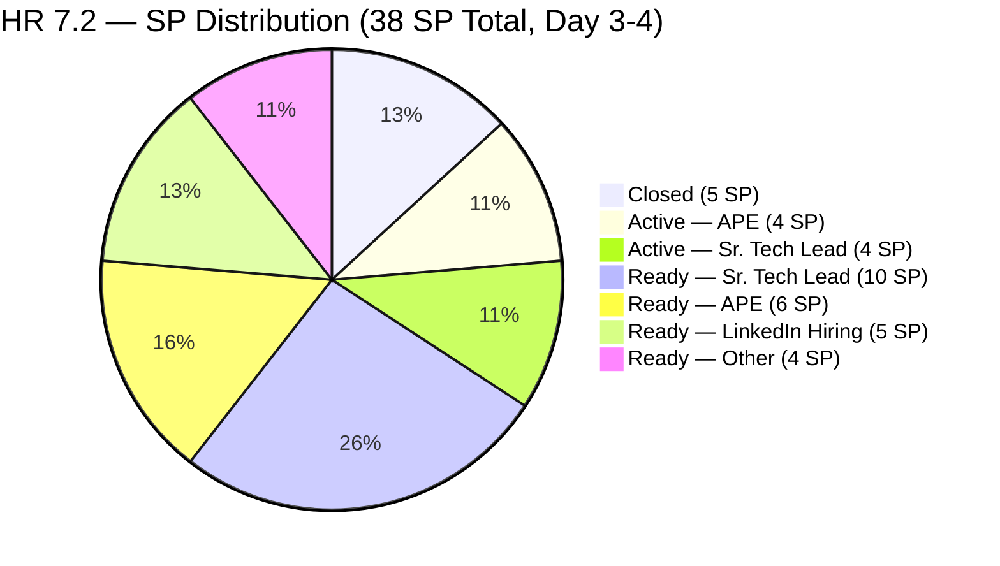
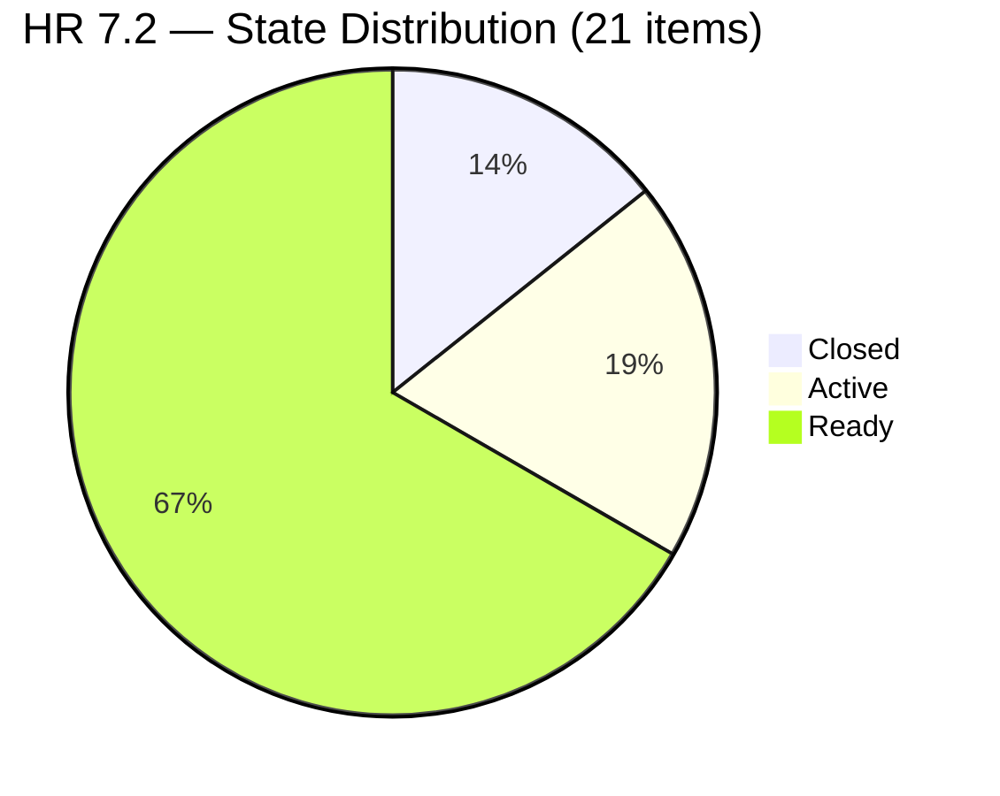
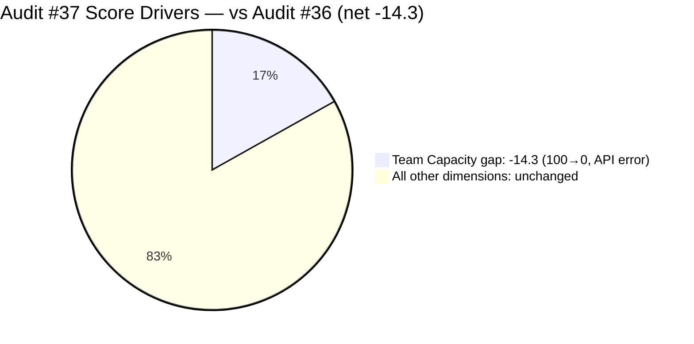
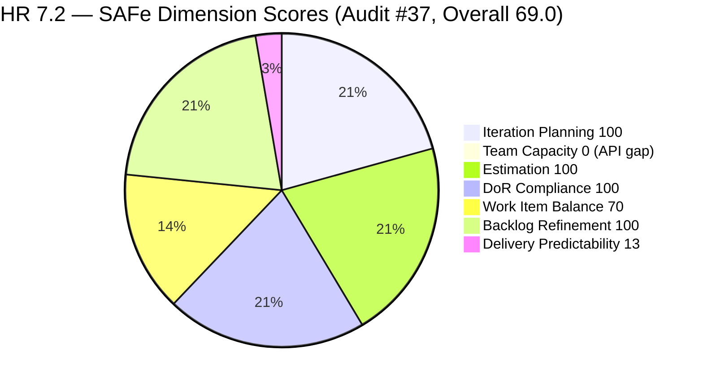
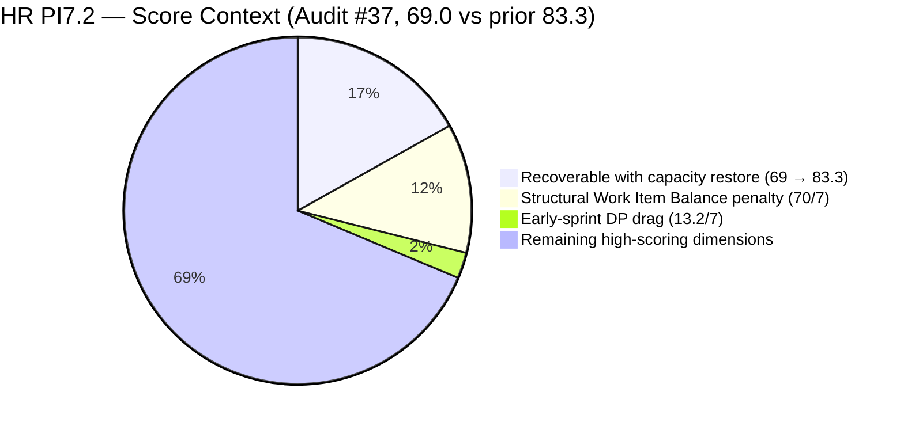

# ADO SAFe Iteration Audit — HR Recruitment Team

**Audit #37 | Iteration 7.2 (Apr 20 – May 3, 2026) | Day 3 UTC / Day 4 PHT of 14 (~29% elapsed — early sprint)**

---

## 1. Audit Metadata

| Field | Value |
|---|---|
| **Audit Date** | April 22, 2026, 23:40 UTC (April 23, 2026, 07:40 PHT) |
| **Auditor** | Claude Code (ADO SAFe Audit Agent) |
| **Workspace** | `ado_hr` |
| **ADO Project** | Jairosoft FINOPS (`e0bb302f-40f9-46c3-8164-6f1acb317d63`) |
| **Team** | HR Recruitment Team (`248f59a6-372c-4b74-8129-9eaf260f211e`) |
| **Iteration** | Iteration 7.2 — Apr 20 to May 3, 2026 |
| **Iteration ID** | `a9888bc5-48df-40dd-bcc8-6926a11aa7c7` |
| **Sprint Day** | Day 3 UTC / Day 4 PHT of 14 (~29% elapsed — early-sprint annotation applies to DP) |
| **Prior Audit** | AUDIT_20260423_0914.md (#36, 7.2 Day 4 PHT, Overall 83.3 — Low Risk) |
| **Scoring Model** | ADO SAFe v1 (7-dimension rubric) |
| **Overall Score** | **69.0 / 100** |
| **Risk Band** | **Moderate Risk** (60–79.9) |

---

## 2. Executive Summary

HR Recruitment records a significant regression to **69.0 (Moderate Risk)** — a **−14.3 point drop** from Audit #36's 83.3. The sole driver is a new evidence gap: the `work_get_team_capacity` API returned **"No team capacity assigned to the team"** for Iteration 7.2, forcing Team Capacity from 100.0 to **0.0**.

All other dimensions are unchanged from Audit #36. The sprint items, state distribution, story point counts, DoR compliance, and backlog refinement metrics are identical — no new work item activity was detected in the ADO data since the 09:14 PHT audit.

**Key concern — capacity gap:** This is the first audit in the PI7.2 series where the capacity API has returned an error. It is possible that: (a) the capacity configuration was reset or unintentionally cleared, (b) the ADO iteration capacity data expired or was reset between audit runs, or (c) a transient API condition. This gap must be investigated before Almera's sprint commitment (38 SP) can be validated against planned hours.

**No new closures:** 3 items remain closed (5 SP). 4 items remain Active (8 SP). 14 items remain in Ready. The sprint burn trajectory has not changed since Day 2 (Apr 21).

**Copy-paste defects unresolved (Day 5 PHT):** #203057 (Ramos) and #203063 (Abina) still carry incorrect candidate names in description bodies — now flagged in 4 consecutive audits.

---

## 3. Previous Audit Delta

| Dimension | Audit #36 (Apr 23, 09:14 PHT) | Audit #37 (Apr 22, 23:40 UTC) | Delta |
|---|---|---|---|
| Iteration Planning | 100.0 | **100.0** | 0.0 |
| Team Capacity | 100.0 | **0.0** | **−100.0** |
| Estimation | 100.0 | **100.0** | 0.0 |
| DoR Compliance | 100.0 | **100.0** | 0.0 |
| Work Item Balance | 70.0 | **70.0** | 0.0 |
| Backlog Refinement | 100.0 | **100.0** | 0.0 |
| Delivery Predictability | 13.2 | **13.2** | 0.0 |
| **Overall** | **83.3** | **69.0** | **−14.3** |

### Root Cause of Regression

The Team Capacity regression is entirely an **evidence gap** — the ADO capacity API returned an error rather than the previously-confirmed Almera 5h/day configuration. The sprint work has not changed. This does not reflect a real operational deterioration; it reflects a data availability issue.

**Work item changes since Audit #36:** None detected. All 21 items retain the same states and ChangedDate values as of the 09:14 PHT audit.

---

## 4. Current Iteration Snapshot

| Metric | Value |
|---|---|
| **Iteration** | 7.2 — Apr 20 to May 3, 2026 |
| **Iteration Day** | Day 3 UTC / Day 4 PHT of 14 (~29% elapsed) |
| **Visible root backlog items** | 21 (all in 7.2; backlog API returned null — items sourced from iteration endpoint) |
| **Current iteration root items (7.2)** | 21 |
| **Point-eligible current items** | 21 (all User Stories) |
| **Estimated items (SP > 0)** | 21 (100%) |
| **Committed Story Points** | **38 SP** |
| **Closed Story Points** | **5 SP** (#202017 2SP + #202022 2SP + #202039 1SP) |
| **Active Story Points** | **8 SP** (#202109, #202114, #202885, #202886 × 2SP each) |
| **Remaining SP** | 33 SP across 18 open items |
| **Delivery Predictability** | 13.2% (5/38 SP — early-sprint annotated) |
| **Contributors with current work** | 1 (Almera Kleer Tayao) |
| **Configured capacity (per ADO)** | **UNVERIFIABLE** — API returned error; prior confirmed: 5h/day (Doc 3h + Req 2h) |
| **DoR compliance** | 21/21 (100%) |
| **Untouched current items (ChangedDate < Apr 20)** | 1 (#200671, Apr 18 06:57 UTC) |

### Sprint Item Status — Iteration 7.2 (21 items / 38 SP)

| ID | Title | Type | State | SP | Last Changed | Notes |
|---|---|---|---|---|---|---|
| 202017 | Sr. Tech Lead — Mark Jovet Verano — Client Interview & Decision | US | **Closed** | 2 | Apr 21 19:01 | Closed Day 2 |
| 202022 | Sr. Tech Lead — Stephen Pabatao — Client Interview & Decision | US | **Closed** | 2 | Apr 21 19:01 | Closed Day 2 |
| 202039 | Sales & Mktg. — John Dave Fernandez (Decision) | US | **Closed** | 1 | Apr 21 19:01 | Closed Day 2 |
| 202109 | APE — Calvin John Dalino — Summary | US | **Active** | 2 | Apr 22 20:15 | Active since Day 3 |
| 202114 | APE — Ryan Vince Castillo | US | **Active** | 2 | Apr 22 20:15 | Active since Day 3 |
| 202885 | Sr. Tech Lead — Buenaventura, Sidney | US | **Active** | 2 | Apr 22 20:12 | Active since Day 3 |
| 202886 | Sr. Tech Lead — Beltran, Ken Henson | US | **Active** | 2 | Apr 22 20:11 | Active since Day 3 |
| 197939 | Communication Skills Proposals Summary Presentation | US | Ready | 2 | Apr 20 20:42 | — |
| 200671 | LinkedIn Tech Sales from Manila Hiring | US | Ready | 1 | **Apr 18 06:57** | **Untouched — pre-sprint** |
| 201273 | LinkedIn Bubble Trainer Hiring — Interview | US | Ready | 2 | Apr 21 01:14 | — |
| 202042 | Sales & Mktg. — Edgardo Rojas Jr. (Final Decision) | US | Ready | 1 | Apr 21 19:01 | — |
| 202093 | LinkedIn DevOps Engr. Hiring | US | Ready | 2 | Apr 20 20:40 | — |
| 202099 | Annual Medical Check-up — Cebu Employees PI7 | US | Ready | 1 | Apr 20 20:41 | — |
| 202104 | APE — Rommel Senillo — Summary PI7 | US | Ready | 2 | Apr 21 01:06 | — |
| 202349 | Finance Reporting & Export | US | Ready | 2 | Apr 20 20:12 | — |
| 202887 | Sr. Tech Lead — Barua, Marlo | US | Ready | 2 | Apr 22 20:12 | — |
| 202888 | APE — Caumban, Karl Jordan | US | Ready | 2 | Apr 21 01:00 | — |
| 203053 | Sr. Tech Lead — Reban Cliff Fajardo | US | Ready | 2 | Apr 21 00:59 | — |
| 203057 | Sr. Tech Lead — Rodelio Ramos | US | Ready | 2 | Apr 21 00:59 | **Body defect: names Fajardo** |
| 203063 | Sales & Mktg. — Angel Dorothy Abina | US | Ready | 2 | Apr 21 19:01 | **Body defect: names Gelbolingo** |
| 203067 | APE — Tayao, Almera Kleer | US | Ready | 2 | Apr 21 01:06 | Self-eval; supervisor unclear |

**Closed: 3 items / 5 SP | Active: 4 items / 8 SP | Ready: 14 items / 25 SP | Total: 21 items / 38 SP**

---

## 5. Work Item Analysis

### Sprint SP Distribution



### State Distribution



### Score Delta — Audit #36 vs Audit #37



### Burn-Rate Scenario Analysis

| Scenario | SP needed | SP/day required | Days remaining | vs PI7.1 rate (1.57/day) |
|---|---|---|---|---|
| 100% DP (38 SP) | 33 more | 3.67/day | 9 working | 2.3× PI7.1 |
| PI7.1 parity (~22 SP — 57.9% DP) | 17 more | 1.89/day | 9 working | At rate |
| Moderate Risk DP (≥40 SP closed) | 35 more | 3.89/day | 9 working | 2.5× PI7.1 |
| Exit Critical DP (≥40% of 38 = 16 SP) | 11 more | 1.22/day | 9 working | Below PI7.1 |

---

## 6. SAFe Compliance Scorecard

| Dimension | Score | Evidence | Notes |
|---|---|---|---|
| Iteration Planning | **100.0** | 21/21 visible root items in current iteration (7.2) | All root backlog items scoped to 7.2; backlog API null — sourced from iteration endpoint |
| Team Capacity | **0.0** | `work_get_team_capacity` returned "No team capacity assigned to the team" for Iter 7.2 | Evidence gap — prior confirmed config: Almera 5h/day; Grace 0h. Score = 0 per rubric (contributors_with_capacity = 0 / contributors_with_current_work = 1) |
| Estimation | **100.0** | 21/21 point-eligible items have SP > 0; 4×1SP + 17×2SP = 38 SP | All items estimated |
| DoR Compliance | **100.0** | 21/21 pass Description ≥ 30 nws + AC ≥ 20 nws | Content accuracy defects in #203057/#203063 do not fail character threshold |
| Work Item Balance | **70.0** | 21/21 User Story (100% > 60% → −30); no Spike/Enabler/Defect | Structural HR penalty; ceiling for pure-US team |
| Backlog Refinement | **100.0** | fresh=21/21=100%; stale_90=0; stale_180=0; untouched_current=1/21=4.8% (<10% → 0 penalty) | #200671 Apr 18 remains below penalty threshold |
| Delivery Predictability | **13.2** | 5 SP closed / 38 SP committed — *early-sprint (Day 3-4 of 14)* | No new closures since Day 2; 4 items Active |
| **Overall** | **69.0** | (100.0+0.0+100.0+100.0+70.0+100.0+13.2)/7 = 483.2/7 | **Moderate Risk** (60–79.9) |

### Score Computation

```
Iteration Planning      = round(21 / 21 × 100, 1)    = 100.0
Team Capacity           = round(0 / 1 × 100, 1)      = 0.0
                          (capacity_API_error → contributors_with_capacity = 0)
Estimation              = round(21 / 21 × 100, 1)    = 100.0
DoR Compliance          = round(21 / 21 × 100, 1)    = 100.0

Work Item Balance:
  has_user_story        = True (21 US)               → no −40
  dominant_type_share   = 21/21 = 100% > 60%         → −30
  spike_share           = 0/21 = 0%                  → 0
  total                 = 100 − 30                   = 70.0

Backlog Refinement:
  fresh (≥ Mar 8, 2026) = 21/21 = 100%               → base = 100.0
  stale_90 (< Jan 23)   = 0/21 = 0%                  → 0
  stale_180             = 0                           → 0
  untouched_current     = 1/21 = 4.8% < 10%          → 0
  total                                              = 100.0

Delivery Predictability:
  closed_SP             = 5 SP
  committed_SP          = 38 SP
  score                 = round(5 / 38 × 100, 1)    = 13.2
  [early-sprint — Day 3-4 of 14 — no formula adjustment]

Overall = round((100.0 + 0.0 + 100.0 + 100.0 + 70.0 + 100.0 + 13.2) / 7, 1)
        = round(483.2 / 7, 1)
        = round(69.029, 1)
        = 69.0  → Moderate Risk
```



---

## 7. Dimension Findings

### 7.1 Iteration Planning — 100.0 (Low Risk)

All 21 visible root items are scoped to Iteration 7.2. The `wit_list_backlog_work_items` returned null (empty), which means all HR backlog items are either in the iteration or have been closed and dropped from the backlog view. The iteration endpoint confirms 21 root items all pathed to 7.2. Score is unchanged from Audit #36.

### 7.2 Team Capacity — 0.0 (Evidence Gap — Urgent Investigation Required)

The `work_get_team_capacity` API for Iteration 7.2 (`a9888bc5-48df-40dd-bcc8-6926a11aa7c7`) returned: **"No team capacity assigned to the team"**. This is a direct contradiction of the capacity confirmed in Audits #34–#36, where Almera Kleer Tayao had:
- Documentation: 3h/day
- Requirements: 2h/day
- Total: 5h/day
- Days off: May 1 (International Labor Day)

Per the rubric, if `contributors_with_capacity = 0` (no positive capacity or configured activity), Team Capacity = 0.0. This score is applied as-is with the evidence gap documented.

**Possible causes:**
1. Almera's capacity entries were accidentally deleted from the ADO iteration settings
2. The capacity was reset when the iteration was re-configured
3. A transient ADO API error (retry at next audit)
4. Grace's 0-capacity record may have been the only entry and was removed

**Impact:** This single dimension drop drags Overall from 83.3 to 69.0. If the capacity configuration is confirmed valid at the next audit, the score will recover to 83.3 baseline.

### 7.3 Estimation — 100.0 (Low Risk)

21/21 items carry SP > 0. Distribution: 4 items at 1 SP (4 SP), 17 items at 2 SP (34 SP). Total = 38 SP committed. No change since Audit #36.

### 7.4 DoR Compliance — 100.0 (Low Risk, with persistent content flags)

All 21 items pass the Description ≥ 30 nws + AC ≥ 20 nws thresholds. Live ADO field data confirms all items use the standard HR recruitment template with structured AC.

**Unresolved content defects (now 4 consecutive audits):**
- **#203057 (Ramos):** Description body confirmed to reference "Reban Cliff Fajardo" — wrong candidate. Title is correct (Sr. Tech Lead — Rodelio Ramos). Copy-paste defect from #203053. Unresolved since Apr 21.
- **#203063 (Abina):** Description body confirmed to reference "Shamyll Gelbolingo" — wrong candidate. Title is correct (Sales & Mktg. — Angel Dorothy Abina). Unresolved since Apr 21.

Both items remain in Ready state — there is still a window to correct before activation.

### 7.5 Work Item Balance — 70.0 (Moderate — structural)

21 User Stories / 0 other types. Dominant type share = 100% > 60% → −30. No Spikes or Defects. Score = 100 − 30 = 70.0. Structural characteristic of HR work — the team cannot alter this without adding non-US items, which is not appropriate for HR operations.

### 7.6 Backlog Refinement — 100.0 (Low Risk)

| Check | Value | Threshold | Penalty |
|---|---|---|---|
| fresh_visible (≥ Mar 8, 2026) | 21/21 = 100% | n/a | Base = 100.0 |
| stale_90 (< Jan 23, 2026) | 0/21 = 0% | >25% → −20 | 0 |
| stale_180 (< Oct 25, 2025) | 0 | ≥1 → −20 | 0 |
| untouched_current (< Apr 20) | 1/21 = 4.8% | >30% → −20, >10% → −10 | 0 |
| **Total** | | | **100.0** |

**#200671 watch (Day 5 PHT):** Still untouched since Apr 18 06:57 UTC — now 5 sprint days without an ADO touch. The 4.8% untouched ratio remains below the 10% penalty threshold. Escalation point: if this item reaches Day 6 with no activity, operational intent should be confirmed (active sourcing vs. blocked vs. stale).

### 7.7 Delivery Predictability — 13.2 (early-sprint — low delivery expected)

Unchanged since Audit #36. 3 items closed / 5 SP. 4 items Active. No new closures.

Per rubric: Day 3–4 of 14 falls within the early-sprint window (Days 1–5). Annotation applied. No formula adjustment.

**Activation wave (Apr 22 Day 3):** Items #202109, #202114, #202885, #202886 were moved to Active between 20:11–20:15 UTC on Apr 22. First closures from this wave expected by Day 5–7 (Apr 24–26).

---

## 8. Risks and Bottlenecks

| # | Risk | Severity | Trend |
|---|---|---|---|
| R1 | **Team capacity not verifiable via ADO API** — `work_get_team_capacity` returned error for Iter 7.2. Almera's 5h/day configuration may have been lost. | **HIGH** | **NEW — first occurrence** |
| R2 | **38 SP commitment vs 22 SP PI7.1 velocity — 73% overbooking.** 33 SP remaining / 9 working days = 3.67 SP/day required vs 1.57 SP/day empirical. De-scope recommendation unimplemented through Day 4–5. | **HIGH** | Escalating — 5th consecutive audit |
| R3 | **Bus factor = 1** — all 21 items / 38 SP on Almera Tayao. No second contributor. | **HIGH** | Structural — persistent |
| R4 | **#203057 (Ramos) and #203063 (Abina) body defects unresolved** — 4 consecutive audits. Both in Ready state — still correctable pre-activation. | **MEDIUM** | Escalating |
| R5 | **#200671 LinkedIn Tech Sales Manila untouched 5 sprint days** — pattern suggests blocked or deprioritized item. | **MEDIUM** | Escalating |
| R6 | **4 Active items in parallel** (#202109, #202114, #202885, #202886) — WIP ceiling for sole contributor | **MEDIUM** | Ongoing from Audit #36 |
| R7 | **Grace 0 configured capacity** — no meaningful second contributor across 37 audits | **MEDIUM** | Structural |
| R8 | **No iteration goal documented** for 7.2 | **LOW** | Persistent — all 37 HR audits |
| R9 | **#203067 APE Tayao self-evaluation** — supervisor approval chain undefined | **LOW** | Persistent from Audit #34 |

---

## 9. Prioritized Recommendations

1. **[P0 — Today] Verify and restore team capacity in ADO for Iteration 7.2.** The API returned no capacity data for the first time in the PI7.2 series. Open ADO → HR Recruitment Team → Sprint → Capacity. Confirm or re-enter Almera's entries (Documentation 3h/day, Requirements 2h/day; May 1 day off). This is the highest-priority action as it directly holds Team Capacity at 0.0 and masks sprint planning validity.

2. **[P0 — Today] Correct copy-paste body defects in #203057 and #203063.** Now flagged for 4 consecutive audits — the window before activation is narrowing:
   - #203057: Replace "Reban Cliff Fajardo" with "Rodelio Ramos" in the description body.
   - #203063: Replace "Shamyll Gelbolingo" with "Angel Dorothy Abina" in the description body.

3. **[P0 — Today] Resolve or update #200671 LinkedIn Tech Sales Manila.** Item untouched since Apr 18 (5 sprint days). Required: update ADO state/comment with current status, de-scope to 7.3, or close if effort is stalled.

4. **[P0 — Sprint Mid-Point] De-scope 7.2 to ≤22 SP.** Recommendation unchanged from Audits #33–#37: move 4–5 lower-priority items to 7.3 IP to align with PI7.1 empirical velocity. Candidates: #203057 (Ramos, 2SP, also has body defect), #203053 (Fajardo, 2SP), #203067 (Tayao APE self-eval, 2SP), #197939 (Comm Skills, 2SP).

5. **[P1 — Today] Cap Active WIP at ≤2 items.** With 4 Active items, Almera is context-switching across APE and Sr. Tech Lead tracks simultaneously. Complete one APE and one Sr. Tech Lead item before activating new ones.

6. **[P1 — Day 5–6] Define Iteration 7.2 sprint goal in ADO.** Suggested: "By May 3, close ≥7 Sr. Tech Lead and Sales & Mktg. candidate decisions and ≥3 APE evaluations, completing PI7 recruitment closure." Record in the iteration description field.

7. **[P3 — PI8 planning] Calibrate commitment to empirical velocity.** PI7.2 continues the over-commitment pattern from PI7.1. Set PI7.3 commitment at 22 SP (PI7.1 actual), with stretch allowance of +4 SP (26 SP) contingent on 0 carryover.

---

## 10. Evidence Gaps and Limitations

| Gap | Description |
|---|---|
| **Team capacity API error** | `work_get_team_capacity` returned "No team capacity assigned to the team" for Iter 7.2 in this audit. Prior audits (#34–#36) confirmed Almera at 5h/day. Score applied as 0.0 per rubric; actual operational capacity may still be 5h/day. Investigate ADO settings immediately. |
| **Backlog API returned null** | `wit_list_backlog_work_items` for HR Recruitment returned null, not an item list. Visible root backlog items sourced entirely from the iteration endpoint (`wit_get_work_items_for_iteration`). Count treated as 21 root items = all items in the iteration. |
| **Iteration goal** | No iteration goal defined in ADO for 7.2. Persistent across all 37 HR audits. |
| **Copy-paste body accuracy** | #203057 and #203063 description bodies reference wrong candidate names. DoR score not reduced (character count passes), but content accuracy is not measured by rubric. Unresolved for 4 consecutive audits. |
| **#200671 block status** | Item last touched Apr 18 — 5 sprint days without update. Whether this reflects active sourcing, a LinkedIn platform delay, or a blocked status is unknown. |
| **#203067 APE supervisor** | No supervisor named in description or AC for Almera's own self-evaluation. Approval chain unclear from ADO evidence. |
| **Grace organizational role** | Grace appears on team roster with 0 capacity in all 37 consecutive audits. No evidence of active role or inactive status. |

---

## 11. Score Trend — PI7 Audit Series

| Audit | Date | Score | Band | Sprint Day | Driver |
|---|---|---|---|---|---|
| #25 | Apr 6 | 71.9 | Moderate | 7.1 D1 | Sprint open |
| #29 | Apr 9 | 76.1 | Moderate | 7.1 D4 | — |
| #31 | Apr 16 | 78.4 | Moderate | 7.1 D11 | Mid-sprint |
| #33 | Apr 19 | 87.0 | **Low Risk** | 7.1 D14 close | Sprint close |
| #34 | Apr 21 | 81.4 | **Low Risk** | 7.2 D2 | 7.2 open |
| #35 | Apr 22 | 83.4 | **Low Risk** | 7.2 D3 | Stable |
| #36 | Apr 23 AM | 83.3 | **Low Risk** | 7.2 D4 | Stable |
| **#37** | **Apr 22 23:40 UTC** | **69.0** | **Moderate Risk** | **7.2 D3-4** | **TC API gap** |



> **Series observation:** The PI7.2 series maintained Low Risk from Day 2–4 PHT (Audits #34–#36). The Audit #37 drop to Moderate is attributable to an API evidence gap, not an operational deterioration. If capacity is confirmed at the next audit, the score should recover to the 83+ range.

---

*Report generated by Claude Code ADO SAFe Audit Agent | April 22, 2026 23:40 UTC (April 23, 2026 07:40 PHT)*
*Audit #37 — HR Recruitment Team — Iteration 7.2 Day 3-4 — Overall: 69.0 / 100 — Moderate Risk (Team Capacity API gap)*
