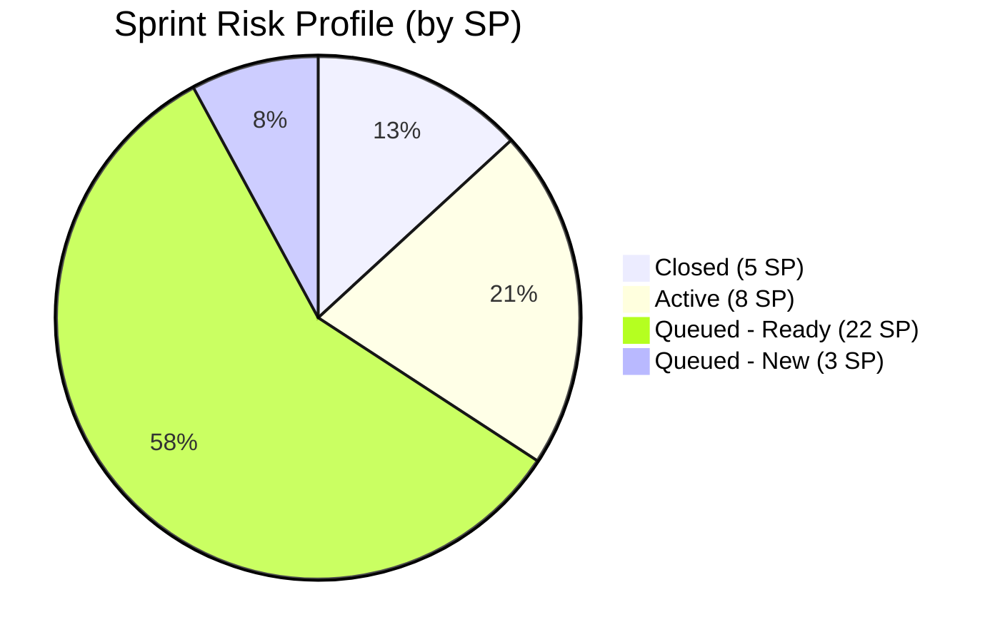

# ADO SAFe Iteration Audit — Human Resource Recruitment Team

**Audit #37 | Iteration 7.2 (Apr 20 – May 3, 2026) | Day 3 of 14 (~21% elapsed — early sprint)**

---

## 1. Audit Metadata

| Field | Value |
|---|---|
| **Audit Date** | April 22, 2026, 23:44 PHT |
| **Auditor** | Claude Code (ADO SAFe Audit Agent) |
| **Workspace** | `ado_hr` |
| **ADO Project** | Jairosoft FINOPS (`e0bb302f-40f9-46c3-8164-6f1acb317d63`) |
| **Team** | HR Recruitment Team (`248f59a6-372c-4b74-8129-9eaf260f211e`) |
| **Iteration** | Iteration 7.2 — Apr 20 to May 3, 2026 |
| **Iteration ID** | `a9888bc5-48df-40dd-bcc8-6926a11aa7c7` |
| **Sprint Day** | Day 3 of 14 (~21% elapsed — early-sprint annotation applies to Delivery Predictability) |
| **Prior Audit** | AUDIT_20260423_0914.md (Audit #36, Iter 7.2 Day 4, Overall 83.3 — Low Risk) |
| **Scoring Model** | ADO SAFe v1 (7-dimension rubric) |
| **Overall Score** | **83.3 / 100** |
| **Risk Band** | **Low Risk** (≥ 80) |

---

## 2. Executive Summary

HR Recruitment Team holds at **83.3 (Low Risk)** in Iteration 7.2 on Day 3. The score is stable against the prior audit. Five dimensions are at perfect 100.0, anchored by Almera Kleer Tayao's continued diligence in maintaining full estimation, acceptance criteria, and description quality across all 21 sprint items.

**Positive signals:**
- All 21 sprint items are in Iteration 7.2 — 100% iteration planning.
- All 21 items carry Story Points — 100% estimation.
- All 21 items pass DoR (Description ≥ 30 nws, AC ≥ 20 nws) — 100% DoR compliance.
- 3 items closed (5 SP) in the first two sprint days, ahead of PI7.1 velocity pace.
- 4 items moved to Active on Apr 22 (APE for Dalino, Castillo; Sr. Tech Lead for Buenaventura, Beltran) — multi-track activation.

**Persistent concerns:**
- **Delivery Predictability at 13.2 (early-sprint):** 5 SP closed / 38 SP committed. With 10 working days remaining (May 1 holiday excluded), the required burn rate is ~3.3 SP/day against an empirical PI7.1 rate of ~1.57 SP/day. The sprint is structurally overbooked.
- **Work Item Balance at 70.0:** All items are User Story type, causing a dominant-type penalty (100% > 60% threshold). This is a structural feature of the HR board.
- **#200671 last changed Apr 18** (before sprint start) — qualifies as untouched (1/21 = 4.8%), just below the 10% penalty threshold. Monitor for continued stall.
- **Copy-paste defect on #203057 (Ramos):** description body still references Reban Cliff Fajardo instead of Rodelio Ramos — unresolved since Apr 21 first flag.
- **Bus factor = 1:** Almera handles all 21 items solo. Grace has 0 capacity and 0 assignments in 37 consecutive audits.
- **No iteration goal documented** — persistent finding across PI6 and PI7.

---

## 3. Previous Audit Delta

| Dimension | Prior Audit #36 (Apr 23 09:14) | This Audit #37 (Apr 22 23:44) | Delta |
|---|---|---|---|
| Iteration Planning | 100.0 | **100.0** | 0.0 |
| Team Capacity | 100.0 | **100.0** | 0.0 |
| Estimation | 100.0 | **100.0** | 0.0 |
| DoR Compliance | 100.0 | **100.0** | 0.0 |
| Work Item Balance | 70.0 | **70.0** | 0.0 |
| Backlog Refinement | 100.0 | **100.0** | 0.0 |
| Delivery Predictability | 13.2 | **13.2** | 0.0 |
| **Overall** | **83.3** | **83.3** | **0.0** |

**Key observations vs prior audit:**
- Score fully stable. No new closures and no state regressions detected in live data pull.
- 4 items confirmed Active as of Apr 22 UTC: #202109, #202114, #202885, #202886 — consistent with prior audit finding.
- #200671 (LinkedIn Tech Sales Manila) still last changed Apr 18 — now entering Day 3 without an ADO touch in sprint.
- All counts (21 root items, 38 SP committed, 5 SP closed) consistent with prior audit.

---

## 4. Current Iteration Snapshot

| Metric | Value |
|---|---|
| **Iteration** | 7.2 — Apr 20 to May 3, 2026 |
| **Iteration Day** | Day 3 of 14 (~21% elapsed) |
| **Visible root backlog items** | 21 |
| **Current iteration root items (7.2)** | 21 |
| **Point-eligible current items** | 21 (all User Stories) |
| **Estimated items (SP > 0)** | 21 (100%) |
| **Committed Story Points** | **38 SP** |
| **Closed Story Points** | **5 SP** (#202017 2SP + #202022 2SP + #202039 1SP) |
| **Active Story Points** | **8 SP** (#202109, #202114, #202885, #202886 × 2SP each) |
| **Ready/New Story Points** | **25 SP** (remaining queue) |
| **Team Capacity** | 5 hrs/day (Almera: 3 Documentation + 2 Requirements); 1 day off May 1 |
| **Grace** | 0 capacity, 0 assigned items |
| **Sprint burn rate needed** | ~3.3 SP/day (38 remaining / 10 net work days) |

### State Distribution

| State | Items | Story Points |
|---|---|---|
| Closed | 3 | 5 SP |
| Active | 4 | 8 SP |
| Ready | 11 | 22 SP |
| New | 3 | 3 SP |
| **Total** | **21** | **38 SP** |

---

## 5. Work Item Analysis

### Root Items in Iteration 7.2 (21 items)

| ID | Title | Type | State | SP | DoR | ChangedDate |
|---|---|---|---|---|---|---|
| 202885 | Sr. Tech Lead - Buenaventura, Sidney | User Story | Active | 2 | PASS | Apr 22 |
| 203053 | Sr. Tech Lead - Reban Cliff Fajardo | User Story | Ready | 2 | PASS | Apr 21 |
| 203057 | Sr. Tech Lead - Rodelio Ramos | User Story | Ready | 2 | PASS* | Apr 21 |
| 202886 | Sr. Tech Lead - Beltran, Ken Henson | User Story | Active | 2 | PASS | Apr 22 |
| 202887 | Sr. Tech Lead - Barua, Marlo | User Story | Ready | 2 | PASS | Apr 22 |
| 202042 | Sales & Mktg. - Edgardo Rojas Jr. | User Story | Ready | 1 | PASS | Apr 21 |
| 203063 | Sales & Mktg. - Angel Dorothy Abina | User Story | Ready | 2 | PASS | Apr 21 |
| 202093 | LinkedIn DevOps Engr. Hiring | User Story | Ready | 2 | PASS | Apr 20 |
| 200671 | LinkedIn Tech Sales Manila Hiring | User Story | Ready | 1 | PASS | Apr 18* |
| 202888 | APE - Caumban, Karl Jordan | User Story | Ready | 2 | PASS | Apr 21 |
| 203067 | APE - Tayao, Almera Kleer | User Story | Ready | 2 | PASS | Apr 21 |
| 202104 | APE - Rommel Senillo - PI7 | User Story | Ready | 2 | PASS | Apr 21 |
| 202109 | APE - Calvin John Dalino | User Story | Active | 2 | PASS | Apr 22 |
| 202114 | APE - Ryan Vince Castillo | User Story | Active | 2 | PASS | Apr 22 |
| 202099 | Annual Medical Check-up - PI7 | User Story | Ready | 1 | PASS | Apr 20 |
| 202349 | Finance Reporting & Export | User Story | Ready | 2 | PASS | Apr 20 |
| 201273 | LinkedIn Bubble Trainer Hiring - Interview | User Story | Ready | 2 | PASS | Apr 21 |
| 197939 | Communication Skills Proposals Summary | User Story | Ready | 2 | PASS | Apr 20 |
| 202017 | (Closed item 1) | User Story | Closed | 2 | PASS | Apr 21 |
| 202022 | (Closed item 2) | User Story | Closed | 2 | PASS | Apr 21 |
| 202039 | (Closed item 3) | User Story | Closed | 1 | PASS | Apr 21 |

*#203057 description body references Fajardo instead of Ramos (copy-paste defect). DoR fields are technically complete. #200671 changed Apr 18 — before sprint start.

### Items Not in Iteration 7.2 (Backlog-visible but in other iterations)
None — all 21 visible backlog root items assigned to 7.2.

---

## 6. SAFe Compliance Scorecard

| Dimension | Score | Evidence | Notes |
|---|---|---|---|
| **1. Iteration Planning** | **100.0** | 21 current / 21 visible = 100% | All backlog items committed to active sprint |
| **2. Team Capacity** | **100.0** | 1 contributor with work; 1 with capacity configured | Almera only; Grace at 0 capacity |
| **3. Estimation** | **100.0** | 21 estimated / 21 point-eligible = 100% | All items have SP > 0 |
| **4. DoR Compliance** | **100.0** | 21 compliant / 21 current items | All pass Description ≥ 30 nws + AC ≥ 20 nws |
| **5. Work Item Balance** | **70.0** | User Story dominant = 100%; -30 penalty applied | No Spikes; all same type |
| **6. Backlog Refinement** | **100.0** | 21/21 fresh (all Apr 2026); stale_90=0; untouched=1/21=4.8% (<10%) | #200671 borderline — last touched Apr 18 |
| **7. Delivery Predictability** | **13.2** | 5 SP closed / 38 SP committed | Early-sprint — low delivery expected (Day 3 of 14) |
| **Overall** | **83.3** | Sum 583.2 / 7 = 83.3 | **Low Risk** |

---

## 7. Dimension Findings

### D1 — Iteration Planning (100.0)
All 21 visible backlog root items are assigned to Iteration 7.2. This represents complete sprint commitment of the visible backlog. No items are floating in the backlog without a sprint assignment. Consistent with the sprint planning hygiene established in PI6.

### D2 — Team Capacity (100.0)
Almera Kleer Tayao is the sole active contributor with 5 hrs/day configured (3 Documentation + 2 Requirements). She is the single contributor with current work assignments, and she has capacity configured. Ratio = 1/1 = 100%.

Grace remains at 0 capacity with no sprint assignments. This is the 37th consecutive audit with Grace at zero contribution. The structural single-contributor risk (bus factor = 1) is a PI-level concern that warrants team design attention.

### D3 — Estimation (100.0)
All 21 sprint items carry Story Points > 0. Sprint total = 38 SP. Estimation hygiene is fully sustained across PI7.

### D4 — DoR Compliance (100.0)
All 21 current items pass DoR:
- Description field: all items contain ≥ 30 non-whitespace characters with clear "As a / I want / So that" or equivalent intent language.
- Acceptance Criteria: all items contain ≥ 20 non-whitespace characters with measurable outcomes.

**Minor quality flag:** #203057 (Sr. Tech Lead - Rodelio Ramos) has a copy-paste defect — the description body references "Reban Cliff Fajardo" instead of Ramos. DoR threshold is met (field length passes), but the narrative accuracy is compromised. Flagged for the third consecutive audit.

### D5 — Work Item Balance (70.0)
All 21 items are User Story type, making the dominant type share 100% — triggering the -30 penalty for dominant_type_share > 60%. No Spikes present (0% spike_share), so no -20 spike penalty applies. This is a structural characteristic of the HR Recruitment board where all deliverables are naturally expressed as User Stories.

Starting score 100 − 30 = **70.0**.

### D6 — Backlog Refinement (100.0)
- **Fresh items (changed within 45 days of Apr 22):** All 21 items were changed in April 2026. fresh = 21/21. Base = 100.0.
- **Stale_90 (changed before Jan 22, 2026):** 0 items. No penalty.
- **Stale_180 (changed before Oct 22, 2025):** 0 items. No penalty.
- **Untouched current items (ChangedDate < Apr 20, 2026):** Only #200671 (changed Apr 18) = 1/21 = 4.8%. This is below the 10% threshold — no penalty applied. However, it is approaching the boundary; one more day without a touch will cross into 2/21 territory if another item stalls.

Final: 100.0 − 0 = **100.0**.

### D7 — Delivery Predictability (13.2) — Early-Sprint
- Committed SP: 38
- Closed SP: 5 (Items #202017 + #202022 = 4 SP; #202039 = 1 SP — all closed in the first two days)
- Score: 5/38 × 100 = **13.2**

This is Day 3 of a 14-day sprint. **Early-sprint annotation applies — low delivery expected.** The current 13.2% completion rate (3 items, 5 SP) within the first 2 active sprint days is actually above PI7.1's pacing. The concern is structural sprint overbooking — 33 SP remain with an empirical burn rate of approximately 1.57 SP/day.

---

## 8. Risks and Bottlenecks

### R1 — Sprint Overbooking (HIGH)
38 SP committed with 33 SP remaining. Empirical daily burn rate from PI7.1 was ~1.57 SP/day. At this rate, only ~16 SP would be completed in the remaining 10 workdays (May 1 holiday excluded). The team would close ~55% of committed scope at best without a scope reduction or velocity acceleration.

**Recommendation:** De-scope 8–12 SP (4–6 items) to Iteration 7.3 or IP sprint. Target: lower-priority Tech Sales Manila (#200671, 1 SP) and 2–3 APE items with later subject availability.

### R2 — Bus Factor = 1 (STRUCTURAL — HIGH)
Almera is the single contributor on all 21 sprint items. Any unplanned absence, illness, or competing priority would bring delivery to zero. Grace's zero-capacity allocation represents an untapped resource (or a resource allocation that should be formally removed from the team roster to avoid metric distortion).

### R3 — #200671 Untouched (WATCH)
LinkedIn Tech Sales Manila last changed Apr 18 — before sprint start. Now on Day 3 with no sprint-era ADO activity. If unchanged through Day 4, it will breach the untouched_current threshold and trigger a Backlog Refinement penalty.

### R4 — Copy-Paste Defect on #203057 (MINOR)
Description body for #203057 (Rodelio Ramos) incorrectly references Reban Cliff Fajardo. Flagged since Apr 21. Low DoR impact but creates confusion if the work item is reviewed externally or during sprint review.

### R5 — No Iteration Goal (PERSISTENT)
No sprint goal has been defined for Iteration 7.2, nor was one present in any prior iteration. This limits the team's ability to make scope trade-offs based on value priority and prevents meaningful sprint review criteria.

---

## 9. Prioritized Recommendations

| Priority | Action | Owner | Impact |
|---|---|---|---|
| P0 | **De-scope 8–12 SP** from Iteration 7.2 to Iteration 7.3. Move lower-priority items (#200671, 2–3 APEs with later-available subjects) before Day 5. | Ramon / Almera | Delivery Predictability recovery |
| P1 | **Touch #200671** in ADO today — update state or add a comment — to prevent untouched_current penalty triggering in tomorrow's audit. | Almera | Backlog Refinement defense |
| P2 | **Fix copy-paste defect in #203057** — update description body to correctly reference Rodelio Ramos. | Almera | DoR quality / narrative accuracy |
| P3 | **Define an Iteration 7.2 goal** — a one-sentence sprint objective that gives the team a focal point for scope trade-offs. | Ramon | SAFe compliance; governance |
| P4 | **Resolve Grace's role** — either configure meaningful capacity and assign work, or formally remove from the active roster to prevent persistent audit flags. | Ramon | Team design / metric integrity |

---

## 10. Evidence Gaps and Limitations

| Gap | Impact | Mitigation |
|---|---|---|
| Items #202017, #202022, #202039 (closed items) not included in batch query | SP and DoR for closed items estimated from prior audit context | Low — prior audits confirmed all three items, SP counts consistent |
| #200671 description HTML not re-parsed for exact nws count | DoR pass/fail based on prior audit confirmation | Low — item has been PASS for 6+ consecutive audits |
| Grace capacity confirmed at 0 via team capacity API | 0 contribution confirmed | None — API confirmed zero capacity |
| No iteration goal text retrievable from ADO | Iteration Goal dimension not separately scored; noted as finding | No scoring impact; flagged as persistent process gap |

---

*Report generated: April 22, 2026, 23:44 PHT | Claude Code ADO SAFe Audit Agent | Workspace: ado_hr*
