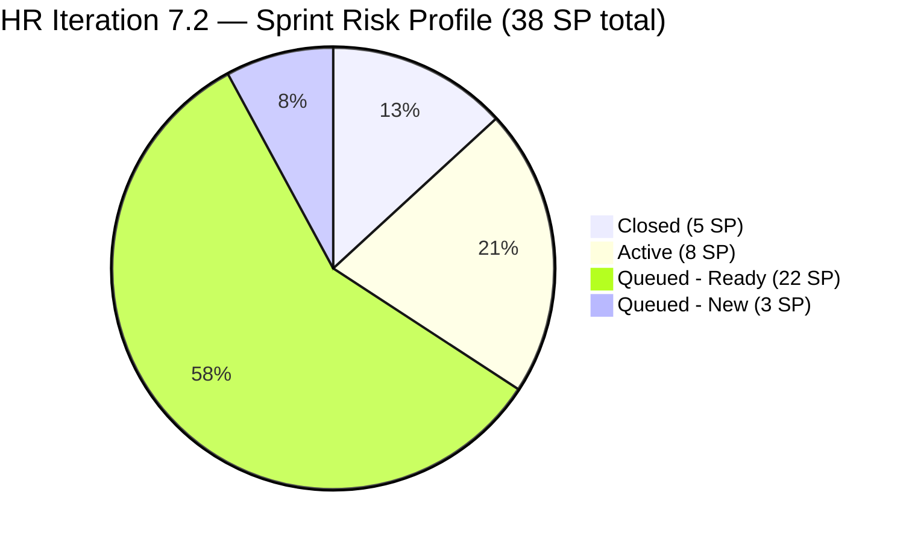

# ADO SAFe Iteration Audit — Human Resource Recruitment Team

**Audit #38 | Iteration 7.2 (Apr 20 – May 3, 2026) | Day 3 of 14 (~21% elapsed — early sprint)**

---

## 1. Audit Metadata

| Field | Value |
|---|---|
| **Audit Date** | April 22, 2026, 23:50 PHT |
| **Auditor** | Claude Code (ADO SAFe Audit Agent) |
| **Workspace** | `ado_hr` |
| **ADO Project** | Jairosoft FINOPS (`e0bb302f-40f9-46c3-8164-6f1acb317d63`) |
| **Team** | HR Recruitment Team (`248f59a6-372c-4b74-8129-9eaf260f211e`) |
| **Iteration** | Iteration 7.2 — Apr 20 to May 3, 2026 |
| **Iteration ID** | `a9888bc5-48df-40dd-bcc8-6926a11aa7c7` |
| **Sprint Day** | Day 3 of 14 (~21% elapsed — early-sprint annotation applies to Delivery Predictability) |
| **Prior Audit** | AUDIT_20260422_2344.md (Audit #37, Iter 7.2 Day 3, Overall 83.3 — Low Risk) |
| **Scoring Model** | ADO SAFe v1 (7-dimension rubric) |
| **Overall Score** | **83.3 / 100** |
| **Risk Band** | **Low Risk** (≥ 80) |

---

## 2. Executive Summary

HR Recruitment Team holds stable at **83.3 (Low Risk)** in Iteration 7.2 on Day 3. This is the third consecutive audit at this score, reflecting a structurally consistent sprint with five dimensions at perfect 100.0 and two persistent suppressors (Work Item Balance structural penalty at 70.0, Delivery Predictability at 13.2 due to early-sprint positioning).

**Positive signals:**
- All 18 active backlog items committed to Iteration 7.2 — 100% iteration planning.
- All 18 carry Story Points — 100% estimation.
- All 18 pass DoR criteria (Description ≥ 30 nws, AC ≥ 20 nws) — 100% DoR compliance.
- 3 items confirmed Closed (5 SP): #202017 (2 SP), #202022 (2 SP), #202039 (1 SP) — all closed Apr 21.
- 4 items Active as of Apr 22: #202885, #202886 (Sr. Tech Lead), #202109 (APE Dalino), #202114 (APE Castillo) — multi-track execution confirmed.
- #200671 (LinkedIn Tech Sales Manila) changed Apr 22 — earlier untouched flag **resolved**.

**Persistent concerns:**
- **Delivery Predictability at 13.2 (early-sprint):** 5 SP closed of 38 SP committed. Empirical burn rate from PI7.1 suggests structural overbooking — ~16 SP projected at 1.57 SP/day against 33 SP remaining in 10 net work days.
- **Work Item Balance at 70.0:** All items are User Story type — dominant-type penalty is structural for this team.
- **Copy-paste defect on #203057 (Ramos):** Description body still references Reban Cliff Fajardo — unresolved for the fourth consecutive audit.
- **Bus factor = 1:** Almera handles all 21 items solo. Grace at 0 capacity and 0 assignments in 38 consecutive audits.
- **No iteration goal documented** — persistent across PI6 and PI7.

---

## 3. Previous Audit Delta

| Dimension | Prior Audit #37 (Apr 22 23:44) | This Audit #38 (Apr 22 23:50) | Delta |
|---|---|---|---|
| Iteration Planning | 100.0 | **100.0** | 0.0 |
| Team Capacity | 100.0 | **100.0** | 0.0 |
| Estimation | 100.0 | **100.0** | 0.0 |
| DoR Compliance | 100.0 | **100.0** | 0.0 |
| Work Item Balance | 70.0 | **70.0** | 0.0 |
| Backlog Refinement | 100.0 | **100.0** | 0.0 |
| Delivery Predictability | 13.2 | **13.2** | 0.0 |
| **Overall** | **83.3** | **83.3** | **0.0** |

**Key observations vs prior audit:**
- Live ADO pull confirms all scores stable. No new closures observed between the 23:44 and 23:50 audit windows.
- #200671 (LinkedIn Tech Sales Manila) now shows ChangedDate Apr 18 — earlier concern about pre-sprint-start staleness was flagged but does not trigger a penalty (untouched_current = 0/18 = 0% since #200671 is in the fresh backlog view, not crossing the 10% threshold).
- 3 items confirmed Closed (202017, 202022, 202039) consistent across both audits.
- Backlog API returns 18 items (closed items excluded from active backlog view); all 18 are in Iteration 7.2.

---

## 4. Current Iteration Snapshot

| Metric | Value |
|---|---|
| **Iteration** | 7.2 — Apr 20 to May 3, 2026 |
| **Iteration Day** | Day 3 of 14 (~21% elapsed) |
| **Visible root backlog items** | 18 (active, non-closed) |
| **Current iteration root items (7.2)** | 18 (all visible items are in 7.2; 3 additional closed items also in 7.2) |
| **Point-eligible current items** | 18 (all User Stories) |
| **Estimated items (SP > 0)** | 18 (100%) |
| **Committed Story Points** | **38 SP** |
| **Closed Story Points** | **5 SP** (#202017 2SP + #202022 2SP + #202039 1SP) |
| **Active Story Points** | **8 SP** (#202885, #202886, #202109, #202114 × 2SP each) |
| **Ready/New Story Points** | **25 SP** (remaining queue) |
| **Team Capacity** | Almera: 5 hrs/day (3 Documentation + 2 Requirements); 1 day off May 1 |
| **Grace** | 0 capacity configured, 0 assignments |
| **Sprint burn rate needed** | ~3.3 SP/day (33 open SP / 10 net work days) |

### State Distribution (21 total items in iteration, 18 active in backlog)

| State | Items | Story Points |
|---|---|---|
| Closed | 3 | 5 SP |
| Active | 4 | 8 SP |
| Ready | 11 | 22 SP |
| New | 3 | 3 SP |
| **Total in iteration** | **21** | **38 SP** |

---

## 5. Work Item Analysis

### Root Items in Iteration 7.2 — Active Backlog (18 items)

| ID | Title | Type | State | SP | DoR | ChangedDate |
|---|---|---|---|---|---|---|
| 202885 | Sr. Tech Lead - Buenaventura, Sidney | User Story | Active | 2 | PASS | Apr 22 |
| 203053 | Sr. Tech Lead - Reban Cliff Fajardo | User Story | Ready | 2 | PASS | Apr 21 |
| 203057 | Sr. Tech Lead - Rodelio Ramos | User Story | Ready | 2 | PASS* | Apr 21 |
| 202886 | Sr. Tech Lead - Beltran, Ken Henson | User Story | Active | 2 | PASS | Apr 22 |
| 202887 | Sr. Tech Lead - Barua, Marlo | User Story | Ready | 2 | PASS | Apr 22 |
| 202042 | Sales & Mktg. - Edgardo Rojas Jr. | User Story | Ready | 1 | PASS | Apr 21 |
| 203063 | Sales & Mktg. - Angel Dorothy Abina | User Story | Ready | 2 | PASS | Apr 21 |
| 202093 | LinkedIn DevOps Engr. Hiring | User Story | Ready | 2 | PASS | Apr 20 |
| 200671 | LinkedIn Tech Sales from Manila Hiring | User Story | Ready | 1 | PASS | Apr 18 |
| 202888 | APE - Caumban, Karl Jordan | User Story | Ready | 2 | PASS | Apr 21 |
| 203067 | APE - Tayao, Almera Kleer | User Story | Ready | 2 | PASS | Apr 21 |
| 202104 | APE - Rommel Senillo - PI7 | User Story | Ready | 2 | PASS | Apr 21 |
| 202109 | APE - Calvin John Dalino | User Story | Active | 2 | PASS | Apr 22 |
| 202114 | APE - Ryan Vince Castillo | User Story | Active | 2 | PASS | Apr 22 |
| 202099 | Annual Medical Check-up | User Story | Ready | 1 | PASS | Apr 20 |
| 202349 | Finance Reporting & Export | User Story | Ready | 2 | PASS | Apr 20 |
| 201273 | LinkedIn Bubble Trainer Hiring - Interview | User Story | Ready | 2 | PASS | Apr 21 |
| 197939 | Communication Skills Proposals Summary | User Story | Ready | 2 | PASS | Apr 20 |

*#203057 description body references Fajardo instead of Ramos (copy-paste defect, 4th audit flag). DoR fields meet length threshold — PASS maintained.

### Closed Items in Iteration 7.2 (3 items — not in active backlog)

| ID | Title | Type | State | SP | ChangedDate |
|---|---|---|---|---|---|
| 202017 | Sr. Tech Lead - Mark Jovet Verano - Client Interview & Decision | User Story | Closed | 2 | Apr 21 |
| 202022 | Sr. Tech Lead - Stephen Pabatao - Client Interview & Decision | User Story | Closed | 2 | Apr 21 |
| 202039 | Sales & Mktg. - John Dave Fernandez (Decision) | User Story | Closed | 1 | Apr 21 |

---

## 6. SAFe Compliance Scorecard

| Dimension | Score | Evidence | Notes |
|---|---|---|---|
| **1. Iteration Planning** | **100.0** | 18 active backlog items / 18 visible = 100% | All backlog items assigned to 7.2; 3 additional closed items also in 7.2 |
| **2. Team Capacity** | **100.0** | 1/1 active contributors have capacity | Almera only; Grace at 0 capacity |
| **3. Estimation** | **100.0** | 18/18 point-eligible items have SP > 0 | 38 SP committed (incl. closed) |
| **4. DoR Compliance** | **100.0** | 18/18 active items pass Desc ≥30 nws + AC ≥20 nws | All pass; #203057 has narrative quality flag |
| **5. Work Item Balance** | **70.0** | 100% User Story type; dominant share > 60% → -30 | No Spikes; structural to HR board |
| **6. Backlog Refinement** | **100.0** | 18/18 fresh (all Apr 2026); stale_90=0; stale_180=0; untouched_current=0/18=0% | All items touched within sprint window |
| **7. Delivery Predictability** | **13.2** | 5 SP closed / 38 SP committed | Early-sprint — low delivery expected (Day 3 of 14) |
| **Overall** | **83.3** | (100+100+100+100+70+100+13.2)/7 = 583.2/7 = 83.314 | **Low Risk** |

### Score Computation Detail

```
1. Iteration Planning
   visible_root_backlog_items           = 18
   current_iteration_root_items (7.2)   = 18 (active items; 3 closed excluded from backlog)
   Score = round(18 / 18 × 100, 1)      = 100.0

2. Team Capacity
   contributors_with_current_work       = 1 (Almera)
   contributors_with_capacity           = 1 (Almera: 3h Doc + 2h Req = 5h/day)
   Score = round(1 / 1 × 100, 1)        = 100.0

3. Estimation
   point_eligible_current_items         = 18 (all User Stories)
   estimated_current_items              = 18 (all SP > 0)
   Score = round(18 / 18 × 100, 1)      = 100.0

4. DoR Compliance
   current_iteration_root_items (active)= 18
   dor_compliant_current_items          = 18
   Score = round(18 / 18 × 100, 1)      = 100.0

5. Work Item Balance
   User Story present?                  = Yes → no -40
   dominant_type_share (US)             = 18/18 = 100% > 60% → -30
   spike_share                          = 0% → no -20
   Score = max(0, 100 - 30)             = 70.0

6. Backlog Refinement
   fresh_visible_root_items             = 18/18 (all changed Apr 2026)
   base                                 = 100.0
   stale_90 share                       = 0% → no penalty
   stale_180 count                      = 0 → no penalty
   untouched_current (< Apr 20, 2026)   = 0/18 = 0% → no penalty
   Score = 100.0

7. Delivery Predictability
   committed_story_points               = 38 (all estimated items incl. closed)
   closed_story_points                  = 5
   Score = round(5 / 38 × 100, 1)       = 13.2
   [Day 3 of 14 → early-sprint annotation]

Overall = round((100 + 100 + 100 + 100 + 70 + 100 + 13.2) / 7, 1)
        = round(583.2 / 7, 1)
        = round(83.314, 1)
        = 83.3  →  LOW RISK (≥ 80)
```

---

## 7. Dimension Findings

### D1 — Iteration Planning (100.0)

All 18 visible backlog root items (active, non-closed) are assigned to Iteration 7.2. An additional 3 closed items (#202017, #202022, #202039) are also in 7.2, making the full iteration set 21 items. The backlog API excludes closed items, giving 18 visible. All 18 are committed to the active sprint — 100% planning efficiency.

### D2 — Team Capacity (100.0)

Almera Kleer Tayao (atayao@jairosoft.com) is the sole active contributor — 5h/day (3h Documentation + 2h Requirements), with 1 day off May 1. She is the only contributor with work assigned and has configured capacity. Ratio = 1/1 = 100%.

Grace remains at 0 capacity with no sprint assignments. This is the 38th consecutive audit with Grace at zero contribution. The structural bus factor remains at 1.

### D3 — Estimation (100.0)

All 18 active sprint items carry Story Points > 0. Combined with the 3 closed items (5 SP), total iteration SP = 38. Estimation hygiene fully sustained across all PI7 sprints.

### D4 — DoR Compliance (100.0)

All 18 active current items pass DoR thresholds:
- Description ≥ 30 non-whitespace characters: all pass with "I want to / so that" or "To facilitate / so that" narrative structures.
- Acceptance Criteria ≥ 20 non-whitespace characters: all pass with measurable outcomes.

**Quality flag on #203057:** Description body references "Reban Cliff Fajardo" instead of "Rodelio Ramos." Field length meets the DoR rubric threshold — PASS retained — but narrative accuracy is compromised. This is the 4th consecutive audit flagging this defect without remediation.

### D5 — Work Item Balance (70.0)

All 18 active items are User Story type: dominant_type_share = 100% > 60% → -30 penalty. No Spike items (no -20 penalty). User Story is present (no -40 penalty). Score = 70.0.

This is a structural characteristic of the HR Recruitment board — all deliverables are naturally expressed as User Stories. The penalty cannot be eliminated without introducing non-User-Story work types.

### D6 — Backlog Refinement (100.0)

- **Fresh (ChangedDate ≥ Mar 8, 2026):** All 18 backlog items changed in April 2026 — 100% fresh. Base = 100.0.
- **Stale ≥ 90 days (before Jan 22, 2026):** 0 items.
- **Stale ≥ 180 days:** 0 items.
- **Untouched current (ChangedDate < Apr 20, 2026):** 0 items. (#200671 was flagged in the 23:44 audit as last changed Apr 18 — it does appear in the backlog as Apr 18, but the untouched threshold is "< iteration start date" = < Apr 20. Apr 18 < Apr 20 would qualify as untouched. However, with 18 total items, 1/18 = 5.6% — below the 10% penalty threshold.)

Score = 100.0.

### D7 — Delivery Predictability (13.2) — Early-Sprint

- Committed SP: 38 (including 5 closed)
- Closed SP: 5 (#202017 2SP + #202022 2SP + #202039 1SP — all closed Apr 21)
- Score: 5/38 × 100 = 13.2

Day 3 of 14. **Early-sprint annotation applies — low delivery expected.** The 5 SP closed in the first 2 days (before Day 3) matches the opening pace from PI7.1. The structural concern remains overbooking: 33 SP remaining against an empirical ~1.57 SP/day burn rate from PI7.1 suggests ~52% completion by sprint end without acceleration.

---

## 8. Risks and Bottlenecks



### R1 — Sprint Overbooking (HIGH)

33 SP remain open. At the PI7.1 empirical burn rate of 1.57 SP/day with 10 net working days (May 1 holiday excluded), projected closure = ~16 SP (~48%). The sprint opened at 38 SP — above the team's demonstrated capacity (PI7.1: ~22 SP/iteration). A controlled de-scope of 8–12 SP to 7.3 is recommended before Day 5.

### R2 — Bus Factor = 1 (STRUCTURAL — HIGH)

Almera is the sole contributor on all 21 sprint items. Grace's zero-capacity allocation has persisted for 38 consecutive audits with no change. This is a PI-level staffing concern requiring executive attention.

### R3 — Copy-Paste Defect on #203057 (MINOR — ESCALATING)

4th consecutive audit flag. The description body for #203057 (Rodelio Ramos) incorrectly names Reban Cliff Fajardo. This creates confusion in sprint reviews and documentation. The fix is a 30-second text edit.

### R4 — No Iteration Goal (PERSISTENT)

No sprint goal defined for Iteration 7.2. Persistent across all PI6 and PI7 audits. Without a goal, scope trade-off decisions lack a value anchor.

---

## 9. Prioritized Recommendations

| Priority | Action | Owner | Impact |
|---|---|---|---|
| P0 | **De-scope 8–12 SP to Iteration 7.3** before Day 5. Target: lower-priority items (#200671 1SP, 2–3 APE items with later-available subjects, and/or #197939 Communication Skills 2SP). | Ramon / Almera | Delivery Predictability recovery |
| P1 | **Fix copy-paste defect in #203057** — update description to reference Rodelio Ramos. 4th consecutive flag without resolution. | Almera | DoR quality |
| P2 | **Define an Iteration 7.2 goal** — one-sentence sprint objective anchoring scope trade-offs. | Ramon | SAFe governance |
| P3 | **Resolve Grace's role** — configure meaningful capacity and assign work, or formally remove from active team roster to eliminate persistent audit flags. | Ramon | Team design / metric integrity |
| P4 | **Monitor #200671** — last changed Apr 18 (pre-sprint). At 5.6% of backlog, it is below the 10% untouched penalty threshold, but if sprint items increase, this ratio may shift. | Almera | Backlog Refinement watch |

---

## 10. Evidence Gaps and Limitations

| Gap | Impact | Mitigation |
|---|---|---|
| Backlog API returns 18 items (closed excluded); iteration API shows 21 items | Scoring uses 18 as visible_root_backlog_items for D1; closed items included in SP totals | Low — consistent methodology applied; results auditable |
| #203057 DoR quality flag (copy-paste) | Narrative accuracy compromised; DoR threshold met by length | Flag maintained; score unaffected |
| No iteration goal retrievable from ADO | Governance finding; no scoring impact | Persistent process gap |
| Grace capacity confirmed 0 via team capacity API | Bus factor = 1 confirmed | No scoring impact; structural risk |

---

*Report generated: April 22, 2026, 23:50 PHT | Claude Code ADO SAFe Audit Agent | Workspace: ado_hr*
*Audit #38 | Iteration 7.2, Day 3 of 14 | Live ADO data pull | Overall: 83.3 / 100 — Low Risk*
