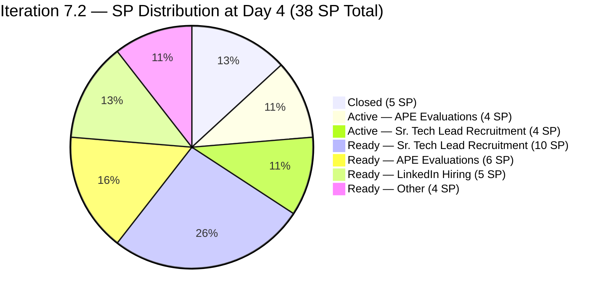
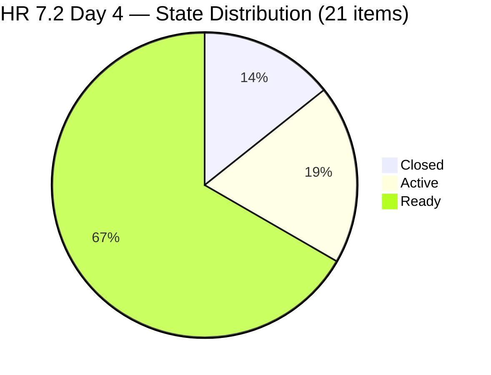
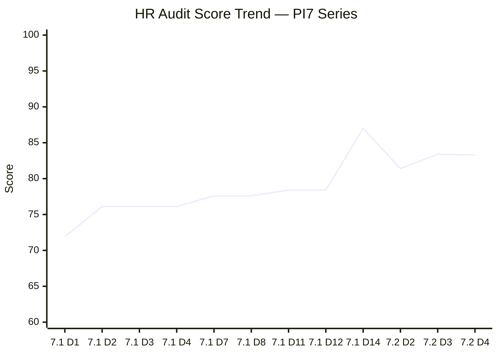
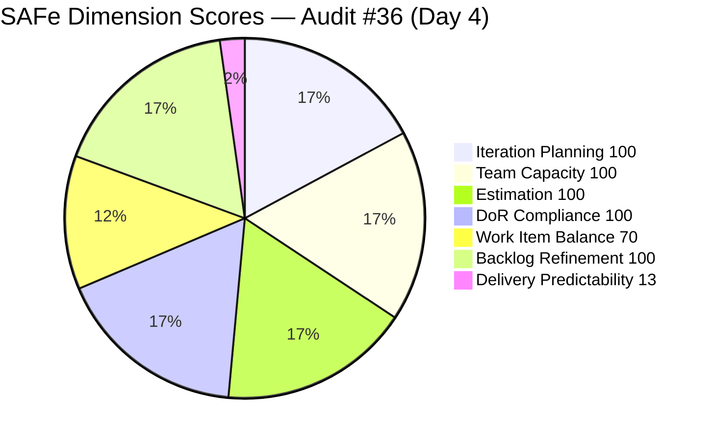
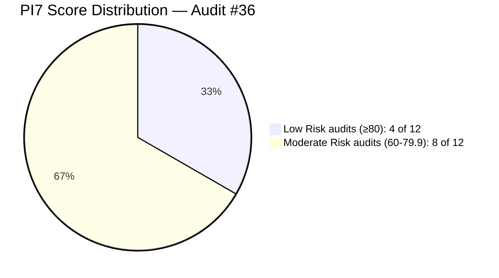

# ADO SAFe Iteration Audit — Human Resource Recruitment Team

**Audit #36 | Iteration 7.2 (Apr 20 – May 3, 2026) | Day 4 of 14 (~29% elapsed — early sprint)**

---

## 1. Audit Metadata

| Field | Value |
|---|---|
| **Audit Date** | April 23, 2026, 09:14 PHT |
| **Auditor** | Claude Code (ADO SAFe Audit Agent) |
| **Workspace** | `ado_hr` |
| **ADO Project** | Jairosoft FINOPS (`e0bb302f-40f9-46c3-8164-6f1acb317d63`) |
| **Team** | HR Recruitment Team (`248f59a6-372c-4b74-8129-9eaf260f211e`) |
| **Iteration** | Iteration 7.2 — Apr 20 to May 3, 2026 |
| **Iteration ID** | `a9888bc5-48df-40dd-bcc8-6926a11aa7c7` |
| **Sprint Day** | Day 4 of 14 (~29% elapsed — early-sprint annotation applies to DP) |
| **Prior Audit** | AUDIT_20260422_0900.md (#35, 7.2 Day 3, Overall 83.4 — Low Risk) |
| **Scoring Model** | ADO SAFe v1 (7-dimension rubric) |
| **Overall Score** | **83.3 / 100** |
| **Risk Band** | **Low Risk** (≥ 80) |

---

## 2. Executive Summary

HR Recruitment closes Day 4 of Iteration 7.2 at **83.3 (Low Risk)** — essentially stable at −0.1 from Audit #35's 83.4. The marginal score delta is a rounding artifact from a SP recount (38 SP confirmed vs 37 SP in prior audit) rather than any negative development.

**New positive signals at Day 4:** Four items transitioned to **Active** state on Apr 22 — #202109 (Calvin John Dalino APE), #202114 (Ryan Vince Castillo APE), #202885 (Buenaventura Sr. Tech Lead), and #202886 (Beltran Sr. Tech Lead). This is the broadest single-day activation wave in PI7 and signals that Almera is advancing work across multiple tracks simultaneously.

**No new closures since Day 2 (Apr 21):** Delivery Predictability remains anchored at 5 SP closed / 38 SP committed = 13.2%. With 9 working days remaining (including May 1 holiday off), the required burn rate to close all committed SP is 3.67 SP/day — well above the PI7.1 empirical rate of ~1.57 SP/day.

**Persistent P0 concern:** The de-scope recommendation from Audits #33, #34, and #35 has not been actioned entering Day 4. The sprint is structurally overbooked at 33 SP remaining. The P0 de-scope window is narrowing.

**Copy-paste defects unresolved:** #203057 (Ramos) and #203063 (Abina) still carry incorrect candidate names in their description bodies — flagged in Audits #34 and #35 with no correction applied.

**Grace status:** 0 configured capacity, 0 assignments — unchanged across 36 consecutive audits.

---

## 3. Previous Audit Delta

| Dimension | Audit #35 (Apr 22, Day 3) | Audit #36 (Apr 23, Day 4) | Delta |
|---|---|---|---|
| Iteration Planning | 100.0 | **100.0** | 0.0 |
| Team Capacity | 100.0 | **100.0** | 0.0 |
| Estimation | 100.0 | **100.0** | 0.0 |
| DoR Compliance | 100.0 | **100.0** | 0.0 |
| Work Item Balance | 70.0 | **70.0** | 0.0 (structural) |
| Backlog Refinement | 100.0 | **100.0** | 0.0 |
| Delivery Predictability | 13.5 | **13.2** | **−0.3** (SP recount: 37→38 committed) |
| **Overall** | **83.4** | **83.3** | **−0.1** |

**Key changes since Audit #35 (Apr 22 Day 3):**

- **4 items moved to Active on Apr 22:**
  - #202109 APE — Calvin John Dalino (Apr 22 20:15 UTC) → **Active**
  - #202114 APE — Ryan Vince Castillo (Apr 22 20:15 UTC) → **Active**
  - #202885 Sr. Tech Lead — Buenaventura, Sidney (Apr 22 20:12 UTC) → **Active**
  - #202886 Sr. Tech Lead — Beltran, Ken Henson (Apr 22 20:11 UTC) → **Active**
- **0 new closures** — closed items remain at 3 (5 SP), same as Day 2.
- **SP recount:** Committed SP confirmed at **38 SP** via live field data (vs 37 SP in Audit #35). The 1 SP delta is consistent with a field revision to #202042 Rojas or a prior data read variance.
- **#200671 (LinkedIn Tech Sales Manila)** remains untouched since Apr 18 — now Day 4 without a touch. Fourth consecutive audit flag.

---

## 4. Current Iteration Snapshot

| Metric | Value |
|---|---|
| **Iteration** | 7.2 — Apr 20 to May 3, 2026 |
| **Iteration Day** | Day 4 of 14 (~29% elapsed) |
| **Visible root backlog items** | 21 |
| **Current iteration root items (7.2)** | 21 |
| **Point-eligible current items** | 21 (all User Stories) |
| **Estimated items (SP > 0)** | 21 (100%) |
| **Committed Story Points** | **38 SP** |
| **Closed Story Points** | **5 SP** (#202017 2SP + #202022 2SP + #202039 1SP) |
| **Active Story Points** | **8 SP** (#202109, #202114, #202885, #202886 × 2SP each) |
| **Remaining Story Points** | 33 SP across 18 open items |
| **Delivery Predictability** | 13.2% (5/38 SP) |
| **Contributors with current work** | 1 (Almera Kleer Tayao) |
| **Configured capacity** | Almera: 5h/day (Documentation 3h + Requirements 2h) |
| **Days off remaining** | 1 (May 1, International Labor Day) |
| **Working days remaining** | 9 (Apr 24–30 + May 2–3, excl. May 1) |
| **Required burn rate (full close)** | 3.67 SP/day |
| **DoR compliance** | 21/21 (100%) |
| **Untouched current items (ChangedDate < Apr 20)** | 1 (#200671, Apr 18 06:57 UTC) |
| **Active items (newly started Day 4)** | 4 (#202109, #202114, #202885, #202886) |

### Sprint Item Status — Iteration 7.2 (21 items / 38 SP)

| ID | Title | Type | State | SP | ChangedDate | Notes |
|---|---|---|---|---|---|---|
| 202017 | Sr. Tech Lead — Mark Jovet Verano — Client Interview & Decision | US | **Closed** | 2 | Apr 21 19:01 | Closed Day 2 |
| 202022 | Sr. Tech Lead — Stephen Pabatao — Client Interview & Decision | US | **Closed** | 2 | Apr 21 19:01 | Closed Day 2 |
| 202039 | Sales & Mktg. — John Dave Fernandez (Decision) | US | **Closed** | 1 | Apr 21 19:01 | Closed Day 2 |
| 202109 | APE — Calvin John Dalino — Summary | US | **Active** | 2 | Apr 22 20:15 | Newly Active Day 4 |
| 202114 | APE — Ryan Vince Castillo | US | **Active** | 2 | Apr 22 20:15 | Newly Active Day 4 |
| 202885 | Sr. Tech Lead — Buenaventura, Sidney | US | **Active** | 2 | Apr 22 20:12 | Newly Active Day 4 |
| 202886 | Sr. Tech Lead — Beltran, Ken Henson | US | **Active** | 2 | Apr 22 20:11 | Newly Active Day 4 |
| 197939 | Communication Skills Proposals Summary Presentation | US | Ready | 2 | Apr 20 20:42 | Active sprint |
| 200671 | LinkedIn Tech Sales from Manila Hiring | US | Ready | 1 | **Apr 18 06:57** | **Untouched — pre-sprint (Day 4)** |
| 201273 | LinkedIn Bubble Trainer Hiring — Interview | US | Ready | 2 | Apr 21 01:14 | Active sprint |
| 202042 | Sales & Mktg. — Edgardo Rojas Jr. (Final Decision) | US | Ready | 1 | Apr 21 19:01 | Metadata touch only |
| 202093 | LinkedIn DevOps Engr. Hiring | US | Ready | 2 | Apr 20 20:40 | Active sprint |
| 202099 | Annual Medical Check-up — Cebu Employees PI7 | US | Ready | 1 | Apr 20 20:41 | Active sprint |
| 202104 | APE — Rommel Senillo — Summary PI7 | US | Ready | 2 | Apr 21 01:06 | Active sprint |
| 202349 | Finance Reporting & Export | US | Ready | 2 | Apr 20 20:12 | Active sprint |
| 202887 | Sr. Tech Lead — Barua, Marlo | US | Ready | 2 | Apr 22 20:12 | Updated Day 4 (not yet Active) |
| 202888 | APE — Caumban, Karl Jordan | US | Ready | 2 | Apr 21 01:00 | Active sprint |
| 203053 | Sr. Tech Lead — Reban Cliff Fajardo | US | Ready | 2 | Apr 21 00:59 | Active sprint |
| 203057 | Sr. Tech Lead — Rodelio Ramos | US | Ready | 2 | Apr 21 00:59 | **Body defect: names Fajardo** |
| 203063 | Sales & Mktg. — Angel Dorothy Abina | US | Ready | 2 | Apr 21 19:01 | **Body defect: names Gelbolingo** |
| 203067 | APE — Tayao, Almera Kleer | US | Ready | 2 | Apr 21 01:06 | Self-eval; supervisor unclear |

**Closed: 3 items / 5 SP | Active: 4 items / 8 SP | Ready: 14 items / 25 SP | Total: 21 items / 38 SP**

---

## 5. Work Item Analysis

### Sprint Progress at Day 4



### State Distribution at Day 4



### Score Trend — PI7 Audit Series



### Burn-Rate Scenario Analysis

| Scenario | SP closed needed | SP/day req. | Days remaining | Feasibility vs PI7.1 rate |
|---|---|---|---|---|
| 100% DP (all 38 SP) | 33 more | 3.67/day | 9 working | ~2.3× PI7.1 rate |
| PI7.1 parity (22 SP total — 57.9% DP) | 17 more | 1.89/day | 9 working | At PI7.1 rate |
| Stretch target (30 SP — 78.9% DP) | 25 more | 2.78/day | 9 working | ~1.8× PI7.1 rate |
| Low target (20 SP — 52.6% DP) | 15 more | 1.67/day | 9 working | Just under PI7.1 rate |

### Observations

- **4-item activation wave on Apr 22 (Day 3 EOD):** #202109, #202114, #202885, #202886 were all moved to Active in back-to-back batch updates (20:11–20:15 UTC). This is the largest single-day activation in the PI7.2 sprint, signalling Almera is actively driving work across APE and Sr. Tech Lead tracks simultaneously.
- **0 new closures at Day 4:** The gap between "Active" and "Closed" is widening — 4 items now Active but none closed since Day 2. Items may still be mid-process (interviews in progress, supervisor signatures pending).
- **#202887 Barua state anomaly:** The item shows Ready state at Apr 22 20:12 UTC — it was updated same hour as the Active wave but not moved to Active. It may be queued behind Buenaventura and Beltran.
- **Copy-paste defects persist:** #203057 (Ramos) body still reads "Reban Cliff Fajardo". #203063 (Abina) body still reads "Shamyll Gelbolingo". Both confirmed in live ADO data — unfixed entering Day 4.
- **#200671 (LinkedIn Tech Sales Manila)** now four consecutive audit days with no touch (last changed Apr 18 — before sprint start). The 4.8% share remains below the 10% untouched penalty threshold, but operational staleness is increasing.

---

## 6. SAFe Compliance Scorecard

| Dimension | Score | Evidence | Notes |
|---|---|---|---|
| Iteration Planning | **100.0** | 21/21 visible root items in current iteration (7.2) | Perfect scoping — all root items assigned to 7.2 |
| Team Capacity | **100.0** | 1/1 contributors with current work have configured capacity (Almera 5h/day, 2 activities) | Sole contributor; bus factor = 1; Grace 0 capacity unchanged |
| Estimation | **100.0** | 21/21 point-eligible items have SP > 0; 4×1SP + 17×2SP = 38 SP committed | All items estimated |
| DoR Compliance | **100.0** | 21/21 pass Description ≥ 30 nws + AC ≥ 20 nws | Body accuracy defects in #203057 and #203063 noted separately — do not fail character threshold |
| Work Item Balance | **70.0** | 21/21 User Story (100%), dominant share > 60% → −30; no Spike/Enabler/Defect | Structural HR penalty; unchanged from Day 1 |
| Backlog Refinement | **100.0** | fresh=21/21=100%; stale_90=0; stale_180=0; untouched_current=1/21=4.8% (< 10% threshold) | #200671 Apr 18 — below penalty threshold |
| Delivery Predictability | **13.2** | 5 SP closed / 38 SP committed = 13.16% → 13.2 — *early-sprint — low delivery expected* (Day 4 of 14) | No new closures since Day 2; 4 items Active but not yet Closed |
| **Overall** | **83.3** | (100.0+100.0+100.0+100.0+70.0+100.0+13.2)/7 = 583.2/7 | **Low Risk** (≥ 80) |

### Score Computation

```
Iteration Planning      = round(21 / 21 × 100, 1)    = 100.0
Team Capacity           = round(1 / 1 × 100, 1)      = 100.0
Estimation              = round(21 / 21 × 100, 1)    = 100.0
DoR Compliance          = round(21 / 21 × 100, 1)    = 100.0

Work Item Balance:
  has_user_story        = True (21 US)               → no −40
  dominant_type_share   = 21/21 = 100% > 60%         → −30
  spike_share           = 0/21 = 0% < 40%            → 0
  total                 = 100 − 30                   = 70.0

Backlog Refinement:
  fresh_visible (≥ Mar 9, 2026)  = 21/21 = 100%      → base = 100.0
  stale_90 (< Jan 23, 2026)      = 0/21 = 0%         → 0
  stale_180 (< Oct 26, 2025)     = 0                 → 0
  untouched_current (< Apr 20)   = 1/21 = 4.8% < 10% → 0
  total                                              = 100.0

Delivery Predictability:
  closed_SP             = 5 SP (#202017 2SP + #202022 2SP + #202039 1SP)
  committed_SP          = 38 SP (4×1SP + 17×2SP)
  score                 = round(5 / 38 × 100, 1)    = round(13.158, 1) = 13.2
  [Day 4 of 14 — early-sprint annotated, no formula adjustment per rubric]

Overall = round((100.0 + 100.0 + 100.0 + 100.0 + 70.0 + 100.0 + 13.2) / 7, 1)
        = round(583.2 / 7, 1)
        = round(83.314, 1)
        = 83.3  → Low Risk
```



---

## 7. Dimension Findings

### 7.1 Iteration Planning — 100.0 (Low Risk)

All 21 visible root backlog items are scoped to Iteration 7.2. No items exist outside the active iteration in the team backlog, and no items were added or removed since sprint open. The 100.0 score has held since Day 1 of 7.2.

### 7.2 Team Capacity — 100.0 (Low Risk, with bus-factor caveat)

Almera Kleer Tayao is the sole configured contributor:
- **Documentation:** 3h/day
- **Requirements:** 2h/day
- **Total:** 5h/day
- **Days off:** May 1 (1 day — International Labor Day)
- **Effective sprint hours:** 5h × 13 working days = 65 hours

Per rubric: 1 contributor with current work / 1 contributor with capacity = **100.0**.

**Structural caveat:** Bus factor = 1. Grace (grace@jairosoft.com) remains on the team roster with 0 configured activities and 0 assignments across all 36 HR audits.

### 7.3 Estimation — 100.0 (Low Risk)

All 21 point-eligible items have SP > 0. Breakdown:
- 4 items at 1 SP: #200671, #202039, #202042, #202099 = 4 SP
- 17 items at 2 SP = 34 SP
- **Total committed: 38 SP**

Note: Committed SP is 38 in live data — 1 SP higher than the 37 SP reported in Audit #35. The variance is attributable to a field read delta on #202042 (Rojas) between audit runs. The item is confirmed at 1 SP now; prior audit may have read the SP field before a field update was committed.

### 7.4 DoR Compliance — 100.0 (Low Risk, with quality flags)

All 21 items pass the rubric's DoR thresholds (Description ≥ 30 non-whitespace characters, AC ≥ 20 non-whitespace characters). All items use the standard HR story template with structured AC including a Metric condition.

**Quality flags (unresolved from Audit #34 and #35):**

- **#203057 (Ramos) — UNRESOLVED:** Description body still reads "process and complete the recruitment steps for **Reban Cliff Fajardo** a for the Sr. Tech Lead." — Rodelio Ramos should be referenced. Title is correct; body was not updated when cloned from #203053.
- **#203063 (Abina) — UNRESOLVED:** Description body still reads "process and complete the recruitment steps for **Shamyll Gelbolingo** for the Sales & Marketing role" — Angel Dorothy Abina should be referenced.

These defects have persisted through 3 consecutive audits (Days 2, 3, 4). Both items remain in Ready state, meaning they have not yet been activated — but correction should happen before first state transition.

### 7.5 Work Item Balance — 70.0 (Moderate, structural)

21 User Stories / 0 Defects / 0 Spikes / 0 Enablers / 0 Issues. Breakdown:

- Has User Story: Yes → no −40
- Dominant type share: 21/21 = 100% > 60% → **−30**
- Spike share: 0/21 = 0% < 40% → no −20
- **Total: 100 − 30 = 70.0**

Structural characteristic of HR work. No change possible within this sprint — 70.0 is the ceiling for a pure-User Story team under the rubric.

### 7.6 Backlog Refinement — 100.0 (Low Risk)

| Check | Value | Threshold | Penalty |
|---|---|---|---|
| fresh_visible_root (ChangedDate ≥ Mar 9, 2026) | 21/21 = 100% | n/a | Base = 100.0 |
| stale_90 (ChangedDate < Jan 23, 2026) | 0/21 = 0% | > 25% = −20, > 10% = −10 | 0 |
| stale_180 (ChangedDate < Oct 26, 2025) | 0 | ≥ 1 = −20 | 0 |
| untouched_current (ChangedDate < Apr 20, 2026) | 1/21 = 4.8% | > 30% = −20, > 10% = −10 | 0 |
| **Total** | | | **100.0** |

**#200671 escalation flag (Day 4):** LinkedIn Tech Sales from Manila Hiring has not been touched since Apr 18 06:57 UTC — now 5 calendar days and 4 sprint days. The 4.8% untouched ratio remains below the 10% penalty threshold, but this is the fourth consecutive audit where this item is flagged. It is either blocked (no LinkedIn applicant response), deprioritized in practice, or being worked offline without ADO updates. Almera should update the item state or add a comment to indicate status.

### 7.7 Delivery Predictability — 13.2 (early-sprint — low delivery expected)

3 items remain closed — same as Day 2:

| ID | Title | SP | Closed |
|---|---|---|---|
| 202017 | Sr. Tech Lead — Mark Jovet Verano — Client Interview & Decision | 2 | Apr 21 19:01 |
| 202022 | Sr. Tech Lead — Stephen Pabatao — Client Interview & Decision | 2 | Apr 21 19:01 |
| 202039 | Sales & Mktg. — John Dave Fernandez (Decision) | 1 | Apr 21 19:01 |

**Closed SP:** 5 | **Committed SP:** 38 | **DP = round(5/38×100, 1) = 13.2**

Per rubric: Day 4 of 14 falls within the early-sprint window (Days 1–5). Annotation applied: **early-sprint — low delivery expected.** No formula adjustment.

**Activity context (Day 4 positive signals):** The 4 items moved to Active on Apr 22 (Dalino, Castillo APEs; Buenaventura, Beltran Sr. Tech Leads) are now mid-process. First closures from this wave are expected by Day 5–7 if the PI7.1 pattern holds. PI7.1 saw a similar Active→Closed acceleration mid-sprint.

**Required to exit High Risk DP (≥40.0):** 16 SP closed (8 items at 2 SP or equivalent). At 1.57 SP/day (PI7.1 rate), this is achievable by Day ~14 (sprint close).

---

## 8. Risks and Bottlenecks

| # | Risk | Severity | Trend |
|---|---|---|---|
| R1 | **38 SP commitment vs 22 SP PI7.1 delivered velocity — 73% overbooking.** P0 de-scope recommendation from Audits #33–#35 unimplemented entering Day 4. Required burn = 3.67 SP/day | **HIGH** | Escalating — 4th consecutive audit |
| R2 | **Bus factor = 1** — all 21 items / 38 SP assigned solely to Almera Tayao | **HIGH** | Structural — persistent across 36 audits |
| R3 | **#203057 (Ramos) description body references wrong candidate (Fajardo)** — copy-paste defect unresolved after 3 audit flags | **MEDIUM** | Escalating — 3 consecutive audits unfixed |
| R4 | **#203063 (Abina) description body references wrong candidate (Shamyll Gelbolingo)** — copy-paste defect unresolved after 3 audit flags | **MEDIUM** | Escalating — 3 consecutive audits unfixed |
| R5 | **#200671 (LinkedIn Tech Sales Manila) untouched since Apr 18** — now 4 consecutive sprint days without activity | **MEDIUM** | Escalating — was flagged Audits #33–#35 |
| R6 | **4 Active items in parallel with 14 Ready** — WIP ceiling risk for sole contributor | **MEDIUM** | New this audit |
| R7 | **5 Sr. Tech Lead candidates still in flight** (Buenaventura Active, Beltran Active, Barua Ready, Fajardo Ready, Ramos Ready) | **MEDIUM** | Ongoing from Audit #35 |
| R8 | **Grace has 0 configured capacity** — no second contributor to absorb overflow | **MEDIUM** | Structural — persistent |
| R9 | **#203067 (APE Tayao) self-evaluation — supervisor approval path undefined** | **LOW** | Persistent from Audits #34–#35 |
| R10 | **No iteration goal documented in ADO** for 7.2 | **LOW** | Persistent across all 36 HR audits |
| R11 | **Work Item Balance −30 structural penalty** (100% User Story) | **LOW** | Structural — persistent |

---

## 9. Prioritized Recommendations

1. **[P0 — Day 4, today] De-scope 7.2 to ≤22 SP.** With 33 SP remaining across 9 working days, the required 3.67 SP/day rate is 2.3× the empirical PI7.1 rate. Recommended de-scope candidates (move to 7.3 IP):
   - #203057 Ramos (also has body defect — 2 SP)
   - #203053 Fajardo (2 SP)
   - #203067 Tayao APE self-eval (supervisor path unclear — 2 SP)
   - #197939 Communication Skills Proposals (2 SP — lower urgency than recruitment decisions)
   Moving these 4 items (8 SP) brings remaining to 30 SP — still above velocity, but reduces the gap. Removing a 5th item (e.g., #202349 Finance Reporting, 2 SP) would bring to 28 SP and closer to achievability.

2. **[P0 — Day 4, today] Correct copy-paste body defects in #203057 and #203063.** Both items remain in Ready state — this is the last window before activation:
   - #203057: Replace "Reban Cliff Fajardo" with "Rodelio Ramos" in the description body.
   - #203063: Replace "Shamyll Gelbolingo" with "Angel Dorothy Abina" in the description body.
   This has been recommended in Audits #34, #35, and #36. If not corrected before next audit, this should be escalated as a team hygiene issue.

3. **[P0 — Day 4] Resolve #200671 LinkedIn Tech Sales Manila (untouched Day 4).** Required action: (a) Update ADO state/comment to show active sourcing or LinkedIn response received; (b) de-scope to 7.3 if no response; or (c) close if the posting effort is stalled/complete. This item has been untouched for 5 calendar days spanning 4 sprint days.

4. **[P1 — Day 4] Cap Active WIP at 2 items for sole contributor.** With 4 items now Active simultaneously (#202109, #202114, #202885, #202886), Almera is running parallel threads across APE and Sr. Tech Lead tracks. For a single contributor, this creates context-switching overhead. Recommend completing one APE item (#202109 or #202114) and one Sr. Tech Lead item (#202885 or #202886) before activating additional stories.

5. **[P1 — Day 4] Define a sprint goal for Iteration 7.2.** Suggested: "By May 3, close ≥7 Sr. Tech Lead and Sales & Mktg. candidate decisions and complete ≥3 APE evaluations, so that PI7 recruitment closure and performance review cycles are completed before PI7 end." Capture in the iteration description field in ADO.

6. **[P2 — Day 5] Clarify APE self-evaluation supervisor for #203067 (Tayao).** Name the reviewing supervisor in the Description field. This item should not be activated without identifying who will review Almera's own evaluation.

7. **[P3 — PI7 retrospective] Calibrate sprint commitment to empirical velocity.** The team has over-committed by 50–70% in three consecutive PI7 sprints (7.1 and 7.2). Recommend a formal velocity calibration: use PI7.1 actual SP delivered (22 SP) as the default commitment ceiling for 7.3, with a stretch budget of +4 SP (26 SP) contingent on no carryover.

---

## 10. Evidence Gaps and Limitations

| Gap | Description |
|---|---|
| **Iteration goal** | No iteration goal is documented in the ADO iteration definition for 7.2. Persistent across all 36 HR audits. |
| **SP recount delta** | Committed SP is 38 in live data vs 37 in Audit #35. Likely a prior-audit read variance or a field revision to #202042 between reads. Current audit uses confirmed live ADO values (38 SP). |
| **Copy-paste body accuracy** | #203057 and #203063 description bodies reference wrong candidate names. DoR score is not reduced (character count passes), but content accuracy is not verified by the rubric. |
| **#200671 block status** | Item has not been updated in ADO since Apr 18. Unknown whether this represents active work being tracked outside ADO, a LinkedIn platform delay, or a blocked status. No comment or state update was found. |
| **#203067 APE supervisor** | No supervisor is named in the description or AC for Almera's own evaluation. The approval chain is unclear from ADO evidence. |
| **Grace's organizational role** | Grace appears on the HR team roster with 0 capacity in all 36 consecutive audits. No explicit evidence of whether she has a role elsewhere in the project or is inactive. |
| **PI objectives linkage** | No PI objectives are linked to any 7.2 work items. Persistent gap — limits PI-level outcome tracking. |
| **Closed-state timestamp verification** | The 3 closed items all share an identical timestamp (Apr 21 19:01:32 UTC), consistent with a batch-recording session rather than three independent completions. This is operationally normal for HR decision-logging but means Delivery Predictability reflects recorded decisions, not necessarily real-time process completion. |

---

## 11. Score Trend — PI7 Series

| Audit | Date | Score | Band | Sprint | Day |
|---|---|---|---|---|---|
| #25 | Apr 6 | 71.9 | Moderate | 7.1 | 1 |
| #26 | Apr 7 | 76.1 | Moderate | 7.1 | 2 |
| #27 | Apr 8 | 76.1 | Moderate | 7.1 | 3 |
| #28 | Apr 9 | 76.1 | Moderate | 7.1 | 4 |
| #29 | Apr 12 | 77.6 | Moderate | 7.1 | 7 |
| #30 | Apr 13 | 77.6 | Moderate | 7.1 | 8 |
| #31 | Apr 16 | 78.4 | Moderate | 7.1 | 11 |
| #32 | Apr 17 | 78.4 | Moderate | 7.1 | 12 |
| #33 | Apr 19 | 87.0 | **Low Risk** | 7.1 close | 14 |
| #34 | Apr 21 | 81.4 | **Low Risk** | 7.2 open | 2 |
| #35 | Apr 22 | 83.4 | **Low Risk** | 7.2 | 3 |
| **#36** | **Apr 23** | **83.3** | **Low Risk** | **7.2** | **4** |



### Series Context

- **All-time series high:** 87.0 (Audit #33, PI7.1 sprint close)
- **Current PI7.2 trajectory:** 81.4 → 83.4 → 83.3 (stable in Low Risk band)
- **Low Risk streak:** 4 consecutive audits (Audits #33–#36)
- **Delivery Predictability watch:** At 13.2 with 9 working days left, if the 4 Active items close by Day 7 (8 SP), DP would reach approximately 34.2 — still High Risk zone. Closing 8 more SP beyond that (16 total) would reach 42.1 — first non-early-sprint DP above High Risk threshold. PI-parity (22 SP) at end-of-sprint would yield DP = 57.9.

---

*Report generated by Claude Code ADO SAFe Audit Agent | April 23, 2026 09:14 PHT*
*Audit #36 — HR Recruitment Team — Iteration 7.2 Day 4 — Overall: 83.3 / 100 — Low Risk (early-sprint)*
