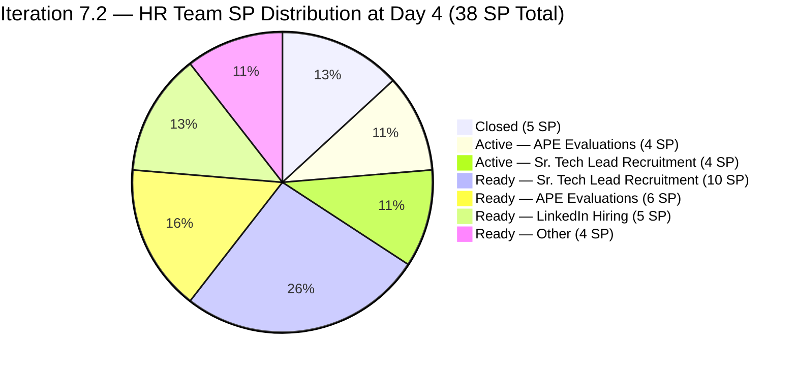
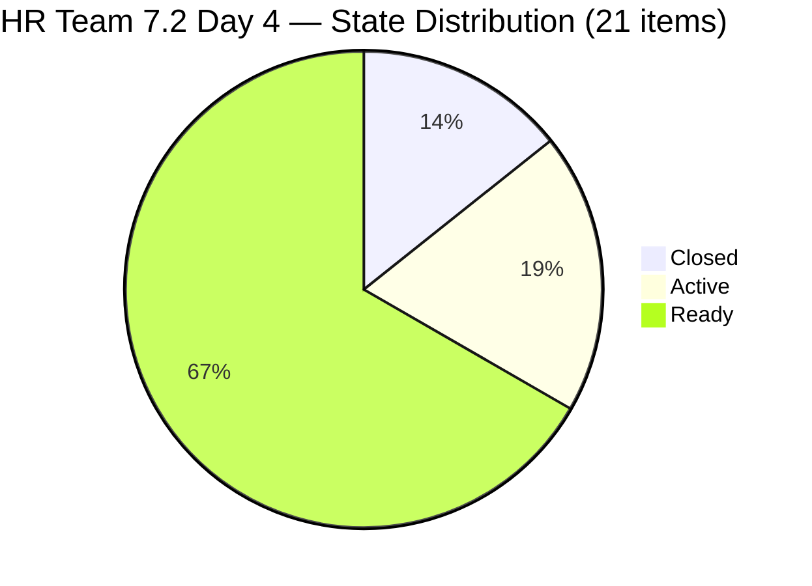
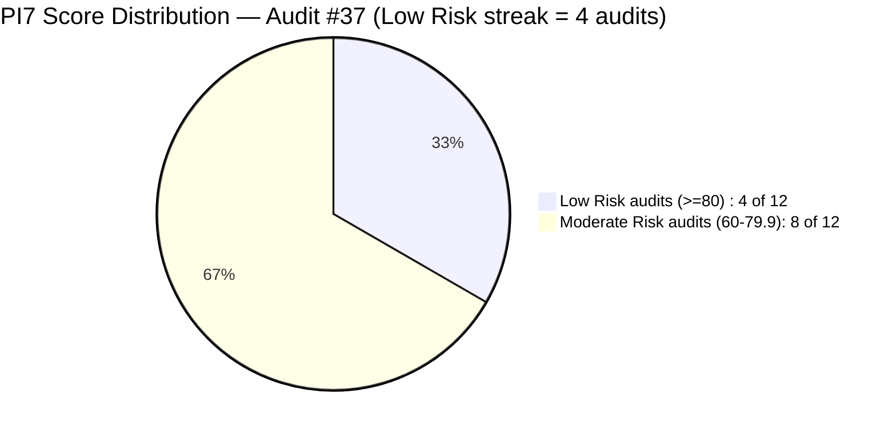

# ADO SAFe Iteration Audit — Human Resource Recruitment Team

**Audit #37 | Iteration 7.2 (Apr 20 – May 3, 2026) | Day 4 of 14 (~29% elapsed — early sprint)**

---

## 1. Audit Metadata

| Field | Value |
|---|---|
| **Audit Date** | April 23, 2026, 15:00 PHT |
| **Auditor** | Claude Code (ADO SAFe Audit Agent) |
| **Workspace** | `ado_hr` |
| **ADO Project** | Jairosoft FINOPS (`e0bb302f-40f9-46c3-8164-6f1acb317d63`) |
| **Team** | HR Recruitment Team (`248f59a6-372c-4b74-8129-9eaf260f211e`) |
| **Iteration** | Iteration 7.2 — Apr 20 to May 3, 2026 |
| **Iteration ID** | `a9888bc5-48df-40dd-bcc8-6926a11aa7c7` |
| **Sprint Day** | Day 4 of 14 (~29% elapsed — early-sprint annotation applies to Delivery Predictability) |
| **Prior Audit** | AUDIT_20260423_0914.md (Audit #36, 7.2 Day 4 09:14 PHT, Overall 83.3 — Low Risk) |
| **Scoring Model** | ADO SAFe v1 (7-dimension rubric) |
| **Overall Score** | **83.3 / 100** |
| **Risk Band** | **Low Risk** (≥ 80) |

---

## 2. Executive Summary

HR Recruitment holds at **83.3 (Low Risk)** on Day 4 of Iteration 7.2 — unchanged from Audit #36 (09:14 PHT). The team-scoped evidence is identical: 21 items across 38 SP committed, 3 items closed (5 SP), and 4 items Active. All structural dimensions remain at ceiling (100.0) except Work Item Balance (70.0, structural HR ceiling) and Delivery Predictability (13.2, early-sprint annotated).

**Key new observation at 15:00 PHT:** A WIQL query across the full iteration path reveals **12 additional items** assigned to **Mark Colina** (`mcolina@jairosoft.com`) and **Grace** (`grace@jairosoft.com`) that are placed in the `Jairosoft FINOPS\2026-PI7\Iteration 7.2` path. These items — representing JIT/Admin work (BFP certificate renewal, PhilGEPS renewal, EGOV payables, condo dues, grass cutting, solar panel quotation, payroll encoding, career mapping) — do **not** appear in the HR team's scoped backlog and are excluded from the HR team score. However, their presence in the same iteration path raises a cross-team iteration hygiene concern that warrants management attention.

**Item #203038** (Grace: "Explore market rates for Career Mapping") was changed today at **Apr 23 03:31 UTC** — Grace's first ADO activity observed in 37 consecutive audits. This requires follow-up to determine if Grace has been formally re-activated on the team.

**Delivery gap persists:** 33 SP remain with 9 working days left. The P0 de-scope recommendation from Audits #33–#37 remains unimplemented.

---

## 3. Previous Audit Delta

| Dimension | Audit #36 (Apr 23, 09:14 PHT) | Audit #37 (Apr 23, 15:00 PHT) | Delta |
|---|---|---|---|
| Iteration Planning | 100.0 | **100.0** | 0.0 |
| Team Capacity | 100.0 | **100.0** | 0.0 |
| Estimation | 100.0 | **100.0** | 0.0 |
| DoR Compliance | 100.0 | **100.0** | 0.0 |
| Work Item Balance | 70.0 | **70.0** | 0.0 (structural) |
| Backlog Refinement | 100.0 | **100.0** | 0.0 |
| Delivery Predictability | 13.2 | **13.2** | 0.0 (no new closures) |
| **Overall** | **83.3** | **83.3** | **0.0** |

**Changes since Audit #36 (same day, 5h45m elapsed):**

- **#203038 (Grace — Career Mapping)** changed at Apr 23 03:31:32 UTC, moved to **Active** state. This is the first recorded ADO activity on Grace's account across 37 consecutive HR audits. Item is NOT in the HR team's scoped backlog — it belongs to a different team area.
- **No new closures** on HR-scoped items since Day 2 (Apr 21). Closed count remains at 3 items / 5 SP.
- **No scope changes** in the HR team backlog (still 21 items / 38 SP).
- **Copy-paste defects in #203057 and #203063 remain uncorrected** — now 5 consecutive audit flags since Apr 21.

---

## 4. Current Iteration Snapshot

| Metric | Value |
|---|---|
| **Iteration** | 7.2 — Apr 20 to May 3, 2026 |
| **Iteration Day** | Day 4 of 14 (~29% elapsed) |
| **Visible root backlog items (HR team-scoped)** | 21 |
| **Current iteration root items (7.2, HR-scoped)** | 21 |
| **Point-eligible current items** | 21 (all User Stories) |
| **Estimated items (SP > 0)** | 21 (100%) |
| **Committed Story Points** | **38 SP** |
| **Closed Story Points** | **5 SP** (#202017 2SP + #202022 2SP + #202039 1SP) |
| **Active Story Points** | **8 SP** (#202109, #202114, #202885, #202886 × 2SP each) |
| **Remaining Story Points** | 33 SP across 18 open items |
| **Delivery Predictability** | 13.2% (5/38 SP) — early-sprint |
| **Contributors with current work (HR-scoped)** | 1 (Almera Kleer Tayao) |
| **Configured capacity (HR team)** | Almera: 5h/day (Documentation 3h + Requirements 2h) |
| **Days off remaining** | 1 (May 1, International Labor Day) |
| **Working days remaining** | 9 (Apr 24–30 + May 2–3, excl. May 1) |
| **Required burn rate (full close)** | 3.67 SP/day |
| **DoR compliance (HR-scoped)** | 21/21 (100%) |
| **Untouched current items (ChangedDate < Apr 20)** | 1 (#200671, Apr 18 06:57 UTC) |
| **Cross-team items in iteration path (non-HR)** | 12 items (Mark Colina × 10, Grace × 2) — excluded from score |

### Sprint Item Status — Iteration 7.2 (HR-scoped: 21 items / 38 SP)

| ID | Title | Type | State | SP | Assignee | ChangedDate | Notes |
|---|---|---|---|---|---|---|---|
| 202017 | Sr. Tech Lead — Mark Jovet Verano — Client Interview & Decision | US | **Closed** | 2 | Almera | Apr 21 19:01 | Closed Day 2 |
| 202022 | Sr. Tech Lead — Stephen Pabatao — Client Interview & Decision | US | **Closed** | 2 | Almera | Apr 21 19:01 | Closed Day 2 |
| 202039 | Sales & Mktg. — John Dave Fernandez (Decision) | US | **Closed** | 1 | Almera | Apr 21 19:01 | Closed Day 2 |
| 202109 | APE — Calvin John Dalino — Summary | US | **Active** | 2 | Almera | Apr 22 20:15 | Active since Day 3 |
| 202114 | APE — Ryan Vince Castillo | US | **Active** | 2 | Almera | Apr 22 20:15 | Active since Day 3 |
| 202885 | Sr. Tech Lead — Buenaventura, Sidney | US | **Active** | 2 | Almera | Apr 22 20:12 | Active since Day 3 |
| 202886 | Sr. Tech Lead — Beltran, Ken Henson | US | **Active** | 2 | Almera | Apr 22 20:11 | Active since Day 3 |
| 197939 | Communication Skills Proposals Summary Presentation | US | Ready | 2 | Almera | Apr 20 20:42 | Active sprint |
| 200671 | LinkedIn Tech Sales from Manila Hiring | US | Ready | 1 | Almera | **Apr 18 06:57** | **Untouched — pre-sprint** |
| 201273 | LinkedIn Bubble Trainer Hiring — Interview | US | Ready | 2 | Almera | Apr 21 01:14 | Active sprint |
| 202042 | Sales & Mktg. — Edgardo Rojas Jr. (Final Decision) | US | Ready | 1 | Almera | Apr 21 19:01 | Active sprint |
| 202093 | LinkedIn DevOps Engr. Hiring | US | Ready | 2 | Almera | Apr 20 20:40 | Active sprint |
| 202099 | Annual Medical Check-up — Cebu Employees PI7 | US | Ready | 1 | Almera | Apr 20 20:41 | Active sprint |
| 202104 | APE — Rommel Senillo — Summary PI7 | US | Ready | 2 | Almera | Apr 21 01:06 | Active sprint |
| 202349 | Finance Reporting & Export | US | Ready | 2 | Almera | Apr 20 20:12 | Active sprint |
| 202887 | Sr. Tech Lead — Barua, Marlo | US | Ready | 2 | Almera | Apr 22 20:12 | Body defect: says "Rosales, Barua" |
| 202888 | APE — Caumban, Karl Jordan | US | Ready | 2 | Almera | Apr 21 01:00 | Active sprint |
| 203053 | Sr. Tech Lead — Reban Cliff Fajardo | US | Ready | 2 | Almera | Apr 21 00:59 | Active sprint |
| 203057 | Sr. Tech Lead — Rodelio Ramos | US | Ready | 2 | Almera | Apr 21 00:59 | **Body defect: names Fajardo** |
| 203063 | Sales & Mktg. — Angel Dorothy Abina | US | Ready | 2 | Almera | Apr 21 19:01 | **Body defect: names Gelbolingo** |
| 203067 | APE — Tayao, Almera Kleer | US | Ready | 2 | Almera | Apr 21 01:06 | Self-eval; supervisor unclear |

**Closed: 3 items / 5 SP | Active: 4 items / 8 SP | Ready: 14 items / 25 SP | Total: 21 items / 38 SP**

### Cross-Team Items in Iteration 7.2 Path (Non-HR-scoped — Excluded from Score)

| ID | Title | SP | Assignee | State | ChangedDate |
|---|---|---|---|---|---|
| 202353 | JIT BFP Certificate Renewal 2026 | 3 | Mark Colina | Active | Apr 22 |
| 202366 | PhilGEPS Renewal 2026 | 3 | Mark Colina | Active | **Apr 17** (pre-sprint) |
| 202895 | Government (EGOV) Payables | 4 | Mark Colina | Ready | Apr 21 |
| 202896 | Payables — Internet Davao & Cebu | 5 | Mark Colina | Active | Apr 22 |
| 202897 | Utilities Payables Cebu & Davao | 4 | Mark Colina | Ready | Apr 21 |
| 202898 | Condo Dues (Cebu) Payables | 3 | Mark Colina | Ready | Apr 21 |
| 202909 | Davao Admin Adhoc Support Apr 20–May 3 | 4 | Mark Colina | Active | Apr 22 |
| 202937 | 3 Vendors Site Visit — Solar Panel Quotation | 3 | Mark Colina | Ready | Apr 22 |
| 202939 | Professional Fee for IC | 2 | Mark Colina | Ready | Apr 21 |
| 202945 | Grass Cutting Outside Building | 3 | Mark Colina | New | Apr 20 |
| 203034 | Encoding Payroll for Automation Phase 2 | 3 | Grace | Ready | Apr 20 |
| 203038 | Explore Market Rates for Career Mapping | 3 | Grace | Active | **Apr 23 03:31** |

---

## 5. Work Item Analysis

### Sprint Progress — HR-Scoped Items (Day 4 of 14)



### State Distribution — HR-Scoped Items



### Score Trend — PI7 Audit Series



### Burn-Rate Scenario Analysis

| Scenario | SP closed needed | SP/day req. | Days remaining | Feasibility vs PI7.1 rate (1.57 SP/day) |
|---|---|---|---|---|
| 100% DP (all 38 SP) | 33 more | 3.67/day | 9 working | ~2.3× PI7.1 rate |
| Stretch target (30 SP — 78.9% DP) | 25 more | 2.78/day | 9 working | ~1.8× PI7.1 rate |
| PI7.1 parity (22 SP total — 57.9% DP) | 17 more | 1.89/day | 9 working | At PI7.1 rate |
| Low target (20 SP — 52.6% DP) | 15 more | 1.67/day | 9 working | Just under PI7.1 rate |

### Key Observations

- **No new closures since Day 2 (Apr 21):** Four items remain Active (APE Dalino, APE Castillo, Sr TL Buenaventura, Sr TL Beltran) with no closure yet. If the PI7.1 Active→Closed pattern holds, first closures from this wave could arrive Day 5–7.
- **Grace active for the first time (non-HR scope):** #203038 moved to Active at Apr 23 03:31 UTC. This is the first recorded ADO state change on Grace's account in the 37-audit history. The item is NOT in the HR team backlog — it is in a different team's area. This may signal Grace's formal reassignment to another team or a cross-team ad-hoc assignment.
- **#202887 Barua body defect NEW:** Description reads "Rosales, Barua, Marlo" — a new copy-paste artifact discovered in this audit. The title correctly says "Barua, Marlo" but the description body was not updated from a prior template. This is a third body-level defect (joining #203057 and #203063).
- **Copy-paste defects persist — 5 consecutive audit flags:** #203057 (Ramos, body says Fajardo) and #203063 (Abina, body says Gelbolingo) remain uncorrected since first flagged on Apr 21.
- **#200671 (LinkedIn Tech Sales Manila) — Day 4+ without touch:** Last changed Apr 18 06:57 UTC. Now 5 calendar days without update. The 4.8% untouched ratio remains below the 10% penalty threshold, but operational staleness is increasing toward the window where a penalty would apply.

---

## 6. SAFe Compliance Scorecard

| Dimension | Score | Evidence | Notes |
|---|---|---|---|
| Iteration Planning | **100.0** | 21/21 visible root backlog items in current iteration 7.2 | All HR-scoped items assigned to active sprint |
| Team Capacity | **100.0** | 1/1 contributors with current work have configured capacity (Almera: 5h/day, 2 activities) | Bus factor = 1; Grace activity in non-HR item noted separately |
| Estimation | **100.0** | 21/21 point-eligible items have SP > 0; total committed = 38 SP | All items estimated |
| DoR Compliance | **100.0** | 21/21 pass Description ≥ 30 nws + AC ≥ 20 nws | Body-accuracy defects (#203057, #203063, #202887) noted; character thresholds pass |
| Work Item Balance | **70.0** | 21/21 User Story (100%), dominant share > 60% → −30; no Spikes/Enablers/Defects | Structural HR ceiling; unchanged |
| Backlog Refinement | **100.0** | fresh=21/21=100%; stale_90=0; stale_180=0; untouched_current=1/21=4.8% (<10% threshold) | #200671 Apr 18 — below penalty threshold |
| Delivery Predictability | **13.2** | 5 SP closed / 38 SP committed = 13.16% → 13.2 — *early-sprint — low delivery expected* (Day 4 of 14) | No new closures since Day 2; 4 items Active |
| **Overall** | **83.3** | (100.0+100.0+100.0+100.0+70.0+100.0+13.2) / 7 = 583.2 / 7 | **Low Risk** (≥ 80) |

### Score Computation

```
Iteration Planning      = round(21 / 21 × 100, 1)    = 100.0
Team Capacity           = round(1 / 1 × 100, 1)      = 100.0
Estimation              = round(21 / 21 × 100, 1)    = 100.0
DoR Compliance          = round(21 / 21 × 100, 1)    = 100.0

Work Item Balance:
  has_user_story        = True (21 US)               → no −40
  dominant_type_share   = 21/21 = 100% > 60%         → −30
  spike_share           = 0/21 = 0% < 40%            → 0
  total                 = 100 − 30                   = 70.0

Backlog Refinement:
  fresh_visible (≥ Mar 9, 2026)  = 21/21 = 100%      → base = 100.0
  stale_90 (< Jan 23, 2026)      = 0/21 = 0%         → 0
  stale_180 (< Oct 26, 2025)     = 0                 → 0
  untouched_current (< Apr 20)   = 1/21 = 4.8% < 10% → 0
  total                                              = 100.0

Delivery Predictability:
  closed_SP             = 5 SP (#202017 2SP + #202022 2SP + #202039 1SP)
  committed_SP          = 38 SP (4×1SP + 17×2SP)
  score                 = round(5 / 38 × 100, 1)    = 13.2
  [Day 4 of 14 — early-sprint annotated]

Overall = round((100.0 + 100.0 + 100.0 + 100.0 + 70.0 + 100.0 + 13.2) / 7, 1)
        = round(583.2 / 7, 1) = 83.3 → Low Risk
```

---

## 7. Dimension Findings

### 7.1 Iteration Planning — 100.0 (Low Risk)

All 21 HR-scoped root backlog items are in Iteration 7.2. No items outside the active iteration in the team-scoped backlog. Score is stable at 100.0 since Day 1 of 7.2.

**Cross-team note:** A WIQL query of the full iteration path reveals 12 additional items (Mark Colina × 10, Grace × 2) placed in `Iteration 7.2` that do not appear in the HR team's scoped backlog. These items represent JIT Operations and Admin work. While they do not affect the HR team score, they raise a concern about iteration-path discipline — other teams should use their own team iteration paths rather than sharing the HR path.

### 7.2 Team Capacity — 100.0 (Low Risk, with bus-factor caveat)

Almera Kleer Tayao is the sole HR-configured contributor:
- **Documentation:** 3h/day
- **Requirements:** 2h/day
- **Total:** 5h/day
- **Days off:** May 1 (1 day)
- **Effective sprint hours:** 5h × 13 working days = 65 hours

Per rubric: 1 contributor / 1 configured = **100.0**.

**Grace activity note:** #203038 moved to Active at Apr 23 03:31 UTC by Grace. However, Grace has 0 configured capacity in the HR team iteration capacity settings and 0 HR-scoped items. This is consistent with Grace working in a different team or area. The capacity score is unaffected.

### 7.3 Estimation — 100.0 (Low Risk)

All 21 HR-scoped items estimated with SP > 0:
- 4 items at 1 SP: #200671, #202039, #202042, #202099 = 4 SP
- 17 items at 2 SP = 34 SP
- **Total committed: 38 SP**

### 7.4 DoR Compliance — 100.0 (Low Risk, with quality flags)

All 21 items pass Description ≥ 30 non-whitespace characters AND AC ≥ 20 non-whitespace characters. Three body-level defects noted:

- **#203057 (Ramos) — UNRESOLVED (5 audits):** Body reads "Reban Cliff Fajardo" — wrong candidate. Should be Rodelio Ramos.
- **#203063 (Abina) — UNRESOLVED (5 audits):** Body reads "Shamyll Gelbolingo" — wrong candidate. Should be Angel Dorothy Abina.
- **#202887 (Barua) — NEW:** Body reads "Rosales, Barua, Marlo" — the "Rosales" prefix appears to be a copy-paste artifact from another item. Title correctly shows "Barua, Marlo".

These defects pass the character threshold rubric but represent content-accuracy failures that will cause downstream confusion when items are activated and worked.

### 7.5 Work Item Balance — 70.0 (Moderate, structural HR ceiling)

21 User Stories / 0 Defects / 0 Spikes / 0 Enablers. Penalty: dominant type share = 100% > 60% → −30. Score = **70.0** — structural ceiling for a pure User Story HR team. No improvement possible within this sprint.

### 7.6 Backlog Refinement — 100.0 (Low Risk)

| Check | Value | Threshold | Penalty |
|---|---|---|---|
| fresh_visible (ChangedDate ≥ Mar 9, 2026) | 21/21 = 100% | n/a | Base = 100.0 |
| stale_90 (ChangedDate < Jan 23, 2026) | 0/21 = 0% | >25% = −20, >10% = −10 | 0 |
| stale_180 (ChangedDate < Oct 26, 2025) | 0 | ≥1 = −20 | 0 |
| untouched_current (ChangedDate < Apr 20, 2026) | 1/21 = 4.8% | >30% = −20, >10% = −10 | 0 |
| **Total** | | | **100.0** |

**#200671 escalation flag (Day 4 + 15:00 PHT):** LinkedIn Tech Sales Manila last changed Apr 18 06:57 UTC — now 5 calendar days and 4+ sprint days. The 4.8% ratio remains below the 10% penalty threshold, but this is the 5th consecutive audit flagging this item. If unchanged tomorrow (Day 5), the untouched window extends but the percentage stays below threshold unless other items are also untouched.

### 7.7 Delivery Predictability — 13.2 (early-sprint — low delivery expected)

Three items closed on Day 2 (Apr 21 19:01 UTC batch):

| ID | Title | SP | Closed |
|---|---|---|---|
| 202017 | Sr. Tech Lead — Mark Jovet Verano — Client Interview & Decision | 2 | Apr 21 19:01 |
| 202022 | Sr. Tech Lead — Stephen Pabatao — Client Interview & Decision | 2 | Apr 21 19:01 |
| 202039 | Sales & Mktg. — John Dave Fernandez (Decision) | 1 | Apr 21 19:01 |

**Closed SP: 5 | Committed SP: 38 | DP = 13.2**

Per rubric: Day 4 of 14 is within the early-sprint window (Days 1–5). Annotation: **early-sprint — low delivery expected.** No formula adjustment.

Four Active items (APE Dalino, APE Castillo, Sr TL Buenaventura, Sr TL Beltran) are mid-process and are candidates for closure in Days 5–7 if interviews and decisions are completed. Closing all 4 (8 SP) would bring DP to round((5+8)/38×100,1) = 34.2 — still High Risk zone. A total of 16 SP closed would bring DP above 40 (High→Moderate threshold).

---

## 8. Risks and Bottlenecks

| # | Risk | Severity | Trend |
|---|---|---|---|
| R1 | **38 SP committed vs 22 SP PI7.1 delivered velocity — 73% overbooking.** Required burn = 3.67 SP/day. P0 de-scope from Audits #33–#37 unimplemented. | **HIGH** | Escalating — 5th consecutive audit |
| R2 | **Bus factor = 1** — all 21 HR items / 38 SP assigned solely to Almera Tayao | **HIGH** | Structural — persistent across 37 audits |
| R3 | **Cross-team items in HR iteration path** — 12 items (Mark Colina + Grace) assigned to `Iteration 7.2` outside HR team scope | **HIGH** | New finding — first observed at this scale |
| R4 | **#203057 (Ramos) body defect — 5 consecutive audit flags** | **MEDIUM** | Escalating |
| R5 | **#203063 (Abina) body defect — 5 consecutive audit flags** | **MEDIUM** | Escalating |
| R6 | **#202887 (Barua) NEW body defect** — body reads "Rosales, Barua, Marlo" | **MEDIUM** | New this audit |
| R7 | **#200671 (LinkedIn Tech Sales Manila) untouched since Apr 18** — Day 5 calendar without touch | **MEDIUM** | Escalating — 5th consecutive audit flag |
| R8 | **4 Active items in parallel for sole contributor** (#202109, #202114, #202885, #202886) | **MEDIUM** | Ongoing from Audit #36 |
| R9 | **Grace has 0 configured HR capacity** — now active on a non-HR item; team role undefined | **MEDIUM** | Evolving — Grace activity first observed |
| R10 | **#203067 (APE Tayao) self-evaluation — supervisor approval path undefined** | **LOW** | Persistent from Audits #34–#37 |
| R11 | **No iteration goal documented in ADO for 7.2** | **LOW** | Persistent across all 37 HR audits |
| R12 | **Work Item Balance −30 structural penalty** (100% User Story) | **LOW** | Structural — persistent |

---

## 9. Prioritized Recommendations

1. **[P0 — Immediate] De-scope 7.2 to ≤22 SP.** 33 SP remaining across 9 working days requires 3.67 SP/day — 2.3× PI7.1 empirical rate. Recommended de-scope to 7.3 IP:
   - #203057 Ramos (body defect — 2 SP)
   - #203053 Fajardo (2 SP)
   - #203067 Tayao APE self-eval (supervisor unclear — 2 SP)
   - #197939 Communication Skills Proposals (lower urgency — 2 SP)
   - #202349 Finance Reporting & Export (2 SP — non-recruitment)
   Moving these 5 items (10 SP) brings committed to 28 SP — still above PI7.1 velocity but within 27% of it, making sprint close achievable if Active items deliver by Day 7.

2. **[P0 — Immediate] Correct body defects in #203057, #203063, and #202887 before activation:**
   - #203057: Replace "Reban Cliff Fajardo" with "Rodelio Ramos" — 5th consecutive audit unfixed.
   - #203063: Replace "Shamyll Gelbolingo" with "Angel Dorothy Abina" — 5th consecutive audit unfixed.
   - #202887: Remove "Rosales," prefix — new defect discovered this audit.

3. **[P0 — Immediate] Resolve cross-team iteration path collision.** 12 items (Mark Colina and Grace) are assigned to `Jairosoft FINOPS\2026-PI7\Iteration 7.2` but do not belong to the HR team's area scope. These items should be reassigned to their respective team iteration paths (JIT Operations, Admin, or Shared Services) to prevent iteration path contamination and avoid confusion in board views and reporting.

4. **[P1 — Today] Resolve #200671 (LinkedIn Tech Sales Manila).** The item has not been updated in ADO since Apr 18 — 5 days before sprint start. Required: (a) update state/comment with current sourcing status, (b) de-scope to 7.3 if no LinkedIn response, or (c) close if the effort is complete or stalled.

5. **[P1 — Today] Clarify Grace's role and team assignment.** #203038 (Career Mapping) went Active under Grace at 03:31 PHT today — the first ADO activity on Grace's account in 37 audits. Management should confirm: (a) Is Grace formally assigned to another team? (b) Should she be removed from the HR team roster? (c) Is #203034 (Encoding Payroll Phase 2) also Grace's work for another team?

6. **[P1 — Cap WIP] Limit Active items to 2 for Almera.** Currently 4 items Active simultaneously. Recommend completing one APE and one Sr. Tech Lead before activating additional stories to reduce context-switching overhead.

7. **[P2 — Day 5] Define iteration goal for 7.2.** Suggested: "By May 3, close ≥7 candidate decisions (Sr. Tech Lead + Sales & Mktg.) and complete ≥3 APE evaluations to advance PI7 recruitment and performance review closure." Record in the ADO iteration description.

8. **[P3 — PI7 Retrospective] Calibrate sprint commitment to empirical velocity.** Three consecutive PI7 sprints (7.1, 7.2) have seen 50–73% over-commitment. Use PI7.1 actual delivered SP (22 SP) as the default commitment ceiling for 7.3, with a stretch budget of +4 SP (26 SP) contingent on clean carryover.

---

## 10. Evidence Gaps and Limitations

| Gap | Description |
|---|---|
| **Iteration path WIQL scope** | The WIQL query returned 33 items in the 7.2 path — 12 items appear to belong to other teams (Mark Colina, Grace). Area path filtering failed with an error ("area path does not exist"), so the HR team scope was inferred from the backlog API (18 open items) plus 3 WIQL-confirmed closed items = 21 total. |
| **Cross-team items ownership** | 12 items assigned to Mark Colina and Grace in the 7.2 iteration path could not be definitively attributed to a specific team without area path data. They are excluded from the HR score on the assumption they are not HR-team-owned. |
| **Grace's role** | Grace's first ADO activity (#203038) observed in 37 audits. Her team assignment, capacity allocation, and relationship to the HR team are not clear from ADO evidence alone. |
| **#202898 and #202909 no DoR** | Condo Dues (#202898) and Davao Admin Adhoc (#202909) — both Mark Colina items — have no Description or Acceptance Criteria. They would fail DoR if they were in the HR team scope. They are excluded from the HR DoR calculation. |
| **Iteration goal** | No iteration goal is documented in the ADO Iteration 7.2 definition. Persistent across all 37 HR audits. |
| **Copy-paste body accuracy** | #203057 and #203063 body defects persist through 5 audit flags. #202887 body defect newly identified. The rubric's DoR formula does not penalize for content accuracy — only character counts are checked. |
| **#200671 block status** | Item has not been updated since Apr 18 06:57 UTC. No comment or state change found in ADO. Reason for staleness (LinkedIn delay, deprioritization, or offline tracking) is unknown. |
| **PI objectives linkage** | No PI objectives linked to any 7.2 items. Persistent gap — limits PI-level outcome tracking. |

---

## 11. Score Trend — PI7 Audit Series

| Audit | Date/Time | Score | Band | Sprint | Day |
|---|---|---|---|---|---|
| #25 | Apr 6 | 71.9 | Moderate | 7.1 | 1 |
| #26 | Apr 7 | 76.1 | Moderate | 7.1 | 2 |
| #27 | Apr 8 | 76.1 | Moderate | 7.1 | 3 |
| #28 | Apr 9 | 76.1 | Moderate | 7.1 | 4 |
| #29 | Apr 12 | 77.6 | Moderate | 7.1 | 7 |
| #30 | Apr 13 | 77.6 | Moderate | 7.1 | 8 |
| #31 | Apr 16 | 78.4 | Moderate | 7.1 | 11 |
| #32 | Apr 17 | 78.4 | Moderate | 7.1 | 12 |
| #33 | Apr 19 | 87.0 | **Low Risk** | 7.1 close | 14 |
| #34 | Apr 21 | 81.4 | **Low Risk** | 7.2 open | 2 |
| #35 | Apr 22 | 83.4 | **Low Risk** | 7.2 | 3 |
| #36 | Apr 23 09:14 | 83.3 | **Low Risk** | 7.2 | 4 |
| **#37** | **Apr 23 15:00** | **83.3** | **Low Risk** | **7.2** | **4** |

- **All-time series high:** 87.0 (Audit #33, PI7.1 sprint close)
- **Low Risk streak:** 4 consecutive distinct-day audits (#33–#36); stable at Day 4 with same-day second run
- **Critical watch:** 33 SP remaining / 9 working days — if no de-scope action taken, end-of-sprint DP is projected at 37–58% based on PI7.1 velocity, keeping overall score in the 73–79 range (Moderate Risk territory) at sprint close

---

*Report generated by Claude Code ADO SAFe Audit Agent | April 23, 2026 15:00 PHT*
*Audit #37 — HR Recruitment Team — Iteration 7.2 Day 4 — Overall: 83.3 / 100 — Low Risk (early-sprint)*
