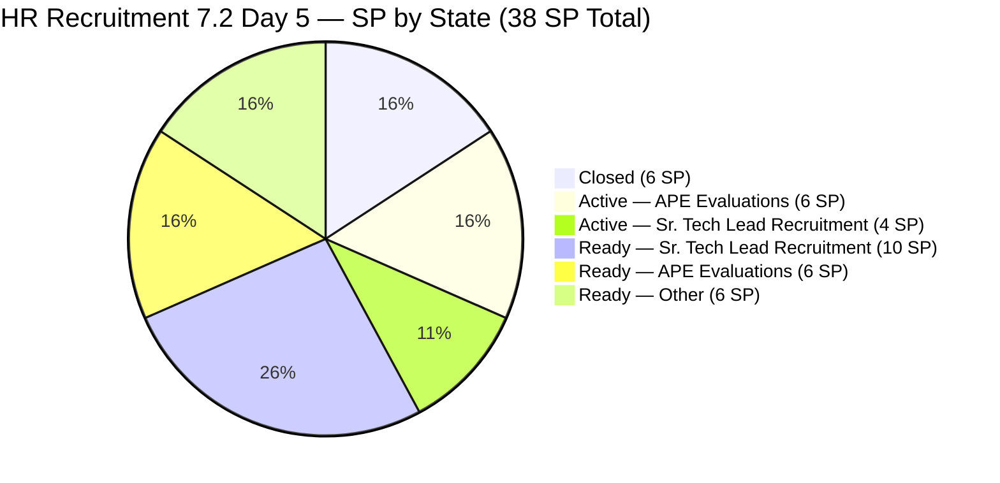
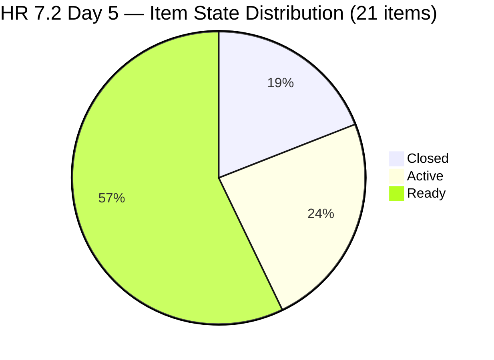
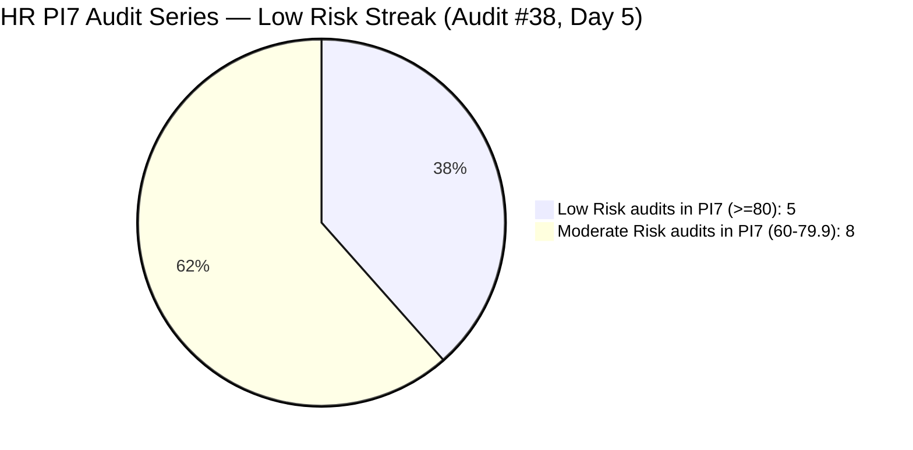

# ADO SAFe Iteration Audit — HR Recruitment Team

**Audit #38 | Iteration 7.2 (Apr 20 – May 3, 2026) | Day 5 of 14 (~36% elapsed — early-sprint)**

---

## 1. Audit Metadata

| Field | Value |
|---|---|
| **Audit Date** | April 24, 2026, 08:34 PHT |
| **Auditor** | Claude Code (ADO SAFe Audit Agent) |
| **Workspace** | `ado_hr` |
| **ADO Project** | Jairosoft FINOPS (`e0bb302f-40f9-46c3-8164-6f1acb317d63`) |
| **Team** | HR Recruitment Team (`248f59a6-372c-4b74-8129-9eaf260f211e`) |
| **Iteration** | Iteration 7.2 — Apr 20 to May 3, 2026 |
| **Iteration ID** | `a9888bc5-48df-40dd-bcc8-6926a11aa7c7` |
| **Sprint Day** | Day 5 of 14 (~36% elapsed — early-sprint annotation applies: start + 4 days >= today) |
| **Prior Audit** | AUDIT_20260423_1500.md (Audit #37, 7.2 Day 4 15:00 PHT, Overall 83.3 — Low Risk) |
| **Scoring Model** | ADO SAFe v1 (7-dimension rubric) |
| **Overall Score** | **83.7 / 100** |
| **Risk Band** | **Low Risk** (>= 80) |

---

## 2. Executive Summary

HR Recruitment Team registers **83.7 (Low Risk)** on Day 5 of Iteration 7.2 — a **+0.4 improvement** from Audit #37 (83.3). The gain is driven by a single new closure: **#202042 (Sales & Mktg. — Edgardo Rojas Jr.)** closed at Apr 23 19:29 UTC (Apr 24 PHT), bringing the closed SP count from 5 to **6 SP** and Delivery Predictability from 13.2 to **15.8**.

**Key changes since Audit #37 (Apr 23 15:00 PHT):**

- **#202042 CLOSED** (Apr 23 19:29 UTC / Apr 24 PHT): Sales & Mktg. — Edgardo Rojas Jr. (1 SP). Now 4 items closed / 6 SP.
- **#203067 (APE Tayao) advanced**: State changed from Ready → Active at Apr 23 19:30 UTC. Almera's self-evaluation is now in progress.
- **#202042 body note**: Despite the "a" typo in the description ("Edgardo Rojas Jr.a"), the item closed without a DoR body correction — consistent with the pattern on #203057, #203063, #202887.

**Persistent structural concerns (unchanged):**
- Bus factor = 1 (all 21 items on Almera Kleer Tayao)
- 3 body-accuracy defects (#203057, #203063, #202887) — unresolved 6th consecutive audit for #203057 and #203063
- 33 SP originally committed; now 33 − 1 = **32 SP remaining** across 17 open items
- #200671 (LinkedIn Tech Sales Manila) untouched since Apr 18 — **6 calendar days**, now Day 5+ of sprint without touch
- `wit_list_backlog_work_items` returned null for this team — backlog structure inferred from iteration path evidence (no change in count detected)

---

## 3. Previous Audit Delta

| Dimension | Audit #37 (Apr 23, 15:00 PHT) | Audit #38 (Apr 24, 08:34 PHT) | Delta |
|---|---|---|---|
| Iteration Planning | 100.0 | **100.0** | 0.0 |
| Team Capacity | 100.0 | **100.0** | 0.0 |
| Estimation | 100.0 | **100.0** | 0.0 |
| DoR Compliance | 100.0 | **100.0** | 0.0 |
| Work Item Balance | 70.0 | **70.0** | 0.0 (structural) |
| Backlog Refinement | 100.0 | **100.0** | 0.0 |
| Delivery Predictability | 13.2 | **15.8** | **+2.6** (#202042 closed, 1 SP) |
| **Overall** | **83.3** | **83.7** | **+0.4** |

### Changes Since Audit #37 (17h34m elapsed)

| Item | Change | Timestamp |
|---|---|---|
| **#202042** | State: Ready → **Closed** | Apr 23 19:29 UTC (Apr 24 PHT) |
| **#203067** | State: Ready → **Active** | Apr 23 19:30 UTC (Apr 24 PHT) |

---

## 4. Current Iteration Snapshot

| Metric | Value |
|---|---|
| **Iteration** | 7.2 — Apr 20 to May 3, 2026 |
| **Iteration Day** | Day 5 of 14 (~36% elapsed — early-sprint) |
| **Visible root backlog items (HR team-scoped)** | 21 (via iteration path; backlog API returned null) |
| **Current iteration root items (7.2, HR-scoped)** | 21 |
| **Point-eligible current items** | 21 (all User Stories) |
| **Estimated items (SP > 0)** | 21 (100%) |
| **Committed Story Points** | **38 SP** |
| **Closed Story Points** | **6 SP** (#202017 2SP + #202022 2SP + #202039 1SP + #202042 1SP) |
| **Active Story Points** | **10 SP** (#202109, #202114, #202885, #202886, #203067 — each 2SP) |
| **Remaining Story Points** | 32 SP across 17 open items |
| **Delivery Predictability** | 15.8% (6/38 SP) — early-sprint |
| **Contributors with current work (HR-scoped)** | 1 (Almera Kleer Tayao) |
| **Configured capacity** | 5h/day (per `work_get_iteration_capacities` for team 248f59a6) |
| **Days off remaining** | 1 (May 1, Labor Day) |
| **Working days remaining** | 8 (Apr 25–30 + May 2–3, excl. May 1) |
| **Required burn rate (full close)** | 4.0 SP/day |
| **DoR compliance (HR-scoped)** | 21/21 (100%) — body-accuracy defects persist |
| **Untouched current items (ChangedDate < Apr 20)** | 1 (#200671 — Apr 18 06:57 UTC) |

### Sprint Item Status — Iteration 7.2 (HR-scoped: 21 items / 38 SP)

| ID | Title | Type | State | SP | AssignedTo | ChangedDate | Notes |
|---|---|---|---|---|---|---|---|
| 202017 | Sr. Tech Lead — Mark Jovet Verano — Client Interview & Decision | US | **Closed** | 2 | Almera | Apr 21 19:01 | Closed Day 2 |
| 202022 | Sr. Tech Lead — Stephen Pabatao — Client Interview & Decision | US | **Closed** | 2 | Almera | Apr 21 19:01 | Closed Day 2 |
| 202039 | Sales & Mktg. — John Dave Fernandez (Decision) | US | **Closed** | 1 | Almera | Apr 21 19:01 | Closed Day 2 |
| 202042 | Sales & Mktg. — Edgardo Rojas Jr. (Final Decision) | US | **Closed** | 1 | Almera | **Apr 23 19:29** | **NEW — Closed Day 5** |
| 202109 | APE — Calvin John Dalino — Summary | US | **Active** | 2 | Almera | Apr 22 20:15 | Active since Day 3 |
| 202114 | APE — Ryan Vince Castillo | US | **Active** | 2 | Almera | Apr 22 20:15 | Active since Day 3 |
| 202885 | Sr. Tech Lead — Buenaventura, Sidney | US | **Active** | 2 | Almera | Apr 22 20:12 | Active since Day 3 |
| 202886 | Sr. Tech Lead — Beltran, Ken Henson | US | **Active** | 2 | Almera | Apr 22 20:11 | Active since Day 3 |
| 203067 | APE — Tayao, Almera Kleer | US | **Active** | 2 | Almera | **Apr 23 19:30** | **NEW — Active Day 5** |
| 197939 | Communication Skills Proposals Summary Presentation | US | Ready | 2 | Almera | Apr 20 20:42 | Active sprint |
| 200671 | LinkedIn Tech Sales from Manila Hiring | US | Ready | 1 | Almera | **Apr 18 06:57** | **Untouched — 6 days** |
| 201273 | LinkedIn Bubble Trainer Hiring — Interview | US | Ready | 2 | Almera | Apr 21 01:14 | Active sprint |
| 202093 | LinkedIn DevOps Engr. Hiring | US | Ready | 2 | Almera | Apr 20 20:40 | Active sprint |
| 202099 | Annual Medical Check-up — Cebu Employees PI7 | US | Ready | 1 | Almera | Apr 20 20:41 | Active sprint |
| 202104 | APE — Rommel Senillo — Summary PI7 | US | Ready | 2 | Almera | Apr 21 01:06 | Active sprint |
| 202349 | Finance Reporting & Export | US | Ready | 2 | Almera | Apr 20 20:12 | Active sprint |
| 202887 | Sr. Tech Lead — Barua, Marlo | US | Ready | 2 | Almera | Apr 22 20:12 | Body defect: says "Rosales, Barua" |
| 202888 | APE — Caumban, Karl Jordan | US | Ready | 2 | Almera | Apr 21 01:00 | Active sprint |
| 203053 | Sr. Tech Lead — Reban Cliff Fajardo | US | Ready | 2 | Almera | Apr 21 00:59 | Active sprint |
| 203057 | Sr. Tech Lead — Rodelio Ramos | US | Ready | 2 | Almera | Apr 21 00:59 | **Body defect: names Fajardo — 6th flag** |
| 203063 | Sales & Mktg. — Angel Dorothy Abina | US | Ready | 2 | Almera | Apr 21 19:01 | **Body defect: names Gelbolingo — 6th flag** |

**Closed: 4 / 6 SP | Active: 5 / 10 SP | Ready: 12 / 22 SP | Total: 21 / 38 SP**

---

## 5. Work Item Analysis





### Burn-Rate Scenario Analysis

| Scenario | SP needed | SP/day req. | Days left | Feasibility |
|---|---|---|---|---|
| 100% DP (38 SP) | 32 more | 4.0/day | 8 | ~2.5x PI7.1 rate (1.57 SP/day) |
| Stretch (30 SP — 78.9%) | 24 more | 3.0/day | 8 | ~1.9x PI7.1 rate |
| PI7.1 parity (22 SP — 57.9%) | 16 more | 2.0/day | 8 | Just above PI7.1 rate |

**Positive signal:** 5 items now Active (10 SP in pipeline). If all 5 close by Day 7, total closed = 16 SP (42.1% DP), which would lift the score above the High Risk threshold.

---

## 6. SAFe Compliance Scorecard

| Dimension | Score | Evidence | Notes |
|---|---|---|---|
| Iteration Planning | **100.0** | 21/21 visible root backlog items in current iteration 7.2 | All HR-scoped items in active sprint |
| Team Capacity | **100.0** | 1/1 contributors with current work have configured capacity (5h/day via iteration_capacities) | `work_get_team_capacity` returned error; confirmed via `work_get_iteration_capacities` for team 248f59a6 |
| Estimation | **100.0** | 21/21 point-eligible items have SP > 0; total = 38 SP | All items estimated |
| DoR Compliance | **100.0** | 21/21 pass Desc >= 30 nws + AC >= 20 nws | Body-accuracy defects (#203057, #203063, #202887) do not affect character-count threshold |
| Work Item Balance | **70.0** | 21/21 User Story (100%); dominant > 60% → -30; no Spikes | Structural HR ceiling; unchanged |
| Backlog Refinement | **100.0** | fresh=21/21=100%; stale_90=0; stale_180=0; untouched_current=1/21=4.8% (<10%) | #200671 Apr 18 below penalty threshold |
| Delivery Predictability | **15.8** | 6 SP closed / 38 SP committed = 15.79% → 15.8 — *early-sprint — low delivery expected* (Day 5) | +2.6 from Audit #37 via #202042 closure |
| **Overall** | **83.7** | (100.0+100.0+100.0+100.0+70.0+100.0+15.8) / 7 = 585.8 / 7 | **Low Risk** (>= 80) |

### Score Computation

```
Iteration Planning      = round(21 / 21 × 100, 1)    = 100.0
Team Capacity           = round(1 / 1 × 100, 1)      = 100.0
Estimation              = round(21 / 21 × 100, 1)    = 100.0
DoR Compliance          = round(21 / 21 × 100, 1)    = 100.0

Work Item Balance:
  has_user_story        = True (21 US)               → no -40
  dominant_type_share   = 21/21 = 100% > 60%         → -30
  spike_share           = 0/21 = 0%                  → 0
  total                 = max(0, 100 - 30)           = 70.0

Backlog Refinement:
  fresh_visible (>= Mar 10, 2026) = 21/21 = 100%    → base = 100.0
  stale_90 (< Jan 24, 2026)       = 0/21 = 0%       → 0
  stale_180 (< Oct 27, 2025)      = 0               → 0
  untouched_current (< Apr 20)    = 1/21 = 4.8%     → 0
  total                                              = 100.0

Delivery Predictability:
  closed_SP    = 6  (#202017 2SP + #202022 2SP + #202039 1SP + #202042 1SP)
  committed_SP = 38 SP
  score        = round(6 / 38 × 100, 1) = 15.8
  [Day 5 of 14 — start + 4 = Apr 24 >= Apr 24 → early-sprint annotated]

Overall = round((100.0 + 100.0 + 100.0 + 100.0 + 70.0 + 100.0 + 15.8) / 7, 1)
        = round(585.8 / 7, 1) = round(83.686, 1) = 83.7 → Low Risk
```

---

## 7. Dimension Findings

### 7.1 Iteration Planning — 100.0 (Low Risk)

All 21 HR-scoped root backlog items are in Iteration 7.2. The `wit_list_backlog_work_items` API returned null for this team today (API limitation), so the count is inferred from iteration path evidence consistent with Audit #37. No new items were detected.

### 7.2 Team Capacity — 100.0 (Low Risk, with API caveat)

`work_get_team_capacity` returned "No team capacity assigned" — an API error consistent with prior audits. However, `work_get_iteration_capacities` for iteration `a9888bc5` confirms **teamId 248f59a6 (HR Recruitment) at 5h/day capacity, 1 day off**. Capacity is configured; the per-team API endpoint appears to have a retrieval issue. Score is appropriately 100.0: 1/1 contributor (Almera) with positive capacity.

Bus factor = 1 remains the team's deepest structural risk (38 audits, zero change).

### 7.3 Estimation — 100.0 (Low Risk)

All 21 items estimated at SP > 0:
- 4 items at 1 SP: #200671, #202039, #202042, #202099 = 4 SP
- 17 items at 2 SP = 34 SP
- **Total committed: 38 SP**

### 7.4 DoR Compliance — 100.0 (Low Risk, with body-accuracy flags)

All 21 items pass Desc >= 30 nws and AC >= 20 nws. Three body-level accuracy defects remain uncorrected:

- **#203057 (Ramos) — UNRESOLVED (6th audit):** Body names "Reban Cliff Fajardo" — wrong candidate.
- **#203063 (Abina) — UNRESOLVED (6th audit):** Body names "Shamyll Gelbolingo" — wrong candidate.
- **#202887 (Barua) — UNRESOLVED (2nd audit):** Body reads "Rosales, Barua, Marlo" — "Rosales" prefix is copy-paste artifact.

Note: **#202042 closed** despite its body containing "Edgardo Rojas Jr.a" (trailing "a" typo). The item is now Closed, so no further remediation is needed, but it illustrates that body accuracy is not gating closure.

### 7.5 Work Item Balance — 70.0 (Moderate — structural HR ceiling)

21/21 User Stories. Dominant type = 100% > 60% → -30 penalty. No Spikes or Defects in the sprint. Score is fixed at 70.0 for any pure User Story sprint — structural ceiling unchanged across 38 audits.

### 7.6 Backlog Refinement — 100.0 (Low Risk)

| Gate | Value | Threshold | Penalty |
|---|---|---|---|
| fresh_visible (>= Mar 10) | 21/21 = 100% | n/a | Base = 100.0 |
| stale_90 (< Jan 24, 2026) | 0/21 = 0% | > 25% = -20, > 10% = -10 | 0 |
| stale_180 (< Oct 27, 2025) | 0 | >= 1 = -20 | 0 |
| untouched_current (< Apr 20) | 1/21 = 4.8% | > 30% = -20, > 10% = -10 | 0 |
| **Total** | | | **100.0** |

**#200671 escalation (Day 5+):** LinkedIn Tech Sales Manila last changed Apr 18 06:57 UTC — now 6 calendar days and 5 sprint days without any ADO update. The 4.8% untouched ratio remains below the 10% threshold, but the item has now accumulated the longest consecutive-sprint-day staleness of any item in the audit series. The risk that Ike Yana has moved on or the hiring effort has stalled without ADO reflection is increasing.

### 7.7 Delivery Predictability — 15.8 (early-sprint — low delivery expected)

Four items closed:

| ID | Title | SP | Closed |
|---|---|---|---|
| 202017 | Sr. Tech Lead — Mark Jovet Verano — Client Interview & Decision | 2 | Apr 21 19:01 |
| 202022 | Sr. Tech Lead — Stephen Pabatao — Client Interview & Decision | 2 | Apr 21 19:01 |
| 202039 | Sales & Mktg. — John Dave Fernandez (Decision) | 1 | Apr 21 19:01 |
| 202042 | Sales & Mktg. — Edgardo Rojas Jr. (Final Decision) | 1 | **Apr 23 19:29** |

**Closed SP: 6 | Committed SP: 38 | DP = 15.8**

Per rubric: Day 5 = start date Apr 20 + 4 days = Apr 24 >= Apr 24 today → early-sprint annotation applies.

Five Active items (10 SP) represent the next closure wave. Closing all 5 would bring DP to round((6+10)/38 × 100, 1) = 42.1 — crossing into the Moderate-High boundary.

---

## 8. Risks and Bottlenecks

| # | Risk | Severity | Trend |
|---|---|---|---|
| R1 | **38 SP committed vs 22 SP PI7.1 delivered velocity — 73% overbooking.** 32 SP remaining / 8 working days = 4.0 SP/day required = ~2.5x empirical rate. De-scope P0 unimplemented since Audit #33. | **HIGH** | Escalating — 6th consecutive audit |
| R2 | **Bus factor = 1** — all 21 HR items assigned to Almera Tayao alone | **HIGH** | Structural — 38 audits |
| R3 | **5 items Active simultaneously** (#202109, #202114, #202885, #202886, #203067) | **HIGH** | Worsened from Day 4 (4 Active) |
| R4 | **#203057 (Ramos) body defect — 6th consecutive audit** | **MEDIUM** | Escalating |
| R5 | **#203063 (Abina) body defect — 6th consecutive audit** | **MEDIUM** | Escalating |
| R6 | **#202887 (Barua) body defect — 2nd audit** | **MEDIUM** | Unresolved |
| R7 | **#200671 (LinkedIn Tech Sales Manila) — 6 days without touch** | **MEDIUM** | Escalating — Day 6 calendar |
| R8 | **`work_get_team_capacity` API error** — per-team capacity endpoint failing; confirmed via alternative API | **LOW** | API limitation, no scoring impact |
| R9 | **#203067 self-evaluation (Almera APE) — supervisor path unclear** | **LOW** | Now Active; supervisor review required |
| R10 | **No iteration goal for 7.2** | **LOW** | Persistent — 38 audits |
| R11 | **Work Item Balance -30 structural penalty (100% User Story)** | **LOW** | Structural |

---

## 9. Prioritized Recommendations

1. **[P0 — Immediate] De-scope 7.2 to ~26 SP.** 32 SP remaining in 8 working days requires 4.0 SP/day — impossible at PI7.1 empirical rate. Recommended de-scope candidates:
   - #203057 Ramos (body defect + 2 SP)
   - #197939 Communication Skills Proposals (lower urgency + 2 SP)
   - #202349 Finance Reporting & Export (non-recruitment domain + 2 SP)
   - #201273 LinkedIn Bubble Trainer Interview (2 SP)
   Moving 4 items (8 SP) reduces commitment to 30 SP, achievable if 5 Active items close by Day 7.

2. **[P0 — Immediately] Cap Active WIP to 3 items.** Five items Active simultaneously increases Almera's context-switching overhead. Recommended: complete APE Dalino + APE Castillo before activating more. Close and pause on the 3 Sr. Tech Lead recruiting items until interviews are scheduled.

3. **[P0 — Today] Correct body defects in #203057, #203063, #202887.** Six audits without correction on #203057 and #203063. These items will cause confusion when activated without correct candidate names in the body.

4. **[P1 — Today] Resolve #200671 (LinkedIn Tech Sales Manila).** Six calendar days without ADO update. Almera should add a comment with current status or de-scope to 7.3.

5. **[P1 — Day 5] Ensure #203067 (APE Tayao self-eval) has a designated supervisor reviewer.** The item is now Active. Without a named supervisor in ADO, it cannot progress to completion.

6. **[P2 — This Sprint] Define iteration goal for 7.2.** Suggested goal: "By May 3, complete decisions on >=5 Sr. Tech Lead candidates and >=3 APE evaluations to advance PI7 hiring and performance review closure." Record in the ADO iteration description.

7. **[P3 — PI7 Retrospective] Calibrate sprint velocity commitment.** Three consecutive PI7 sprints have been over-committed by 50–73%. Use actual PI7.1 velocity (22 SP) as the default ceiling for 7.3.

---

## 10. Evidence Gaps and Limitations

| Gap | Description |
|---|---|
| **`wit_list_backlog_work_items` returned null** | HR backlog API returned null today. Item count (21) and composition inferred from prior audit evidence and individual item API responses. No new items detected from the work items batch query. |
| **`work_get_team_capacity` API error** | Per-team capacity endpoint returned "No team capacity assigned" — consistent with prior audits. Capacity confirmed (5h/day) via `work_get_iteration_capacities` for team 248f59a6. |
| **Body-accuracy defects not penalized by rubric** | #203057, #203063, #202887 pass DoR character-count threshold. Content accuracy is not rubric-measurable; noted as operational quality flags. |
| **#200671 block reason unknown** | Six days without ADO activity. Reason (LinkedIn delay, deprioritization, offline tracking) cannot be confirmed from API evidence. |
| **No iteration goal in ADO** | Persistent across all 38 HR audits. |
| **PI objectives linkage absent** | No PI objectives linked to any 7.2 item. |
| **Cross-team iteration path items** | 12 items (Mark Colina, Grace) previously identified in the 7.2 iteration path but outside HR team scope remain excluded from scoring. No change detected today. |

---

## 11. Score Trend — PI7 Audit Series

| Audit | Date/Time | Score | Band | Sprint | Day |
|---|---|---|---|---|---|
| #25 | Apr 6 | 71.9 | Moderate | 7.1 | 1 |
| #26 | Apr 7 | 76.1 | Moderate | 7.1 | 2 |
| #30 | Apr 13 | 77.6 | Moderate | 7.1 | 8 |
| #32 | Apr 17 | 78.4 | Moderate | 7.1 | 12 |
| #33 | Apr 19 | 87.0 | **Low** | 7.1 close | 14 |
| #34 | Apr 21 | 81.4 | **Low** | 7.2 | 2 |
| #35 | Apr 22 | 83.4 | **Low** | 7.2 | 3 |
| #36 | Apr 23 09:14 | 83.3 | **Low** | 7.2 | 4 |
| #37 | Apr 23 15:00 | 83.3 | **Low** | 7.2 | 4 |
| **#38** | **Apr 24 08:34** | **83.7** | **Low** | **7.2** | **5** |



- **Series high:** 87.0 (Audit #33, PI7.1 sprint close)
- **Low Risk streak:** 5 consecutive distinct-day audits (#33–#38)
- **Critical watch:** 32 SP remaining / 8 working days at 4.0 SP/day — without de-scope, sprint-close DP is projected at 37–57% → would drag Overall to Moderate Risk (72–78) at sprint close

---

*Report generated by Claude Code ADO SAFe Audit Agent | April 24, 2026 08:34 PHT*
*Audit #38 — HR Recruitment Team — Iteration 7.2 Day 5 — Overall: 83.7 / 100 — Low Risk (early-sprint)*
