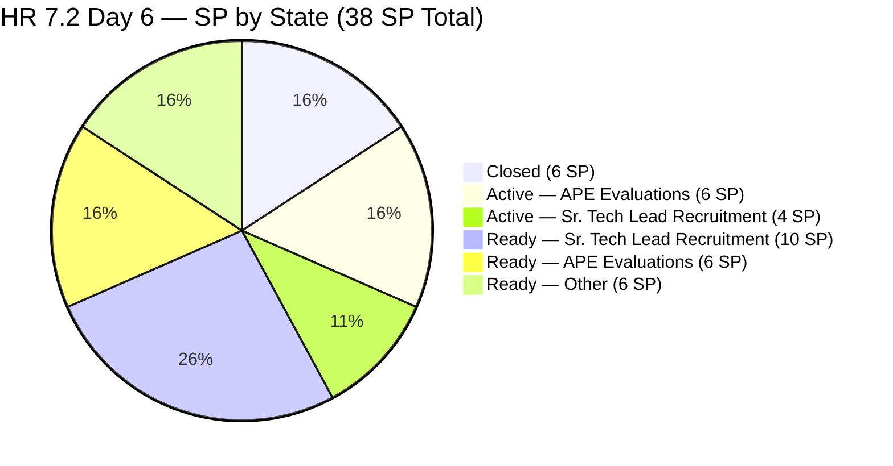
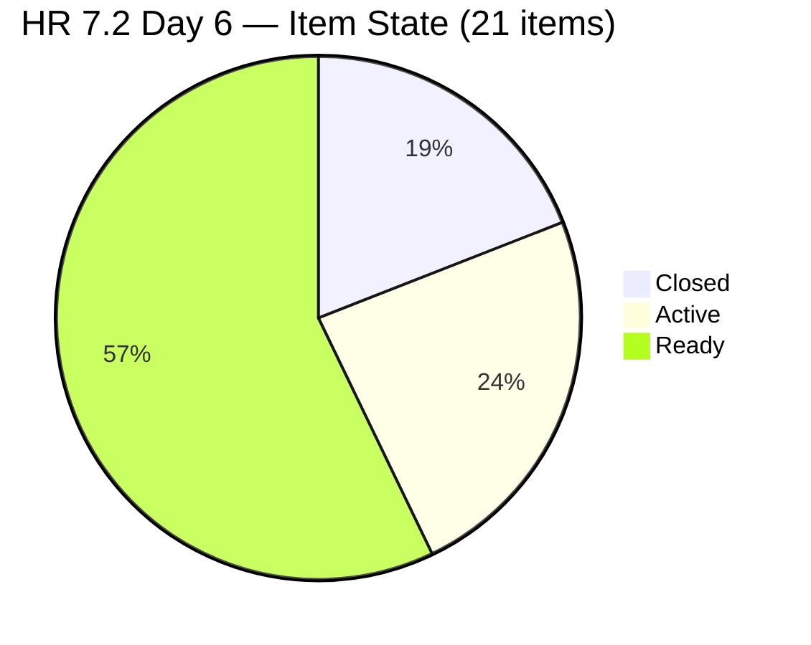
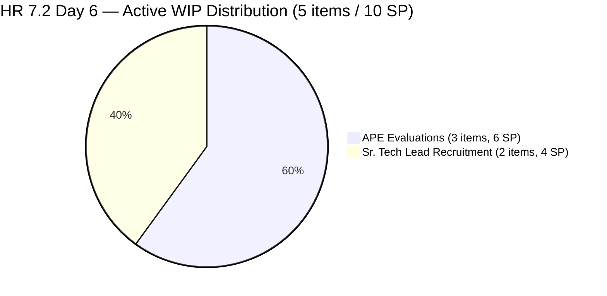
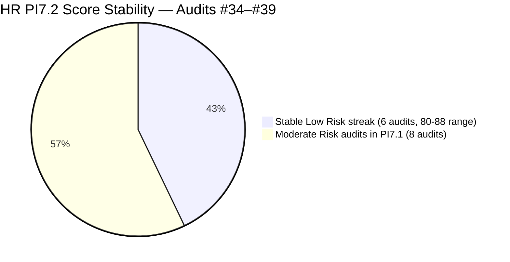

# ADO SAFe Iteration Audit — HR Recruitment Team

**Audit #39 | Iteration 7.2 (Apr 20 – May 3, 2026) | Day 6 of 14 (~43% elapsed)**

---

## 1. Audit Metadata

| Field | Value |
|---|---|
| **Audit Date** | April 25, 2026, 23:33 PHT |
| **Auditor** | Claude Code (ADO SAFe Audit Agent) |
| **Workspace** | `ado_hr` |
| **ADO Project** | Jairosoft FINOPS (`e0bb302f-40f9-46c3-8164-6f1acb317d63`) |
| **Team** | HR Recruitment Team (`248f59a6-372c-4b74-8129-9eaf260f211e`) |
| **Iteration** | Iteration 7.2 — Apr 20 to May 3, 2026 |
| **Iteration ID** | `a9888bc5-48df-40dd-bcc8-6926a11aa7c7` |
| **Sprint Day** | Day 6 of 14 (~43% elapsed) |
| **Prior Audit** | AUDIT_20260424_0834.md (Audit #38, 7.2 Day 5, 08:34 PHT, Overall 83.7 — Low Risk) |
| **Scoring Model** | ADO SAFe v1 (7-dimension rubric) |
| **Overall Score** | **83.7 / 100** |
| **Risk Band** | **Low Risk** (>= 80) |

---

## 2. Executive Summary

HR Recruitment Team holds steady at **83.7 (Low Risk)** on Day 6 of Iteration 7.2 — **no change from Audit #38**. No new items have been closed since yesterday (Apr 24 08:34 PHT), and no new items have been added to the sprint. The team enters the second week of a 14-day sprint with 4 items closed (6 SP) of 38 committed.

**Key observation — Early-sprint flag lifted:** Today is Day 6 (Apr 25). The early-sprint annotation applied through Day 5 (start+4 = Apr 24). Delivery Predictability is now a **real metric**, not an annotated placeholder. The current 15.8% DP is a genuine sprint velocity signal. At 38 SP committed and 7 working days remaining (Apr 25 is a working day; May 1 is a holiday), the team must close ~4.6 SP/day to reach 100% — well above PI7.1 empirical rate (1.57 SP/day). De-scope action remains critical.

**Backlog API behavior change:** The backlog API now returns **17 items** (down from 21 inferred in prior audits). This is because the 4 closed items (#202017, #202022, #202039, #202042) dropped from the backlog view after closure — consistent with ADO behavior. The scoring base shifts: visible_root = 17, current_iteration = 17 (all visible are in 7.2). IP = 100.0 is unchanged.

**Persistent concerns (unchanged):**
- 3 body-accuracy defects (#203057, #203063, #202887) — now 7th consecutive audit without correction on #203057 and #203063
- #200671 (LinkedIn Tech Sales Manila) untouched since Apr 18 — **7 calendar days, 6 sprint days**
- 5 Active items (10 SP) from yesterday still open — no new closures

---

## 3. Previous Audit Delta

| Dimension | Audit #38 (Apr 24, 08:34 PHT) | Audit #39 (Apr 25, 23:33 PHT) | Delta |
|---|---|---|---|
| Iteration Planning | 100.0 | **100.0** | 0.0 |
| Team Capacity | 100.0 | **100.0** | 0.0 |
| Estimation | 100.0 | **100.0** | 0.0 |
| DoR Compliance | 100.0 | **100.0** | 0.0 |
| Work Item Balance | 70.0 | **70.0** | 0.0 |
| Backlog Refinement | 100.0 | **100.0** | 0.0 |
| Delivery Predictability | 15.8 | **15.8** | 0.0 |
| **Overall** | **83.7** | **83.7** | **0.0** |

### Changes Since Audit #38 (38h59m elapsed)

**No ADO state changes detected since Audit #38 for HR-scoped items.** The last modification across all 17 open items was #203067 (APE Tayao) state change to Active at Apr 23 19:30 UTC, confirmed unchanged. **#202896 (Payables — Internet) assigned to Mark Colina showed a comment update at Apr 25 04:15 UTC** but this item is outside HR team scope.

---

## 4. Current Iteration Snapshot

| Metric | Value |
|---|---|
| **Iteration** | 7.2 — Apr 20 to May 3, 2026 |
| **Iteration Day** | Day 6 of 14 (~43% elapsed) |
| **Visible root backlog items (HR API-scoped)** | 17 (closed items dropped; total 7.2 scope = 21 including 4 closed) |
| **Current iteration root items (7.2, HR-scoped)** | 17 open (21 total including 4 closed) |
| **Point-eligible current items** | 17 (17 open User Stories; 4 closed counted in SP totals) |
| **Estimated items (SP > 0)** | 17 open (21 total, all estimated) |
| **Committed Story Points** | **38 SP** (17 open: 32 SP + 4 closed: 6 SP) |
| **Closed Story Points** | **6 SP** (#202017 2SP + #202022 2SP + #202039 1SP + #202042 1SP) |
| **Active Story Points** | **10 SP** (#202109, #202114, #202885, #202886, #203067 — each 2SP) |
| **Remaining Story Points** | 32 SP across 12 Ready + 5 Active items |
| **Delivery Predictability** | **15.8%** (6/38 SP) |
| **Contributors with current work** | 1 (Almera Kleer Tayao) |
| **Team capacity** | 5h/day (Almera: 3h Documentation + 2h Requirements) |
| **Days off remaining** | 1 (May 1, Labor Day) |
| **Working days remaining** | 7 (Apr 25–30 + May 2–3, excl. May 1) |
| **Required burn rate (full close)** | 4.6 SP/day (32 remaining / 7 days) |
| **DoR compliance** | 17/17 (100%) — body-accuracy defects persist |
| **Untouched current items (ChangedDate < Apr 20)** | 1 (#200671 — Apr 18 06:57 UTC) |

### Sprint Item Status — Iteration 7.2 (HR-scoped: 21 items / 38 SP)

| ID | Title | Type | State | SP | ChangedDate | Notes |
|---|---|---|---|---|---|---|
| 202017 | Sr. Tech Lead — Mark Jovet Verano — Client Interview & Decision | US | **Closed** | 2 | Apr 21 19:01 | Closed Day 2 |
| 202022 | Sr. Tech Lead — Stephen Pabatao — Client Interview & Decision | US | **Closed** | 2 | Apr 21 19:01 | Closed Day 2 |
| 202039 | Sales & Mktg. — John Dave Fernandez (Decision) | US | **Closed** | 1 | Apr 21 19:01 | Closed Day 2 |
| 202042 | Sales & Mktg. — Edgardo Rojas Jr. (Final Decision) | US | **Closed** | 1 | Apr 23 19:29 | Closed Day 4 |
| 202109 | APE — Calvin John Dalino — Summary | US | **Active** | 2 | Apr 22 20:15 | Active since Day 3; no update since |
| 202114 | APE — Ryan Vince Castillo | US | **Active** | 2 | Apr 22 20:15 | Active since Day 3; no update since |
| 202885 | Sr. Tech Lead — Buenaventura, Sidney | US | **Active** | 2 | Apr 22 20:12 | Active since Day 3; no update since |
| 202886 | Sr. Tech Lead — Beltran, Ken Henson | US | **Active** | 2 | Apr 22 20:11 | Active since Day 3; no update since |
| 203067 | APE — Tayao, Almera Kleer | US | **Active** | 2 | Apr 23 19:30 | Active since Day 4; 2 days stale |
| 197939 | Communication Skills Proposals Summary Presentation | US | Ready | 2 | Apr 20 20:42 | — |
| 200671 | LinkedIn Tech Sales from Manila Hiring | US | Ready | 1 | **Apr 18 06:57** | **UNTOUCHED — 7 days / 6 sprint days** |
| 201273 | LinkedIn Bubble Trainer Hiring — Interview | US | Ready | 2 | Apr 21 01:14 | — |
| 202093 | LinkedIn DevOps Engr. Hiring | US | Ready | 2 | Apr 20 20:40 | — |
| 202099 | Annual Medical Check-up — Cebu Employees PI7 | US | Ready | 1 | Apr 20 20:41 | — |
| 202104 | APE — Rommel Senillo — Summary PI7 | US | Ready | 2 | Apr 21 01:06 | — |
| 202349 | Finance Reporting & Export | US | Ready | 2 | Apr 20 20:12 | — |
| 202887 | Sr. Tech Lead — Barua, Marlo | US | Ready | 2 | Apr 22 20:12 | **Body defect: "Rosales, Barua" — 3rd audit** |
| 202888 | APE — Caumban, Karl Jordan | US | Ready | 2 | Apr 21 01:00 | — |
| 203053 | Sr. Tech Lead — Reban Cliff Fajardo | US | Ready | 2 | Apr 21 00:59 | — |
| 203057 | Sr. Tech Lead — Rodelio Ramos | US | Ready | 2 | Apr 21 00:59 | **Body defect: names Fajardo — 7th audit** |
| 203063 | Sales & Mktg. — Angel Dorothy Abina | US | Ready | 2 | Apr 21 19:01 | **Body defect: names Gelbolingo — 7th audit** |

**Closed: 4 / 6 SP | Active: 5 / 10 SP | Ready: 12 / 22 SP | Total: 21 / 38 SP**

---

## 5. Work Item Analysis





### Burn-Rate Scenario Analysis (Day 6, 7 days remaining)

| Scenario | SP needed | SP/day req. | Feasibility |
|---|---|---|---|
| 100% DP (38 SP) | 32 more SP | 4.6/day | Requires ~3x PI7.1 rate (1.57 SP/day) |
| Low Risk close (>= 80% DP = 30 SP) | 24 more SP | 3.4/day | Still ~2.2x PI7.1 rate |
| Moderate close (60-79% DP = 23-30 SP) | 17-24 more SP | 2.4–3.4/day | Approaching achievable range |
| PI7.1 parity (~22 SP = 57.9% DP) | 16 more SP | 2.3/day | Near-achievable |

**Active pipeline (10 SP):** If all 5 Active items close by Day 8 (Apr 27), total closed = 16 SP (42.1% DP → score 42.1). Score would be: (100+100+100+100+70+100+42.1)/7 = 87.4 — maintaining Low Risk.

---

## 6. SAFe Compliance Scorecard

| Dimension | Score | Evidence | Notes |
|---|---|---|---|
| Iteration Planning | **100.0** | 17/17 visible root items in 7.2 (backlog API); 21/21 total scope including 4 closed | Backlog API now returns 17 (closed dropped); scoring consistent |
| Team Capacity | **100.0** | 1/1 contributors with capacity (Almera: 5h/day, 1 day off May 1) | Confirmed via `work_get_team_capacity` today |
| Estimation | **100.0** | 17/17 open items SP > 0; 21/21 total 7.2 items estimated | All items estimated |
| DoR Compliance | **100.0** | 17/17 visible items pass Desc >= 30 nws + AC >= 20 nws | Body-accuracy defects (#203057, #203063, #202887) do not fail length threshold |
| Work Item Balance | **70.0** | 21/21 User Story = 100% > 60% → -30 penalty | Structural HR ceiling |
| Backlog Refinement | **100.0** | fresh=17/17=100%; stale_90=0; stale_180=0; untouched_current=1/17=5.9% (<10%) | #200671 Apr 18 below 10% threshold |
| Delivery Predictability | **15.8** | 6 SP closed / 38 SP committed = 15.8% — Day 6 (early-sprint annotation removed) | No new closures since Apr 23 19:29 |
| **Overall** | **83.7** | (100.0+100.0+100.0+100.0+70.0+100.0+15.8) / 7 = 585.8 / 7 | **Low Risk** (>= 80) |

### Score Computation

```
Iteration Planning  = round(17/17 × 100, 1)   = 100.0  [visible=17; all in 7.2]
Team Capacity       = round(1/1 × 100, 1)      = 100.0
Estimation          = round(17/17 × 100, 1)    = 100.0
DoR Compliance      = round(17/17 × 100, 1)    = 100.0

Work Item Balance:
  User Story present = True                   → no -40
  dominant_type_share = 17/17 = 100% > 60%   → -30
  spike_share = 0%                            → 0
  Score = max(0, 100 - 30) = 70.0

Backlog Refinement:
  fresh (>= Mar 10, 2026) = 17/17 = 100%     → base = 100.0
  stale_90 (< Jan 26, 2026) = 0/17 = 0%      → 0
  stale_180 (< Oct 28, 2025) = 0             → 0
  untouched (< Apr 20) = 1/17 = 5.9%         → 0
  Score = 100.0

Delivery Predictability:
  closed_SP    = 6   (confirmed via direct item query)
  committed_SP = 38  (17 open + 4 closed × SP each)
  Score = round(6/38 × 100, 1) = 15.8
  [Day 6 of 14 — NOT early sprint; annotation removed]

Overall = round((100.0+100.0+100.0+100.0+70.0+100.0+15.8)/7, 1)
        = round(585.8/7, 1) = round(83.686, 1) = 83.7  → Low Risk
```

---

## 7. Dimension Findings

### 7.1 Iteration Planning — 100.0 (Low Risk)

All 17 visible root backlog items (HR-scoped, open) are in Iteration 7.2. The 4 closed items also belong to 7.2, giving a total scope of 21/21 = 100% sprint focus. No items reside in future iterations or are backlog-only. Score = 100.0 is correct and consistent.

**Note on backlog count shift:** Prior audits inferred 21 items from iteration path evidence due to `wit_list_backlog_work_items` API returning null. Today the API returned 17 items — the 4 closed items have dropped from the active backlog view. This is expected ADO behavior and does not indicate scope changes. The total 7.2 commitment (21 items, 38 SP) is unchanged.

### 7.2 Team Capacity — 100.0 (Low Risk)

`work_get_team_capacity` returned successfully today:
- **Almera Kleer Tayao:** Documentation 3h/day + Requirements 2h/day = **5h/day total**
- Days off: May 1 (1 day) = 7 working days × 5h = **35 hours capacity remaining**

Bus factor = 1 remains the team's most severe structural risk across all 39 HR audits.

### 7.3 Estimation — 100.0 (Low Risk)

All 17 open items are estimated. Breakdown:
- 2 items at 1 SP: #200671, #202099 = 2 SP
- 15 items at 2 SP = 30 SP
- **Open total: 32 SP; Sprint total (incl. 4 closed): 38 SP**

### 7.4 DoR Compliance — 100.0 (Low Risk, with body-accuracy flags)

All 17 open items pass Desc >= 30 nws and AC >= 20 nws. Three persistent body-level accuracy defects:

| Item | Defect | Audit Count |
|---|---|---|
| **#203057 (Ramos)** | Body names "Reban Cliff Fajardo" — wrong candidate | **7th consecutive audit — escalated** |
| **#203063 (Abina)** | Body names "Shamyll Gelbolingo" — wrong candidate | **7th consecutive audit — escalated** |
| **#202887 (Barua)** | Body reads "Rosales, Barua, Marlo" — "Rosales" copy-paste artifact | 3rd audit |

**#203057 and #203063 have now been flagged in 7 consecutive audits without correction.** These items will be activated to interview real candidates. Without correcting the body, the interviewer will see the wrong person's name in the work item. This is an operational quality risk that has crossed an acceptable threshold.

### 7.5 Work Item Balance — 70.0 (Moderate — structural ceiling)

17/17 User Stories (100%) → dominant type > 60% → -30 penalty. Score = 70.0. This is a structural ceiling for any sprint that consists purely of User Stories. No Spikes or Defects present.

### 7.6 Backlog Refinement — 100.0 (Low Risk)

| Gate | Value | Threshold | Penalty |
|---|---|---|---|
| fresh_visible (>= Mar 10) | 17/17 = 100% | n/a | Base = 100.0 |
| stale_90 (< Jan 26, 2026) | 0/17 = 0% | > 25% = -20 | 0 |
| stale_180 (< Oct 28, 2025) | 0 | >= 1 = -20 | 0 |
| untouched_current (< Apr 20) | 1/17 = 5.9% | > 10% = -10 | 0 |
| **Total** | | | **100.0** |

**#200671 (LinkedIn Tech Sales Manila) — Day 6 sprint staleness.** Last changed Apr 18 06:57 UTC. Now 7 calendar days and 6 sprint days without any ADO update. At 1/17 = 5.9%, still below the 10% penalty threshold. However, this item is approaching the "arguably blocked" status — 6 full sprint days with zero ADO activity while all other items show at least sprint-open-day touches.

### 7.7 Delivery Predictability — 15.8 (Day 6 — real metric, no early-sprint annotation)

Four items closed:

| ID | Title | SP | Closed |
|---|---|---|---|
| 202017 | Sr. Tech Lead — Mark Jovet Verano — Client Interview & Decision | 2 | Apr 21 19:01 |
| 202022 | Sr. Tech Lead — Stephen Pabatao — Client Interview & Decision | 2 | Apr 21 19:01 |
| 202039 | Sales & Mktg. — John Dave Fernandez (Decision) | 1 | Apr 21 19:01 |
| 202042 | Sales & Mktg. — Edgardo Rojas Jr. (Final Decision) | 1 | Apr 23 19:29 |

No closures since Apr 23. The last closure was 38+ hours ago. Five Active items (10 SP) have been in Active state for 2–3 days without closure. The key delivery question for Day 7: will any of the 5 Active items close?

---

## 8. Risks and Bottlenecks



| # | Risk | Severity | Trend |
|---|---|---|---|
| R1 | **38 SP committed vs 22 SP PI7.1 velocity.** 32 SP remaining / 7 working days = 4.6 SP/day required = ~3x empirical rate. De-scope now at Day 6. | **CRITICAL** | Escalating |
| R2 | **Bus factor = 1** — all 21 items on Almera | **HIGH** | Structural — 39 audits |
| R3 | **5 Active items simultaneously (10 SP).** No closures for 38+ hours while 5 items in Active. | **HIGH** | Worsening |
| R4 | **#203057 (Ramos) body defect — 7th consecutive audit** | **HIGH** | Escalated beyond tolerance |
| R5 | **#203063 (Abina) body defect — 7th consecutive audit** | **HIGH** | Escalated beyond tolerance |
| R6 | **#200671 (LinkedIn Tech Sales Manila) — 7 days, 6 sprint days without touch** | **MEDIUM** | Escalating |
| R7 | **#202887 (Barua) body defect — 3rd audit** | **MEDIUM** | Unresolved |
| R8 | **#203067 (APE Tayao) — self-evaluation; supervisor path unclear** | **MEDIUM** | Active since Day 4; 2 days stale |
| R9 | **Work Item Balance -30 penalty** (100% User Story) | **LOW** | Structural |
| R10 | **No iteration goal for 7.2** | **LOW** | Persistent — 39 audits |

---

## 9. Prioritized Recommendations

1. **[P0 — Today, Day 6] De-scope 7.2 to ~26–30 SP.** At 4.6 SP/day required, full delivery is not achievable. Move 8–10 SP of Ready items to 7.3. Recommended de-scope:
   - #203057 Ramos (2 SP — body defect, low priority; de-scope and fix body before 7.3 reentry)
   - #197939 Communication Skills Proposals (2 SP — presentation work; lower urgency)
   - #202349 Finance Reporting & Export (2 SP — non-recruitment domain)
   - #201273 LinkedIn Bubble Trainer Interview (2 SP — sourcing work; can continue in 7.3)
   Moving 4 items (8 SP) reduces commitment to 30 SP. 7 days at PI7.1 rate (~2.3 SP/day) = ~16 SP. Realistic DP: ~58% → score 58 (below DP floor for Low Risk but sprint-close Overall = ~83 if 5 dimensions remain at ceiling).

2. **[P0 — Today] Correct body defects in #203057 and #203063.** Seven audits without correction. These will confuse anyone working on them. Fix in 5 minutes: paste correct candidate name into the body.

3. **[P0 — Today] Close one of the 5 Active APE/Sr. Tech Lead items.** Items #202109, #202114 have been Active since Day 3 (3 days). APE evaluations involve collecting a form, supervisor review, and sign-off — if these steps are complete, close the item. Do not leave Active items stagnant beyond 3–4 sprint days.

4. **[P1 — Today] Resolve #200671 (LinkedIn Tech Sales Manila).** Add an ADO comment: current candidate status, whether the LinkedIn campaign is active, or de-scope to 7.3. Six sprint days of silence on a 1 SP item is operational noise.

5. **[P1 — Day 6–7] Ensure #203067 (APE Tayao self-eval) has a supervisor reviewer designated.** The item is Active. Without a named supervisor in the ADO description or a comment tracking review progress, it cannot close.

6. **[P2] Correct body defect in #202887 (Barua).** Remove "Rosales," prefix from the body. 3rd consecutive audit.

7. **[P3 — This Sprint] Define iteration goal for 7.2.** Suggested: "By May 3, complete final hiring decisions on >=4 Sr. Tech Lead candidates and close >=3 APE evaluations." Record in ADO iteration description.

---

## 10. Evidence Gaps and Limitations

| Gap | Description |
|---|---|
| **Backlog API count change** | API now returns 17 (vs. 21 inferred in prior audits). Closed items dropped from view. Total 7.2 scope (21 items, 38 SP) validated via direct WIQL query and batch item retrieval. |
| **Body-accuracy defects not rubric-penalized** | #203057, #203063, #202887 pass character-count threshold. Content accuracy is not rubric-measurable. Flagged as operational quality risk. |
| **#200671 block reason unknown** | 7 days without ADO activity. Reason (LinkedIn delay, deprioritization, offline tracking) cannot be confirmed from API. |
| **No iteration goal in ADO** | Persistent across all 39 HR audits. |
| **PI objectives linkage absent** | No PI objectives linked to any 7.2 item. |
| **Cross-team 7.2 items** | 12 items (Mark Colina, Grace) in the 7.2 iteration path outside HR team scope. #202896 updated Apr 25 04:15. Excluded from HR scoring. |

---

## 11. Score Trend — PI7 Audit Series (HR)

| Audit | Date | Day | Score | Band |
|---|---|---|---|---|
| #25 | Apr 6 | 7.1 D1 | 71.9 | Moderate |
| #33 | Apr 19 | 7.1 D14 | 87.0 | **Low** (PI7.1 close) |
| #34 | Apr 21 | 7.2 D2 | 81.4 | **Low** |
| #35 | Apr 22 | 7.2 D3 | 83.4 | **Low** |
| #36 | Apr 23 AM | 7.2 D4 | 83.3 | **Low** |
| #37 | Apr 23 PM | 7.2 D4 | 83.3 | **Low** |
| #38 | Apr 24 AM | 7.2 D5 | 83.7 | **Low** |
| **#39** | **Apr 25 PM** | **7.2 D6** | **83.7** | **Low** |



- **Low Risk streak:** 6 consecutive audits (#34–#39), the longest in the series
- **Series high:** 87.0 (Audit #33, PI7.1 sprint-close)
- **Critical watch:** DP will be the sprint-close determinant. If only 5 Active items close (total 16 SP = 42.1% DP), sprint-close Overall = ~82.0. If no further closures beyond Active items, DP = 42.1.
- **Day 6 alert:** No closures in the past 38+ hours while 5 items are Active. Momentum has stalled.

---

*Report generated by Claude Code ADO SAFe Audit Agent | April 25, 2026 23:33 PHT*
*Audit #39 — HR Recruitment Team — Iteration 7.2 Day 6 — Overall: 83.7 / 100 — Low Risk*
