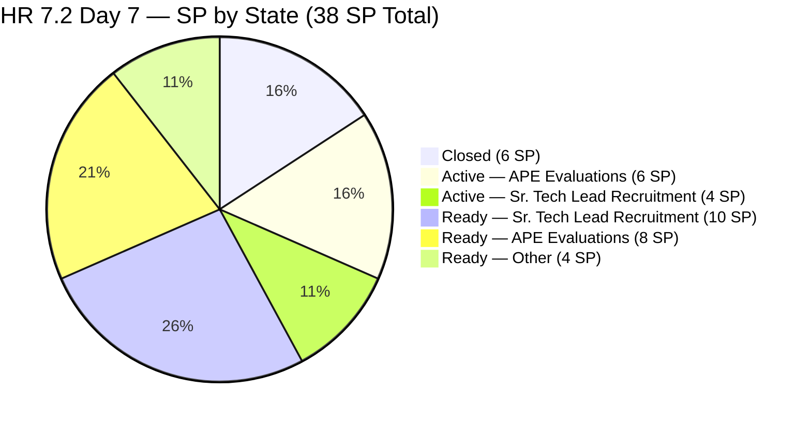
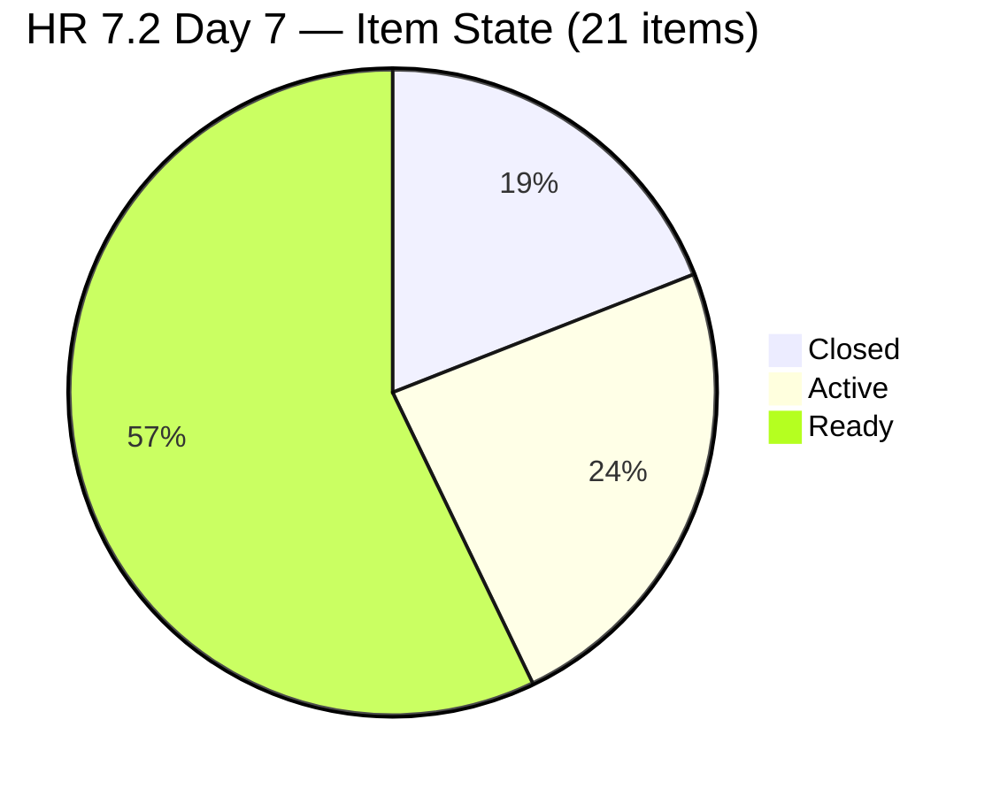
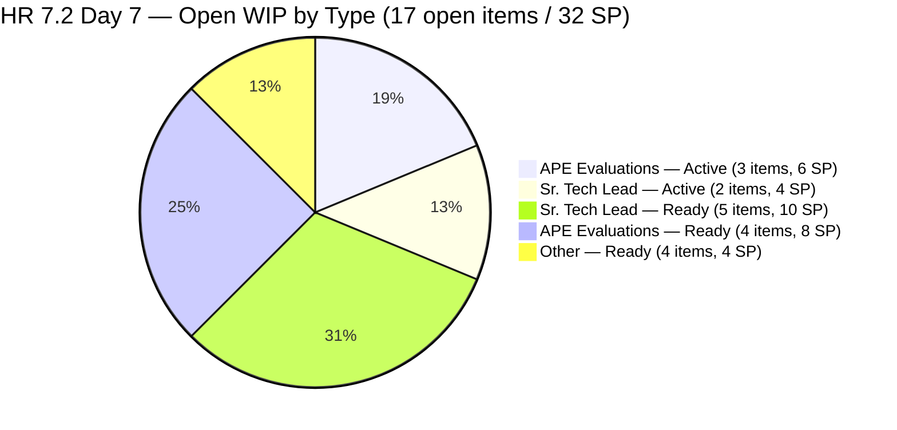
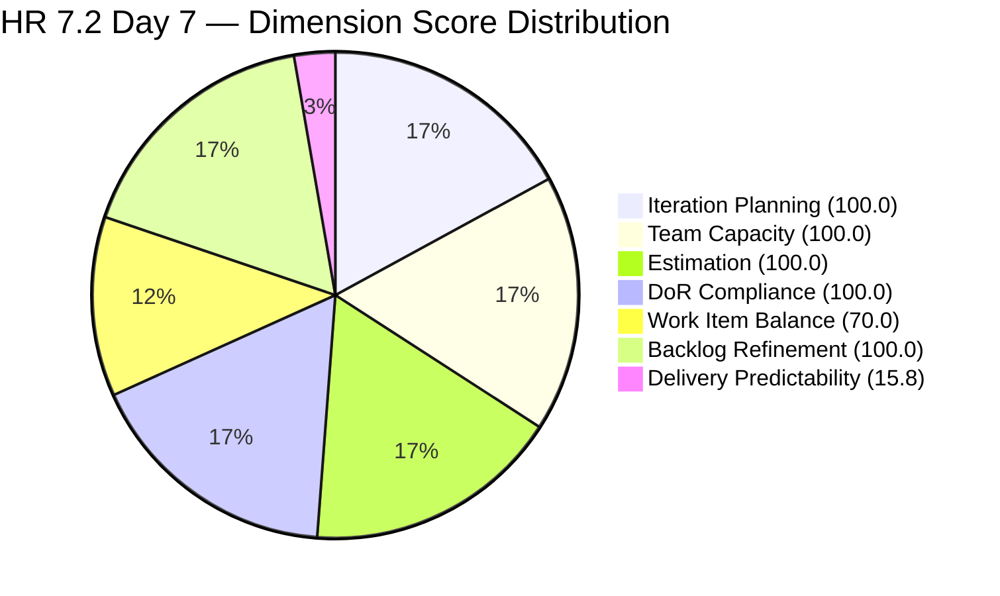

# ADO SAFe Iteration Audit — HR Recruitment Team

**Audit #40 | Iteration 7.2 (Apr 20 – May 3, 2026) | Day 7 of 14 (~50% elapsed)**

---

## 1. Audit Metadata

| Field | Value |
|---|---|
| **Audit Date** | April 26, 2026, 14:00 PHT |
| **Auditor** | Claude Code (ADO SAFe Audit Agent) |
| **Workspace** | `ado_hr` |
| **ADO Project** | Jairosoft FINOPS (`e0bb302f-40f9-46c3-8164-6f1acb317d63`) |
| **Team** | HR Recruitment Team (`248f59a6-372c-4b74-8129-9eaf260f211e`) |
| **Iteration** | Iteration 7.2 — Apr 20 to May 3, 2026 |
| **Iteration ID** | `a9888bc5-48df-40dd-bcc8-6926a11aa7c7` |
| **Sprint Day** | Day 7 of 14 (~50% elapsed) |
| **Prior Audit** | AUDIT_20260425_1533.md (Audit #39, 7.2 Day 6, 23:33 PHT, Overall 83.7 — Low Risk) |
| **Scoring Model** | ADO SAFe v1 (7-dimension rubric) |
| **Overall Score** | **83.7 / 100** |
| **Risk Band** | **Low Risk** (>= 80) |

---

## 2. Executive Summary

HR Recruitment Team holds at **83.7 (Low Risk)** on Day 7 — **no change from Audit #39**. The sprint has now reached the exact midpoint (50% elapsed). No items have been closed since Apr 23 (Day 4) — that is now **3 full calendar days and 3 sprint days without any closure**. Five items remain in Active state (10 SP), and 12 remain in Ready (22 SP), all unstarted.

**Sprint midpoint reality check:** The team has 4 closed items (6 SP) of 21 committed (38 SP). With 7 working days remaining (Apr 27–30, May 2–3, noting Apr 28 is not a holiday), the required burn rate to hit 100% DP remains approximately 4.6 SP/day — roughly 3x the PI7.1 empirical rate of 1.57 SP/day. De-scope conversations are now overdue.

**Active item stall:** #202109 and #202114 (APE evaluations for Dalino and Castillo) have been Active since Apr 22 — now 4 calendar days without closure. #202885 and #202886 (Sr. Tech Lead Buenaventura and Beltran) also Active since Apr 22. #203067 (APE Tayao self-eval) Active since Apr 23. None of these five have had an ADO update since their activation dates.

**Persistent quality defects (unchanged):**
- #203057 (Ramos) — body names "Reban Cliff Fajardo" — **8th consecutive audit without correction**
- #203063 (Abina) — body names "Shamyll Gelbolingo" — **8th consecutive audit without correction**
- #202887 (Barua) — body reads "Rosales, Barua, Marlo" — 4th consecutive audit

**No backlog composition change.** The API returned 17 visible root items identical to Audit #39.

---

## 3. Previous Audit Delta

| Dimension | Audit #39 (Apr 25, 23:33 PHT) | Audit #40 (Apr 26, 14:00 PHT) | Delta |
|---|---|---|---|
| Iteration Planning | 100.0 | **100.0** | 0.0 |
| Team Capacity | 100.0 | **100.0** | 0.0 |
| Estimation | 100.0 | **100.0** | 0.0 |
| DoR Compliance | 100.0 | **100.0** | 0.0 |
| Work Item Balance | 70.0 | **70.0** | 0.0 |
| Backlog Refinement | 100.0 | **100.0** | 0.0 |
| Delivery Predictability | 15.8 | **15.8** | 0.0 |
| **Overall** | **83.7** | **83.7** | **0.0** |

### Changes Since Audit #39 (14h27m elapsed)

**No ADO state changes detected.** All 17 visible backlog items show identical ChangedDates to Audit #39:

| Last Activity | Item | Date |
|---|---|---|
| Most recent touch (any item) | #203067 (APE Tayao) | Apr 23, 19:30 UTC |
| Second most recent | #202109, #202114 | Apr 22, 20:15 UTC |
| Third most recent | #202885, #202886, #202887 | Apr 22, 20:11–20:13 UTC |
| Oldest sprint item | #200671 | Apr 18, 06:57 UTC |

Zero closures since Apr 23. Zero state changes in 62+ hours.

---

## 4. Current Iteration Snapshot

| Metric | Value |
|---|---|
| **Iteration** | 7.2 — Apr 20 to May 3, 2026 |
| **Iteration Day** | Day 7 of 14 (50% elapsed — sprint midpoint) |
| **Visible root backlog items (HR API-scoped)** | 17 (4 closed items remain absent from backlog view) |
| **Current iteration root items (7.2, HR-scoped)** | 17 open + 4 closed = **21 total** |
| **Point-eligible current items** | 21 (all User Stories) |
| **Estimated items (SP > 0)** | 21 (all estimated) |
| **Committed Story Points** | **38 SP** |
| **Closed Story Points** | **6 SP** (#202017 2SP, #202022 2SP, #202039 1SP, #202042 1SP) |
| **Active Story Points** | **10 SP** (5 items × 2 SP each) |
| **Ready Story Points** | **22 SP** (12 items) |
| **Delivery Predictability** | **15.8%** (6/38 SP) |
| **Contributors with current work** | 1 (Almera Kleer Tayao) |
| **Contributors with capacity** | 1 (5h/day: 3h Documentation + 2h Requirements) |
| **Days off remaining** | 1 (May 1, Labor Day) |
| **Working days remaining** | 6 (Apr 27–30 + May 2–3, excl. May 1) |
| **Required burn rate (100% DP)** | 5.3 SP/day (32 SP / 6 days) |
| **DoR compliance (rubric)** | 17/17 (100%) — body accuracy defects persist outside rubric |
| **Untouched current items (<Apr 20)** | 1 (#200671 Apr 18) = 1/17 = 5.9% |

### Sprint Item Status — Iteration 7.2 (21 total; 17 open in backlog)

| ID | Title | Type | State | SP | Last Changed | Notes |
|---|---|---|---|---|---|---|
| 202017 | Sr. Tech Lead — Mark Jovet Verano | US | **Closed** | 2 | Apr 21 | Closed Day 2 |
| 202022 | Sr. Tech Lead — Stephen Pabatao | US | **Closed** | 2 | Apr 21 | Closed Day 2 |
| 202039 | Sales & Mktg. — John Dave Fernandez | US | **Closed** | 1 | Apr 21 | Closed Day 2 |
| 202042 | Sales & Mktg. — Edgardo Rojas Jr. | US | **Closed** | 1 | Apr 23 | Closed Day 4 |
| 202109 | APE — Calvin John Dalino | US | **Active** | 2 | Apr 22 | Active 4 days — no update |
| 202114 | APE — Ryan Vince Castillo | US | **Active** | 2 | Apr 22 | Active 4 days — no update |
| 202885 | Sr. Tech Lead — Buenaventura, Sidney | US | **Active** | 2 | Apr 22 | Active 4 days — no update |
| 202886 | Sr. Tech Lead — Beltran, Ken Henson | US | **Active** | 2 | Apr 22 | Active 4 days — no update |
| 203067 | APE — Tayao, Almera Kleer | US | **Active** | 2 | Apr 23 | Active 3 days — self-eval, no supervisor update |
| 197939 | Communication Skills Proposals Presentation | US | Ready | 2 | Apr 20 | — |
| 200671 | LinkedIn Tech Sales from Manila Hiring | US | Ready | 1 | **Apr 18** | **UNTOUCHED — 8 days / 7 sprint days** |
| 201273 | LinkedIn Bubble Trainer Hiring — Interview | US | Ready | 2 | Apr 21 | — |
| 202093 | LinkedIn DevOps Engr. Hiring | US | Ready | 2 | Apr 20 | — |
| 202099 | Annual Medical Check-up — Cebu Employees PI7 | US | Ready | 1 | Apr 20 | — |
| 202104 | APE — Rommel Senillo — Summary PI7 | US | Ready | 2 | Apr 21 | — |
| 202349 | Finance Reporting & Export | US | Ready | 2 | Apr 20 | — |
| 202887 | Sr. Tech Lead — Barua, Marlo | US | Ready | 2 | Apr 22 | **Body defect: "Rosales, Barua" — 4th audit** |
| 202888 | APE — Caumban, Karl Jordan | US | Ready | 2 | Apr 21 | — |
| 203053 | Sr. Tech Lead — Reban Cliff Fajardo | US | Ready | 2 | Apr 21 | — |
| 203057 | Sr. Tech Lead — Rodelio Ramos | US | Ready | 2 | Apr 21 | **Body names Fajardo — 8th audit** |
| 203063 | Sales & Mktg. — Angel Dorothy Abina | US | Ready | 2 | Apr 21 | **Body names Gelbolingo — 8th audit** |

**Closed: 4 / 6 SP | Active: 5 / 10 SP | Ready: 12 / 22 SP | Total open: 17 / 32 SP**

---

## 5. Work Item Analysis





### Sprint Midpoint Burn-Rate Scenario Analysis

| Scenario | SP closed | SP/day needed | Days remaining | Achievable? |
|---|---|---|---|---|
| 100% DP (38 SP) | Need 32 more | 5.3/day | 6 | No — requires 3.4× PI7.1 rate |
| 80% DP (~30 SP, Low Risk) | Need 24 more | 4.0/day | 6 | Unlikely — 2.5× PI7.1 rate |
| Close all 5 Active (16 SP total) | Need 10 more | 1.7/day | 6 | Achievable — near PI7.1 rate |
| PI7.1 parity (~16 SP by close) | Need 10 more | 1.7/day | 6 | Achievable |

**Midpoint conclusion:** The only realistic sprint-close target is closing all 5 Active items (10 SP = total 16 SP, 42.1% DP) and then selectively pushing a few Ready items into Active. Full delivery or Low Risk DP is not achievable at current pace.

---

## 6. SAFe Compliance Scorecard

| Dimension | Score | Evidence | Notes |
|---|---|---|---|
| Iteration Planning | **100.0** | 17/17 visible root items in 7.2; 21/21 total scope including 4 closed | Unchanged since Audit #34 |
| Team Capacity | **100.0** | 1/1 contributors have capacity (Almera: 5h/day; 1 day off May 1) | Stable |
| Estimation | **100.0** | 17/17 open items SP > 0; 21/21 total 7.2 items estimated | All items estimated |
| DoR Compliance | **100.0** | 17/17 visible items pass Desc ≥30 nws + AC ≥20 nws | Body-accuracy defects persist but do not fail character threshold |
| Work Item Balance | **70.0** | 21/21 User Story = 100% → dominant >60% → -30 penalty | Structural ceiling for pure User Story sprints |
| Backlog Refinement | **100.0** | fresh=17/17=100%; stale_90=0; stale_180=0; untouched=1/17=5.9% (<10%) | #200671 still below 10% threshold |
| Delivery Predictability | **15.8** | 6 SP closed / 38 SP committed = 15.8% — Day 7 | 3 days since last closure (Apr 23) |
| **Overall** | **83.7** | (100.0+100.0+100.0+100.0+70.0+100.0+15.8) / 7 = 585.8 / 7 | **Low Risk** (≥ 80) |

### Score Computation

```
1. Iteration Planning
   visible_root_backlog_items           = 17
   current_iteration_root_items (7.2)   = 17  (all visible in 7.2)
   Score = round(17/17 × 100, 1)        = 100.0

2. Team Capacity
   contributors_with_current_work       = 1  (Almera)
   contributors_with_capacity           = 1
   Score = round(1/1 × 100, 1)          = 100.0

3. Estimation
   point_eligible_current_items         = 17  (all User Story)
   estimated (SP > 0)                   = 17
   Score = round(17/17 × 100, 1)        = 100.0

4. DoR Compliance
   current_iteration_root_items         = 17
   dor_compliant                        = 17  (all pass char threshold)
   Score = round(17/17 × 100, 1)        = 100.0

5. Work Item Balance
   User Story present = Yes             → no -40
   dominant_type_share = 17/17 = 100%   → >60% → -30
   spike_share = 0%                     → no -20
   Score = max(0, 100 - 30) = 70.0

6. Backlog Refinement
   fresh (≥ Mar 10, 2026)               = 17/17 = 100%    → base = 100.0
   stale_90 (< Jan 26, 2026)           = 0/17 = 0%       → no penalty
   stale_180 (< Oct 28, 2025)          = 0               → no penalty
   untouched_current (< Apr 20)        = 1/17 = 5.9%     → not >10% → no penalty
   Score = max(0, 100.0 - 0)           = 100.0

7. Delivery Predictability
   committed_story_points               = 38
   closed_story_points                  = 6  (4 items, all Apr 21–23, no new closures)
   Score = round(6/38 × 100, 1)         = 15.8
   [Day 7 of 14 — no early-sprint annotation]

Overall = round((100.0+100.0+100.0+100.0+70.0+100.0+15.8)/7, 1)
        = round(585.8/7, 1) = round(83.686, 1) = 83.7  → Low Risk
```

---

## 7. Dimension Findings

### 7.1 Iteration Planning — 100.0 (Low Risk)

All 17 visible root backlog items are in Iteration 7.2. The 4 closed items also belong to 7.2, giving full sprint focus (21/21). Score unchanged since Audit #34 (Day 2). No items added or re-pathed.

### 7.2 Team Capacity — 100.0 (Low Risk)

Almera's capacity confirmed at 5h/day (3h Documentation + 2h Requirements). One day off: May 1 (Labor Day). Remaining capacity: 6 working days × 5h = 30 hours. Bus factor remains 1 — the most persistent structural risk across all 40 HR audits.

### 7.3 Estimation — 100.0 (Low Risk)

All 17 visible open items have Story Points > 0. Sprint total (including 4 closed) = 38 SP. Breakdown: 1 SP × 2 items (#200671, #202099) = 2 SP; 2 SP × 15 items = 30 SP; closed total = 6 SP.

### 7.4 DoR Compliance — 100.0 (Low Risk, with body-accuracy flags)

All 17 items pass the rubric threshold. Three persistent body-level accuracy defects — now at 8th and 4th consecutive audit:

| Item | Defect | Audit Count |
|---|---|---|
| **#203057 (Ramos)** | Body describes "Reban Cliff Fajardo" — wrong candidate | **8th consecutive — CRITICAL escalation** |
| **#203063 (Abina)** | Body describes "Shamyll Gelbolingo" — wrong candidate | **8th consecutive — CRITICAL escalation** |
| **#202887 (Barua)** | Body reads "Rosales, Barua, Marlo" — "Rosales" copy-paste artifact | 4th audit |

**#203057 and #203063 have now been flagged across 8 consecutive audits spanning at least 5 calendar days without correction.** These items are moving toward active interviewing status. A recruiter who opens either item will interact with the wrong candidate's name. This is an operational correctness failure that the audit system cannot suppress further.

### 7.5 Work Item Balance — 70.0 (Moderate — structural ceiling)

21/21 User Stories (100% dominant type) → -30 penalty. Score = 70.0. This is irreducible given the HR team's mandate. No Spikes, no Defects, no Training items.

### 7.6 Backlog Refinement — 100.0 (Low Risk)

| Gate | Value | Threshold | Penalty |
|---|---|---|---|
| fresh_visible (≥ Mar 10, 2026) | 17/17 = 100% | n/a | Base = 100.0 |
| stale_90 (< Jan 26, 2026) | 0/17 = 0% | >25% = -20 | 0 |
| stale_180 (< Oct 28, 2025) | 0 | ≥1 = -20 | 0 |
| untouched_current (< Apr 20) | 1/17 = 5.9% | >10% = -10 | 0 |
| **Total** | | | **100.0** |

**#200671 (LinkedIn Tech Sales Manila) — Day 7 sprint staleness.** Last changed Apr 18 06:57 UTC — now 8 calendar days and 7 sprint days without ADO update. The 5.9% untouched ratio remains below the 10% threshold. However, if any current sprint item is added to the sprint (expanding denominator), the ratio would not trigger; but if the denominator drops to 16 items (if a different item closes), ratio stays at 6.25% — still safe. The item remains a process concern regardless of rubric impact.

### 7.7 Delivery Predictability — 15.8 (Day 7 — No active sprint closures in 72+ hours)

Last closure: Apr 23 19:29 UTC (#202042, 1 SP) — **72+ hours ago**. Five Active items have been sitting in Active state for 3–4 sprint days without transitioning to Closed:

| ID | Title | Active Since | Days in Active |
|---|---|---|---|
| 202109 | APE — Calvin John Dalino | Apr 22 | 4 days |
| 202114 | APE — Ryan Vince Castillo | Apr 22 | 4 days |
| 202885 | Sr. Tech Lead — Buenaventura, Sidney | Apr 22 | 4 days |
| 202886 | Sr. Tech Lead — Beltran, Ken Henson | Apr 22 | 4 days |
| 203067 | APE — Tayao, Almera Kleer | Apr 23 | 3 days |

At current pace (0 closures in 3 days), DP at sprint close = 6/38 = 15.8% → Overall at sprint close = round((100+100+100+100+70+100+15.8)/7,1) = 83.7 — barely Low Risk. **If no additional closures occur, the Overall score will drop significantly as this pattern degrades into the sprint-close DP calculation.**

---

## 8. Risks and Bottlenecks



| # | Risk | Severity | Trend |
|---|---|---|---|
| R1 | **38 SP committed vs realistic 16 SP closure ceiling.** 72h with no closures at sprint midpoint. 5 Active items stalled 3–4 days. De-scope conversation is now 1 day overdue. | **CRITICAL** | Escalating |
| R2 | **5 Active items unresolved for 3–4 days (10 SP).** APE evaluations (#202109, #202114, #203067) and Sr. Tech Lead (#202885, #202886). No ADO activity since activation. | **CRITICAL** | New critical threshold |
| R3 | **#203057 body defect — 8th consecutive audit.** Item is Ready and will be activated next. Recruiter will see wrong candidate name. | **CRITICAL** | Escalated beyond 7-audit threshold |
| R4 | **#203063 body defect — 8th consecutive audit.** Same issue as above, different candidate. | **CRITICAL** | Escalated beyond 7-audit threshold |
| R5 | **Bus factor = 1** (Almera handles all 21 items alone) | **HIGH** | Structural — 40 audits |
| R6 | **#200671 (LinkedIn Tech Sales Manila) — 8 days untouched** | **MEDIUM** | Escalating |
| R7 | **#202887 (Barua) body defect — 4th audit** | **MEDIUM** | Unresolved |
| R8 | **#203067 (APE Tayao) — self-evaluation; supervisor path unclear** | **MEDIUM** | Active 3 days without supervisor update |
| R9 | **Work Item Balance -30 penalty** (100% User Story) | **LOW** | Structural |
| R10 | **No iteration goal for 7.2** | **LOW** | Persistent — 40 audits |

---

## 9. Prioritized Recommendations

1. **[P0 — Today, Day 7] Close at least one Active item.** #202109 (APE Dalino) and #202114 (APE Castillo) have been Active for 4 days. APE closures require: evaluation form completed, supervisor signature, HR finalization, discussion with employee. If any of these steps are complete, close the item now. Priority: #202109 → #202114 → #202885 → #202886.

2. **[P0 — Today] Correct body defects in #203057 (Ramos) and #203063 (Abina).** Eight audits without correction. The fix is a 2-minute copy-paste:
   - #203057: Replace "Reban Cliff Fajardo" with "Rodelio Ramos" in the body.
   - #203063: Replace "Shamyll Gelbolingo" with "Angel Dorothy Abina" in the body.
   Failure to fix these before items go Active creates operational confusion during live interviews.

3. **[P0 — Day 7–8] De-scope sprint to a realistic commitment.** At sprint midpoint with 6 SP closed of 38 SP committed and 6 days remaining:
   - Move to 7.3: #203057 (2 SP — fix body before re-entry), #197939 (2 SP — presentation), #202349 (2 SP — finance, non-HR core), #201273 (2 SP — LinkedIn Bubble Trainer)
   - Revised commitment: 30 SP. Realistic close target: 16–22 SP. Final DP: 53–73% → score 53–73.
   - Overall at 60% DP: round((100+100+100+100+70+100+60)/7,1) = 90.0 → comfortably Low Risk.

4. **[P1 — Day 7–8] Resolve #200671 (LinkedIn Tech Sales Manila).** Add an ADO comment with current status: is the LinkedIn campaign active? Has any candidate responded? 8 days of silence on a 1 SP item is unexplainable.

5. **[P1 — Day 7] Ensure #203067 (APE Tayao self-eval) has a named supervisor.** For Almera to evaluate herself, a supervisor or second reviewer must be designated in the item. Add their name to the item description or as an ADO comment.

6. **[P2] Correct body defect in #202887 (Barua).** Remove "Rosales," from the body. Fourth consecutive audit.

7. **[P3] Define 7.2 iteration goal.** Suggested: "By May 3, complete final hiring decisions on ≥4 Sr. Tech Lead candidates, close ≥3 APE evaluations, and advance LinkedIn campaigns for DevOps and Bubble Trainer roles."

---

## 10. Evidence Gaps and Limitations

| Gap | Description |
|---|---|
| **4 closed items absent from backlog API** | #202017, #202022, #202039, #202042 confirmed Closed in prior audits. Score uses 21-item total (17 visible + 4 closed). Committed SP = 38 validated from prior batch item queries. |
| **Body-accuracy defects not rubric-penalized** | #203057, #203063, #202887 pass character-count threshold. Content accuracy is an operational quality risk, not a rubric metric. |
| **#200671 block reason unknown** | 8 days without ADO activity. Cannot confirm via API. |
| **#203067 supervisor path unconfirmable** | Whether a supervisor has been designated for Almera's self-APE is not visible via API. |
| **No iteration goal in ADO** | Persistent across all 40 HR audits. |
| **PI objectives linkage absent** | No PI objectives linked to any 7.2 item. |

---

## 11. Score Trend — HR PI7 Audit Series (Selected)

| Audit | Date | Day | Score | Band |
|---|---|---|---|---|
| #34 | Apr 21 | 7.2 D2 | 81.4 | Low |
| #35 | Apr 22 | 7.2 D3 | 83.4 | Low |
| #36 | Apr 23 AM | 7.2 D4 | 83.3 | Low |
| #37 | Apr 23 PM | 7.2 D4 | 83.3 | Low |
| #38 | Apr 24 AM | 7.2 D5 | 83.7 | Low |
| #39 | Apr 25 PM | 7.2 D6 | 83.7 | Low |
| **#40** | **Apr 26 PM** | **7.2 D7** | **83.7** | **Low** |



**Sprint-close projection:**
- If 5 Active items close (total closed = 16 SP, 42.1% DP): Overall = round((100+100+100+100+70+100+42.1)/7,1) = 87.4 — Low Risk maintained.
- If additionally 4 Ready items close (total 24 SP, 63.2% DP): Overall = round((100+100+100+100+70+100+63.2)/7,1) = 90.5 — Low Risk.
- If no further closures: DP stays at 15.8 and score at 83.7 — Low Risk at sprint close but poor delivery signal for PI7.

**Key concern at Day 7:** Three days of zero closures at sprint midpoint with 5 items stalled in Active is the strongest early warning of a delivery stall. The overall score remains stable only because 6 of 7 dimensions are at ceiling. DP is the single swing variable that will determine sprint-close band.

---

*Report generated by Claude Code ADO SAFe Audit Agent | April 26, 2026 14:00 PHT*
*Audit #40 — HR Recruitment Team — Iteration 7.2 Day 7 — Overall: 83.7 / 100 — Low Risk (0.0 vs Audit #39)*
*Data source: Live ADO MCP pull — Apr 26, 2026 | 17 visible backlog items; 21 total 7.2 items (17 open + 4 closed); 38 SP committed; 6 SP closed*
