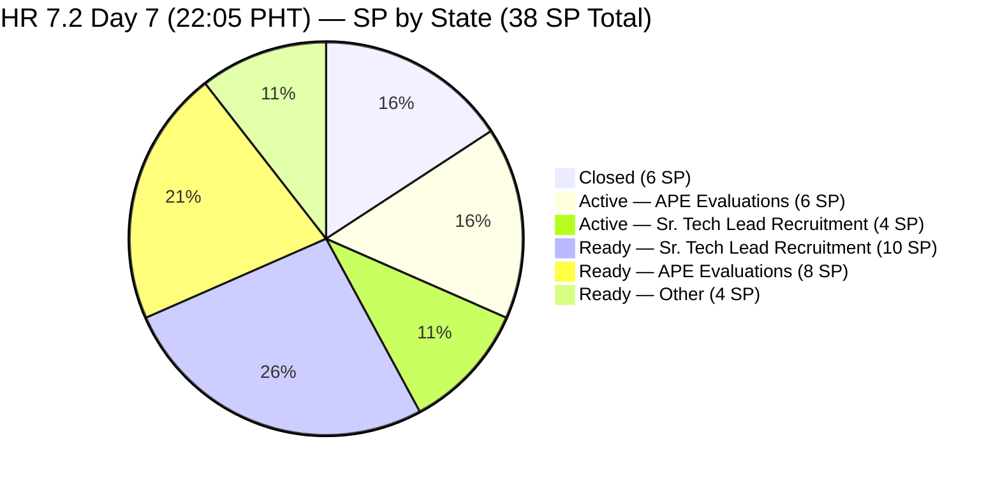
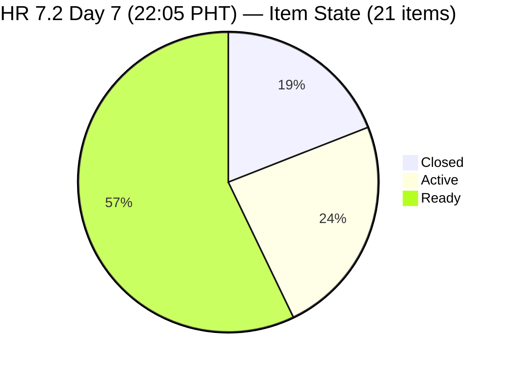
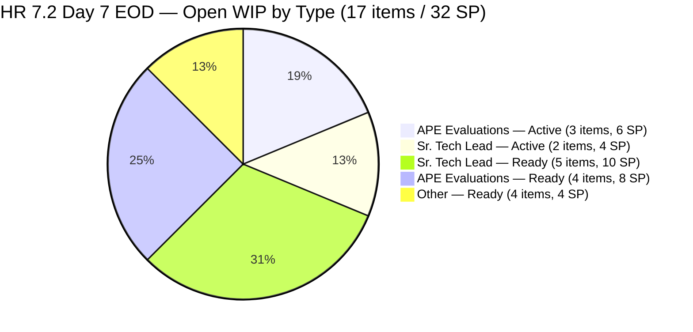
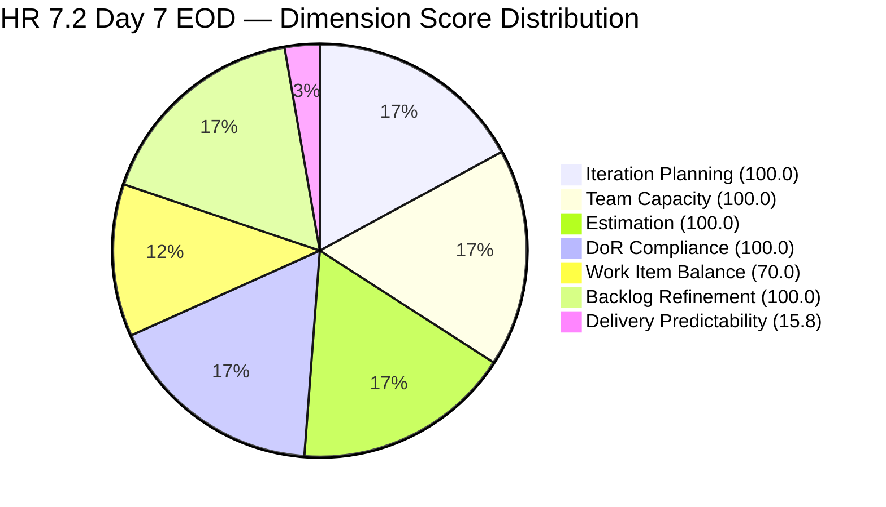

# ADO SAFe Iteration Audit — HR Recruitment Team

**Audit #41 | Iteration 7.2 (Apr 20 – May 3, 2026) | Day 7 of 14 (~50% elapsed — Sprint Midpoint)**

---

## 1. Audit Metadata

| Field | Value |
|---|---|
| **Audit Date** | April 26, 2026, 22:05 PHT |
| **Auditor** | Claude Code (ADO SAFe Audit Agent) |
| **Workspace** | `ado_hr` |
| **ADO Project** | Jairosoft FINOPS (`e0bb302f-40f9-46c3-8164-6f1acb317d63`) |
| **Team** | HR Recruitment Team (`248f59a6-372c-4b74-8129-9eaf260f211e`) |
| **Iteration** | Iteration 7.2 — Apr 20 to May 3, 2026 |
| **Iteration ID** | `a9888bc5-48df-40dd-bcc8-6926a11aa7c7` |
| **Sprint Day** | Day 7 of 14 (~50% elapsed — sprint midpoint) |
| **Prior Audit** | AUDIT_20260426_1400.md (Audit #40, 7.2 Day 7, 14:00 PHT, Overall 83.7 — Low Risk) |
| **Scoring Model** | ADO SAFe v1 (7-dimension rubric) |
| **Overall Score** | **83.7 / 100** |
| **Risk Band** | **Low Risk** (>= 80) |

---

## 2. Executive Summary

HR Recruitment Team holds at **83.7 (Low Risk)** on Day 7 of 14 — **no change from Audit #40 (same day, 14:00 PHT)**. The live ADO pull at 22:05 PHT confirms **zero state changes in the 8 hours since Audit #40**. All 17 visible backlog items have identical states and ChangedDates to the earlier audit.

**Now Day 7 (end of day), the sprint midpoint has passed with only 6 of 38 SP closed (15.8% DP).** Five items remain Active (stalled 3–5 days without closure); 12 items remain in Ready state. The team has not closed a single item since Apr 23 — now **3 full calendar days and 3 sprint days** without any delivery.

**Three critical body-accuracy defects persist for the 9th consecutive audit:**
- **#203057 (Ramos)** — body names "Reban Cliff Fajardo" instead of Rodelio Ramos
- **#203063 (Abina)** — body names "Shamyll Gelbolingo" instead of Angel Dorothy Abina
- **#202887 (Barua)** — body names "Rosales, Barua, Marlo" — copy-paste artifact

These items are moving up the priority queue. #203057 and #203063 are at **9th consecutive audit** without correction — an operational risk as interviews begin.

---

## 3. Previous Audit Delta

| Dimension | Audit #40 (Apr 26, 14:00 PHT) | Audit #41 (Apr 26, 22:05 PHT) | Delta |
|---|---|---|---|
| Iteration Planning | 100.0 | **100.0** | 0.0 |
| Team Capacity | 100.0 | **100.0** | 0.0 |
| Estimation | 100.0 | **100.0** | 0.0 |
| DoR Compliance | 100.0 | **100.0** | 0.0 |
| Work Item Balance | 70.0 | **70.0** | 0.0 |
| Backlog Refinement | 100.0 | **100.0** | 0.0 |
| Delivery Predictability | 15.8 | **15.8** | 0.0 |
| **Overall** | **83.7** | **83.7** | **0.0** |

### Changes Since Audit #40 (8h05m elapsed)

**No ADO changes detected.** All 17 visible backlog items show identical ChangedDates to Audit #40:

| Last Activity (Most Recent) | Item | Date |
|---|---|---|
| Latest touch (any item) | #203067 (APE Tayao) | Apr 23, 19:30 UTC |
| Second most recent | #202109, #202114 | Apr 22, 20:15 UTC |
| Third most recent | #202885, #202886, #202887 | Apr 22, 20:11–20:13 UTC |
| Oldest sprint item | #200671 | Apr 18, 06:57 UTC |

Zero closures since Apr 23. **Zero state changes in the entire audit day (14:00–22:05 PHT).**

---

## 4. Current Iteration Snapshot

| Metric | Value |
|---|---|
| **Iteration** | 7.2 — Apr 20 to May 3, 2026 |
| **Iteration Day** | Day 7 of 14 (sprint midpoint) |
| **Visible root backlog items** | 17 (4 closed items absent from backlog API view) |
| **Current iteration root items (7.2 total)** | 21 (17 open + 4 closed) |
| **Point-eligible items** | 21 (all User Story) |
| **Estimated items (SP > 0)** | 21 (all estimated) |
| **Committed Story Points** | **38 SP** |
| **Closed Story Points** | **6 SP** (#202017, #202022, #202039, #202042 — all closed Apr 21–23) |
| **Active Story Points** | **10 SP** (5 items × 2 SP each) |
| **Ready Story Points** | **22 SP** (12 items) |
| **Delivery Predictability** | **15.8%** (6 SP / 38 SP) |
| **Contributors with current work** | 1 (Almera Kleer Tayao) |
| **Contributors with capacity** | 1 (5h/day: 3h Documentation + 2h Requirements) |
| **Days off remaining** | 1 (May 1, Labor Day) |
| **Working days remaining** | 6 (Apr 27–30 + May 2–3) |
| **Required burn rate for 100% DP** | 5.3 SP/day (32 SP / 6 days) |

### Sprint Item Register — Iteration 7.2 (21 items)

| ID | Title | Type | State | SP | Last Changed | Notes |
|---|---|---|---|---|---|---|
| 202017 | Sr. Tech Lead — Mark Jovet Verano | US | **Closed** | 2 | Apr 21 | — |
| 202022 | Sr. Tech Lead — Stephen Pabatao | US | **Closed** | 2 | Apr 21 | — |
| 202039 | Sales & Mktg. — John Dave Fernandez | US | **Closed** | 1 | Apr 21 | — |
| 202042 | Sales & Mktg. — Edgardo Rojas Jr. | US | **Closed** | 1 | Apr 23 | Last closure — Day 4 |
| 202109 | APE — Calvin John Dalino | US | **Active** | 2 | Apr 22 | Active 5 days |
| 202114 | APE — Ryan Vince Castillo | US | **Active** | 2 | Apr 22 | Active 5 days |
| 202885 | Sr. Tech Lead — Buenaventura, Sidney | US | **Active** | 2 | Apr 22 | Active 5 days |
| 202886 | Sr. Tech Lead — Beltran, Ken Henson | US | **Active** | 2 | Apr 22 | Active 5 days |
| 203067 | APE — Tayao, Almera Kleer | US | **Active** | 2 | Apr 23 | Active 4 days — self-eval |
| 197939 | Communication Skills Proposals Presentation | US | Ready | 2 | Apr 20 | — |
| 200671 | LinkedIn Tech Sales from Manila Hiring | US | Ready | 1 | **Apr 18** | **UNTOUCHED — 9 days** |
| 201273 | LinkedIn Bubble Trainer Hiring — Interview | US | Ready | 2 | Apr 21 | — |
| 202093 | LinkedIn DevOps Engr. Hiring | US | Ready | 2 | Apr 20 | — |
| 202099 | Annual Medical Check-up — Cebu Employees PI7 | US | Ready | 1 | Apr 20 | — |
| 202104 | APE — Rommel Senillo — Summary PI7 | US | Ready | 2 | Apr 21 | — |
| 202349 | Finance Reporting & Export | US | Ready | 2 | Apr 20 | — |
| 202887 | Sr. Tech Lead — Barua, Marlo | US | Ready | 2 | Apr 22 | **Body defect: "Rosales, Barua" — 5th audit** |
| 202888 | APE — Caumban, Karl Jordan | US | Ready | 2 | Apr 21 | — |
| 203053 | Sr. Tech Lead — Reban Cliff Fajardo | US | Ready | 2 | Apr 21 | — |
| 203057 | Sr. Tech Lead — Rodelio Ramos | US | Ready | 2 | Apr 21 | **Body names Fajardo — 9th audit** |
| 203063 | Sales & Mktg. — Angel Dorothy Abina | US | Ready | 2 | Apr 21 | **Body names Gelbolingo — 9th audit** |

**Closed: 4 / 6 SP | Active: 5 / 10 SP | Ready: 12 / 22 SP**

---

## 5. Work Item Analysis





### Sprint Close Scenario Analysis (Day 7 EOD)

| Scenario | SP closed | SP/day needed | Days remaining | Achievable? |
|---|---|---|---|---|
| 100% DP (38 SP) | Need 32 more | 5.3/day | 6 | No — 3.4× PI7.1 historical rate |
| Close all 5 Active first (16 SP total) | Need 10 more | 1.7/day | 6 | Near PI7.1 rate — possible |
| Maintain Low Risk (DP ≥ 26.3% → score ≥ 80) | Need 10+ SP | 1.7/day | 6 | Achievable if Active items close |

**EOD Day 7 reality:** 3 calendar days without any closure. Active items (#202109, #202114, #202885, #202886, #203067) have now been Active for 4–5 days with no ADO updates. The window to recover sprint-close Low Risk DP is narrowing.

---

## 6. SAFe Compliance Scorecard

| Dimension | Score | Evidence | Notes |
|---|---|---|---|
| Iteration Planning | **100.0** | 17/17 visible root items in 7.2; 21/21 total including 4 closed | Unchanged — all items sprint-focused |
| Team Capacity | **100.0** | 1/1 contributors have capacity (Almera: 5h/day; 1 day off May 1) | Stable |
| Estimation | **100.0** | 17/17 open items SP > 0; 21/21 total estimated | All items estimated |
| DoR Compliance | **100.0** | 17/17 visible items pass Desc ≥30 nws + AC ≥20 nws | Body-accuracy defects persist outside rubric |
| Work Item Balance | **70.0** | 21/21 User Story = 100% → dominant >60% → -30 | Structural ceiling for HR |
| Backlog Refinement | **100.0** | fresh=17/17=100%; stale_90=0; stale_180=0; untouched=1/17=5.9% | #200671 below 10% threshold |
| Delivery Predictability | **15.8** | 6 SP closed / 38 SP committed — Day 7 | 3 days since last closure |
| **Overall** | **83.7** | (100.0+100.0+100.0+100.0+70.0+100.0+15.8) / 7 = 585.8 / 7 | **Low Risk** (≥ 80) |

### Score Computation

```
1. Iteration Planning
   visible_root_backlog_items           = 17
   current_iteration_root_items (7.2)   = 17  (all visible in 7.2)
   Score = round(17/17 × 100, 1)        = 100.0

2. Team Capacity
   contributors_with_current_work       = 1  (Almera)
   contributors_with_capacity           = 1
   Score = round(1/1 × 100, 1)          = 100.0

3. Estimation
   point_eligible_current_items         = 17  (all User Story)
   estimated (SP > 0)                   = 17
   Score = round(17/17 × 100, 1)        = 100.0

4. DoR Compliance
   current_iteration_root_items         = 17
   dor_compliant                        = 17  (all pass char threshold)
   Score = round(17/17 × 100, 1)        = 100.0

5. Work Item Balance
   User Story present = Yes             → no -40
   dominant_type_share = 17/17 = 100%   → >60% → -30
   spike_share = 0%                     → no -20
   Score = max(0, 100 - 30) = 70.0

6. Backlog Refinement
   fresh (≥ Mar 10, 2026)               = 17/17 = 100%    → base = 100.0
   stale_90 (< Jan 26, 2026)            = 0/17 = 0%       → no penalty
   stale_180 (< Oct 28, 2025)           = 0               → no penalty
   untouched_current (< Apr 20)         = 1/17 = 5.9%     → not >10% → 0
   Score = max(0, 100.0 - 0)            = 100.0

7. Delivery Predictability
   committed_story_points               = 38
   closed_story_points                  = 6
   Score = round(6/38 × 100, 1)         = 15.8

Overall = round((100.0+100.0+100.0+100.0+70.0+100.0+15.8)/7, 1)
        = round(585.8/7, 1) = round(83.686, 1) = 83.7  → Low Risk
```

---

## 7. Dimension Findings

### 7.1 Iteration Planning — 100.0 (Low Risk)

All 17 visible root backlog items are in Iteration 7.2. Including 4 closed items, the sprint scope is 21/21 — full focus. Score unchanged since Audit #34 (Day 2). No items have been added, removed, or re-pathed during the iteration.

### 7.2 Team Capacity — 100.0 (Low Risk)

Almera's capacity: 5h/day (3h Documentation + 2h Requirements). One day off: May 1 (Labor Day). Remaining capacity: 6 working days × 5h = 30 hours. Bus factor remains 1 — the most persistent structural risk in the HR audit series, now flagged across 41 consecutive audits.

### 7.3 Estimation — 100.0 (Low Risk)

All 17 visible open items have SP > 0. Sprint total (21 items) = 38 SP. No change from prior audits.

### 7.4 DoR Compliance — 100.0 (Low Risk — with body-accuracy flags)

All 17 visible items pass the rubric character-count threshold. Three persistent body-level accuracy defects:

| Item | Defect | Audit Count |
|---|---|---|
| **#203057 (Ramos)** | Body describes "Reban Cliff Fajardo" — wrong candidate | **9th consecutive — CRITICAL** |
| **#203063 (Abina)** | Body describes "Shamyll Gelbolingo" — wrong candidate | **9th consecutive — CRITICAL** |
| **#202887 (Barua)** | Body reads "Rosales, Barua, Marlo" — copy-paste artifact | **5th consecutive** |

**At 9 consecutive audits, #203057 and #203063 have now crossed a threshold where the audit system treats this as an active operational hazard.** Both items are in Ready state and are in the queue to become Active next. A recruiter opening either item will conduct an evaluation against the wrong candidate's profile.

### 7.5 Work Item Balance — 70.0 (Moderate — structural ceiling)

21/21 User Stories (100% dominant type) → -30 penalty applied. Score = 70.0. This is irreducible given the HR team's mandate. No Spikes, Defects, or Training items exist in the sprint.

### 7.6 Backlog Refinement — 100.0 (Low Risk)

| Gate | Value | Threshold | Penalty |
|---|---|---|---|
| fresh_visible (≥ Mar 10, 2026) | 17/17 = 100% | n/a | Base = 100.0 |
| stale_90 (< Jan 26, 2026) | 0/17 = 0% | >25% → -20 | 0 |
| stale_180 (< Oct 28, 2025) | 0 | ≥1 → -20 | 0 |
| untouched_current (< Apr 20) | 1/17 = 5.9% | >10% → -10 | 0 |
| **Total** | | | **100.0** |

**#200671 (LinkedIn Tech Sales Manila) — now 9 calendar days / 8 sprint days without ADO update (last change: Apr 18).** Ratio 5.9% remains below the 10% penalty threshold. One more sprint day without a touch on this item does not change the ratio if no items close. However, if any sprint item closes (reducing denominator to 16), ratio = 1/16 = 6.25% — still safe. If two items close (denominator 15): 1/15 = 6.7% — still safe. Not a BR risk this sprint but a persistent process concern.

### 7.7 Delivery Predictability — 15.8 (CRITICAL — Day 7 end-of-day)

**Zero closures since Apr 23 19:29 UTC (#202042, 1 SP) — now 79+ hours elapsed.** The last three full calendar days (Apr 24, 25, 26) produced zero closures. Five Active items remain stalled:

| ID | Title | Active Since | Days Active |
|---|---|---|---|
| 202109 | APE — Calvin John Dalino | Apr 22 | **5 days** |
| 202114 | APE — Ryan Vince Castillo | Apr 22 | **5 days** |
| 202885 | Sr. Tech Lead — Buenaventura, Sidney | Apr 22 | **5 days** |
| 202886 | Sr. Tech Lead — Beltran, Ken Henson | Apr 22 | **5 days** |
| 203067 | APE — Tayao, Almera Kleer | Apr 23 | **4 days** |

**The 15.8% DP at sprint midpoint — with 6 working days remaining and 32 SP needed — represents the primary sprint-close risk.** If no items close Apr 27 (tomorrow), DP at Day 8 = 15.8. Overall score would remain 83.7 only because 6 of 7 dimensions are at ceiling. Any score degradation in a second dimension would push the team below Low Risk threshold.

---

## 8. Risks and Bottlenecks



| # | Risk | Severity | Trend |
|---|---|---|---|
| R1 | **Zero closures for 79+ hours.** 5 Active items stalled 4–5 days at sprint midpoint. 32 SP remain open with 6 working days left. Requires 5.3 SP/day to close — 3.4× historical rate. | **CRITICAL** | Escalating |
| R2 | **#203057 body names Fajardo — 9th consecutive audit.** Item in Ready queue, next to go Active. Wrong candidate name will appear during interview process. | **CRITICAL** | 9 audits — operational hazard |
| R3 | **#203063 body names Gelbolingo — 9th consecutive audit.** Same issue as R2. | **CRITICAL** | 9 audits — operational hazard |
| R4 | **5 Active items stalled 4–5 days without ADO update.** APE evals and Sr. Tech Lead recruitment. No progress comments or state transitions. | **HIGH** | Escalating |
| R5 | **Bus factor = 1** (Almera handles all 21 items alone). | **HIGH** | Structural — 41 audits |
| R6 | **#200671 (LinkedIn Tech Sales Manila) — 9 days untouched.** Active in sprint 8 sprint days without a comment or state change. | **MEDIUM** | Escalating |
| R7 | **#202887 (Barua) body defect — 5th audit.** Body reads "Rosales, Barua, Marlo". | **MEDIUM** | Unresolved |
| R8 | **#203067 (APE Tayao self-eval) — supervisor path unclear.** 4 days Active, no supervisor designation visible in ADO. | **MEDIUM** | Active concern |
| R9 | **Work Item Balance -30 structural penalty (100% US).** | **LOW** | Structural |
| R10 | **No iteration goal defined for 7.2.** | **LOW** | Persistent — 41 audits |

---

## 9. Prioritized Recommendations

1. **[P0 — Apr 27 AM] Close at least one Active item to break the 79-hour silence.** Priority order: #202109 (APE Dalino) → #202114 (APE Castillo) → #202885 (Sr. Tech Lead Buenaventura) → #202886 (Sr. Tech Lead Beltran). APE closure requires: evaluation form completed, supervisor signature, HR finalization, discussion with employee. If any of these steps are complete for any item, close it now.

2. **[P0 — Apr 27 AM] Correct body defects in #203057 (Ramos) and #203063 (Abina).** Nine consecutive audits without correction. Both items are in the Ready activation queue.
   - #203057: Replace "Reban Cliff Fajardo" with "Rodelio Ramos" in the body description.
   - #203063: Replace "Shamyll Gelbolingo" with "Angel Dorothy Abina" in the body description.
   Each fix is under 2 minutes.

3. **[P0 — Apr 27–28] De-scope sprint to realistic target.** With 32 SP remaining and 6 working days, full delivery is unachievable. Recommend moving to 7.3: #203057 (fix body first), #197939 (Comm Skills presentation), #202349 (Finance Reporting), #201273 (LinkedIn Bubble Trainer). Revised commitment: ~30 SP. Realistic close target: 16–24 SP.

4. **[P1 — Apr 27] Resolve #200671 (LinkedIn Tech Sales Manila).** Add an ADO comment with current campaign status. 9 days of silence on a 1 SP item during an active sprint is unacceptable.

5. **[P1 — Apr 27] Designate a supervisor for #203067 (APE Tayao self-eval).** Add supervisor name to item description or as an ADO comment to document the evaluation pathway.

6. **[P2 — Apr 27] Correct body defect in #202887 (Barua).** Remove "Rosales," from description. Fifth consecutive audit.

7. **[P3] Define 7.2 iteration goal.** Suggested: "By May 3, finalize hiring decisions on ≥4 Sr. Tech Lead candidates, close ≥3 APE evaluations, and advance LinkedIn campaigns for DevOps Engr. and Bubble Trainer roles."

---

## 10. Evidence Gaps and Limitations

| Gap | Description |
|---|---|
| **4 closed items absent from backlog API** | #202017, #202022, #202039, #202042 confirmed Closed from prior audits. Committed SP = 38 validated from prior batch queries. |
| **Body-accuracy defects not rubric-penalized** | #203057, #203063, #202887 pass character-count threshold. Content accuracy is an operational quality risk, not a rubric metric. |
| **#200671 block reason** | 9 days without ADO activity. Cannot confirm block reason via API. |
| **#203067 supervisor path** | Whether a supervisor has been designated for Almera's self-APE is not visible via API. |
| **No iteration goal** | Persistent across all 41 HR audits. Not detectable via API. |
| **PI objectives linkage** | No PI objectives linked to any 7.2 item. |

---

## 11. Score Trend — HR PI7 Audit Series

| Audit | Date/Time | Day | Score | Band |
|---|---|---|---|---|
| #34 | Apr 21 | 7.2 D2 | 81.4 | Low |
| #35 | Apr 22 | 7.2 D3 | 83.4 | Low |
| #36 | Apr 23 AM | 7.2 D4 | 83.3 | Low |
| #37 | Apr 23 PM | 7.2 D4 | 83.3 | Low |
| #38 | Apr 24 AM | 7.2 D5 | 83.7 | Low |
| #39 | Apr 25 PM | 7.2 D6 | 83.7 | Low |
| #40 | Apr 26 14:00 | 7.2 D7 | 83.7 | Low |
| **#41** | **Apr 26 22:05** | **7.2 D7** | **83.7** | **Low** |



**Sprint-close DP projections:**
- If 5 Active items close (total SP = 16, DP = 42.1%): Overall = round((100+100+100+100+70+100+42.1)/7,1) = **87.4** — Low Risk.
- If additionally 4 Ready items close (total SP = 24, DP = 63.2%): Overall = round((100+100+100+100+70+100+63.2)/7,1) = **90.5** — Low Risk.
- If no further closures: DP = 15.8, Overall = 83.7 — Low Risk maintained by dimensional ceilings, but a poor delivery signal for PI7.

**Critical watch:** The score's Low Risk status is supported entirely by 6 of 7 dimensions at or near ceiling. DP at 15.8 is the single swing variable. A delivery stall through sprint close (which the current 79-hour gap suggests is possible) would leave the team at 83.7 — technically Low Risk but with the weakest DP of any completed sprint in the PI7 series.

---

*Report generated by Claude Code ADO SAFe Audit Agent | April 26, 2026 22:05 PHT*
*Audit #41 — HR Recruitment Team — Iteration 7.2 Day 7 — Overall: 83.7 / 100 — Low Risk (0.0 vs Audit #40)*
*Data source: Live ADO MCP pull — Apr 26, 2026 22:05 PHT | 17 visible backlog items; 21 total 7.2 items (17 open + 4 closed); 38 SP committed; 6 SP closed*
