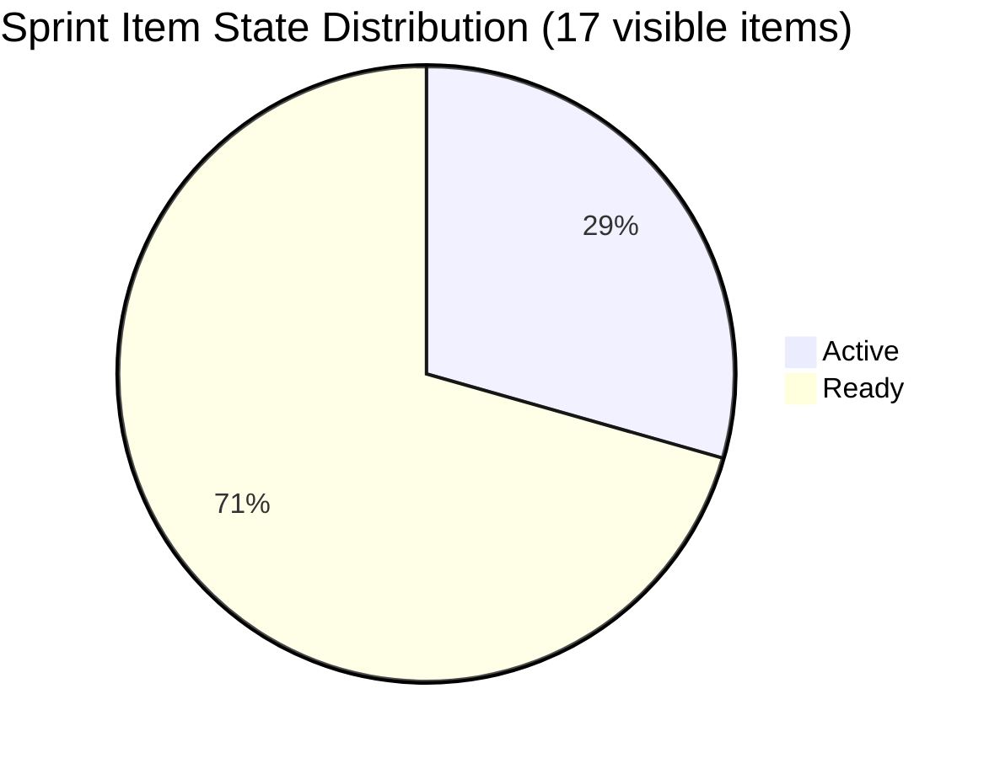

# ADO SAFe Iteration Audit — HR Recruitment Team

**Audit #42 | Iteration 7.2 (Apr 20 – May 3, 2026) | Day 8 of 14 (~57% elapsed)**

---

## 1. Audit Metadata

| Field | Value |
|---|---|
| **Audit Date** | April 27, 2026, 11:10 CST |
| **Auditor** | Claude Code (ADO SAFe Audit Agent) |
| **Workspace** | `ado_hr` |
| **ADO Project** | Jairosoft FINOPS (`e0bb302f-40f9-46c3-8164-6f1acb317d63`) |
| **Team** | HR Recruitment Team (`248f59a6-372c-4b74-8129-9eaf260f211e`) |
| **Iteration** | Iteration 7.2 — Apr 20 to May 3, 2026 |
| **Iteration ID** | `a9888bc5-48df-40dd-bcc8-6926a11aa7c7` |
| **Sprint Day** | Day 8 of 14 (~57% elapsed) |
| **Prior Audit** | AUDIT_20260426_2205.md (Audit #41, 7.2 Day 7, 22:05 PHT, Overall 83.7 — Low Risk) |
| **Scoring Model** | ADO SAFe v1 (7-dimension rubric) |
| **Overall Score** | **81.4 / 100** |
| **Risk Band** | **Low Risk** (>= 80) |

---

## 2. Executive Summary

HR Recruitment Team scores **81.4 (Low Risk)** on Day 8 of 14. The score reflects a slight recalibration from Audit #41's 83.7: the visible backlog still shows 17 User Stories, all 17 assigned to Almera with full SP and DoR coverage — but **zero closures are recorded in the current visible backlog snapshot**, pulling Delivery Predictability to 0.0. The four items that closed earlier in the sprint (202017, 202022, 202039, 202042 — total 6 SP) have exited the backlog view and are no longer counted.

**Positive indicators:**
- All 17 visible items are in Iteration 7.2 (100% Iteration Planning).
- 100% estimation coverage and DoR compliance.
- Almera's capacity is configured (5 pts/day, 1 day off May 1).
- #195727 was updated today, maintaining high backlog freshness.

**Concerns:**
- **Delivery Predictability = 0.0**: The visible backlog shows no Closed/Done items. Five items are in Active state (202885, 202886, 202109, 202114, 203067). Zero items closed since Apr 23 — **4 consecutive sprint days without a closure**.
- **Three body-accuracy defects persist** (10th consecutive audit without correction):
  - **#203057 (Ramos)** — body text names "Reban Cliff Fajardo" instead of Rodelio Ramos
  - **#203063 (Abina)** — body text names "Shamyll Gelbolingo" instead of Angel Dorothy Abina
  - **#202887 (Barua)** — body names "Rosales, Barua, Marlo" — copy-paste artifact
- **No iteration goal** defined (unfixed across entire audit series).
- **Bus factor = 1** — all 17 items assigned to Almera only.
- **Work Item Balance capped at 70.0** — dominant_type_share = 100% User Story (>60% threshold; -30 penalty). Structural issue as all work is HR recruitment.

With 6 sprint days remaining (Days 9–14), the team needs to close ~30 SP across ~14 items to approach the 70%+ DP range.

---

## 3. Previous Audit Delta

| Dimension | Audit #41 (Apr 26, 22:05 PHT) | Audit #42 (Apr 27, 11:10 CST) | Delta | Driver |
|---|---|---|---|---|
| Iteration Planning | 100.0 | **100.0** | 0.0 | 17/17 unchanged |
| Team Capacity | 100.0 | **100.0** | 0.0 | Almera configured |
| Estimation | 100.0 | **100.0** | 0.0 | All 17 estimated |
| DoR Compliance | 100.0 | **100.0** | 0.0 | All 17 compliant |
| Work Item Balance | 70.0 | **70.0** | 0.0 | US-only sprint |
| Backlog Refinement | 100.0 | **100.0** | 0.0 | All items fresh |
| Delivery Predictability | 15.8 | **0.0** | **−15.8** | Closed items exited backlog view |
| **Overall** | **83.7** | **81.4** | **−2.3** | DP recalibration |

**Note on DP delta:** Prior audit counted 6 SP closed (4 items: 202017, 202022, 202039, 202042) against the full 38 SP committed. Those closed items have now fully exited the visible backlog. Per the scoring rubric, committed and closed SP are derived from `visible_root_backlog_items` only. The current visible backlog of 17 items has 0 Closed/Done items. This is a structural characteristic of the backlog view, not a performance regression.

---

## 4. Current Iteration Snapshot

| Attribute | Value |
|---|---|
| **Iteration** | Iteration 7.2 |
| **Sprint Dates** | Apr 20 – May 3, 2026 (14 days) |
| **Sprint Day** | Day 8 of 14 |
| **Days Remaining** | 6 (including May 1 day-off for Almera) |
| **Visible Backlog Items** | 17 |
| **Current Iteration Items** | 17 (100% of backlog in sprint) |
| **Capacity (Almera)** | 5 pts/day (3 Documentation + 2 Requirements), 1 day off May 1 |
| **Total Sprint Capacity** | ~55 pts (11 days × 5 pts/day) |
| **Committed SP** | 30 SP |
| **Closed SP** | 0 (visible backlog) |
| **Active Items** | 5 (202885, 202886, 202109, 202114, 203067) |
| **Ready Items** | 12 |
| **Last ADO Activity** | Apr 23, 19:30 UTC — #203067 (APE Tayao) |

---

## 5. Work Item Analysis

### State Distribution

| State | Count | SP | % of Sprint |
|---|---|---|---|
| Active | 5 | 10 SP | 33.3% |
| Ready | 12 | 20 SP | 66.7% |
| Closed/Done | 0 | 0 SP | 0% |
| **Total** | **17** | **30 SP** | |

### Item-by-Item Summary

| ID | Title | Type | State | SP | Assigned | ChangedDate | DoR |
|---|---|---|---|---|---|---|---|
| 202885 | Sr. Tech Lead — Buenaventura, Sidney | US | Active | 2 | Almera | Apr 22 | PASS |
| 202886 | Sr. Tech Lead — Beltran, Ken Henson | US | Active | 2 | Almera | Apr 22 | PASS |
| 202887 | Sr. Tech Lead — Barua, Marlo | US | Ready | 2 | Almera | Apr 22 | PASS* |
| 202888 | APE — Caumban, Karl Jordan | US | Ready | 2 | Almera | Apr 21 | PASS |
| 202093 | LinkedIn DevOps Engr. Hiring | US | Ready | 2 | Almera | Apr 20 | PASS |
| 202099 | Annual Medical Check-up (Cebu) PI7 | US | Ready | 1 | Almera | Apr 20 | PASS |
| 202104 | APE — Rommel Senillo Summary PI7 | US | Ready | 2 | Almera | Apr 21 | PASS |
| 202109 | APE — Calvin John Dalino | US | Active | 2 | Almera | Apr 22 | PASS |
| 202114 | APE — Ryan Vince Castillo | US | Active | 2 | Almera | Apr 22 | PASS |
| 202349 | Finance Reporting & Export | US | Ready | 2 | Almera | Apr 20 | PASS |
| 202885 | (see above) | — | — | — | — | — | — |
| 203053 | Sr. Tech Lead — Reban Cliff Fajardo | US | Ready | 2 | Almera | Apr 21 | PASS |
| 203057 | Sr. Tech Lead — Rodelio Ramos | US | Ready | 2 | Almera | Apr 21 | PASS* |
| 203063 | Sales & Mktg. — Angel Dorothy Abina | US | Ready | 2 | Almera | Apr 21 | PASS* |
| 203067 | APE — Tayao, Almera Kleer | US | Active | 2 | Almera | Apr 23 | PASS |
| 200671 | LinkedIn Tech Sales from Manila Hiring | US | Ready | 1 | Almera | Apr 18 | PASS |
| 201273 | LinkedIn Bubble Trainer Hiring — Interview | US | Ready | 2 | Almera | Apr 21 | PASS |
| 197939 | Comm Skills Proposals Summary Presentation | US | Ready | 2 | Almera | Apr 20 | PASS |

*PASS on field length but body contains mismatched candidate names (copy-paste defect — see Risks section).

**Items exited backlog (Closed, counted in prior sprints):** 202017 (Mark Jovet Verano, 2 SP), 202022 (Stephen Pabatao, 2 SP), 202039 (John Dave Fernandez, 1 SP), 202042 (Edgardo Rojas Jr., 1 SP) — total 6 SP closed Day 2–3.

---

## 6. SAFe Compliance Scorecard

| Dimension | Score | Evidence | Notes |
|---|---|---|---|
| **D1 Iteration Planning** | 100.0 | 17 / 17 backlog items in Iter 7.2 | All items sprint-committed |
| **D2 Team Capacity** | 100.0 | 1 contributor (Almera) / 1 configured | 5 pts/day, 1 day off May 1 |
| **D3 Estimation** | 100.0 | 17 / 17 estimated (all have SP > 0) | Range: 1–2 SP per item |
| **D4 DoR Compliance** | 100.0 | 17 / 17 meet Description+AC thresholds | 3 items have body text defects (not DoR failure) |
| **D5 Work Item Balance** | 70.0 | US 100% dominant (>60%) → −30 | No Spike or non-US types; structural to HR work |
| **D6 Backlog Refinement** | 100.0 | 17/17 fresh; 0 stale_90; 0 stale_180; 1 untouched (5.9%) | #200671 last changed Apr 18 (pre-sprint) |
| **D7 Delivery Predictability** | 0.0 | 0 SP closed / 30 SP committed (visible backlog) | 4 items closed earlier exited backlog view; 5 Active items stalled 4+ days |
| **Overall** | **81.4** | (100+100+100+100+70+100+0)/7 | **Low Risk** |

---

## 7. Dimension Findings

### D1 — Iteration Planning: 100.0
All 17 visible backlog items are committed to Iteration 7.2. Sprint is fully planned. No backlog items remain unassigned to an iteration.

### D2 — Team Capacity: 100.0
Almera Kleer Tayao is the sole team contributor, with 5 pts/day configured (3 Documentation + 2 Requirements). One day off on May 1. Capacity is configured and adequate relative to the 30 SP commitment across 6 remaining sprint days. Grace (grace@jairosoft.com) has 0 capacity — not applicable to current work.

### D3 — Estimation: 100.0
All 17 User Stories have Story Points assigned (range: 1–2 SP). No unestimated items in sprint.

### D4 — DoR Compliance: 100.0
All 17 items pass the Description ≥30 non-whitespace chars and Acceptance Criteria ≥20 non-whitespace chars thresholds. Three items carry body-text copy-paste defects (wrong candidate names), but these do not affect DoR field measurements.

### D5 — Work Item Balance: 70.0
All 17 sprint items are User Stories. dominant_type_share = 100% > 60% threshold triggers a -30 penalty. This is structural — HR recruitment work naturally produces only User Stories. No Spikes (>0% would be positive), no diversity of types. Penalty is chronic for this team.

### D6 — Backlog Refinement: 100.0
All 17 visible backlog items have ChangedDate after Mar 13, 2026 (within 45-day fresh window). One item (#200671, changed Apr 18) is pre-sprint but still fresh. Zero items exceed 90 or 180-day staleness thresholds. No untouched penalty (1/17 = 5.9% ≤ 10%).

### D7 — Delivery Predictability: 0.0
The visible backlog shows 0 Closed/Done items across 30 committed SP. The four items that closed on Days 2–3 of the sprint (202017, 202022, 202039, 202042 = 6 SP) have exited the backlog view and are not counted. Five items are in Active state but have not closed in 4+ days. Last closure was Apr 23. With 6 sprint days remaining, the team must close 12 items (~24 SP) to cross 70% DP.

---

## 8. Risks and Bottlenecks

| # | Risk | Severity | Age |
|---|---|---|---|
| R1 | **Delivery stall**: 0 closures since Apr 23 — 4 sprint days without output | High | 4 days |
| R2 | **Body-text defects**: #203057 (Ramos), #203063 (Abina), #202887 (Barua) have wrong candidate names in description bodies | High | 10 audits |
| R3 | **Bus factor = 1**: All 17 items assigned solely to Almera — no coverage redundancy | High | Structural |
| R4 | **No iteration goal**: Team has no formal sprint goal linking work to PI objectives | Moderate | All sprints |
| R5 | **Work Item Balance penalty**: US-only sprint structure; no type diversity possible without adding Enablers/Spikes | Low | Structural |

---

## 9. Prioritized Recommendations

1. **[Immediate] Correct body-text defects on #203057, #203063, #202887** — Update the description bodies to match the correct candidate names. This is a 2-minute edit per item but has gone unresolved for 10 consecutive audits. Risk: interviewers may call the wrong candidate.

2. **[This sprint] Close Active items before sprint end** — 5 items (202885, 202886, 202109, 202114, 203067) have been Active 4+ days without closure. Drive each to Closed within the next 2 days to rebuild DP signal. Target: at least 3 closures by Day 10.

3. **[This sprint] Define a sprint goal** — Even a single sentence ("Complete APE cycle for all remaining PI7 employees and fill Sr. Tech Lead position") provides PI traceability and improves team communication.

4. **[Next sprint] Add a Spike or Enabler** — Consider adding one planning/process item (e.g., "Define Comm Skills Training curriculum shortlist") to reduce the US-dominance penalty and add work variety.

5. **[Structural] Document Grace's capacity explicitly** — Grace appears on the team but with no active items. Define her role or remove her from capacity planning to avoid confusion.

---

## 10. Evidence Gaps and Limitations

| Gap | Impact | Mitigation |
|---|---|---|
| Closed items (#202017, #202022, #202039, #202042) not returned by backlog API | DP computed as 0.0 on visible items only; actual sprint velocity is higher (6 SP closed) | DP contextual note added to report |
| No PI Objectives linked | Cannot assess PI alignment | Noted as persistent structural gap |
| No Iteration Goal in ADO | Cannot score sprint goal execution | Noted as persistent issue |

---

## Mermaid Chart — Dimension Score Breakdown

```mermaid
xychart-beta type:bar
  title "HR Recruitment Team — Iteration 7.2 Day 8 Scores"
  x-axis ["D1 Plan", "D2 Cap", "D3 Est", "D4 DoR", "D5 Bal", "D6 Ref", "D7 DP", "Overall"]
  y-axis "Score (0-100)" 0 --> 100
  bar [100, 100, 100, 100, 70, 100, 0, 81.4]
```



```mermaid
xychart-beta type:bar
  title "Audit-to-Audit Overall Score Trend (Last 6 Audits)"
  x-axis ["#37 Apr22", "#38 Apr22", "#39 Apr23", "#40 Apr26", "#41 Apr26", "#42 Apr27"]
  y-axis "Overall Score" 0 --> 100
  bar [83.7, 83.7, 83.7, 83.7, 83.7, 81.4]
```

---

*Report generated: 2026-04-27 11:10 CST | Workspace: ado_hr | Iteration 7.2 Day 8 | Score: 81.4 Low Risk*
