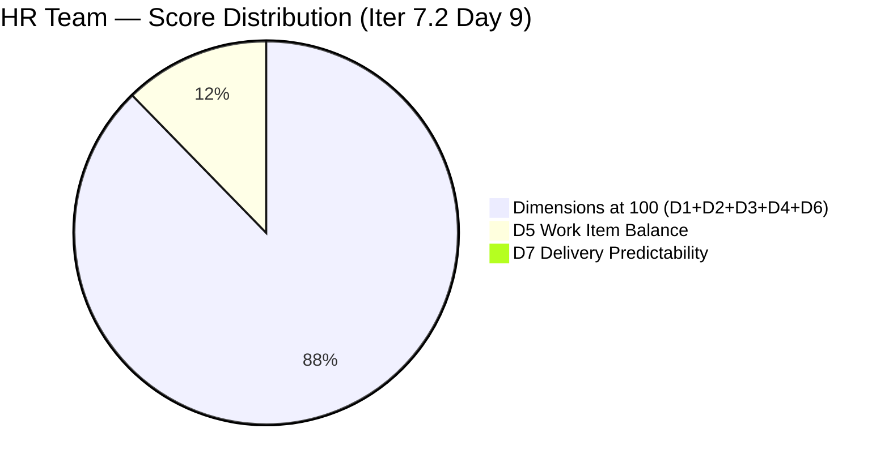
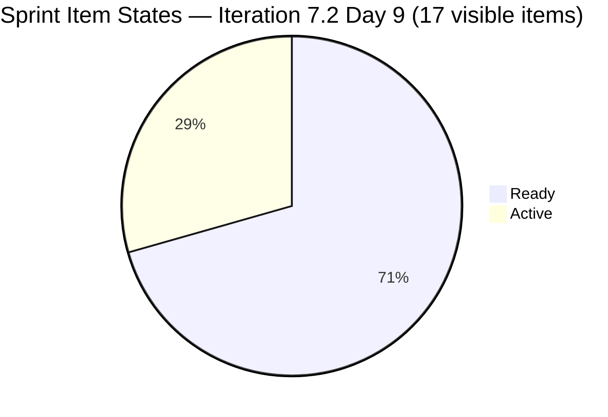
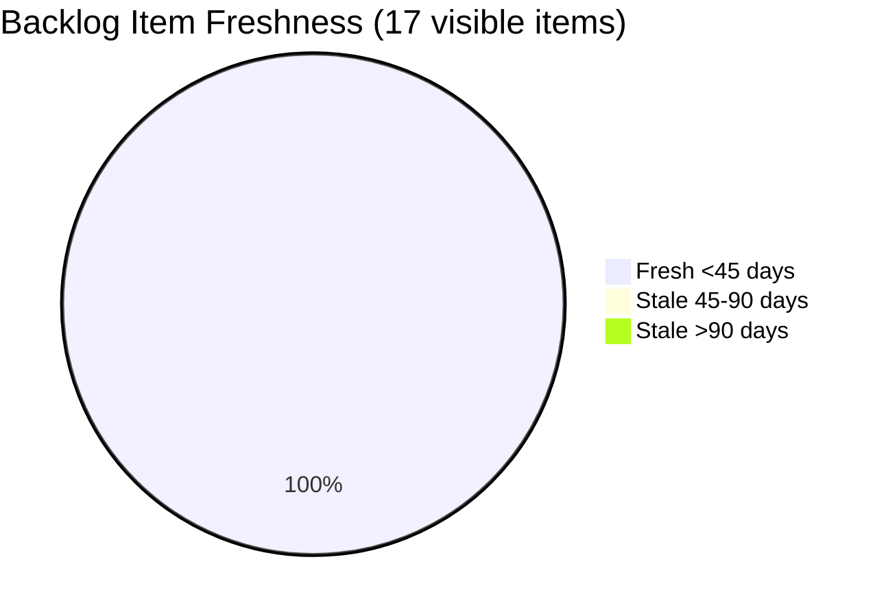
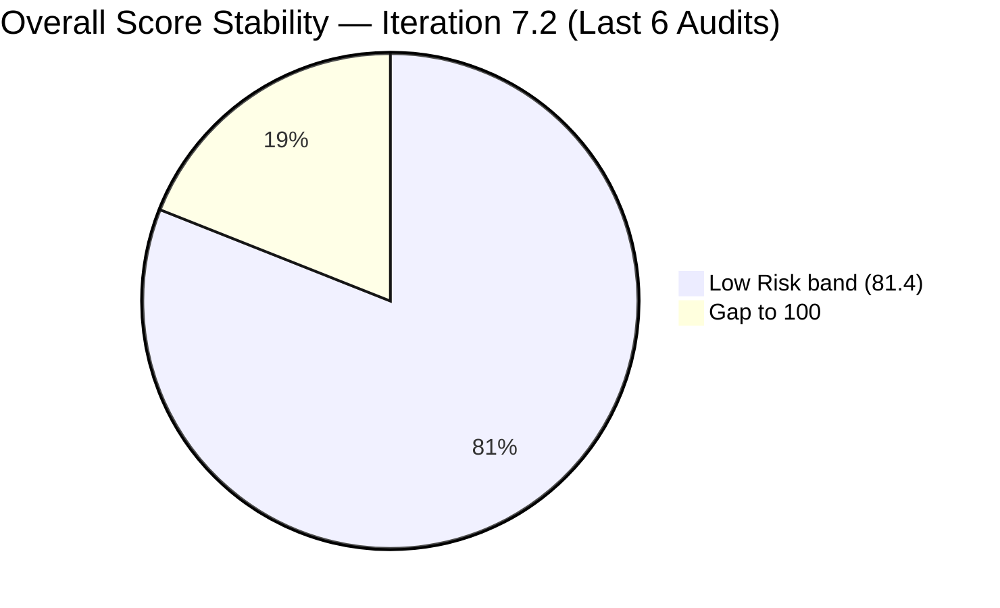

# ADO SAFe Iteration Audit — HR Recruitment Team

**Audit #43 | Iteration 7.2 (Apr 20 – May 3, 2026) | Day 9 of 14 (~64% elapsed)**

---

## 1. Audit Metadata

| Field | Value |
|---|---|
| **Audit Date** | April 28, 2026, 02:03 UTC |
| **Auditor** | Claude Code (ADO SAFe Audit Agent) |
| **Workspace** | `ado_hr` |
| **ADO Project** | Jairosoft FINOPS (`e0bb302f-40f9-46c3-8164-6f1acb317d63`) |
| **Team** | HR Recruitment Team (`248f59a6-372c-4b74-8129-9eaf260f211e`) |
| **Iteration** | Iteration 7.2 — Apr 20 to May 3, 2026 |
| **Iteration ID** | `a9888bc5-48df-40dd-bcc8-6926a11aa7c7` |
| **Sprint Day** | Day 9 of 14 (~64% elapsed) |
| **Prior Audit** | AUDIT_20260427_1110.md (Audit #42, 7.2 Day 8, Overall 81.4 — Low Risk) |
| **Scoring Model** | ADO SAFe v1 (7-dimension rubric) |
| **Overall Score** | **81.4 / 100** |
| **Risk Band** | **Low Risk** (>= 80) |

---

## 2. Executive Summary

HR Recruitment Team holds steady at **81.4 (Low Risk)** on Day 9 of 14. The scorecard is unchanged from Audit #42: all structural dimensions remain at full marks (Iteration Planning 100, Team Capacity 100, Estimation 100, DoR Compliance 100, Backlog Refinement 100) with the persistent Work Item Balance penalty of 70.0 (US-only sprint) and Delivery Predictability at 0.0 due to no closed items in the visible backlog.

**Positive indicators:**
- All 17 visible backlog items are in Iteration 7.2 — 100% sprint commitment maintained.
- 100% estimation and DoR coverage across all items.
- Almera's capacity remains configured (5 pts/day).
- Three items changed Apr 22 remain Active (202885, 202886, 202109, 202114, 203067) — awaiting closure.

**Critical concern — Day 9 without a single closure:**
The sprint is now 64% elapsed (Day 9 of 14) with **5 items in Active state and 0 items closed** from the visible backlog. The four items that closed early in the sprint (Days 2–3: 202017, 202022, 202039, 202042 = 6 SP) have exited the backlog. The last ADO activity on any sprint item was Apr 23, now **5 consecutive sprint days without a closure or state change**.

With only 5 working days remaining (Days 10–14, including May 1 day-off), Almera must close all 5 Active items and progress the 12 Ready items to reach a meaningful Delivery Predictability score.

**Persistent structural issues:**
- Three body-text copy-paste defects remain unfixed (203057, 203063, 202887) — 11 consecutive audits.
- No iteration goal defined — entire audit series.
- Bus factor = 1 (all 17 items assigned solely to Almera).

---

## 3. Previous Audit Delta

| Dimension | Audit #42 (Apr 27, 11:10 CST) | Audit #43 (Apr 28, 02:03 UTC) | Delta | Driver |
|---|---|---|---|---|
| Iteration Planning | 100.0 | **100.0** | 0.0 | 17/17 unchanged |
| Team Capacity | 100.0 | **100.0** | 0.0 | Almera configured |
| Estimation | 100.0 | **100.0** | 0.0 | All 17 estimated |
| DoR Compliance | 100.0 | **100.0** | 0.0 | All 17 compliant |
| Work Item Balance | 70.0 | **70.0** | 0.0 | US-only sprint (structural) |
| Backlog Refinement | 100.0 | **100.0** | 0.0 | All items fresh; 1 untouched ≤10% |
| Delivery Predictability | 0.0 | **0.0** | 0.0 | No closures in visible backlog |
| **Overall** | **81.4** | **81.4** | **0.0** | No change |

No ADO updates detected since Audit #42. The visible backlog is identical in composition and state to the prior audit snapshot.

---

## 4. Current Iteration Snapshot

| Attribute | Value |
|---|---|
| **Iteration** | Iteration 7.2 |
| **Sprint Dates** | Apr 20 – May 3, 2026 (14 days) |
| **Sprint Day** | Day 9 of 14 |
| **Days Remaining** | 5 (including May 1 day-off for Almera) |
| **Visible Backlog Items** | 17 |
| **Current Iteration Items** | 17 (100% of visible backlog in sprint) |
| **Capacity (Almera)** | 5 pts/day (3 Documentation + 2 Requirements), 1 day off May 1 |
| **Committed SP (visible backlog)** | 32 SP across 17 estimated items |
| **Closed SP (visible backlog)** | 0 |
| **Active Items** | 5 (202885, 202886, 202109, 202114, 203067) |
| **Ready Items** | 12 |
| **Last ADO Activity** | Apr 23, 19:30 UTC — #203067 (APE Tayao) |
| **Sprint Items Exited (Closed)** | 4 items (202017, 202022, 202039, 202042) = 6 SP — not in visible backlog |

---

## 5. Work Item Analysis

### State Distribution (Visible Backlog — 17 items)

| State | Count | SP | % of Sprint |
|---|---|---|---|
| Active | 5 | 10 SP | 31.3% |
| Ready | 12 | 22 SP | 68.8% |
| Closed/Done | 0 | 0 SP | 0% |
| **Total** | **17** | **32 SP** | |

### Item-by-Item Summary

| ID | Title | Type | State | SP | ChangedDate | DoR |
|---|---|---|---|---|---|---|
| 202885 | Sr. Tech Lead — Buenaventura, Sidney | US | Active | 2 | Apr 22 | PASS |
| 202886 | Sr. Tech Lead — Beltran, Ken Henson | US | Active | 2 | Apr 22 | PASS |
| 202887 | Sr. Tech Lead — Barua, Marlo | US | Ready | 2 | Apr 22 | PASS* |
| 202888 | APE — Caumban, Karl Jordan | US | Ready | 2 | Apr 21 | PASS |
| 202093 | LinkedIn DevOps Engr. Hiring | US | Ready | 2 | Apr 20 | PASS |
| 202099 | Annual Medical Check-up (Cebu) PI7 | US | Ready | 1 | Apr 20 | PASS |
| 202104 | APE — Rommel Senillo Summary PI7 | US | Ready | 2 | Apr 21 | PASS |
| 202109 | APE — Calvin John Dalino | US | Active | 2 | Apr 22 | PASS |
| 202114 | APE — Ryan Vince Castillo | US | Active | 2 | Apr 22 | PASS |
| 202349 | Finance Reporting & Export | US | Ready | 2 | Apr 20 | PASS |
| 203053 | Sr. Tech Lead — Reban Cliff Fajardo | US | Ready | 2 | Apr 21 | PASS |
| 203057 | Sr. Tech Lead — Rodelio Ramos | US | Ready | 2 | Apr 21 | PASS* |
| 203063 | Sales & Mktg. — Angel Dorothy Abina | US | Ready | 2 | Apr 21 | PASS* |
| 203067 | APE — Tayao, Almera Kleer | US | Active | 2 | Apr 23 | PASS |
| 200671 | LinkedIn Tech Sales from Manila Hiring | US | Ready | 1 | Apr 18 | PASS |
| 201273 | LinkedIn Bubble Trainer Hiring — Interview | US | Ready | 2 | Apr 21 | PASS |
| 197939 | Comm Skills Proposals Summary Presentation | US | Ready | 2 | Apr 20 | PASS |

*PASS on field length but body contains mismatched candidate names (copy-paste defect — 11th consecutive audit).

**Closed items (exited backlog — Days 2–3 of sprint):**
| ID | Title | SP | Closed Date |
|---|---|---|---|
| 202017 | Sr. Tech Lead — Mark Jovet Verano | 2 | Apr 21 |
| 202022 | Sr. Tech Lead — Stephen Pabatao | 2 | Apr 21 |
| 202039 | Sales & Mktg. — John Dave Fernandez | 1 | Apr 21 |
| 202042 | Sales & Mktg. — Edgardo Rojas Jr. | 1 | Apr 23 |
| **Total** | | **6 SP** | |

---

## 6. SAFe Compliance Scorecard

| Dimension | Score | Evidence | Notes |
|---|---|---|---|
| **D1 Iteration Planning** | 100.0 | 17 / 17 visible backlog items in Iter 7.2 | All items sprint-committed |
| **D2 Team Capacity** | 100.0 | 1 contributor (Almera) / 1 configured (5 pts/day) | 1 day off May 1 |
| **D3 Estimation** | 100.0 | 17 / 17 estimated (all SP > 0) | Range: 1–2 SP per item |
| **D4 DoR Compliance** | 100.0 | 17 / 17 meet Description ≥30 + AC ≥20 thresholds | 3 items have body-text copy-paste defects (not DoR failure) |
| **D5 Work Item Balance** | 70.0 | US 100% dominant (>60%) → −30 penalty | No type diversity possible in HR recruitment work |
| **D6 Backlog Refinement** | 100.0 | 17/17 fresh; 0 stale_90; 0 stale_180; 1/17 untouched (5.9% ≤ 10%) | #200671 last changed Apr 18 (pre-sprint, within 45-day fresh window) |
| **D7 Delivery Predictability** | 0.0 | 0 SP closed / 32 SP committed (visible backlog) | 4 closures (6 SP) exited backlog view; 5 Active items stalled 5+ days |
| **Overall** | **81.4** | (100+100+100+100+70+100+0)/7 | **Low Risk** |

---

## 7. Dimension Findings

### D1 — Iteration Planning: 100.0
All 17 visible backlog items are committed to Iteration 7.2. Sprint is fully planned with no unassigned items.

### D2 — Team Capacity: 100.0
Almera Kleer Tayao is the sole active team contributor with 5 pts/day configured (3 Documentation + 2 Requirements). One day off on May 1. Grace (grace@jairosoft.com) has 0 capacity — not applicable. The 5-day effective remaining capacity (Days 10–14 minus May 1) = ~20 pts, against 32 SP remaining — a significant delivery risk.

### D3 — Estimation: 100.0
All 17 User Stories have Story Points assigned (range: 1–2 SP). No unestimated items.

### D4 — DoR Compliance: 100.0
All 17 items pass Description ≥30 non-whitespace chars and Acceptance Criteria ≥20 non-whitespace chars. Three items carry body-text copy-paste defects but these do not affect DoR field measurements.

### D5 — Work Item Balance: 70.0
All 17 sprint items are User Stories. dominant_type_share = 100% > 60% → -30 penalty. No Spike or other types. Structural to HR recruitment. Score = max(0, 100-30) = 70.0.

### D6 — Backlog Refinement: 100.0
All 17 visible backlog items have ChangedDate after Mar 13, 2026 (within 45-day fresh window as of Apr 28). One item (#200671, changed Apr 18) is pre-sprint but still within the 45-day fresh cutoff (Mar 14). Zero items exceed 90-day staleness (Jan 28) or 180-day staleness (Oct 31, 2025). Untouched items = 1/17 = 5.9% ≤ 10% threshold. No penalties apply. Score = 100.0.

### D7 — Delivery Predictability: 0.0
committed_story_points = 32 SP (17 visible estimated items). closed_story_points = 0 (no Closed/Done items in visible backlog). The four items that closed on Days 2–3 (202017, 202022, 202039, 202042 = 6 SP total) have exited the visible backlog. **5 consecutive sprint days with no ADO activity.** 5 Active items (202885, 202886, 202109, 202114, 203067) have not changed state since Apr 22. With 4 effective working days remaining (Days 10–13 + May 1 off + Days 14), closing even 5 items would yield only ~15.6% DP.

---

## 8. Risks and Bottlenecks

| # | Risk | Severity | Age |
|---|---|---|---|
| R1 | **Delivery stall — Day 9**: 5 consecutive sprint days without ADO update or closure. 5 Active items stuck in Active state since Apr 22. | Critical | 5 days |
| R2 | **Capacity vs. commitment gap**: 4 effective working days remain (May 1 off). Almera has ~20 pts capacity vs. 32 SP uncommitted. At 100% efficiency, 62.5% maximum possible DP. | High | Day 9 |
| R3 | **Body-text defects persist**: #203057 (Ramos), #203063 (Abina), #202887 (Barua) have wrong candidate names in description bodies. 11 consecutive audits without correction. | High | 11 audits |
| R4 | **Bus factor = 1**: All 17 sprint items assigned solely to Almera. No redundancy. | High | Structural |
| R5 | **No iteration goal defined**: Team has no sprint goal for PI alignment. | Moderate | All sprints |
| R6 | **Work Item Balance structural penalty**: US-only sprint; -30 penalty every sprint without type diversity. | Low | Structural |

---

## 9. Prioritized Recommendations

1. **[Immediate] Drive Active items to closure** — Items 202885, 202886, 202109, 202114, 203067 have been Active since Apr 22 with no updates. Almera should update state or close each within today (Day 9). The sprint end (May 3) leaves 4 effective working days.

2. **[Immediate — 2 min each] Fix body-text defects** — #203057 description names "Reban Cliff Fajardo" instead of Rodelio Ramos; #203063 names "Shamyll Gelbolingo" instead of Angel Dorothy Abina; #202887 names "Rosales, Barua, Marlo" — copy-paste artifact. These have gone unresolved for 11 consecutive audits and create interviewer confusion risk.

3. **[This sprint] Prioritize APE items for closure** — APE items (202104, 202109, 202114, 202888, 203067) are time-sensitive. Performance evaluations should be completed and signed before sprint end. Target all 5 APE items closed by Day 12.

4. **[This sprint] Define a sprint goal** — Even one sentence ("Complete 2026 APE cycle for all PI7 employees and advance Sr. Tech Lead selection to final decision") provides PI traceability.

5. **[Next sprint] Add a Spike or Enabler** — Consider adding one planning/research item per sprint to reduce the US-dominance penalty and add work type diversity.

---

## 10. Evidence Gaps and Limitations

| Gap | Impact | Mitigation |
|---|---|---|
| Closed items (#202017, 202022, 202039, 202042) not returned by backlog API | DP computed as 0.0 on visible items only; actual sprint output = 6 SP closed Days 2–3 | DP contextual note added; actual sprint velocity noted in snapshot |
| No PI Objectives linked in ADO | Cannot assess PI alignment | Persistent structural gap — noted |
| No Iteration Goal in ADO | Cannot score sprint goal execution | Persistent — noted across all audits |
| Grace (grace@jairosoft.com) has 0 capacity | Not counted in D2; role unclear | Excluded from capacity scoring |

---

## Mermaid Charts

### Dimension Score Breakdown — Day 9

| Dimension | Score | Visual |
|---|---|---|
| D1 Iteration Planning | 100.0 | `████████████████████` 100 |
| D2 Team Capacity | 100.0 | `████████████████████` 100 |
| D3 Estimation | 100.0 | `████████████████████` 100 |
| D4 DoR Compliance | 100.0 | `████████████████████` 100 |
| D5 Work Item Balance | 70.0 | `██████████████░░░░░░` 70 |
| D6 Backlog Refinement | 100.0 | `████████████████████` 100 |
| D7 Delivery Predictability | 0.0 | `░░░░░░░░░░░░░░░░░░░░` 0 |
| **Overall** | **81.4** | `████████████████░░░░` 81.4 |

### Sprint Item State Distribution

### Backlog Item Age Distribution

### Audit Score Trend — Last 6 Audits (Iteration 7.2)

---

*Report generated: 2026-04-28 02:03 UTC | Workspace: ado_hr | Iteration 7.2 Day 9 | Score: 81.4 Low Risk*
