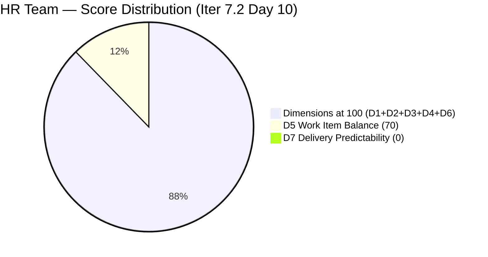
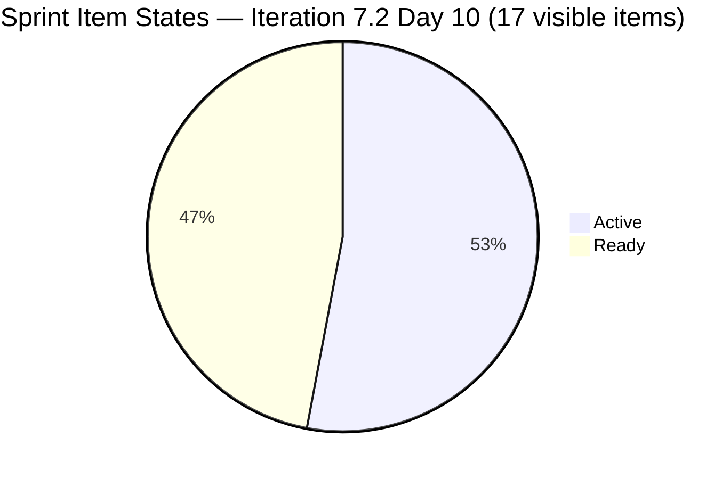
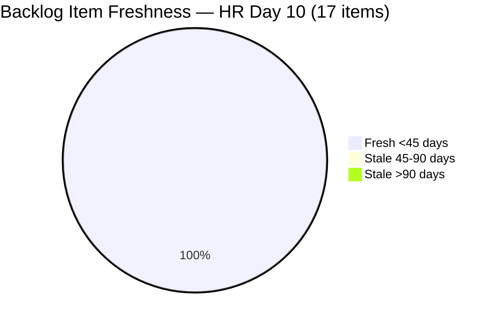
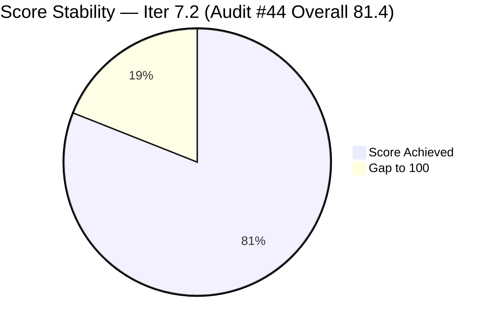

# ADO SAFe Iteration Audit — HR Recruitment Team

**Audit #44 | Iteration 7.2 (Apr 20 – May 3, 2026) | Day 10 of 14 (~71% elapsed)**

---

## 1. Audit Metadata

| Field | Value |
|---|---|
| **Audit Date** | April 29, 2026, 02:04 UTC |
| **Auditor** | Claude Code (ADO SAFe Audit Agent) |
| **Workspace** | `ado_hr` |
| **ADO Project** | Jairosoft FINOPS (`e0bb302f-40f9-46c3-8164-6f1acb317d63`) |
| **Team** | HR Recruitment Team (`248f59a6-372c-4b74-8129-9eaf260f211e`) |
| **Iteration** | Iteration 7.2 — Apr 20 to May 3, 2026 |
| **Iteration ID** | `a9888bc5-48df-40dd-bcc8-6926a11aa7c7` |
| **Sprint Day** | Day 10 of 14 (~71% elapsed) |
| **Prior Audit** | AUDIT_20260428_0203.md (Audit #43, 7.2 Day 9, Overall 81.4 — Low Risk) |
| **Scoring Model** | ADO SAFe v1 (7-dimension rubric) |
| **Overall Score** | **81.4 / 100** |
| **Risk Band** | **Low Risk** (>= 80) |

---

## 2. Executive Summary

HR Recruitment Team holds steady at **81.4 (Low Risk)** on Day 10 of 14. The scorecard is unchanged from Audit #43 across all 7 dimensions. However, **two meaningful quality improvements** were recorded since the prior audit:

- **Body-text copy-paste defects partially resolved:** #203053 title updated to "Gapuz, John Emmanuel" and description corrected (was "Reban Cliff Fajardo"). #203057 title updated to "Monotilla, Solomon" and description corrected (was "Rodelio Ramos"). These two of three persistent defects are now fixed — 11-audit-series defect count drops from 3 to 1 remaining (#202887).
- **ADO activity resumed:** #202888 (APE - Caumban, Karl Jordan) and #200671 (LinkedIn Tech Sales) moved to Active on Apr 28; #202885 (Sr. Tech Lead - Buenaventura, Sidney) touched Apr 29 with a comment added.

**Critical concern — Day 10 with 0 closures:**
The sprint is 71% elapsed (Day 10 of 14) with **0 closed items** in the visible backlog. The four items closed earlier (Days 2–3) have exited the backlog. With 4 effective working days remaining (May 1 off for Almera), Almera must close 17 items to achieve meaningful Delivery Predictability. The 9 Active items (up from 5 yesterday) indicate increased engagement but no completed work yet.

**Structural issues (persistent):**
- One body-text copy-paste defect remains: #202887 (Barua, Marlo) description names "Rosales, Barua, Marlo" — still copy-paste artifact.
- No iteration goal defined — entire audit series.
- Bus factor = 1 (all 17 items assigned solely to Almera).

---

## 3. Previous Audit Delta

| Dimension | Audit #43 (Apr 28, 02:03 UTC) | Audit #44 (Apr 29, 02:04 UTC) | Delta | Driver |
|---|---|---|---|---|
| Iteration Planning | 100.0 | **100.0** | 0.0 | 17/17 unchanged |
| Team Capacity | 100.0 | **100.0** | 0.0 | Almera configured |
| Estimation | 100.0 | **100.0** | 0.0 | All 17 estimated |
| DoR Compliance | 100.0 | **100.0** | 0.0 | All 17 compliant |
| Work Item Balance | 70.0 | **70.0** | 0.0 | US-only sprint (structural) |
| Backlog Refinement | 100.0 | **100.0** | 0.0 | All 17 fresh; 0 untouched |
| Delivery Predictability | 0.0 | **0.0** | 0.0 | No closures in visible backlog |
| **Overall** | **81.4** | **81.4** | **0.0** | No formula change |

**Quality improvements (not formula-scored but notable):**
- #203053 and #203057 body-text defects FIXED (candidate name copy-paste errors corrected on Apr 28)
- Active item count increased from 5 → 9 (more items in motion)
- 1 remaining body-text defect: #202887

---

## 4. Current Iteration Snapshot

| Attribute | Value |
|---|---|
| **Iteration** | Iteration 7.2 |
| **Sprint Dates** | Apr 20 – May 3, 2026 (14 days) |
| **Sprint Day** | Day 10 of 14 |
| **Days Remaining** | 4 (May 1 = day off for Almera; effective working days = 3) |
| **Visible Backlog Items** | 17 |
| **Current Iteration Items** | 17 (100% of visible backlog in sprint) |
| **Capacity (Almera)** | 5 pts/day (3 Documentation + 2 Requirements), day off May 1 |
| **Committed SP (visible backlog)** | 32 SP across 17 estimated items |
| **Closed SP (visible backlog)** | 0 |
| **Active Items** | 9 (202885, 202886, 202888, 202109, 202114, 203053, 203057, 203067, 200671) |
| **Ready Items** | 8 (202887, 202093, 202099, 202104, 202349, 201273, 197939, 203063) |
| **Sprint Items Exited (Closed)** | 4 items (202017, 202022, 202039, 202042) = 6 SP — not in visible backlog |
| **Last ADO Activity** | Apr 29, 03:18 UTC — #202885 (comment added, Sr. Tech Lead Buenaventura) |

---

## 5. Work Item Analysis

### State Distribution (Visible Backlog — 17 items)

| State | Count | SP | % of Sprint |
|---|---|---|---|
| Active | 9 | 17 SP | 53.1% |
| Ready | 8 | 15 SP | 46.9% |
| Closed/Done | 0 | 0 SP | 0% |
| **Total** | **17** | **32 SP** | |

### Item-by-Item Summary

| ID | Title | Type | State | SP | ChangedDate | DoR |
|---|---|---|---|---|---|---|
| 202885 | Sr. Tech Lead — Buenaventura, Sidney | US | Active | 2 | Apr 29 | PASS |
| 202886 | Sr. Tech Lead — Beltran, Ken Henson | US | Active | 2 | Apr 22 | PASS |
| 202887 | Sr. Tech Lead — Barua, Marlo | US | Ready | 2 | Apr 22 | PASS* |
| 202888 | APE — Caumban, Karl Jordan | US | Active | 2 | Apr 28 | PASS |
| 202093 | LinkedIn DevOps Engr. Hiring | US | Ready | 2 | Apr 20 | PASS |
| 202099 | Annual Medical Check-up (Cebu) PI7 | US | Ready | 1 | Apr 20 | PASS |
| 202104 | APE — Rommel Senillo Summary PI7 | US | Ready | 2 | Apr 21 | PASS |
| 202109 | APE — Calvin John Dalino | US | Active | 2 | Apr 22 | PASS |
| 202114 | APE — Ryan Vince Castillo | US | Active | 2 | Apr 22 | PASS |
| 202349 | Finance Reporting & Export | US | Ready | 2 | Apr 20 | PASS |
| 203053 | Sr. Tech Lead — Gapuz, John Emmanuel | US | Active | 2 | Apr 28 | PASS ✅ |
| 203057 | Sr. Tech Lead — Monotilla, Solomon | US | Active | 2 | Apr 28 | PASS ✅ |
| 203063 | Sales & Mktg. — Angel Dorothy Abina | US | Ready | 2 | Apr 21 | PASS* |
| 203067 | APE — Tayao, Almera Kleer | US | Active | 2 | Apr 23 | PASS |
| 200671 | LinkedIn Tech Sales from Manila Hiring | US | Active | 1 | Apr 28 | PASS |
| 201273 | LinkedIn Bubble Trainer Hiring — Interview | US | Ready | 2 | Apr 21 | PASS |
| 197939 | Communication Skills Proposals Summary Presentation | US | Ready | 2 | Apr 20 | PASS |

*PASS on field length; #202887 body text still names "Rosales, Barua, Marlo" (copy-paste artifact — 1 remaining). #203063 description body names "Shamyll Gelbolingo" instead of Angel Dorothy Abina — still unfixed.

**Defect fix note:** #203053 and #203057 descriptions corrected on Apr 28 (11-audit defect resolved for 2 of 3 items).

**Closed items (exited backlog — Days 2–3):**

| ID | Title | SP | Closed Date |
|---|---|---|---|
| 202017 | Sr. Tech Lead — Mark Jovet Verano | 2 | Apr 21 |
| 202022 | Sr. Tech Lead — Stephen Pabatao | 2 | Apr 21 |
| 202039 | Sales & Mktg. — John Dave Fernandez | 1 | Apr 21 |
| 202042 | Sales & Mktg. — Edgardo Rojas Jr. | 1 | Apr 23 |
| **Total** | | **6 SP** | |

---

## 6. SAFe Compliance Scorecard

| Dimension | Score | Evidence | Notes |
|---|---|---|---|
| **D1 Iteration Planning** | 100.0 | 17 / 17 visible backlog items in Iter 7.2 | All items sprint-committed |
| **D2 Team Capacity** | 100.0 | 1 contributor (Almera) / 1 configured (5 pts/day) | Day off May 1; ~15 pts remaining capacity |
| **D3 Estimation** | 100.0 | 17 / 17 estimated (SP > 0) | Range: 1–2 SP per item |
| **D4 DoR Compliance** | 100.0 | 17 / 17 meet Description ≥30 + AC ≥20 thresholds | 2 items still have body-text copy-paste defects (not DoR failure) |
| **D5 Work Item Balance** | 70.0 | US 100% dominant > 60% → −30 penalty | Structural to HR recruitment domain |
| **D6 Backlog Refinement** | 100.0 | 17/17 fresh (all changed Apr 20+); 0 stale_90; 0 stale_180; 0 untouched | No penalties triggered |
| **D7 Delivery Predictability** | 0.0 | 0 SP closed / 32 SP committed (visible backlog) | 4 early-sprint closures (6 SP) exited backlog; Day 10 stall |
| **Overall** | **81.4** | (100+100+100+100+70+100+0)/7 | **Low Risk** |

---

## 7. Dimension Findings

### D1 — Iteration Planning: 100.0
All 17 visible backlog items are committed to Iteration 7.2. Sprint is fully planned.

### D2 — Team Capacity: 100.0
Almera Kleer Tayao is the sole active contributor with 5 pts/day (3 Documentation + 2 Requirements). Day off May 1. Effective remaining capacity: ~15 pts (3 working days × 5 pts). Against 32 SP remaining in visible backlog, this creates a delivery deficit — maximum DP from visible backlog is ~46.9% even at full efficiency. The 6 SP already closed (exited backlog) provides buffer context.

### D3 — Estimation: 100.0
All 17 User Stories have Story Points assigned (range: 1–2 SP). No unestimated items.

### D4 — DoR Compliance: 100.0
All 17 items pass Description ≥30 non-whitespace and AC ≥20 non-whitespace thresholds. Two items carry residual copy-paste body-text defects (#202887, #203063) that do not affect DoR field measurements.

### D5 — Work Item Balance: 70.0
All 17 sprint items are User Stories. dominant_type_share = 100% > 60% → −30 penalty. Score = max(0, 100−30) = 70.0. Structural to HR recruitment work.

### D6 — Backlog Refinement: 100.0
All 17 items changed after Apr 20, 2026 (within 45-day fresh window). Zero items exceed stale_90 (Jan 29) or stale_180 (Oct 31, 2025) thresholds. Zero untouched items (no ChangedDate before sprint start Apr 20). No penalties. Score = 100.0.

### D7 — Delivery Predictability: 0.0
committed_story_points = 32 SP. closed_story_points = 0 (no Closed/Done items in visible backlog). Formula: 0/32 = 0.0. The 4 items closed on Days 2–3 (6 SP total) have exited the visible backlog and cannot be scored. With 3 effective working days remaining, maximum theoretical DP from visible backlog ≈ 46.9% (15 pts capacity / 32 SP). Active item count increased to 9 on Day 10, indicating resumed momentum.

---

## 8. Risks and Bottlenecks

| # | Risk | Severity | Age |
|---|---|---|---|
| R1 | **Day 10 with 0 visible closures**: Sprint is 71% elapsed; 32 SP remain open in visible backlog. Even at maximum efficiency, DP will not reach 50% from the visible backlog. | Critical | 10 days |
| R2 | **Capacity vs. commitment gap**: ~15 pts remaining (3 working days); 32 SP committed. Completion of all items is mathematically impossible before sprint end. | High | Structural |
| R3 | **2 body-text defects persist**: #202887 (Barua, Marlo — "Rosales, Barua, Marlo" in description) and #203063 (Abina — "Shamyll Gelbolingo" in description). Risk of interviewer confusion. | Moderate | 12 audits for #203063; partial fix achieved |
| R4 | **Bus factor = 1**: All 17 sprint items assigned to Almera. No redundancy or delegation. | High | Structural |
| R5 | **No iteration goal**: No sprint goal defined for the entire PI7 series. | Moderate | All sprints |
| R6 | **Work Item Balance structural penalty**: US-only sprint; persistent −30 every sprint. | Low | Structural |

---

## 9. Prioritized Recommendations

1. **[Immediate] Drive APE items to closure today** — Items 202888, 202109, 202114, 202104, 203067 (5 APE stories) are time-sensitive. Performance evaluations should be completed and documented before end of Day 10. Closing 5 × 2 SP = 10 SP would raise DP from 0 to 31.3%.

2. **[Today] Complete Sr. Tech Lead hiring decisions** — Items 202885, 202886, 203053, 203057 (8 SP combined) are all Active. Given Almera touched 202885 today (Apr 29), drive each to a hiring decision and close.

3. **[2 min] Fix remaining body-text defect — #202887** — Description names "Rosales, Barua, Marlo" but the candidate is "Barua, Marlo." Quick edit to correct description. #203063 description names "Shamyll Gelbolingo" instead of Angel Dorothy Abina — also quick fix.

4. **[This sprint] Define a sprint goal** — Even one sentence provides PI traceability and iteration focus.

5. **[Next sprint] Add a Spike or Enabler** — One planning or research item per sprint reduces the US-dominance penalty (−30) and adds type diversity.

---

## 10. Evidence Gaps and Limitations

| Gap | Impact | Mitigation |
|---|---|---|
| Closed items (#202017, 202022, 202039, 202042) not returned by backlog API | DP computed as 0.0 from visible items; actual sprint output = 6 SP (Days 2–3) | DP contextual note added; actual sprint velocity documented |
| No PI Objectives linked in ADO | Cannot assess PI alignment | Persistent structural gap |
| No Iteration Goal in ADO | Cannot score sprint goal execution | Persistent — noted |
| Grace (grace@jairosoft.com) not in capacity data | Not counted in D2 | Excluded; role/allocation unclear |

---

## Mermaid Charts

### Dimension Score Breakdown — Day 10

### Sprint Item State Distribution

### Backlog Item Freshness

### Audit Score Trend — Iteration 7.2

---

*Report generated: 2026-04-29 02:04 UTC | Workspace: ado_hr | Iteration 7.2 Day 10 | Score: 81.4 Low Risk*
