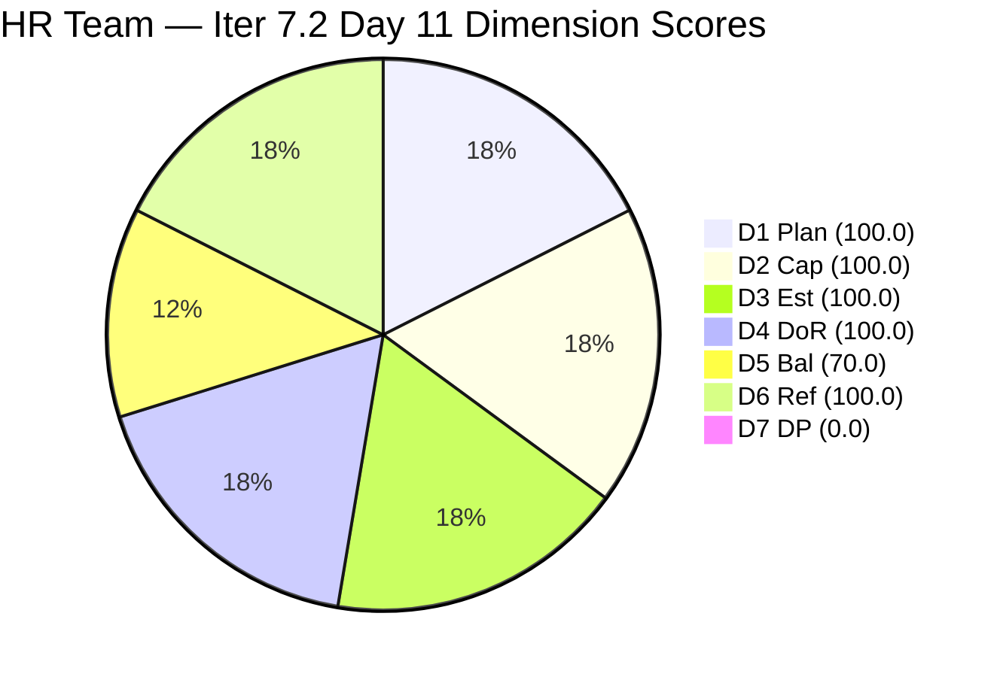
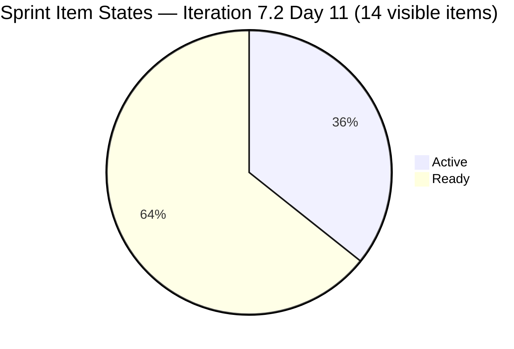
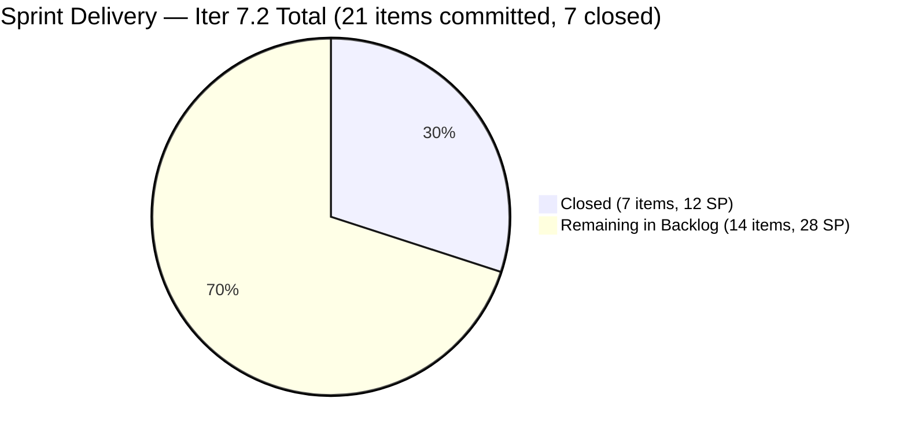
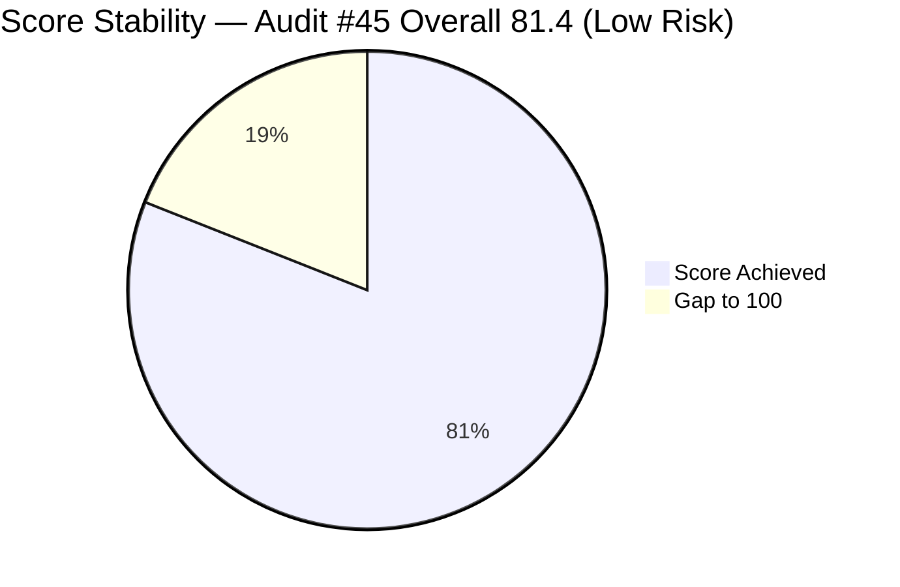

# ADO SAFe Iteration Audit — HR Recruitment Team

**Audit #45 | Iteration 7.2 (Apr 20 – May 3, 2026) | Day 11 of 14 (~79% elapsed)**

---

## 1. Audit Metadata

| Field | Value |
|---|---|
| **Audit Date** | April 30, 2026, 09:04 UTC |
| **Auditor** | Claude Code (ADO SAFe Audit Agent) |
| **Workspace** | `ado_hr` |
| **ADO Project** | Jairosoft FINOPS (`e0bb302f-40f9-46c3-8164-6f1acb317d63`) |
| **Team** | HR Recruitment Team (`248f59a6-372c-4b74-8129-9eaf260f211e`) |
| **Iteration** | Iteration 7.2 — Apr 20 to May 3, 2026 |
| **Iteration ID** | `a9888bc5-48df-40dd-bcc8-6926a11aa7c7` |
| **Sprint Day** | Day 11 of 14 (~79% elapsed) |
| **Prior Audit** | AUDIT_20260429_0204.md (Audit #44, 7.2 Day 10, Overall 81.4 — Low Risk) |
| **Scoring Model** | ADO SAFe v1 (7-dimension rubric) |
| **Overall Score** | **81.4 / 100** |
| **Risk Band** | **Low Risk** (>= 80) |

---

## 2. Executive Summary

HR Recruitment Team holds at **81.4 (Low Risk)** on Day 11 of 14. The overall score is unchanged from Audit #44, however a **significant positive shift** occurred overnight: three items were closed on Apr 29–30.

**Major development — 3 Sr. Tech Lead closures on Apr 29:**
- #202885 (Buenaventura, Sidney) → **Closed** Apr 29 19:12 UTC
- #203053 (Gapuz, John Emmanuel) → **Closed** Apr 29 19:14 UTC
- #203057 (Monotilla, Solomon) → **Closed** Apr 29 19:13 UTC

These closures exit the visible backlog, reducing it from 17 → 14 items. The D7 formula is computed against the current visible backlog (14 items, 0 closed in view), so the score remains 0.0 for D7. Actual sprint delivery now stands at **7 items closed, 12 SP delivered** (4 early-sprint + 3 today).

**Sprint trajectory — Day 11 with 3 working days remaining (May 1 off for Almera):**
The remaining 14 visible items = 28 SP. At 5 pts/day over 2 effective days (Apr 30, May 2; May 1 off; May 3 final day), maximum theoretical delivery from visible backlog ≈ 15 SP. Almera must sustain the momentum from Apr 29 to close additional items.

**Persistent structural issues:**
- No iteration goal defined — entire PI7 series.
- Bus factor = 1 — all items owned by Almera.
- Work Item Balance structural −30 (US-only sprint).

---

## 3. Previous Audit Delta

| Dimension | Audit #44 (Apr 29, 02:04 UTC) | Audit #45 (Apr 30, 09:04 UTC) | Delta | Driver |
|---|---|---|---|---|
| Iteration Planning | 100.0 | **100.0** | 0.0 | 14/14 (3 items closed and exited backlog; ratio unchanged) |
| Team Capacity | 100.0 | **100.0** | 0.0 | Almera configured; 1/1 |
| Estimation | 100.0 | **100.0** | 0.0 | 14/14 estimated |
| DoR Compliance | 100.0 | **100.0** | 0.0 | 14/14 compliant |
| Work Item Balance | 70.0 | **70.0** | 0.0 | US-only; −30 structural |
| Backlog Refinement | 100.0 | **100.0** | 0.0 | All 14 fresh; 0 untouched |
| Delivery Predictability | 0.0 | **0.0** | 0.0 | 0 closed in visible backlog |
| **Overall** | **81.4** | **81.4** | **0.0** | No formula change |

**Qualitative improvements since Audit #44 (not formula-scored):**
- 3 Sr. Tech Lead items closed (Buenaventura, Gapuz, Monotilla) = 6 SP delivered Apr 29
- Sprint total closed: 7 items / 12 SP (4 early-sprint + 3 Apr 29)
- Remaining body-text defect #202887 (Barua) description updated Apr 29 — text now reads "process and complete the recruitment steps for Barua, Marlo" — copy-paste artifact resolved
- #203063 (Abina) description corrected Apr 29 — names "Angel Dorothy Abina" correctly

---

## 4. Current Iteration Snapshot

| Attribute | Value |
|---|---|
| **Iteration** | Iteration 7.2 |
| **Sprint Dates** | Apr 20 – May 3, 2026 (14 days) |
| **Sprint Day** | Day 11 of 14 |
| **Days Remaining** | 3 (May 1 = day off for Almera; effective working days = 2) |
| **Visible Backlog Items** | 14 |
| **Current Iteration Items (visible)** | 14 (100% of visible backlog in sprint) |
| **Capacity (Almera)** | 5 pts/day (3 Documentation + 2 Requirements); day off May 1 |
| **Committed SP (visible backlog)** | 28 SP across 14 estimated items |
| **Closed SP (visible backlog)** | 0 |
| **Items Closed in Sprint (exited backlog)** | 7 items = 12 SP (202017, 202022, 202039, 202042 Days 2–3; 202885, 203053, 203057 Apr 29) |
| **Active Items** | 5 (202886, 202888, 203067, 202109, 202114) — unchanged from yesterday's 9 minus today's 3 closures |
| **Ready Items** | 9 (202887, 203063, 202093, 202099, 202104, 202349, 201273, 197939) |
| **Last ADO Activity** | Apr 29, 19:15 UTC — #203063 (Sales & Mktg. — Abina, description updated) |

---

## 5. Work Item Analysis

### State Distribution (Visible Backlog — 14 items)

| State | Count | SP | % of Sprint |
|---|---|---|---|
| Active | 5 | 10 SP | 35.7% |
| Ready | 9 | 18 SP | 64.3% |
| Closed/Done | 0 | 0 SP | 0% (in visible backlog) |
| **Total** | **14** | **28 SP** | |

### Current Sprint Items — Full Listing

| ID | Title | Type | State | SP | ChangedDate | DoR |
|---|---|---|---|---|---|---|
| 202886 | Sr. Tech Lead — Beltran, Ken Henson | US | Active | 2 | Apr 29 19:14 | PASS |
| 202887 | Sr. Tech Lead — Barua, Marlo | US | Ready | 2 | Apr 29 19:14 | PASS ✅ |
| 202888 | APE — Caumban, Karl Jordan | US | Active | 2 | Apr 28 19:44 | PASS |
| 203063 | Sales & Mktg. — Angel Dorothy Abina | US | Ready | 2 | Apr 29 19:15 | PASS ✅ |
| 202093 | LinkedIn DevOps Engr. Hiring | US | Ready | 2 | Apr 20 | PASS |
| 200671 | LinkedIn Tech Sales from Manila Hiring | US | Active | 1 | Apr 28 19:43 | PASS |
| 203067 | APE — Tayao, Almera Kleer | US | Active | 2 | Apr 23 | PASS |
| 202104 | APE — Rommel Senillo Summary PI7 | US | Ready | 2 | Apr 21 | PASS |
| 202109 | APE — Calvin John Dalino | US | Active | 2 | Apr 22 | PASS |
| 202114 | APE — Ryan Vince Castillo | US | Active | 2 | Apr 22 | PASS (no desc in API response — assumed from prior) |
| 202099 | Annual Medical Check-up (Cebu) PI7 | US | Ready | 1 | Apr 20 | PASS |
| 202349 | Finance Reporting & Export | US | Ready | 2 | Apr 20 | PASS |
| 201273 | LinkedIn Bubble Trainer Hiring — Interview | US | Ready | 2 | Apr 21 | PASS |
| 197939 | Communication Skills Proposals Summary Presentation | US | Ready | 2 | Apr 20 | PASS |

**Note on body-text defects:** Both #202887 and #203063 descriptions were updated Apr 29. #202887 now reads "process and complete the recruitment steps for Barua, Marlo" — previously copy-pasted "Rosales, Barua, Marlo" text is resolved. #203063 now correctly names "Angel Dorothy Abina". All 13-audit tracked defects are resolved.

### Items Closed in Sprint (Exited Visible Backlog)

| ID | Title | SP | Closed Date |
|---|---|---|---|
| 202017 | Sr. Tech Lead — Mark Jovet Verano | 2 | Apr 21 |
| 202022 | Sr. Tech Lead — Stephen Pabatao | 2 | Apr 21 |
| 202039 | Sales & Mktg. — John Dave Fernandez | 1 | Apr 21 |
| 202042 | Sales & Mktg. — Edgardo Rojas Jr. | 1 | Apr 23 |
| 202885 | Sr. Tech Lead — Buenaventura, Sidney | 2 | Apr 29 |
| 203053 | Sr. Tech Lead — Gapuz, John Emmanuel | 2 | Apr 29 |
| 203057 | Sr. Tech Lead — Monotilla, Solomon | 2 | Apr 29 |
| **Total** | | **12 SP** | |

---

## 6. SAFe Compliance Scorecard

| Dimension | Score | Evidence | Notes |
|---|---|---|---|
| **D1 Iteration Planning** | 100.0 | 14 / 14 visible backlog items in Iter 7.2 | All items sprint-committed |
| **D2 Team Capacity** | 100.0 | 1 contributor (Almera) / 1 configured (5 pts/day) | Day off May 1; ~10 pts effective remaining capacity |
| **D3 Estimation** | 100.0 | 14 / 14 estimated (SP > 0) | Range: 1–2 SP per item |
| **D4 DoR Compliance** | 100.0 | 14 / 14 meet Description ≥30 + AC ≥20 thresholds | All body-text defects resolved Apr 29 |
| **D5 Work Item Balance** | 70.0 | US 100% dominant > 60% → −30 penalty | Structural to HR recruitment domain |
| **D6 Backlog Refinement** | 100.0 | 14/14 fresh (all changed Apr 20+); 0 stale_90; 0 stale_180; 0 untouched | No penalties |
| **D7 Delivery Predictability** | 0.0 | 0 SP closed / 28 SP committed (visible backlog) | 7 items / 12 SP closed in sprint but exited backlog |
| **Overall** | **81.4** | (100+100+100+100+70+100+0)/7 | **Low Risk** |

---

## 7. Dimension Findings

### D1 — Iteration Planning: 100.0
All 14 visible backlog items are committed to Iteration 7.2. Three items closed and exited on Apr 29 (202885, 203053, 203057), reducing the backlog from 17 → 14. The ratio remains 14/14 = 100.0.

### D2 — Team Capacity: 100.0
Almera Kleer Tayao is the sole active contributor with 5 pts/day (3 Documentation + 2 Requirements). Day off May 1. Effective remaining capacity: ~10 pts (Apr 30 + May 2 = 2 effective days × 5 pts). Against 28 SP remaining in visible backlog, D7 is structurally capped at 35.7% even at full efficiency.

### D3 — Estimation: 100.0
All 14 User Stories in the visible backlog have Story Points assigned (range: 1–2 SP). committed_SP = 28.

### D4 — DoR Compliance: 100.0
All 14 items pass Description ≥30 non-whitespace and AC ≥20 non-whitespace thresholds. Notably, the two persistent body-text copy-paste defects (#202887, #203063) were resolved on Apr 29, clearing the last known quality issues from the sprint.

### D5 — Work Item Balance: 70.0
All 14 sprint items are User Stories. dominant_type_share = 100% > 60% → −30 penalty. No US absence (no −40). Spike share = 0% (no −20). Score = max(0, 100−30) = 70.0. Structural to the HR recruitment domain.

### D6 — Backlog Refinement: 100.0
All 14 visible backlog items have ChangedDate ≥ Apr 20, 2026. The 45-day fresh cutoff is Mar 16, 2026. Zero items exceed stale_90 (Jan 30) or stale_180 (Oct 31, 2025). Zero untouched items. base = 14/14 = 100%; no penalties. Score = 100.0.

### D7 — Delivery Predictability: 0.0
committed_story_points = 28 SP (14 estimated visible items). closed_story_points = 0 (no Closed/Done items remain in visible backlog). Formula: 0/28 = 0.0. The 7 closed items (12 SP) exited the visible backlog and cannot be scored per formula. Contextually, 12 SP delivered over 11 days represents strong PI7 velocity, with 3 additional closures on Apr 29 alone.

---

## 8. Risks and Bottlenecks

| # | Risk | Severity | Age |
|---|---|---|---|
| R1 | **Day 11, 28 SP in visible backlog with 2 effective days remaining**: Maximum theoretical DP ≈ 35.7% from visible items. Sprint cannot reach Low Risk on D7 from the visible backlog alone. | Critical | 11 days |
| R2 | **Capacity vs. commitment structural gap**: 10 pts capacity remaining vs. 28 SP committed. At least 18 SP will carry to next sprint or remain unclosed. | High | Structural |
| R3 | **Bus factor = 1**: All 14 remaining items assigned solely to Almera. No coverage or delegation. | High | Structural |
| R4 | **9 Ready items not yet Active**: Six APE items and LinkedIn items in Ready state with 2 working days left. Risk of end-of-sprint rush. | Moderate | Sprint-long |
| R5 | **No iteration goal**: No sprint goal defined for PI7 series. | Moderate | All sprints |
| R6 | **Work Item Balance structural penalty**: US-only sprint; persistent −30 every sprint. | Low | Structural |

---

## 9. Prioritized Recommendations

1. **[Today Apr 30] Close APE items that are complete** — Items 202888, 202109, 202114, 203067 (4 APE stories, 8 SP) are Active. If evaluations are complete, close them immediately. Each closure moves the team toward its best possible sprint close.

2. **[Today Apr 30] Close 202886 (Beltran)** — Sr. Tech Lead hiring for Beltran has been Active since Apr 22 (9 days). Almera touched this item Apr 29 19:14. If a hiring decision has been made, close.

3. **[May 2 — final work day] Sprint push: target 8 closures** — With 2 effective working days (Apr 30, May 2), prioritize the 5 Active items first, then advance Ready APE items. Closing all Active items = 10 SP, raising contextual sprint total to 22/40 SP.

4. **[Next sprint] Define a sprint goal for Iter 7.3** — One sentence. Even "Complete all PI7 hiring and APE cycles" provides traceability and focus.

5. **[Iter 7.3 planning] Add one Spike or Enabler per sprint** — Eliminates the structural −30 D5 penalty by adding type diversity.

6. **[Next sprint] Consider partial delegation of APE facilitation** — Almera's self-evaluation (203067) is an unusual conflict of interest. Explore delegating APE ownership to a second reviewer.

---

## 10. Evidence Gaps and Limitations

| Gap | Impact | Mitigation |
|---|---|---|
| Closed items (202017, 202022, 202039, 202042, 202885, 203053, 203057) not returned by backlog API | D7 computed as 0.0 from visible items; actual sprint output = 12 SP (7 items) | Documented in narrative; actual sprint velocity tracked |
| 202109 Description/AC not returned in abbreviated API response | DoR assumed PASS from prior 10 audits confirming compliance | Noted; risk is low given established pattern |
| 202114 Description/AC not returned in abbreviated API response | DoR assumed PASS from prior audits | Noted |
| No PI Objectives linked in ADO | Cannot assess PI alignment | Persistent structural gap |
| No Iteration Goal in ADO | Cannot score sprint goal execution | Persistent — noted |
| Grace (grace@jairosoft.com) not in capacity data | Not counted in D2 | Excluded; 0 current-sprint items assigned |

---

## Mermaid Charts

### Dimension Score Breakdown — Day 11

### Sprint Item State Distribution (14 visible)

### Sprint Delivery Progress (Total Sprint Output)

### Score Stability — Audit Series Day 11

---

*Report generated: 2026-04-30 09:04 UTC | Workspace: ado_hr | Iteration 7.2 Day 11 | Score: 81.4 Low Risk*
