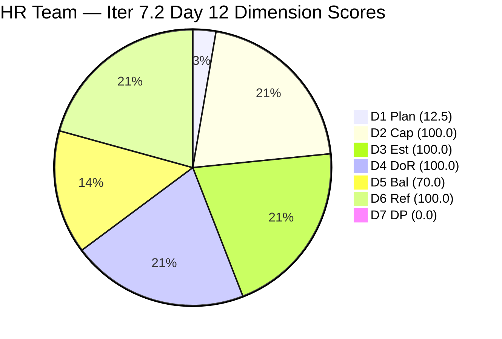
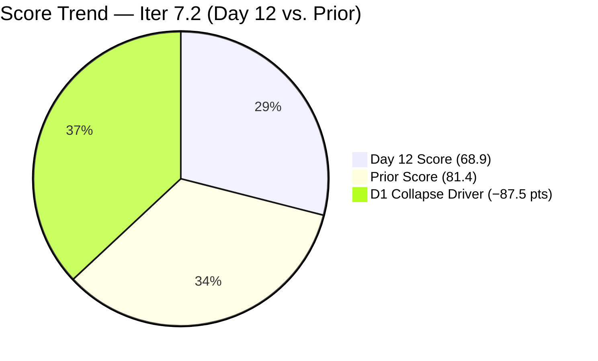
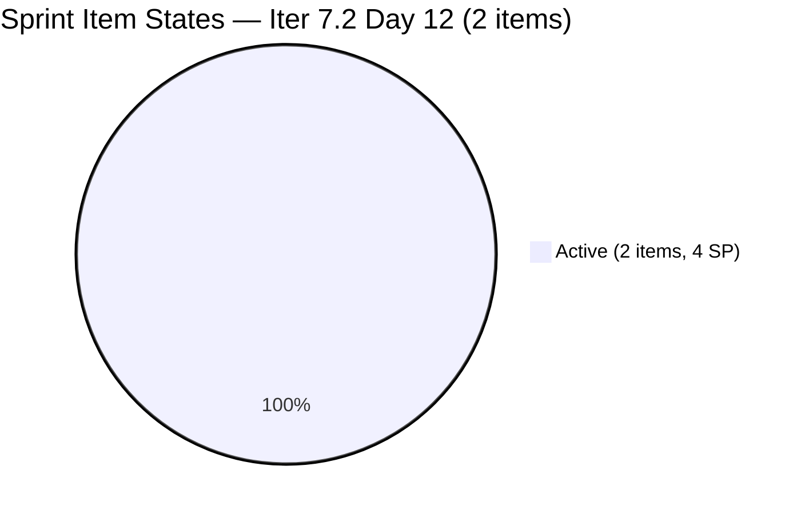
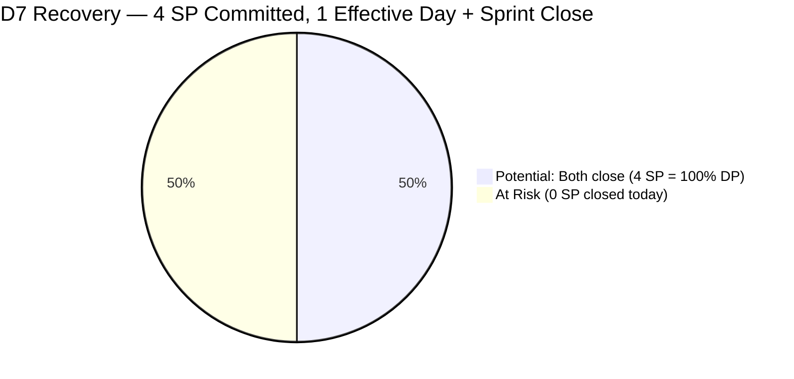

# ADO SAFe Iteration Audit — HR Recruitment Team

**Audit #46 | Iteration 7.2 (Apr 20 – May 3, 2026) | Day 12 of 14 (~86% elapsed)**

---

## 1. Audit Metadata

| Field | Value |
|---|---|
| **Audit Date** | May 1, 2026, 09:03 UTC |
| **Auditor** | Claude Code (ADO SAFe Audit Agent) |
| **Workspace** | `ado_hr` |
| **ADO Project** | Jairosoft FINOPS (`e0bb302f-40f9-46c3-8164-6f1acb317d63`) |
| **Team** | HR Recruitment Team (`248f59a6-372c-4b74-8129-9eaf260f211e`) |
| **Iteration** | Iteration 7.2 — Apr 20 to May 3, 2026 |
| **Iteration ID** | `a9888bc5-48df-40dd-bcc8-6926a11aa7c7` |
| **Sprint Day** | Day 12 of 14 (~86% elapsed) |
| **Prior Audit** | AUDIT_20260430_0904.md (Audit #45, 7.2 Day 11, Overall 81.4 — Low Risk) |
| **Scoring Model** | ADO SAFe v1 (7-dimension rubric) |
| **Overall Score** | **68.9 / 100** |
| **Risk Band** | **Moderate Risk** (60–79.9) |

---

## 2. Executive Summary

HR Recruitment Team drops from **81.4 (Low Risk)** to **68.9 (Moderate Risk)** on Day 12 — a **−12.5 point decline**. This is a **significant structural shift driven by a sprint planning reorganization on Apr 30**: Almera moved 14 of the 14 remaining Iter 7.2 items to **Iteration 7.3**, and 2 new Sr. Tech Lead items (#203544 — Nilo, Jefferson; #203551 — Maraon, Belleo) were added directly to Iter 7.2. The visible backlog grew from 14 → 16 items, but the current-sprint committed count collapsed from 14 → 2, pulling D1 from 100.0 to 12.5.

**Key development — Apr 30, 18:10–18:42 UTC:**
- 14 Iter 7.2 items moved to Iter 7.3 by Almera (confirmed by ChangedDate 18:10–18:26 UTC with IterationPath = Iter 7.3)
- 2 new Sr. Tech Lead items added to Iter 7.2:
  - **#203544** — Nilo, Jefferson (Active, 2 SP, last changed Apr 30 18:39)
  - **#203551** — Maraon, Belleo (Active, 2 SP, last changed Apr 30 18:42)
- This represents a late-sprint scope substitution: prior APE and recruiting items are replaced with two new Sr. Tech Lead candidates

**Sprint trajectory — Day 12, 2 days remaining (today Almera is off on May 1):**
Only 2 items remain in Iter 7.2 (4 SP committed). With May 1 as a day off for Almera and May 3 as the final sprint day, the maximum possible DP = 100.0 if both items close on May 2–3.

**Persistent structural issues:**
- No iteration goal defined — entire PI7 series.
- Bus factor = 1 — all items owned by Almera.
- Work Item Balance structural −30 (US-only sprint).

---

## 3. Previous Audit Delta

| Dimension | Audit #45 (Apr 30, 09:04 UTC) | Audit #46 (May 1, 09:03 UTC) | Delta | Driver |
|---|---|---|---|---|
| Iteration Planning | 100.0 | **12.5** | **−87.5** | 14 items moved to Iter 7.3; 2 new items added to Iter 7.2; ratio 2/16 |
| Team Capacity | 100.0 | **100.0** | 0.0 | Almera configured; 1/1 |
| Estimation | 100.0 | **100.0** | 0.0 | 2/2 new items estimated at 2 SP each |
| DoR Compliance | 100.0 | **100.0** | 0.0 | Both new items pass DoR |
| Work Item Balance | 70.0 | **70.0** | 0.0 | US-only; −30 structural |
| Backlog Refinement | 100.0 | **100.0** | 0.0 | All 16 items fresh; 0 untouched in sprint |
| Delivery Predictability | 0.0 | **0.0** | 0.0 | Both items Active; 0/4 SP closed |
| **Overall** | **81.4** | **68.9** | **−12.5** | D1 collapse from sprint replanning |

**Qualitative context:**
- 14 former Iter 7.2 items moved to Iter 7.3 (replanning, not abandonment) — all now flagged as Iter 7.3 commitments
- New Sr. Tech Lead candidates (Nilo, Maraon) added to Iter 7.2 — late-sprint additions
- Prior sprint items closed (7 items / 12 SP) remain as delivered sprint output, now exited from backlog
- Almera is off May 1 (per capacity data); effective working days left = 1 day (May 2) + May 3 sprint close

---

## 4. Current Iteration Snapshot

| Attribute | Value |
|---|---|
| **Iteration** | Iteration 7.2 |
| **Sprint Dates** | Apr 20 – May 3, 2026 (14 days) |
| **Sprint Day** | Day 12 of 14 |
| **Days Remaining** | 2 (May 1 = day off for Almera; May 2 = effective working day; May 3 = final sprint day) |
| **Visible Backlog Items** | 16 |
| **Current Iteration Items (Iter 7.2)** | 2 (#203544 Nilo, #203551 Maraon) |
| **Committed SP (Iter 7.2)** | 4 SP (2 + 2) |
| **Closed SP** | 0 (both Active) |
| **Items in Iter 7.3 (moved Apr 30)** | 14 items |
| **Capacity (Almera)** | 5 pts/day (3 Documentation + 2 Requirements); day off May 1 |
| **Last ADO Activity** | Apr 30, 18:42 UTC — #203551 (Maraon, Belleo) last updated |

---

## 5. Work Item Analysis

### Current Sprint Items — Iter 7.2 (2 items)

| ID | Title | Type | State | SP | Assignee | ChangedDate | DoR |
|---|---|---|---|---|---|---|---|
| 203544 | Sr. Tech Lead — Nilo, Jefferson | US | Active | 2 | Almera Kleer Tayao | Apr 30 18:39 | PASS |
| 203551 | Sr. Tech Lead — Maraon, Belleo | US | Active | 2 | Almera Kleer Tayao | Apr 30 18:42 | PASS |

**DoR verification — #203544:** Description: "process and complete the recruitment steps for Nilo, Jefferson a for the Sr. Tech Lead" — multiple paragraphs, clearly ≥30 non-whitespace chars. AC: 5-item ordered list (profile review, interview, evaluation, endorsement, hiring decision). PASS.

**DoR verification — #203551:** Description: "process and complete the recruitment steps for Maraon, Belleo, for the Sr. Tech Lead" — same structure, ≥30 non-whitespace chars. AC: 5-item ordered list matching standard recruitment AC template. PASS.

### Items Moved to Iter 7.3 on Apr 30

| ID | Title | Type | State | SP | New IterPath |
|---|---|---|---|---|---|
| 202887 | Sr. Tech Lead — Barua, Marlo | US | New | 2 | Iter 7.3 |
| 203063 | Sales & Mktg. — Angel Dorothy Abina | US | New | 2 | Iter 7.3 |
| 202093 | LinkedIn DevOps Engr. Hiring | US | Ready | 2 | Iter 7.3 |
| 202104 | APE — Rommel Senillo Summary PI7 | US | Ready | 2 | Iter 7.3 |
| 202099 | Annual Medical Check-up Cebu PI7 | US | Ready | 1 | Iter 7.3 |
| 202349 | Finance Reporting & Export | US | Ready | 2 | Iter 7.3 |
| 201273 | LinkedIn Bubble Trainer Hiring — Interview | US | Ready | 2 | Iter 7.3 |
| 197939 | Communication Skills Proposals Summary | US | Ready | 2 | Iter 7.3 |
| 203533 | Sr. Tech Lead — Beltran, Ken Henson | US | New | 2 | Iter 7.3 |
| 203534 | LinkedIn Tech Sales from Manila Hiring (7.3) | US | New | 1 | Iter 7.3 |
| 203535 | APE — Caumban, Karl Jordan (Sprint 7.3) | US | New | 2 | Iter 7.3 |
| 203536 | APE — Tayao, Almera Kleer (Sprint 7.3) | US | New | 2 | Iter 7.3 |
| 203537 | APE — Calvin John Dalino — Summary (7.3) | US | New | 2 | Iter 7.3 |
| 203538 | APE — Ryan Vince Castillo (Sprint 7.3) | US | New | 2 | Iter 7.3 |

**Note:** Several of the "Sprint 7.3" items (203533–203538) appear to be Iter 7.3 replacements for items that were previously Active in 7.2 (e.g., Beltran → new item 203533; APE items for Caumban, Tayao, Dalino, Castillo → new versioned items). These are newly created items, not just iteration-path changes.

---

## 6. SAFe Compliance Scorecard

| Dimension | Score | Evidence | Notes |
|---|---|---|---|
| **D1 Iteration Planning** | 12.5 | 2 / 16 visible backlog items in Iter 7.2 | 14 items moved to Iter 7.3 on Apr 30; 2 new items added to 7.2 |
| **D2 Team Capacity** | 100.0 | 1 contributor (Almera) / 1 configured (5 pts/day) | Day off May 1; 1 effective working day left |
| **D3 Estimation** | 100.0 | 2 / 2 estimated (2 SP each = 4 SP committed) | Both new items fully estimated |
| **D4 DoR Compliance** | 100.0 | 2 / 2 meet Description ≥30 + AC ≥20 thresholds | Standard recruitment template; AC = 5 items |
| **D5 Work Item Balance** | 70.0 | US 100% dominant > 60% → −30 penalty | Structural to HR domain |
| **D6 Backlog Refinement** | 100.0 | 16/16 fresh (all changed ≥ Apr 27); 0 stale_90; 0 stale_180; 0 untouched sprint items | No penalties |
| **D7 Delivery Predictability** | 0.0 | 0 SP closed / 4 SP committed (both Active) | Both items added late-sprint; closable May 2–3 |
| **Overall** | **68.9** | (12.5+100+100+100+70+100+0)/7 | **Moderate Risk** |

---

## 7. Dimension Findings

### D1 — Iteration Planning: 12.5
A late-sprint replanning event on Apr 30 (~18:10–18:42 UTC) transferred 14 items from Iter 7.2 to Iter 7.3 and added 2 new Sr. Tech Lead items (#203544 Nilo, #203551 Maraon) directly into Iter 7.2. The visible backlog grew from 14 → 16, but sprint-committed items dropped from 14 → 2. Ratio: 2/16 = 12.5. This is the lowest D1 score in the PI7 audit series for HR and indicates a significant mid-sprint scope substitution rather than incremental delivery.

### D2 — Team Capacity: 100.0
Almera Kleer Tayao remains the sole configured contributor (5 pts/day: 3 Documentation + 2 Requirements). Day off May 1 per capacity data. Effective remaining capacity: 5 pts on May 2 + sprint close May 3. D2 = 1/1 = 100.0.

### D3 — Estimation: 100.0
Both Iter 7.2 items (#203544, #203551) have Story Points = 2. Total committed_SP = 4. D3 = 2/2 = 100.0.

### D4 — DoR Compliance: 100.0
Both new Sr. Tech Lead items use the standard recruitment user story template with clearly articulated descriptions and 5-item acceptance criteria lists. Both pass Description ≥30 non-whitespace and AC ≥20 non-whitespace thresholds. D4 = 2/2 = 100.0.

### D5 — Work Item Balance: 70.0
Both sprint items are User Stories. dominant_type_share = 100% > 60% → −30 penalty. No US absence (US present). Spike share = 0% → no −20 penalty. Score = max(0, 100−30) = 70.0. Structural to the HR recruitment domain.

### D6 — Backlog Refinement: 100.0
All 16 visible backlog items show ChangedDate ≥ Apr 27, 2026 (most updated Apr 30). The 45-day fresh cutoff from May 1 is Mar 17, 2026. Zero items exceed stale_90 (Jan 30). Zero items exceed stale_180 (Nov 1, 2025). Both sprint items changed Apr 30 — 0 untouched (all ChangedDate > Apr 20 sprint start). base = 16/16 = 100%; no penalties. Score = 100.0.

### D7 — Delivery Predictability: 0.0
committed_story_points = 4 SP (#203544 2 SP + #203551 2 SP). closed_story_points = 0 (both items Active). Formula: 0/4 = 0.0. Both items were added to Iter 7.2 on Apr 30 — they are brand-new sprint items with 1–2 effective working days remaining. Contextual sprint output for Iter 7.2 remains 7 items / 12 SP (exited backlog prior to this audit).

---

## 8. Risks and Bottlenecks

| # | Risk | Severity | Age |
|---|---|---|---|
| R1 | **Late-sprint scope substitution — D1 collapse**: 14 items moved out of sprint 7.2 on Day 11, replaced with 2 new items. This creates a 12.5 D1 score and undermines sprint planning integrity. | High | Day 11–12 |
| R2 | **Only 1 effective working day remaining** (May 2): May 1 is Almera's day off; May 3 is the final sprint day. Both #203544 and #203551 must close by May 3 for any D7 credit. | High | Structural |
| R3 | **D7 = 0 with 2 days left**: 4 SP committed, 0 SP closed. D7 recovery requires both items to close before sprint end. | High | Day 12 |
| R4 | **Bus factor = 1**: All 2 remaining sprint items assigned solely to Almera. No coverage. | High | Structural |
| R5 | **14-item Iter 7.3 scope backlog**: All 14 moved items require re-planning confirmation in Iter 7.3. Several are new items (203533–203538) suggesting prior items were effectively abandoned and re-created. | Moderate | New |
| R6 | **Sprint planning integrity**: Moving 14 items on Day 11 creates audit inconsistency and suggests a mid-sprint re-scope that should have occurred during sprint planning. | Moderate | Day 11 |
| R7 | **No iteration goal**: No sprint goal defined for PI7 series. | Moderate | All sprints |

---

## 9. Prioritized Recommendations

1. **[May 2 — only effective working day] Close #203544 (Nilo, Jefferson) and #203551 (Maraon, Belleo)**: Both Sr. Tech Lead items were added on Apr 30. If hiring decisions are being made on these candidates, close them on May 2 to achieve D7 > 0. Closing both = DP 100.0, lifting Overall from 68.9 to ~83.0 (Low Risk).

2. **[May 3 sprint close] Confirm Iter 7.3 scope during sprint retrospective**: The 14 items moved to Iter 7.3 need formal sprint planning review. Several appear as new item IDs (203533–203538) rather than re-iterated originals — confirm each is correctly represented in the 7.3 board.

3. **[Iter 7.3 planning] Define a sprint goal**: "Complete Sr. Tech Lead recruiting campaign and APE cycle for PI7" would cover both new hires and evaluations. A single sentence is sufficient.

4. **[Iter 7.3 planning] Avoid mid-sprint item migration**: The Apr 30 bulk move created a scoring artifact and governance concern. Sprint scope changes should happen during planning or IP sprints, not Day 11 of a 14-day sprint.

5. **[Iter 7.3 planning] Add one Spike or Enabler**: Eliminates the structural −30 D5 penalty by introducing type diversity. Even one process Spike per sprint changes the balance score.

6. **[Iter 7.3 planning] Consider a second contributor**: Almera remains the sole HR team member. Adding Grace or another team member to at least one item reduces bus factor risk.

---

## 10. Evidence Gaps and Limitations

| Gap | Impact | Mitigation |
|---|---|---|
| 7 sprint-closed items (202017, 202022, 202039, 202042, 202885, 203053, 203057) not in visible backlog | D7 computed from visible items only; actual sprint output = 7 items / 12 SP | Documented in narrative; historical sprint delivery tracked |
| Items 202888, 202109, 202114, 203067, 202886, 200671 — not in visible backlog | Previously Active items; may have been closed or moved off the board | Cannot confirm state; not counted |
| Sprint item replacements (#203533–203538) — new IDs vs. prior items | Unclear if prior items (#202888 APE Caumban, #202109 APE Dalino, #202114 APE Castillo, #202886 Beltran) were closed or simply replaced | Noted; governance gap |
| May 1 = Almera's day off per capacity data | No ADO activity expected today | Stated in snapshot |
| No iteration goal in ADO | Cannot score sprint goal execution | Persistent — noted |
| Grace (grace@jairosoft.com) not in capacity data | Not counted in D2 | Excluded; 0 current-sprint items assigned |

---

## Mermaid Charts

### Dimension Score Breakdown — Day 12

### Score Trend — Audit Series (Iter 7.2)

### Current Sprint Item State Distribution (2 items)

### D7 Recovery Potential — 2 Effective Days Left

---

*Report generated: 2026-05-01 09:03 UTC | Workspace: ado_hr | Iteration 7.2 Day 12 | Score: 68.9 Moderate Risk*
*Note: Score drop from 81.4 to 68.9 is driven by a Day 11 sprint replanning event that moved 14 items to Iter 7.3 and added 2 new Sr. Tech Lead items to Iter 7.2.*
