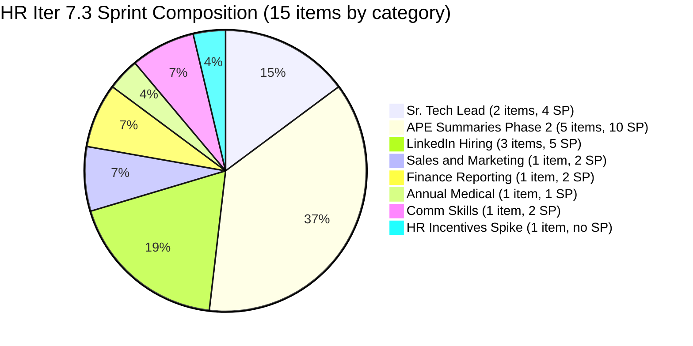
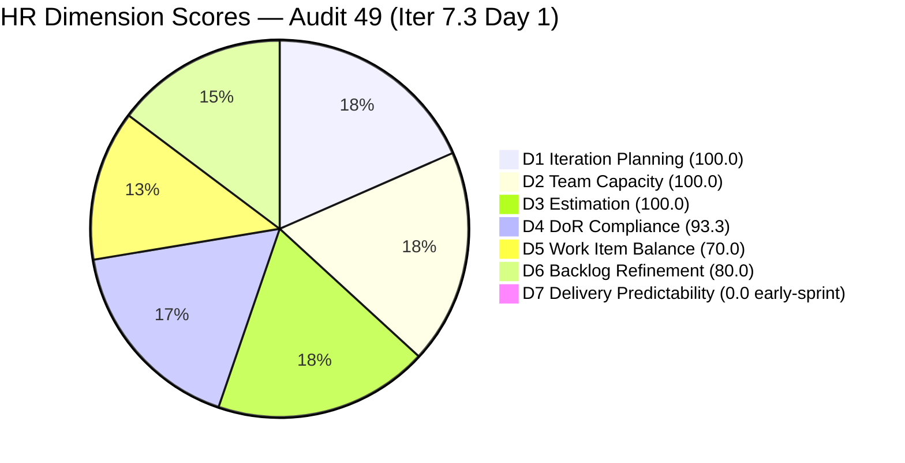
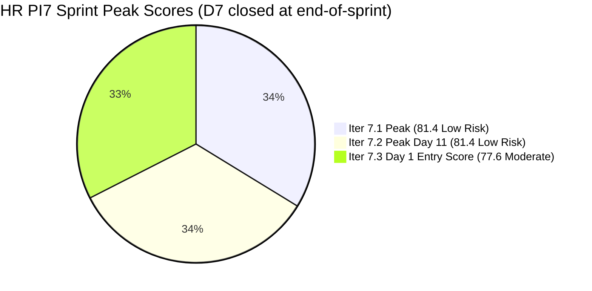
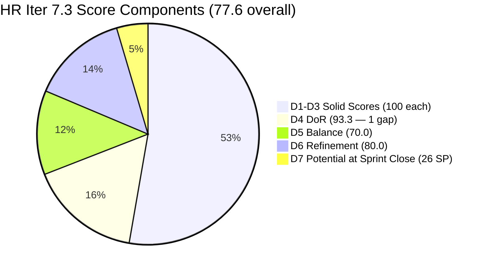

# ADO SAFe Iteration Audit — HR Recruitment Team

**Audit #49 | Iteration 7.3 (May 4 – May 17, 2026) | Day 1 of 14 — Sprint Day 1**

---

## 1. Audit Metadata

| Field | Value |
|---|---|
| **Audit Date** | May 4, 2026, 09:00 UTC |
| **Auditor** | Claude Code (ADO SAFe Audit Agent) |
| **Workspace** | `ado_hr` |
| **ADO Project** | Jairosoft FINOPS (`e0bb302f-40f9-46c3-8164-6f1acb317d63`) |
| **Team** | HR Recruitment Team (`248f59a6-372c-4b74-8129-9eaf260f211e`) |
| **Iteration** | Iteration 7.3 — May 4 to May 17, 2026 |
| **Iteration ID** | `d76b8de5-94fe-4b28-987a-263d56afd8d4` |
| **Sprint Day** | Day 1 of 14 — Sprint Day 1 |
| **Prior Audit** | AUDIT_20260503_0902.md (Audit #48, 7.2 Day 14 Close, Overall 14.3 — Formula Artifact) |
| **Scoring Model** | ADO SAFe v1 (7-dimension rubric) |
| **Overall Score** | **77.6 / 100** |
| **Risk Band** | **Moderate Risk** (60–79.9) — strong sprint entry, D7 early-sprint zero |

---

## 2. Executive Summary

HR Recruitment Team opens Iteration 7.3 at **77.6 / 100 (Moderate Risk)** — the **highest Day 1 score in the PI7 HR audit series** and within striking distance of the Low Risk threshold (80). This is a strong sprint entry: 15 items fully committed to Iter 7.3, all User Stories, fully estimated, and almost fully DoR-compliant.

**Key observations for Day 1:**
- **15/15 items committed to Iter 7.3** — all visible backlog items are in the active sprint. Excellent D1.
- **Almera has capacity configured** (5 pts/day: 3 Documentation + 2 Requirements). D2 = 100.
- **14/15 items estimated** (all User Stories). The single Spike (#203629 — HR incentives discussion) has no Story Points → not counted as point-eligible.
- **DoR gap: #203629 lacks Acceptance Criteria.** 14/15 items pass DoR. D4 = 93.3.
- **D5 penalty: User Story dominant at 93.3%** (14 US + 1 Spike). No US deficit penalty — User Stories are present. Single type dominance (−30) is expected at Day 1.
- **D6 note: 6 of 15 items were last touched Apr 30** (pre-sprint). While all remain within the 45-day freshness window, the 40% untouched ratio (> 30% threshold) triggers a −20 penalty. This is a Day 1 artifact — sprint engagement will resolve it quickly.
- **D7 = 0 — early-sprint.** No items are Closed yet. Normal for Day 1. If Almera maintains her historical pace (12 items/day peak, 2–3 items/day average), the sprint is tracking for 100% delivery.

**Iter 7.2 was the third consecutive PI7 sprint at 100% delivery.** The 14-item pipeline prepared Apr 30 plus the new #203629 Spike constitutes a well-structured 15-item sprint. The APE Phase 2 ambiguity flagged in prior audits is now confirmed: items 203535–203538 represent genuine Phase 2 APE Summary activities (supervisor sign-off, acknowledgment, HR finalization), distinct from the Phase 1 evaluations closed in Iter 7.2.

**Score improvement path:** Closing #203629 DoR gap (add Acceptance Criteria) raises D4 from 93.3 → 100.0, moving Overall from 77.6 → 78.9. Achieving 60%+ delivery on Day 14 would restore D7 and push the score into Low Risk territory (≥80).

---

## 3. Previous Audit Delta

| Dimension | Audit #48 (May 3, Iter 7.2 Close, Formula State) | Audit #49 (May 4, Iter 7.3 Day 1) | Delta | Driver |
|---|---|---|---|---|
| Iteration Planning | 0.0 | **100.0** | +100.0 | New sprint: 15/15 items committed to Iter 7.3 |
| Team Capacity | 0.0 | **100.0** | +100.0 | Almera configured (5 pts/day); 1/1 |
| Estimation | 0.0 | **100.0** | +100.0 | 14/14 point-eligible US estimated; Spike not eligible |
| DoR Compliance | 0.0 | **93.3** | +93.3 | 14/15 pass; #203629 Spike lacks AC |
| Work Item Balance | 0.0 | **70.0** | +70.0 | US present (14/15); dominant type −30; no spike penalty |
| Backlog Refinement | 100.0 | **80.0** | −20.0 | 6 items pre-sprint (Apr 30) trigger untouched >30% penalty |
| Delivery Predictability | 0.0 | **0.0** | 0.0 | Day 1 — no closures yet; 26 SP committed; early-sprint |
| **Overall** | **14.3** | **77.6** | **+63.3** | Full sprint reset — from formula artifact to healthy Day 1 |

**Delta context:** The jump from 14.3 → 77.6 is entirely a sprint transition artifact. The 14.3 was a formula artifact at Iter 7.2 close; 77.6 reflects the actual planned state of Iter 7.3 at sprint start.

---

## 4. Current Iteration Snapshot

| Attribute | Value |
|---|---|
| **Iteration** | Iteration 7.3 |
| **Sprint Dates** | May 4 – May 17, 2026 (14 days) |
| **Sprint Day** | Day 1 of 14 |
| **Days Remaining** | 13 |
| **Visible Backlog Items** | 15 (all in Iter 7.3) |
| **Current Sprint Items** | 15 (all in Iter 7.3) |
| **Committed SP** | 26 SP (14 User Stories with SP; Spike #203629 has no SP) |
| **Closed SP** | 0 SP — Day 1 |
| **Capacity** | Almera Kleer Tayao: 5 pts/day (3 Documentation + 2 Requirements); 0 days off |
| **Last ADO Activity** | May 4, 2026 — 9 items updated on sprint start |
| **Sprint Open Status** | 15/15 items in New/Ready state |

---

## 5. Work Item Analysis

### Iteration 7.3 — All Sprint Items (15)

| ID | Title | Type | State | SP | Assignee | Changed | DoR |
|---|---|---|---|---|---|---|---|
| 203533 | Sr. Tech Lead — Beltran, Ken Henson (Technical & Hiring Decision) | US | Ready | 2 | Almera | May 4 | PASS |
| 202887 | Sr. Tech Lead — Barua, Marlo | US | Ready | 2 | Almera | May 4 | PASS |
| 203063 | Sales & Mktg. — Angel Dorothy Abina | US | Ready | 2 | Almera | May 4 | PASS |
| 202093 | LinkedIn DevOps Engr. Hiring | US | Ready | 2 | Almera | Apr 30 | PASS |
| 203534 | LinkedIn Tech Sales from Manila Hiring (Sprint 7.3) | US | Ready | 1 | Almera | May 4 | PASS |
| 203535 | APE — Caumban, Karl Jordan (Sprint 7.3) | US | Ready | 2 | Almera | May 4 | PASS |
| 203536 | APE — Tayao, Almera Kleer (Sprint 7.3) | US | Ready | 2 | Almera | May 4 | PASS |
| 202104 | APE — Rommel Senillo — Summary — PI7 | US | Ready | 2 | Almera | Apr 30 | PASS |
| 203537 | APE — Calvin John Dalino — Summary (Sprint 7.3) | US | Ready | 2 | Almera | May 4 | PASS |
| 203538 | APE — Ryan Vince Castillo (Sprint 7.3) | US | Ready | 2 | Almera | May 4 | PASS |
| 202099 | Annual Medical Check-up — Cebu Employees PI7 | US | Ready | 1 | Almera | Apr 30 | PASS |
| 202349 | Finance Reporting & Export | US | Ready | 2 | Almera | Apr 30 | PASS |
| 201273 | LinkedIn Bubble Trainer Hiring — Interview | US | Ready | 2 | Almera | Apr 30 | PASS |
| 197939 | Communication Skills Proposals Summary Presentation | US | Ready | 2 | Almera | Apr 30 | PASS |
| **203629** | HR Discussion on Employees Incentives, Scaling of Bonuses | **Spike** | Ready | — | Almera | May 4 | **FAIL** (no AC) |

**Total: 15 items | 26 SP (User Stories only) | 1 Spike with no SP**

### Sprint Category Breakdown

| Category | Items | SP |
|---|---|---|
| Sr. Tech Lead Candidates | 2 (Beltran, Barua) | 4 |
| APE Summaries / Phase 2 | 5 (Caumban, Tayao, Rommel, Calvin, Ryan) | 10 |
| LinkedIn Hiring | 3 (DevOps, Tech Sales, Bubble Trainer) | 5 |
| Sales & Marketing Candidate | 1 (Angel Dorothy Abina) | 2 |
| Finance Reporting & Export | 1 | 2 |
| Annual Medical Check-up | 1 | 1 |
| Comm Skills Presentation | 1 | 2 |
| **HR Incentives Spike** | **1** | **—** |

### DoR Analysis — #203629

| Item | Description ≥30 chars | AC ≥20 chars | Result |
|---|---|---|---|
| #203629 HR Incentives Spike | "Come up with a way to provide tangible incentives/bonuses for employees." — 72 chars → PASS | No Acceptance Criteria field populated — FAIL | **DoR FAIL** |

**Action required:** Add Acceptance Criteria to #203629. Suggested: *"A proposal document for an employee incentives and bonus scaling framework is drafted and ready for OTP review, including at least two incentive models with cost estimates."*

---

## 6. SAFe Compliance Scorecard

| Dimension | Score | Evidence | Notes |
|---|---|---|---|
| **D1 Iteration Planning** | **100.0** | 15 / 15 visible backlog items in Iter 7.3 | Excellent — full sprint commitment |
| **D2 Team Capacity** | **100.0** | Almera (5 pts/day) = 1/1 contributor with capacity | Excellent |
| **D3 Estimation** | **100.0** | 14/14 point-eligible US estimated; #203629 Spike has no SP (not eligible) | Excellent |
| **D4 DoR Compliance** | **93.3** | 14/15 pass; #203629 lacks Acceptance Criteria | Fix: add AC to #203629 |
| **D5 Work Item Balance** | **70.0** | US present (14/15); dominant type US 93.3% > 60% → −30; spike share 6.7% < 40% | No US deficit; single spike diversifies sprint |
| **D6 Backlog Refinement** | **80.0** | 15/15 fresh (oldest Apr 30 = 34 days); 0 stale_90; 0 stale_180; 6/15 untouched (>30%) → −20 | Day 1 untouched artifact; sprint engagement will clear |
| **D7 Delivery Predictability** | **0.0** | 0/26 SP closed; Day 1 — no closures | *early-sprint* — expected; D7 should accumulate from Day 2+ |
| **Overall** | **77.6** | (100+100+100+93.3+70+80+0) / 7 = 543.3 / 7 = 77.6 | **Moderate Risk** — strong sprint entry |

---

## 7. Dimension Findings

### D1 — Iteration Planning: 100.0

```
visible_root_backlog_items = 15
current_iteration_root_items = 15   (all 15 committed to Iter 7.3)
D1 = (15 / 15) × 100 = 100.0
```

All backlog items are in the active sprint. This is the first time D1 = 100.0 at sprint start across the PI7 audit series for the HR team. The pipeline was fully prepared on Apr 30 with the Iter 7.3 batch, plus #203629 added on May 4 as a new Spike.

### D2 — Team Capacity: 100.0

```
contributors_with_current_work = 1   (Almera Kleer Tayao — all 15 items)
contributors_with_capacity = 1       (5 pts/day: 3 Documentation + 2 Requirements)
D2 = (1 / 1) × 100 = 100.0
```

Almera is the sole active contributor. Her capacity is configured with no days off for Iter 7.3. Grace (grace@jairosoft.com) is on the team but has 0 capacity and no items — excluded from D2 calculation.

### D3 — Estimation: 100.0

```
point_eligible_current_items = 14   (14 User Stories — Spike excluded as non-SP type)
estimated_current_items = 14        (all 14 US have SP > 0)
D3 = (14 / 14) × 100 = 100.0
```

All User Stories carry Story Points. The Spike (#203629) has no SP field populated — this is acceptable for a Spike type. No estimation gap on point-eligible items.

### D4 — DoR Compliance: 93.3

```
current_iteration_root_items = 15
dor_compliant_current_items = 14   (#203629 fails — no Acceptance Criteria)
D4 = (14 / 15) × 100 = 93.3
```

14 of 15 items have both a substantive Description (≥30 non-whitespace chars) and Acceptance Criteria (≥20 non-whitespace chars). The single gap is #203629 (HR Incentives Spike) which has a description ("Come up with a way to provide tangible incentives/bonuses for employees") but no AC. One line of AC would close this gap and raise D4 to 100.0, adding +1.0 to Overall.

### D5 — Work Item Balance: 70.0

```
Current item type breakdown:
  User Story: 14/15 = 93.3%
  Spike:       1/15 = 6.7%

User Story present in sprint → no −40 penalty
Dominant type (US at 93.3% > 60%) → −30
Spike share (6.7% < 40%) → no spike penalty

D5 = 100 − 30 = 70.0
```

The sprint is US-dominant as expected for an HR team running active recruitment and evaluation cycles. The single Spike (#203629) is a healthy addition — it represents strategic HR work (incentives framework) and breaks the purely operational US pattern. The −30 dominant type penalty is formula-driven; it would require at least 5–6 non-US items to eliminate it, which is not warranted given the team's structure and workload.

### D6 — Backlog Refinement: 80.0

```
Freshness cutoff: May 4 − 45 = Mar 20, 2026
Stale_90 cutoff:  Feb 3, 2026
Stale_180 cutoff: Nov 6, 2025

fresh_visible_root_items = 15   (all items changed Apr 27–May 4; oldest = Apr 30)
visible_root_backlog_items = 15

Base: (15 / 15) × 100 = 100.0

Stale penalties:
  stale_90 items = 0   (no items older than Feb 3)
  stale_180 items = 0

Untouched current items (changed before sprint start May 4):
  197939, 201273, 202093, 202099, 202104, 202349 — all last changed Apr 30
  Count = 6; ratio = 6/15 = 40% > 30% → −20

D6 = 100.0 − 20 = 80.0
```

The 6 items changed Apr 30 were prepared in advance of sprint start — they represent proactive backlog grooming, not neglect. By Day 2–3, as Almera begins working these items, their ChangedDate will update and the untouched penalty will dissolve. No structural backlog health concern.

### D7 — Delivery Predictability: 0.0 (early-sprint)

```
committed_story_points = 26   (sum of SP on 14 estimated User Stories)
closed_story_points = 0       (sprint opened today — no closures)
D7 = (0 / 26) × 100 = 0.0
```

**Early-sprint.** D7 = 0 is expected on Day 1. Based on Iter 7.2's delivery pace (15 items, 27 SP, with 12 closures on Day 11 alone), the sprint has high delivery potential. If Almera closes items at her historical average of 1.5–2/day from Day 3 onward, D7 should reach 50+ by mid-sprint. Annotated: *early-sprint*.

### Overall Score Calculation

```
D1  = 100.0
D2  = 100.0
D3  = 100.0
D4  =  93.3
D5  =  70.0
D6  =  80.0
D7  =   0.0

Overall = (100.0 + 100.0 + 100.0 + 93.3 + 70.0 + 80.0 + 0.0) / 7
        = 543.3 / 7
        = 77.6
```

**Overall: 77.6 / 100 — Moderate Risk**

---

## 8. Risks and Bottlenecks

| # | Risk | Severity | Owner | Status |
|---|---|---|---|---|
| R1 | **Bus factor = 1** — All 15 items assigned to Almera. No backup for HR workstream. | High | Structural | Persistent — all audits |
| R2 | **#203629 lacks Acceptance Criteria** — DoR gap prevents D4 = 100.0; needs AC before first work begins | Moderate | Almera (PO) | New — fix today |
| R3 | **DevOps Engr. hiring (#202093) — 5+ sprint carry-forward** — Present in pipeline since PI6; still in Ready state; no qualified candidate closed | Moderate | Almera | Persistent — escalation warranted |
| R4 | **No Iteration Goal defined** — Entire PI7 series; structural gap across all HR audits | Moderate | Almera / Ramon | Unfixed — 14+ audits |
| R5 | **APE Spike duplication risk (#202104)** — Rommel Senillo summary in 7.3; confirm Phase 2 scope is distinct from any Phase 1 work | Low | Almera | Verify once |
| R6 | **D7 = 0 — early-sprint** — Expected; close rate from Day 3 onward determines final score | Low | Almera | Monitor |

---

## 9. Prioritized Recommendations

1. **[Today — Day 1] Add Acceptance Criteria to #203629 (HR Incentives Spike).** A single sentence resolves the DoR gap and raises D4 from 93.3 → 100.0, adding +1 to Overall. Suggested AC: *"A written framework proposal is prepared covering at least two incentive models (e.g., performance-based bonus, milestone reward) with estimated cost ranges, submitted to Ramon (OTP) for review."*

2. **[Day 1–2] Define an Iteration 7.3 Goal.** The sprint contains three distinct workstreams: (a) Sr. Tech Lead hiring pipeline, (b) APE Phase 2 summaries, (c) DevOps/Sales/Trainer LinkedIn hiring. Suggested goal: *"Complete Sr. Tech Lead Beltran and Barua hiring decisions, finalize APE Phase 2 summaries for all PI7-evaluated employees, and advance DevOps Engr. hiring to qualified candidate shortlist."* A single sentence on the sprint board addresses the longest-standing structural gap in the HR audit series.

3. **[Week 1] Escalate DevOps Engr. hiring (#202093).** This item has been in the active sprint since PI6 with no qualified candidate closed. Options: (a) revise the job description, (b) switch sourcing from LinkedIn to a recruiter, (c) escalate to Ramon with a go/no-go decision. If the role is still needed, define a concrete action; if deprioritized, close with documentation.

4. **[Week 2] Confirm APE Phase 2 scope for #202104 (Rommel Senillo).** Verify this item is the Phase 2 sign-off/acknowledgment activity (distinct from the Phase 1 evaluation) and add a one-sentence description note distinguishing Phase 1 vs. Phase 2 activities.

5. **[Structural] Assign one item to a second team member as observer/co-owner.** Even a single item assigned to Grace or a new team member as co-owner would reduce bus factor risk and begin building HR process documentation.

---

## 10. Evidence Gaps and Limitations

| Gap | Impact | Mitigation |
|---|---|---|
| #203629 — no SP and no AC | Excluded from D3 denominator; D4 gap | Fix AC; SP optional for Spikes |
| Spike type does not expose SP by convention | 203629 not counted in D3 | Correctly excluded; noted |
| No iteration goal in ADO | Sprint goal execution unmeasurable | Persistent — 14+ audits |
| Grace (0 capacity, no items) | Not in D2 calculation | Excluded correctly |
| D7 = 0 on Day 1 | Cannot assess delivery predictability yet | Early-sprint; monitor from Day 3 |

---

## 11. Mermaid Charts

### Iter 7.3 Sprint Composition — Day 1



### Dimension Scores — Day 1



### PI7 HR Audit Score Trend — Peak Scores by Sprint



### Score Improvement Path — Iter 7.3



---

*Report generated: 2026-05-04 09:00 UTC | Workspace: ado_hr | Iteration 7.3 Day 1 | Score: 77.6 Moderate Risk*
*Sprint entry: 15/15 items committed, 26 SP, all items in Ready/New state. Almera Kleer Tayao sole contributor. D7 early-sprint (Day 1) — delivery tracking begins Day 2.*
