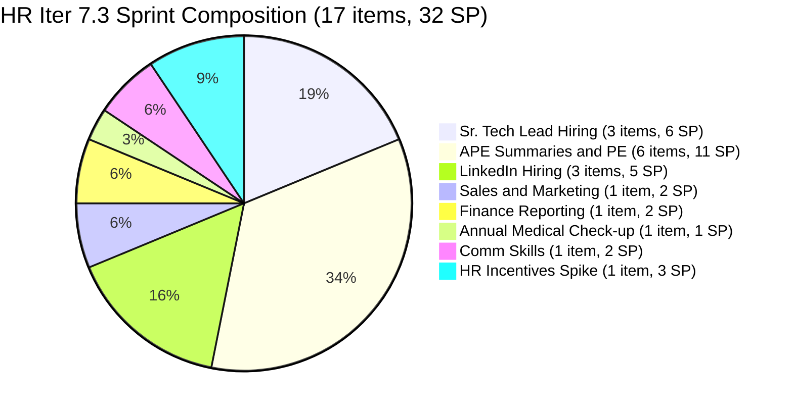
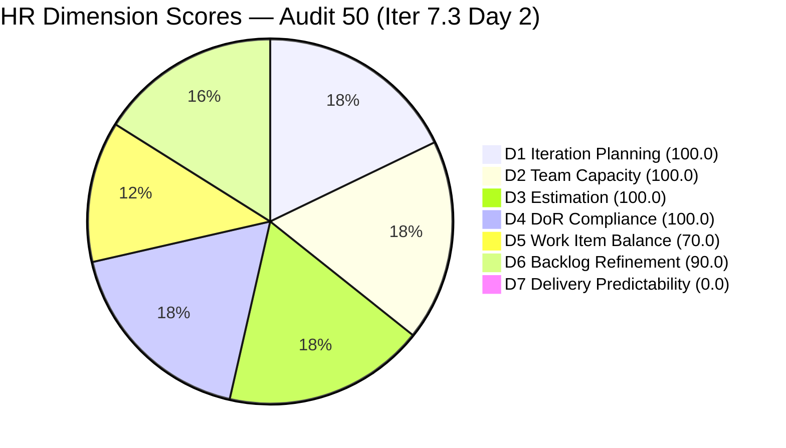
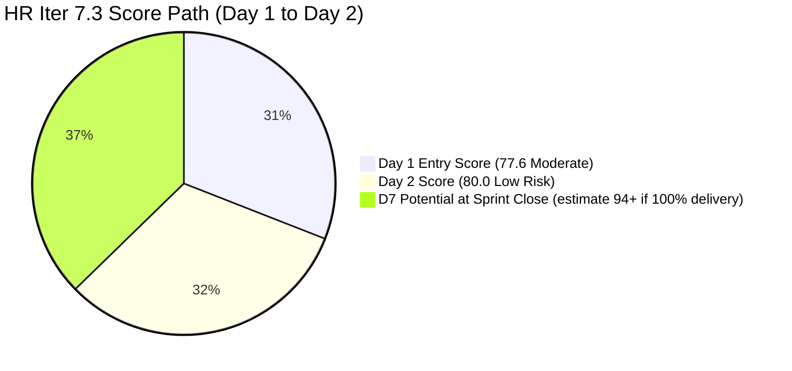
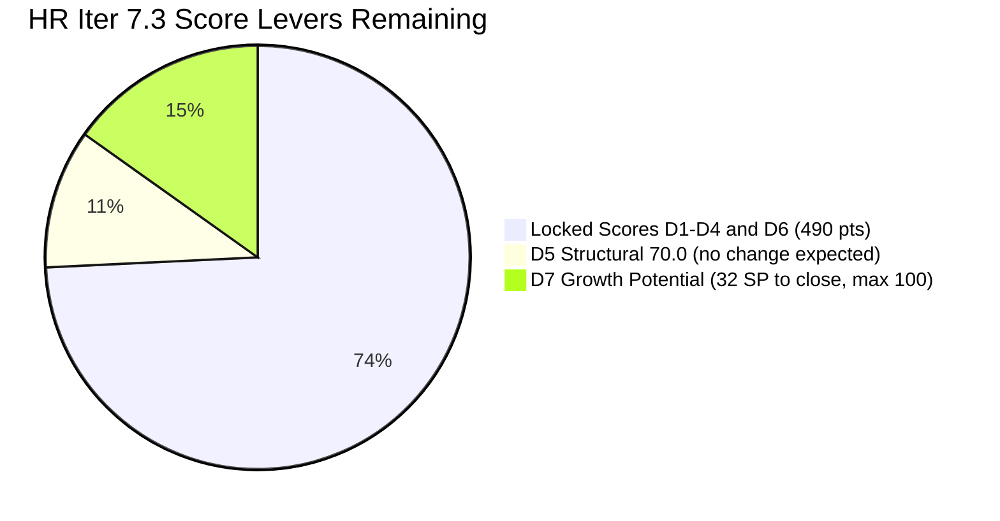

# ADO SAFe Iteration Audit — HR Recruitment Team

**Audit #50 | Iteration 7.3 (May 4 – May 17, 2026) | Day 2 of 14**

---

## 1. Audit Metadata

| Field | Value |
|---|---|
| **Audit Date** | May 5, 2026, 09:00 UTC |
| **Auditor** | Claude Code (ADO SAFe Audit Agent) |
| **Workspace** | `ado_hr` |
| **ADO Project** | Jairosoft FINOPS (`e0bb302f-40f9-46c3-8164-6f1acb317d63`) |
| **Team** | HR Recruitment Team (`248f59a6-372c-4b74-8129-9eaf260f211e`) |
| **Iteration** | Iteration 7.3 — May 4 to May 17, 2026 |
| **Iteration ID** | `d76b8de5-94fe-4b28-987a-263d56afd8d4` |
| **Sprint Day** | Day 2 of 14 |
| **Prior Audit** | AUDIT_20260504_0900.md (Audit #49, Iter 7.3 Day 1, Overall 77.6 — Moderate Risk) |
| **Scoring Model** | ADO SAFe v1 (7-dimension rubric) |
| **Overall Score** | **80.0 / 100** |
| **Risk Band** | **Low Risk** (≥80) — first Low Risk score at sprint Day 2 in PI7 series |

---

## 2. Executive Summary

HR Recruitment Team reaches **80.0 / 100 (Low Risk)** on Day 2 of Iteration 7.3 — crossing the SAFe target threshold for the first time mid-sprint in the PI7 series. Two significant improvements drove this from yesterday's 77.6:

**Key changes from Day 1 (May 4) to Day 2 (May 5):**

1. **#203629 DoR gap FIXED** — The HR Incentives Spike now has Acceptance Criteria populated (changed May 4 at 21:44 UTC). All 17 items now pass DoR. D4 jumps from 93.3 → **100.0**.
2. **Two new items added** — #203825 (Client Interview | Sr. Tech Lead – Maraon, Belleo) and #203829 (APE – Babael, Samantha 2nd Month PE) were added on May 5 at 00:54 and 01:00 UTC respectively. Both are fully estimated and DoR-compliant. Visible backlog grows from 15 → 17 items.
3. **Untouched penalty drops from -20 to -10** — With 17 items now, only 5 were last changed before sprint start (Apr 30), giving 29.4% untouched ratio — just below the 30% threshold for the -20 penalty. D6 rises from 80.0 → **90.0**.
4. **D7 remains 0 — Day 2** — No items Closed yet. Normal. Sprint has 32 committed SP across 17 items.

**Score improvement path:** D5 is structurally at 70.0 (US dominant, as expected for an HR team). D7 will accumulate once Almera closes first items (expected Day 3–5 based on historical pace). Closing all 17 items at end of sprint would push D7 to 100.0 and Overall to ~94.3.

---

## 3. Previous Audit Delta

| Dimension | Audit #49 (May 4, Day 1, 77.6) | Audit #50 (May 5, Day 2, 80.0) | Delta | Driver |
|---|---|---|---|---|
| Iteration Planning | 100.0 | **100.0** | 0.0 | 17/17 items in Iter 7.3 (2 new items added, all in sprint) |
| Team Capacity | 100.0 | **100.0** | 0.0 | Almera configured, 1/1 |
| Estimation | 100.0 | **100.0** | 0.0 | 17/17 estimated; 203629 Spike now SP=3 |
| DoR Compliance | 93.3 | **100.0** | +6.7 | #203629 AC fixed May 4 21:44 UTC — all 17 now pass |
| Work Item Balance | 70.0 | **70.0** | 0.0 | US dominant (16/17=94.1%); structural |
| Backlog Refinement | 80.0 | **90.0** | +10.0 | Untouched dropped from 40% to 29.4% — below 30% threshold |
| Delivery Predictability | 0.0 | **0.0** | 0.0 | Day 2 — no closures yet; 32 SP committed |
| **Overall** | **77.6** | **80.0** | **+2.4** | D4 fix + D6 improvement cross the Low Risk threshold |

---

## 4. Current Iteration Snapshot

| Attribute | Value |
|---|---|
| **Iteration** | Iteration 7.3 |
| **Sprint Dates** | May 4 – May 17, 2026 (14 days) |
| **Sprint Day** | Day 2 of 14 |
| **Days Remaining** | 12 |
| **Visible Backlog Items** | 17 (all in Iter 7.3) |
| **Current Sprint Items** | 17 (all in Iter 7.3) |
| **Committed SP** | 32 SP (all 17 items estimated) |
| **Closed SP** | 0 SP — Day 2 |
| **Capacity** | Almera Kleer Tayao: 5 pts/day (3 Documentation + 2 Requirements); 0 days off |
| **Last ADO Activity** | May 5, 2026, 01:00 UTC — #203829 added to sprint |
| **Sprint Status** | 17/17 items in Ready state |

---

## 5. Work Item Analysis

### Iteration 7.3 — All Sprint Items (17 root items)

| ID | Title | Type | State | SP | Assignee | Changed | DoR |
|---|---|---|---|---|---|---|---|
| 203825 | Client Interview — Sr. Tech Lead Maraon, Belleo | US | Ready | 2 | Almera | May 5 | PASS |
| 203829 | APE — Babael, Samantha (2nd Month PE) | US | Ready | 1 | Almera | May 5 | PASS |
| 203533 | Sr. Tech Lead — Beltran, Ken Henson | US | Ready | 2 | Almera | May 4 | PASS |
| 202887 | Sr. Tech Lead — Barua, Marlo | US | Ready | 2 | Almera | May 4 | PASS |
| 203063 | Sales & Mktg. — Angel Dorothy Abina | US | Ready | 2 | Almera | May 4 | PASS |
| 202093 | LinkedIn DevOps Engr. Hiring | US | Ready | 2 | Almera | May 4 | PASS |
| 203534 | LinkedIn Tech Sales from Manila Hiring | US | Ready | 1 | Almera | May 4 | PASS |
| 203535 | APE — Caumban, Karl Jordan | US | Ready | 2 | Almera | May 4 | PASS |
| 203536 | APE — Tayao, Almera Kleer | US | Ready | 2 | Almera | May 4 | PASS |
| 202104 | APE — Rommel Senillo Summary PI7 | US | Ready | 2 | Almera | Apr 30 | PASS |
| 203537 | APE — Calvin John Dalino Summary | US | Ready | 2 | Almera | May 4 | PASS |
| 203538 | APE — Ryan Vince Castillo | US | Ready | 2 | Almera | May 4 | PASS |
| 202099 | Annual Medical Check-up — Cebu Employees PI7 | US | Ready | 1 | Almera | Apr 30 | PASS |
| 202349 | Finance Reporting & Export | US | Ready | 2 | Almera | Apr 30 | PASS |
| 201273 | LinkedIn Bubble Trainer Hiring — Interview | US | Ready | 2 | Almera | Apr 30 | PASS |
| 197939 | Communication Skills Proposals Summary Presentation | US | Ready | 2 | Almera | Apr 30 | PASS |
| **203629** | HR Discussion on Employees Incentives, Scaling of Bonuses | **Spike** | Ready | 3 | Almera | May 4 | **PASS** (AC fixed) |

**Total: 17 items | 32 SP | 16 User Stories + 1 Spike**

### New Items Added on May 5

| ID | Title | Description |
|---|---|---|
| **203825** | Client Interview — Sr. Tech Lead Maraon, Belleo | Endorsement and coordination of client interviews for Sr. Tech Lead candidates who passed internal interviews. Clear AS/I WANT/SO THAT format, full AC with 6 conditions. 2 SP. |
| **203829** | APE — Babael, Samantha (2nd Month Performance Evaluation) | 2nd-month performance evaluation of Samantha Babael. Well-defined scope with PEF preparation, stakeholder review, timeline (by May 15). 1 SP. |

### #203629 DoR Resolution (Fixed)

| Item | Description ≥30 chars | AC ≥20 chars | Result |
|---|---|---|---|
| #203629 HR Incentives Spike | "This spike is a research and collaborative task aimed at establishing a structured methodology..." (131+ chars) — PASS | 4-item AC: Research Summary, Proposed Scaling Matrix, Stakeholder Alignment, Actionable Next Steps — PASS | **DoR PASS** (fixed May 4 21:44 UTC) |

### Sprint Category Breakdown

| Category | Items | SP |
|---|---|---|
| Sr. Tech Lead Candidates | 3 (Beltran, Barua, Maraon) | 6 |
| APE Phase 2 (Summaries & New PE) | 6 (Caumban, Tayao, Rommel, Calvin, Ryan, Samantha) | 11 |
| LinkedIn Hiring | 3 (DevOps, Tech Sales, Bubble Trainer) | 5 |
| Sales & Marketing Candidate | 1 (Angel Dorothy Abina) | 2 |
| Finance Reporting & Export | 1 | 2 |
| Annual Medical Check-up | 1 | 1 |
| Comm Skills Presentation | 1 | 2 |
| HR Incentives Spike | 1 | 3 |
| **Total** | **17** | **32** |

---

## 6. SAFe Compliance Scorecard

| Dimension | Score | Evidence | Notes |
|---|---|---|---|
| **D1 Iteration Planning** | **100.0** | 17 / 17 visible backlog items in Iter 7.3 | Excellent — all backlog items committed |
| **D2 Team Capacity** | **100.0** | Almera (5 pts/day) = 1/1 contributor with capacity | Excellent |
| **D3 Estimation** | **100.0** | 17/17 items estimated (US: 1–2 SP each; Spike #203629: 3 SP) | Excellent — all types estimated |
| **D4 DoR Compliance** | **100.0** | 17/17 pass; #203629 AC fixed May 4 | Gap resolved — clean sprint |
| **D5 Work Item Balance** | **70.0** | US present (16/17); dominant US 94.1% > 60% → −30; spike 5.9% < 40% | Structural; HR team composition |
| **D6 Backlog Refinement** | **90.0** | 17/17 fresh; 0 stale_90; 0 stale_180; 5/17 untouched (29.4%, >10% → −10) | Improved from 80.0; near threshold |
| **D7 Delivery Predictability** | **0.0** | 0/32 SP closed; Day 2 | *Day 2 — early sprint; delivery expected Day 3+* |
| **Overall** | **80.0** | (100+100+100+100+70+90+0) / 7 = 560 / 7 = 80.0 | **Low Risk** — SAFe target threshold crossed |

---

## 7. Dimension Findings

### D1 — Iteration Planning: 100.0

```
visible_root_backlog_items   = 17
current_iteration_root_items = 17   (all 17 in Iter 7.3)
D1 = (17 / 17) × 100 = 100.0
```

Two new items added May 5 (203825, 203829) were immediately committed to Iter 7.3. D1 remains perfect at 100.0. The sprint now has 17 items, with clear categories: 3 Sr. Tech Lead hiring, 6 APE activities, 3 LinkedIn hiring, and 5 other HR activities. This is the largest HR sprint in the PI7 series (up from 15 items on Day 1).

### D2 — Team Capacity: 100.0

```
contributors_with_current_work = 1   (Almera Kleer Tayao — all 17 items)
contributors_with_capacity = 1       (5 pts/day: 3 Documentation + 2 Requirements)
D2 = (1 / 1) × 100 = 100.0
```

Almera is the sole active contributor. No change from yesterday.

### D3 — Estimation: 100.0

```
point_eligible_current_items = 17   (all types expose SP fields)
estimated_current_items = 17        (all items have SP > 0)
  New items: 203825 = 2 SP; 203829 = 1 SP
  Spike 203629 = 3 SP (SP field populated)
D3 = (17 / 17) × 100 = 100.0
```

All items including the Spike carry Story Points. 32 total committed SP (up from 26 on Day 1 due to 2 new US + Spike SP update).

### D4 — DoR Compliance: 100.0

```
current_iteration_root_items = 17
dor_compliant_current_items  = 17   (all pass Description + AC checks)

Previously failing: #203629 — now FIXED (AC added May 4 21:44 UTC)
New items: #203825 PASS, #203829 PASS

D4 = (17 / 17) × 100 = 100.0
```

The only DoR gap from Day 1 was resolved within 12 hours of the audit. Both new items were added with full DoR from the start — a positive signal of improved backlog grooming practice.

### D5 — Work Item Balance: 70.0

```
Current Iter 7.3 type breakdown:
  User Story: 16/17 = 94.1%
  Spike:       1/17 = 5.9%

User Story present → no −40 penalty
Dominant type (US at 94.1% > 60%) → −30
Spike share (5.9% < 40%) → no spike penalty

D5 = 100 − 30 = 70.0
```

No change from Day 1. The HR team's sprint composition naturally trends toward US dominance given recruitment and evaluation workstreams. The single Spike (#203629) is a healthy addition to the otherwise operationally pure sprint.

### D6 — Backlog Refinement: 90.0

```
Freshness cutoff: May 5 − 45 = Mar 21, 2026
Stale_90 cutoff:  Feb 4, 2026
Stale_180 cutoff: Nov 8, 2025

fresh_visible_root_items = 17   (all items changed Apr 27–May 5; oldest = Apr 30)
visible_root_backlog_items = 17

Base: (17 / 17) × 100 = 100.0

Stale penalties:
  stale_90 items = 0   (no items older than Feb 4)
  stale_180 items = 0

Untouched current items (changed before sprint start May 4 00:00):
  202104 (Apr 30), 202099 (Apr 30), 202349 (Apr 30), 201273 (Apr 30), 197939 (Apr 30) = 5 items
  Ratio = 5/17 = 29.4% → >10% but ≤30% → −10

D6 = 100.0 − 10 = 90.0
```

Significant improvement from Day 1's 80.0. The increase from 15 to 17 items (adding 2 freshly-created May 5 items) diluted the untouched ratio from 40% to 29.4%, dropping the penalty tier from -20 to -10. The 5 Apr 30 items will self-resolve as Almera works them this week — the penalty should fully clear by Day 4–5.

### D7 — Delivery Predictability: 0.0 (Day 2)

```
committed_story_points = 32   (sum of SP on all 17 estimated items)
closed_story_points = 0       (Day 2 — no closures yet)
D7 = (0 / 32) × 100 = 0.0
```

**Day 2.** No items have been closed yet. Based on Almera's historical pace (peak: 12 closures on a single day in Iter 7.2; average: ~1.5–2/day from Week 1 onward), first closures are expected Day 3–4. If Almera closes items at her historical average, D7 should reach 50+ by Day 7 and 80+ by Day 12.

### Overall Score Calculation

```
D1  = 100.0
D2  = 100.0
D3  = 100.0
D4  = 100.0
D5  =  70.0
D6  =  90.0
D7  =   0.0

Overall = (100.0 + 100.0 + 100.0 + 100.0 + 70.0 + 90.0 + 0.0) / 7
        = 560.0 / 7
        = 80.0
```

**Overall: 80.0 / 100 — Low Risk**

This is the first Low Risk score at sprint Day 2 in the PI7 HR series. The Day 1 score of 77.6 was the previous best Day 1 entry; reaching 80.0 by Day 2 is a meaningful threshold crossing.

---

## 8. Risks and Bottlenecks

| # | Risk | Severity | Owner | Status |
|---|---|---|---|---|
| R1 | **Bus factor = 1** — All 17 items assigned to Almera alone | High | Structural | Persistent — all PI7 audits |
| R2 | **DevOps Engr. hiring (#202093) — 5+ sprint carry-forward** — Still in Ready state since PI6; no qualified candidate closed | Moderate | Almera | Persistent — escalation warranted |
| R3 | **No Iteration Goal defined** — Persistent across all PI7 HR audits | Moderate | Almera / Ramon | Unfixed — 15+ audits |
| R4 | **D7 = 0 at Day 2** — Delivery has not yet begun; sprint tracking starts Day 3 | Low | Almera | Monitor — expected for Day 2 |
| R5 | **APE scope size (6 items/11 SP)** — Largest APE batch in PI7; Almera evaluating Samantha (peer/self-evaluation complexity) | Low | Almera | New item added May 5 |
| R6 | **#203629 Spike (3 SP) delivery** — AC defined; investigate deliverable format — research doc vs. ADO output | Low | Almera | Resolved DoR; verify closure criteria |

---

## 9. Prioritized Recommendations

1. **[Day 2–3] Begin sprint work and close first items.** D7 = 0 at Day 2. Almera's historical pace suggests first closures by Day 3. Recommend starting with the smallest-SP items: #202099 (Annual Medical Check-up, 1 SP), #203534 (LinkedIn Tech Sales, 1 SP), #203829 (APE Samantha, 1 SP). Three 1-SP closures would set D7 = 9.4 and demonstrate active sprint momentum.

2. **[Day 2] Define an Iteration 7.3 Goal.** The sprint has four clear workstreams: (a) Sr. Tech Lead hiring pipeline (Beltran, Barua, Maraon), (b) APE Phase 2 summaries for 5 employees + 2nd-month PE for Samantha, (c) LinkedIn hiring (DevOps, Tech Sales, Bubble Trainer), (d) HR incentives research Spike. Suggested: *"Complete Sr. Tech Lead hiring decisions for Beltran, Barua, and Maraon; finalize APE Phase 2 summaries and Samantha's 2nd-month evaluation; advance DevOps and Tech Sales LinkedIn pipeline to qualified candidate shortlist; and deliver HR incentives framework proposal."*

3. **[Week 1] Escalate DevOps Engr. hiring (#202093).** This item has been in the active sprint since PI6 with no qualified candidate closed. Define a concrete decision: revise JD, switch sourcing, or escalate go/no-go to Ramon.

4. **[Week 1] Confirm deliverable format for #203629 Spike.** The AC requires a Research Summary, Scaling Matrix, Stakeholder Alignment note, and Actionable Next Steps. Clarify whether this produces a Word/Google Doc, a presentation, or an ADO attachment before work begins.

5. **[Structural] Assign at least one item to a second team member.** Grace (grace@jairosoft.com) is on the team. A single item assigned to Grace as co-owner or observer reduces bus factor risk even symbolically.

---

## 10. Evidence Gaps and Limitations

| Gap | Impact | Mitigation |
|---|---|---|
| No iteration goal in ADO | Sprint goal execution unmeasurable | Persistent — 15+ audits; add today |
| Grace (0 capacity, no items) | Not in D2 calculation | Correctly excluded |
| D7 = 0 at Day 2 | Delivery predictability not yet measurable | Normal for Day 2; monitor from Day 3 |
| #202093 DevOps — no progress visible since PI6 | Stale pipeline; unclear if role still needed | Escalate go/no-go decision |
| Item type 203605 (Task "Complete Claude CPN 4 Courses") | Task type excluded from root backlog scoring | Correctly excluded; Almera's personal task |

---

## 11. Mermaid Charts

### Iter 7.3 Sprint Composition — Day 2



### Dimension Score Breakdown — Audit 50



### PI7 HR Day 2 Score Progression



### Score Improvement Path



---

*Report generated: 2026-05-05 09:00 UTC | Workspace: ado_hr | Iteration 7.3 Day 2 | Score: 80.0 Low Risk*
*Key changes from Day 1: #203629 DoR gap fixed (AC added); 2 new items added (203825, 203829); D4 100.0; D6 90.0; Overall crosses Low Risk threshold. 17 items / 32 SP committed. No closures yet — Day 2.*
