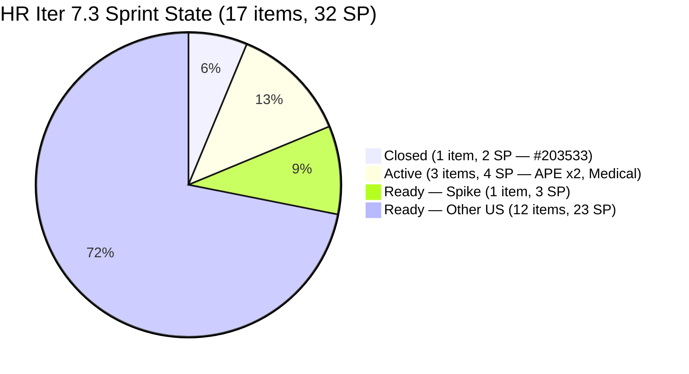
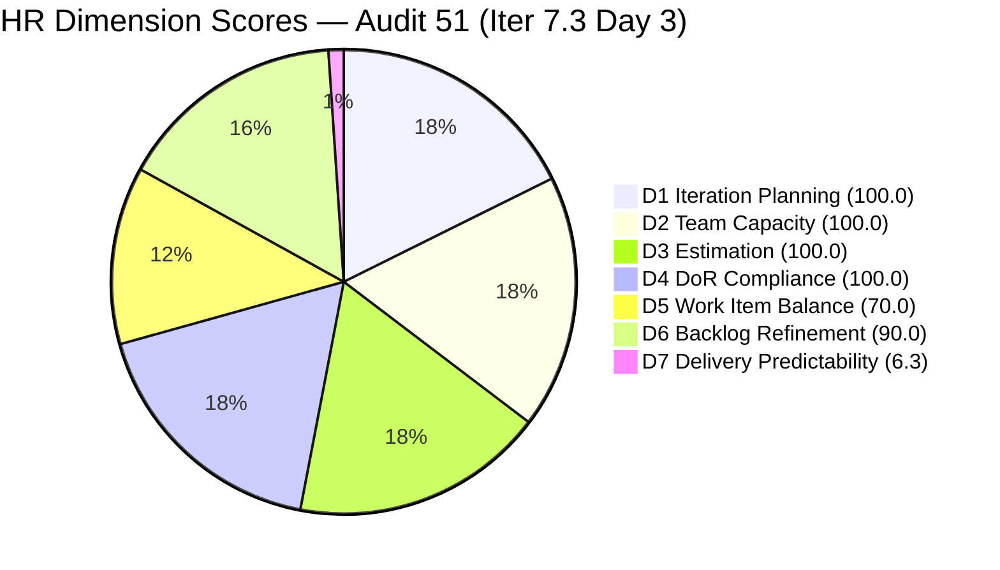
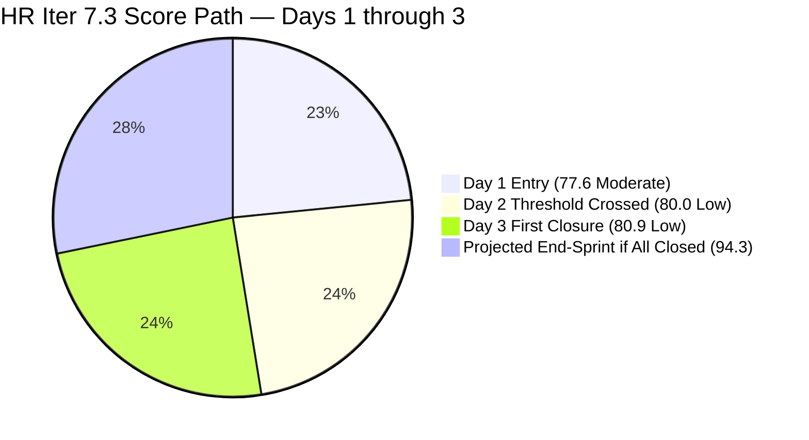
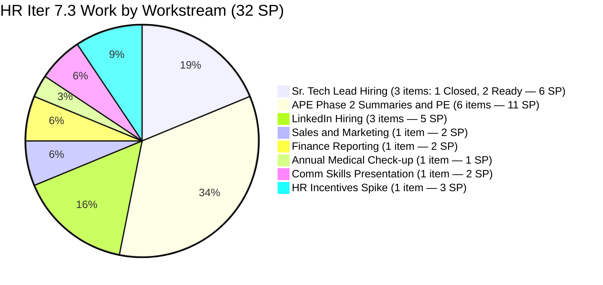

# ADO SAFe Iteration Audit — HR Recruitment Team

**Audit #51 | Iteration 7.3 (May 4 – May 17, 2026) | Day 3 of 14**

---

## 1. Audit Metadata

| Field | Value |
|---|---|
| **Audit Date** | May 6, 2026, 09:03 UTC |
| **Auditor** | Claude Code (ADO SAFe Audit Agent) |
| **Workspace** | `ado_hr` |
| **ADO Project** | Jairosoft FINOPS (`e0bb302f-40f9-46c3-8164-6f1acb317d63`) |
| **Team** | Human Resource Recruitment Team (`248f59a6-372c-4b74-8129-9eaf260f211e`) |
| **Iteration** | Iteration 7.3 — May 4 to May 17, 2026 |
| **Iteration ID** | `d76b8de5-94fe-4b28-987a-263d56afd8d4` |
| **Sprint Day** | Day 3 of 14 |
| **Prior Audit** | AUDIT_20260505_0900.md (Audit #50, Iter 7.3 Day 2, Overall 80.0 — Low Risk) |
| **Scoring Model** | ADO SAFe v1 (7-dimension rubric) |
| **Overall Score** | **80.9 / 100** |
| **Risk Band** | **Low Risk** (≥80) — second consecutive Low Risk day; first sprint closure on record |

---

## 2. Executive Summary

HR Recruitment Team holds **80.9 / 100 (Low Risk)** on Day 3 of Iteration 7.3 — a **+0.9 improvement** from Day 2's 80.0. The team has entered active delivery mode: Almera closed her first item of the sprint (#203533 Sr. Tech Lead Beltran, 2 SP) at 06:35 UTC today, and three more items have moved to Active state.

**Key changes from Day 2 (May 5) to Day 3 (May 6):**

1. **#203533 Closed** — "Sr. Tech Lead — Beltran, Ken Henson (Technical & Hiring Decision)" closed May 6 at 06:35 UTC. 2 SP burned. D7 moves from 0.0 → **6.3** (2/32 SP). Sprint delivery has commenced.
2. **Three items moved to Active** — #202099 (Annual Medical Check-up, changed 06:21), #203536 (APE Tayao, changed 06:20), #203829 (APE Babael, changed 06:21). Work is in active progress across three threads simultaneously.
3. **D6 slight improvement** — #202099 was touched today (no longer untouched). Untouched count drops from 5 (Day 2) to 4: items 202104, 202349, 201273, 197939 all last changed Apr 30. Untouched ratio = 4/17 = 23.5% → still >10% → -10 penalty unchanged. D6 remains 90.0.
4. **Spike #203629 touched May 6 01:16** — minor update (AC/description touch); confirms Almera is actively reviewing this item.

**D7 trajectory:** With 2 SP closed on Day 3, the sprint is on track. Almera's historical pace (12 closures on peak day in prior sprint) suggests acceleration from Day 4 onward. If she closes 3–4 items/day through Week 2, D7 will surpass 50% by Day 7 and approach 100% by Day 12–13.

---

## 3. Previous Audit Delta

| Dimension | Audit #50 (May 5, Day 2, 80.0) | Audit #51 (May 6, Day 3, 80.9) | Delta | Driver |
|---|---|---|---|---|
| Iteration Planning | 100.0 | **100.0** | 0.0 | 17/17 items in Iter 7.3 (unchanged) |
| Team Capacity | 100.0 | **100.0** | 0.0 | Almera 5 pts/day, 1/1 |
| Estimation | 100.0 | **100.0** | 0.0 | 17/17 estimated |
| DoR Compliance | 100.0 | **100.0** | 0.0 | 17/17 pass |
| Work Item Balance | 70.0 | **70.0** | 0.0 | US dominant (16/17); structural |
| Backlog Refinement | 90.0 | **90.0** | 0.0 | 4/17 untouched (23.5%, >10% → -10); #202099 now touched |
| Delivery Predictability | 0.0 | **6.3** | +6.3 | #203533 Closed May 6 06:35 UTC (2 SP / 32 SP) |
| **Overall** | **80.0** | **80.9** | **+0.9** | First closure drives D7 alive; Low Risk maintained |

---

## 4. Current Iteration Snapshot

| Attribute | Value |
|---|---|
| **Iteration** | Iteration 7.3 |
| **Sprint Dates** | May 4 – May 17, 2026 (14 days) |
| **Sprint Day** | Day 3 of 14 |
| **Days Remaining** | 11 |
| **Visible Backlog Items** | 17 (16 open + 1 Closed in Iter 7.3) |
| **Current Sprint Items** | 17 (all in Iter 7.3) |
| **Committed SP** | 32 SP (all 17 items estimated) |
| **Closed SP** | 2 SP (#203533 — 2 SP) |
| **Open SP Remaining** | 30 SP |
| **Capacity** | Almera Kleer Tayao: 5 pts/day (3 Documentation + 2 Requirements); 0 days off |
| **Last ADO Activity** | May 6, 2026, 06:35 UTC — #203533 Closed |
| **Active Items** | #202099 (Annual Medical Check-up), #203536 (APE Tayao), #203829 (APE Babael) |

---

## 5. Work Item Analysis

### Iteration 7.3 — All Sprint Items (17 items)

| ID | Title | Type | State | SP | Assignee | Changed | DoR |
|---|---|---|---|---|---|---|---|
| **203533** | Sr. Tech Lead — Beltran, Ken Henson | US | **Closed** | 2 | Almera | May 6, 06:35 | PASS |
| 202099 | Annual Medical Check-up — Cebu Employees PI7 | US | **Active** | 1 | Almera | May 6, 06:21 | PASS |
| 203536 | APE — Tayao, Almera Kleer | US | **Active** | 2 | Almera | May 6, 06:20 | PASS |
| 203829 | APE — Babael, Samantha (2nd Month PE) | US | **Active** | 1 | Almera | May 6, 06:21 | PASS |
| 203629 | HR Incentives Spike | Spike | Ready | 3 | Almera | May 6, 01:16 | PASS |
| 203825 | Client Interview — Sr. Tech Lead Maraon, Belleo | US | Ready | 2 | Almera | May 5 | PASS |
| 202887 | Sr. Tech Lead — Barua, Marlo | US | Ready | 2 | Almera | May 4 | PASS |
| 203063 | Sales & Mktg. — Angel Dorothy Abina | US | Ready | 2 | Almera | May 4 | PASS |
| 202093 | LinkedIn DevOps Engr. Hiring | US | Ready | 2 | Almera | May 4 | PASS |
| 203534 | LinkedIn Tech Sales from Manila Hiring | US | Ready | 1 | Almera | May 4 | PASS |
| 203535 | APE — Caumban, Karl Jordan | US | Ready | 2 | Almera | May 4 | PASS |
| 203537 | APE — Calvin John Dalino Summary | US | Ready | 2 | Almera | May 4 | PASS |
| 203538 | APE — Ryan Vince Castillo | US | Ready | 2 | Almera | May 4 | PASS |
| 202104 | APE — Rommel Senillo Summary PI7 | US | Ready | 2 | Almera | Apr 30 | PASS |
| 202349 | Finance Reporting & Export | US | Ready | 2 | Almera | Apr 30 | PASS |
| 201273 | LinkedIn Bubble Trainer Hiring — Interview | US | Ready | 2 | Almera | Apr 30 | PASS |
| 197939 | Communication Skills Proposals Summary Presentation | US | Ready | 2 | Almera | Apr 30 | PASS |

**Total: 17 items | 32 SP committed | 2 SP Closed (1 item) | 30 SP remaining**

### #203533 Closure — Impact Assessment

| Detail | Value |
|---|---|
| **Item** | #203533 Sr. Tech Lead — Beltran, Ken Henson (Technical & Hiring Decision) |
| **Closed at** | May 6, 2026, 06:35 UTC |
| **SP** | 2 SP |
| **D7 impact** | 0.0 → 6.3 (2/32 SP) |
| **Overall impact** | 80.0 → 80.9 (+0.9) |
| **Significance** | First sprint closure — breaks zero-D7 streak; delivery in motion |

### Active Items — Work in Progress

| ID | Title | SP | Started | Notes |
|---|---|---|---|---|
| #202099 | Annual Medical Check-up — Cebu Employees | 1 | May 6, 06:21 | Quick win — should close today or Day 4 |
| #203536 | APE — Tayao, Almera Kleer | 2 | May 6, 06:20 | Self-evaluation; target: Day 4–5 |
| #203829 | APE — Babael, Samantha (2nd Month PE) | 1 | May 6, 06:21 | PEF to Ma'am Armie; target: before May 15 deadline |

### Untouched Current Items (unchanged since before sprint start)

| ID | Title | Last Changed | Notes |
|---|---|---|---|
| #202104 | APE — Rommel Senillo Summary PI7 | Apr 30 | 6 days pre-sprint |
| #202349 | Finance Reporting & Export | Apr 30 | 6 days pre-sprint |
| #201273 | LinkedIn Bubble Trainer Hiring — Interview | Apr 30 | 6 days pre-sprint |
| #197939 | Comm Skills Proposals Summary Presentation | Apr 30 | 6 days pre-sprint |

4/17 = 23.5% untouched → -10 penalty on D6 (under the 30% threshold).

---

## 6. SAFe Compliance Scorecard

| Dimension | Score | Evidence | Notes |
|---|---|---|---|
| **D1 Iteration Planning** | **100.0** | 17 / 17 visible items in Iter 7.3 | Excellent — all items in sprint |
| **D2 Team Capacity** | **100.0** | Almera configured 5 pts/day; 1/1 contributor | No change |
| **D3 Estimation** | **100.0** | 17/17 items estimated (SP > 0) | No change |
| **D4 DoR Compliance** | **100.0** | 17/17 pass Description + AC | No change |
| **D5 Work Item Balance** | **70.0** | US present (16/17); dominant US > 60% → -30; Spike 5.9% < 40% | Structural — HR team composition |
| **D6 Backlog Refinement** | **90.0** | 17/17 fresh; 0 stale_90; 0 stale_180; 4/17 untouched (23.5% → -10) | #202099 now active; untouched dropped from 5 to 4 |
| **D7 Delivery Predictability** | **6.3** | 2/32 SP closed (#203533, 2 SP; closed May 6 06:35 UTC) | Day 3 — sprint delivery underway |
| **Overall** | **80.9** | (100+100+100+100+70+90+6.3) / 7 = 566.3 / 7 = 80.9 | **Low Risk** — second consecutive day at Low Risk |

---

## 7. Dimension Findings

### D1 — Iteration Planning: 100.0

```
visible_root_backlog_items   = 17 (16 open + 1 Closed in Iter 7.3 = 203533)
current_iteration_root_items = 17 (all 17 assigned to Iter 7.3)
D1 = (17 / 17) × 100 = 100.0
```

#203533 dropped from the live backlog query as it is now Closed, but remains counted as a current-iteration item for D1 purposes. All 17 items are committed to Iter 7.3.

### D2 — Team Capacity: 100.0

```
contributors_with_current_work = 1   (Almera Kleer Tayao — all 17 items)
contributors_with_capacity = 1       (5 pts/day: 3 Documentation + 2 Requirements)
D2 = (1 / 1) × 100 = 100.0
```

No change. Almera is the sole active contributor with all capacity configured.

### D3 — Estimation: 100.0

```
point_eligible_current_items = 17
estimated_current_items = 17   (all items SP > 0; Spike 203629 = 3 SP)
D3 = (17 / 17) × 100 = 100.0
```

All sprint items carry Story Points. Total committed SP = 32.

### D4 — DoR Compliance: 100.0

```
current_iteration_root_items = 17
dor_compliant_current_items  = 17   (all pass Description ≥30 chars + AC ≥20 chars)
D4 = (17 / 17) × 100 = 100.0
```

All items maintain DoR compliance from Day 2. No regressions.

### D5 — Work Item Balance: 70.0

```
Type breakdown (17 current items):
  User Story: 16/17 = 94.1%
  Spike:       1/17 = 5.9%

User Story present → no -40 penalty
Dominant type (US at 94.1% > 60%) → -30
Spike share (5.9% < 40%) → no penalty

D5 = 100 - 30 = 70.0
```

Structurally stable. The HR team's recruitment and APE workstreams naturally produce US-dominated sprints. The single Spike (#203629 HR Incentives) adds appropriate research diversity.

### D6 — Backlog Refinement: 90.0

```
Freshness cutoff: May 6 − 45 = Mar 22, 2026
Stale_90 cutoff:  Feb 5, 2026
Stale_180 cutoff: Nov 9, 2025

fresh_visible_root_items = 17   (all items changed Apr 27–May 6; oldest = Apr 30)
Base: (17/17) × 100 = 100.0

Stale penalties:
  stale_90 items = 0
  stale_180 items = 0

Untouched current items (changed before sprint start May 4, 00:00 UTC):
  202104 (Apr 30), 202349 (Apr 30), 201273 (Apr 30), 197939 (Apr 30) = 4 items
  Note: 202099 removed from untouched list (now Active, changed May 6)
  Ratio = 4/17 = 23.5% → >10% but ≤30% → -10

D6 = 100.0 - 10 = 90.0
```

D6 holds at 90.0. The 4 remaining untouched items (Apr 30 vintage) will naturally clear as Almera works them this week. The penalty should fully drop once she touches these items — estimated Day 4–6 based on current pace.

### D7 — Delivery Predictability: 6.3

```
committed_story_points = 32
closed_story_points = 2   (#203533 Sr. Tech Lead Beltran: 2 SP, closed May 6 06:35 UTC)
D7 = (2 / 32) × 100 = 6.3
```

Sprint delivery has begun. The first closure (#203533) was a 2-SP Sr. Tech Lead hiring decision item — one of the more complex workflow items in the sprint. This establishes the hiring pipeline thread as the first area of delivery.

**D7 projection:** Based on 11 days remaining at Almera's observed pace (3 Active items today, historical peak 12/day), realistic scenarios:
- Conservative (1–2 items/day): D7 reaches ~60% by Day 10
- Moderate (2–3 items/day): D7 reaches ~80% by Day 10
- If all 17 items closed: D7 = 100.0; Overall = ~94.3

### Overall Score Calculation

```
D1  = 100.0
D2  = 100.0
D3  = 100.0
D4  = 100.0
D5  =  70.0
D6  =  90.0
D7  =   6.3

Overall = (100.0 + 100.0 + 100.0 + 100.0 + 70.0 + 90.0 + 6.3) / 7
        = 566.3 / 7
        = 80.9
```

**Overall: 80.9 / 100 — Low Risk**

---

## 8. Risks and Bottlenecks

| # | Risk | Severity | Owner | Status |
|---|---|---|---|---|
| R1 | **Bus factor = 1** — All 17 items on Almera; no backup | High | Structural | Persistent all PI7 audits |
| R2 | **DevOps Engr. hiring (#202093) — 6+ sprint carry** — Active since PI6 with no closed candidate | Moderate | Almera | Escalation warranted — is the role still open? |
| R3 | **4 untouched items (Apr 30)** — 202104, 202349, 201273, 197939 not yet started | Moderate | Almera | Monitor — should clear Day 4–6 |
| R4 | **No Iteration Goal defined** — Persistent across all PI7 audits | Moderate | Almera / Ramon | Unfixed — 16+ audits |
| R5 | **APE batch scope (6 items, 11 SP)** — 3 APE items now Active simultaneously | Low | Almera | Normal load; monitor throughput |
| R6 | **#203629 Spike deliverable format** — Research doc vs ADO attachment not yet confirmed | Low | Almera | Touched May 6 01:16; verify closure criteria |

---

## 9. Prioritized Recommendations

1. **[Day 3–4] Close Active items quickly.** Three items are Active: #202099 (1 SP, Annual Medical Check-up — simplest; should close today), #203829 (1 SP, APE Babael — PEF to Armie; may close Day 4), #203536 (2 SP, APE Tayao — self-evaluation; Day 4–5). Closing all three raises D7 from 6.3 → 18.8 and confirms active sprint pace.

2. **[Day 3] Define Iteration 7.3 Goal.** Suggested: *"Complete Sr. Tech Lead hiring decisions for Beltran (done), Barua, and Maraon; deliver APE Phase 2 summaries for 5 employees and 2nd-month PE for Samantha; advance LinkedIn hiring pipelines for DevOps and Tech Sales; and deliver HR incentives framework research."*

3. **[Day 4] Escalate DevOps Engr. hiring (#202093).** Six-plus sprints of carry-forward with no closure. Almera should review: Is the JD still relevant? Has sourcing reached qualified candidates? Recommend a go/no-go decision with Ramon by Day 5.

4. **[Week 1] Confirm Spike #203629 deliverable format.** Touched today (May 6 01:16) — good sign. Ensure the output format is agreed: Research Summary doc + draft Scaling Matrix. A clear output agreement prevents last-minute scope uncertainty at close.

5. **[Structural] Delegate one item to Grace.** Grace (grace@jairosoft.com) has team membership. Even one item assigned to Grace as co-owner reduces the bus factor signal and demonstrates distributed planning.

---

## 10. Evidence Gaps and Limitations

| Gap | Impact | Mitigation |
|---|---|---|
| No iteration goal in ADO | Sprint goal execution unmeasurable | Persistent — 16+ audits; add today |
| Grace (0 capacity items in HR, not in capacity plan) | Not counted in D2 | Correctly excluded |
| #202093 DevOps hiring — no visible pipeline progress | Stale role; unclear demand | Escalate go/no-go to Ramon |
| #203629 Spike — no confirmed output format | Closure criteria unclear | Verify format with Almera |
| #203533 dropped from live backlog after Closed | D1 counts closed items in current iteration — correctly included | Standard behavior |

---

## 11. Mermaid Charts

### Iter 7.3 Sprint Progress — Day 3



### Dimension Score Breakdown — Audit 51



### HR Score Trajectory — Iter 7.3 Days 1–3



### Sprint Workstream Breakdown (by SP)



---

*Report generated: 2026-05-06 09:03 UTC | Workspace: ado_hr | Iteration 7.3 Day 3 | Score: 80.9 Low Risk*
*Key change from Day 2: #203533 Closed (2 SP — Sr. Tech Lead Beltran hiring decision completed); 3 items moved to Active (#202099, #203536, #203829). D7 = 6.3. Low Risk maintained for second consecutive audit. 30 SP remaining over 11 days.*
