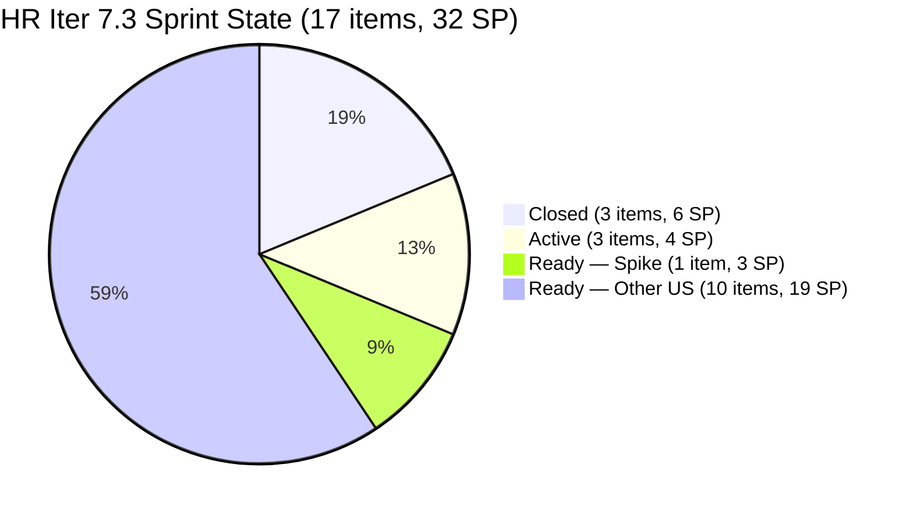
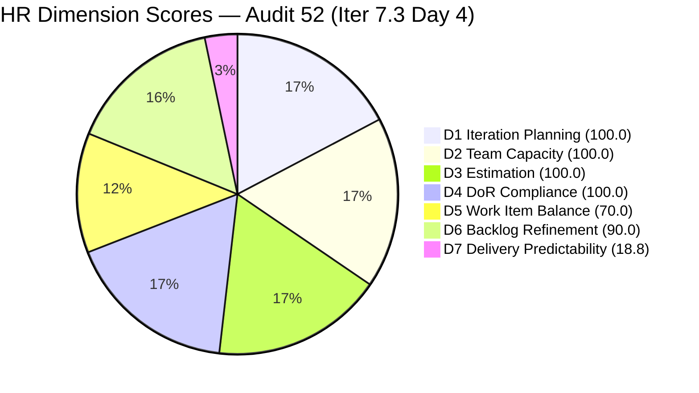
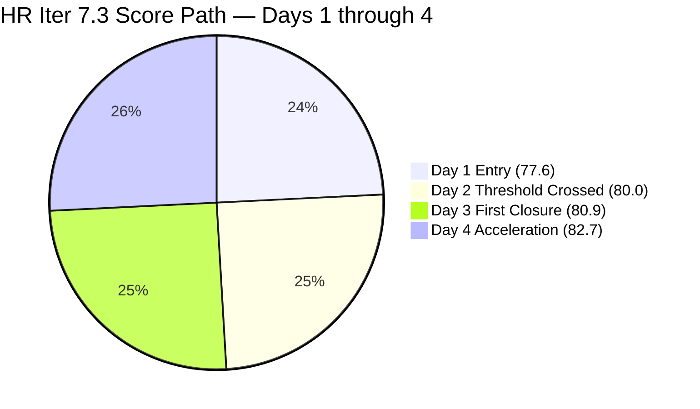
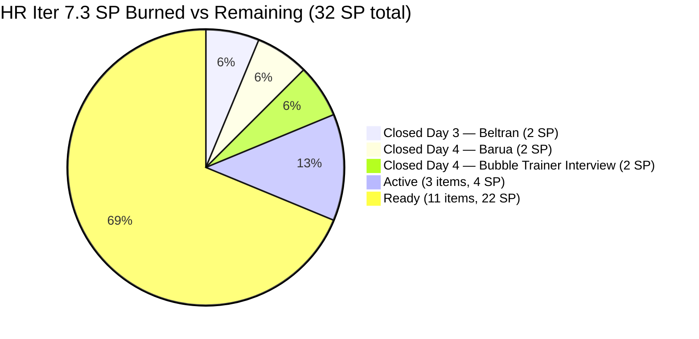

# ADO SAFe Iteration Audit — HR Recruitment Team

**Audit #52 | Iteration 7.3 (May 4 – May 17, 2026) | Day 4 of 14**

---

## 1. Audit Metadata

| Field | Value |
|---|---|
| **Audit Date** | May 7, 2026, 23:08 UTC |
| **Auditor** | Claude Code (ADO SAFe Audit Agent) |
| **Workspace** | `ado_hr` |
| **ADO Project** | Jairosoft FINOPS (`e0bb302f-40f9-46c3-8164-6f1acb317d63`) |
| **Team** | Human Resource Recruitment Team (`248f59a6-372c-4b74-8129-9eaf260f211e`) |
| **Iteration** | Iteration 7.3 — May 4 to May 17, 2026 |
| **Iteration ID** | `d76b8de5-94fe-4b28-987a-263d56afd8d4` |
| **Sprint Day** | Day 4 of 14 |
| **Prior Audit** | AUDIT_20260506_0903.md (Audit #51, Iter 7.3 Day 3, Overall 80.9 — Low Risk) |
| **Scoring Model** | ADO SAFe v1 (7-dimension rubric) |
| **Overall Score** | **82.7 / 100** |
| **Risk Band** | **Low Risk** (≥80) — third consecutive Low Risk day; sprint acceleration confirmed |

---

## 2. Executive Summary

HR Recruitment Team reaches **82.7 / 100 (Low Risk)** on Day 4 of Iteration 7.3 — a **+1.8 improvement** from Day 3's 80.9. Almera closed two more items this morning in rapid succession, confirming the acceleration pattern observed from Day 3.

**Key changes from Day 3 (May 6) to Day 4 (May 7):**

1. **#202887 CLOSED** — "Sr. Tech Lead — Barua, Marlo" closed May 7 at 06:39 UTC (2 SP). Second Sr. Tech Lead hiring decision resolved.
2. **#201273 CLOSED** — "LinkedIn Bubble Trainer Hiring — Interview" closed May 7 at 06:44 UTC (2 SP). Previously an untouched item (Apr 30), now closed.
3. **Total closed SP rises to 6 (3 items)**. D7 moves from 6.3 → **18.8** (6/32 SP).
4. **Untouched count drops from 4 to 3.** #201273 was on the untouched list (Apr 30) but is now Closed (changed May 7). Remaining untouched: #202104, #202349, #197939 = 3/17 = 17.6% → still >10% → -10 penalty on D6 unchanged.
5. **Three items remain Active** (unchanged from Day 3): #202099 (Annual Medical Check-up, 1 SP), #203536 (APE Tayao, 2 SP), #203829 (APE Babael, 1 SP). These are the next expected closures.

**Trend:** Almera has now closed 3 items (6 SP) in 4 days. At this pace (roughly 1.5 items/day), the sprint completes around Day 11–12. The Day 2 audit projections are tracking well.

---

## 3. Previous Audit Delta

| Dimension | Audit #51 (May 6, Day 3, 80.9) | Audit #52 (May 7, Day 4, 82.7) | Delta | Driver |
|---|---|---|---|---|
| Iteration Planning | 100.0 | **100.0** | 0.0 | 17/17 items in Iter 7.3 |
| Team Capacity | 100.0 | **100.0** | 0.0 | Almera 5 pts/day; 1/1 |
| Estimation | 100.0 | **100.0** | 0.0 | 17/17 estimated |
| DoR Compliance | 100.0 | **100.0** | 0.0 | 17/17 pass |
| Work Item Balance | 70.0 | **70.0** | 0.0 | US dominant 94.1%; structural |
| Backlog Refinement | 90.0 | **90.0** | 0.0 | 3/17 untouched (17.6% → -10); improved from 4 |
| Delivery Predictability | 6.3 | **18.8** | +12.5 | Two new closures: #202887 (2 SP) + #201273 (2 SP) |
| **Overall** | **80.9** | **82.7** | **+1.8** | Sprint delivery accelerating; Low Risk maintained |

---

## 4. Current Iteration Snapshot

| Attribute | Value |
|---|---|
| **Iteration** | Iteration 7.3 |
| **Sprint Dates** | May 4 – May 17, 2026 (14 days) |
| **Sprint Day** | Day 4 of 14 |
| **Days Remaining** | 10 |
| **Visible Backlog Items (open)** | 14 |
| **Total Current Sprint Items** | 17 (14 open + 3 Closed in Iter 7.3) |
| **Committed SP** | 32 SP (17 items, all estimated) |
| **Closed SP** | 6 SP (#203533: 2, #202887: 2, #201273: 2) |
| **Open SP Remaining** | 26 SP |
| **Capacity** | Almera Kleer Tayao: 5 pts/day (3 Doc + 2 Req); Grace: 0.25 pts/day Doc |
| **Last ADO Activity** | May 7, 2026, 06:44 UTC — #201273 Closed |
| **Active Items** | #202099 (Annual Medical Check-up, 1 SP), #203536 (APE Tayao, 2 SP), #203829 (APE Babael, 1 SP) |

---

## 5. Work Item Analysis

### Iteration 7.3 — All Sprint Items (17 items)

| ID | Title | Type | State | SP | Assignee | Changed | DoR |
|---|---|---|---|---|---|---|---|
| **203533** | Sr. Tech Lead — Beltran, Ken Henson | US | **Closed** | 2 | Almera | May 6, 06:35 | PASS |
| **202887** | Sr. Tech Lead — Barua, Marlo | US | **Closed** | 2 | Almera | May 7, 06:39 | PASS |
| **201273** | LinkedIn Bubble Trainer Hiring — Interview | US | **Closed** | 2 | Almera | May 7, 06:44 | PASS |
| 202099 | Annual Medical Check-up — Cebu Employees PI7 | US | **Active** | 1 | Almera | May 6, 06:21 | PASS |
| 203536 | APE — Tayao, Almera Kleer (Sprint 7.3) | US | **Active** | 2 | Almera | May 6, 06:20 | PASS |
| 203829 | APE — Babael, Samantha (2nd Month PE) | US | **Active** | 1 | Almera | May 6, 06:21 | PASS |
| 203629 | HR Discussion on Employees Incentives, Scaling of Bonuses | Spike | Ready | 3 | Almera | May 6, 01:16 | PASS |
| 203825 | Client Interview — Sr. Tech Lead Maraon, Belleo | US | Ready | 2 | Almera | May 5 | PASS |
| 203063 | Sales & Mktg. — Angel Dorothy Abina | US | Ready | 2 | Almera | May 4 | PASS |
| 202093 | LinkedIn DevOps Engr. Hiring | US | Ready | 2 | Almera | May 4 | PASS |
| 203534 | LinkedIn Tech Sales from Manila Hiring | US | Ready | 1 | Almera | May 4 | PASS |
| 203535 | APE — Caumban, Karl Jordan | US | Ready | 2 | Almera | May 4 | PASS |
| 203537 | APE — Calvin John Dalino Summary | US | Ready | 2 | Almera | May 4 | PASS |
| 203538 | APE — Ryan Vince Castillo | US | Ready | 2 | Almera | May 4 | PASS |
| 202104 | APE — Rommel Senillo Summary PI7 | US | Ready | 2 | Almera | Apr 30 | PASS |
| 202349 | Finance Reporting & Export | US | Ready | 2 | Almera | Apr 30 | PASS |
| 197939 | Communication Skills Proposals Summary Presentation | US | Ready | 2 | Almera | Apr 30 | PASS |

**Total: 17 items | 32 SP committed | 6 SP Closed (3 items) | 26 SP remaining**

### Today's Closures — Day 4 Impact

| Item | Title | Closed At | SP | D7 Impact |
|---|---|---|---|---|
| #202887 | Sr. Tech Lead — Barua, Marlo | May 7, 06:39 UTC | 2 | +6.3 to D7 |
| #201273 | LinkedIn Bubble Trainer Hiring — Interview | May 7, 06:44 UTC | 2 | +6.3 to D7 |

Combined Day 4 impact: D7 rises from 6.3 (Day 3) → 18.8 (Day 4). Both closures were in the Sr. Tech Lead hiring and LinkedIn pipelines — the two high-velocity workstreams this sprint.

### Active Items — Work in Progress

| ID | Title | SP | Started | Notes |
|---|---|---|---|---|
| #202099 | Annual Medical Check-up — Cebu Employees | 1 | May 6, 06:21 | Simplest item; expected close Day 4–5 |
| #203536 | APE — Tayao, Almera Kleer | 2 | May 6, 06:20 | Self-evaluation; target: Day 5–6 |
| #203829 | APE — Babael, Samantha (2nd Month PE) | 1 | May 6, 06:21 | PEF to Ma'am Armie; deadline May 15 |

### Untouched Current Items (changed before May 4, 00:00 UTC)

| ID | Title | Last Changed | Notes |
|---|---|---|---|
| #202104 | APE — Rommel Senillo Summary PI7 | Apr 30 | Untouched 7 days |
| #202349 | Finance Reporting & Export | Apr 30 | Untouched 7 days |
| #197939 | Comm Skills Proposals Summary Presentation | Apr 30 | Untouched 7 days |

3/17 = 17.6% untouched → -10 penalty on D6. Note: #201273 (previously Apr 30) cleared from untouched list via closure today.

---

## 6. SAFe Compliance Scorecard

| Dimension | Score | Evidence | Notes |
|---|---|---|---|
| **D1 Iteration Planning** | **100.0** | 17 / 17 visible items in Iter 7.3 | Excellent |
| **D2 Team Capacity** | **100.0** | Almera 5 pts/day (1/1 contributors with work) | Grace 0.25 pts/day; no assigned items — excluded |
| **D3 Estimation** | **100.0** | 17/17 items estimated (SP > 0) | No change |
| **D4 DoR Compliance** | **100.0** | 17/17 pass Description ≥30 chars + AC ≥20 chars | No change |
| **D5 Work Item Balance** | **70.0** | US present (16/17 = 94.1% > 60% → -30); Spike 5.9% | Structural; HR recruitment workstream |
| **D6 Backlog Refinement** | **90.0** | 17/17 fresh; 0 stale; 3/17 untouched (17.6% → -10) | #201273 cleared from untouched (closed May 7) |
| **D7 Delivery Predictability** | **18.8** | 6/32 SP closed (#203533:2 + #202887:2 + #201273:2) | Day 4 sprint acceleration (+12.5 from Day 3) |
| **Overall** | **82.7** | (100+100+100+100+70+90+18.8) / 7 = 578.8 / 7 = 82.7 | **Low Risk** — third consecutive Low Risk audit |

---

## 7. Dimension Findings

### D1 — Iteration Planning: 100.0

```
visible_root_backlog_items   = 17 (14 open + 3 Closed in Iter 7.3)
current_iteration_root_items = 17 (all assigned Iter 7.3)
D1 = (17 / 17) × 100 = 100.0
```

The 3 closed items (#203533, #202887, #201273) are no longer visible in the live backlog query but are counted in both numerator and denominator as they remain assigned to Iter 7.3. All items are committed to the current sprint.

### D2 — Team Capacity: 100.0

```
contributors_with_current_work = 1  (Almera Kleer Tayao — all 17 items)
contributors_with_capacity     = 1  (5 pts/day: 3 Doc + 2 Req)
D2 = (1 / 1) × 100 = 100.0
```

Grace (grace@jairosoft.com) has 0.25 pts/day capacity configured but no assigned sprint items — correctly excluded from D2. Almera remains the sole active contributor.

### D3 — Estimation: 100.0

```
point_eligible_current_items = 17
estimated_current_items = 17  (all SP > 0; total committed SP = 32)
D3 = (17 / 17) × 100 = 100.0
```

All 17 items carry Story Points. No regressions.

### D4 — DoR Compliance: 100.0

```
current_iteration_root_items = 17
dor_compliant_current_items  = 17  (all pass Description ≥30 + AC ≥20 chars)
D4 = (17 / 17) × 100 = 100.0
```

All items maintain full DoR. No regressions.

### D5 — Work Item Balance: 70.0

```
Type breakdown (17 items):
  User Story: 16/17 = 94.1%
  Spike:       1/17 = 5.9%

User Story present → no -40 penalty
Dominant type (US 94.1% > 60%) → -30
Spike share (5.9% < 40%) → no penalty

D5 = 100 - 30 = 70.0
```

Structurally stable. The HR team's recruitment and APE workstreams produce US-dominant sprints. The Spike (#203629 HR Incentives) adds appropriate research diversity but the US dominance ceiling at 70.0 is a permanent structural constraint unless the team diversifies work item types.

### D6 — Backlog Refinement: 90.0

```
Freshness cutoff: May 7 − 45 = Mar 23, 2026
Stale_90 cutoff:  Feb 6, 2026
Stale_180 cutoff: Nov 9, 2025

fresh_visible_root_items = 17  (oldest = Apr 30)
Base: (17/17) × 100 = 100.0

Stale penalties:
  stale_90 items = 0 → no penalty
  stale_180 items = 0 → no penalty

Untouched current items (changed before sprint start May 4, 00:00 UTC):
  #202104 (Apr 30), #202349 (Apr 30), #197939 (Apr 30) = 3 items
  Note: #201273 (Apr 30) removed — closed May 7 (now changed May 7)
  Ratio = 3/17 = 17.6% → >10% but ≤30% → -10

D6 = 100.0 - 10 = 90.0
```

D6 holds at 90.0. One previously-untouched item (#201273) was closed today, improving the ratio from 4/17 (23.5%) to 3/17 (17.6%). The -10 penalty will clear once Almera touches or closes #202104, #202349, and #197939 — all are scheduled for this sprint.

### D7 — Delivery Predictability: 18.8

```
committed_story_points = 32
closed_story_points = 6
  #203533 Sr. Tech Lead Beltran:  2 SP (May 6, 06:35 UTC)
  #202887 Sr. Tech Lead Barua:    2 SP (May 7, 06:39 UTC)
  #201273 Bubble Trainer Hiring:  2 SP (May 7, 06:44 UTC)
D7 = (6 / 32) × 100 = 18.8
```

Sprint delivery has accelerated significantly. Two closures today (06:39 and 06:44 UTC — just 5 minutes apart) confirm Almera's batch-closure pattern from prior sprints. The hiring pipeline thread (3 items in 2 days) is the fastest-moving workstream.

**D7 projection with 10 days remaining:**
- At current pace (1.5 items/day avg), 15 more items will close → sprint completes by Day ~14
- If pace accelerates (2–3 items/day as seen in PI6 peak days), completion could reach Day 10–11
- Conservative estimate (1 item/day): D7 reaches ~56% by Day 14 (9 more items, 18 SP)
- Moderate estimate (1.5 items/day): Sprint ~85–90% complete by Day 14

### Overall Score Calculation

```
D1  = 100.0
D2  = 100.0
D3  = 100.0
D4  = 100.0
D5  =  70.0
D6  =  90.0
D7  =  18.8

Overall = (100.0 + 100.0 + 100.0 + 100.0 + 70.0 + 90.0 + 18.8) / 7
        = 578.8 / 7
        = 82.7
```

**Overall: 82.7 / 100 — Low Risk**

---

## 8. Risks and Bottlenecks

| # | Risk | Severity | Owner | Status |
|---|---|---|---|---|
| R1 | **Bus factor = 1** — All 17 items on Almera; no backup | High | Structural | Persistent all PI7 audits |
| R2 | **DevOps Engr. hiring (#202093) — 6+ sprint carry** — No closed candidate across PI6 + PI7 | Moderate | Almera | Go/no-go decision overdue |
| R3 | **3 untouched items (Apr 30)** — #202104, #202349, #197939 | Low | Almera | Expected to clear Day 5–7 |
| R4 | **No Iteration Goal defined** — Persistent all PI7 | Moderate | Almera / Ramon | Unfixed — 17+ audits |
| R5 | **APE batch (5 items, 9 SP remaining)** — 3 Active, 2 in Ready queue | Low | Almera | Normal load; monitor throughput |
| R6 | **Spike #203629 deliverable format** — Research doc vs ADO attachment not confirmed | Low | Almera | Week 2 target; clarify output format |

---

## 9. Prioritized Recommendations

1. **[Day 4–5] Close the 3 Active items.** #202099 (1 SP, Annual Medical Check-up) is the simplest item in the sprint and should close today. #203829 (1 SP, APE Babael) requires PEF submission to Ma'am Armie — send today. #203536 (2 SP, APE Tayao) is self-evaluation; target Day 5. Closing all three raises D7 from 18.8 → 31.3 (10/32 SP) and pushes Overall above 84.

2. **[Day 5] Define Iteration 7.3 Goal.** Suggested: *"Complete Sr. Tech Lead hiring decisions and LinkedIn pipelines; deliver APE Phase 2 summaries for 5 employees and 2nd-month PE for Samantha; advance DevOps and Tech Sales sourcing; deliver HR incentives framework research."*

3. **[Day 5] Escalate DevOps Engr. hiring (#202093).** This role has been open across PI6 and PI7 with no closure. The item description still targets Iteration 6.5 as the goal. Either close the role as filled/cancelled, or escalate with Ramon to confirm the active hiring need.

4. **[Day 5] Begin APE batch for remaining employees.** Four APE items remain in Ready state (#202104 Rommel, #203535 Karl Jordan, #203537 Calvin John, #203538 Ryan Vince). Starting Rommel's APE first clears the oldest untouched item (#202104, Apr 30) and removes the D6 stale penalty once all three Apr 30 items are touched.

5. **[Structural] Consider delegating one item to Grace.** Grace has 0.25 pts/day capacity but no sprint assignments. Even the lowest-SP item reduces the bus factor signal.

---

## 10. Evidence Gaps and Limitations

| Gap | Impact | Mitigation |
|---|---|---|
| No iteration goal in ADO | Sprint goal execution unmeasurable | Persistent — 17+ audits; add today |
| Grace (0.25 pts/day capacity, no sprint items) | Not counted in D2 | Correctly excluded per skill definition |
| #202093 DevOps Engr. — no visible pipeline progress | Stale role; 6+ sprint carry | Escalate go/no-go to Ramon by Day 5 |
| #203629 Spike — deliverable format unconfirmed | Closure criteria unclear | Confirm output format with Almera |
| Closed items (#203533, #202887, #201273) dropped from live backlog | D1 denominator adjusted to include all Iter 7.3 items | Standard behavior; consistent with prior audits |

---

## 11. Mermaid Charts

### Iter 7.3 Sprint Progress — Day 4



### Dimension Score Breakdown — Audit 52



### HR Score Trajectory — Iter 7.3 Days 1–4



### Sprint Delivery Progress (SP Burned)



---

*Report generated: 2026-05-07 23:08 UTC | Workspace: ado_hr | Iteration 7.3 Day 4 | Score: 82.7 Low Risk*
*Key changes from Day 3: #202887 Closed May 7 06:39 (2 SP — Sr. Tech Lead Barua hiring decision); #201273 Closed May 7 06:44 (2 SP — Bubble Trainer Interview). Total closed = 6 SP (3 items). D7 = 18.8. Low Risk maintained — third consecutive day. Untouched dropped from 4 to 3. 10 days, 26 SP remaining.*
