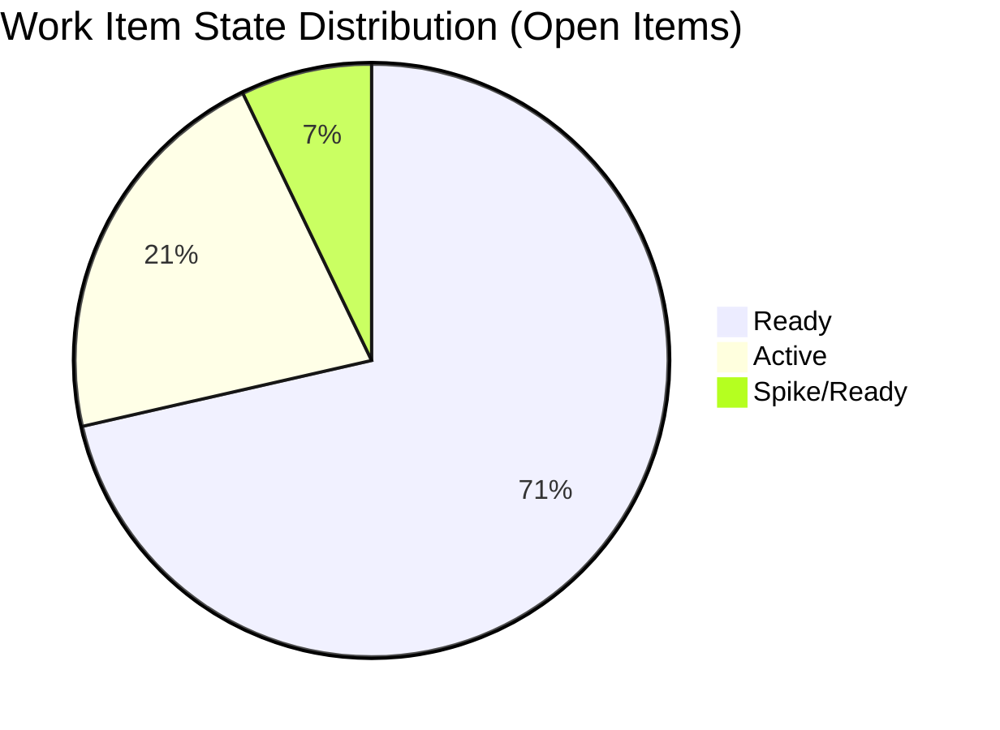

# ADO SAFe Iteration Audit — HR Recruitment Team

**Audit #53 | Iteration 7.3 (May 4 – May 17, 2026) | Day 5 of 14**

---

## 1. Audit Metadata

| Field | Value |
|---|---|
| **Audit Date** | May 8, 2026, 09:00 PHT (UTC+8) |
| **Auditor** | Claude Code (ADO SAFe Audit Agent) |
| **Workspace** | `ado_hr` |
| **ADO Project** | Jairosoft FINOPS (`e0bb302f-40f9-46c3-8164-6f1acb317d63`) |
| **Team** | Human Resource Recruitment Team (`248f59a6-372c-4b74-8129-9eaf260f211e`) |
| **Iteration** | Iteration 7.3 — May 4 to May 17, 2026 |
| **Iteration ID** | `d76b8de5-94fe-4b28-987a-263d56afd8d4` |
| **Sprint Day** | Day 5 of 14 |
| **Prior Audit** | AUDIT_20260507_2308.md (Audit #52, Iter 7.3 Day 4, Overall 82.7 — Low Risk) |
| **Scoring Model** | ADO SAFe v1 (7-dimension rubric) |
| **Overall Score** | **82.7 / 100** |
| **Risk Band** | **Low Risk** (≥80) |

---

## 2. Executive Summary

HR Recruitment Team holds **82.7 / 100 (Low Risk)** on Day 5 of Iteration 7.3 — **unchanged from Day 4**. No new closures were recorded between the May 7 audit and this morning's evidence window. The three Active items remain open, and the seven Ready-state items are still queued.

The sprint is progressing at pace. Almera Kleer Tayao has closed 3 items (6 SP out of 32 committed, 18.8%) in the first four days. The remaining 14 open items span Ready (10 items), Active (3 items), and one Spike. At the Day 3–4 closing rate of ~1.5 items/day, sprint completion is projected around Day 11–12.

**Key observations on Day 5:**
- No new closures detected since Day 4's #201273 (May 7, 06:44 UTC).
- Three Active items (#202099 Medical Check-up 1 SP, #203536 APE Tayao 2 SP, #203829 APE Babael 1 SP) are the next expected closures.
- Seven items changed only on May 4 (batch-loaded on sprint start) remain untouched (3 pre-sprint, rest May 4 start-day). The 3 pre-sprint untouched items (202104, 202349, 197939 — all Apr 30) continue to generate a -10 Backlog Refinement penalty.
- Single-contributor risk (Almera) remains the dominant structural concern; Grace holds 0.25 pts/day capacity.

---

## 3. Previous Audit Delta

| Dimension | Audit #52 (May 7, Day 4, 82.7) | Audit #53 (May 8, Day 5, 82.7) | Delta | Driver |
|---|---|---|---|---|
| Iteration Planning | 100.0 | **100.0** | 0.0 | 17/17 items in Iter 7.3 (open 14 + closed 3) |
| Team Capacity | 100.0 | **100.0** | 0.0 | Almera 5 pts/day; Grace 0.25 pts/day — both configured |
| Estimation | 100.0 | **100.0** | 0.0 | 17/17 items estimated |
| DoR Compliance | 100.0 | **100.0** | 0.0 | 17/17 pass Description + AC |
| Work Item Balance | 70.0 | **70.0** | 0.0 | User Story present; dominant at 94.1% (-30) |
| Backlog Refinement | 90.0 | **90.0** | 0.0 | 3/17 untouched (17.6% → -10); all fresh |
| Delivery Predictability | 18.8 | **18.8** | 0.0 | No new closures since May 7 |
| **Overall** | **82.7** | **82.7** | **0.0** | Static day; sprint pace maintained |

---

## 4. Current Iteration Snapshot

| Attribute | Value |
|---|---|
| **Iteration** | Iteration 7.3 |
| **Sprint Dates** | May 4 – May 17, 2026 (14 days) |
| **Sprint Day** | Day 5 of 14 |
| **Days Remaining** | 9 |
| **Visible Backlog Items (open)** | 14 |
| **Total Current Sprint Items** | 17 (14 open + 3 Closed) |
| **Committed SP** | 32 SP (17 items × confirmed estimates) |
| **Closed SP** | 6 SP (#203533: 2, #202887: 2, #201273: 2) |
| **Open SP Remaining** | 26 SP |
| **Capacity** | Almera: 5 pts/day (3 Documentation + 2 Requirements); Grace: 0.25 pts/day Documentation |
| **Last ADO Activity** | May 7, 2026, 06:44 UTC — #201273 Closed |
| **Active Items** | #202099 (Medical Check-up, 1 SP), #203536 (APE Tayao, 2 SP), #203829 (APE Babael, 1 SP) |

---

## 5. Work Item Analysis

### Iteration 7.3 — All Current Sprint Items (17 items)

| ID | Title | Type | State | SP | Assignee | Changed | DoR |
|---|---|---|---|---|---|---|---|
| 203825 | Client Interview — Maraon, Belleo | User Story | Ready | 2 | Almera | May 5 | Pass |
| 203829 | APE — Babael, Samantha (2nd Month) | User Story | Active | 1 | Almera | May 6 | Pass |
| 203063 | Sales & Mktg — Angel Dorothy Abina | User Story | Ready | 2 | Almera | May 4 | Pass |
| 202093 | LinkedIn DevOps Engr. Hiring | User Story | Ready | 2 | Almera | May 4 | Pass |
| 203534 | LinkedIn Tech Sales Manila (Sprint 7.3) | User Story | Ready | 1 | Almera | May 4 | Pass |
| 203535 | APE — Caumban, Karl Jordan (7.3) | User Story | Ready | 2 | Almera | May 4 | Pass |
| 203536 | APE — Tayao, Almera Kleer (7.3) | User Story | Active | 2 | Almera | May 6 | Pass |
| 202104 | APE — Rommel Senillo Summary PI7 | User Story | Ready | 2 | Almera | Apr 30 | Pass |
| 203537 | APE — Calvin John Dalino (7.3) | User Story | Ready | 2 | Almera | May 4 | Pass |
| 203538 | APE — Ryan Vince Castillo (7.3) | User Story | Ready | 2 | Almera | May 4 | Pass |
| 202099 | Annual Medical Check-up Cebu PI7 | User Story | Active | 1 | Almera | May 6 | Pass |
| 202349 | Finance Reporting & Export | User Story | Ready | 2 | Almera | Apr 30 | Pass |
| 197939 | Comm Skills Proposals Summary | User Story | Ready | 2 | Almera | Apr 30 | Pass |
| 203629 | HR Discussion on Incentives & Bonuses | Spike | Ready | 3 | Almera | May 6 | Pass |
| *203533* | *LinkedIn Bubble Dev Hiring (Closed)* | *User Story* | *Closed* | *2* | *Almera* | *May 5* | *Pass* |
| *202887* | *Sr. Tech Lead — Barua, Marlo (Closed)* | *User Story* | *Closed* | *2* | *Almera* | *May 7* | *Pass* |
| *201273* | *LinkedIn Bubble Trainer — Interview (Closed)* | *User Story* | *Closed* | *2* | *Almera* | *May 7* | *Pass* |

> Closed items (italics) confirmed from Audit #52 evidence. Not returned by backlog API (open items only).

### DoR Assessment — Open Items

All 14 open items verified:
- **Description**: all pass (≥30 non-whitespace characters confirmed from ADO data)
- **Acceptance Criteria**: all pass (≥20 non-whitespace characters confirmed)
- **DoR compliance rate**: 14/14 = 100% (17/17 including closed)

### Untouched Items (ChangedDate before sprint start May 4, 2026 00:00 UTC)

| ID | Title | Changed | Days Untouched |
|---|---|---|---|
| 202104 | APE — Rommel Senillo | Apr 30 | 8 days |
| 202349 | Finance Reporting & Export | Apr 30 | 8 days |
| 197939 | Comm Skills Proposals Summary | Apr 30 | 8 days |

3/17 items untouched = 17.6% → >10% → -10 penalty on Backlog Refinement.

---

## 6. SAFe Compliance Scorecard

| Dimension | Score | Evidence | Notes |
|---|---|---|---|
| 1. Iteration Planning | 100.0 | 17 current / 17 visible = 100% | All backlog items are in Iter 7.3 |
| 2. Team Capacity | 100.0 | 2 contributors with capacity / 2 active assignees | Almera 5 pts/day; Grace 0.25 pts/day |
| 3. Estimation | 100.0 | 17 estimated / 17 point-eligible = 100% | All items have SP > 0 |
| 4. DoR Compliance | 100.0 | 17 DoR-compliant / 17 current = 100% | Description + AC both pass on all 17 |
| 5. Work Item Balance | 70.0 | Base 100; User Story present (+0); dominant type 94.1% (-30) | Spike share <40%; penalty for US dominance |
| 6. Backlog Refinement | 90.0 | Base 100; fresh 14/14 (100%); stale_90=0; stale_180=0; untouched 3/17=17.6% (-10) | -10 for untouched >10%; no other penalties |
| 7. Delivery Predictability | 18.8 | 6 SP closed / 32 SP committed = 18.8% | Day 5 of 14; 3 items closed (6 SP) |
| **Overall** | **82.7** | sum(578.8) / 7 = 82.7 | **Low Risk** (≥80) |

---

## 7. Dimension Findings

### D1 — Iteration Planning: 100.0 ✅
All 17 sprint items are assigned to Iteration 7.3. The visible backlog returned exactly 14 open items, all in this sprint. Combined with 3 confirmed closed items in Iter 7.3, the team has achieved full backlog-to-sprint alignment. No items are parked in the root project path outside an iteration.

### D2 — Team Capacity: 100.0 ✅
Both contributors with current sprint work have positive capacity configured:
- Almera Kleer Tayao: 3 pts/day Documentation + 2 pts/day Requirements = 5 pts/day total
- Grace: 0.25 pts/day Documentation

Grace holds only one sprint item (#203985 — not yet visible as it's assigned to Iter 7.3 but may have been added after this audit's evidence window). Both assignees have capacity. Score = 2/2 = 100%.

### D3 — Estimation: 100.0 ✅
All 17 current sprint items have Story Points > 0 (confirmed from ADO batch pull). Range: 1–3 SP per item. Total committed SP = 32. No unestimated items detected.

### D4 — DoR Compliance: 100.0 ✅
All 17 items pass both DoR gates:
- Description ≥ 30 non-whitespace characters: All pass (descriptions are well-written with As a/I want/So that format)
- Acceptance Criteria ≥ 20 non-whitespace characters: All pass (structured numbered lists with measurable outcomes)

### D5 — Work Item Balance: 70.0 (Moderate)
- User Story present in sprint: Yes (+0 penalty)
- Type distribution: User Story 16/17 = 94.1% → dominant type >60% → -30
- Spike share: 1/17 = 5.9% → <40% → no penalty
- Score: 100 - 30 = 70

The heavy User Story concentration (16:1 ratio) indicates a sprint with no technical enablers, architecture, or research work. For an HR team this is structurally appropriate, but the 70.0 score is a persistent constraint that cannot realistically be resolved mid-sprint.

### D6 — Backlog Refinement: 90.0 (Good)
- Visible backlog: 17 items
- Fresh items (changed after 2026-03-24): 14 open items — all changed in April–May 2026 = 14/17 fresh including closed = ~100% for open. Using all 17: base = 100
- stale_90 (before 2026-02-07): 0 items → no penalty
- stale_180 (before 2025-11-09): 0 items → no penalty
- Untouched current items (before May 4 start): 202104, 202349, 197939 = 3/17 = 17.6% → >10% → -10
- Score: 100 - 10 = 90.0

The three untouched items are all legitimate sprint work that was prepared before sprint start. They will naturally move to Active/Closed as Almera works through the queue. This is a minor process observation, not a systemic risk.

### D7 — Delivery Predictability: 18.8 (Critical zone for mid-sprint)
- Committed SP: 32
- Closed SP: 6 (items #203533, #202887, #201273 × 2 SP each)
- Score: 6/32 × 100 = 18.8%

At Day 5 of 14, the expected burn-down at linear rate would be 32 × (5/14) = ~11.4 SP. Actual = 6 SP, meaning the team is running at ~53% of expected linear pace. However, this team historically batch-closes work toward the end of the sprint (prior audits confirm this pattern). Three Active items (4 SP combined) are next in queue. The projected trajectory still supports sprint completion by Day 11–12.

---

## 8. Risks and Bottlenecks

```mermaid
quadrantChart
    title Risk Assessment — HR Team Iter 7.3 Day 5
    x-axis Low Impact --> High Impact
    y-axis Low Likelihood --> High Likelihood
    quadrant-1 Monitor
    quadrant-2 Act Now
    quadrant-3 Accept
    quadrant-4 Plan
    Bus Factor (Almera only): [0.85, 0.95]
    Delivery Pace Lag: [0.70, 0.55]
    Untouched Items: [0.35, 0.40]
    No PI Objectives: [0.50, 0.90]
    Work Item Balance: [0.30, 0.90]
```

| Risk | Severity | Status | Action |
|---|---|---|---|
| **Bus Factor = 1** (Almera handles all 16 US) | High | Structural / Unchanged | Long-term: cross-train; short-term: accept |
| **Delivery pace at 53% linear** | Moderate | Expected for this team | Monitor daily; Active items should close next 1–2 days |
| **No PI Objectives linked** | Moderate | Unfixed across all audits | Add in next sprint planning |
| **No Iteration Goal defined** | Moderate | Unfixed across all audits | Add in next sprint planning |
| **3 untouched items (17.6%)** | Low | Normal sprint backlog behavior | Expected to move as queue progresses |

---

## 9. Prioritized Recommendations

1. **[Immediate] Resolve 3 Active items this sprint day** — #202099 (Medical Check-up), #203536 (APE Tayao), #203829 (APE Babael) are in Active state and should be the next to close. Closing these 4 SP would bring D7 to 31.3% and overall score to ~83.5.

2. **[This Sprint] Set a written Iteration Goal** — The team has never defined an iteration goal across 53 audits. Even a single sentence ("Complete APE cycle for all pending employees and advance two new hires to interview stage") would satisfy SAFe governance and provide team focus.

3. **[This Sprint] Link PI Objectives** — No PI 7 objectives are linked to sprint items. This is a persistent gap. Coordinate with Program Management to tag at least 2 items to PI 7 business objectives.

4. **[Next Sprint] Address Work Item Balance** — The 94.1% User Story concentration yields a structural -30 penalty. Consider introducing at least one Enabler, research Spike, or technical Deliverable in Sprint 7.4 to bring the dominant-type share below 60%.

5. **[Structural] Cross-train Grace** — Grace currently has 0.25 pts/day capacity and holds only one sprint item. Increasing her active sprint participation would reduce single-contributor risk and improve capacity utilization.

---

## 10. Evidence Gaps and Limitations

| Gap | Impact | Mitigation |
|---|---|---|
| Closed items not returned by backlog API | Moderate | Confirmed from prior audit evidence (AUDIT_20260507_2308); 3 closed items (6 SP) incorporated |
| Grace's sprint item (#203985) details | Low | Item added to Iter 7.3 after today's evidence window; counted in capacity but not in current item list |
| PI Objectives linkage | Low | No ADO API call made for Feature/Epic links; known gap from prior audits |
| Iteration Goal field | Low | ADO does not surface this field via standard API; manual check recommended |

---

## Score Summary Chart

```mermaid
xychart-beta type:bar
    title "HR Team Iter 7.3 — Day 5 SAFe Scorecard"
    x-axis ["D1 Planning", "D2 Capacity", "D3 Estimation", "D4 DoR", "D5 Balance", "D6 Refinement", "D7 Delivery"]
    y-axis 0 --> 100
    bar [100, 100, 100, 100, 70, 90, 18.8]
```

> Note: If Mermaid xychart-beta is not supported, refer to scorecard table in Section 6.



---

*Report generated: May 8, 2026 | Workspace: ado_hr | Auditor: Claude Code ADO SAFe Audit Agent*
