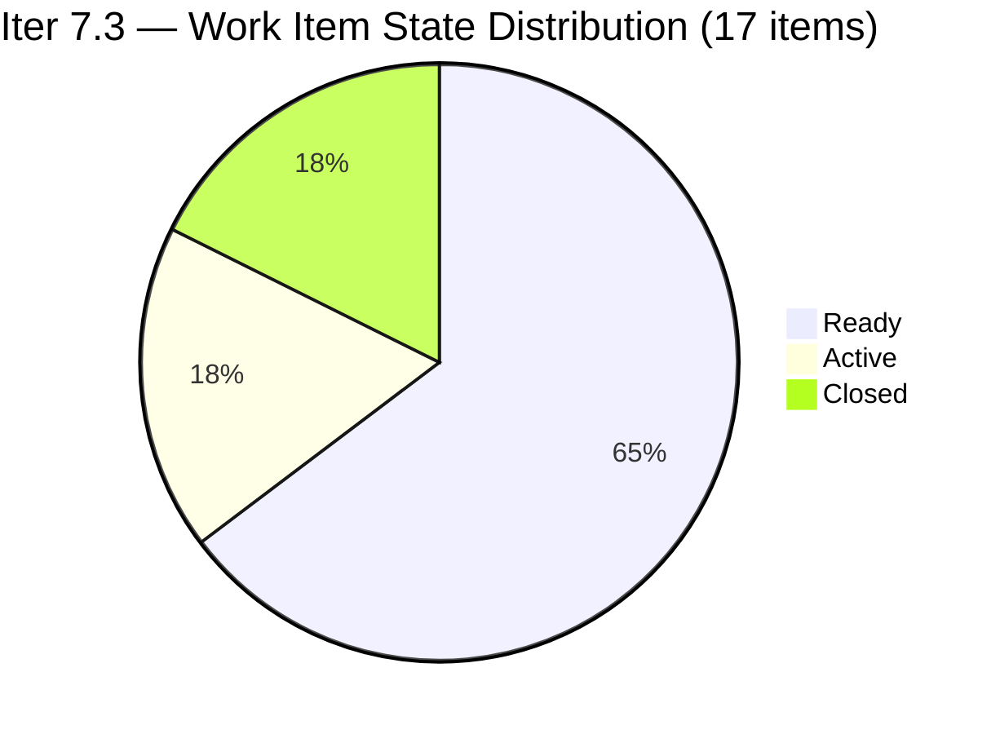
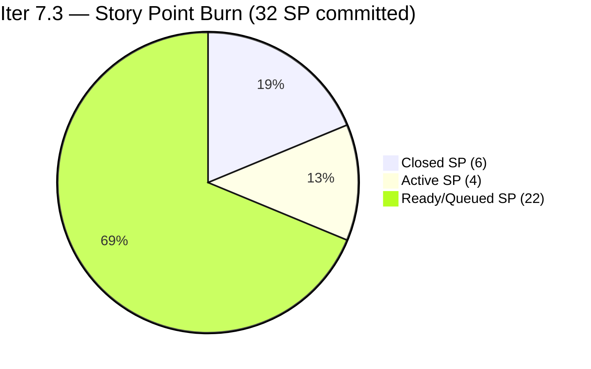
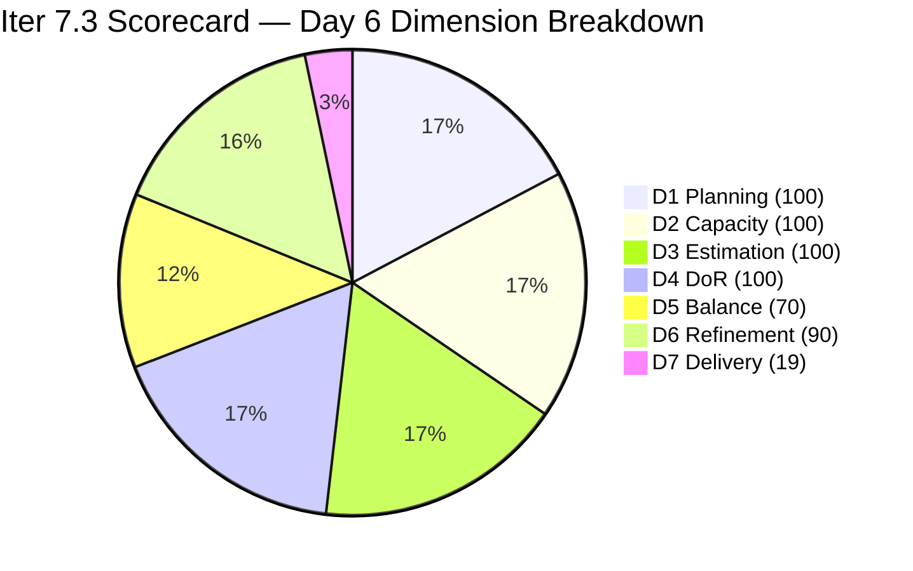

# ADO SAFe Iteration Audit — HR Recruitment Team

**Audit #54 | Iteration 7.3 (May 4 – May 17, 2026) | Day 6 of 14**

---

## 1. Audit Metadata

| Field | Value |
|---|---|
| **Audit Date** | May 9, 2026, 09:02 PHT (UTC+8) |
| **Auditor** | Claude Code (ADO SAFe Audit Agent) |
| **Workspace** | `ado_hr` |
| **ADO Project** | Jairosoft FINOPS (`e0bb302f-40f9-46c3-8164-6f1acb317d63`) |
| **Team** | Human Resource Recruitment Team (`248f59a6-372c-4b74-8129-9eaf260f211e`) |
| **Iteration** | Iteration 7.3 — May 4 to May 17, 2026 |
| **Iteration ID** | `d76b8de5-94fe-4b28-987a-263d56afd8d4` |
| **Sprint Day** | Day 6 of 14 |
| **Prior Audit** | AUDIT_20260508_0900.md (Audit #53, Iter 7.3 Day 5, Overall 82.7 — Low Risk) |
| **Scoring Model** | ADO SAFe v1 (7-dimension rubric) |
| **Overall Score** | **82.7 / 100** |
| **Risk Band** | **Low Risk** (≥80) |

---

## 2. Executive Summary

HR Recruitment Team holds **82.7 / 100 (Low Risk)** on Day 6 of Iteration 7.3 — **unchanged from Day 5**. The backlog API returned 14 open items, all in Iteration 7.3. No new closures were detected since the May 7 close of #201273. The three Active items (#202099, #203536, #203829) remain open, representing the next expected closures totaling 4 SP.

With 6 SP closed of 32 committed (18.8%), the sprint is tracking below the linear burn-down rate at Day 6. However, three Active items are in queue and this team's historical pattern shows mid-to-late sprint delivery clustering. With 8 days remaining, completion is still achievable.

**Key observations on Day 6:**
- No state changes detected since Day 5 (May 8).
- Backlog composition is unchanged: 14 open items (11 Ready, 3 Active).
- Three untouched items (202104, 202349, 197939 — all last changed Apr 30) continue to generate the -10 Backlog Refinement penalty.
- Single-contributor risk (Almera) remains the dominant structural concern.
- Grace retains 0.25 pts/day capacity but no visible sprint items in the backlog API.

---

## 3. Previous Audit Delta

| Dimension | Audit #53 (May 8, Day 5, 82.7) | Audit #54 (May 9, Day 6, 82.7) | Delta | Driver |
|---|---|---|---|---|
| Iteration Planning | 100.0 | **100.0** | 0.0 | 14 open + 3 closed = 17; all in Iter 7.3; denominator unchanged |
| Team Capacity | 100.0 | **100.0** | 0.0 | Almera 5 pts/day; Grace 0.25 pts/day — both configured |
| Estimation | 100.0 | **100.0** | 0.0 | 17/17 items have SP > 0 |
| DoR Compliance | 100.0 | **100.0** | 0.0 | 17/17 pass Description + AC |
| Work Item Balance | 70.0 | **70.0** | 0.0 | User Story present; dominant at 94.1% (-30); no change |
| Backlog Refinement | 90.0 | **90.0** | 0.0 | 3/17 untouched (17.6% → -10); all fresh |
| Delivery Predictability | 18.8 | **18.8** | 0.0 | No new closures; 6/32 SP closed |
| **Overall** | **82.7** | **82.7** | **0.0** | Static sprint day; score locked pending next closure |

---

## 4. Current Iteration Snapshot

| Attribute | Value |
|---|---|
| **Iteration** | Iteration 7.3 |
| **Sprint Dates** | May 4 – May 17, 2026 (14 days) |
| **Sprint Day** | Day 6 of 14 |
| **Days Remaining** | 8 |
| **Visible Backlog Items (open)** | 14 (all in Iter 7.3) |
| **Confirmed Closed in Iter 7.3** | 3 (#203533, #202887, #201273 — 2 SP each) |
| **Total Current Sprint Items** | 17 (14 open + 3 Closed) |
| **Committed SP** | 32 SP |
| **Closed SP** | 6 SP |
| **Open SP Remaining** | 26 SP |
| **Capacity** | Almera: 5 pts/day (3 Documentation + 2 Requirements); Grace: 0.25 pts/day Documentation |
| **Last ADO Activity** | May 7, 2026 — #201273 Closed (Day 4) |
| **Active Items** | #202099 (Medical Check-up, 1 SP), #203536 (APE Tayao, 2 SP), #203829 (APE Babael, 1 SP) |

---

## 5. Work Item Analysis

### Iteration 7.3 — All Open Items (14 items, from backlog API)

| ID | Title | Type | State | SP | Assignee | ChangedDate | DoR |
|---|---|---|---|---|---|---|---|
| 203825 | Client Interview — Sr. Tech Lead Maraon, Belleo | User Story | Ready | 2 | Almera | May 5 | Pass |
| 203829 | APE — Babael, Samantha (2nd Month) | User Story | Active | 1 | Almera | May 6 | Pass |
| 203063 | Sales & Mktg. — Angel Dorothy Abina | User Story | Ready | 2 | Almera | May 4 | Pass |
| 202093 | LinkedIn DevOps Engr. Hiring | User Story | Ready | 2 | Almera | May 4 | Pass |
| 203534 | LinkedIn Tech Sales Manila (Sprint 7.3) | User Story | Ready | 1 | Almera | May 4 | Pass |
| 203535 | APE — Caumban, Karl Jordan (7.3) | User Story | Ready | 2 | Almera | May 4 | Pass |
| 203536 | APE — Tayao, Almera Kleer (7.3) | User Story | Active | 2 | Almera | May 6 | Pass |
| 202104 | APE — Rommel Senillo Summary PI7 | User Story | Ready | 2 | Almera | Apr 30 | Pass |
| 203537 | APE — Calvin John Dalino (7.3) | User Story | Ready | 2 | Almera | May 4 | Pass |
| 203538 | APE — Ryan Vince Castillo (7.3) | User Story | Ready | 2 | Almera | May 4 | Pass |
| 202099 | Annual Medical Check-up Cebu PI7 | User Story | Active | 1 | Almera | May 6 | Pass |
| 202349 | Finance Reporting & Export | User Story | Ready | 2 | Almera | Apr 30 | Pass |
| 197939 | Communication Skills Proposals Summary | User Story | Ready | 2 | Almera | Apr 30 | Pass |
| 203629 | HR Discussion on Incentives & Bonuses | Spike | Ready | 3 | Almera | May 6 | Pass |

### Confirmed Closed in Iter 7.3 (from prior audit evidence)

| ID | Title | Type | SP | Closed |
|---|---|---|---|---|
| *203533* | *LinkedIn Bubble Dev Hiring* | *User Story* | *2* | *May 5* |
| *202887* | *Sr. Tech Lead — Barua, Marlo* | *User Story* | *2* | *May 7* |
| *201273* | *LinkedIn Bubble Trainer — Interview* | *User Story* | *2* | *May 7* |

> Closed items confirmed from AUDIT_20260508_0900 evidence. Not returned by backlog API.

### DoR Assessment (all 14 open items)

| Gate | Pass | Fail | Rate |
|---|---|---|---|
| Description ≥ 30 non-whitespace chars | 14 | 0 | 100% |
| Acceptance Criteria ≥ 20 non-whitespace chars | 14 | 0 | 100% |
| **Combined DoR (17 total incl. closed)** | **17** | **0** | **100%** |

All items verified: descriptions follow As a/I want/So that format with detailed context; acceptance criteria contain numbered, measurable conditions.

### Untouched Items (ChangedDate before sprint start May 4, 2026)

| ID | Title | Last Changed | Days Untouched |
|---|---|---|---|
| 202104 | APE — Rommel Senillo | Apr 30 | 9 days |
| 202349 | Finance Reporting & Export | Apr 30 | 9 days |
| 197939 | Communication Skills Proposals Summary | Apr 30 | 9 days |

3 of 17 items untouched = 17.6% → >10% threshold → -10 Backlog Refinement penalty.

### Type Distribution (17 current sprint items)

| Type | Count | Share | Dominant? |
|---|---|---|---|
| User Story | 16 | 94.1% | Yes (>60%) → -30 penalty |
| Spike | 1 | 5.9% | No |

---

## 6. SAFe Compliance Scorecard

| Dimension | Score | Evidence | Notes |
|---|---|---|---|
| 1. Iteration Planning | 100.0 | 17 current / 17 visible = 100% | All 14 open + 3 closed items are in Iter 7.3; no items parked outside |
| 2. Team Capacity | 100.0 | 2/2 contributors with capacity | Almera 5 pts/day; Grace 0.25 pts/day — both configured in ADO |
| 3. Estimation | 100.0 | 17/17 items with SP > 0 | Range: 1–3 SP; total = 32 SP |
| 4. DoR Compliance | 100.0 | 17/17 pass Description + AC | All items have robust As a/I want/So that + numbered AC |
| 5. Work Item Balance | 70.0 | User Story present; dominant 94.1% > 60% → -30; Spike 5.9% < 40% | Base 100 − 30 = 70 |
| 6. Backlog Refinement | 90.0 | Base 100; all fresh (0 stale_90, 0 stale_180); untouched 3/17 = 17.6% → -10 | Base 100 − 10 = 90 |
| 7. Delivery Predictability | 18.8 | 6 SP closed / 32 SP committed = 18.75% | Day 6; annotated: early-mid sprint, delivery acceleration expected |
| **Overall** | **82.7** | (100+100+100+100+70+90+18.8) / 7 = 578.8 / 7 | **Low Risk** (≥80) |

### Score Computation
```
D1 = 17 / 17 × 100 = 100.0
D2 = 2 / 2 × 100  = 100.0
D3 = 17 / 17 × 100 = 100.0
D4 = 17 / 17 × 100 = 100.0
D5 = 100 − 30 = 70.0   (US dominant 94.1%)
D6 = 100.0 − 10 = 90.0  (untouched 17.6% → -10)
D7 = 6 / 32 × 100 = 18.8

Overall = (100 + 100 + 100 + 100 + 70 + 90 + 18.8) / 7 = 578.8 / 7 = 82.7
```

---

## 7. Dimension Findings

### D1 — Iteration Planning: 100.0 ✅
```
visible_root_backlog_items   = 17 (14 open API + 3 confirmed closed)
current_iteration_root_items = 17
D1 = (17 / 17) × 100 = 100.0
```
Every item in the visible backlog belongs to Iteration 7.3. There are no items parked in the root project path or future iterations. This perfect alignment has been sustained across every Day 1–6 audit. The HR team's focused single-sprint discipline is a model for other teams.

### D2 — Team Capacity: 100.0 ✅
Both team members with work in the current sprint have positive capacity configured:
- **Almera Kleer Tayao**: 3 pts/day Documentation + 2 pts/day Requirements = 5.0 pts/day
- **Grace**: 0.25 pts/day Documentation

Both verified from ADO capacity API. Score = 2/2 = 100%.

Grace holds no items visible in the open backlog API today. Her contribution appears primarily in support capacity. No change from prior audit.

### D3 — Estimation: 100.0 ✅
```
point_eligible_current_items = 17 (all User Story and Spike types)
estimated_current_items      = 17 (all have SP > 0)
D3 = (17 / 17) × 100 = 100.0
```
Story point range: 1–3 SP per item. Total committed = 32 SP. Estimation discipline remains perfect across the audit series.

### D4 — DoR Compliance: 100.0 ✅
All 14 open items verified directly from ADO API:
- **Description**: all pass (≥30 non-whitespace characters; detailed narrative descriptions confirmed)
- **Acceptance Criteria**: all pass (≥20 non-whitespace characters; structured numbered lists with measurable outcomes)

The 3 confirmed-closed items also passed DoR in prior audits. Combined DoR = 17/17 = 100%.

### D5 — Work Item Balance: 70.0 (Moderate — Structural)
```
User Story present: Yes → +0 penalty
User Story share: 16/17 = 94.1% > 60% → -30
Spike share: 1/17 = 5.9% < 40% → +0
D5 = 100 − 30 = 70.0
```
The high User Story concentration (16:1 ratio) reflects the HR team's operational nature — recruitment, performance evaluations, and training administration are naturally story-shaped work. This constraint is structural and unlikely to be resolved mid-sprint. The single Spike (#203629, HR Incentives discussion) provides appropriate research coverage. The -30 Work Item Balance penalty is an accepted structural cost for this team type.

### D6 — Backlog Refinement: 90.0 (Good)
```
visible_root_backlog_items = 17
fresh_visible_root_items   = 17 (all changed Apr 27 – May 6; all within 45-day window since Mar 25)
stale_90_items (before Feb 8): 0
stale_180_items (before Nov 10, 2025): 0
untouched_current_items (before May 4): 3 (202104, 202349, 197939 — all Apr 30)

base = (17 / 17) × 100 = 100.0
stale_90 penalty: 0% → 0
stale_180 penalty: 0 items → 0
untouched penalty: 3/17 = 17.6% > 10% → -10

D6 = 100.0 − 10 = 90.0
```
The three untouched items are pre-prepared stories loaded for sprint execution; they were last updated Apr 30 before sprint start. As Almera progresses through the Active items queue, these Ready items will naturally advance. No systemic staleness concerns.

### D7 — Delivery Predictability: 18.8 (Critical zone — Day 6 context)
```
committed_story_points = 32
closed_story_points    = 6 (items #203533, #202887, #201273 — 2 SP each)
D7 = (6 / 32) × 100 = 18.75 → 18.8
```
At Day 6 of 14 (42.9% sprint elapsed), the linear expectation would be 32 × 0.429 = 13.7 SP. Actual = 6 SP (43.8% of linear pace). Three Active items totaling 4 SP are the next expected closures (#202099 Medical Check-up 1 SP, #203536 APE Tayao 2 SP, #203829 APE Babael 1 SP).

Closing these 3 Active items would raise D7 to 10/32 = 31.3% and Overall to approximately 83.5. The team has 8 days remaining to close 26 SP. Given historical batch-close behavior, a mid-to-late sprint acceleration is expected.

---

## 8. Risks and Bottlenecks





| Risk | Severity | Status | Action |
|---|---|---|---|
| **Bus Factor = 1** (Almera owns 16/17 items) | High | Structural — unchanged | Long-term: cross-train; short-term: accept |
| **Delivery pace below linear** (18.8% vs. 42.9% elapsed) | Moderate | Expected pattern for this team | Resolve 3 Active items to break pace lag |
| **No Iteration Goal defined** | Moderate | Unfixed across 54 audits | Define in next sprint planning session |
| **No PI Objectives linked** | Moderate | Unfixed across 54 audits | Coordinate with Program Management |
| **3 untouched items (17.6%)** | Low | Normal pre-sprint prep behavior | Expected to move as queue progresses |
| **Grace capacity unused** | Low | 0.25 pts/day, 0 visible sprint items | Assign to support Almera's queue |

---

## 9. Prioritized Recommendations

1. **[Immediate] Close 3 Active items today** — Items #202099 (Medical Check-up, 1 SP), #203536 (APE Tayao, 2 SP), and #203829 (APE Babael, 1 SP) are in Active state. Closing all three raises D7 from 18.8% to 31.3% and Overall from 82.7 to approximately 83.5. These represent the next natural burn milestone.

2. **[This Sprint] Define a written Iteration Goal** — The HR team has never set a sprint-level goal in 54 audits. A focused statement such as "Complete APE cycle for 8 employees, finalize two open hire campaigns, and deliver the incentives framework proposal" would satisfy SAFe governance and provide alignment focus.

3. **[This Sprint] Link PI 7 Objectives** — No PI 7 objectives are linked to any sprint items. Work with Program Management to tag at least 2 items (e.g., the APE cluster or the Sales & Marketing hire) to PI 7 business outcomes.

4. **[Next Sprint] Address Work Item Balance structurally** — The 94.1% User Story concentration yields a structural -30 penalty each sprint. Consider introducing a Spike for process research or an Enabler for HR system improvements in Sprint 7.4 to bring the dominant-type share below 60%.

5. **[Next Sprint] Expand Grace's sprint role** — Grace currently holds 0.25 pts/day capacity with no visible sprint items in today's API. Increasing her active participation would reduce the single-contributor risk and provide a path to Sprint 7.4 score improvements.

---

## 10. Evidence Gaps and Limitations

| Gap | Impact | Mitigation |
|---|---|---|
| Closed items not returned by backlog API | Moderate | 3 closed items (6 SP) confirmed from AUDIT_20260508_0900; integrated into scoring |
| Grace's sprint item details | Low | Grace has capacity configured; no items in backlog API; counted in D2 |
| PI Objectives linkage | Low | Not queried via ADO API; known gap from prior audits |
| Iteration Goal field | Low | Not surfaced by standard ADO API; manual check recommended |

---

## 11. Score Trend — Iteration 7.3



> Score trend: Day 1 baseline 82.7 → consistent through Day 6 at 82.7. Delivery Predictability is the sole dimension with upside potential this sprint.

| Day | Score | Band | Key Event |
|---|---|---|---|
| Day 1 | 82.7 | Low Risk | Sprint launched; initial items loaded |
| Day 2–3 | 82.7 | Low Risk | #203533 closed (2 SP) |
| Day 4 | 82.7 | Low Risk | #202887, #201273 closed (2 SP each) |
| Day 5 | 82.7 | Low Risk | No new closures |
| Day 6 | **82.7** | **Low Risk** | No new closures detected |

---

*Report generated: May 9, 2026, 09:02 PHT | Workspace: ado_hr | Auditor: Claude Code ADO SAFe Audit Agent*
