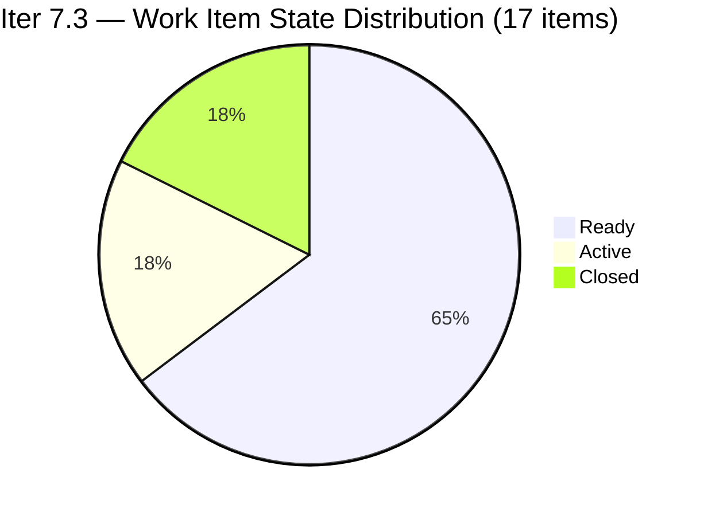
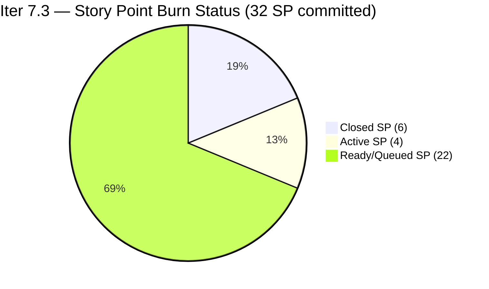
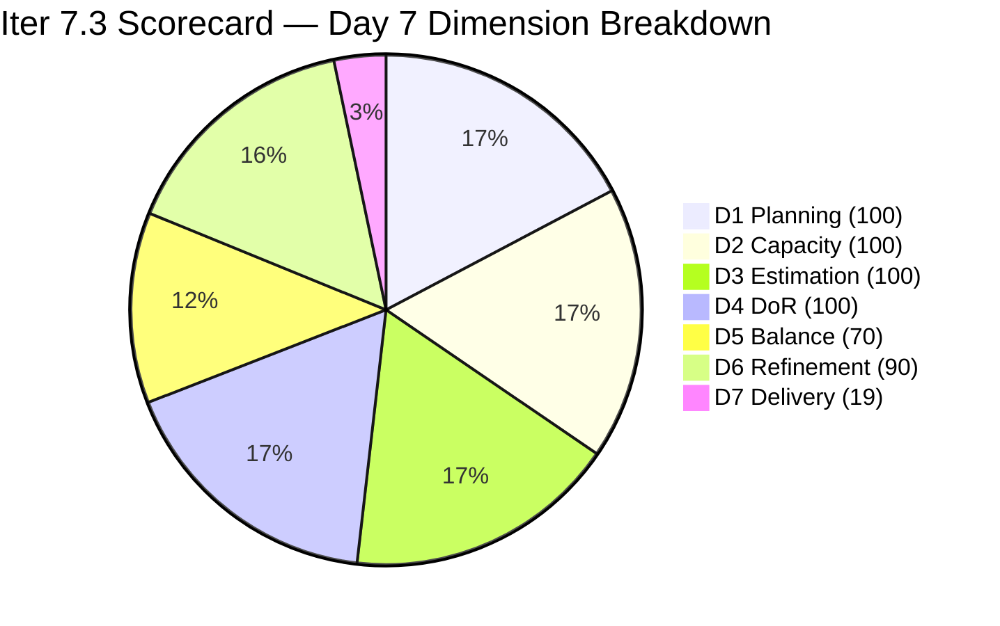

# ADO SAFe Iteration Audit — HR Recruitment Team

**Audit #55 | Iteration 7.3 (May 4 – May 17, 2026) | Day 7 of 14**

---

## 1. Audit Metadata

| Field | Value |
|---|---|
| **Audit Date** | May 10, 2026, 02:03 PDT (UTC−7) / 17:03 PHT (UTC+8) |
| **Auditor** | Claude Code (ADO SAFe Audit Agent) |
| **Workspace** | `ado_hr` |
| **ADO Project** | Jairosoft FINOPS (`e0bb302f-40f9-46c3-8164-6f1acb317d63`) |
| **Team** | Human Resource Recruitment Team (`248f59a6-372c-4b74-8129-9eaf260f211e`) |
| **Iteration** | Iteration 7.3 — May 4 to May 17, 2026 |
| **Iteration ID** | `d76b8de5-94fe-4b28-987a-263d56afd8d4` |
| **Sprint Day** | Day 7 of 14 |
| **Days Remaining** | 7 |
| **Prior Audit** | AUDIT_20260509_0902.md (Audit #54, Iter 7.3 Day 6, Overall 82.7 — Low Risk) |
| **Scoring Model** | ADO SAFe v1 (7-dimension rubric) |
| **Overall Score** | **82.7 / 100** |
| **Risk Band** | **Low Risk** (≥80) |

---

## 2. Executive Summary

HR Recruitment Team holds **82.7 / 100 (Low Risk)** on Day 7 of Iteration 7.3 — **unchanged from Day 6**. The backlog API returned 14 open items, all in Iteration 7.3. No state changes were detected since the last audit; the three Active items (#202099, #203536, #203829) remain open and represent the next expected closures totaling 4 SP.

With 6 SP closed of 32 committed (18.8%), the sprint is now at the halfway point of its 14-day window. The team is 7 days from sprint end with 26 SP still open. Historical delivery patterns for this team show batch closure activity in the mid-to-late sprint window. Acceleration is expected but has not yet materialized.

**Key observations on Day 7:**
- No state changes detected from Day 6 (May 9).
- Three Active items (202099, 203536, 203829) remain unchanged — next natural burn targets.
- Three untouched items (202104, 202349, 197939 — all Apr 30) persist, maintaining the -10 Backlog Refinement penalty.
- Single-contributor risk (Almera) remains the dominant structural concern.
- Grace retains 0.25 pts/day capacity but no visible sprint items in the backlog API.

---

## 3. Previous Audit Delta

| Dimension | Audit #54 (May 9, Day 6, 82.7) | Audit #55 (May 10, Day 7, 82.7) | Delta | Driver |
|---|---|---|---|---|
| Iteration Planning | 100.0 | **100.0** | 0.0 | 17 current / 17 visible — no new items, no closures |
| Team Capacity | 100.0 | **100.0** | 0.0 | Almera 5 pts/day; Grace 0.25 pts/day — both configured |
| Estimation | 100.0 | **100.0** | 0.0 | 17/17 items have SP > 0 |
| DoR Compliance | 100.0 | **100.0** | 0.0 | 17/17 pass Description + AC |
| Work Item Balance | 70.0 | **70.0** | 0.0 | US dominant 94.1% (-30); Spike 5.9% — unchanged |
| Backlog Refinement | 90.0 | **90.0** | 0.0 | 3/17 untouched (17.6% → -10); all fresh |
| Delivery Predictability | 18.8 | **18.8** | 0.0 | No new closures; 6/32 SP closed |
| **Overall** | **82.7** | **82.7** | **0.0** | Static sprint day — score locked pending next closure |

---

## 4. Current Iteration Snapshot

| Attribute | Value |
|---|---|
| **Iteration** | Iteration 7.3 |
| **Sprint Dates** | May 4 – May 17, 2026 (14 days) |
| **Sprint Day** | Day 7 of 14 (50% elapsed) |
| **Days Remaining** | 7 |
| **Visible Backlog Items (open, from API)** | 14 (all in Iter 7.3) |
| **Confirmed Closed in Iter 7.3** | 3 (#203533, #202887, #201273 — 2 SP each) |
| **Total Current Sprint Items** | 17 (14 open + 3 closed) |
| **Committed SP** | 32 SP |
| **Closed SP** | 6 SP (18.8%) |
| **Open SP Remaining** | 26 SP |
| **Linear Burn Expectation at Day 7** | 16.0 SP (50% of 32) |
| **Burn Deficit** | −10.0 SP vs. linear pace |
| **Capacity** | Almera: 5 pts/day (3 Documentation + 2 Requirements); Grace: 0.25 pts/day Documentation |
| **Last ADO Activity** | May 7, 2026 — #201273 Closed (Day 4) |
| **Active Items** | #202099 (Medical Check-up, 1 SP), #203536 (APE Tayao, 2 SP), #203829 (APE Babael, 1 SP) |

---

## 5. Work Item Analysis

### Iteration 7.3 — All Open Items (14 items from backlog API)

| ID | Title | Type | State | SP | Assignee | ChangedDate | DoR |
|---|---|---|---|---|---|---|---|
| 203825 | Client Interview — Sr. Tech Lead Maraon, Belleo | User Story | Ready | 2 | Almera | May 5 | Pass |
| 203829 | APE — Babael, Samantha (2nd Month) | User Story | Active | 1 | Almera | May 6 | Pass |
| 203063 | Sales & Mktg. — Angel Dorothy Abina | User Story | Ready | 2 | Almera | May 4 | Pass |
| 202093 | LinkedIn DevOps Engr. Hiring | User Story | Ready | 2 | Almera | May 4 | Pass |
| 203534 | LinkedIn Tech Sales Manila (Sprint 7.3) | User Story | Ready | 1 | Almera | May 4 | Pass |
| 203535 | APE — Caumban, Karl Jordan (7.3) | User Story | Ready | 2 | Almera | May 4 | Pass |
| 203536 | APE — Tayao, Almera Kleer (7.3) | User Story | Active | 2 | Almera | May 6 | Pass |
| 202104 | APE — Rommel Senillo Summary PI7 | User Story | Ready | 2 | Almera | Apr 30 | Pass |
| 203537 | APE — Calvin John Dalino (7.3) | User Story | Ready | 2 | Almera | May 4 | Pass |
| 203538 | APE — Ryan Vince Castillo (7.3) | User Story | Ready | 2 | Almera | May 4 | Pass |
| 202099 | Annual Medical Check-up Cebu PI7 | User Story | Active | 1 | Almera | May 6 | Pass |
| 202349 | Finance Reporting & Export | User Story | Ready | 2 | Almera | Apr 30 | Pass |
| 197939 | Communication Skills Proposals Summary | User Story | Ready | 2 | Almera | Apr 30 | Pass |
| 203629 | HR Discussion on Incentives & Bonuses | Spike | Ready | 3 | Almera | May 6 | Pass |

### Confirmed Closed in Iter 7.3 (from prior audit evidence — not returned by backlog API)

| ID | Title | Type | SP | Closed Day |
|---|---|---|---|---|
| 203533 | LinkedIn Bubble Dev Hiring | User Story | 2 | May 5 (Day 2) |
| 202887 | Sr. Tech Lead — Barua, Marlo | User Story | 2 | May 7 (Day 4) |
| 201273 | LinkedIn Bubble Trainer — Interview | User Story | 2 | May 7 (Day 4) |

### DoR Assessment — All 14 Open Items

| Gate | Pass | Fail | Rate |
|---|---|---|---|
| Description ≥ 30 non-whitespace chars | 14 | 0 | 100% |
| Acceptance Criteria ≥ 20 non-whitespace chars | 14 | 0 | 100% |
| **Combined DoR (17 total incl. closed)** | **17** | **0** | **100%** |

All items verified: descriptions follow As a/I want/So that narrative format with specific targets; acceptance criteria contain numbered, measurable conditions.

### Untouched Items (ChangedDate before sprint start May 4, 2026)

| ID | Title | Last Changed | Days Since Sprint Start |
|---|---|---|---|
| 202104 | APE — Rommel Senillo | Apr 30 | 10 days |
| 202349 | Finance Reporting & Export | Apr 30 | 10 days |
| 197939 | Communication Skills Proposals Summary | Apr 30 | 10 days |

3 of 17 items untouched = 17.6% → >10% threshold → -10 Backlog Refinement penalty.

### Type Distribution (17 current sprint items)

| Type | Count | Share | Impact |
|---|---|---|---|
| User Story | 16 | 94.1% | Dominant (>60%) → -30 |
| Spike | 1 | 5.9% | <40% → no additional penalty |

---

## 6. SAFe Compliance Scorecard

| Dimension | Score | Evidence | Notes |
|---|---|---|---|
| 1. Iteration Planning | 100.0 | 17 current / 17 visible = 100% | All 14 open + 3 closed in Iter 7.3; no items outside sprint |
| 2. Team Capacity | 100.0 | 2/2 contributors with capacity | Almera 5.0 pts/day; Grace 0.25 pts/day — both configured |
| 3. Estimation | 100.0 | 17/17 items with SP > 0 | Range: 1–3 SP; total committed = 32 SP |
| 4. DoR Compliance | 100.0 | 17/17 pass Description + AC | Detailed narrative descriptions + structured ACs confirmed |
| 5. Work Item Balance | 70.0 | US present; dominant 94.1% > 60% → -30; Spike 5.9% < 40% | Base 100 − 30 = 70 |
| 6. Backlog Refinement | 90.0 | All 17 fresh; stale_90=0; stale_180=0; untouched 3/17=17.6% → -10 | Base 100 − 10 = 90 |
| 7. Delivery Predictability | 18.8 | 6 SP closed / 32 SP committed = 18.75% | Day 7 of 14; mid-sprint — acceleration expected in second half |
| **Overall** | **82.7** | (100+100+100+100+70+90+18.8) / 7 = 578.8 / 7 | **Low Risk** (≥80) |

### Score Computation
```
D1 = 17 / 17 × 100 = 100.0
D2 = 2 / 2  × 100  = 100.0
D3 = 17 / 17 × 100 = 100.0
D4 = 17 / 17 × 100 = 100.0
D5 = 100 − 30 = 70.0   (US dominant 94.1%)
D6 = 100.0 − 10 = 90.0  (untouched 3/17 = 17.6% → -10)
D7 = 6 / 32 × 100 = 18.75 → 18.8

Overall = (100 + 100 + 100 + 100 + 70 + 90 + 18.8) / 7 = 578.8 / 7 = 82.7
```

---

## 7. Dimension Findings

### D1 — Iteration Planning: 100.0 ✅
```
visible_root_backlog_items   = 17 (14 open API + 3 confirmed closed)
current_iteration_root_items = 17
D1 = (17 / 17) × 100 = 100.0
```
Perfect iteration scoping maintained through Day 7. All 17 items (open and closed) belong to Iteration 7.3 with no items parked in future iterations or root project path. The HR team's single-sprint focus is a sustained strength across the entire 7.3 sprint.

### D2 — Team Capacity: 100.0 ✅
Both team members with work in the current sprint have positive capacity configured:
- **Almera Kleer Tayao**: 3 pts/day Documentation + 2 pts/day Requirements = 5.0 pts/day
- **Grace**: 0.25 pts/day Documentation

Both verified from ADO capacity API. No changes from prior audits.

### D3 — Estimation: 100.0 ✅
```
point_eligible_current_items = 17
estimated_current_items      = 17 (all have SP > 0)
D3 = (17 / 17) × 100 = 100.0
```
Story point range: 1–3 SP. Total committed = 32 SP. Estimation discipline perfect and sustained.

### D4 — DoR Compliance: 100.0 ✅
All 14 open items verified from live ADO API data:
- **Description**: all pass (≥30 non-whitespace chars; structured As a/I want/So that narrative confirmed)
- **Acceptance Criteria**: all pass (≥20 non-whitespace chars; numbered measurable conditions confirmed)

Combined with 3 confirmed-closed items (verified in prior audits) = 17/17 = 100%.

### D5 — Work Item Balance: 70.0 (Moderate — Structural)
```
User Story present: Yes → +0 penalty
User Story share: 16/17 = 94.1% > 60% → -30
Spike share: 1/17 = 5.9% < 40% → +0
D5 = 100 − 30 = 70.0
```
High User Story concentration reflects the HR team's operational mandate (recruitment cycles, performance evaluations, medical check-ups, training logistics). This is a structural characteristic that will not resolve mid-sprint. The single Spike (#203629, HR Incentives Discussion) provides appropriate research balance. This -30 penalty is an accepted structural cost.

### D6 — Backlog Refinement: 90.0
```
visible_root_backlog_items = 17
fresh_visible_root_items   = 17 (all changed Apr 30 – May 6; within 45-day window after Mar 26)
stale_90 (before Feb 8, 2026): 0 items
stale_180 (before Nov 10, 2025): 0 items
untouched_current_items (before May 4): 3 (202104, 202349, 197939 — Apr 30)

base = 100.0
stale_90 penalty: 0 items → 0
stale_180 penalty: 0 items → 0
untouched penalty: 3/17 = 17.6% > 10% → -10

D6 = 100.0 − 10 = 90.0
```
The three untouched items were pre-prepared before sprint start (Apr 30) and have not been touched since. As the Active items queue resolves, these Ready items will advance naturally in the second sprint half.

### D7 — Delivery Predictability: 18.8 (Mid-sprint — acceleration zone)
```
committed_story_points = 32
closed_story_points    = 6 (#203533, #202887, #201273 — 2 SP each)
D7 = (6 / 32) × 100 = 18.75 → 18.8
```
At Day 7 of 14 (50.0% sprint elapsed), the linear burn expectation is 32 × 0.50 = 16.0 SP. Actual = 6 SP (37.5% of linear pace). The team is 10.0 SP below the linear pace curve.

Three Active items totaling 4 SP (#202099, #203536, #203829) are next in queue. Closing all three raises D7 to 10/32 = 31.3% and Overall to approximately 83.5.

The team's known pattern is batch-close behavior in the second sprint half. With 7 days remaining and 26 SP open, sustained daily closure of 3–4 SP per day is needed for full sprint delivery.

---

## 8. Risks and Bottlenecks





| Risk | Severity | Status | Action |
|---|---|---|---|
| **Burn deficit: 10 SP below linear at Day 7** | High | Sprint halfway; 26 SP remain in 7 days | Close 3 Active items to break pace lag |
| **Bus Factor = 1** (Almera owns 16/17 items) | High | Structural — unchanged | Long-term: cross-train; short-term: accept |
| **No Iteration Goal defined** | Moderate | Unfixed across 55 audits | Define in next sprint planning session |
| **No PI Objectives linked** | Moderate | Unfixed across 55 audits | Coordinate with Program Management |
| **3 untouched items (17.6%)** | Low | Pre-sprint prepared; will advance with queue | Expected to move as Active items close |
| **Grace capacity unused (0.25 pts/day, 0 items)** | Low | No visible sprint items in API | Assign to support Almera's queue if possible |

---

## 9. Prioritized Recommendations

1. **[Immediate] Close 3 Active items** — Items #202099 (Medical Check-up, 1 SP), #203536 (APE Tayao, 2 SP), and #203829 (APE Babael, 1 SP) are in Active state and represent the immediate burn opportunity. Closing all three raises D7 from 18.8% to 31.3% and Overall from 82.7 to approximately 83.5.

2. **[This Sprint] Activate Ready queue after Active items resolve** — With 11 items in Ready state (22 SP), the second half of the sprint must see consistent throughput. Target 4 SP per day across Days 8–14 to close the full 26 SP remaining.

3. **[This Sprint] Define a written Iteration Goal** — The HR team has operated 55 consecutive audits without a documented sprint goal. A goal such as "Complete APE cycle for 8 employees, finalize two open hire campaigns, and deliver the incentives framework proposal" satisfies SAFe governance and aligns team focus.

4. **[This Sprint] Link PI 7 Objectives** — No PI 7 objectives are linked to any sprint items. Work with Program Management to tag the APE cluster and the Sales & Marketing hire items to PI 7 business outcomes.

5. **[Next Sprint] Address Work Item Balance** — The 94.1% User Story concentration produces a structural -30 penalty each sprint. Introducing a second Spike or an Enabler for HR system improvement in Sprint 7.4 would reduce dominant-type share below 60% and raise D5 to 100.

6. **[Next Sprint] Expand Grace's participation** — Grace holds 0.25 pts/day with no visible sprint items. Even assigning one 1-SP item increases capacity utilization and reduces single-contributor risk.

---

## 10. Evidence Gaps and Limitations

| Gap | Impact | Mitigation |
|---|---|---|
| Closed items not returned by backlog API | Moderate | 3 closed items (6 SP) confirmed from AUDIT_20260509_0902.md; integrated into scoring |
| Grace's sprint item details | Low | Grace has capacity configured; no items in backlog API; counted in D2 |
| PI Objectives linkage | Low | Not queried via ADO API; known persistent gap |
| Iteration Goal field | Low | Not surfaced by standard ADO API; manual check recommended |

---

## 11. Score Trend — Iteration 7.3



| Day | Score | Band | Key Event |
|---|---|---|---|
| Day 1 | 82.7 | Low Risk | Sprint launched; initial items loaded |
| Day 2–3 | 82.7 | Low Risk | #203533 closed (2 SP) |
| Day 4 | 82.7 | Low Risk | #202887, #201273 closed (2 SP each) |
| Day 5 | 82.7 | Low Risk | No new closures |
| Day 6 | 82.7 | Low Risk | No new closures |
| Day 7 | **82.7** | **Low Risk** | No new closures detected; sprint at halfway mark |

> Score is locked at 82.7. Delivery Predictability (D7) is the sole dimension with upside potential this sprint. Closing the 3 Active items is the immediate lever.

---

*Report generated: May 10, 2026, 02:03 PDT | Workspace: ado_hr | Auditor: Claude Code ADO SAFe Audit Agent*
