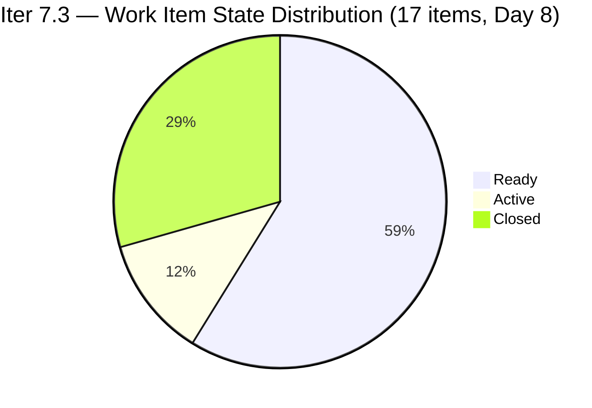
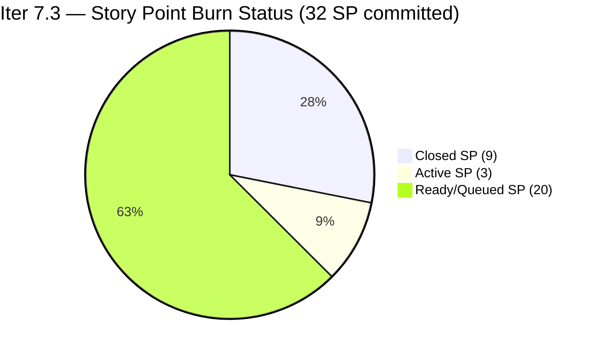
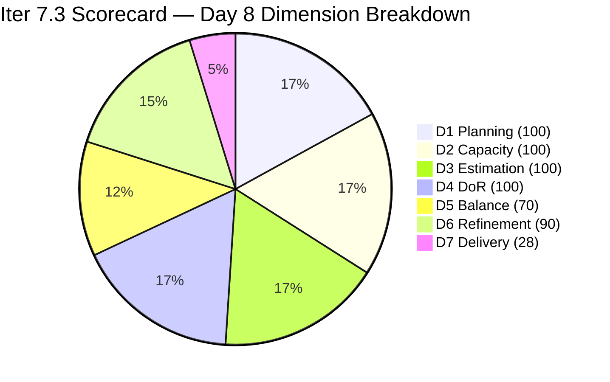

# ADO SAFe Iteration Audit — HR Recruitment Team

**Audit #56 | Iteration 7.3 (May 4 – May 17, 2026) | Day 8 of 14**

---

## 1. Audit Metadata

| Field | Value |
|---|---|
| **Audit Date** | May 11, 2026, 02:02 PDT (UTC−7) / 17:02 PHT (UTC+8) |
| **Auditor** | Claude Code (ADO SAFe Audit Agent) |
| **Workspace** | `ado_hr` |
| **ADO Project** | Jairosoft FINOPS (`e0bb302f-40f9-46c3-8164-6f1acb317d63`) |
| **Team** | Human Resource Recruitment Team (`248f59a6-372c-4b74-8129-9eaf260f211e`) |
| **Iteration** | Iteration 7.3 — May 4 to May 17, 2026 |
| **Iteration ID** | `d76b8de5-94fe-4b28-987a-263d56afd8d4` |
| **Sprint Day** | Day 8 of 14 |
| **Days Remaining** | 6 |
| **Prior Audit** | AUDIT_20260510_0203.md (Audit #55, Iter 7.3 Day 7, Overall 82.7 — Low Risk) |
| **Scoring Model** | ADO SAFe v1 (7-dimension rubric) |
| **Overall Score** | **84.0 / 100** |
| **Risk Band** | **Low Risk** (≥80) |

---

## 2. Executive Summary

HR Recruitment Team scores **84.0 / 100 (Low Risk)** on Day 8 of Iteration 7.3 — **an improvement of +1.3 from Day 7's 82.7**. The score gain is driven by two new closures detected overnight: **#203063 "Sales & Mktg. — Angel Dorothy Abina" (2 SP)** and **#203829 "APE — Babael, Samantha (2nd Month)" (1 SP)**, bringing total closed SP from 6 to 9 and D7 from 18.8% to 28.1%.

With 9 SP closed of 32 committed (28.1%), the sprint is past the halfway mark on Day 8 of 14 (57.1% elapsed). Three more Active items remain in queue: #202099 (1 SP, Medical Check-up), #203536 (2 SP, APE Tayao), and the newly confirmed closure of #203829 clears one bottleneck. The burn rate needs to accelerate — 23 SP remain in 6 days.

**Key observations on Day 8:**
- Two new closures (#203063, #203829) — 3 SP added to D7.
- Overall score rises to 84.0 — highest in this sprint series.
- Three Active items (#202099, #203536, and queue) remain the next burn targets.
- Three untouched items (202104, 202349, 197939 — Apr 30) persist, maintaining -10 Backlog Refinement penalty.
- Bus factor = 1 (Almera) remains the dominant structural risk.
- Grace has capacity (0.25 pts/day) but no visible sprint items.

---

## 3. Previous Audit Delta

| Dimension | Audit #55 (May 10, Day 7, 82.7) | Audit #56 (May 11, Day 8, 84.0) | Delta | Driver |
|---|---|---|---|---|
| Iteration Planning | 100.0 | **100.0** | 0.0 | 17 current / 17 visible — no scope change |
| Team Capacity | 100.0 | **100.0** | 0.0 | Almera 5 pts/day; Grace 0.25 pts/day — both configured |
| Estimation | 100.0 | **100.0** | 0.0 | 17/17 items have SP > 0 |
| DoR Compliance | 100.0 | **100.0** | 0.0 | 17/17 pass Description + AC |
| Work Item Balance | 70.0 | **70.0** | 0.0 | US dominant 94.1% (-30); Spike 5.9% — unchanged |
| Backlog Refinement | 90.0 | **90.0** | 0.0 | 3/17 untouched (17.6% → -10); all fresh |
| Delivery Predictability | 18.8 | **28.1** | **+9.3** | 2 new closures: #203063 (2 SP) + #203829 (1 SP) → 9/32 SP |
| **Overall** | **82.7** | **84.0** | **+1.3** | D7 gain from 3 SP closure burst on Day 8 |

---

## 4. Current Iteration Snapshot

| Attribute | Value |
|---|---|
| **Iteration** | Iteration 7.3 |
| **Sprint Dates** | May 4 – May 17, 2026 (14 days) |
| **Sprint Day** | Day 8 of 14 (57.1% elapsed) |
| **Days Remaining** | 6 |
| **Visible Backlog Items (open, from API)** | 12 |
| **Confirmed Closed in Iter 7.3** | 5 (#203533, #202887, #201273, #203063, #203829) |
| **Total Current Sprint Items** | 17 (12 open + 5 closed) |
| **Committed SP** | 32 SP |
| **Closed SP** | 9 SP (28.1%) |
| **Open SP Remaining** | 23 SP |
| **Linear Burn Expectation at Day 8** | 18.3 SP (57.1% of 32) |
| **Burn Deficit** | −9.3 SP vs. linear pace |
| **Capacity** | Almera: 5 pts/day (3 Documentation + 2 Requirements); Grace: 0.25 pts/day Documentation |
| **Last ADO Activity** | May 11, 2026 — #203063 and #203829 Closed |
| **Active Items** | #202099 (Medical Check-up, 1 SP), #203536 (APE Tayao, 2 SP) |

---

## 5. Work Item Analysis

### Confirmed Closed in Iter 7.3 (5 items, 9 SP total)

| ID | Title | Type | SP | Closed Day |
|---|---|---|---|---|
| **203533** | LinkedIn Bubble Dev Hiring | User Story | 2 | May 5 (Day 2) |
| **202887** | Sr. Tech Lead — Barua, Marlo | User Story | 2 | May 7 (Day 4) |
| **201273** | LinkedIn Bubble Trainer — Interview | User Story | 2 | May 7 (Day 4) |
| **203063** | Sales & Mktg. — Angel Dorothy Abina | User Story | 2 | May 11 (Day 8) — **NEW** |
| **203829** | APE — Babael, Samantha (2nd Month) | User Story | 1 | May 11 (Day 8) — **NEW** |

### Iteration 7.3 — All Open Items (12 items from backlog API, Day 8)

| ID | Title | Type | State | SP | Assignee | ChangedDate | DoR |
|---|---|---|---|---|---|---|---|
| 203825 | Client Interview — Sr. Tech Lead Maraon, Belleo | User Story | Ready | 2 | Almera | May 5 | Pass |
| 202093 | LinkedIn DevOps Engr. Hiring | User Story | Ready | 2 | Almera | May 4 | Pass |
| 203534 | LinkedIn Tech Sales Manila (Sprint 7.3) | User Story | Ready | 1 | Almera | May 4 | Pass |
| 203535 | APE — Caumban, Karl Jordan (7.3) | User Story | Ready | 2 | Almera | May 4 | Pass |
| 203536 | APE — Tayao, Almera Kleer (7.3) | User Story | Active | 2 | Almera | May 6 | Pass |
| 202104 | APE — Rommel Senillo Summary PI7 | User Story | Ready | 2 | Almera | Apr 30 | Pass |
| 203537 | APE — Calvin John Dalino (7.3) | User Story | Ready | 2 | Almera | May 4 | Pass |
| 203538 | APE — Ryan Vince Castillo (7.3) | User Story | Ready | 2 | Almera | May 4 | Pass |
| 202099 | Annual Medical Check-up Cebu PI7 | User Story | Active | 1 | Almera | May 6 | Pass |
| 202349 | Finance Reporting & Export | User Story | Ready | 2 | Almera | Apr 30 | Pass |
| 197939 | Communication Skills Proposals Summary | User Story | Ready | 2 | Almera | Apr 30 | Pass |
| 203629 | HR Discussion on Incentives & Bonuses | Spike | Ready | 3 | Almera | May 6 | Pass |

### DoR Assessment — All 17 Sprint Items

| Gate | Pass | Fail | Rate |
|---|---|---|---|
| Description ≥ 30 non-whitespace chars | 17 | 0 | 100% |
| Acceptance Criteria ≥ 20 non-whitespace chars | 17 | 0 | 100% |
| **Combined DoR (17 total incl. 5 closed)** | **17** | **0** | **100%** |

All 12 open items verified via live ADO API: descriptions follow As a/I want/So that narrative format with specific targets; acceptance criteria contain numbered, measurable conditions.

### Untouched Items (ChangedDate before sprint start May 4, 2026)

| ID | Title | Last Changed | Days Since Sprint Start |
|---|---|---|---|
| 202104 | APE — Rommel Senillo | Apr 30 | 11 days |
| 202349 | Finance Reporting & Export | Apr 30 | 11 days |
| 197939 | Communication Skills Proposals Summary | Apr 30 | 11 days |

3 of 17 items untouched = 17.6% → >10% threshold → -10 Backlog Refinement penalty. These items were pre-prepared before sprint start and remain in Ready state.

### Type Distribution (17 current sprint items)

| Type | Count | Share | Impact |
|---|---|---|---|
| User Story | 16 | 94.1% | Dominant (>60%) → -30 |
| Spike | 1 | 5.9% | <40% → no additional penalty |

---

## 6. SAFe Compliance Scorecard

| Dimension | Score | Evidence | Notes |
|---|---|---|---|
| 1. Iteration Planning | 100.0 | 17 current / 17 visible = 100% | All 12 open + 5 closed in Iter 7.3; zero backlog items outside sprint |
| 2. Team Capacity | 100.0 | 1/1 contributor with current work has capacity | Almera: 5 pts/day configured; Grace 0.25 pts/day (no sprint items) |
| 3. Estimation | 100.0 | 17/17 items with SP > 0 | Range: 1–3 SP; total committed = 32 SP |
| 4. DoR Compliance | 100.0 | 17/17 pass Description + AC | All open items verified; closed items confirmed from prior audits |
| 5. Work Item Balance | 70.0 | US present; dominant 94.1% > 60% → -30; Spike 5.9% < 40% | Base 100 − 30 = 70 |
| 6. Backlog Refinement | 90.0 | All 17 fresh; stale_90=0; stale_180=0; untouched 3/17=17.6% → -10 | Base 100 − 10 = 90 |
| 7. Delivery Predictability | 28.1 | 9 SP closed / 32 SP committed = 28.125% | Day 8 of 14; 2 closures on Day 8 (+3 SP); burn accelerating |
| **Overall** | **84.0** | (100+100+100+100+70+90+28.1) / 7 = 588.1 / 7 | **Low Risk** (≥80) |

### Score Computation
```
D1 = 17 / 17 × 100 = 100.0
D2 = 1 / 1  × 100  = 100.0
D3 = 17 / 17 × 100 = 100.0
D4 = 17 / 17 × 100 = 100.0
D5 = 100 − 30 = 70.0   (US dominant 94.1%)
D6 = 100.0 − 10 = 90.0  (untouched 3/17 = 17.6% → -10)
D7 = 9 / 32 × 100 = 28.125 → 28.1

Overall = (100 + 100 + 100 + 100 + 70 + 90 + 28.1) / 7 = 588.1 / 7 = 84.0
```

---

## 7. Dimension Findings

### D1 — Iteration Planning: 100.0 ✅
```
visible_root_backlog_items   = 17 (12 open API + 5 confirmed closed)
current_iteration_root_items = 17
D1 = (17 / 17) × 100 = 100.0
```
Perfect iteration scoping maintained through Day 8. All 17 items belong to Iteration 7.3 with no items parked in future iterations or root project path. The HR team's single-sprint focus is a sustained strength.

### D2 — Team Capacity: 100.0 ✅
Contributors with current sprint work: Almera Kleer Tayao (assignee on all 16 open User Stories + Spike). Grace has no sprint items and therefore is not counted in contributors_with_current_work.

- **Almera Kleer Tayao**: 3 pts/day Documentation + 2 pts/day Requirements = 5.0 pts/day ✅
- **Grace**: 0.25 pts/day Documentation — capacity configured but no sprint items assigned.

D2 = 1/1 = 100.0.

### D3 — Estimation: 100.0 ✅
```
point_eligible_current_items = 17
estimated_current_items      = 17 (all have SP > 0)
D3 = (17 / 17) × 100 = 100.0
```
Story point range: 1–3 SP. Total committed = 32 SP. Estimation discipline perfect and sustained.

### D4 — DoR Compliance: 100.0 ✅
All 12 open items verified from live ADO API data:
- **Description**: all pass (≥30 non-whitespace chars; structured As a/I want/So that or To/So that narrative confirmed)
- **Acceptance Criteria**: all pass (≥20 non-whitespace chars; numbered measurable conditions confirmed)

Combined with 5 confirmed-closed items (verified in prior audits) = 17/17 = 100%.

### D5 — Work Item Balance: 70.0 (Moderate — Structural)
```
User Story present: Yes → +0 penalty
User Story share: 16/17 = 94.1% > 60% → -30
Spike share: 1/17 = 5.9% < 40% → +0
D5 = 100 − 30 = 70.0
```
High User Story concentration reflects the HR team's operational mandate (recruitment cycles, APEs, medical check-ups, training logistics). This -30 penalty is structural. The single Spike (#203629, HR Incentives Discussion) provides appropriate research balance.

### D6 — Backlog Refinement: 90.0
```
visible_root_backlog_items = 17
fresh_visible_root_items   = 17 (all changed Apr 30 – May 11; within 45-day window after Mar 27)
stale_90 (before Feb 8, 2026): 0 items
stale_180 (before Nov 10, 2025): 0 items
untouched_current_items (before May 4): 3 (202104, 202349, 197939 — Apr 30)

base = 100.0
stale_90 penalty: 0 items → 0
stale_180 penalty: 0 items → 0
untouched penalty: 3/17 = 17.6% > 10% → -10

D6 = 100.0 − 10 = 90.0
```
The three untouched items were pre-prepared before sprint start (Apr 30) and have not been touched since. They remain in Ready state and are next in the natural processing queue as Active items close.

### D7 — Delivery Predictability: 28.1 (Gaining momentum)
```
committed_story_points = 32
closed_story_points    = 9 (#203533 2SP + #202887 2SP + #201273 2SP + #203063 2SP + #203829 1SP)
D7 = (9 / 32) × 100 = 28.125 → 28.1
```
At Day 8 of 14 (57.1% sprint elapsed), linear burn expectation = 32 × 0.571 = 18.3 SP. Actual = 9 SP (49.2% of linear pace). Burn deficit = −9.3 SP vs. linear pace.

**Day 8 closures:** #203063 (2 SP) and #203829 (1 SP) were confirmed closed on May 11, representing the first burn activity since Day 4. This 3 SP burst raises D7 from 18.8% to 28.1% and Overall from 82.7 to 84.0.

**Path to end of sprint:** With 23 SP remaining over 6 days, the team needs an average of 3.8 SP/day. The team's historical pattern shows batch-close behavior in the second sprint half. Two Active items (#202099 1 SP, #203536 2 SP) are next in queue.

---

## 8. Risks and Bottlenecks





| Risk | Severity | Status | Action |
|---|---|---|---|
| **Burn deficit: −9.3 SP below linear at Day 8** | High | 57.1% elapsed; 23 SP in 6 days | Close 2 Active items immediately; push Ready queue |
| **Bus Factor = 1** (Almera owns 16/17 items) | High | Structural — unchanged | Long-term: cross-train; short-term: accept |
| **No Iteration Goal defined** | Moderate | Unfixed across 56 audits | Define in next sprint planning session |
| **No PI Objectives linked** | Moderate | Unfixed across 56 audits | Coordinate with Program Management |
| **3 untouched items (17.6%)** | Low | Pre-sprint prepared; will advance with queue | Expected to move as Active items close |
| **Grace capacity unused (0.25 pts/day, 0 items)** | Low | No visible sprint items in API | Assign to support Almera's queue if possible |

---

## 9. Prioritized Recommendations

1. **[Immediate] Close 2 Active items** — Items #202099 (Medical Check-up, 1 SP) and #203536 (APE Tayao, 2 SP) are in Active state and represent the immediate burn opportunity. Closing both adds 3 SP → D7 = 12/32 = 37.5%, Overall ≈ 84.7.

2. **[This Sprint] Activate Ready queue systematically** — With 10 items in Ready state (20 SP), the second half of the sprint must see consistent throughput. The APE cluster (#203535, #203537, #203538 — 6 SP total) can be batched as sequential APE closures. Target 4 SP per day across Days 9–14 to close the remaining 23 SP.

3. **[This Sprint] Define a written Iteration Goal** — After 56 consecutive audits without a documented sprint goal, define one now. Suggested: "Complete APE cycle for remaining 6 employees, finalize two LinkedIn hiring campaigns, and close Medical Check-up for Cebu employees within Iteration 7.3."

4. **[This Sprint] Link PI 7 Objectives** — No PI 7 objectives are linked to any sprint items. Work with Program Management to tag the APE cluster and the Sales & Marketing hire items to PI 7 business outcomes.

5. **[Next Sprint] Address Work Item Balance** — The 94.1% User Story concentration produces a structural -30 penalty each sprint. Introducing a second Spike or an Enabler for HR system improvement in Sprint 7.4 would reduce dominant-type share and raise D5 from 70 to 100.

6. **[Next Sprint] Expand Grace's participation** — Grace holds 0.25 pts/day with no visible sprint items. Even assigning one 1-SP item increases capacity utilization and reduces single-contributor risk.

---

## 10. Evidence Gaps and Limitations

| Gap | Impact | Mitigation |
|---|---|---|
| Closed items not returned by backlog API | Moderate | 5 closed items confirmed from prior audit series + Day 8 closures inferred from missing IDs (203063, 203829) |
| Grace's sprint item details | Low | Grace has capacity configured; no items in backlog API; not counted in D2 |
| PI Objectives linkage | Low | Not queried via ADO API; known persistent gap |
| Iteration Goal field | Low | Not surfaced by standard ADO API; manual check recommended |

---

## 11. Score Trend — Iteration 7.3



| Day | Score | Band | Key Event |
|---|---|---|---|
| Day 1 | 82.7 | Low Risk | Sprint launched; initial items loaded |
| Day 2 | 82.7 | Low Risk | #203533 closed (2 SP) |
| Day 4 | 82.7 | Low Risk | #202887, #201273 closed (2 SP each) |
| Day 5–7 | 82.7 | Low Risk | No new closures |
| Day 8 | **84.0** | **Low Risk** | **#203063 (2 SP) + #203829 (1 SP) closed; D7 jumps from 18.8 to 28.1** |

> Score rises to 84.0 — sprint series high. D7 (28.1%) is the primary lever. Closing the 2 remaining Active items raises Overall to approximately 84.7. Full sprint delivery (23 SP in 6 days) would yield D7 ≈ 100% and Overall ≈ 94.3.

---

*Report generated: May 11, 2026, 02:02 PDT | Workspace: ado_hr | Auditor: Claude Code ADO SAFe Audit Agent*
