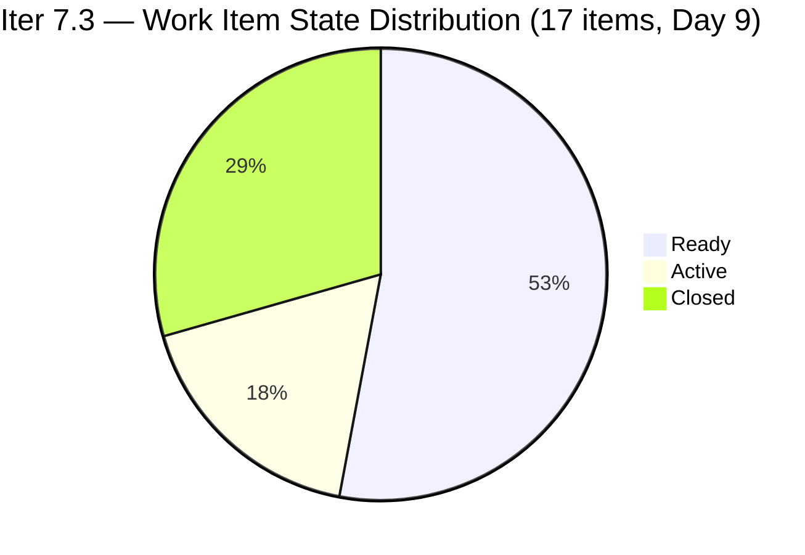
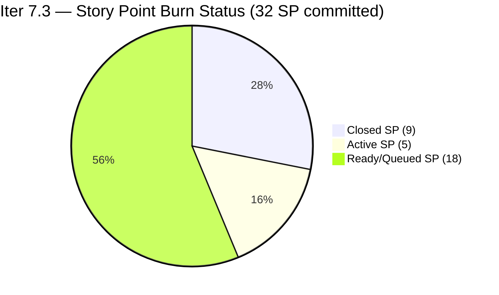
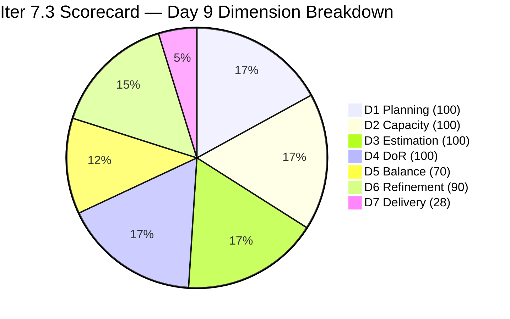

# ADO SAFe Iteration Audit — HR Recruitment Team

**Audit #57 | Iteration 7.3 (May 4 – May 17, 2026) | Day 9 of 14**

---

## 1. Audit Metadata

| Field | Value |
|---|---|
| **Audit Date** | May 12, 2026, 09:03 UTC / 02:03 PDT (UTC−7) / 17:03 PHT (UTC+8) |
| **Auditor** | Claude Code (ADO SAFe Audit Agent) |
| **Workspace** | `ado_hr` |
| **ADO Project** | Jairosoft FINOPS (`e0bb302f-40f9-46c3-8164-6f1acb317d63`) |
| **Team** | Human Resource Recruitment Team (`248f59a6-372c-4b74-8129-9eaf260f211e`) |
| **Iteration** | Iteration 7.3 — May 4 to May 17, 2026 |
| **Iteration ID** | `d76b8de5-94fe-4b28-987a-263d56afd8d4` |
| **Sprint Day** | Day 9 of 14 (64.3% elapsed) |
| **Days Remaining** | 5 |
| **Prior Audit** | AUDIT_20260511_0902.md (Audit #56, Iter 7.3 Day 8, Overall 84.0 — Low Risk) |
| **Scoring Model** | ADO SAFe v1 (7-dimension rubric) |
| **Overall Score** | **84.0 / 100** |
| **Risk Band** | **Low Risk** (≥80) |

---

## 2. Executive Summary

HR Recruitment Team scores **84.0 / 100 (Low Risk)** on Day 9 of Iteration 7.3 — **unchanged from Day 8**. No new closures were detected overnight; however, a noteworthy event occurred today: **#203537 "APE — Calvin John Dalino" moved to Active state** (ChangedDate: 2026-05-12T05:42:33 UTC), signaling that Almera has begun work on the next APE item. This is a positive burn indicator but does not yet move D7.

The sprint stands at 9/32 SP closed (28.1%) on Day 9 with 5 days remaining. The linear burn expectation at Day 9 is 32 × 0.643 = 20.6 SP. The burn deficit is now **−11.6 SP vs. linear pace**, widening from −9.3 SP on Day 8. With 23 SP remaining in 5 days, the required daily burn rate rises to **4.6 SP/day**.

**Key observations on Day 9:**
- No new closures detected — D7 holds at 28.1% (9/32 SP).
- #203537 activated today — Almera is actively working on Calvin John Dalino's APE.
- Two Active items remain the primary burn targets: #202099 (Medical Check-up, 1 SP) and #203536 (APE Tayao, 2 SP).
- Three untouched items persist (#202104, #202349, #197939 — last changed Apr 30) maintaining the -10 Backlog Refinement penalty.
- Score trend: flat at 84.0 for two consecutive days. Closures required today to preserve Low Risk through sprint end.

---

## 3. Previous Audit Delta

| Dimension | Audit #56 (May 11, Day 8, 84.0) | Audit #57 (May 12, Day 9, 84.0) | Delta | Driver |
|---|---|---|---|---|
| Iteration Planning | 100.0 | **100.0** | 0.0 | 17 current / 17 visible — no scope change |
| Team Capacity | 100.0 | **100.0** | 0.0 | Almera 5 pts/day; Grace 0.25 pts/day — both configured |
| Estimation | 100.0 | **100.0** | 0.0 | 17/17 items have SP > 0 — unchanged |
| DoR Compliance | 100.0 | **100.0** | 0.0 | 17/17 pass Description + AC — unchanged |
| Work Item Balance | 70.0 | **70.0** | 0.0 | US dominant 94.1% (−30); Spike 5.9% — unchanged |
| Backlog Refinement | 90.0 | **90.0** | 0.0 | 3/17 untouched (17.6% → −10); all fresh — unchanged |
| Delivery Predictability | 28.1 | **28.1** | 0.0 | No new closures detected; 9/32 SP still closed |
| **Overall** | **84.0** | **84.0** | **0.0** | Flat day — #203537 activated but not yet closed |

---

## 4. Current Iteration Snapshot

| Attribute | Value |
|---|---|
| **Iteration** | Iteration 7.3 |
| **Sprint Dates** | May 4 – May 17, 2026 (14 days) |
| **Sprint Day** | Day 9 of 14 (64.3% elapsed) |
| **Days Remaining** | 5 |
| **Visible Backlog Items (API, open)** | 12 |
| **Confirmed Closed in Iter 7.3** | 5 (#203533, #202887, #201273, #203063, #203829) |
| **Total Current Sprint Items** | 17 (12 open + 5 closed) |
| **Committed SP** | 32 SP |
| **Closed SP** | 9 SP (28.1%) |
| **Open SP Remaining** | 23 SP |
| **Linear Burn Expectation at Day 9** | 20.6 SP (64.3% of 32) |
| **Burn Deficit** | −11.6 SP vs. linear pace |
| **Required Daily Burn (Days 9–14)** | 4.6 SP/day |
| **Capacity** | Almera: 5 pts/day (3 Documentation + 2 Requirements); Grace: 0.25 pts/day Documentation |
| **Today's Activity** | #203537 moved to Active (May 12) |
| **Active Items** | #202099 (Medical Check-up, 1 SP), #203536 (APE Tayao, 2 SP), #203537 (APE Calvin Dalino, 2 SP) — **3 Active** |

---

## 5. Work Item Analysis

### Confirmed Closed in Iter 7.3 (5 items, 9 SP total — unchanged)

| ID | Title | Type | SP | Closed Day |
|---|---|---|---|---|
| **203533** | LinkedIn Bubble Dev Hiring | User Story | 2 | May 5 (Day 2) |
| **202887** | Sr. Tech Lead — Barua, Marlo | User Story | 2 | May 7 (Day 4) |
| **201273** | LinkedIn Bubble Trainer — Interview | User Story | 2 | May 7 (Day 4) |
| **203063** | Sales & Mktg. — Angel Dorothy Abina | User Story | 2 | May 11 (Day 8) |
| **203829** | APE — Babael, Samantha (2nd Month) | User Story | 1 | May 11 (Day 8) |

### Iteration 7.3 — Open Items (12 items from backlog API, Day 9)

| ID | Title | Type | State | SP | Assignee | ChangedDate | DoR |
|---|---|---|---|---|---|---|---|
| 203825 | Client Interview — Sr. Tech Lead Maraon, Belleo | User Story | Ready | 2 | Almera | May 5 | Pass |
| 202093 | LinkedIn DevOps Engr. Hiring | User Story | Ready | 2 | Almera | May 4 | Pass |
| 203534 | LinkedIn Tech Sales Manila (Sprint 7.3) | User Story | Ready | 1 | Almera | May 4 | Pass |
| 203535 | APE — Caumban, Karl Jordan (7.3) | User Story | Ready | 2 | Almera | May 4 | Pass |
| 203536 | APE — Tayao, Almera Kleer (7.3) | User Story | Active | 2 | Almera | May 6 | Pass |
| **203537** | **APE — Calvin John Dalino — Summary (7.3)** | **User Story** | **Active** | **2** | **Almera** | **May 12** | **Pass** |
| 202104 | APE — Rommel Senillo Summary PI7 | User Story | Ready | 2 | Almera | Apr 30 | Pass |
| 203538 | APE — Ryan Vince Castillo (7.3) | User Story | Ready | 2 | Almera | May 4 | Pass |
| 202099 | Annual Medical Check-up Cebu PI7 | User Story | Active | 1 | Almera | May 6 | Pass |
| 202349 | Finance Reporting & Export | User Story | Ready | 2 | Almera | Apr 30 | Pass |
| 197939 | Communication Skills Proposals Summary | User Story | Ready | 2 | Almera | Apr 30 | Pass |
| 203629 | HR Discussion on Incentives & Bonuses | Spike | Ready | 3 | Almera | May 6 | Pass |

> **New today:** #203537 moved from Ready → Active on May 12. Almera is now running 3 concurrent Active items (#202099, #203536, #203537). Closing any of these today adds directly to D7.

### DoR Assessment — All 17 Sprint Items

| Gate | Pass | Fail | Rate |
|---|---|---|---|
| Description ≥ 30 non-whitespace chars | 17 | 0 | 100% |
| Acceptance Criteria ≥ 20 non-whitespace chars | 17 | 0 | 100% |
| **Combined DoR (17 total incl. 5 closed)** | **17** | **0** | **100%** |

### Untouched Items (ChangedDate before sprint start May 4, 2026)

| ID | Title | Last Changed | Days Since Sprint Start |
|---|---|---|---|
| 202104 | APE — Rommel Senillo | Apr 30 | 12 days |
| 202349 | Finance Reporting & Export | Apr 30 | 12 days |
| 197939 | Communication Skills Proposals Summary | Apr 30 | 12 days |

3 of 17 items = 17.6% untouched → >10% threshold → −10 Backlog Refinement penalty. These items are pre-prepared and remain in Ready state, queued behind Active items.

### Type Distribution (17 current sprint items)

| Type | Count | Share | Impact |
|---|---|---|---|
| User Story | 16 | 94.1% | Dominant (>60%) → −30 |
| Spike | 1 | 5.9% | <40% → no additional penalty |

---

## 6. SAFe Compliance Scorecard

| Dimension | Score | Evidence | Notes |
|---|---|---|---|
| 1. Iteration Planning | 100.0 | 17 current / 17 visible = 100% | All sprint items in Iter 7.3; zero overflow |
| 2. Team Capacity | 100.0 | 1/1 contributor with sprint work has capacity | Almera: 5 pts/day configured; Grace 0.25 pts/day (no sprint items) |
| 3. Estimation | 100.0 | 17/17 items with SP > 0 | Range: 1–3 SP; total committed = 32 SP |
| 4. DoR Compliance | 100.0 | 17/17 pass Description + AC | All items verified; 100% for ninth consecutive audit |
| 5. Work Item Balance | 70.0 | US present; dominant 94.1% > 60% → −30; Spike 5.9% < 40% | Base 100 − 30 = 70; structural |
| 6. Backlog Refinement | 90.0 | All 17 fresh; stale_90=0; stale_180=0; untouched 3/17=17.6% → −10 | Base 100 − 10 = 90 |
| 7. Delivery Predictability | 28.1 | 9 SP closed / 32 SP committed = 28.125% | Day 9 of 14; no new closures; #203537 activated |
| **Overall** | **84.0** | (100+100+100+100+70+90+28.1) / 7 = 588.1 / 7 | **Low Risk** (≥80) |

### Score Computation
```
D1 = 17 / 17 × 100 = 100.0
D2 = 1 / 1  × 100  = 100.0
D3 = 17 / 17 × 100 = 100.0
D4 = 17 / 17 × 100 = 100.0
D5 = 100 − 30 = 70.0   (US dominant 94.1%)
D6 = 100.0 − 10 = 90.0  (untouched 3/17 = 17.6% → −10)
D7 = 9 / 32 × 100 = 28.125 → 28.1

Overall = (100 + 100 + 100 + 100 + 70 + 90 + 28.1) / 7 = 588.1 / 7 = 84.0
```

---

## 7. Dimension Findings

### D1 — Iteration Planning: 100.0 ✅
```
visible_root_backlog_items   = 17 (12 open API + 5 confirmed closed)
current_iteration_root_items = 17
D1 = (17 / 17) × 100 = 100.0
```
Perfect iteration scoping maintained through Day 9. All 17 items remain in Iteration 7.3 with zero overflow to future iterations or project root. The team's single-sprint focus remains a structural strength.

### D2 — Team Capacity: 100.0 ✅
- **Almera Kleer Tayao**: 3 pts/day Documentation + 2 pts/day Requirements = 5.0 pts/day ✅
- **Grace**: 0.25 pts/day Documentation — capacity configured but no sprint items assigned.

Contributors with current work = 1 (Almera). Contributors with capacity = 1 (Almera). D2 = 1/1 = 100.0.

### D3 — Estimation: 100.0 ✅
```
point_eligible_current_items = 17
estimated_current_items      = 17 (all have SP > 0; range 1–3 SP)
D3 = (17 / 17) × 100 = 100.0
```
Estimation discipline perfect and sustained across all 57 audits.

### D4 — DoR Compliance: 100.0 ✅
All 12 open items verified from live ADO API data:
- **Description**: all pass (≥30 non-whitespace chars; As a/I want/So that or To/So that narrative format confirmed)
- **Acceptance Criteria**: all pass (≥20 non-whitespace chars; numbered measurable conditions confirmed)

Combined with 5 confirmed-closed items = 17/17 = 100%.

### D5 — Work Item Balance: 70.0 (Structural)
```
User Story present: Yes → +0 penalty
User Story share: 16/17 = 94.1% > 60% → −30
Spike share: 1/17 = 5.9% < 40% → +0
D5 = 100 − 30 = 70.0
```
High US concentration reflects HR's operational mandate. The -30 penalty is structural and expected for this team. Introducing a second Spike or an Enabler in Sprint 7.4 remains the standing recommendation.

### D6 — Backlog Refinement: 90.0
```
visible_root_backlog_items = 17
fresh_visible_root_items   = 17 (all changed Apr 30 – May 12; within 45-day window)
stale_90 (before Feb 11, 2026): 0 items → 0 penalty
stale_180 (before Nov 13, 2025): 0 items → 0 penalty
untouched_current_items (before May 4): 3 (202104, 202349, 197939 — Apr 30)

base = 100.0
untouched penalty: 3/17 = 17.6% > 10% → −10

D6 = 100.0 − 10 = 90.0
```
The three untouched items (Apr 30) remain in Ready state. They are well-documented and queue behind Active items. The penalty will resolve naturally as Active items close and Ready items advance.

### D7 — Delivery Predictability: 28.1 (No movement — burn deficit widening)
```
committed_story_points = 32
closed_story_points    = 9 (#203533 2SP + #202887 2SP + #201273 2SP + #203063 2SP + #203829 1SP)
D7 = (9 / 32) × 100 = 28.125 → 28.1
```
At Day 9 of 14 (64.3% elapsed), linear expectation = 32 × 0.643 = 20.6 SP. Actual = 9 SP (43.7% of linear pace). Burn deficit now = **−11.6 SP**, widening from −9.3 SP on Day 8.

The positive signal is **#203537 activated today** (Almera began Calvin John Dalino's APE). Three items are now simultaneously Active: #202099 (1 SP), #203536 (2 SP), #203537 (2 SP). Closing all three raises D7 to 14/32 = 43.75%, Overall ≈ 86.0.

**Burn path to sprint end:**
- Close 3 Active items (5 SP): D7 = 14/32 = 43.75% → Overall ≈ 86.0
- Close APE cluster (#203535 + #203537 + #203538 + #203536 = 8 SP): D7 = 17/32 = 53.1% → Overall ≈ 87.2
- Full sprint delivery (all 23 SP): D7 = 100% → Overall ≈ 94.3

---

## 8. Risks and Bottlenecks





| Risk | Severity | Status | Action |
|---|---|---|---|
| **Burn deficit: −11.6 SP below linear at Day 9** | High | 64.3% elapsed; 23 SP in 5 days (4.6 SP/day needed) | Close 3 Active items today; push to batch-close APE cluster |
| **Bus Factor = 1** (Almera owns 16/17 items) | High | Structural — unchanged | Long-term: cross-train; short-term: accept |
| **5-day window narrowing** | High | Sprint ends May 17; 3 Active items queued | #202099 (1SP) should close today; #203536, #203537 (4SP) this week |
| **No Iteration Goal defined** | Moderate | Unfixed across 57 audits | Define at next sprint planning |
| **No PI Objectives linked** | Moderate | Unfixed across 57 audits | Coordinate with Program Management |
| **3 untouched items (17.6%)** | Low | Pre-sprint prepared; advancing naturally | Expected to activate as Active items close |
| **Grace capacity unused** | Low | 0.25 pts/day; no items | Assign low-priority item to reduce bus factor risk |

---

## 9. Prioritized Recommendations

1. **[Immediate — Today] Close #202099 "Annual Medical Check-up Cebu PI7" (1 SP, Active since May 6)** — This item has been Active for 6 days and is the smallest SP item in the sprint. Closing today adds 1 SP → D7 = 10/32 = 31.3%.

2. **[Today] Complete #203536 and #203537 (APE cluster — 4 SP total)** — Both APE items are Active and adjacent tasks. Closing both adds 4 SP → D7 = 14/32 = 43.8%, Overall ≈ 86.0. This would be the largest single-day delivery since Day 8.

3. **[This Sprint] Systematically close APE cluster** — Five APE items total (#203535, #203536, #203537, #203538, + #202104 = 10 SP). Closing all five raises D7 to 19/32 = 59.4%, Overall ≈ 88.5. Target APE cluster completion by Day 12 (May 15).

4. **[This Sprint] Define a written Iteration Goal** — 57 consecutive audits without a documented sprint goal. Suggested goal: "Complete APE cycle for all remaining 7 employees, close 3 LinkedIn hiring campaigns, and resolve Medical Check-up for Cebu employees within Iteration 7.3."

5. **[This Sprint] Link PI 7 Objectives** — No PI 7 objectives linked. Tag APE items and LinkedIn campaigns to PI 7 outcomes.

6. **[Next Sprint] Add second Spike or Enabler to sprint scope** — The structural -30 D5 penalty results from 94.1% US concentration. Introducing one additional non-US item (Spike, Enabler, or Task) in Sprint 7.4 would reduce dominant-type share and lift D5 from 70 toward 100.

---

## 10. Evidence Gaps and Limitations

| Gap | Impact | Mitigation |
|---|---|---|
| Closed items not returned by backlog API | Moderate | 5 closed items confirmed from Day 2/4/8 audit series |
| Grace's sprint item details | Low | No items in backlog API; capacity confirmed at 0.25 pts/day |
| PI Objectives linkage | Low | Not queried via ADO API; known persistent gap |
| Iteration Goal field | Low | Not surfaced by standard ADO API; manual check recommended |

---

## 11. Score Trend — Iteration 7.3



| Day | Score | Band | Key Event |
|---|---|---|---|
| Day 1 | 82.7 | Low Risk | Sprint launched; 17 items loaded |
| Day 2 | 82.7 | Low Risk | #203533 closed (2 SP) |
| Day 4 | 82.7 | Low Risk | #202887, #201273 closed (2 SP each) |
| Day 5–7 | 82.7 | Low Risk | No new closures |
| Day 8 | 84.0 | Low Risk | #203063 (2 SP) + #203829 (1 SP) closed; D7 18.8 → 28.1 |
| **Day 9** | **84.0** | **Low Risk** | **#203537 activated; no closures; burn deficit widening** |

> Score flat at 84.0 for two consecutive days. D7 at 28.1% is the primary lever and the primary risk. With 5 days and 23 SP remaining, achieving Low Risk ≥ 80 at sprint close requires closing approximately 10 SP (D7 ≥ 59.4%). The 3 currently Active items (5 SP) are the immediate target. Almera's historical batch-close pattern in the second sprint half is encouraging.

---

*Report generated: May 12, 2026, 09:03 UTC | Workspace: ado_hr | Auditor: Claude Code ADO SAFe Audit Agent*
