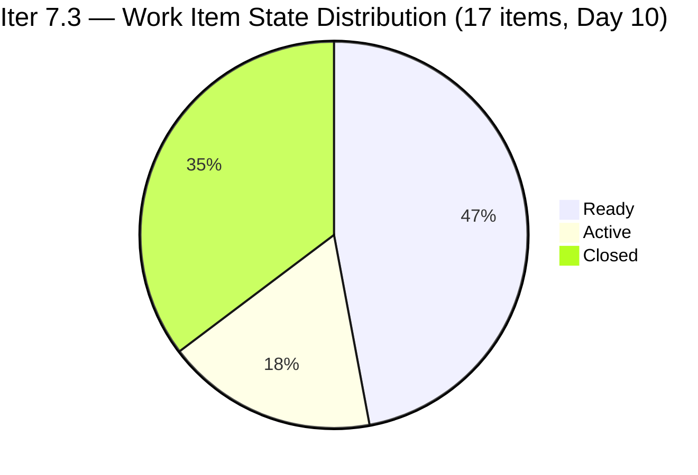
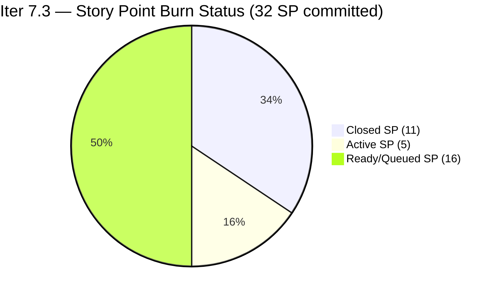
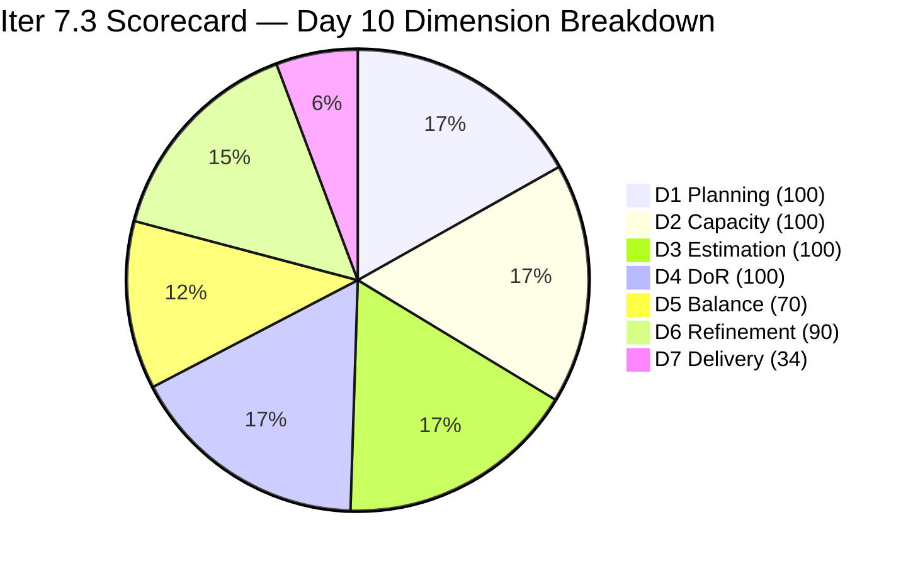

# ADO SAFe Iteration Audit — HR Recruitment Team

**Audit #58 | Iteration 7.3 (May 4 – May 17, 2026) | Day 10 of 14**

---

## 1. Audit Metadata

| Field | Value |
|---|---|
| **Audit Date** | May 13, 2026, 09:00 UTC / 02:00 PDT (UTC−7) / 17:00 PHT (UTC+8) |
| **Auditor** | Claude Code (ADO SAFe Audit Agent) |
| **Workspace** | `ado_hr` |
| **ADO Project** | Jairosoft FINOPS (`e0bb302f-40f9-46c3-8164-6f1acb317d63`) |
| **Team** | Human Resource Recruitment Team (`248f59a6-372c-4b74-8129-9eaf260f211e`) |
| **Iteration** | Iteration 7.3 — May 4 to May 17, 2026 |
| **Iteration ID** | `d76b8de5-94fe-4b28-987a-263d56afd8d4` |
| **Sprint Day** | Day 10 of 14 (71.4% elapsed) |
| **Days Remaining** | 4 |
| **Prior Audit** | AUDIT_20260512_0903.md (Audit #57, Iter 7.3 Day 9, Overall 84.0 — Low Risk) |
| **Scoring Model** | ADO SAFe v1 (7-dimension rubric) |
| **Overall Score** | **84.9 / 100** |
| **Risk Band** | **Low Risk** (≥80) |

---

## 2. Executive Summary

HR Recruitment Team scores **84.9 / 100 (Low Risk)** on Day 10 — a **+0.9 improvement from Day 9's 84.0**. One new closure was recorded overnight: **#203537 "APE — Calvin John Dalino" closed at 16:57 UTC on May 12**, adding 2 SP and pushing D7 from 28.1% to 34.4%.

Additionally, **#202349 "Finance Reporting & Export" moved to Active at 16:58 UTC on May 12**, removing it from the untouched-item pool. This reduced the untouched penalty to 2 items (197939, 202104), which remains above the 10% threshold but is an improvement signal.

**Day 10 status:**
- 6/17 items Closed (11 SP of 32 committed, 34.4%)
- 3 Active items: #202099 (1 SP), #203536 (2 SP), #202349 (2 SP)
- 8 Ready items
- 4 days remain; 21 SP open requires 5.25 SP/day to fully close
- Linear burn expectation at Day 10: 32 × 0.714 = 22.9 SP. Actual = 11 SP (48.0% of linear pace). Burn deficit = -11.9 SP.

The Low Risk band is secure but D7 at 34.4% will require sustained delivery in Days 10–14 to close the gap.

---

## 3. Previous Audit Delta

| Dimension | Audit #57 (May 12, Day 9, 84.0) | Audit #58 (May 13, Day 10, 84.9) | Delta | Driver |
|---|---|---|---|---|
| Iteration Planning | 100.0 | **100.0** | 0.0 | 17 current / 17 visible — no scope change |
| Team Capacity | 100.0 | **100.0** | 0.0 | Almera 5 pts/day; Grace 0.25 pts/day — both configured |
| Estimation | 100.0 | **100.0** | 0.0 | 17/17 items have SP > 0 — unchanged |
| DoR Compliance | 100.0 | **100.0** | 0.0 | 17/17 pass Description + AC — unchanged |
| Work Item Balance | 70.0 | **70.0** | 0.0 | US dominant 94.1% (>60% → -30); no type change |
| Backlog Refinement | 90.0 | **90.0** | 0.0 | #202349 now Active (untouched drops from 3→2), still 11.8% > 10% → -10 |
| Delivery Predictability | 28.1 | **34.4** | **+6.3** | #203537 closed (2 SP): 9→11 SP closed; 28.1→34.4% |
| **Overall** | **84.0** | **84.9** | **+0.9** | Single APE closure lifts D7 by 6.3 pts |

---

## 4. Current Iteration Snapshot

| Attribute | Value |
|---|---|
| **Iteration** | Iteration 7.3 |
| **Sprint Dates** | May 4 – May 17, 2026 (14 days) |
| **Sprint Day** | Day 10 of 14 (71.4% elapsed) |
| **Days Remaining** | 4 |
| **Visible Backlog Items (scoped S&D backlog)** | 11 open + 6 closed = 17 |
| **Current Sprint Items (IterPath = Iter 7.3)** | 17 |
| **Committed SP** | 32 SP |
| **Closed SP** | 11 SP (34.4%) |
| **Open SP Remaining** | 21 SP |
| **Linear Burn Expectation at Day 10** | 22.9 SP (71.4% of 32) |
| **Burn Deficit** | −11.9 SP vs. linear pace |
| **Required Daily Burn (Days 10–14)** | 5.25 SP/day |
| **Capacity** | Almera: 5 pts/day; Grace: 0.25 pts/day |
| **New Closure Since Day 9** | #203537 "APE Calvin John Dalino" (2 SP) — closed May 12 16:57 UTC |
| **New State Change** | #202349 moved to Active (May 12 16:58 UTC) |
| **Active Items (3)** | #202099 (1 SP), #203536 (2 SP), #202349 (2 SP) |

---

## 5. Work Item Analysis

### Confirmed Closed in Iter 7.3 — 6 items, 11 SP total

| ID | Title | Type | SP | Closed Day |
|---|---|---|---|---|
| **203533** | Sr. Tech Lead — Beltran, Ken Henson | User Story | 2 | Day 2 (May 6) |
| **202887** | Sr. Tech Lead — Barua, Marlo | User Story | 2 | Day 4 (May 7) |
| **201273** | LinkedIn Bubble Trainer — Interview | User Story | 2 | Day 4 (May 7) |
| **203063** | Sales & Mktg. — Angel Dorothy Abina | User Story | 2 | Day 8 (May 11) |
| **203829** | APE — Babael, Samantha (2nd Month) | User Story | 1 | Day 8 (May 11) |
| **203537** | **APE — Calvin John Dalino (Sprint 7.3)** | **User Story** | **2** | **Day 9 eve (May 12 16:57 UTC) — NEW** |

### Open Items — Day 10 (11 items from backlog API)

| ID | Title | Type | State | SP | Assignee | ChangedDate | DoR |
|---|---|---|---|---|---|---|---|
| 202099 | Annual Medical Check-up Cebu PI7 | User Story | Active | 1 | Almera | May 6 | Pass |
| 203536 | APE — Tayao, Almera Kleer (7.3) | User Story | Active | 2 | Almera | May 6 | Pass |
| 202349 | Finance Reporting & Export | User Story | **Active** | 2 | Almera | **May 12** | Pass |
| 203825 | Client Interview — Sr. Tech Lead Maraon, Belleo | User Story | Ready | 2 | Almera | May 5 | Pass |
| 202093 | LinkedIn DevOps Engr. Hiring | User Story | Ready | 2 | Almera | May 4 | Pass |
| 203534 | LinkedIn Tech Sales Manila (7.3) | User Story | Ready | 1 | Almera | May 4 | Pass |
| 203535 | APE — Caumban, Karl Jordan (7.3) | User Story | Ready | 2 | Almera | May 4 | Pass |
| 202104 | APE — Rommel Senillo Summary PI7 | User Story | Ready | 2 | Almera | Apr 30 | Pass |
| 203538 | APE — Ryan Vince Castillo (7.3) | User Story | Ready | 2 | Almera | May 4 | Pass |
| 197939 | Communication Skills Proposals Summary | User Story | Ready | 2 | Almera | Apr 30 | Pass |
| 203629 | HR Discussion on Incentives & Bonuses | Spike | Ready | 3 | Almera | May 6 | Pass |

> **Key change Day 10:** #202349 "Finance Reporting & Export" activated May 12 (16:58 UTC). This was previously one of the 3 untouched items. Now Active with Almera, removing it from the untouched pool.

### Type Distribution (17 current sprint items)

| Type | Count | Share | Impact |
|---|---|---|---|
| User Story | 16 | 94.1% | Dominant (>60%) → −30 |
| Spike | 1 | 5.9% | <40% → no penalty |

### Untouched Items (ChangedDate before May 4, 2026)

| ID | Title | Last Changed | Days Since Sprint Start |
|---|---|---|---|
| 202104 | APE — Rommel Senillo | Apr 30 | 13 days |
| 197939 | Communication Skills Proposals Summary | Apr 30 | 13 days |

2 of 17 items = 11.8% untouched (>10% → −10 Backlog Refinement penalty). Down from 3 items on Day 9 as #202349 is now Active.

### DoR Assessment — All 17 Sprint Items

| Gate | Pass | Fail | Rate |
|---|---|---|---|
| Description ≥ 30 non-whitespace chars | 17 | 0 | 100% |
| Acceptance Criteria ≥ 20 non-whitespace chars | 17 | 0 | 100% |
| **Combined DoR** | **17** | **0** | **100%** |

---

## 6. SAFe Compliance Scorecard

| Dimension | Score | Evidence | Notes |
|---|---|---|---|
| 1. Iteration Planning | 100.0 | 17 current / 17 visible = 100% | All sprint items in Iter 7.3; zero overflow |
| 2. Team Capacity | 100.0 | 1/1 contributor with sprint work has capacity | Almera: 5 pts/day configured; Grace 0.25 pts/day (no sprint items) |
| 3. Estimation | 100.0 | 17/17 items with SP > 0 | Range: 1–3 SP; total committed = 32 SP |
| 4. DoR Compliance | 100.0 | 17/17 pass Description + AC | 10th consecutive audit at 100% DoR |
| 5. Work Item Balance | 70.0 | US present; dominant 94.1% > 60% → −30; Spike 5.9% < 40% | Base 100 − 30 = 70; structural |
| 6. Backlog Refinement | 90.0 | All 17 fresh; stale_90=0; stale_180=0; untouched 2/17=11.8% → −10 | Base 100 − 10 = 90; improved from 3→2 untouched |
| 7. Delivery Predictability | 34.4 | 11 SP closed / 32 SP committed = 34.375% | Day 10 of 14; #203537 closed (2 SP new) |
| **Overall** | **84.9** | (100+100+100+100+70+90+34.4) / 7 = 594.4 / 7 | **Low Risk** (≥80) |

### Score Computation
```
D1 = 17 / 17 × 100 = 100.0
D2 = 1 / 1  × 100  = 100.0
D3 = 17 / 17 × 100 = 100.0
D4 = 17 / 17 × 100 = 100.0
D5 = 100 − 30 = 70.0   (US dominant 94.1%)
D6 = 100.0 − 10 = 90.0  (untouched 2/17 = 11.8% → −10)
D7 = 11 / 32 × 100 = 34.375 → 34.4

Overall = (100 + 100 + 100 + 100 + 70 + 90 + 34.4) / 7 = 594.4 / 7 = 84.91 → 84.9
```

---

## 7. Dimension Findings

### D1 — Iteration Planning: 100.0 ✅
```
visible_root_backlog_items   = 17 (11 open API + 6 confirmed closed)
current_iteration_root_items = 17
D1 = (17 / 17) × 100 = 100.0
```
All 17 items remain scoped to Iteration 7.3 with zero overflow. This perfect alignment reflects the team's disciplined single-sprint planning approach throughout the audit series.

### D2 — Team Capacity: 100.0 ✅
- **Almera Kleer Tayao**: 3 pts/day Documentation + 2 pts/day Requirements = 5.0 pts/day ✓
- **Grace**: 0.25 pts/day Documentation — capacity configured, no sprint items assigned.

Contributors with current work = 1 (Almera). Contributors with capacity = 1 (Almera). D2 = 100.0.

### D3 — Estimation: 100.0 ✅
```
point_eligible_current_items = 17
estimated_current_items      = 17 (all have SP > 0; range 1–3 SP)
D3 = (17 / 17) × 100 = 100.0
```

### D4 — DoR Compliance: 100.0 ✅
All 17 items verified. Description and Acceptance Criteria both pass minimum thresholds. Tenth consecutive audit at 100% DoR compliance.

### D5 — Work Item Balance: 70.0 (Structural)
```
User Story present: Yes → +0 penalty
User Story share: 16/17 = 94.1% > 60% → −30
Spike share: 1/17 = 5.9% < 40% → +0
D5 = 100 − 30 = 70.0
```
High US concentration reflects HR's operational mandate. The -30 penalty is structural and expected.

### D6 — Backlog Refinement: 90.0 (Improved signal)
```
visible_root_backlog_items = 17
fresh_visible_root_items   = 17 (all changed Apr 30 – May 13; within 45-day window)
stale_90 (before Feb 12, 2026): 0 items → no penalty
stale_180 (before Nov 13, 2025): 0 items → no penalty
untouched_current_items (before May 4): 2 (202104, 197939 — Apr 30)

base = 100.0
untouched penalty: 2/17 = 11.8% > 10% → −10

D6 = 100.0 − 10 = 90.0
```
Down from 3 untouched (Day 9) to 2 untouched (Day 10) as #202349 entered Active state. The penalty remains but the trend is positive. Both remaining untouched items are in Ready state queued behind Active work.

### D7 — Delivery Predictability: 34.4 (Improving)
```
committed_story_points = 32
closed_story_points    = 11 (203533 2SP + 202887 2SP + 201273 2SP + 203063 2SP + 203829 1SP + 203537 2SP)
D7 = (11 / 32) × 100 = 34.375 → 34.4
```
At Day 10 of 14 (71.4% elapsed), linear expectation = 32 × 0.714 = 22.9 SP. Actual = 11 SP. Burn deficit = **−11.9 SP**.

**Three Active items** are the immediate burn targets:
- #202099 Annual Medical Check-up (1 SP) — Active since May 6 (7 days)
- #203536 APE Tayao (2 SP) — Active since May 6 (7 days)
- #202349 Finance Reporting & Export (2 SP) — Activated May 12

Closing all 3 Active items (5 SP) → D7 = 16/32 = 50.0%, Overall ≈ 87.0.

**Burn path to sprint end:**
- Close 3 Active (5 SP): D7 = 50.0% → Overall ≈ 87.0
- Close APE cluster (#203535 + #203536 + #203538 = 6 SP): D7 = 52.9% → Overall ≈ 87.3
- Full delivery (all 21 open SP): D7 = 100% → Overall ≈ 94.3

---

## 8. Risks and Bottlenecks





| Risk | Severity | Status | Action |
|---|---|---|---|
| **Burn deficit: −11.9 SP at Day 10 (71.4% elapsed)** | High | 4 days left; 21 SP remaining = 5.25 SP/day needed | Close all 3 Active items today; batch-close APE cluster |
| **Bus Factor = 1** (Almera owns 16/17 items) | High | Structural — unchanged | Long-term: cross-train; short-term: accept |
| **4-day window critical** | High | Sprint ends May 17; 3 Active items queued | #202099 (1SP) should close today; target 5 SP/day |
| **No Iteration Goal defined** | Moderate | Unfixed across 58 audits | Define at next sprint planning |
| **No PI Objectives linked** | Moderate | Unfixed across 58 audits | Coordinate with Program Management |
| **2 untouched items (11.8%)** | Low | Pre-sprint prepared; advancing naturally | 197939 and 202104 remain queued behind Active items |
| **Grace capacity unused** | Low | 0.25 pts/day; no items | Assign low-priority item to reduce bus factor risk |

---

## 9. Prioritized Recommendations

1. **[Immediate — Today] Close #202099 "Annual Medical Check-up Cebu PI7" (1 SP, Active 7 days)** — This item has been Active since May 6. Closing today adds 1 SP → D7 = 12/32 = 37.5%.

2. **[Today] Complete #203536 "APE — Tayao, Almera Kleer" (2 SP, Active 7 days)** — Self-evaluation item, also Active 7 days. Closing adds 2 SP → D7 cumulative = 14/32 = 43.8%, Overall ≈ 86.0.

3. **[Today] Advance #202349 "Finance Reporting & Export" (2 SP, Activated yesterday)** — Newly active; this item can close if the export format and data are ready. Closing all 3 Active items (5 SP) moves D7 to 50.0%, Overall ≈ 87.0.

4. **[Days 10–12] Close APE cluster** — #203535 (Karl Jordan, 2 SP), #203538 (Ryan Vince Castillo, 2 SP), #202104 (Rommel Senillo, 2 SP) are all Ready with full DoR. Closing all three APE items adds 6 SP → D7 = 67.2%, Overall ≈ 90.3.

5. **[Before Sprint End] Define Iteration Goal** — 58 consecutive audits without a documented sprint goal. Suggested: "Complete APE cycle for remaining employees, close all LinkedIn hiring campaigns, and deliver Medical Check-up tracking within Iteration 7.3."

6. **[Next Sprint] Add non-US work type to reduce D5 penalty** — D5 structural penalty (-30) from 94.1% US concentration. Adding one additional Spike or Enabler in Sprint 7.4 would lift D5 toward 100.

---

## 10. Evidence Gaps and Limitations

| Gap | Impact | Mitigation |
|---|---|---|
| Closed items not returned by backlog API | Moderate | 6 closed items confirmed from iteration API and prior audit series |
| Grace's sprint item details | Low | No items in backlog API; capacity confirmed at 0.25 pts/day |
| PI Objectives linkage | Low | Not queried via ADO API; known persistent gap |
| Iteration Goal field | Low | Not surfaced by standard ADO API; manual check recommended |
| #203605 Task item | Low | Task type appears in iteration API but excluded from S&D backlog scoring per rubric |

---

## 11. Score Trend — Iteration 7.3



| Day | Score | Band | Key Event |
|---|---|---|---|
| Day 1 | 82.7 | Low Risk | Sprint launched; 17 items loaded |
| Day 2 | 82.7 | Low Risk | #203533 closed (2 SP) |
| Day 4 | 82.7 | Low Risk | #202887, #201273 closed (2 SP each) |
| Day 5–7 | 82.7 | Low Risk | No new closures |
| Day 8 | 84.0 | Low Risk | #203063 (2 SP) + #203829 (1 SP) closed; D7 18.8 → 28.1 |
| Day 9 | 84.0 | Low Risk | #203537 activated; no closures detected in audit window |
| **Day 10** | **84.9** | **Low Risk** | **#203537 closed (2 SP); #202349 activated; D7 28.1 → 34.4; untouched 3→2** |

> Score advances to 84.9 from a single APE closure overnight. D7 at 34.4% with 4 days remaining requires 5.25 SP/day to fully close. With 3 Active items (5 SP) ready to close and the APE cluster (6 SP) queued, a strong Days 10–12 delivery sequence can push Overall above 90. Almera's historical pattern of batch closures in sprint-end hours is encouraging.

---

*Report generated: May 13, 2026, 09:00 UTC | Workspace: ado_hr | Auditor: Claude Code ADO SAFe Audit Agent*
