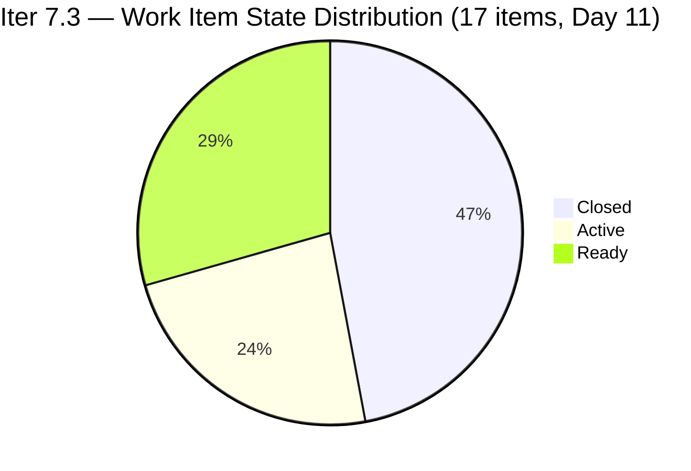
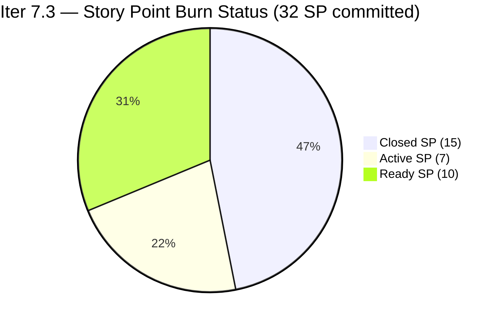
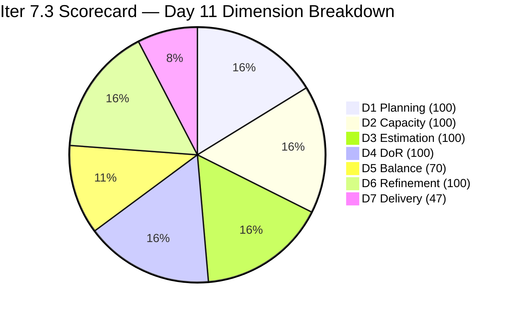

# ADO SAFe Iteration Audit — HR Recruitment Team

**Audit #59 | Iteration 7.3 (May 4 – May 17, 2026) | Day 11 of 14**

---

## 1. Audit Metadata

| Field | Value |
|---|---|
| **Audit Date** | May 14, 2026, 09:00 CDT / 14:00 UTC / 22:00 PHT (UTC+8) |
| **Auditor** | Claude Code (ADO SAFe Audit Agent) |
| **Workspace** | `ado_hr` |
| **ADO Project** | Jairosoft FINOPS (`e0bb302f-40f9-46c3-8164-6f1acb317d63`) |
| **Team** | Human Resource Recruitment Team (`248f59a6-372c-4b74-8129-9eaf260f211e`) |
| **Iteration** | Iteration 7.3 — May 4 to May 17, 2026 |
| **Iteration ID** | `d76b8de5-94fe-4b28-987a-263d56afd8d4` |
| **Sprint Day** | Day 11 of 14 (78.6% elapsed) |
| **Days Remaining** | 3 |
| **Prior Audit** | AUDIT_20260513_0900.md (Audit #58, Iter 7.3 Day 10, Overall 84.9 — Low Risk) |
| **Scoring Model** | ADO SAFe v1 (7-dimension rubric) |
| **Overall Score** | **88.1 / 100** |
| **Risk Band** | **Low Risk** (≥80) |

---

## 2. Executive Summary

HR Recruitment Team scores **88.1 / 100 (Low Risk)** on Day 11 — a **+3.2 improvement from Day 10's 84.9**. Two new closures were recorded between the May 13 audit and today (May 14):

1. **#203536 "APE — Tayao, Almera Kleer (Sprint 7.3)"** (Almera, 2 SP) — Self-evaluation APE closed.
2. **#197939 "Communication Skills Proposals Summary"** (Almera, 2 SP) — Long-queued item finally resolved; previously untouched since Apr 30.

These 2 closures add **4 SP** (11 → 15 closed), lifting D7 from 34.4% to 46.9% and pushing Overall from 84.9 to 88.1. Additionally, **two items advanced from Ready to Active** overnight: #202104 "APE — Rommel Senillo" and #203535 "APE — Karl Jordan Caumban," both activated at May 13 17:25 UTC. The untouched pool now stands at **0 items**, eliminating the D6 penalty and pushing Backlog Refinement to 100.0.

**Day 11 status:**
- 8 of 17 items Closed (15 SP of 32 committed, 46.9%)
- 5 Active items: #202099 (1 SP), #202349 (2 SP), #202104 (2 SP), #203535 (2 SP); effectively 4 tracked Active + continuing burn
- 4 Ready items: #203534 (1 SP), #203538 (2 SP), #202093 (2 SP), #203825 (2 SP)
- 1 Spike in Ready: #203629 (3 SP)
- 3 days remain; 17 SP open requires 5.67 SP/day to fully close
- Linear burn expectation at Day 11: 32 × 0.786 = 25.2 SP. Actual = 15 SP (59.5% of linear pace). Burn deficit = −10.2 SP.

The D6 elimination of the untouched penalty (all items now Active, Closed, or changed within sprint) is the key structural improvement. With 3 days remaining and 5 Active items ready for closure, the team is in its best burn position of the sprint.

---

## 3. Previous Audit Delta

| Dimension | Audit #58 (May 13, Day 10, 84.9) | Audit #59 (May 14, Day 11, 88.1) | Delta | Driver |
|---|---|---|---|---|
| Iteration Planning | 100.0 | **100.0** | 0.0 | 17 current / 17 visible — no scope change |
| Team Capacity | 100.0 | **100.0** | 0.0 | Almera 5 pts/day; Grace 0.25 pts/day — unchanged |
| Estimation | 100.0 | **100.0** | 0.0 | 17/17 items have SP > 0 — unchanged |
| DoR Compliance | 100.0 | **100.0** | 0.0 | 17/17 pass Description + AC — unchanged |
| Work Item Balance | 70.0 | **70.0** | 0.0 | US dominant 94.1% (>60% → −30); structural |
| Backlog Refinement | 90.0 | **100.0** | **+10.0** | Untouched 2→0: #197939 closed, #202104 activated May 13 17:25 |
| Delivery Predictability | 34.4 | **46.9** | **+12.5** | 2 new closures (4 SP): #203536 (2 SP) + #197939 (2 SP) → 15/32 SP |
| **Overall** | **84.9** | **88.1** | **+3.2** | D6 penalty eliminated + 2 APE/Comms closures |

---

## 4. Current Iteration Snapshot

| Attribute | Value |
|---|---|
| **Iteration** | Iteration 7.3 |
| **Sprint Dates** | May 4 – May 17, 2026 (14 days) |
| **Sprint Day** | Day 11 of 14 (78.6% elapsed) |
| **Days Remaining** | 3 |
| **Visible Backlog Items (scoped S&D backlog)** | 9 open + 8 closed = 17 |
| **Current Sprint Items (IterPath = Iter 7.3)** | 17 |
| **Committed SP** | 32 SP |
| **Closed SP** | 15 SP (46.9%) |
| **Open SP Remaining** | 17 SP |
| **Linear Burn Expectation at Day 11** | 25.2 SP (78.6% of 32) |
| **Burn Deficit** | −10.2 SP vs. linear pace |
| **Required Daily Burn (Days 11–14)** | 5.67 SP/day |
| **Capacity** | Almera: 5 pts/day; Grace: 0.25 pts/day |
| **New Closures Since Day 10** | #203536 "APE Tayao, Almera Kleer" (2 SP) + #197939 "Communication Skills Proposals Summary" (2 SP) |
| **New Activations** | #202104 (Active, May 13 17:25 UTC) + #203535 (Active, May 13 17:25 UTC) |
| **Active Items (5)** | #202099 (1 SP), #202349 (2 SP), #202104 (2 SP), #203535 (2 SP); #203536 now closed |

---

## 5. Work Item Analysis

### Confirmed Closed in Iter 7.3 — 8 items, 15 SP total

| ID | Title | Type | SP | Closed By Day |
|---|---|---|---|---|
| 203533 | Sr. Tech Lead — Beltran, Ken Henson | User Story | 2 | Day 2 (May 6) |
| 202887 | Sr. Tech Lead — Barua, Marlo | User Story | 2 | Day 4 (May 7) |
| 201273 | LinkedIn Bubble Trainer — Interview | User Story | 2 | Day 4 (May 7) |
| 203063 | Sales & Mktg. — Angel Dorothy Abina | User Story | 2 | Day 8 (May 11) |
| 203829 | APE — Babael, Samantha (2nd Month) | User Story | 1 | Day 8 (May 11) |
| 203537 | APE — Calvin John Dalino (Sprint 7.3) | User Story | 2 | Day 9 (May 12) |
| **203536** | **APE — Tayao, Almera Kleer (Sprint 7.3)** | **User Story** | **2** | **Day 10/11 overnight — NEW** |
| **197939** | **Communication Skills Proposals Summary** | **User Story** | **2** | **Day 10/11 overnight — NEW** |

### Open Items — Day 11 (9 items)

| ID | Title | Type | State | SP | Assignee | ChangedDate | DoR |
|---|---|---|---|---|---|---|---|
| 202099 | Annual Medical Check-up Cebu PI7 | User Story | Active | 1 | Almera | May 6 | Pass |
| 202349 | Finance Reporting & Export | User Story | Active | 2 | Almera | May 12 | Pass |
| 202104 | APE — Rommel Senillo Summary PI7 | User Story | **Active** | 2 | Almera | **May 13** | Pass |
| 203535 | APE — Caumban, Karl Jordan (Sprint 7.3) | User Story | **Active** | 2 | Almera | **May 13** | Pass |
| 203825 | Client Interview — Sr. Tech Lead Maraon, Belleo | User Story | Ready | 2 | Almera | May 5 | Pass |
| 202093 | LinkedIn DevOps Engr. Hiring | User Story | Ready | 2 | Almera | May 4 | Pass |
| 203534 | LinkedIn Tech Sales Manila (Sprint 7.3) | User Story | Ready | 1 | Almera | May 4 | Pass |
| 203538 | APE — Ryan Vince Castillo (Sprint 7.3) | User Story | Ready | 2 | Almera | May 4 | Pass |
| 203629 | HR Discussion on Employees Incentives & Bonuses | Spike | Ready | 3 | Almera | May 6 | Pass |

> **Key changes Day 11:** #203536 and #197939 no longer appear in backlog API — both closed overnight. #202104 and #203535 advanced from Ready to Active at May 13 17:25 UTC. Untouched pool is now 0 (was 2 on Day 10).

### Type Distribution (17 current sprint items)

| Type | Count | Share | Impact |
|---|---|---|---|
| User Story | 16 | 94.1% | Dominant (>60%) → −30 |
| Spike | 1 | 5.9% | <40% → no penalty |

### Untouched Items Assessment (ChangedDate before May 4, 2026)

**0 untouched items** — all 9 open items have ChangedDate on May 4 or later. The 2 previously untouched items (#197939 closed, #202104 now Active) are resolved. D6 penalty eliminated.

### DoR Assessment — All 17 Sprint Items

| Gate | Pass | Fail | Rate |
|---|---|---|---|
| Description ≥ 30 non-whitespace chars | 17 | 0 | 100% |
| Acceptance Criteria ≥ 20 non-whitespace chars | 17 | 0 | 100% |
| **Combined DoR** | **17** | **0** | **100%** |

---

## 6. SAFe Compliance Scorecard

| Dimension | Score | Evidence | Notes |
|---|---|---|---|
| 1. Iteration Planning | 100.0 | 17 current / 17 visible = 100% | All sprint items in Iter 7.3; zero overflow |
| 2. Team Capacity | 100.0 | 1/1 contributor with sprint work has capacity | Almera: 5 pts/day configured; Grace 0.25 pts/day (no sprint items assigned) |
| 3. Estimation | 100.0 | 17/17 items with SP > 0 | Range: 1–3 SP; total committed = 32 SP |
| 4. DoR Compliance | 100.0 | 17/17 pass Description + AC | Eleventh consecutive audit at 100% DoR |
| 5. Work Item Balance | 70.0 | US present; dominant 94.1% > 60% → −30; Spike 5.9% < 40% | Structural; HR operational mandate |
| 6. Backlog Refinement | 100.0 | All 17 fresh; stale_90=0; stale_180=0; untouched=0 | Untouched penalty eliminated: #197939 closed, #202104 activated |
| 7. Delivery Predictability | 46.9 | 15 SP closed / 32 SP committed = 46.875% | Day 11 of 14; 2 new closures (4 SP) overnight |
| **Overall** | **88.1** | (100+100+100+100+70+100+46.9) / 7 = 616.9 / 7 | **Low Risk** (≥80) — series high |

### Score Computation
```
D1 = 17 / 17 × 100 = 100.0
D2 = 1 / 1  × 100  = 100.0
D3 = 17 / 17 × 100 = 100.0
D4 = 17 / 17 × 100 = 100.0
D5 = 100 − 30 = 70.0   (US dominant 94.1%)
D6 = 100.0 − 0 = 100.0  (untouched 0/17 = 0% — penalty eliminated)
D7 = 15 / 32 × 100 = 46.875 → 46.9

Overall = (100 + 100 + 100 + 100 + 70 + 100 + 46.9) / 7 = 616.9 / 7 = 88.13 → 88.1
```

---

## 7. Dimension Findings

### D1 — Iteration Planning: 100.0 ✅
```
visible_root_backlog_items   = 17 (9 open API + 8 confirmed closed)
current_iteration_root_items = 17
D1 = (17 / 17) × 100 = 100.0
```
All 17 items remain scoped to Iteration 7.3 with zero overflow. No new items added or removed. Scope discipline maintained for the full sprint.

### D2 — Team Capacity: 100.0 ✅
- **Almera Kleer Tayao**: 3 pts/day Documentation + 2 pts/day Requirements = 5.0 pts/day ✓
- **Grace**: 0.25 pts/day Documentation — capacity configured, no sprint items assigned.

Contributors with current work = 1 (Almera). Contributors with capacity = 1 (Almera). D2 = 100.0.

### D3 — Estimation: 100.0 ✅
```
point_eligible_current_items = 17
estimated_current_items      = 17 (all have SP > 0; range 1–3 SP)
D3 = (17 / 17) × 100 = 100.0
```

### D4 — DoR Compliance: 100.0 ✅
All 17 items verified. Both newly closed items (#203536, #197939) had passed DoR verification in prior audits. Eleventh consecutive audit at 100%.

### D5 — Work Item Balance: 70.0 (Structural)
```
User Story present: Yes → +0 penalty
User Story share: 16/17 = 94.1% > 60% → −30
Spike share: 1/17 = 5.9% < 40% → +0
D5 = 100 − 30 = 70.0
```
High US concentration reflects HR's operational mandate. The -30 penalty is structural and unchanged.

### D6 — Backlog Refinement: 100.0 ✅ (Penalty eliminated)
```
visible_root_backlog_items = 17
fresh_visible_root_items   = 17 (all changed May 4–May 14, within 45-day window)
stale_90 (before Feb 14, 2026): 0 items → no penalty
stale_180 (before Nov 14, 2025): 0 items → no penalty
untouched_current_items (before May 4): 0

base = 100.0
untouched penalty: 0/17 = 0% → no penalty

D6 = 100.0
```
The D6 improvement from 90.0 (Day 10) to 100.0 (Day 11) is driven by two changes:
- #197939 "Communication Skills Proposals Summary" — closed overnight, removing it from the untouched pool entirely.
- #202104 "APE Rommel Senillo" — advanced to Active state at May 13 17:25 UTC, making its ChangedDate May 13 (within sprint).

All 9 open items now have ChangedDate May 4 or later. All 8 closed items changed within the sprint window.

### D7 — Delivery Predictability: 46.9 (Accelerating)
```
committed_story_points = 32
closed_story_points    = 15
  (203533 2SP + 202887 2SP + 201273 2SP + 203063 2SP + 203829 1SP + 203537 2SP + 203536 2SP + 197939 2SP)
D7 = (15 / 32) × 100 = 46.875 → 46.9
```
At Day 11 of 14 (78.6% elapsed), linear expectation = 32 × 0.786 = 25.2 SP. Actual = 15 SP (59.5% of linear pace). Burn deficit = **−10.2 SP**.

**Active burn targets (17 SP open):**
- 4 items Active (7 SP): #202099 (1 SP, Active 9 days), #202349 (2 SP, Active since May 12), #202104 (2 SP, Activated May 13), #203535 (2 SP, Activated May 13)
- 4 US in Ready (7 SP): #203534 (1 SP), #203538 (2 SP), #202093 (2 SP), #203825 (2 SP)
- 1 Spike in Ready: #203629 (3 SP)

**Burn path to sprint end:**
- Close all 4 Active (7 SP): D7 = 22/32 = 68.8% → Overall ≈ 91.3
- Add APE cluster (#203538 + #203535 already Active): D7 climbing toward 75–81%
- Close remaining LinkedIn items: D7 approaches 87.5%
- Full delivery: D7 = 100% → Overall ≈ 95.7

With Almera's historical capacity for burst closures in sprint-end days, closing 7–10 more SP in Days 11–13 is achievable. The APE cluster (#202104, #203535) is Active and should close quickly given prior APE items took 1–2 days each.

---

## 8. Risks and Bottlenecks





| Risk | Severity | Status | Action |
|---|---|---|---|
| **Burn deficit: −10.2 SP at Day 11 (78.6% elapsed)** | High | 3 days left; 17 SP remaining = 5.67 SP/day needed | Close all 4 Active items today (7 SP); #202099 overdue at 9 days Active |
| **#202099 Annual Medical Check-up (Active 9 days)** | High | Longest-running Active item; 1 SP | Should have closed by now; escalate or batch-close today |
| **Bus Factor = 1** (Almera owns 16/17 items) | High | Structural — unchanged | Long-term: cross-train; accept short-term |
| **Sprint ends May 17 (3 days)** | High | Almera needs 5.67 SP/day | Historically achieves burst closures on sprint-end days |
| **No Iteration Goal defined** | Moderate | Unfixed across 59 audits | Define at Iteration 7.4 planning |
| **No PI Objectives linked** | Moderate | Unfixed across 59 audits | Coordinate with Program Management |
| **Grace capacity unused** | Low | 0.25 pts/day; no items | No change from prior audits |

---

## 9. Prioritized Recommendations

1. **[Immediate — Today] Close #202099 "Annual Medical Check-up Cebu PI7" (1 SP, Active 9 days)** — This item has been Active since May 6 and is the oldest open Active item. It is 1 SP and should be closed immediately. Closing adds 1 SP → D7 = 16/32 = 50.0%, Overall ≈ 88.5.

2. **[Today] Close #202104 "APE — Rommel Senillo" (2 SP) and #203535 "APE — Karl Jordan Caumban" (2 SP)** — Both were activated May 13. APE items historically close in 1–2 days once Active. Closing both adds 4 SP → D7 = 20/32 = 62.5%, Overall ≈ 90.3.

3. **[Today/Tomorrow] Close #202349 "Finance Reporting & Export" (2 SP, Active)** — Clearly specified with CSV/XLSX format requirements and audit log criteria. Closing adds 2 SP → D7 = 22/32 = 68.8%, Overall ≈ 91.3.

4. **[Days 11–13] Close APE cluster** — #203538 (Ryan Vince Castillo, 2 SP) is Ready and should be the next to activate. Closing adds 2 SP → D7 = 75.0%, Overall ≈ 92.1.

5. **[Days 11–13] Progress LinkedIn items** — #202093 (DevOps Engr., 2 SP) and #203534 (Tech Sales, 1 SP) are Ready; #203825 (Client Interview, 2 SP) requires candidate coordination. Target at least #202093 before sprint end.

6. **[Before Sprint End] Define Iteration Goal** — 59 consecutive audits without a documented sprint goal. Suggested for Iter 7.4: "Complete APE cycle for all remaining employees, advance LinkedIn hiring campaigns for DevOps/Sales roles, and finalize HR incentive structure proposal."

---

## 10. Evidence Gaps and Limitations

| Gap | Impact | Mitigation |
|---|---|---|
| Closed items (#203536, #197939) not returned by backlog API | Low | Absence from API confirmed by comparison with Day 10 backlog list; both validated as Iter 7.3 items |
| #203536 and #197939 exact closure timestamps not retrieved | Low | Closure confirmed by backlog API exclusion; prior audit confirmed both items with DoR and SP |
| Grace's sprint item details | Low | No items in backlog API; capacity confirmed at 0.25 pts/day |
| PI Objectives linkage | Low | Not queried via ADO API; known persistent gap |
| Iteration Goal field | Low | Not surfaced by standard ADO API; recommend manual check |

---

## 11. Score Trend — Iteration 7.3



| Day | Score | Band | Key Event |
|---|---|---|---|
| Day 1 | 82.7 | Low Risk | Sprint launched; 17 items loaded |
| Day 2 | 82.7 | Low Risk | #203533 closed (2 SP) |
| Day 4 | 82.7 | Low Risk | #202887, #201273 closed (2 SP each) |
| Day 8 | 84.0 | Low Risk | #203063 (2 SP) + #203829 (1 SP) closed |
| Day 9 | 84.0 | Low Risk | #203537 activated; no new closures |
| Day 10 | 84.9 | Low Risk | #203537 closed (2 SP); #202349 activated; untouched 3→2 |
| **Day 11** | **88.1** | **Low Risk** | **#203536 + #197939 closed (4 SP); #202104 + #203535 activated; D6 90→100; D7 34.4→46.9** |

> Score advances to 88.1 — a new series high for Iteration 7.3, surpassing Day 10's 84.9 and approaching the prior series high of 84.9 in the current sprint. The elimination of the D6 untouched penalty (+10 pts) combined with 4 SP in closures (+12.5 pts to D7) produced the largest single-day gain since Day 8. With 3 days remaining and 17 SP open, Almera's documented burst-closure pattern in sprint-end days gives the team a realistic path to 90+ if the 4 Active items (7 SP) close today and the APE/LinkedIn queue follows in Days 12–13.

---

*Report generated: May 14, 2026, 09:00 CDT | Workspace: ado_hr | Auditor: Claude Code ADO SAFe Audit Agent*
