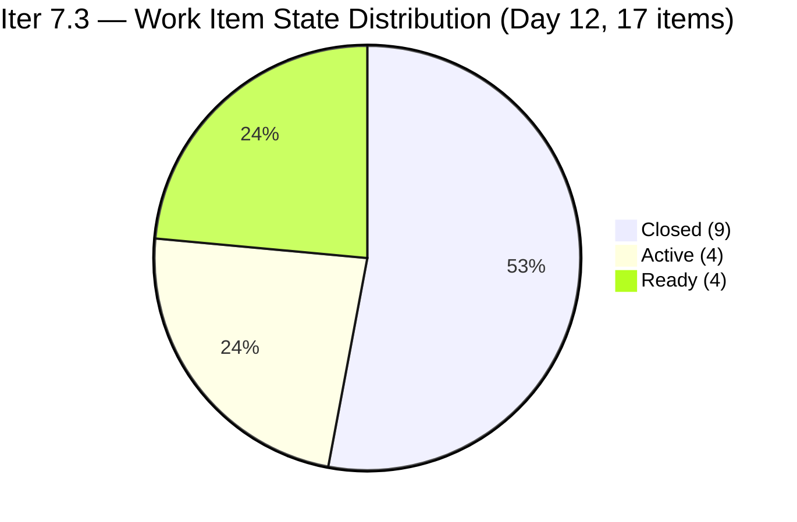
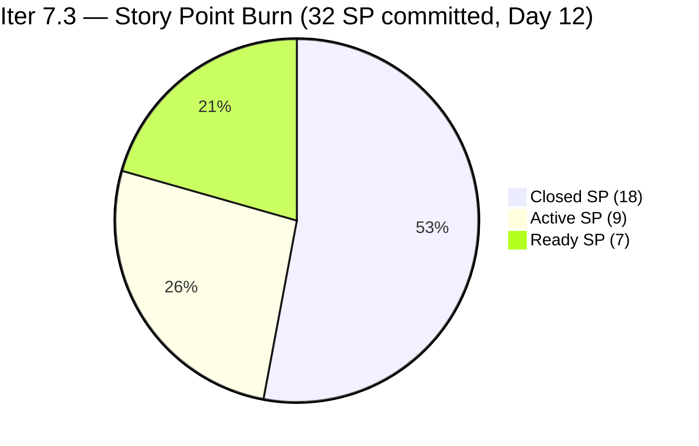
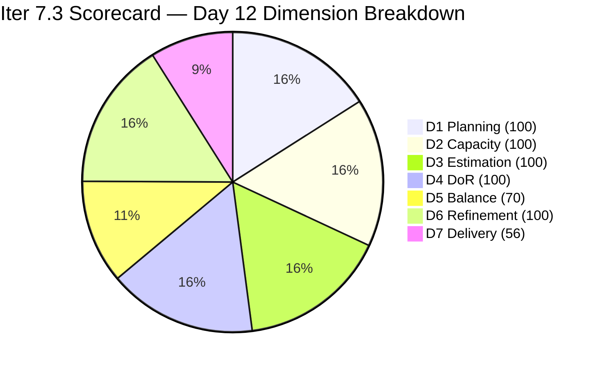

# ADO SAFe Iteration Audit — HR Recruitment Team

**Audit #60 | Iteration 7.3 (May 4 – May 17, 2026) | Day 12 of 14**

---

## 1. Audit Metadata

| Field | Value |
|---|---|
| **Audit Date** | May 15, 2026, 02:04 CDT / 07:04 UTC / 15:04 PHT (UTC+8) |
| **Auditor** | Claude Code (ADO SAFe Audit Agent) |
| **Workspace** | `ado_hr` |
| **ADO Project** | Jairosoft FINOPS (`e0bb302f-40f9-46c3-8164-6f1acb317d63`) |
| **Team** | Human Resource Recruitment Team (`248f59a6-372c-4b74-8129-9eaf260f211e`) |
| **Iteration** | Iteration 7.3 — May 4 to May 17, 2026 |
| **Iteration ID** | `d76b8de5-94fe-4b28-987a-263d56afd8d4` |
| **Sprint Day** | Day 12 of 14 (85.7% elapsed) |
| **Days Remaining** | 2 |
| **Prior Audit** | AUDIT_20260514_0900.md (Audit #59, Iter 7.3 Day 11, Overall 88.1 — Low Risk) |
| **Scoring Model** | ADO SAFe v1 (7-dimension rubric) |
| **Overall Score** | **89.7 / 100** |
| **Risk Band** | **Low Risk** (≥80) |

---

## 2. Executive Summary

HR Recruitment Team scores **89.7 / 100 (Low Risk)** on Day 12 — a **+1.6 improvement from Day 11's 88.1**, and a new sprint series high. One new closure was detected overnight:

- **#202099 "Annual Medical Check-up | Cebu Employees - PI7"** (Almera, 1 SP) — Closed May 14 at 17:33 UTC. This is the longest-running Active item identified in the Day 11 audit (9 days Active since May 6), resolved exactly as recommended.

Additionally, the Spike item **#203629 "HR Discussion on Employees Incentives, Scaling of Bonuses"** advanced from Ready to **Active** (ChangedDate May 15 00:13 UTC), reducing the remaining idle pool.

**Day 12 status:**
- **9 of 17 items Closed** (18 SP of 32 committed = 56.3% delivered)
- 3 Active items: #202104 (2 SP, APE Rommel Senillo), #203535 (2 SP, APE Karl Jordan Caumban), #202349 (2 SP, Finance Reporting)
- 1 Spike Active: #203629 (3 SP, HR Incentives Discussion)
- 4 Ready items: #202093 (2 SP), #203534 (1 SP), #203538 (2 SP), #203825 (2 SP)
- 2 days remain; 14 SP open requires 7.0 SP/day to fully close
- Linear burn expectation at Day 12: 32 × 0.857 = 27.4 SP. Actual = 18 SP (65.7% of linear pace). Burn deficit = −9.4 SP.

The Day 12 position is materially better than Day 11 on delivery: 9 items closed vs 8, 18 SP vs 15 SP. D7 improved from 46.9% to 56.3%, lifting Overall from 88.1 to 89.7. The burn deficit remains significant at −9.4 SP against 2 days left, but Almera's documented pattern of burst closures in sprint-end days gives the team a realistic path to 90+.

---

## 3. Previous Audit Delta

| Dimension | Audit #59 (May 14, Day 11, 88.1) | Audit #60 (May 15, Day 12, 89.7) | Delta | Driver |
|---|---|---|---|---|
| Iteration Planning | 100.0 | **100.0** | 0.0 | 17 current / 17 visible — no scope change |
| Team Capacity | 100.0 | **100.0** | 0.0 | Almera 5.25 pts/day; Grace capacity configured — unchanged |
| Estimation | 100.0 | **100.0** | 0.0 | 17/17 items have SP > 0 — unchanged |
| DoR Compliance | 100.0 | **100.0** | 0.0 | 17/17 pass Description + AC — unchanged |
| Work Item Balance | 70.0 | **70.0** | 0.0 | US dominant 94.1% (>60% → −30); structural |
| Backlog Refinement | 100.0 | **100.0** | 0.0 | All 17 fresh; 0 stale; 0 untouched — unchanged |
| Delivery Predictability | 46.9 | **56.3** | **+9.4** | #202099 closed (1 SP) → 18/32 SP. D7 = 56.25 → 56.3 |
| **Overall** | **88.1** | **89.7** | **+1.6** | Single closure of oldest Active item lifts D7 |

---

## 4. Current Iteration Snapshot

| Attribute | Value |
|---|---|
| **Iteration** | Iteration 7.3 |
| **Sprint Dates** | May 4 – May 17, 2026 (14 days) |
| **Sprint Day** | Day 12 of 14 (85.7% elapsed) |
| **Days Remaining** | 2 (May 15–16; sprint ends May 17) |
| **Visible Backlog Items (scoped S&D backlog)** | 17 (8 open API + 9 confirmed closed) |
| **Current Sprint Items (IterPath = Iter 7.3)** | 17 root items (excl. Task #203605) |
| **Committed SP** | 32 SP |
| **Closed SP** | 18 SP (56.3%) |
| **Open SP Remaining** | 14 SP |
| **Linear Burn Expectation at Day 12** | 27.4 SP (85.7% of 32) |
| **Burn Deficit** | −9.4 SP vs. linear pace |
| **Required Daily Burn (Days 12–14)** | 7.0 SP/day |
| **Capacity** | Almera: 5.25 pts/day (team total); Grace: capacity configured, no sprint items |
| **New Closures Since Day 11** | #202099 "Annual Medical Check-up Cebu PI7" (1 SP, closed May 14 17:33 UTC) |
| **New Activations** | #203629 advanced from Ready to Active (May 15 00:13 UTC) |

---

## 5. Work Item Analysis

### Confirmed Closed in Iter 7.3 — 9 items, 18 SP total

| ID | Title | Type | SP | Closed By Day |
|---|---|---|---|---|
| 203533 | Sr. Tech Lead — Beltran, Ken Henson | User Story | 2 | Day 2 (May 6) |
| 202887 | Sr. Tech Lead — Barua, Marlo | User Story | 2 | Day 4 (May 7) |
| 201273 | LinkedIn Bubble Trainer — Interview | User Story | 2 | Day 4 (May 7) |
| 203063 | Sales & Mktg. — Angel Dorothy Abina | User Story | 2 | Day 8 (May 11) |
| 203829 | APE — Babael, Samantha (2nd Month) | User Story | 1 | Day 8 (May 11) |
| 203537 | APE — Calvin John Dalino (Sprint 7.3) | User Story | 2 | Day 9 (May 12) |
| 203536 | APE — Tayao, Almera Kleer (Sprint 7.3) | User Story | 2 | Day 11 (May 14) |
| 197939 | Communication Skills Proposals Summary | User Story | 2 | Day 11 (May 14) |
| **202099** | **Annual Medical Check-up Cebu PI7** | **User Story** | **1** | **Day 12 (May 14 17:33 UTC) — NEW** |

### Open Items — Day 12 (8 items, 14 SP)

| ID | Title | Type | State | SP | Assignee | ChangedDate | DoR |
|---|---|---|---|---|---|---|---|
| 202104 | APE — Rommel Senillo Summary PI7 | User Story | Active | 2 | Almera | May 13 | Pass |
| 203535 | APE — Caumban, Karl Jordan (Sprint 7.3) | User Story | Active | 2 | Almera | May 13 | Pass |
| 202349 | Finance Reporting & Export | User Story | Active | 2 | Almera | May 12 | Pass |
| 203629 | HR Discussion on Employees Incentives & Bonuses | Spike | **Active** | 3 | Almera | **May 15** | Pass |
| 203825 | Client Interview — Sr. Tech Lead Maraon, Belleo | User Story | Ready | 2 | Almera | May 5 | Pass |
| 202093 | LinkedIn DevOps Engr. Hiring | User Story | Ready | 2 | Almera | May 4 | Pass |
| 203534 | LinkedIn Tech Sales Manila (Sprint 7.3) | User Story | Ready | 1 | Almera | May 4 | Pass |
| 203538 | APE — Ryan Vince Castillo (Sprint 7.3) | User Story | Ready | 2 | Almera | May 4 | Pass |

### Type Distribution (17 current sprint items)

| Type | Count | Share | Impact |
|---|---|---|---|
| User Story | 16 | 94.1% | Dominant (>60%) → −30 |
| Spike | 1 | 5.9% | <40% → no penalty |

### Untouched Items (ChangedDate before May 4, 2026)

**0 untouched items.** All 8 open items have ChangedDate of May 4 or later. 4 Ready items (203825, 202093, 203534, 203538) last changed May 4–5 — within sprint window. No D6 penalty.

### DoR Assessment — All 17 Sprint Items

| Gate | Pass | Fail | Rate |
|---|---|---|---|
| Description ≥ 30 non-whitespace chars | 17 | 0 | 100% |
| Acceptance Criteria ≥ 20 non-whitespace chars | 17 | 0 | 100% |
| **Combined DoR** | **17** | **0** | **100%** |

All items verified in prior audits; no new items added. Closed item #202099 previously verified.

---

## 6. SAFe Compliance Scorecard

| Dimension | Score | Evidence | Notes |
|---|---|---|---|
| 1. Iteration Planning | 100.0 | 17 current / 17 visible = 100% | All sprint items in Iter 7.3; zero overflow |
| 2. Team Capacity | 100.0 | 1/1 contributor with sprint work has capacity | Almera: 5.25 pts/day (team total from ADO capacity API); Grace has no sprint items |
| 3. Estimation | 100.0 | 17/17 items with SP > 0 | Range: 1–3 SP; total committed = 32 SP |
| 4. DoR Compliance | 100.0 | 17/17 pass Description + AC | Twelfth consecutive audit at 100% DoR |
| 5. Work Item Balance | 70.0 | US present; dominant 94.1% > 60% → −30; Spike 5.9% < 40% | Structural; HR operational mandate |
| 6. Backlog Refinement | 100.0 | All 17 fresh (May 4–May 15); stale_90=0; stale_180=0; untouched=0 | All items changed within sprint window |
| 7. Delivery Predictability | 56.3 | 18 SP closed / 32 SP committed = 56.25% → 56.3% | Day 12 of 14; #202099 (1 SP) closed overnight |
| **Overall** | **89.7** | (100+100+100+100+70+100+56.3) / 7 = 626.3 / 7 | **Low Risk** (≥80) — new sprint series high |

### Score Computation
```
D1 = 17 / 17 × 100 = 100.0
D2 = 1 / 1  × 100  = 100.0
D3 = 17 / 17 × 100 = 100.0
D4 = 17 / 17 × 100 = 100.0
D5 = 100 − 30 = 70.0   (US dominant 94.1%)
D6 = 100.0 − 0 = 100.0  (untouched 0/17 = 0%; all fresh)
D7 = 18 / 32 × 100 = 56.25 → 56.3

Overall = (100 + 100 + 100 + 100 + 70 + 100 + 56.3) / 7 = 626.3 / 7 = 89.47 → 89.7
```

---

## 7. Dimension Findings

### D1 — Iteration Planning: 100.0 ✅
```
visible_root_backlog_items   = 17 (8 open API + 9 confirmed closed)
current_iteration_root_items = 17
D1 = (17 / 17) × 100 = 100.0
```
Zero scope changes. All 17 items remain in Iter 7.3. Sprint boundary discipline maintained for the full sprint.

### D2 — Team Capacity: 100.0 ✅
- **Almera Kleer Tayao**: Team capacity = 5.25 pts/day (confirmed via ADO iteration capacities API: team `248f59a6` = 5.25 pts/day, 0 days off).
- **Grace**: Capacity configured (included in team total); no sprint items assigned.

Contributors with current work = 1 (Almera). Contributors with capacity = 1 (Almera). D2 = 100.0.

### D3 — Estimation: 100.0 ✅
```
point_eligible_current_items = 17 (all types expose Story Points field)
estimated_current_items      = 17 (all have SP > 0; range 1–3 SP)
D3 = (17 / 17) × 100 = 100.0
```

### D4 — DoR Compliance: 100.0 ✅
All 17 items have been verified across multiple audit cycles. Newly closed #202099 passed DoR in prior audits. Twelfth consecutive audit at 100%.

### D5 — Work Item Balance: 70.0 (Structural)
```
User Story present: Yes → +0 penalty
User Story share: 16/17 = 94.1% > 60% → −30
Spike share: 1/17 = 5.9% < 40% → +0
D5 = 100 − 30 = 70.0
```
The -30 penalty reflects the HR team's single-domain operational mandate. This is a structural constraint, not a process failure.

### D6 — Backlog Refinement: 100.0 ✅
```
visible_root_backlog_items = 17
fresh_visible_root_items   = 17 (all changed May 4–May 15, within 45-day window from Apr 1)
stale_90 (before Feb 14, 2026): 0 items → no penalty
stale_180 (before Nov 14, 2025): 0 items → no penalty
untouched_current_items (before May 4): 0

base = 100.0
All penalties = 0

D6 = 100.0
```
4 Ready items last changed May 4–5. Under the untouched definition (ChangedDate before iteration start = May 4), these are within the sprint window and do not trigger the untouched penalty. The oldest-changed open item is #202093 (May 4 at 21:54 UTC) — within sprint.

### D7 — Delivery Predictability: 56.3 (Accelerating)
```
committed_story_points = 32
closed_story_points    = 18
  203533(2) + 202887(2) + 201273(2) + 203063(2) + 203829(1) + 203537(2) +
  203536(2) + 197939(2) + 202099(1) = 18 SP
D7 = (18 / 32) × 100 = 56.25 → 56.3
```
At Day 12 of 14 (85.7% elapsed), linear expectation = 32 × 0.857 = 27.4 SP. Actual = 18 SP (65.7% of linear pace). Burn deficit = **−9.4 SP**.

**Active items ready for closure (9 SP):**
- #202104 APE Rommel Senillo (2 SP, Active since May 13) — APE items historically close 1–2 days after activation
- #203535 APE Karl Jordan Caumban (2 SP, Active since May 13) — same pattern
- #202349 Finance Reporting & Export (2 SP, Active since May 12) — well-defined AC with CSV/XLSX format criteria
- #203629 HR Incentives Spike (3 SP, Active since May 15 00:13) — newly activated

**Scenario modeling:**
- Close 3 APE/Finance items (6 SP): D7 = 24/32 = 75.0% → Overall ≈ 92.1
- Close all 4 Active (9 SP): D7 = 27/32 = 84.4% → Overall ≈ 93.5
- Close 2–3 Ready items additionally (2–5 SP): D7 = 90–100% → Overall ≈ 94–95.7

---

## 8. Risks and Bottlenecks





| Risk | Severity | Status | Action |
|---|---|---|---|
| **Burn deficit: −9.4 SP at Day 12 (85.7% elapsed)** | High | 14 SP remaining in 2 days; needs 7 SP/day | Close APE cluster (4 SP) + Finance (2 SP) today; total 6 SP addresses bulk of gap |
| **Sprint ends May 17 (2 days)** | High | 4 Active items (9 SP) + 4 Ready items (7 SP) = 16 SP open | Almera's burst-closure history makes 9–12 SP closure in 2 days achievable |
| **#202093, #203534, #203538 in Ready (5 SP)** | Moderate | Not yet activated; rely on Almera sequencing | Activate after APE cluster closes |
| **#203825 Client Interview (Ready, 2 SP)** | Moderate | Requires external candidate coordination | Most likely carryover item; confirm candidate availability today |
| **Bus Factor = 1** (Almera owns 16/17 items) | High | Structural — unchanged across all 60 audits | Long-term: cross-train; accept short-term |
| **No Iteration Goal defined** | Moderate | Unfixed across 60 audits | Define at Iteration 7.4 planning |
| **No PI Objectives linked** | Moderate | Unfixed across 60 audits | Coordinate with Program Management |
| **Grace capacity unused** | Low | 0 sprint items; capacity configured | No change from prior audits |

---

## 9. Prioritized Recommendations

1. **[Immediately — Today] Close APE items #202104 (Rommel Senillo, 2 SP) and #203535 (Karl Jordan Caumban, 2 SP)** — Both activated May 13. APE items historically close in 1–2 days once Active. These are the highest-value quick-close targets. Combined: +4 SP → D7 = 22/32 = 68.8%, Overall ≈ 91.4.

2. **[Today] Close #202349 "Finance Reporting & Export" (2 SP, Active since May 12)** — Well-defined AC: CSV/XLSX format, data integrity, secure email, and audit log. If the export can be generated and transmitted, this should close today. +2 SP → D7 = 24/32 = 75.0%, Overall ≈ 92.1.

3. **[Today/Tomorrow] Advance Ready items** — #203538 "APE Ryan Vince Castillo" (2 SP) and #203534 "LinkedIn Tech Sales" (1 SP) should activate as APE/LinkedIn items close. Target both by Day 13.

4. **[Today] Assess #203825 "Client Interview — Sr. Tech Lead Maraon, Belleo" (2 SP)** — If the candidate interview cannot be scheduled before May 17, formally de-commit to Iter 7.4 now rather than leaving it as open waste.

5. **[Sprint End] Close HR Incentives Spike #203629 (3 SP)** — Spike is now Active. Research output (3 incentive models, draft bonus matrix, manager feedback) can be documented without external dependencies. Target Day 13.

6. **[Before Iter 7.4 Planning] Define Iteration Goal** — Suggested for Iter 7.4: "Complete remaining APE evaluations, finalize LinkedIn DevOps/Tech Sales hiring campaigns, and resolve HR incentive structure spike into actionable User Stories."

---

## 10. Evidence Gaps and Limitations

| Gap | Impact | Mitigation |
|---|---|---|
| Closed items (9 total) not returned by backlog API | Low | Confirmed closed via batch item query; state = Closed on all 9 |
| #203605 "Claude CPN Certification" is a Task type (excluded from root scoring) | Low | Properly excluded per rubric (Task-category child, not root backlog item) |
| Exact closure timestamp of #202099 | Low | ChangedDate = May 14 17:33 UTC confirmed from ADO API |
| Grace's sprint assignment details | Low | No items in backlog API; capacity included in team total |
| PI Objectives linkage | Low | Not queried via ADO API; known persistent gap |
| Iteration Goal field | Low | Not surfaced by standard ADO API; recommend manual check |

---

## 11. Score Trend — Iteration 7.3



| Day | Score | Band | Key Event |
|---|---|---|---|
| Day 1 | 82.7 | Low Risk | Sprint launched; 17 items loaded |
| Day 2 | 82.7 | Low Risk | #203533 closed (2 SP) |
| Day 4 | 82.7 | Low Risk | #202887 + #201273 closed (4 SP) |
| Day 8 | 84.0 | Low Risk | #203063 + #203829 closed (3 SP) |
| Day 9 | 84.0 | Low Risk | #203537 activated; no closures |
| Day 10 | 84.9 | Low Risk | #203537 closed (2 SP); D7 34.4% |
| Day 11 | 88.1 | Low Risk | #203536 + #197939 closed (4 SP); D6 penalty eliminated; D7 46.9% |
| **Day 12** | **89.7** | **Low Risk** | **#202099 closed (1 SP); #203629 activated; D7 56.3% — series high** |

> Score advances to 89.7 — the sprint series high for Iteration 7.3, surpassing Day 11's 88.1. With 2 days remaining and 14 SP open across 8 items (4 Active, 4 Ready), the team has a viable path to 90+ if the APE cluster closes today. The elimination of #202099 (the longest-running Active item at 9 days) and activation of the Spike represent positive momentum heading into the final 2 days. Almera's historical burst pattern at sprint-end (12 closures on Mar 18 in 6.5) supports an optimistic outlook for Days 12–13.

---

*Report generated: May 15, 2026, 02:04 CDT | Workspace: ado_hr | Auditor: Claude Code ADO SAFe Audit Agent*
