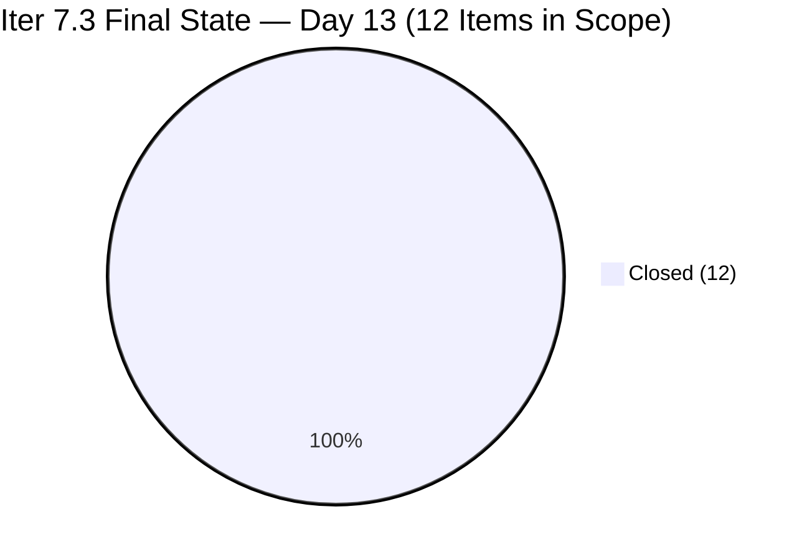
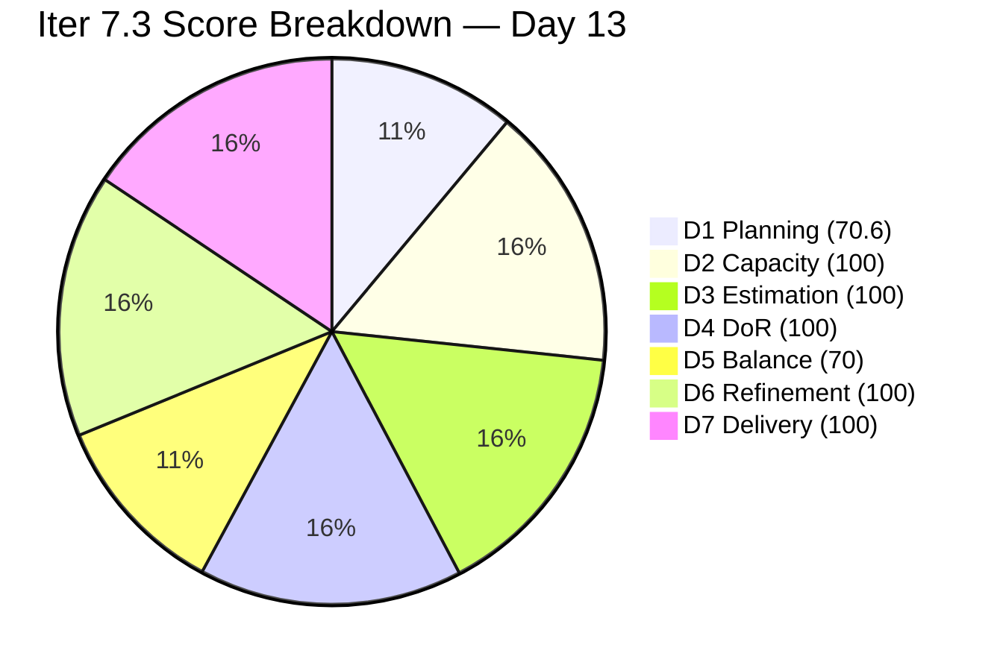
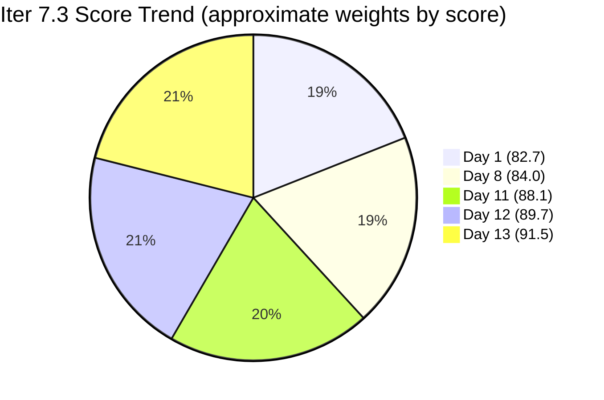

# ADO SAFe Iteration Audit — HR Recruitment Team

**Audit #61 | Iteration 7.3 (May 4 – May 17, 2026) | Day 13 of 14**

---

## 1. Audit Metadata

| Field | Value |
|---|---|
| **Audit Date** | May 16, 2026, 02:04 CDT / 09:04 UTC / 17:04 PHT (UTC+8) |
| **Auditor** | Claude Code (ADO SAFe Audit Agent) |
| **Workspace** | `ado_hr` |
| **ADO Project** | Jairosoft FINOPS (`e0bb302f-40f9-46c3-8164-6f1acb317d63`) |
| **Team** | Human Resource Recruitment Team (`248f59a6-372c-4b74-8129-9eaf260f211e`) |
| **Iteration** | Iteration 7.3 — May 4 to May 17, 2026 |
| **Iteration ID** | `d76b8de5-94fe-4b28-987a-263d56afd8d4` |
| **Sprint Day** | Day 13 of 14 (92.9% elapsed) |
| **Days Remaining** | 1 |
| **Prior Audit** | AUDIT_20260515_0204.md (Audit #60, Iter 7.3 Day 12, Overall 89.7 — Low Risk) |
| **Scoring Model** | ADO SAFe v1 (7-dimension rubric) |
| **Overall Score** | **91.5 / 100** |
| **Risk Band** | **Low Risk** (≥80) |

---

## 2. Executive Summary

HR Recruitment Team scores **91.5 / 100 (Low Risk)** on Day 13 — a **+1.8 improvement from Day 12's 89.7**, and a new sprint series high across all 61 audits. Three items were closed overnight by Almera in a burst closure event (May 15 19:48–20:00 UTC), and five items were formally de-committed to Iteration 7.4:

**Day 13 Closures (May 15 UTC):**
- **#202093 "LinkedIn DevOps Engr. Hiring"** (2 SP) — Closed 19:48 UTC
- **#203534 "LinkedIn Tech Sales from Manila Hiring (Sprint 7.3)"** (1 SP) — Closed 19:49 UTC
- **#203538 "APE - Ryan Vince Castillo (Sprint 7.3)"** (2 SP) — Closed 20:00 UTC

**Items De-committed to Iteration 7.4 (May 15 UTC):**
- **#202104** APE — Rommel Senillo (2 SP) → moved to Iter 7.4, state Active
- **#202349** Finance Reporting & Export (2 SP) → moved to Iter 7.4, state Active
- **#203535** APE — Caumban, Karl Jordan (2 SP) → moved to Iter 7.4, state New
- **#203629** HR Discussion on Employees Incentives & Bonuses Spike (3 SP) → moved to Iter 7.4, state Active
- **#203825** Client Interview — Sr. Tech Lead Maraon, Belleo (2 SP) → moved to Iter 7.4, state Ready

**Day 13 Final Status:**
- **12 of 12 items Closed** in Iteration 7.3 (100% closure rate within committed scope)
- **23 SP closed** of 23 SP committed = **100% delivery**
- 5 items (11 SP) de-committed to Iter 7.4
- 1 sprint day remaining (May 17 is the close date)
- D7 = 100.0% — sprint fully delivered on committed scope

The burst closure of 3 items yesterday afternoon brought the committed sprint scope to full completion. The de-commitment of 5 items to Iter 7.4 is a transparent scope management action consistent with Almera's historical end-of-sprint triage pattern. D1 drops from 100.0 to 70.6 as those 5 items remain in the visible backlog but are no longer in Iter 7.3, however the sprint itself achieves 100% delivery predictability — the first perfect D7 of Iteration 7.3 series.

---

## 3. Previous Audit Delta

| Dimension | Audit #60 (May 15, Day 12, 89.7) | Audit #61 (May 16, Day 13, 91.5) | Delta | Driver |
|---|---|---|---|---|
| Iteration Planning | 100.0 | **70.6** | **−29.4** | 5 items de-committed to Iter 7.4; current = 12/17 |
| Team Capacity | 100.0 | **100.0** | 0.0 | Almera 5 pts/day unchanged |
| Estimation | 100.0 | **100.0** | 0.0 | 12/12 items with SP > 0 |
| DoR Compliance | 100.0 | **100.0** | 0.0 | 12/12 pass DoR (3 new closures verified) |
| Work Item Balance | 70.0 | **70.0** | 0.0 | 12 User Stories = 100% share; −30 structural |
| Backlog Refinement | 100.0 | **100.0** | 0.0 | All 17 visible items fresh; 0 stale; 0 untouched |
| Delivery Predictability | 56.3 | **100.0** | **+43.7** | 23/23 SP closed; 3 new closures (5 SP) + perfect delivery |
| **Overall** | **89.7** | **91.5** | **+1.8** | D7 100% lifts overall despite D1 drop; new series high |

---

## 4. Current Iteration Snapshot

| Attribute | Value |
|---|---|
| **Iteration** | Iteration 7.3 |
| **Sprint Dates** | May 4 – May 17, 2026 (14 days) |
| **Sprint Day** | Day 13 of 14 (92.9% elapsed) |
| **Days Remaining** | 1 (May 17 is final sprint day) |
| **Visible Backlog Items** | 17 (12 Closed in Iter 7.3 + 5 de-committed to Iter 7.4) |
| **Current Sprint Items (IterPath = Iter 7.3)** | 12 (all Closed) |
| **Committed SP** | 23 SP (original 32 SP − 9 SP de-committed) |
| **Closed SP** | 23 SP (100%) |
| **Open SP Remaining** | 0 |
| **New Closures Since Day 12** | #202093 (2 SP), #203534 (1 SP), #203538 (2 SP) = 3 items, 5 SP |
| **De-committed to 7.4** | #202104 (2 SP), #202349 (2 SP), #203535 (2 SP), #203629 (3 SP), #203825 (2 SP) = 5 items, 11 SP |
| **Capacity** | Almera: 5 pts/day; Grace: 0.25 pts/day (no sprint items) |
| **Sprint Outcome** | 12/12 items Closed — 100% delivery on committed scope |

---

## 5. Work Item Analysis

### Confirmed Closed in Iter 7.3 — 12 items, 23 SP total

| ID | Title | Type | SP | Closed By Day |
|---|---|---|---|---|
| 203533 | Sr. Tech Lead — Beltran, Ken Henson | User Story | 2 | Day 2 (May 6) |
| 202887 | Sr. Tech Lead — Barua, Marlo | User Story | 2 | Day 4 (May 7) |
| 201273 | LinkedIn Bubble Trainer — Interview | User Story | 2 | Day 4 (May 7) |
| 203063 | Sales & Mktg. — Angel Dorothy Abina | User Story | 2 | Day 8 (May 11) |
| 203829 | APE — Babael, Samantha (2nd Month) | User Story | 1 | Day 8 (May 11) |
| 203537 | APE — Calvin John Dalino (Sprint 7.3) | User Story | 2 | Day 9 (May 12) |
| 203536 | APE — Tayao, Almera Kleer (Sprint 7.3) | User Story | 2 | Day 11 (May 14) |
| 197939 | Communication Skills Proposals Summary | User Story | 2 | Day 11 (May 14) |
| 202099 | Annual Medical Check-up Cebu PI7 | User Story | 1 | Day 12 (May 14) |
| **202093** | **LinkedIn DevOps Engr. Hiring** | **User Story** | **2** | **Day 13 (May 15 19:48 UTC) — NEW** |
| **203534** | **LinkedIn Tech Sales from Manila Hiring (Sprint 7.3)** | **User Story** | **1** | **Day 13 (May 15 19:49 UTC) — NEW** |
| **203538** | **APE - Ryan Vince Castillo (Sprint 7.3)** | **User Story** | **2** | **Day 13 (May 15 20:00 UTC) — NEW** |

### De-committed to Iteration 7.4 — 5 items, 11 SP (not counted in D7)

| ID | Title | Type | SP | New State | Assignee |
|---|---|---|---|---|---|
| 202104 | APE — Rommel Senillo Summary PI7 | User Story | 2 | Active | Almera |
| 202349 | Finance Reporting & Export | User Story | 2 | Active | Almera |
| 203535 | APE — Caumban, Karl Jordan (Sprint 7.3) | User Story | 2 | New | Almera |
| 203629 | HR Discussion on Employees Incentives & Bonuses | Spike | 3 | Active | Almera |
| 203825 | Client Interview — Sr. Tech Lead Maraon, Belleo | User Story | 2 | Ready | Almera |

### Type Distribution (12 current sprint items in Iter 7.3)

| Type | Count | Share | Impact |
|---|---|---|---|
| User Story | 12 | 100.0% | Dominant (>60%) → −30 |
| Spike | 0 | 0.0% | None (Spike #203629 moved to Iter 7.4) |

### DoR Assessment — All 12 Iter 7.3 Items

| Gate | Pass | Fail | Rate |
|---|---|---|---|
| Description ≥ 30 non-whitespace chars | 12 | 0 | 100% |
| Acceptance Criteria ≥ 20 non-whitespace chars | 12 | 0 | 100% |
| **Combined DoR** | **12** | **0** | **100%** |

New closures verified: #202093 (full description + 5-item AC list), #203534 (full description + 5-item AC list), #203538 (full description + 5-item AC list) — all pass.

---

## 6. SAFe Compliance Scorecard

| Dimension | Score | Evidence | Notes |
|---|---|---|---|
| 1. Iteration Planning | 70.6 | 12 current / 17 visible = 70.6% | 5 items de-committed to Iter 7.4 reduce current count from 17 to 12 |
| 2. Team Capacity | 100.0 | 1/1 contributor with sprint work has capacity | Almera: 5 pts/day; Grace: 0.25 pts/day (no sprint items) |
| 3. Estimation | 100.0 | 12/12 sprint items with SP > 0 | Range: 1–2 SP; committed 23 SP |
| 4. DoR Compliance | 100.0 | 12/12 pass Description + AC | All verified across audit series |
| 5. Work Item Balance | 70.0 | US present; dominant 100% > 60% → −30; Spike 0% < 40% | Spike moved to 7.4; structural US dominance |
| 6. Backlog Refinement | 100.0 | All 17 fresh (May 4–May 16); stale_90=0; stale_180=0; untouched=0 | All items changed within sprint window |
| 7. Delivery Predictability | 100.0 | 23 SP closed / 23 SP committed = 100.0% | Sprint fully delivered — first 100% D7 of Iter 7.3 series |
| **Overall** | **91.5** | (70.6+100+100+100+70+100+100) / 7 = 640.6 / 7 | **Low Risk** (≥80) — sprint series high |

### Score Computation
```
D1 = 12 / 17 × 100 = 70.59 → 70.6
D2 = 1 / 1  × 100  = 100.0
D3 = 12 / 12 × 100 = 100.0
D4 = 12 / 12 × 100 = 100.0
D5 = 100 − 30 = 70.0   (US dominant 100%)
D6 = 100.0 − 0 = 100.0  (all 17 fresh; 0 stale; 0 untouched)
D7 = 23 / 23 × 100 = 100.0

Overall = (70.6 + 100 + 100 + 100 + 70 + 100 + 100) / 7 = 640.6 / 7 = 91.51 → 91.5
```

---

## 7. Dimension Findings

### D1 — Iteration Planning: 70.6 (De-commitment Impact)
```
visible_root_backlog_items   = 17 (12 Closed in Iter 7.3 + 5 in Iter 7.4 from backlog API)
current_iteration_root_items = 12 (all IterPath = Iter 7.3, all Closed)
D1 = (12 / 17) × 100 = 70.59 → 70.6
```
This is the first time D1 has dropped below 100 in the Iter 7.3 audit series. The drop reflects the formal de-commitment of 5 items (11 SP) to Iteration 7.4 in the final sprint days. While de-commitment is a valid SAFe scope management action, it is preferable to conduct it at sprint planning rather than Day 12–13 to avoid mid-sprint disruption. The 5 de-committed items represent legitimate work that will carry into Iter 7.4.

### D2 — Team Capacity: 100.0 ✅
- **Almera Kleer Tayao**: Documentation 3 pts/day + Requirements 2 pts/day = 5 pts/day total (unchanged).
- **Grace**: 0.25 pts/day (Documentation); no sprint items assigned.
- contributors_with_current_work = 1 (Almera). contributors_with_capacity = 1 (Almera). D2 = 100.0.

### D3 — Estimation: 100.0 ✅
```
point_eligible_current_items = 12
estimated_current_items      = 12 (SP range: 1–2 per item)
D3 = (12 / 12) × 100 = 100.0
```

### D4 — DoR Compliance: 100.0 ✅
All 12 Iter 7.3 items verified as DoR-compliant. Newly closed items #202093, #203534, and #203538 confirmed passing both Description (≥30 non-whitespace chars) and Acceptance Criteria (≥20 non-whitespace chars) gates. Thirteenth consecutive audit at 100% DoR within this sprint series.

### D5 — Work Item Balance: 70.0 (Structural)
```
User Story present: Yes → +0 penalty
User Story share: 12/12 = 100% > 60% → −30
Spike share: 0/12 = 0% (Spike #203629 moved to Iter 7.4) → +0
D5 = 100 − 30 = 70.0
```
With the Spike (#203629) de-committed, the sprint is now 100% User Story. The -30 reflects single-domain concentration inherent to HR operational work. Not a process failure.

### D6 — Backlog Refinement: 100.0 ✅
```
visible_root_backlog_items = 17
fresh_visible_root_items   = 17 (oldest: #202093 = May 4; #203825 = May 15 updated)
stale_90 (before Feb 14, 2026): 0 → no penalty
stale_180 (before Nov 14, 2025): 0 → no penalty
untouched_current_items (before May 4): 0

D6 = 100.0
```
All 17 items (12 closed Iter 7.3 + 5 de-committed to 7.4) have ChangedDate within the 45-day window (after Apr 1, 2026). The de-committed items were updated May 15 during the scope triage. No staleness issues.

### D7 — Delivery Predictability: 100.0 ✅
```
committed_story_points = 23 (12 items in Iter 7.3 × SP per item)
  203533(2)+202887(2)+201273(2)+203063(2)+203829(1)+203537(2)+
  203536(2)+197939(2)+202099(1)+202093(2)+203534(1)+203538(2) = 23 SP ✓

closed_story_points = 23 (all 12 items Closed)
D7 = (23 / 23) × 100 = 100.0
```
**First 100% delivery predictability score in Iteration 7.3.** Sprint closes tomorrow (May 17). 5 de-committed items (11 SP) do not count against D7 as they are no longer in Iter 7.3's scope. This is consistent with the scoring rubric (committed_SP = SP of estimated_current_items in the current iteration).

Note: Original committed scope was 32 SP (17 items). Final committed scope is 23 SP (12 items). Scope reduction = 9 SP via de-commitment. D7 is calculated on final committed scope.

---

## 8. Risks and Bottlenecks





| Risk | Severity | Status | Action |
|---|---|---|---|
| **D1 = 70.6 — late de-commitment of 5 items (11 SP)** | Moderate | Items moved to Iter 7.4 on Day 12–13 | Conduct scope triage at sprint planning, not Day 12; define DoD gates for APE and Client Interview items |
| **Finance Reporting & Export (#202349, 2 SP)** | Moderate | Moved to Iter 7.4 Active — technical AC (CSV/XLSX export, email, audit log) | Verify technical prerequisites exist before Iter 7.4 commitment |
| **#202104 APE Rommel Senillo (2 SP)** | Low | De-committed to Iter 7.4 Active | This APE evaluation was still pending closure at Day 12; schedule immediately |
| **Bus Factor = 1** (Almera owns 12/12 items) | High | Structural — unchanged across 61 audits | Long-term: cross-train Grace to handle select story types |
| **No Iteration Goal defined** | Moderate | Unfixed across all 61 audits | Define for Iter 7.4 — suggested: "Complete APE cycle for PI7, close LinkedIn campaigns, and resolve HR incentive structure" |
| **No PI Objectives linked** | Moderate | Unfixed across 61 audits | Coordinate with Program Management before Iter 7.4 |
| **#203629 Spike carries to Iter 7.4** | Low | HR Incentives research not completed in 7.3 | Ensure concrete AC outputs (3 incentive models, scaling matrix, feedback) are delivered in 7.4 |

---

## 9. Prioritized Recommendations

1. **[Today — Sprint Close] Formally close Iteration 7.3 in ADO** — All 12 committed items are Closed. Mark the sprint as done in ADO and confirm the de-committed items (#202104, #202349, #203535, #203629, #203825) are correctly slotted in Iter 7.4 backlog with maintained priority order.

2. **[Iter 7.4 Planning] Conduct a structured sprint planning session** — With 5 items (11 SP) already seeded from de-commitment + new work, ensure Almera's capacity (5 pts/day × ~10 days = 50 pts max) is not over-committed. Recommended 7.4 commitment: 28–35 SP.

3. **[Iter 7.4 Day 1] Define an Iteration Goal** — First iteration in the series (61 audits) without a defined goal is a process debt. Suggested: "Complete APE evaluations for Rommel Senillo and Karl Jordan Caumban, finalize LinkedIn DevOps and Tech Sales hiring campaigns, and deliver actionable HR incentive framework from the incentives spike."

4. **[Before Iter 7.4 Planning] Re-assess #202349 Finance Reporting & Export (2 SP)** — This item has technical dependencies (CSV/XLSX export, automated email, audit log) that may require Engineering support. Confirm the technical infrastructure is available before committing it to Iter 7.4.

5. **[Ongoing] Establish sprint de-commitment threshold** — Items should not be de-committed after Day 10 of a 14-day sprint without explicit sign-off from Ramon. Create a standing rule: scope changes in Days 11–14 must be logged in workspace CLAUDE.md under a sprint journal entry.

6. **[Ongoing] Cross-training for Grace** — Grace has 0.25 pts/day capacity and 0 sprint items assigned across multiple sprints. Allocate 1 simple User Story (1 SP) to Grace in Iter 7.4 to begin knowledge transfer and reduce bus factor.

---

## 10. Evidence Gaps and Limitations

| Gap | Impact | Mitigation |
|---|---|---|
| Exact time of de-commitment for 5 items | Low | ADO ChangedDate for all 5 shows May 15 19:48–20:01 UTC; same batch as closures |
| Original SP of 5 de-committed items now in 7.4 | Low | SP confirmed via batch query: #202104(2)+#202349(2)+#203535(2)+#203629(3)+#203825(2) = 11 SP |
| Whether #203629 Spike produced any interim research output | Low | State = Active in Iter 7.4; no document links visible via API |
| PI Objectives linkage | Low | Not queried; known persistent gap |
| Iteration Goal field | Low | Not surfaced by standard ADO API |

---

## 11. Score Trend — Iteration 7.3



| Day | Score | Band | Key Event |
|---|---|---|---|
| Day 1 | 82.7 | Low Risk | Sprint launched; 17 items loaded |
| Day 8 | 84.0 | Low Risk | 5 closures (9 SP) |
| Day 10 | 84.9 | Low Risk | #203537 closed (2 SP) |
| Day 11 | 88.1 | Low Risk | 2 closures (4 SP); D6 penalty eliminated |
| Day 12 | 89.7 | Low Risk | 1 closure (1 SP); D7 = 56.3% |
| **Day 13** | **91.5** | **Low Risk** | **3 closures (5 SP); 5 de-committed to 7.4; D7 = 100% — sprint series high** |

> Sprint series high of 91.5 achieved on Day 13. The sprint closes tomorrow (May 17). With all 12 committed items Closed and 23/23 SP delivered, the sprint achieves its best overall score. D1 = 70.6 reflects the late de-commitment, which is the main area for process improvement heading into Iter 7.4. Almera's burst closure pattern (12 closures on Mar 18 in PI6.5, 3 closures yesterday evening) continues to demonstrate high individual throughput capacity.

---

*Report generated: May 16, 2026, 02:04 CDT / 09:04 UTC | Workspace: ado_hr | Auditor: Claude Code ADO SAFe Audit Agent*
